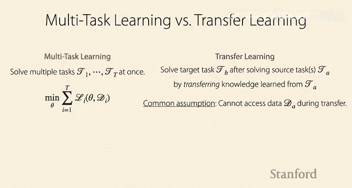
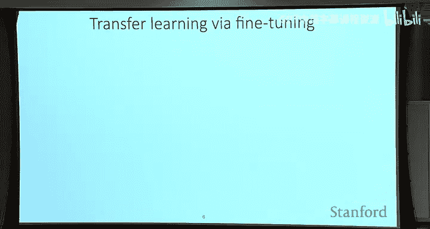
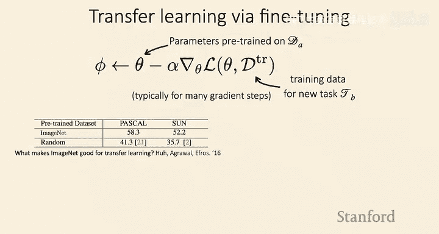
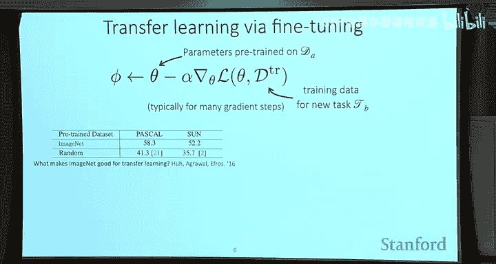
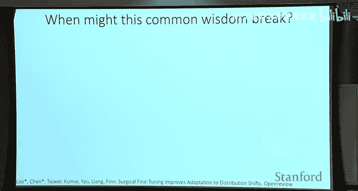
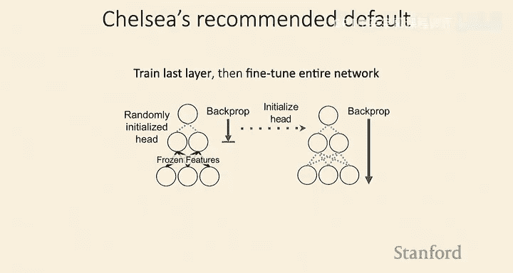
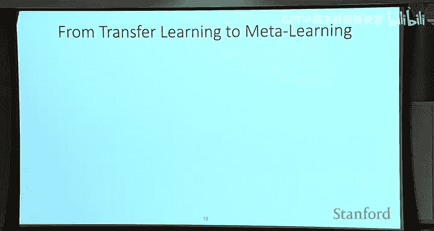
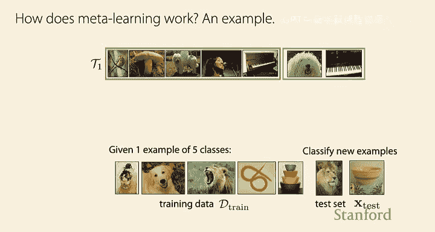
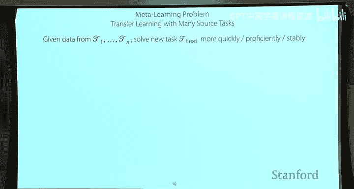
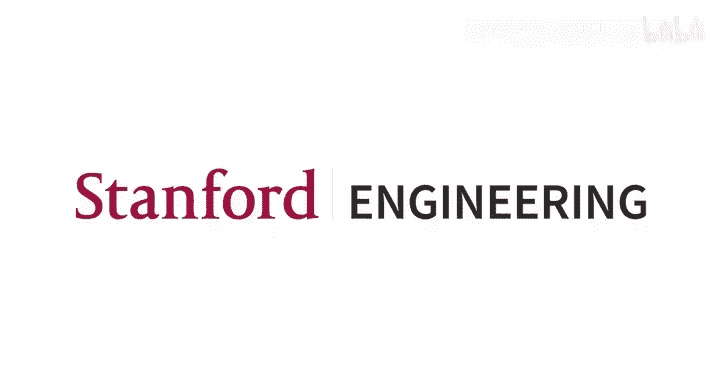

# 3：迁移学习与元学习入门 🎯

在本节课中，我们将要学习迁移学习与元学习的基本概念。我们将从迁移学习的定义和经典方法（微调）开始，探讨其背后的设计选择与常见实践。随后，我们将引入元学习的概念，从概率图模型和机制化两个视角来理解其核心思想，即如何通过学习多个任务来优化快速学习新任务的能力。

---

## 课程安排与公告 📢

在开始之前，有一些课程安排需要说明。

作业零的截止时间是今晚11点59分。
作业一现已发布，截止时间为下周三。
我们将在今天发布一些项目相关的资源。

以下是即将发布的资源列表：
*   **项目创意**：如果你不确定做什么项目，这些创意会很有帮助。
*   **往年项目示例**：这些示例可以让你了解过去这门课的学生都做了哪些项目。
*   **兴趣与合作者匹配表**：如果你希望找到有相似兴趣的同学合作项目，可以填写这个表单。我们会发布表单的回复，帮助你建立联系。

这个表单是可选的，主要是为了帮助你寻找合作者。

另一个重要的公告是关于AI代码补全工具的使用政策。
目前，对于在课程项目中使用这类工具，我们没有严格的规定。
我们认为在项目中使用这些工具是可以接受的。
但是，在完成作业时，不允许使用这些工具，因为你应该真正理解自己编写的代码，而不是让AI替你完成作业。

最后，你们的反馈对我们改进课程体验非常重要。
从本周开始，我们将进行“高分辨率反馈”活动。
每周会随机抽取一部分同学填写反馈表，告诉我们课程的进展等情况。
我们不会每周都让所有同学填写，以减轻大家的负担，同时也能在整个课程期间持续收集反馈。

另外，我们已经确定了课程后期的客座讲师。
我们很高兴邀请到Ho和Percy来做客座讲座。
Ho在谷歌工作，在迁移学习和深度学习理解方面做了很多出色的工作。
Percy在斯坦福大学，他在基础模型、自然语言处理和理解涌现的少样本学习方面做了大量工作。
我很期待在课程后期看到这些讲座。

以上就是所有的课程安排。所有信息都会发布在课程网站上，项目资源会发布在Ed上。

---

## 上节课回顾 🔄

上一讲我们讨论了多任务学习。
我们将任务定义为一组数据生成分布，从中采样出训练集和测试集，每个任务还有一个对应的损失函数。
我们可以将学习一个任务看作是以数据集为输入，预测一组模型参数的过程。
我们讨论了多任务学习，即训练一个以任务描述符Z为条件的神经网络，根据该任务描述符对输入进行预测。
我们讨论了如何通过不同方式对Z进行条件化，来影响参数共享的程度。
如果你观察到负迁移，可能需要考虑减少信息共享，并设计相应的架构和条件化方式。
反之，如果观察到过拟合，你可能需要尝试增加参数共享。
最后，我们讨论了多任务学习的目标函数，以及如果对标签进行归一化，那么直接相加损失并优化是一个很好的选择，但你也可能希望通过调整任务权重来影响任务的优先级。

以上是对上节课的简要回顾。

---

## 本节课计划 📋

今天的计划是，我们先讨论迁移学习及其问题定义。
然后，我们将开始讨论元学习的问题定义，以及我们如何理解元学习的本质。
这部分内容将涉及作业一的开始，周三的讲座将涵盖完成作业一所需的其他内容。

今天的学习目标包括：
*   思考如何将知识从一个任务迁移到另一个任务。
*   理解多个任务具有某种“共享结构”意味着什么（这是我们上周一直在讨论的一个有些模糊的概念）。
*   理解什么是元学习。

---

## 迁移学习 🚚

在之前的讲座中，我们讨论了如何同时解决多个任务。
而在迁移学习中，情况有所不同。

在迁移学习中，我们的目标通常是在解决了一个或多个源任务之后，去解决一个特定的目标任务。
我们的目标是，在尝试解决目标任务B时，能够迁移一些在任务A中学到的知识。
这里一个常见的假设是，在尝试解决任务B时，通常无法访问任务A的数据。
因此，你基本上希望将关于任务A的所有信息或知识压缩到一些参数中，然后在处理任务B时使用这些压缩的知识。

需要指出的是，迁移学习可以被视为多任务学习的一种有效解决方案。
因为如果你想学习两个任务，可以先学习任务一，然后将其迁移以更有效地学习任务二，这样你就得到了任务一和任务二的解决方案。
然而，由于上述常见假设（无法在迁移过程中访问源任务数据），多任务学习通常不被认为是迁移学习的有效解决方案，因为你无法同时访问两个任务的数据集。

---

### 迁移学习的适用场景 💡

现在我已经介绍了这两种问题定义，我想知道你们对于在哪些场景下迁移学习可能比多任务学习更有意义有什么想法。

以下是一些适用场景：
*   **源任务数据量巨大**：你不想在解决任务B时保留这些数据并重新训练，而是希望将知识压缩并迁移。
*   **目标任务数据稀缺**：迁移学习在这种情况下很有用。
*   **任务间共享结构多**：这也是使用迁移学习的好场景。
*   **已有预训练模型可用**：如果你已经学习了任务A，或者可以直接从网上下载别人训练好的模型权重，那么你甚至不需要自己解决任务A，可以直接使用这些权重来解决任务B。
*   **任务未知或需快速适应**：你可能处于一个不知道所有任务的前期场景，或者需要快速适应新任务（例如在手机上针对特定用户进行适配）。

这些都是非常好的例子。

---

### 微调：迁移学习的核心方法 ⚙️

我们将讨论微调，这基本上是迁移学习的首选方法。

微调的工作原理是，我们取在任务A上训练好的权重（用θ表示），用这些权重初始化一个神经网络，然后在目标任务上以这些权重为起点运行梯度下降。

如果 `D_train` 是新任务的训练数据，那么你将计算梯度，并在初始化的θ处应用该梯度。图中只展示了一步梯度下降，但在实践中通常会进行多步。

这个过程的结果是，你将得到一组参数φ，希望这些参数在任务B上的表现比随机初始化θ要好得多。

实际上，如果比较随机初始化参数与使用对目标任务有效的数据集进行预初始化的参数，我们可以看到性能要好得多。
例如，有一个实验显示，在ImageNet上预训练的神经网络，相比于随机初始化，在Pascal和SUN这两个图像识别数据集上，性能有显著提升（大约16%到17%）。
这非常酷，本质上，它利用了ImageNet数据集中存在的丰富信息，在迁移到这些新任务时发挥了作用。

---

### 微调的设计选择与常见实践 🛠️

现在我们来谈谈微调中的各种设计选择。
很多这些设计选择都围绕着如何不破坏模型中已有的先验知识，并平衡先验知识与新数据集的知识。

一个常见情况是：你有一个在ImageNet上预训练的网络，输出层是1000维（对应1000个类别）。而你的目标任务可能只有两个标签（例如白板笔和白板擦）。
在这种情况下，你需要重新初始化最后一层，因为无法直接使用原来的输出层。你可以选择只使用其中两个类别的输出，或者在这些特征之上重新初始化一个新的网络层。

这里出现的问题是：如果你反向传播梯度通过整个网络，而新初始化的权重矩阵是随机的，那么你基本上是在用一些随机数乘以梯度，然后将这些梯度应用到网络的其余部分。这可能会破坏前面层中非常有价值的信息。

因此，有一些常见的做法：
1.  **使用较小的学习率**：尤其是对于网络的早期层，因为你不想让来自网络的梯度破坏这些特征。
2.  **冻结早期层**：只训练网络后面的部分。
3.  **从后往前逐步解冻**：先只训练最后几层，然后逐渐解冻并训练更前面的层。
4.  **重新初始化最后一层**：正如我们讨论过的。

如何在这些设计选择中做出决定？通常可以在目标任务上运行交叉验证来搜索这些设计选择和超参数。

另外值得一提的是，你选择的微调架构也会影响迁移性能。例如，具有残差连接的残差网络通常对微调更有效，因为它们在整个网络中提供了一种“高速公路”，使得梯度更容易传播到所有层。

---

### 打破常规认知的新研究 🔬

尽管有上述常见实践，但关于微调的知识并非一成不变。我想介绍两篇新论文（以机器学习标准来看，上周发表的论文也算“新”），它们打破了一些常规认知。

**第一篇论文**发现，对于无监督预训练方法，你并不一定需要一个非常多样化的数据集。
实验表明，在目标任务数据本身上进行无监督预训练，得到的性能与在大型多样化语料库上预训练的性能非常接近。
这打破了常规认知，因为常规认为我们需要非常多样化的预训练数据集。
需要注意的是，这预计只适用于无监督预训练的情况，对于有监督预训练则不然。

**第二篇论文**（由本课程的助教Yunho等人合著）探讨了是否只有最后一层对微调特别重要。
他们发现，在某些情况下（例如处理低层图像损坏时），微调网络的第一层比微调整个网络或仅微调最后一层效果更好。
甚至在某些情况下，微调中间层是最佳选择。
这表明我们并未完全理解微调，并且最佳策略可能因源任务和目标任务之间的差异类型而异。

尽管存在这些新发现，在实践中，如果你想使用微调，一个可靠且通常有效的默认策略是：**先训练网络的最后一层（或最后几层），然后再微调整个网络**。
这样做的原因正是为了避免破坏早期的特征。

---

### 数据量对微调性能的影响 📊

最后，我们看看微调性能如何随目标任务数据量的变化而变化。
随着目标任务数据量的增加，验证错误率会降低，这符合预期。
蓝线表示从头开始训练，绿线和橙线表示不同的预训练模型。
需要注意的是，如果只有100个目标任务数据点，性能远不如有更多数据时好。
当数据量非常少（例如只有100个示例）时，性能会变得很差。
而这正是元学习可以派上用场的地方。

---

## 从迁移学习到元学习 🧠

在迁移学习中，我们讨论了如何初始化模型，并希望这种初始化对目标任务有帮助。
元学习背后的关键直觉是：与其希望它有帮助，不如我们**显式地优化可迁移性**。

这意味着，如果我们不仅有一个源任务，而是有一组源任务，我们能否优化快速学习这些任务的能力，从而也能快速学习新任务？
你可以这样想：如果我们已经学会了如何快速学习一组任务，那么我们应该也能快速学习新任务。

从机制化的角度看，你可以想象一个深度神经网络，它以数据集为输入，并对新数据点进行预测。你希望使用这种形式的元数据集来优化这个深度神经网络，这样当你给它一个新任务的数据集时，它就能给出该任务的参数。

从概率角度看，如果我们有一组源任务，我们可以尝试从中提取共享的知识或结构，以一种能让我们高效学习新任务的方式。然后，当我们遇到新任务时，就利用这些先验知识来推断目标任务的参数。

---

### 元学习的概率图模型视角 📈

为了理解任务共享结构意味着什么，让我们从概率图模型（贝叶斯网络）的视角来看元学习。

首先，我们为单任务学习建立一个图模型。
我们有参数φ、输入x和标签y。y依赖于x和φ，因此有箭头从φ和x指向y。
如果我们有多个数据点，可以使用“板表示法”，用一个板（plate）圈住这些变量，并标注索引i，表示板内的结构对每个数据点i进行复制。

对于多任务学习（或元学习），我们会有多个任务。
我们用索引j表示任务，并添加一个外层的板。φ_j是任务j的参数。
这些参数共享某种结构，具体表现为它们都依赖于一个共享的潜在变量θ。
θ代表了任务间的共享信息，它是未被观察到的（潜在的）。
如果任务间没有依赖关系（即没有θ），那么它们就不共享任何结构。
如果存在对共享结构θ的依赖，那么它们确实共享一些信息。

**关键点**：如果我们以θ为条件，那么任务特定的参数φ_i之间就变得独立了。这意味着，一旦我们掌握了关于θ的信息，就能降低对φ_i的不确定性（熵）。
因此，如果我们能识别出关于θ的信息，并且这种依赖关系存在，那么学习φ_i应该会更快，因为我们需要从数据中揭示的信息量更少了。
极端情况是，如果给定θ时φ的熵为零，那么我们就完全知道了φ，甚至不需要任何额外数据就能解决任务。

**思考练习**：
*   **正弦曲线任务族**：每个任务是不同振幅和相位的正弦曲线。那么θ对应的是正弦曲线函数族本身（除了具体的振幅和相位）。
*   **机器翻译任务族**：每个任务是在两种语言之间进行翻译。那么θ可能对应的是所有语言共享的语法结构、词性等抽象概念，而不是特定语言的词汇或语序。

在实践中，θ可以对应许多不同的东西。选择符号θ的部分原因是，它可以表示微调的初始化参数，你可以将其视为先验知识或共享结构的体现。

---

### 元学习的机制化视角与问题定义 🎯

现在让我们转向元学习的机制化视角。
假设我们的目标是图像分类，并且有一个只有5个示例的极小数据集。
我们的目标是利用这个训练数据对新示例进行分类。
如果我们想从头开始解决这个任务，效果不会好。因此，我们希望利用其他任务的信息。

具体来说，我们可以从其他图像类别中获取数据，并将其构建成多个任务，每个任务都有自己的训练集和测试集。
例如，一个任务可能是分类鸟类、钢琴、蘑菇和另一种狗。
另一个任务可能是分类风景、体操运动员和旋转木马。
我们可以构建许多这样的任务，使用一组训练图像类别。
我们希望以某种方式构建它们，使我们能够学会如何快速学习每个任务，这样当我们看到新图像类别的示例时，也能学会该任务的分类器。

你可以将顶部的过程视为**元训练过程**，我们在此学习如何学习这些任务。
底部的过程视为**元测试过程**，我们在此尝试学习一个新任务。
这个例子是图像分类，但你可以用任何其他类型的机器学习任务来替换。

更正式地说，元学习的目标是：给定一组任务的数据，尝试更快、更熟练或更稳定地解决一个新的测试任务。
在本课程中，我们看到的许多用例都是为了尝试用更少的示例更快地学习，但原则上，这些思想也可以用于优化学习过程的其他方面，如性能或稳定性。

这里一个非常关键的假设是：我们有一组训练任务，并且我们假设测试任务与训练任务来自相同的分布。
具体来说，存在一个更广泛的任务分布。我们需要假设训练任务和测试任务都从这个分布中抽取，这样当我们有足够多的训练任务样本时，我们自然可以期望能够泛化并学习该分布中的一个新测试任务。
这类似于机器学习中的标准假设，即我们假设训练集和测试集来自相同的数据分布。
和之前一样，我们可能希望这些任务共享结构。如果任务分布是完全随机的，那么我们就不期望能够学习新任务。

---

## 总结 📝

本节课中，我们一起学习了迁移学习与元学习的基础知识。

在迁移学习部分，我们了解到其目标是在解决源任务后解决目标任务，核心方法是微调。我们探讨了微调的各种设计选择（如学习率调整、层冻结策略）以及如何平衡先验知识与新数据。研究显示，关于微调的最佳实践仍在发展中，但先训练最后几层再微调整个网络是一个可靠的起点。

在元学习部分，我们刚刚入门。我们从概率图模型的视角理解了任务间“共享结构”的概念，它体现为一个共享的潜在变量θ，能降低学习新任务参数的不确定性。从机制化视角，元学习的目标是利用一组训练任务，优化快速学习新测试任务的能力，其关键假设是训练任务与测试任务来自同一分布。

下节课我们将深入探讨元学习的核心方法。