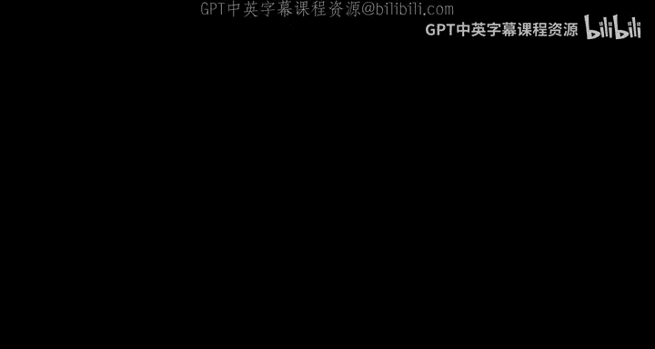
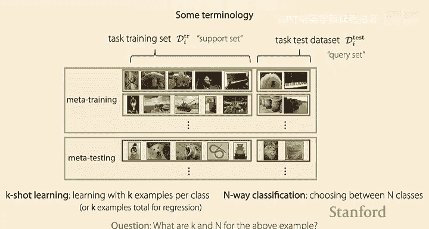
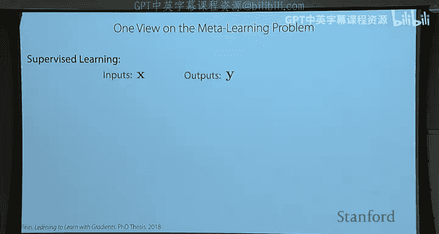

# 4：黑盒元学习 🧠

在本节课中，我们将学习元学习的基础问题设定，并深入探讨一种核心方法——黑盒元学习。我们将了解如何设计一个能够“学会学习”的神经网络，使其仅用少量数据就能快速适应新任务。

---

## 课程回顾：元学习问题设定

上一讲我们介绍了元学习的核心思想。我们的目标是：给定一组来自某些任务的数据，我们希望模型能够利用这些经验，在面对**新任务**时，用**更少的数据**达到更高的准确率或效率。

一个关键假设是，所有任务（包括训练任务和测试任务）都来自同一个**任务分布**。这类似于传统机器学习中的独立同分布假设，是保证算法能够泛化的基础。

任务可以对应多种形式：
*   在作业一中，任务对应识别不同语言的手写数字。
*   其他例子包括：针对不同学生的作业提供反馈、对世界不同区域的物种进行分类，或让机器人执行不同的操作。

一个自然的问题是：我们需要多少任务才能快速学习新任务？虽然没有确切的答案，但通常**任务越多越好**。在元学习中，我们将**任务视为数据点**，更多的任务意味着更多的“元训练”数据。

---

## 元学习的两种视角

周一我们讨论了元学习的两种视角：
1.  **机制视角**：将元学习视为训练一个神经网络，该网络能够读取输入数据集并给出对新数据点的预测。你可以将其看作是在**实现一个学习过程**。
2.  **概率视角**：思考如何从训练任务中提取先验知识，并在测试时施加该先验，以便用更少的数据进行学习。

在接下来的几讲中，我们将主要关注**机制视角**，因为它更便于思考如何实际实现这些算法。

---

## 小样本学习与术语

我们来看一个小样本分类的例子。目标是在给定极少量训练数据（例如，每类仅一个样本）的情况下，对新的测试样本进行分类。

在这个框架下，我们引入一些标准术语：
*   **支持集**：对应一个任务中的训练数据集，为学习过程提供“支持”。
*   **查询集**：对应一个任务中的测试数据集，用于在基于支持集学习后“查询”模型的预测。
*   **N-way K-shot 学习**：
    *   `N`：分类任务中的类别数（例如，5-way 表示在5个类别间分类）。
    *   `K`：每个类别提供的样本数（例如，1-shot 表示每类只有一个样本）。

对于上图的例子，这是一个 **5-way 1-shot** 分类问题。

---

## 将元学习视为监督学习

我们可以将元学习重新表述为一个监督学习问题。

在标准监督学习中，我们学习一个函数 `f: X -> Y`，将输入映射到输出。

在元学习中，我们的输入变得不同：
*   **输入**：一个任务的支持集 `D_train` **和**一个新的测试输入 `x_test`。
*   **输出**：测试输入 `x_test` 的预测标签 `y_test`。

因此，元学习函数 `F` 的形式是：`y_test = F(D_train, x_test)`。这个函数 `F` 封装了“从数据集中学习并预测新样本”的整个过程。

如何学习这个函数 `F`？我们使用一个**数据集的集合**进行训练。每个数据集对应一个任务，并且包含足够多的样本，以便我们能从中采样出支持集和查询集。

---

## 黑盒元学习方法 🎯

现在，我们进入核心：如何设计和优化函数 `F`。黑盒元学习将 `F` 直接表示为一个神经网络（如循环神经网络RNN）。我们以 **Omniglot** 数据集（包含50种手写文字，共1623个字符，每个字符仅20个样本）为例，说明其工作流程。

### 版本一：输出网络参数（超网络）

以下是元训练过程的关键步骤：

1.  **采样任务**：从训练任务中采样一个任务（例如，一种字母表），并采样N个字符作为分类类别。
2.  **构建支持集与查询集**：为每个字符采样多个图像，并随机划分为支持集（用于训练）和查询集（用于评估）。**关键**：需要随机分配样本标签（如0,1,2），以防止网络简单地记忆映射。
3.  **前向传播（学习）**：
    *   将支持集 `(x, y)` 序列输入一个RNN。
    *   RNN输出一组参数 `φ_i`（即“学会”的参数）。
    *   使用另一个网络（参数由 `φ_i` 定义）对查询集样本 `x_test` 进行预测，得到 `y_hat`。
4.  **计算损失与反向传播**：
    *   计算预测 `y_hat` 与真实标签 `y_test` 之间的损失（如交叉熵）。
    *   **关键**：通过整个计算图（从损失，经过预测网络，回到RNN输出的参数 `φ_i`，再回到RNN的权重）进行反向传播。
    *   更新的是RNN的权重 `θ`（即**元参数**），而**不更新**任务特定参数 `φ_i`。`φ_i` 被视为RNN的**激活值**，在每次前向传播时被重新计算。
5.  **循环**：重复步骤1-4，采样不同任务进行训练。

**元测试过程**则简单得多：给定一个新任务的支持集，我们将其输入训练好的RNN，并传入测试样本，RNN会通过前向传播直接输出预测结果。此过程**没有参数更新**。

**缺点**：直接输出整个预测网络的参数 `φ_i` 可能维度极高，计算效率低。

### 版本二：输出上下文向量（更实用）

一个更实用的变体是让RNN输出一个低维的**上下文向量（隐藏状态）`h_i`**，而不是全部参数。

*   **前向传播**：支持集序列输入RNN，最终隐藏状态 `h_i` 编码了任务信息。
*   **预测**：将测试样本 `x_test` 和上下文向量 `h_i` 一起输入一个**共享的预测网络** `g`（其参数 `θ_g` 也是元参数的一部分）来得到预测。
*   **训练**：同样通过查询集损失反向传播，更新RNN的参数和共享预测网络 `g` 的参数 `θ_g`。

这个版本更高效，且上下文向量 `h_i` 可以直观地理解为从数据中推断出的**任务描述符**。

---

## 架构选择 🏗️

选择合适的架构来实现函数 `F` 很重要：

*   **循环神经网络**：早期常用，能处理变长序列，但顺序敏感性不符合数据集的无序性。
*   **Deep Sets 架构**：
    *   将每个样本独立通过一个前馈网络得到嵌入。
    *   然后对嵌入进行**聚合**（如求和、平均），得到一个与输入顺序无关的集合表示。
    *   理论证明，这类架构可以表示任何置换不变函数，表达能力很强。
*   **Transformer**：利用自注意力机制，能更好地建模样本间的关系，是现代更流行的选择。
*   **外部记忆机制**（如神经图灵机）：概念有趣，但实践中未必比上述方法更优。

在Omniglot等数据集上，这些方法能在少样本设置下取得很高准确率（如5-way 1-shot >99%），但在更复杂的图像数据集（如MiniImageNet）上，性能仍有提升空间。

---

## 与大语言模型的联系 🤖

像GPT-3这样的大语言模型可以被视为一种**黑盒元学习者**，其少样本学习能力是**涌现**出来的。

*   **工作原理**：将各种任务（翻译、问答、数学等）都格式化为文本。模型的“支持集”是输入提示（包含任务描述和少量示例），“查询集”是模型需要补全或回答的文本。
*   **训练**：在大量互联网文本数据上，通过标准语言建模目标（预测下一个词）进行训练。
*   **上下文学习**：在推理时，通过提供不同的提示（少样本示例），模型能适应不同任务，这类似于元测试过程。

研究表明，这种涌现的少样本学习能力需要：
1.  **数据特性**：时间上的相关性（突发性主题）和词语的动态含义。
2.  **模型特性**：足够的模型容量（参数量）。Transformer架构通常比RNN更好，且模型越大，少样本性能往往越强。

---

## 总结与作业 📝

本节课我们一起学习了**黑盒元学习**的核心思想：
*   我们将元学习框架化为一个可学习的函数 `F`，它接收支持集和查询输入，输出查询预测。
*   通过使用神经网络（如RNN、Transformer）来实现 `F`，并利用元训练任务的数据对其进行端到端的优化。
*   我们探讨了两种实现方式：输出完整参数（超网络）和输出上下文向量，后者更常用。
*   我们还看到了黑盒元学习思想与大语言模型涌现的上下文学习能力之间的联系。

**优点**：表达能力强，可应用于多种问题（监督学习、强化学习）。
**缺点**：优化可能较困难，数据效率可能低于融入更多归纳偏置的元学习方法（我们将在下节课讨论）。

在**作业一**中，你将亲自在Omniglot数据集上实现数据预处理和一个黑盒元学习器，并观察其少样本学习性能。