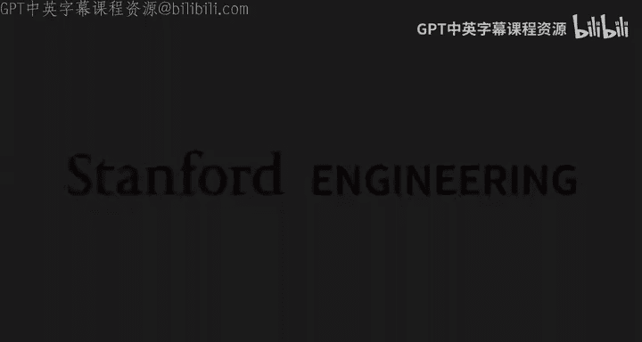
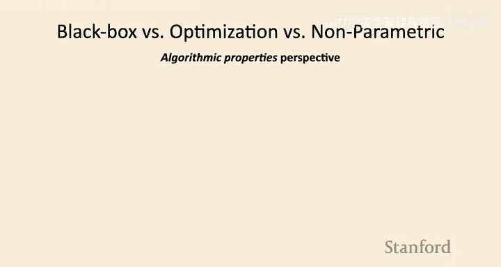
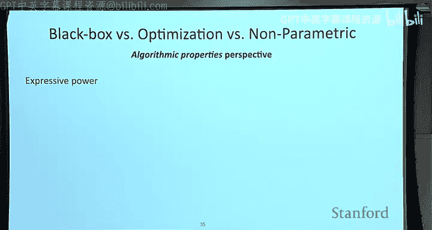

# 6：非参数小样本学习 🎯

在本节课中，我们将要学习元学习的第三类主要方法：**非参数小样本学习**。我们将探讨如何通过学习一个有效的嵌入空间，然后在该空间中使用简单的最近邻方法进行预测，从而构建高效的小样本分类器。我们还会通过一个教育领域的实际案例，了解这类方法如何被部署应用。最后，我们将对比之前学过的三类元学习方法，并讨论它们各自的优缺点。

---

## 课程回顾与引入

上一节我们介绍了基于优化的元学习方法，它通过将梯度下降的结构嵌入到内循环学习过程中，提供了良好的归纳偏置。然而，这类方法通常需要进行二阶优化，计算开销较大。

本节中，我们将探讨一种新的思路：**将非参数学习过程嵌入到元学习的内循环中**。具体来说，我们将关注像最近邻这样的算法。你可能会想，最近邻算法并不强大，为什么我们要用它？原因在于，在小样本场景下，我们恰好处于**低数据状态**。此时，非参数的机器学习方法（如最近邻）计算效率高且非常简单。然而，在元训练阶段，我们通常拥有大量任务，我们希望从数据中学习到好的**表示**，因此元训练过程本身仍然是参数化的。

所以，今天这类方法的核心思想是：**使用参数化的元学习器，来产生有效的非参数学习器**。

---

## 核心思想：学习如何比较样本

假设我们想解决经典的小样本图像分类问题。如果我们想使用最近邻方法，我们会将测试数据点与训练集中的每个样本进行比较，然后输出最相似训练样本的标签。这很简单。

但关键问题是：**我们如何进行比较？在什么空间中进行比较？使用什么距离度量？**

一个直观的想法是在原始像素空间中使用L2距离。但事实证明，对于图像等数据，L2距离效果很差。例如，一张猫的图片在L2距离上可能更接近一张纹理相似的沙发图片，而不是另一张猫的图片，这与我们的感知不符。

那么，我们应该使用什么距离度量呢？一个核心思路是：**我们可以利用元训练数据来学习如何比较样本**。距离函数的选择将是参数化的（即需要学习），但一旦我们有了这个距离函数或嵌入空间，后续的最近邻比较过程就是完全非参数的。

---

## 方法一：孪生网络

以下是实现上述思想的第一种具体方法。

**孪生网络**是一种简单的神经网络架构。它有两个输入，这两个输入通过**参数完全相同**的两个神经网络进行处理，因此得名“孪生”。

*   **训练过程**：我们将两张图像输入网络，网络会比较这两张图像的表征，并输出一个值，表示这两张图像是否属于同一类别。这是一个简单的**二分类问题**（相同类别标签为1，不同类别标签为0）。我们可以利用所有可用的元训练数据来训练这个网络。
*   **测试过程**：训练完成后，这个孪生网络就成为了我们的相似性度量或距离函数。对于一个新的测试图像，我们将其与支持集中的每个样本配对输入网络，计算它们属于同一类别的概率，然后选择概率最高的支持集样本的标签作为预测结果。

**优点**：概念简单，易于实现。
**缺点**：元训练（二分类）和元测试（N分类）的目标存在**不匹配**。此外，对于单样本学习，如果支持集中每个类别只有一个样本，这种方法本质上就是在比较测试样本与单个样本，可能不够鲁棒。

---

## 方法二：匹配网络

为了克服孪生网络中训练与测试目标不匹配的问题，匹配网络被提出。它的核心思想是**让元训练过程直接模拟元测试时的行为**。

在元测试时，匹配网络的行为可以近似表示为：对于测试样本 \( x_{test} \)，其预测标签 \( \hat{y}_{test} \) 由支持集中所有样本“投票”决定，每个样本的投票权重是其与测试样本的相似度。

\[
\hat{y}_{test} = \sum_{k} a(\hat{x}_{test}, x_k) \cdot y_k
\]

其中，\( a \) 是一个可学习的注意力函数（相似度函数），通常由神经网络实现。这样，整个预测过程（包括嵌入和相似度比较）是端到端可微的。

**算法流程**与之前的元学习框架类似：
1.  采样一个任务。
2.  采样支持集和查询集。
3.  **直接**使用上述公式为查询集样本生成预测，**无需显式计算任务参数**。
4.  计算预测损失（如交叉熵），并更新元参数 \( \theta \)。

匹配网络通常使用双向LSTM（或现代的双向Transformer）来编码支持集样本，这使得每个样本的编码能考虑到支持集中其他样本的信息，从而获得更好的上下文感知表征。

---

## 方法三：原型网络

当每个类别有多个样本时，匹配网络中每个样本独立“投票”的方式可能存在缺陷。例如，一个错误标签的样本如果与测试样本非常相似，可能会压倒其他正确样本的投票。

原型网络通过**聚合类别信息**来解决这个问题。它为每个类别计算一个**原型**（通常是该类所有样本嵌入的均值），然后在元测试时，比较测试样本与各个类别原型的距离，而非与每个独立样本的距离。

**原型计算**：
对于类别 \( n \)，其原型 \( c_n \) 为：
\[
c_n = \frac{1}{|S_n|} \sum_{(x_i, y_i) \in S_n} f_\theta(x_i)
\]
其中 \( S_n \) 是属于类别 \( n \) 的支持集样本，\( f_\theta \) 是嵌入函数。

**预测**：
测试样本 \( x \) 属于类别 \( n \) 的概率通过 softmax 函数基于负距离计算：
\[
p(y = n | x) = \frac{\exp(-d(f_\theta(x), c_n))}{\sum_{n'} \exp(-d(f_\theta(x), c_{n'}))}
\]
其中 \( d \) 可以是欧氏距离或余弦距离等。

**优点**：
*   **更鲁棒**：通过平均，减少了异常样本的影响。
*   **计算高效**：只需要计算测试样本到每个类别原型的距离，计算量与类别数成正比，而非样本总数。
*   **端到端训练**：整个系统（嵌入函数 \( f_\theta \)）可以通过元训练目标进行优化。

**变体与扩展**：
*   **关系网络**：不直接使用固定距离公式，而是学习一个关系模块来输出相似度分数。
*   **混合原型**：对于难以用单个原型表示的复杂类别（如猫的多个品种），可以为每个类别学习多个原型。

---

## 实际案例研究：教育领域的代码反馈系统

现在，我们来看一个原型网络在实际中的应用案例：为大规模在线编程课程的学生代码提供自动反馈。

**问题**：课程有超过12,000名学生，手动为每位学生的诊断性代码练习提供反馈需要超过8个月。我们需要一个能快速适应新题目和新评分标准的自动反馈系统。

**元学习框架**：
*   **任务定义**：每个题目的每个评分标准项（如“错误地插入了字符”）定义为一个独立的**任务**。
*   **输入**：学生的Python代码（文本序列）。
*   **输出**：预测该代码是否触发了当前评分标准项（二分类）。
*   **目标**：给定一个新题目和它的评分标准，仅需少量已标注的学生代码样本，就能快速对该题目的所有学生代码给出准确反馈。

**使用原型网络**：
我们使用基于Transformer的预训练模型（CodeBERT）作为嵌入函数 \( f_\theta \)，将学生代码编码为向量。对于每个任务（评分项），我们使用支持集中的正例和负例代码分别计算原型，然后对查询代码进行分类。

**提升性能的关键技巧**：
1.  **任务增强**：除了真实的评分任务，还构造了自监督任务（如预测代码的编译错误、掩码语言建模）来增加元训练数据。
2.  **融入辅助信息**：将题目文本和评分项描述作为辅助信息，与代码一起输入编码器，让模型知道当前的任务是什么。
3.  **使用预训练模型**：使用在大规模无监督代码数据上预训练的CodeBERT初始化编码器，提供更好的起点。

**部署结果**：
*   在离线测试中，该系统比监督学习方法准确率高8-17%，在某些情况下甚至超过了人类助教的评分准确率。
*   在真实课程中部署，为约15,000份学生代码提供了反馈。学生对该AI反馈的同意率和有用性评分与人类反馈相当，且未发现明显的性别或国籍偏见。

这个案例表明，非参数元学习方法（如原型网络）在计算效率、易于优化和实际效果方面，非常适合此类小样本分类问题。

---

## 三类元学习方法的比较

我们已经介绍了三类主要的元学习方法：黑盒元学习、基于优化的元学习以及非参数元学习。以下是它们的高层对比：

**概念框架**：
三者都可以纳入同一个计算图视角：输入支持集和查询样本，输出查询预测。区别在于**内循环**的实现方式：
*   **黑盒**：用一个神经网络直接映射。
*   **基于优化**：嵌入梯度下降过程。
*   **非参数**：嵌入最近邻或原型比较过程。

**关键属性**：
1.  **表达能力**：模型能够表示的学习算法的范围。
    *   黑盒方法：**完全表达**，但可能难以优化。
    *   基于优化的方法：**表达能力强**（特别是使用深度模型时）。
    *   非参数方法：**表达能力强**，取决于嵌入函数。
2.  **一致性**：随着任务内数据增多，学习器的性能是否能单调提升（即表现得更像标准学习器）。
    *   黑盒方法：**不一致**。
    *   基于优化的方法：**一致**（退化为梯度下降）。
    *   非参数方法：**条件一致**（如果嵌入函数没有过度压缩信息）。

**优缺点总结**：
*   **黑盒元学习**：
    *   *优点*：可与各种学习问题结合，非常灵活。
    *   *缺点*：优化困难，数据效率低。
*   **基于优化的元学习**：
    *   *优点*：有良好的归纳偏置，能较好处理不同数量的支持样本。
    *   *缺点*：涉及二阶优化，计算和内存开销大。
*   **非参数元学习**：
    *   *优点*：**完全前馈**，计算速度快，易于优化。
    *   *缺点*：难以推广到变化的支持集数量（K），难以扩展到非常大的K（计算复杂度O(NK)），且**仅限于分类问题**。

**选择建议**：
*   如果是**监督分类问题**，**非参数方法**（如原型网络）通常是首选，因为它们快速、简单且有效。
*   对于**非分类问题**（如回归、强化学习），应考虑另外两类。其中，**基于优化的方法**通常是更通用的选择。
*   **黑盒方法**在强化学习等没有良好内循环优化方法的领域，或者拥有海量数据（如GPT-3）的场景下可能更有优势。

值得注意的是，许多算法是这些类别的混合体，实际选择应基于具体问题、计算约束和数据情况。

---

## 其他应用示例

最后，我们快速浏览几个元学习在其他领域的创造性应用：
1.  **单样本模仿学习**：任务对应操作不同物体。给定一段人类演示视频（单样本），机器人通过基于优化的元学习（如MAML，并学习内循环损失函数）快速学会执行该任务。
2.  **分子属性预测**：任务对应预测不同分子的特性。使用基于优化的元学习（如MAML），配合图神经网络作为基模型，在小样本实验数据上预测分子活性，效果优于微调或最近邻方法。
3.  **小样本运动预测**：任务对应不同行人或车辆轨迹。使用黑盒与优化混合的方法（学习内循环更新规则），根据过去几帧运动预测未来轨迹，效果优于多任务学习。

一个重要的启示是：**内循环和外循环的数据不必相同**。内循环训练数据可以有噪声标签、弱监督或来自不同领域（域偏移），只要外循环测试目标是定义良好的机器学习目标，元学习过程就能被驱动去学习适应这些挑战的学习程序。

---

## 总结

本节课中，我们一起学习了元学习的第三类方法——**非参数小样本学习**。我们深入探讨了其核心思想：**学习一个嵌入空间，然后在该空间中使用简单的最近邻规则进行预测**。我们介绍了三种具体方法：孪生网络、匹配网络和原型网络，并通过一个教育领域的代码反馈案例看到了原型网络的实际应用价值。最后，我们系统比较了黑盒、基于优化和非参数这三类元学习方法的核心属性、优缺点和适用场景，帮助大家根据实际问题做出合适的选择。

这是关于元学习核心算法的最后一讲。下一讲我们将探讨无监督预训练方法，以及它们与元学习之间的联系。