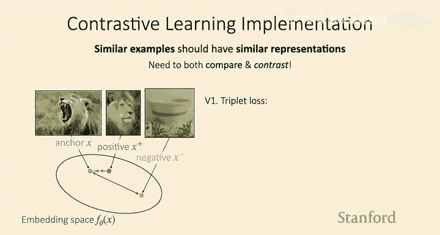
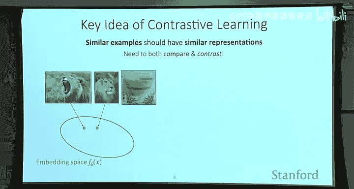
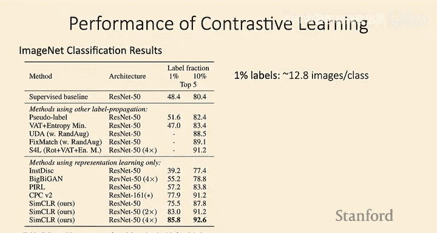
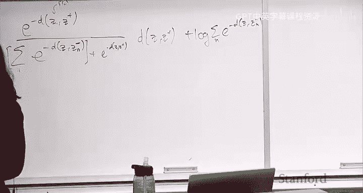

# 7：无监督预训练与对比学习 🧠

## 概述
在本节课中，我们将要学习一种强大的无监督表示学习方法——**对比学习**。我们将探讨其核心思想、实现方式、关键设计选择，并了解它如何与之前学过的元学习方法相联系。

---

## 从元学习到无监督预训练
上一节我们介绍了多种元学习方法，它们都假设我们能够访问大量带标签的训练任务。然而，在实际应用中，我们可能无法获得如此丰富的任务数据。

因此，本周我们将探讨另一种场景：我们只有一个**大型无标签数据集**。我们的目标是通过在这些无标签数据上进行预训练，得到一个模型，使得该模型在少量有标签数据上微调后，能在新任务上表现良好。

今天，我们将专注于实现这一目标的一类方法：**对比学习**。

---

## 对比学习的核心思想 🎯
对比学习的关键目标是学习一个从输入到向量表示的映射，使得**语义相似的样本具有相似的表示**，而语义不同的样本则具有不同的表示。

例如，我们希望两张“狗”的图片在表示空间中的距离，比一张“狗”的图片和一张“椅子”的图片之间的距离更近。

当然，如果我们有类别标签，可以直接利用标签来训练这种相似性。但在无监督设置下，我们需要其他方式来定义“相似性”。

以下是几种常见的定义“正样本对”的方式：
*   **图像块**：同一张图像中相邻的块可能来自同一物体，因此它们的表示应该相似。
*   **数据增强**：对一张图像进行裁剪、翻转等增强操作，生成的新图像应与原图有相似的表示。
*   **时序邻近**：在视频中，时间上邻近的帧很可能内容相关，因此它们的表示应该相似。

核心思想是：利用我们直觉上认为应该相似的样本，鼓励它们的表示接近，从而学习到一个有意义的表示空间，以便迁移到下游任务。

---

## 如何实现对比学习？
那么，如何在实践中实现上述直觉呢？

假设我们想训练模型，使上方的两张相似图像表示接近，下方的两张不同图像表示远离。一个朴素的想法是直接最小化相似样本表示之间的距离：

`L_naive = ||f_θ(x) - f_θ(x^+)||²`

但这里存在一个**退化解**：模型可能简单地将所有输入映射到同一个常数向量，这样损失直接变为0，但表示空间毫无意义。

因此，对比学习不仅要拉近相似样本，还要**推开不相似样本**。这就是“对比”一词的由来。

以下是实现对比学习时两个关键的设计选择：
1.  **损失函数的设计**：如何量化“拉近”和“推开”。
2.  **正负样本的选择**：如何定义哪些样本是相似的（正样本），哪些是不相似的（负样本）。

---

## 对比损失函数
首先，我们引入一些术语：
*   **锚点**：作为比较基准的样本。
*   **正样本**：与锚点相似的样本。
*   **负样本**：与锚点不相似的样本。

我们的目标是：拉近锚点与正样本的距离，拉远锚点与负样本的距离。

### 三元组损失
最简单的对比损失是**三元组损失**。它不仅最小化锚点与正样本的距离，还最大化锚点与负样本的距离：

`L_triplet = ||f_θ(x) - f_θ(x^+)||² - ||f_θ(x) - f_θ(x^-)||²`

直接优化这个损失可能导致模型将负样本无限推远。为了解决这个问题，我们引入**间隔损失**：

`L_triplet = max(||f_θ(x) - f_θ(x^+)||² - ||f_θ(x) - f_θ(x^-)||² + α, 0)`

其中，`α` 是一个超参数，称为**间隔**。只有当负样本与锚点的距离比正样本近至少 `α` 时，才会产生损失。这防止了无限制的推远。

### 多负样本的对比损失
三元组损失每次只对比一个负样本。在实践中，我们通常希望锚点能与**多个负样本**进行对比。这引出了另一种更常见的损失形式，它看起来像一个多分类的Softmax损失。

我们希望锚点 `x` 与正样本 `x^+` 的相似度，远高于它与所有负样本 `{x^-_i}` 的相似度。用距离的负值作为“相似度得分”，我们可以这样计算锚点选择正样本的概率：

`P(x^+ is positive | x) = exp(-d(z, z^+)) / [exp(-d(z, z^+)) + Σ_i exp(-d(z, z^-_i))]`

其中，`z = f_θ(x)`, `z^+ = f_θ(x^+)`, `z^-_i = f_θ(x^-_i)`，`d(·,·)` 是距离函数（如欧氏距离或负余弦相似度）。

我们的损失函数就是最小化这个概率的负对数似然：

`L_contrastive = -log [ exp(-d(z, z^+)) / (exp(-d(z, z^+)) + Σ_i exp(-d(z, z^-_i)) ) ]`

直观理解是：我们正在训练一个分类器，给定一个锚点，从一堆候选样本中正确识别出那个唯一的正样本。

---

## SimCLR 算法实例 🖼️
让我们通过一个具体的算法——**SimCLR**，来理解对比学习如何运作。该算法的输入是一个大型无标签数据集 `{x}`。

以下是算法的步骤：
1.  **采样小批量**：从数据集中采样 `N` 个样本，构成一个小批量。
2.  **生成增强视图**：对每个样本应用两次随机数据增强（如裁剪、翻转、颜色扰动），得到 `2N` 个增强后的图像：`{x̃_i}` 和 `{x̃‘_i}`。
3.  **编码表示**：使用编码网络 `f_θ` 将所有增强图像映射到表示空间，得到 `{z_i}` 和 `{z‘_i}`。
4.  **定义正负样本**：
    *   **正样本对**：来自**同一原始图像**的两个增强视图 `(z_i, z‘_i)`。
    *   **负样本**：来自**不同原始图像**的任何其他增强视图。
5.  **计算对比损失**：对于每个正样本对 `(z_i, z‘_i)`，将其视为锚点和正样本，将小批量中所有其他 `2(N-1)` 个表示视为负样本，代入上述多负样本对比损失进行计算。对所有正样本对取平均得到总损失。
6.  **优化**：通过梯度下降优化编码网络参数 `θ`，以最小化总损失。

训练完成后，我们得到编码器 `f_θ`，它可以为任何输入图像生成有用的表示。我们可以冻结这个编码器，在其表示上训练一个简单的分类器，或者对整个网络进行微调，以适应特定的下游任务。

---

## 对比学习的性能与挑战 ⚡
对比学习（如SimCLR）在图像分类等任务上取得了显著成功。例如，在ImageNet数据集上，仅使用1%的标签进行微调，就能达到超过85%的top-5准确率，远超从零开始的监督训练。

然而，对比学习也面临一些挑战：
*   **需要大批次训练**：为了获得足够多的负样本以进行有效的对比，SimCLR等算法需要非常大的批次大小（如4096），这对计算资源要求很高。
    *   **原因**：对比损失中的求和项在log函数内部。根据詹森不等式，用小批次估计会得到原始损失的一个下界，优化这个下界可能无法优化原始目标。大批次能提供更好的估计。
    *   **解决方案**：有研究提出如**MoCo**等方法，通过动量编码器和队列机制存储历史负样本，从而能用较小的批次进行训练。
*   **依赖数据增强**：算法的效果很大程度上取决于定义正样本对的数据增强策略。对于图像以外的领域（如文本、传感器数据），设计有效的增强方式可能很困难。
    *   **解决方案**：有研究工作尝试通过对抗学习的方式**自动学习最优的数据增强策略**。

---

## 对比学习的广泛应用 🌐
对比学习的思想非常通用，不仅限于图像增强：
*   **时序对比学习**：在视频中，将时间上邻近的帧作为正样本，时间上远离的帧作为负样本。这已被用于机器人技能学习等领域。
*   **跨模态对比学习**：例如，在CLIP模型中，将图像与其对应的文本描述作为正样本对，将不匹配的图像-文本对作为负样本。这学习到了一个强大的多模态表示空间，甚至能实现高质量的零样本分类。

---

## 对比学习与元学习的关系 🔗
你可能已经注意到，对比学习的损失函数与我们在**非参数化元学习**（如原型网络）中见过的损失函数非常相似。

实际上，我们可以将对比学习框架重新解释为一个元学习过程：
1.  将每个原始图像及其增强视图视为一个“类别”。
2.  从这个“类别”中采样两个增强视图作为支持集和查询集。
3.  构建一个N-way分类任务，目标是在N个“类别”中识别出查询样本所属的类别。

在这种视角下，像SimCLR这样的对比学习算法，与使用原型网络在增强生成的任务上进行元训练，在数学形式和实际性能上都非常接近。主要区别在于批次内样本对比的细节和效率。

这揭示了无监督对比学习与少样本元学习之间深刻而紧密的联系。

---

## 总结
本节课我们一起学习了**对比学习**。我们了解了它的核心思想是学习一个表示空间，使得语义相似的样本靠近，语义不同的样本远离。我们探讨了两种主要的损失函数（三元组损失和多负样本对比损失），并通过SimCLR算法深入了解了其实现细节。我们还讨论了对比学习的性能、挑战（如大批次需求）以及其广泛的应用场景。最后，我们揭示了对比学习与之前学过的元学习方法之间有趣而紧密的联系。

下节课，我们将探讨另一类重要的无监督预训练方法：基于重构的方法。