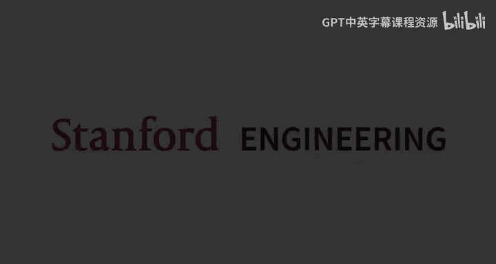
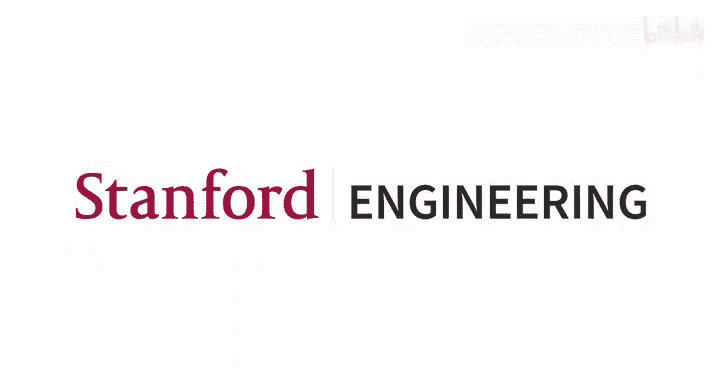

# 8：用于小样本学习的无监督预训练 🧠

在本节课中，我们将要学习基于重构的无监督预训练方法。我们将从简单的自编码器开始，探讨其局限性，然后深入讲解更强大的掩码自编码器（如BERT）和自回归模型（如GPT）。我们还将了解如何高效地对这些大型预训练模型进行微调，以适应特定的下游任务。

---

## 课程回顾：无监督学习与对比学习

上一讲中，我们讨论了无监督学习的整体框架和对比学习方法。本节中，我们将重点转向另一类强大的无监督预训练方法：基于重构的方法。

无监督学习的基本流程如下：
1.  我们拥有一个大型、多样化的**未标记数据集**。
2.  首先进行**无监督预训练**（灰色箭头），得到一个预训练模型。
3.  然后，通常使用一个较小的**有标签数据集**对模型进行**微调**，使其适应特定任务。

对比学习的基本思想是：相似的样本应该具有相似的表示。这可以通过构建正样本对（如来自同一类、同一图像的不同增强版本、视频中相邻帧）来实现。为了避免所有表示坍缩到同一个点，我们还需要负样本进行对比。一个经典的实现是**三元组损失**：
`L = max(0, d(a, p) - d(a, n) + margin)`
其中 `a` 是锚点样本，`p` 是正样本，`n` 是负样本。

更通用的形式是 **N路分类损失**（如InfoNCE损失），它将对比学习视为一个分类问题，即从一批样本中正确识别出正样本对。

---

## 基于重构的无监督目标

与对比学习不同，基于重构的方法不涉及在多个样本之间进行比较。其核心直觉是：**一个好的数据表示，应该能让我们从该表示中重构出原始数据**。

一个简单的流程是：
1.  输入 `x`（如图像）通过一个**编码器**得到表示 `r`。
2.  表示 `r` 通过一个**解码器**得到重构输出 `x_hat`。
3.  我们定义一个损失函数来衡量 `x` 和 `x_hat` 的差异（如图像常用L2距离）。
4.  端到端地训练编码器和解码器。

然而，这里存在一个明显的问题：如果表示 `r` 的维度与输入 `x` 相同，编码器和解码器可以简单地学习恒等映射（即 `r = x`, `x_hat = r`），这样损失为零，但学到的表示毫无意义。

为了解决这个问题，常见的做法是引入**瓶颈**。最直观的方式是让表示 `r` 的维度远低于输入 `x` 的维度。这样，编码器被迫将高维输入压缩到一个低维空间，理想情况下，这个低维空间会编码输入的高级、有意义的特征。

训练好这种“瓶颈自编码器”后，如何进行小样本学习呢？方法很简单：
1.  丢弃解码器。
2.  在编码器产生的表示 `r` 之上，初始化一个新的**预测头**（如一个线性分类器或小型MLP）。
3.  冻结编码器的参数，仅使用少量标注数据训练这个预测头。

这种方法的优点是简单、通用，且无需像对比学习那样精心设计正负样本对。但其主要缺点是：**设计一个能迫使编码器学习到可泛化高级特征的瓶颈机制非常困难**。很多时候，模型学到的表示更像是输入的“哈希值”，记住了重构所需的具体细节，而非易于适应新任务的概念性摘要。

为了鼓励编码器提取更高级的特征，除了维度瓶颈，我们还可以尝试其他类型的瓶颈，如添加噪声的信息瓶颈、限制非零维度的稀疏性瓶颈，或限制解码器能力的容量瓶颈。然而，目前实践中更常见的策略是：**不再专注于设计复杂的瓶颈，而是直接让预训练任务变得更难**。这就引出了我们下一节的主题。

---

## 掩码自编码器

掩码自编码器的核心思想是：**通过让模型预测被随机掩盖的部分输入，来构建一个更具挑战性的预训练任务**。这样，模型必须理解数据的整体结构和上下文，而不是简单地记忆或复制。

以下是训练掩码自编码器的一般流程：
1.  对于一个训练样本 `x`，我们应用一个**掩码函数**，生成被掩盖的版本 `x_tilde` 和目标 `y`（通常 `y` 就是被掩盖的部分）。
2.  模型 `f_theta` 以 `x_tilde` 为输入，预测被掩盖的部分 `y_hat`。
3.  计算损失 `L(y, y_hat)`。

与普通自编码器相比，我们多了一个可调节的“旋钮”：**掩码策略**。

以下是两个经典实例：

**1. BERT（语言模型）**
*   **输入**：文本序列（如两个句子）。
*   **掩码策略**：随机掩盖约15%的词元（token）。其中80%替换为特殊的 `[MASK]` 标记，10%替换为随机词元，10%保持不变。这种混合策略有助于模型在微调时（没有 `[MASK]` 标记）也能产生良好的表示。
*   **模型**：Transformer 编码器。
*   **损失**：在被掩盖的位置上，计算模型预测分布与真实词元one-hot分布之间的交叉熵损失。

**2. MAE（视觉模型）**
*   **输入**：图像被分割成一系列图像块（patch）。
*   **掩码策略**：随机掩盖高达75%的图像块（仅将可见块输入编码器）。
*   **模型**：编码器处理可见块，解码器根据编码器输出和掩码位置占位符，重构被掩盖的块。
*   **损失**：在被掩盖块的位置计算像素级损失（如MSE）。

掩码自编码器非常强大，在图像分类等任务上，其性能甚至可以超过从零开始的监督学习。与对比学习相比，掩码模型在**直接使用冻结表示**时可能稍逊一筹，但在**进行模型微调**后往往表现更佳，这体现了“表示质量”与“可微调性”之间的一种权衡。

---

## Transformer 架构简介

掩码自编码器的成功，很大程度上得益于 **Transformer** 架构的通用性和强大能力。Transformer 是一种与模态无关的序列模型，可广泛应用于语言、图像、分子等各种数据。

以下是 Transformer 编码器（以视觉Transformer为例）的高层工作流程：
1.  **序列化**：将输入（如图像块）转换为一个序列。
2.  **嵌入与位置编码**：将每个序列元素映射为嵌入向量，并加上**位置编码**（这是关键，因为Transformer本身是置换不变的）。
3.  **Transformer 块堆叠**：序列经过多个相同的Transformer块处理。每个块主要包含：
    *   **层归一化**
    *   **多头自注意力机制**：这是不同序列元素间交互的唯一场所。
    *   **残差连接**
    *   **层归一化**
    *   **前馈网络**：独立应用于每个序列位置。
    *   **残差连接**
4.  **输出**：取序列开头特殊 `[CLS]` 标记的表示，或所有位置的表示，用于下游任务。

自注意力机制是Transformer的核心。对于输入序列 `X`，我们通过三个不同的可学习矩阵 `W_Q`, `W_K`, `W_V` 将其投影为查询（Query）、键（Key）、值（Value）：
`Q = X W_Q`, `K = X W_K`, `V = X W_V`
注意力矩阵 `A` 计算为：
`A = softmax(Q K^T / sqrt(d_k)) V`
其中 `softmax` 按行进行。这可以理解为：每个位置的输出，是所有位置值的加权和，权重由该位置与所有位置的查询-键相似度决定。

---

## 高效微调策略

得到大型预训练模型后，如何对其进行微调以适应新任务？我们面临两个问题：1) 不想完全覆盖预训练模型的知识；2) 不想为每个新任务存储一份完整的模型副本。

一种流行的高效微调方法是 **LoRA**。其核心思想是：对预训练权重矩阵 `W_0` 的更新应该是低秩的。即，微调后的权重 `W = W_0 + A B^T`，其中 `A` 和 `B` 是低秩矩阵（秩 `r << min(d_in, d_out)`）。在微调时，我们冻结 `W_0`，只训练 `A` 和 `B`。

这大大减少了需要训练和存储的参数数量。研究表明，在某些情况下，使用LoRA等轻量微调方法，即使模型规模小得多，也能获得优于GPT-3等大型模型进行上下文学习的小样本性能。

---

## 自回归模型

自回归模型是掩码自编码器的一个特例，它简化了掩码策略：**总是预测序列的下一个元素**。

*   **训练**：给定序列 `[x1, x2, ..., xT]`，我们构造训练样本：用 `[BOS]` 预测 `x1`，用 `[BOS, x1]` 预测 `x2`，依此类推。损失计算在每一个预测步骤上。
*   **优势**：
    *   无需设计掩码策略。
    *   能完全利用每个训练样本（每个位置都参与损失计算）。
    *   训练和推理效率高（得益于因果注意力掩码，可以缓存之前步骤的计算结果）。
    *   是一个显式的生成模型，可以采样新数据。
*   **劣势**：由于只能看到上文，其表示能力可能弱于双向的掩码模型。

GPT系列、视觉自回归模型等都是此类的代表。它们也可以通过多模态数据微调，构建出像Flamingo这样的强大模型，实现少样本的图像-语言任务。

---

## 总结

本节课中，我们一起学习了基于重构的无监督预训练方法：
1.  我们从**自编码器**的基本直觉出发，即好的表示应能重构输入，并讨论了其瓶颈设计的挑战。
2.  我们深入探讨了**掩码自编码器**，它通过预测被掩盖的输入部分来构建更具挑战性的任务，在视觉和语言领域都取得了顶尖性能。
3.  我们简要介绍了支撑这些模型的 **Transformer** 架构，特别是其自注意力机制。
4.  我们了解了如何通过 **LoRA** 等高效微调技术，使大型预训练模型适应新任务。
5.  最后，我们讨论了**自回归模型**作为掩码自编码器的一个特例，及其在效率和生成能力上的优势。

对比学习与基于重构的方法各有千秋：对比学习通常能产生更高质量的**冻结表示**，而基于重构的方法（尤其是掩码模型）在**模型微调**后可能潜力更大。理解这些方法的原理和权衡，将帮助我们为特定任务选择合适的预训练和微调策略。