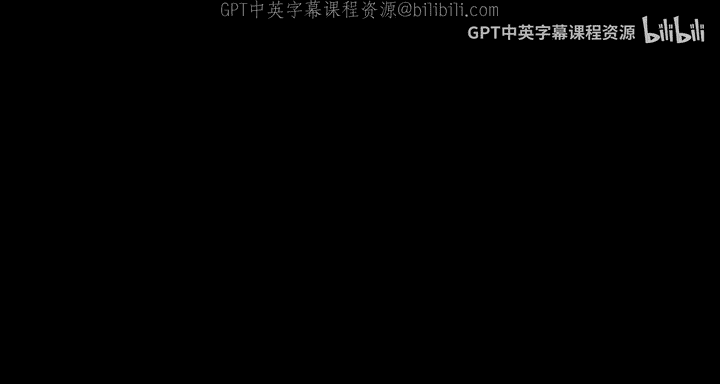
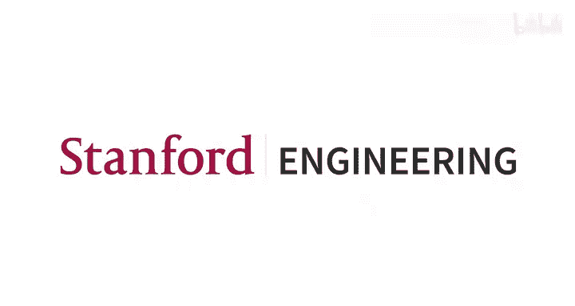

# 10：大规模元优化 🚀

在本节课中，我们将探讨元学习在大规模场景下面临的挑战，并介绍两种应对这些挑战的核心方法：截断反向传播和基于梯度的优化方法。我们将了解为什么传统的元学习方法难以扩展，以及如何通过新的技术手段来克服这些限制。

## 概述：为何需要大规模元优化？

我们可以将学习方法视为一个光谱，一端是手工设计的先验知识，另一端是数据驱动的先验知识。整个领域的发展趋势是不断向更数据驱动的一端移动。例如，从直接建模图像形成，到手写特征提取，再到端到端地学习特征本身（如微调预训练模型）。这种转变的原因是，数据驱动的方法更具可扩展性：投入更多真实数据，模型就能更好地编码真实先验，并在下游任务中表现更佳。

元学习的核心理念是，它比端到端的网络微调更加数据驱动，因为我们直接学习的是学习算法本身。然而，一个关键问题是：现有的元学习方法（如MAML或原型网络）真的能随着数据量的增加而有效扩展吗？答案往往是否定的。今天的讲座将探讨其原因，以及如何在保持元学习框架的同时解决这个问题。

## 传统元学习方法的局限性

我们之前学过的元学习方法，无论是基于优化的（如MAML）、基于黑盒模型的，还是基于非参数方法的，都可以概括为以下模式：构建一个任务学习计算图，然后通过整个计算图进行反向传播。这是一种通用方法，其优点是自动微分（Autograd）为我们完成了所有工作。

但这种方法的核心问题是：**内存成本随着计算图的大小而线性增长**。在某些学习场景中，我们希望拥有更大的计算图（例如，更深的网络、更多的梯度步数、包含二阶优化），这时直接反向传播就变得不可行。

## 大规模元优化的应用场景

当我们考虑更大的计算图时，我们可以将更多有趣的组件作为元参数进行优化，而不仅仅是初始参数。以下是一些例子：

*   **学习率**： 我们可以将学习率作为元参数进行优化。
*   **优化器**： 优化器本身（如一个神经网络）可以作为元参数来学习。
*   **损失函数**： 我们可以学习一个可微的损失函数，使其能更好地驱动模型优化以获得高精度。
*   **数据集/数据增强**： 我们可以直接优化合成数据或数据增强策略，使得在这些数据上训练能获得更好的下游性能。
*   **神经网络架构**： 通过神经架构搜索（NAS），我们可以学习网络的结构参数。

这些应用都面临一个共同的核心问题：为了计算元梯度（从最终验证损失到元参数），我们需要反向传播通过一个非常长的计算链，而直接反向传播在内存上无法承受。

## 方法一：截断反向传播

截断反向传播是一种简单直接的解决方案。其核心思想是：在展开的计算图中，我们只保留最近`T`个时间步的计算节点进行反向传播，更早的节点则被“分离”，梯度流在此处被截断。

以下是其工作原理的简要说明：
1.  在前向传播过程中，我们像往常一样构建计算图。
2.  当进行反向传播时，对于超过`T`步之前的计算节点，我们调用`.detach()`方法，阻止梯度继续向前流动。
3.  这样，我们只需要在内存中保存最近`T`步的计算状态。

**优点**：
*   **实现简单**： 主要技巧就是在适当的时候分离变量。
*   **内存可控**： 通过选择`T`，可以在内存成本和梯度准确性之间进行权衡。

**缺点**：
*   **有偏估计**： 得到的梯度不是真实的元梯度，因为它忽略了长程依赖关系。
*   **忽略长期影响**： 无法学习那些需要在很长的训练步数后才能体现出益处的元参数。

## 方法二：基于梯度的优化（进化策略）

这种方法完全避免了反向传播的需要，因为它根本不使用梯度信息。我们将重点介绍进化策略。

进化策略的灵感来源于生物进化，其工作流程如下：
1.  **初始化**： 初始化一个参数分布（例如高斯分布），包含均值 `mu` 和方差 `sigma`。
2.  **采样**： 从该分布中采样 `N` 组候选参数。
3.  **评估**： 在内部循环中，使用每一组候选参数执行完整的训练过程（例如，用特定的学习率训练一个网络很多个epoch），并评估其最终性能（如验证集准确率）。
4.  **选择**： 选择性能最好的前 `k` 组候选参数。
5.  **更新**： 用这 `k` 组精英参数的均值和方差来更新参数分布 `mu` 和 `sigma`。
6.  **迭代**： 重复步骤2-5，直到分布收敛到高性能区域。

**优点**：
*   **内存成本恒定**： 内存消耗与内部循环的步数无关，只与采样数量 `N` 和参数维度有关。
*   **高度可并行**： 对 `N` 个候选参数的评估是完全独立的，非常适合分布式计算。
*   **兼容非可微操作**： 内部循环可以包含采样、离散决策等不可微操作。

**缺点**：
*   **高维空间效率低**： 当元参数空间维度很高时（例如直接优化神经网络初始权重），随机采样很难探索到好的区域，收敛非常缓慢。
*   **可能陷入局部最优**： 需要通过调整探索策略（如方差）来缓解。

## 其他方法简介

除了上述两种主要方法，还有其他一些技术：
*   **隐式微分**： 利用内部优化收敛到最优解这一假设，通过对最优性条件进行微分来计算元梯度，无需存储中间状态。但假设可能不总是成立。
*   **前向模式微分**： 与反向传播（反向模式）不同，前向模式微分在计算过程中同步计算梯度，无需存储所有中间状态，但计算成本可能更高。

## 总结

本节课我们一起学习了大规模元优化。我们首先探讨了为什么传统的元学习方法在面临大规模计算图（如深层网络、多步训练、复杂内部优化器）时会失效，主要是因为内存限制。接着，我们介绍了两类主要的解决方案：
1.  **截断反向传播**： 通过有选择地忽略长程梯度流来降低内存开销，实现简单但会引入偏差。
2.  **进化策略**： 一种基于梯度的优化方法，通过采样、评估和选择来更新元参数，内存效率高且可并行，但在高维空间中效率较低。

理解这些方法的适用场景和权衡，对于设计和应用能够处理现实世界复杂任务的大规模元学习算法至关重要。