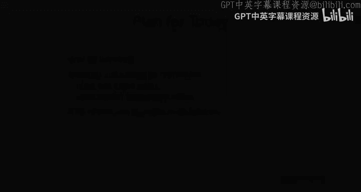

# 12：贝叶斯元学习 🧠

## 课程概述

在本节课中，我们将学习贝叶斯元学习算法。我们将探讨为何需要贝叶斯元学习，介绍不同类型的贝叶斯元学习算法（包括黑盒方法和基于优化的方法），并讨论如何评估这些算法，这与我们之前见过的典型少样本学习评估方法有所不同。

---

## 贝叶斯元学习动机

上一讲我们讨论了元学习算法的理想属性，如表达能力和一致性。然而，我们尚未深入探讨的一个关键属性是**不确定性推理**的能力。这正是贝叶斯元学习算法的核心。

不确定性推理对于主动学习、需要校准不确定性估计的场景以及强化学习设置都至关重要。从贝叶斯的角度来看，这些方法也提供了更原则性的框架，因为它们旨在最大化某个图模型下的似然。

---

## 回顾：任务结构与图模型

在我们深入讨论元学习算法之前，我们曾提到训练和测试任务应共享某种程度的结构。这可以理解为对某些潜在信息 **θ** 的统计依赖。

我们提出了一个图模型，其中包含任务特定参数 **φᵢ**、共享潜在信息 **θ**，以及我们可观察的数据（包括支持集 `X_train`, `Y_train` 和查询集 `X_test`, `Y_test`）。

如果我们以共享信息 **θ** 为条件，那么任务参数之间就变得独立。因此，给定 **θ** 后，**φᵢ** 的分布熵会降低，不确定性减少。

以下是几个思考练习：
*   **何时学习更快？** 如果你能识别元参数 **θ**（例如通过元学习算法），并且新任务与元训练期间看到的任务来自同一分布，那么共享结构将有助于你推断 **φᵢ**。
*   **任务完全独立会怎样？** 如果任务之间完全独立且没有共享结构，那么以 **θ** 为条件并不会减少 **φ** 的不确定性。
*   **熵为零的情况？** 如果以 **θ** 为条件后熵为零，意味着数据告诉了你关于任务特定参数的一切。在这种情况下，你实际上不需要任何支持集数据来推断参数，这更像是**记忆**，而非学习。

---

## 为何需要不确定性？

到目前为止，我们见过的所有算法都以完全确定的方式给出任务特定参数，即它们给出的是 **φᵢ** 的退化分布（单一参数向量）。但在某些情况下，我们确实需要生成多个假设。

例如，少样本学习问题可能存在**模糊性**。支持集可能本质上不清楚应该关注哪些属性。如果我们能学习生成关于底层函数的多个假设，这可以告诉我们是否需要更多标签，或者是否应该因为不确定而避免对新示例做出预测。这在安全关键设置、主动学习和探索设置中非常重要。

---

## 算法一：输出 Y 的分布（V0）

我们可以考虑的第一个简单算法是：让元学习器输出 **Y_test** 的分布参数，然后使用最大似然进行优化。

*   在分类设置中，我们已经这样做了（输出每个类别的概率）。
*   在回归问题中，可以输出均值和方差，或者使用混合密度网络。
*   一旦选择了 **Y_test** 的分布类别，就可以用最大似然进行优化，这对应于元学习算法的外部损失。

**优点**：非常简单，事实上我们已经这样做了，并且可以结合多种不同的元学习算法。

**缺点**：
1.  它允许你对**标签的不确定性**进行推理，但**不允许对底层函数的不确定性**进行推理。
2.  你只能捕获有限的 **Y_test** 分布类别。参数化复杂的分布非常困难。
3.  用最大似然训练的神经网络往往给出校准很差的不确定性估计（例如，过于自信）。

---

### 如何衡量校准？

衡量神经网络校准程度有几种方法。一个直观的方法是使用**可靠性图**。

*   **X轴**：神经网络输出的置信度（例如，0.9）。
*   **Y轴**：具有该特定置信度的所有数据点的实际准确率。
*   **理想情况**：一条对角线。例如，90%的置信度对应90%的准确率。越接近对角线，校准估计越好。

---

### 不确定性的类型

有两种主要的不确定性：
1.  **偶然不确定性**：数据本身固有的噪声，也称为**数据不确定性**。
2.  **认知不确定性**：模型自身知识不足导致的不确定性，也称为**模型不确定性**。估计这种不确定性更难，但更有价值。

---

## 从输出 Y 分布到输出 Φ 分布

一个自然的问题是：我们能否让元学习器输出 **φ** 的分布（给定训练数据），然后用最大似然训练它？

**答案是否定的**。因为要进行最大似然估计，我们需要 **φ** 的真实值。我们只能访问真实标签，而无法访问真实的 **φ**。因此，我们需要比最大似然更复杂的算法。

---

## 贝叶斯元学习工具箱

为了创建这些算法，我们可以依赖概率深度学习工具箱。

1.  **潜变量模型与变分推断**：这是本节课的重点。
2.  **贝叶斯集成**：不显式表示分布，而是表示来自该分布的多个样本（粒子）。通常训练多个独立的模型。
3.  **贝叶斯神经网络**：直接形成神经网络参数上的分布（通常是高斯分布）。
4.  **其他**：标准化流、基于能量的模型、生成对抗网络等（本节课不深入讨论）。

---

## 变分推断回顾

上周一，我们讨论了使用潜变量表示分布。关键思想是：
*   有一个简单的潜变量 **z** 的分布。
*   通过一个网络将其转换到观察到的变量 **x**。
*   我们推导出对数似然的下界（证据下界，ELBO），并通过**重参数化技巧**进行优化。

---

## 应用于元学习

我们可以将变分推断的思想应用于元学习：
*   **观察变量**：特定任务的数据 **Dᵢ**。
*   **潜变量**：任务特定参数 **φᵢ**。
*   **推断网络 Q**：近似后验 `Q(φᵢ | ...)`。我们可以选择让其以训练数据 **Dᵢ_train** 为条件。这看起来很像黑盒元学习——一个以训练数据集为输入并输出分布参数（均值和方差）的神经网络。
*   **先验 P(φᵢ | θ)**：可以学习，元参数 **θ** 可以出现在这里。
*   **似然项**：使用查询集数据评估 `P(Y_test | φᵢ, X_test)`。

最终的优化目标（对任务求和）是最大化这个ELBO。

**优点**：
*   可以表示 **Y_test** 上的非高斯分布。
*   给出了函数空间上的分布，而不仅仅是标签上的分布。
*   测试时，你会使用 **Q** 来推断 **φᵢ** 的分布，然后使用 **P** 进行预测。

**缺点**：
*   由于重参数化技巧和KL散度计算的限制，通常只能表示 **φᵢ** 上的高斯分布。

---

## 基于优化的贝叶斯元学习方法

接下来，我们看看如何将变分推断应用于基于优化的元学习方法（如MAML）。我们将探讨三种方法。

### 方法一：将梯度下降作为推断网络

在黑盒方法中，**Q** 是一个神经网络。在这里，我们可以重新定义 **Q**，使其包含一个梯度下降过程。

*   **Q 的定义**：从初始均值 `μ_θ` 和方差 `σ_θ` 开始，对训练数据 **Dᵢ_train** 的损失运行梯度下降，以得到最终的 `μ_φᵢ` 和 `σ_φᵢ`。
*   **训练**：使用相同的ELBO目标，只是 **Q** 的形式变了。
*   **测试**：通过运行梯度下降来进行推断，这可能对分布外任务更鲁棒。

**优点**：简单，是黑盒方法的直接修改。
**缺点**：仍然将 `P(φᵢ | θ)` 建模为高斯分布。

---

### 方法二：集成方法

如果我们想要 **φᵢ** 上的分布，可以简单地训练一个MAML模型的集成。

*   **基本方法**：独立训练 M 个不同的MAML模型。
*   **挑战**：独立训练可能导致参数非常相似。
*   **改进**：使用** Stein 变分梯度下降** 等方法，在内部循环优化中主动推动不同集成成员（粒子）的参数彼此远离，以增加多样性。

**优点**：
*   实现相对简单。
*   集成是估计认知不确定性最有效的方法之一。
*   可以表示非高斯分布。

**缺点**：
*   需要维护 M 个模型实例，成本较高。

---

### 方法三：结合 MAP 估计与变分推断

这种方法旨在以比维护多个模型实例更低成本的方式获得非高斯后验。

**核心直觉**：学习一个先验 **θ**，使得如果我们对参数添加噪声然后运行梯度下降，会落入分布的不同模式中（例如，对应不同属性的分类器）。

**流程**：
1.  有一个元参数 **θ** 上的分布（例如高斯）。
2.  为了从给定支持集的后验中采样 **φᵢ**：
    *   首先从 `P(θ)` 中采样一个 **θ‘**（添加噪声）。
    *   然后，将 `P(φᵢ | θ’, D_train)` **近似**为从 **θ‘** 开始，对 `D_train` 运行梯度下降得到的 MAP 估计。
    *   重复此过程以获得多个样本。

**优点**：
*   测试时简单（添加噪声，运行梯度下降）。
*   只需训练一个元模型实例。
*   可以得到非高斯后验。

**缺点**：
*   训练过程更复杂。

---

## 贝叶斯元学习算法总结

| 方法 | 描述 | 优点 | 缺点 |
| :--- | :--- | :--- | :--- |
| **V0** | 直接输出 **Y_test** 的分布。 | 简单，易于实现。 | 无法推理函数空间的不确定性；分布类别有限；校准差。 |
| **黑盒变分法** | 使用摊销变分推断对 **φ** 建模。 | 可表示 **Y** 上的非高斯分布；给出函数分布。 | **φ** 上的分布通常限于高斯形式。 |
| **优化法（梯度下降Q）** | 将梯度下降作为推断网络 **Q**。 | 简单；测试时更鲁棒。 | **φ** 上的分布限于高斯形式。 |
| **集成法** | 训练多个模型实例（如MAML集成）。 | 简单有效；可表示非高斯分布；不确定性估计好。 | 需要多个模型实例，成本高。 |
| **混合法（采样+优化）** | 结合先验采样与梯度下降MAP估计。 | 测试时简单；单模型实例；非高斯后验。 | 训练过程更复杂。 |

---

## 如何评估贝叶斯元学习算法？

使用标准基准（如 Mini-ImageNet）可以检查你的贝叶斯元学习算法是否破坏了原有性能，但它们并非评估贝叶斯特性的最佳指标。

更好的评估涉及以下方面：

1.  **可视化模糊问题**：在一维或二维的模糊回归或分类任务上可视化算法生成的函数，直观理解其行为。
2.  **模糊生成任务**：评估在给定单个视角下生成物体多视角的能力，比较生成样本的质量和多样性。
3.  **综合指标**：在故意设计模糊的任务上，同时考察：
    *   **准确率**
    *   **模式覆盖**：算法是否学到了所有可能的合理分类器？
    *   **负对数似然**
4.  **可靠性图**：评估预测置信度的校准情况。
5.  **主动学习性能**：在允许主动查询额外数据点的设置下，观察算法降低错误率或提升准确率的速度。良好的不确定性估计应能更快地提升性能。

---

## 课程总结

本节课我们一起学习了贝叶斯元学习算法。我们首先探讨了在元学习中推理不确定性的动机。然后，我们介绍了几类主要的贝叶斯元学习算法：从简单的输出标签分布方法，到使用变分推断的黑盒方法，再到三种基于优化的方法（将梯度下降作为推断网络、集成方法以及结合采样与优化的混合方法）。最后，我们讨论了如何超越传统准确率指标，从不确定性校准、分布覆盖和主动学习等多个维度来全面评估这些算法。

下周，我们将讨论领域自适应与领域泛化，这是多任务与元学习问题设置中一个非常有趣的特例。