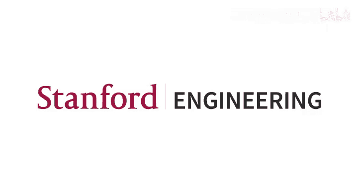
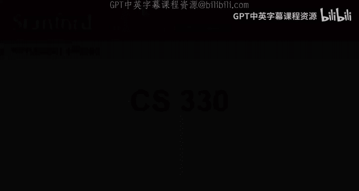
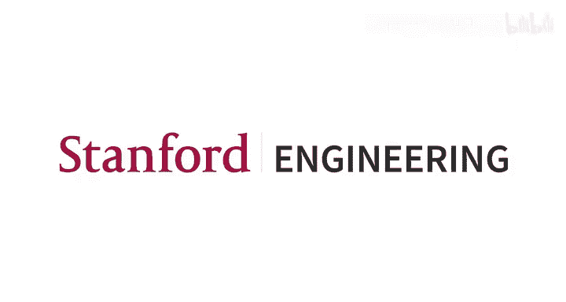

# 14：领域泛化 🎯





在本节课中，我们将要学习一个重要的概念——**领域泛化**。我们将了解其问题定义、核心挑战，并学习两种主流的解决思路：基于显式正则化的方法和基于数据增强的方法。

---

## 概述

大家好，欢迎来到本次讲座。我是徐华，是Charles实验室的博士后。今天我将为大家讲解**领域泛化**。

在开始之前，我们先回顾一下课程安排。项目里程碑提交日期是本周三，而可选的作业4截止日期是下周一。

今天的课程计划如下：我将首先介绍**领域泛化**这一新概念，包括问题陈述和形式化定义。然后，我将介绍两类主要的算法：第一类是通过添加**显式正则化**来解决领域泛化问题；第二类是利用**数据增强**来处理这个问题。

本节课的目标是：
1.  理解领域泛化背后的直觉和问题形式化。
2.  熟悉主流的领域泛化方法，包括基于正则化的方法和基于数据增强的方法。

---

## 回顾：领域自适应

首先，让我们回顾一下上一讲学到的**领域自适应**。

在领域自适中，我们的目标是利用来自**源领域**的训练数据，使模型在**目标领域**上表现良好。这是一种迁移学习的形式，但我们在训练过程中可以访问目标领域的数据（尽管是无标签的），因此它是一种**直推式学习**。我们基本上拥有源领域数据和未标记的目标领域数据，并希望模型在目标领域上表现良好。

领域自适应有两个常见假设：
1.  **源领域和目标领域仅在数据的边缘分布上不同**。这意味着条件分布 `P(y|x)` 在源领域和目标领域之间是相同的。
2.  **存在一个单一的假设（模型），在源领域和目标领域上都有较低的误差**。

我们还需要回顾一下，**领域是任务的一个特例**。一个任务由三个组成部分构成：
*   `P(X)`：特征的边缘分布。
*   `P(Y|X)`：条件分布（即决策函数）。
*   损失函数 `L`。

在我们在多任务学习或元学习中学习的任务中，这三个组成部分都可以在不同任务间变化。但在**领域**中，只有 `P(X)` 可以在不同领域间变化。

---

## 为什么需要领域泛化？

那么，我们是否总能访问目标领域的未标记数据呢？然而，在一些现实世界的应用中，由于以下两个原因，我们**无法**总是访问目标领域数据：

1.  **实时部署需求**：有时我们需要进行实时部署，没有足够的时间来收集足够的目标领域数据并进行自适应（无论是领域自适应还是收集标签数据进行元学习或小样本学习自适应）。
2.  **隐私政策限制**：获取目标数据可能受到隐私政策的限制。

我将为每个原因提供一个例子：
*   **实时部署的例子**：假设我们想训练一个自动驾驶系统，让模型在三种类型的道路上训练。然后我们想将这个模型部署到一条新的道路上，例如夜间道路。在这种情况下，我们需要进行实时部署，没有足够的时间收集足够的数据。
*   **隐私问题的例子**：有许多关于隐私的政策，例如欧洲的《通用数据保护条例》。在这种情况下，我们不能在不同机构、医院或其他实体之间共享数据。例如，如果我们想建立一个疾病预测模型，我们在三家医院（例如医院1、2、3）上训练了这个模型，然后我们想将这个模型部署到一家新医院。在这种情况下，由于隐私问题，我们无法访问新医院的训练数据。

基于这两点，我将首先阐述为什么需要领域泛化，并给出一些正式的问题形式化。

---

## 领域泛化：问题定义

在领域泛化中，假设我们有一堆**源领域**。例如，有三个领域：剪贴画、油画和素描。我们希望在每个领域上识别不同的物体。

我们将训练一个模型，得到一个神经网络，这被视为一个训练好的模型。然后，我们将把这个模型部署到一些**未见过的目标领域**。这里是一个真实图像的领域。

我们希望从这些源领域中泛化出一些**共同知识**，使模型在这个目标领域上表现良好。

**数学上**，领域泛化问题可以形式化为：给定一堆源领域 `{P_1(X), ..., P_N(X)}`，我们的目标是在目标领域 `P_T(X, Y)` 上表现良好，**而无需访问其数据**。

同样，也有两个常见假设：
1.  **所有领域仅在数据的边缘分布上不同**。这意味着条件分布 `P(y|X)` 在所有领域（包括源领域和目标领域）中都是相同的，只有 `P(X)` 会变化。
2.  **存在一个单一的假设（模型），在所有领域上都有较低的误差**。这保证了我们可以学习一个在不同领域上都能表现良好的模型。

是的，这也是任务的一个特例，因此领域泛化问题也成立。

---

## 与其他概念的比较

基于这个定义，我将尝试将我们之前在许多讲座中学到的**元学习**与**领域泛化**进行比较。

在元学习中，它是一种迁移学习，我们希望利用许多源任务的知识。给定任务1到N的数据，我们希望在一个新任务T上更快、更熟练、更稳健地学习。

在领域泛化中，这是我们之前学习的元学习的一个特例。给定领域D1到DN的数据，我们的目标是在新领域DT上表现良好。

但是，领域泛化和元学习之间存在两种差异：
1.  **变化的内容不同**：在领域泛化中，只有 `P_i(X)` 在不同任务间变化。但在元学习中，任务的三个组成部分（`P(X)`, `P(Y|X)`, `L`）都可以变化。
2.  **目标不同**：在领域泛化中，我们希望**直接泛化**到新领域，而不是进行任何形式的自适应。

第二个比较是和我们上一讲学到的**领域自适应**进行比较。

在领域自适中：
*   我们可以访问所有源领域的标签数据，并且**可以使用目标领域的未标记数据**。
*   我们的目标是使模型在目标领域上表现良好。
*   通常只有一个源领域（尽管人们也可以使用更多），但可以仅依赖一个源领域来实现成功的领域自适应。
*   为领域自适应训练的模型**只针对特定的目标领域**进行专门化。这意味着我们只关心我们能访问的特定目标领域的性能，而不是考虑更一般情况下的问题。

领域自适应是一种迁移学习设置。

在领域泛化中，情况则有所不同：
*   给定一组源领域 `{P_1(X,Y), ..., P_n(X,Y)}` 的标签数据，我们的目标是使模型在（一批）目标领域上表现良好。
*   **我们无法在训练过程中访问测试数据**。这是第一个区别。
*   领域泛化通常**需要多于一个源领域**。当你有一堆源领域时，你可以捕捉这些源领域背后的共同知识，然后将这些共同知识泛化，以提升目标领域的性能。
*   第三个区别是，这些模型可以应用于**所有领域**，包括源领域、目标领域，甚至我们未曾见过的领域。

这就是为什么我们需要学习一些泛化性强的知识，并能泛化到一系列领域。

是的，这是领域自适应和领域泛化之间的关键区别。在本讲座中，我们想强调的是，**领域泛化是一种归纳式学习设置**。

---

## 现实世界应用

基于这个定义和一些比较，我想向大家展示一些领域泛化的现实世界应用。

1.  **可持续性与野生动物识别**：我们希望识别不同地点的不同动物。这里我们使用 iWildCam 数据集，有245个地点。我们想从这些地点训练一个模型，并将模型泛化到新的地点。
2.  **组织病理学图像分类**：这个例子大家可能比较熟悉，因为在上次讲座中我们也看到了这个例子的自适应版本。我们的目标是对组织图像进行分类，判断它是正常的还是肿瘤。基本上，我们从一批医院学习一个模型，然后将这个模型应用到新医院（例如医院4和医院5）。而在领域自适中，我们可能只有两家医院，并希望从这两家医院学习一些共同知识。
3.  **分子属性预测**：分子预测在药物发现领域非常重要。我们希望预测给定小分子的毒性。我们在不同规模力场下训练模型，然后旨在泛化一些共同知识，使其在未见过的力场上工作。
4.  **代码补全**：这也是非常重要的应用，例如在编程语言领域。我们有一堆代码库，然后训练一个模型来预测源代码上下文中的下一个标记，然后我们旨在将这个模型泛化到一些测试分布上。

好的，这就是关于什么是领域泛化的基本介绍，进行了一些比较，并给出了一些应用。接下来，我将介绍一些关于领域泛化的具体算法。第一类算法旨在添加一些**显式正则化器**来处理这个问题。

---

## 方法一：基于显式正则化的方法

在深入具体算法之前，让我们重新思考一个问题：**如何学习这种可泛化的表示？**

为了回答这个问题，一个很自然的方式是思考另一个问题：**为什么机器学习模型无法泛化？**

这里有一个非常简单的例子。我们的目标是分类狗和猫。有两个领域：领域1是水域，领域2是草地。实际上我们有四个组：水中的狗、水中的猫、草地上的狗、草地上的猫。其中，水中的狗和草地上的猫是两个**多数群体**。而水中的猫和草地上的狗是**少数群体**。

基于此，我们在这两个源领域上训练一个模型，然后部署这个训练好的模型到一个新领域，例如森林中的狗。我们的问题是：这是一只狗吗？

人类可以很容易地认出这是一只狗。但对计算机来说，这非常困难。通常计算机很容易识别，但在这个情况下很难识别它是一只狗。计算机会做出错误的预测。为什么会发生这种情况？

训练数据中存在一些**虚假相关性**。我们可以看到，在训练数据中，狗通常在水里，而猫通常在草地上。然后，当它看到与草地相似的环境时，草地的信息就成了虚假信息。这意味着这些模型会错误地将猫的信息与草地的信息关联起来。因此，当计算机看到相似的环境时，它会做出错误的预测。

所以我们的目标是**消除这种虚假信息**。为此，我们旨在训练一个新的网络来学习一些**领域不变**的特征。

这是我想在这里提到的另一个概念：**领域不变性**。我们希望学习通过神经网络得到的一批特征，这些特征在不同领域间**不发生变化**。这样，我们就可以学习到领域不变的信息，例如，我们可以将动物与标签关联起来。计算机就能做出正确的预测。

好的，这就是关于领域不变性的一些内容。基于这个定义，我将详细介绍**基于正则化的方法**。

基于正则化方法的**核心思想**是：我们想使用一个正则化器来**对齐不同领域间的表示**，从而学习领域不变的表示。

让我们回到这个例子。我们有两个领域和两个类别来分类猫和狗。在这种情况下，我们可以得到表示。例如，对于领域1，我们可以得到由两种信息组成的表示：第一种是动物信息，第二种是水域信息。我们只覆盖了这些图像中的一些主要信息。类似地，我们可以得到领域2的表示：也是动物和草地。

我们希望**对齐这两种表示**，强制它们变得非常相似。实现这一目标的最简单方法是设置一个损失函数。最终，这个新网络只能学习动物信息，因为动物信息在不同领域间是共享的。

好的，基于这个例子，我将从数学上定义一些通用的损失函数。

这是基于正则化方法的典型损失函数：

```
总损失 = 标签分类损失 + λ * 正则化损失
```

第一项是标签分类损失，例如，在这个例子中，我们分类狗和猫。然后我们将对所有训练样本的损失进行平均。

然后，我们将定义一个**显式的正则化项**来学习领域不变的表示。这是这些基于正则化方法的关键部分。那么，如何定义这个正则化项呢？

---

### 算法示例：领域对抗训练

在我们深入介绍具体算法之前，我将首先回顾一下我们在上一讲中学到的**领域自适应中的领域对抗训练**。

其核心思想是：预测必须基于那些**无法区分领域**的特征。

例如，给定一个输入图像 `X`，我们将其输入到特征提取器 `F_θ` 中得到特征 `Z`。然后我们有两个分支：
1.  第一个分支是**标签预测器** `G`。我们旨在进行准确的标签预测。在领域自适中，我们只有源领域的标签，所以只有源领域的数据会进入这个分支。
2.  第二个分支是**领域分类器** `D`。我们旨在使模型无法根据这些特征预测该图像的领域。在这种情况下，我们可以学习一些领域不变的特征。源领域和目标领域的数据都可以进入这个分支，因为我们想在这里进行领域分类，以判断这些特征是来自源领域还是目标领域。

好的，现在我有一个问题。这是领域自适应中对抗训练的一个非常简单的版本。那么，**有没有人知道如何在领域泛化设置中使用领域对抗训练？**

我们希望我们的对抗器预测什么？对于每张图像，你想预测它对应的领域吗？例如，预测它是否是水域？是的，你想预测它对应的领域。

所以，我们将在这里提到的是，我们有标签预测器和领域分类器。在领域泛化设置中，与领域自适应不同，**我们将所有源领域的数据都输入到这个标签预测器中**，以预测其对应的标签。类似地，所有源领域的所有数据都将被输入到领域分类器中。与分类是来自源领域还是目标领域不同（因为在领域泛化设置中没有这样的定义），我们将**预测每张图像的领域标签**。

好的，基于这个定义，我将首先从数学上给出标签预测器和领域分类器对应损失的一些定义。

在标签预测中，我们的目标是进行标签预测。给定输入 `X`，我们将从 `F_θ(x)` 中提取一些特征 `Z`。然后我们将进行标签预测 `G(Z)` 以获得其预测值。我们将对每个样本求和，最终优化标签预测器和特征提取器的参数。这里损失**越小越好**，因为我们希望在源领域做出准确的预测。

对于领域预测，我们想预测这些领域，但实际上我们**希望最大化损失**。所以**损失越大越好**，因为更大的损失意味着对于平均输入样本，区分领域越困难。当我们无法区分领域时，我们就可以学习到一些领域不变的特征。

然后，我们将从通用公式推导出领域泛化中领域对抗训练的新公式。

领域泛化中的对抗训练损失如下：

```
总损失 = 标签分类损失 - λ * 领域分类损失
```

第一项是标签分类损失。第二项是我们设计的一个正则化器，用于学习领域不变的表示。

该算法有四个步骤：
1.  随机初始化编码器、标签分类器和领域分类器。
2.  尝试使用领域分类器损失 `L_D` 来优化领域分类器 `D`。
3.  基于这些结果，通过同时考虑标签分类损失和领域分类损失来更新标签分类器 `G` 和编码器 `F_θ`。
4.  重复步骤2和步骤3，直到收敛。

关于第二步的问题：我们是在尝试优化领域分类器使其表现得非常好，还是非常差？因为如果我们有一个非常好的领域分类器，那么它将迫使表示变得领域不变。是的，这意味着我们需要最小化领域分类损失，但在总损失中，我们通过负号 `-λ * L_D` 来最大化它（即最小化 `-L_D`）。所以我们需要同时优化这两个目标。

---

### 算法示例：CORAL

领域对抗训练利用对抗性优化来学习领域不变的特征。那么你可能会问，还有其他方法可以做到这一点吗？

接下来我将介绍一种称为 **CORAL** 的替代方法。CORAL 的核心思想是，它可以使用一些相似性度量**直接对齐不同领域间的表示**。

在 CORAL 中，它被称为“领域相关对齐”，尽管这个名字来自领域自适应，但近年来它也常用于领域泛化。这里我将只展示这个算法的领域泛化版本。

在这个算法中，我假设我们有两个领域。我们希望识别不同的物体。我们有一些共享层，这可以视为特征提取器，然后我们将使用特征输入到某个分类器中，以获得每个领域的分类损失。对于领域1，我们有一个分类损失，领域2有另一个分类损失。然后我们会有 CORAL 损失。在 CORAL 中，我们想直接对齐这两种表示。

在深入 CORAL 损失之前，我将首先给出一些符号表示。

符号 `X1` 是领域1的表示特征矩阵，维度为 `n1 × k`，`X2` 类似，是领域2的 `n2 × k` 矩阵。`k` 是特征数量。我们通过公式计算均值向量 `μ1`（维度 `1 × k`），类似地计算另一个领域的均值 `μ2`。然后我们将尝试计算 CORAL 中的协方差矩阵。CORAL 的目标是使这些协方差矩阵尽可能相似，以控制不同协方差矩阵之间的相似性。

在协方差矩阵中，这是我们数学课上学到的东西。为了得到这些协方差矩阵，我们使用公式：

```
C_i = (X_i^T X_i) / (n_i - 1) - μ_i^T μ_i
```

最后，定义一个 CORAL 损失，使特征间的协方差矩阵尽可能相同。CORAL 损失定义为两个协方差矩阵之间的 Frobenius 范数差异：

```
L_coral = || C_1 - C_2 ||_F^2
```

我们将结合所有不同样本的分类损失作为第一项，并设计一个 CORAL 损失作为显式正则化器来学习领域不变的表示。CORAL 背后的核心思想是使每个领域的协方差矩阵相似。

这可以扩展到两个以上的领域吗？是的，可以扩展，例如，对于领域3、4、5，可以有一个分类损失，并使用成对的 CORAL 损失来实现。

那么，对于不同的领域，我们有单独的编码器吗？通常人们会共享编码器。

---

### 正则化方法的结果与总结

对于结果，我展示一些来自 Office-Home、DomainNet 和 iWildCam 数据集的结果。在 Office-Home 中，我们有四个领域，我们将一个领域作为测试集，使用另外三个领域进行训练，然后将一个模型泛化到测试集。我们将重复这个过程四次，以便对每个领域进行评估。对于 iWildCam，如前所述，我们基本上希望将模型泛化到新地点以进行野生动物识别。

我们可以看到，与经验风险最小化相比，性能有时有所提升，但有时甚至损害了性能。我认为这解决了设计合适的正则化器非常重要的问题。

最后，对于这类方法，我将提到一些优缺点。

**优点**：
1.  这些方法可以很好地泛化到各种数据和网络。例如，如果我们想将其更改为图数据或文本数据，我们只需要将共享层（骨干网络）从 CNN 更改为图神经网络或任何其他层。
2.  这类方法也有一些理论保证。我不会深入探讨这一点，但如果有人对任何理论结果感兴趣，请给我发邮件，我可以发送一些论文来讨论。

**缺点**：
正则化器有时对表示的限制**过于苛刻或约束性太强**，正如我们看到 DANN 在某些数据集上不能很好地工作。



让我们也回顾一下为什么正则化器可能过于苛刻。例如，在这个例子中，我们回到狗与猫的分类。这是损失函数，如果我们直接添加显式正则化器，它会鼓励内部表示只包含关于背景的信息，但有时是混合的，所以我们还需要一些信息来进行分类。如果我们没有任何背景信息，甚至会损害我们学习更好的领域不变表示的能力