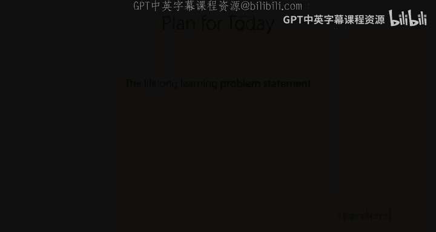

# 15：终身学习 I 🧠

在本节课中，我们将要学习**终身学习**。这是一个涵盖多种不同场景的领域，其问题定义并不总是非常明确。我们将探讨终身学习的基本方法，思考如何改进这些方法，并从元学习的视角重新审视问题定义，看看如何将元学习的思想应用于终身学习。

## 课程回顾与问题引入

在之前的课程中，我们讨论了多任务学习和元学习。

*   **多任务学习**：目标是同时解决一组训练任务，最终模型需要在这组任务上都表现良好。
*   **元学习**：目标是在一组训练任务上获得经验后，能够快速学习一个**新**任务。

然而，现实世界中很多场景并非一次性给出所有任务，而是**按顺序**一个接一个地出现。这与我们之前讨论的问题设置有所不同，因为你无法一开始就获得所有任务的大量数据，而是需要以更**序列化**的方式利用之前的经验。

**以下是几个例子：**
*   **学生学习**：学生按顺序学习学校里的概念，而不是一次性获得所有知识。课程可能由易到难，后面的任务建立在前面任务的基础上。
*   **图像分类系统**：系统从不同用户持续上传的图像流中学习。新用户在不同时间加入平台并开始上传图片。
*   **机器人技能学习**：机器人需要在不同环境中学习越来越多的技能，它可能会不断遇到需要学习的新事物或新环境。
*   **虚拟助手**：助手需要在不同时间帮助不同用户完成不同任务，新用户会不断到来。
*   **医疗辅助系统**：系统按顺序处理病例，而非一次性获得所有病例。

## 术语辨析与问题定义的多样性

上一节我们介绍了终身学习的应用场景，本节中我们来看看如何描述这类问题。文献中有很多术语来描述这类序列学习问题，包括**在线学习**、**终身学习**、**持续学习**、**增量学习**和**流数据**设置。不幸的是，这些术语并没有非常清晰的定义，经常被互换使用，导致这个领域的概念有些模糊。

需要区分的是：
*   **序列学习**：指随着数据按顺序到来而进行学习。
*   **序列数据**：指单个数据点本身具有序列结构（如时间序列）。
*   **序列决策**：指系统按顺序做出多个决策。

由于“终身学习”的定义缺乏共识，我们将通过一个练习来深入理解。

**练习：定义你的终身学习问题**
请选择一个示例场景（可以是之前提到的，也可以是你自己设想的），并在小组中讨论以下三点：
1.  **实验设置**：如何设计实验来为该场景开发测试算法？
2.  **算法属性**：对于这个具体问题，算法需要具备哪些期望或必需的属性？
3.  **系统评估**：如何评估这样一个系统？

**以下是供参考的示例场景：**
*   学生学习课程
*   图像分类系统处理用户图片流
*   机器人学习一系列技能
*   虚拟助手帮助不同用户
*   医疗辅助系统处理病例

（小组讨论与分享环节略）

从各组的分享中，我们可以看到问题定义的多样性：
*   **性能关注点**：大多数情况下，我们希望模型在**过去任务**和**新任务**上都有良好表现。但在某些情况下（如课程学习），我们可能只关心最终任务的性能。
*   **模型目标**：有时我们希望学习一个能处理所有任务的**单一模型**；有时（如虚拟助手）我们更关心模型的**适应性**，因为不同用户可能有不同的目标。
*   **任务序列**：任务可能是独立同分布的，也可能是随时间可预测的，或者是按课程安排的。甚至可能是**对抗性**的序列（如垃圾邮件过滤）。
*   **任务边界**：可能有清晰的离散任务边界（如新用户），也可能是**连续渐变**的（如季节变化、舆情变化）。
*   **资源考量**：除了模型性能，我们可能还关心**数据效率**、**计算资源**、**内存使用**（无法存储所有历史数据）、**隐私**（不能存储敏感数据）、**可解释性**和**公平性**等。

这个练习的目的是阐明：**根据你面对的具体问题，最重要的考量因素和约束条件会有所不同**。因此，某些算法可能只适用于特定的问题设置。

## 问题形式化与核心概念

上一节我们探讨了问题定义的多样性，本节中我们来看看一个相对通用的形式化描述。一个简单而通用的在线/终身学习问题形式化如下：

在时间步 `t`，你观察到一个输入 `x_t`（如图像、病历），目标是预测其标签 `y_t`。做出预测后，你会观察到真实标签 `y_t`。这个过程不断重复。

**公式表示：**
对于 `t = 1, 2, ...`：
1.  接收输入 `x_t`
2.  基于当前模型参数 `θ_t` 预测 `ŷ_t = f_θ_t(x_t)`
3.  接收真实标签 `y_t`，计算损失 `l(ŷ_t, y_t)`
4.  （可选）根据该数据点更新模型参数

**需要注意的变体：**
*   **标签延迟**：可能无法立即获得标签。
*   **流式设置**：由于数据量过大、计算资源有限或隐私考虑，**不允许存储**历史数据。
*   **任务标识**：如果数据来自一系列任务，你可能还会观察到任务标识符 `z_t`。

### 评估指标：遗憾

在在线和终身学习文献中，一个常见的评估指标是**遗憾**。它衡量了算法随时间累积的损失与“事后诸葛亮”最优策略的累积损失之间的差距。

**公式：**
`Regret(T) = Σ_{t=1}^{T} l(f_θ_t(x_t), y_t) - min_θ Σ_{t=1}^{T} l(f_θ(x_t), y_t)`

*   **第一项**：你的算法在所有时间步上的损失总和。
*   **第二项**：假设我们能纵观所有数据后，选择一个**固定的**最优参数 `θ*`，用这个参数在所有数据上计算得到的最小损失总和。

我们希望遗憾 `Regret(T)` 随时间 `T` 的增长尽可能慢（**次线性增长**）。线性增长的遗憾是平凡的（例如，始终输出一个固定预测值就能达到）。次线性增长意味着算法在不断进步，其平均性能在逼近最优固定策略。

### 迁移的类型

终身学习中一个核心概念是**正向**和**负向迁移**，以及**前向**和**后向迁移**。

*   **正向前向迁移**：由于见过先前任务，在**未来任务**上表现更好（相比从零开始学习）。
*   **正向后向迁移**：由于见过后续任务，在**过去任务**上表现更好（相比只见过过去任务时）。例如，当每个任务数据很少时，累积更多任务的数据后，可能对早期任务有更好的理解。
*   **负向前向迁移**：见过先前任务导致在未来任务上表现更差。
*   **负向后向迁移**：见过新任务导致在过去任务上表现更差（即**遗忘**）。这在内存有限、无法重复训练旧数据时非常常见。

迁移的衡量可以针对**最终性能**，也可以针对**学习效率**（如达到某个性能所需的数据量）。

## 基础算法与案例研究

上一节我们介绍了问题形式和评估概念，本节中我们来看看解决终身学习的两种基础方法。

### 方法一：存储所有数据并训练

在时间步 `T`，存储所有已见数据 `D = ∪_{t=1}^{T} { (x_t, y_t) }`，然后训练一个模型最小化在该数据上的损失。通常不会每一步都从头训练，而是用上一步的模型参数进行**热启动**并微调。

*   **优点**：通常能获得很强的性能。
*   **缺点**：计算和内存开销大。需要存储所有历史数据。

这常被称为 **Follow-the-Leader** 算法。

### 方法二：随机梯度下降

在时间步 `t`，仅根据当前接收到的数据点 `(x_t, y_t)` 对模型参数进行一次（或几次）梯度更新。

*   **优点**：计算代价极低，除模型参数外几乎不需要内存。
*   **缺点**：容易发生**负向后向迁移**（遗忘），因为模型没有机会对旧数据重复学习。在非独立同分布的数据流上，这可能很严重。

这本质上就是**随机梯度下降**，但在这种严格的在线设置下，每个数据点只使用一次。

### 机器人抓取案例研究

一个实际案例是机器人抓取。首先在一个大型数据集（58万次抓取尝试）上预训练模型，在已知物体上达到86%成功率。但当面对新物体（如玻璃瓶）时，性能显著下降。

**简单微调**：在新场景数据与部分原始数据混合的数据集上微调预训练模型，能大幅提升新场景下的性能（例如，在透明瓶子上从49%提升到66%）。

**序列学习应用**：将上述方法应用于序列场景。每遇到一个新条件，就用上一个任务的模型参数初始化，并在新场景数据和原始预训练数据的混合集上微调。这种方法能持续提升在新场景上的性能。

然而，这种方法仍然依赖于保存部分原始数据。如果内存有限，无法保存旧数据，则仍会发生遗忘。

## 改进算法：梯度情景记忆

上一节我们看到，简单地微调需要存储数据，否则会遗忘。本节中我们探讨一种旨在用**极少内存**避免负向后向迁移的算法。

我们假设可以为每个任务存储一个非常小的**情景记忆**（例如，每个任务仅5个样本）。目标是：在学习新任务时，确保更新不会“遗忘”旧任务。

**核心思想**：
1.  最小化新任务上的损失。
2.  添加约束：对于所有旧任务 `k`，更新后的模型在旧任务记忆 `M_k` 上的损失，不应比更新前的模型更差。

**公式化**：
在时间步 `t`（对应任务 `T`），我们求解：
`min_θ L_T(θ)`
约束条件：对于所有 `k < T`, `L_k(θ) ≤ L_k(θ_{t-1})`
其中 `L_k(θ)` 是在任务 `k` 的记忆 `M_k` 上计算的损失。

**实现挑战**：直接施加损失约束很困难。一个实用的方法是施加**梯度约束**。我们要求，新任务上的更新方向，应该与每个旧任务损失函数的梯度方向尽可能一致或正交（在局部线性假设下）。这样能保证（或至少鼓励）更新不会增加旧任务的损失。

这可以形式化为一个**二次规划**问题来求解更新方向。

**实验结果**：
该方法（称为 **GEM - Gradient Episodic Memory**）在多个序列学习问题上进行了测试：
1.  **排列MNIST**：每个任务是对MNIST图像像素的不同排列。
2.  **旋转MNIST**：每个任务是对MNIST图像的不同旋转。
3.  **增量CIFAR-100**：每个任务引入5个新类别。

在总内存固定（约500个样本）的情况下，GEM能够：
*   保持与训练独立模型或单一模型相当或更高的平均准确率。
*   显著减少负向后向迁移（遗忘），甚至获得少量正向后向迁移。
*   在某些任务上（如旋转MNIST）显示出正向迁移。

## 在线元学习

到目前为止，我们考虑的评估方式是模型在**每个数据点到来时**的即时性能。但对于任务序列，更现实的评估可能是：每遇到一个**新任务**，先给予少量数据用于适应，然后评估其在该任务上的性能。这更接近**元学习**的评估方式。

**形式化**：
对于每个到来的任务 `T_i`：
1.  接收该任务的一个小训练集 `D_i^{tr}`。
2.  应用某个**更新过程** `U`（如梯度下降）于当前元参数 `φ`，得到针对该任务的参数 `θ_i = U(φ, D_i^{tr})`。
3.  对于该任务的每个测试数据点 `(x, y)`，用 `θ_i` 进行预测并计算损失。
4.  根据损失更新元参数 `φ`。

我们可以定义类似**遗憾**的指标，但这里比较的是“最佳元学习器”与“事后最优元学习器”的累积损失差距。

**算法：Follow-the-Meta-Leader**
类似于存储所有数据的方法，但这里我们存储所有历史数据用于**元训练**。在每一步，我们用所有历史数据元训练得到一个更新过程 `U`，然后将这个 `U` 应用于新任务。同样，可以用上一步的元参数进行热启动。

**优势**：如果任务序列是非平稳的，基于优化的元学习器可能表现更好，因为它们能学习适应分布外任务的更新规则。

实验表明，在这种在线元学习设置下，元学习算法能够随着任务数量的增加，持续提升**学习效率**（需要更少的数据）和**最终性能**。

## 总结与要点 🎯

本节课中我们一起学习了终身学习的基础知识。

**核心要点如下：**
1.  **终身学习涵盖多种问题**：存在许多不同形式的终身学习，但文献中常将它们统称为一个名字。因此，阅读论文时需仔细辨别其具体问题设置。
2.  **定义问题陈述是关键**：定义清晰的问题陈述通常是终身学习中最难的部分之一，需要明确性能指标、约束条件和评估方式。
3.  **元学习是终身学习的一个子集**：元学习关注如何利用先前经验来快速学习新任务，可以看作是终身学习在“快速适应”这一维度上的特例。
4.  **基础算法与改进**：存储所有数据并训练（Follow-the-Leader）和在线SGD是两种基础方法。通过引入情景记忆和梯度约束（如GEM），可以在有限内存下减轻遗忘。
5.  **在线元学习**：将评估方式调整为“先适应，后评估”，并应用元学习算法，可以实现随着经验积累而不断提升学习速度和性能的目标。

终身学习仍然是一个开放且活跃的研究领域，有许多有趣的问题等待探索。