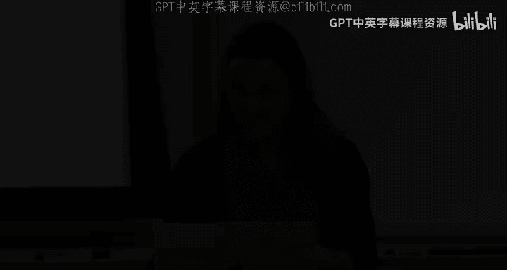
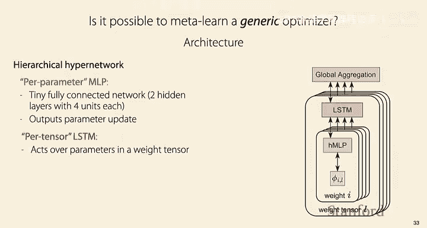
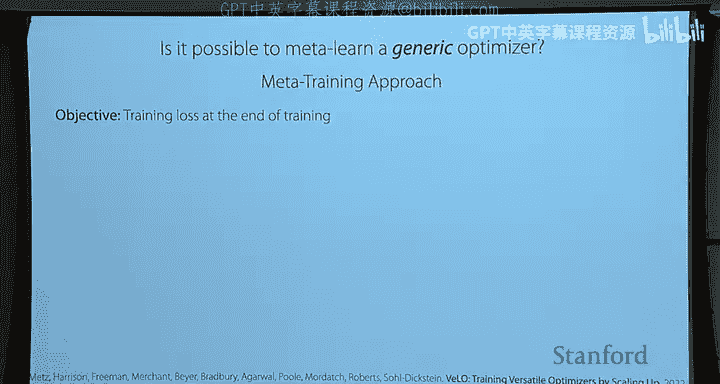
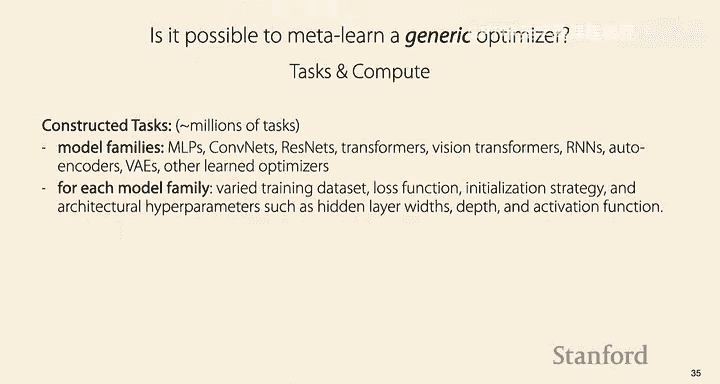
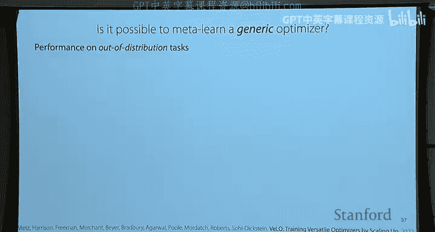

# 16：前沿与开放挑战 I 🚀

在本节课中，我们将探讨元学习领域的最新研究趋势和激动人心的前沿方向。我们将重点关注如何利用元学习来适应数据分布的变化，以及如何学习比以往更通用的组件，例如优化器和网络架构中的对称性。最后，我们将讨论该领域一些突出的开放性问题与挑战。

---

## 课程安排与后勤事项 📅

首先是一些课程安排事项。项目海报展示会将在下周三举行。我们很快会在Ed平台上发布详细信息。由于选课学生众多，展示会将分为两个不同的场次，每位同学将被分配到其中一个场次。更多细节将很快在Ed上公布。

最终项目报告将在两周后的周一截止。

另外，关于之前感恩节假期前的高分辨率反馈，有几点需要说明。反馈主要涉及作业三和作业四的时间安排，我们将在下次开课时重新调整这个时间安排。

另一个多次被提及的问题是希望公布作业的参考答案。我们对此进行了大量讨论。这个问题总是有些棘手，特别是因为我们会在不同学期重复使用作业题目。这样做是为了保持作业的高标准和高质量。但这也意味着，如果我们本学期公布了答案，这些答案可能会流传出去，被未来的学生使用。过去我们曾遇到过学生将自己的答案发布在网上，导致其他学生抄袭的情况。我们不希望助长这种作弊行为。因此，我们决定不公布参考答案，这虽然有些遗憾。但如果你对作业中的错误、评分或其他任何问题有疑问，欢迎在Ed上发帖或参加答疑时间，我们非常乐意与你一起讨论作业的解决方案，希望这能起到与获得参考答案类似的效果。

---

## 本节课内容概述 🎯

我今天的计划是讨论一些我认为非常令人兴奋的最新研究趋势。这应该是一堂有趣的课，因为我将谈论一些我认为很酷的、处于研究前沿的东西。这包括用于适应分布变化的元学习，例如使用未标记样本进行适应，以及使用对模型期望修改的局部描述进行适应。

然后，我还将讨论如何元学习比我们过去所见更通用的东西。这包括尝试元学习一个可用于任何不同问题的通用优化器，以及尝试元学习神经网络架构中的对称性。

最后，我将简要谈谈我认为该领域中一些突出的开放性问题与挑战，以及我们可能如何开始着手解决这些挑战。

---

## 适应分布变化 🔄

首先，我们来谈谈适应分布变化。为什么这个问题很重要？我认为分布变化是一个非常引人入胜且重要的问题，因为它反映了现实的本质。

当前机器学习研究的范式是：获取数据，在该数据上训练模型，然后在一些保留数据上评估该模型。但在现实中，世界在不断变化。例如，股票、供需关系会变化，或者你的系统被部署到世界不同地区。因此，系统实际部署时遇到的数据，往往与训练时看到的数据不同。

我认为我们需要能够处理世界变化这一事实的算法，而不是仅仅部署一个静态系统。我也认为元学习可能是解决这一挑战的非常有用的工具，因为元学习可以训练出能够快速适应的系统。我们将在接下来的幻灯片中看到这一点。

既然这是当前面临的现实，你可能会问，业界是如何应对的呢？当人们在实践中使用机器学习时，他们如何应对世界不断变化的事实？你可以询问从事机器学习系统工作的Chip Puin，她指出，由于概念漂移，机器学习系统在生产环境中会迅速退化。对于在线机器学习系统，通常你希望尽可能快地更新它们，以应对因概念漂移而迅速退化的问题。

因此，我认为这是一个值得了解的有趣现象。这意味着我们通常开发机器学习系统的方式是基于这种“训练-测试”范式，而实际上它们在实践中的使用方式更像是这种持续训练的场景，这与最初的设想有所不同。所以，也许这意味着，如果我们想构建更好的机器学习系统，并开展与现实世界相关的研究，我们应该考虑到它们需要随时间不断更新这一点。

---

### 微调的局限性

微调是一种可靠且性能良好的方法，用于尝试随时间快速更新模型。但它也有一些局限性。

首先，它需要你从数据分布的新部分收集**带标签的数据**。这可能成本高昂、耗时，甚至可能无法获得。
其次，它可能在**计算上很昂贵**。尤其是随着模型越来越大，微调模型所需的计算量在某些时候会变得不太实际。
此外，它通常是一个相当**生硬的工具**。如果你只想对模型进行非常小的更改（例如，你发现了一个错误或某个小细节发生了变化），微调不一定是进行精确、小范围更改的最佳工具。

因此，接下来我将讨论我们如何能够利用元学习来实际解决微调的这些弱点。

---

### 领域偏移

首先，我们将关注**领域偏移**。这是我们在领域适应和领域泛化课程中看到的一种分布变化。在讨论完领域偏移后，我们将讨论一种更普遍的分布变化，称为**概念偏移**。

回顾一下，在领域偏移中，你有某种**分类的领域变量**。这可能对应不同的用户、不同的地点、一天中的不同时间等。通常，这种领域信息可以从你训练数据集中已有的元数据中推导出来。

领域偏移的假设是：你的训练数据来自这里的分布，而你的测试数据来自同一分布，但唯一改变的是这个底层领域变量的分布。这种分布变化相当普遍，也是我们在第一部分将要关注的变化，但它也有一些无法捕捉的情况。

---

### 分布鲁棒优化

现在，有一种方法。我们在领域适应和领域泛化的课程中看到了一些处理领域偏移的方法。一种我们没怎么讨论的方法是**分布鲁棒优化**。

这种方法的工作原理是：你尝试在领域变量上形成一个**对抗性分布**，然后针对最坏情况的分布进行优化。具体来说，你可以制定一种对抗性优化，目标是找到一个在领域的最坏情况分布下表现良好的模型。如果你有一个分类的领域变量，这实际上相当容易评估：你只需选择模型在训练数据集上表现最差的领域，然后针对该领域的性能进行优化，并迭代这个过程。

这种对抗性优化可以实现对不同领域的鲁棒性。它也可能比另一种你可能听说过的鲁棒性——对抗鲁棒性——不那么悲观。但它通常会牺牲平均性能或经验性能，因为它对测试时将看到的数据或领域实际上相当悲观。

---

### 自适应风险最小化

因此，我们要尝试做的是制定一种**替代范式**，它不那么悲观，但仍然允许我们保持相当的鲁棒性。我们将通过以下方式实现：不是针对最坏情况的领域进行优化，而是尝试针对**每个给定领域经过少量适应后的领域性能**进行优化。

具体来说，这意味着：我们假设我们拥有来自测试领域的**未标记数据**。这可能是来自新用户、新时间段或新地点的未标记数据。例如，如果你想识别手写体（这是来自联邦扩展MNIST数据集的数据，都来自一个用户），你可能拥有来自该用户的一批未标记数据。

你的目标是利用这些未标记数据，将你的模型适应到该用户，然后推断出该批次中所有样本的标签。

这种方法在几个方面与其他方法不同：
1.  与微调不同，它只需要未标记数据来适应模型，而不需要带标签的数据。
2.  与领域泛化和领域适应等方法不同，我们**不假设在训练时能访问这些未标记数据**。我们实际上是在测试时即时适应模型。

这种方法做出的主要假设（实际上是两个主要假设）是：首先，你的训练数据集中有**领域标签**；其次，在测试时，你**一次性获得来自同一组或同一领域的一批测试输入**，而不是只有一个样本。这与标准的机器学习设置略有不同，后者通常假设测试时一次只有一个输入。

我们将这个问题设置称为**自适应风险最小化**，因为你不是直接评估给定样本的风险，而是有机会用少量样本进行适应。

---

### 如何实现自适应风险最小化

接下来的问题是，如何优化这个问题，以及如何开发一种方法，让你能够仅用来自分布新部分的未标记数据进行适应。

为此，我们可以实际训练一个模型，使其能够对训练数据集中的不同领域进行**小样本适应**。这基本上会使用你在课程早期部分看到的相同的元学习算法。

关键的不同之处在于：我们不是进行小样本带标签适应，而是**只获得未标记数据**。因此，我们希望能够用这些未标记样本进行适应，而不是用几个带标签的样本。

有几种不同的方法可以做到这一点：
1.  你可以使用MAML算法，但由于无法计算标准的交叉熵损失函数，你可以**元学习一个损失函数**，并使用这个元学习的损失函数，使得当你在未标记数据上用该损失函数进行适应时，在训练集的每个领域上都能表现良好。
    *   具体来说，你将同时元学习**初始参数**以及由神经网络表示的某个损失函数的参数。
    *   在内部循环中，使用该损失函数从初始参数更新网络，得到一个新网络，然后优化整个系统，使其在训练领域的每个领域上都能获得良好的性能。
2.  或者，你也可以使用**黑盒方法**，简单地将所有未标记样本输入到一个产生某种上下文的神经网络中，然后使用该上下文对你的样本进行预测。这种黑盒方法实际上相当直接，因为要修改黑盒方法使其在没有标签的情况下工作，唯一需要做的就是**在将数据作为输入传递时去掉标签**。
    *   有几种不同的架构可以用于这种黑盒方法。一种是这里显示的架构，你只是预测这个上下文并将其传递到网络中。
    *   或者，这个上下文可以用不同的方式计算。一种非常简单的方法是让上下文对应于**批归一化统计量**。这意味着你将所有样本作为一批输入，不是使用训练数据集的批归一化统计量，而是在测试时使用你所有的样本即时计算它们。

---

### 实验结果

论文中有很多不同的实验，这里我只提几个。

第一个是之前展示的联邦扩展MNIST示例。在这个案例中，所有实验都试图适应具有不同笔迹的新用户，测试时只有来自这些用户的未标记数据可用。

实验与多种方法进行了比较，包括标准经验风险最小化、之前提到的组鲁棒性方法、领域对抗训练，以及一种非常简单的上采样方法（对每个用户的数据进行上采样，使其分布均匀，从而等概率地从他们中采样数据）。

然后，我们可以观察在这些新用户上的平均测试性能，以及最差用户的性能。这种最差情况性能很有用，因为它能给你一个公平性的概念（你是否在某些用户上表现极差，而在其他用户上好得多），也能给你一个鲁棒性的概念（如果你的分布更多地转向那些最差情况的用户，你的性能会如何）。

观察数据，首先在平均准确率方面，我们看到领域对抗神经网络实际上比经验风险最小化表现稍好。但通过使用上下文变量进行适应，我们可以获得大约5%的提升。

在最差情况准确率方面，我们也看到了大约5%的提升，超过了现有最佳方法（在这个案例中是上采样或领域对抗训练）。

我们还可以定性地看看它在做什么。这里有一个例子：系统被给定了这张图片。如果你问用经验风险最小化训练的神经网络，它会告诉你这是“2”。同样，如果你问自适应风险最小化（使用上下文变量的元学习模型），给它这两个例子并询问标签，它也会说是“2”。

但是，如果你实际上给它更多上下文，比如所有这些未标记样本，它就能正确判断出这实际上对应的是小写字母“a”。它之所以能做到这一点，是因为它可以查看其他例子（例如这个例子），并意识到这个特定用户经常写不带圈的“2”。因此，这一定是小写字母“a”而不是“2”。本质上，系统正在适应这个特定用户，调整模型以适应该用户，从而能更准确地为该用户做出预测。

我将提到的另一个实验是关于适应不同的图像损坏。这是使用CIFAR-10-C和Tiny ImageNet-C数据集进行的。训练时使用了56种不同的损坏，然后测试其适应在训练中未见过的另外22种损坏的图像的能力。

同样，我们看到领域对抗神经网络方法是先前表现最好的方法之一，尽管它的表现实际上与标准经验风险最小化有些相似。相比之下，通过实际适应并训练快速适应未标记数据的能力，我们能够在平均准确率上获得约2-3%的提升，在最差组准确率上获得7-9%的提升。

---

### 概念偏移

现在，我们来看看其他形式的分布变化。具体来说，接下来我们将看一种称为**概念漂移**或**概念偏移**的分布变化。这是指基本上整个 `P(y|x)` 分布可能发生变化。实际上，在我们将要看的大多数例子中，`P(x)` 不会改变，只有 `P(y|x)` 会改变。

需要注意的是，当 `P(y|x)` 发生变化时，你需要某种监督信息来适应这种分布变化，因为 `P(y|x)` 可能以多种不同的方式变化。

具体来说，在这种情况下，我们将在**语言模型**的背景下研究如何处理这种分布变化，尽管我们将要看的许多方法也适用于语言模型之外。

作为一个激励性的例子，如果你拿今年早些时候访问过的一个版本的GPT-3，问它“最大的英语欧盟国家是哪个？”，它会告诉你答案是“英国”。但当然，英国已不再是欧盟成员国，所以这个答案不正确，正确答案应该是“爱尔兰”。如果你问它“阿尔及利亚现任总统是谁？”，它也会给出一个过时的答案。同样，如果你问它“梅西效力的俱乐部球队是哪个？”，它也会给出过时的信息。

因此，问题是我们在这个场景下应该做什么？我们应该如何尝试更新像GPT-3这样的模型，使其能够对不断变化的世界做出正确的预测？不幸的是，重新训练甚至微调GPT-3都会非常昂贵。因此，我们希望能够在不需要微调或完全重新训练整个模型的情况下，找出如何保持这些大型模型的最新状态。

---

### 模型编辑框架

这就是**编辑框架**可以发挥作用的地方。理想的情况是，我们可以拿我们的基础模型（如果你问它“英国首相是谁？”，它会告诉你答案是“特蕾莎·梅”，这在以前当然是正确的，但那也是三任首相之前的事了），然后我们可以拿这个例子告诉它答案应该是“里希·苏纳克”，并将其传递给一个**模型编辑器**，从而得到一个编辑后的模型，该模型可以给我们正确的答案，包括对问题的重新表述或其他在范围内的内容（例如，“里希·苏纳克是英国首相吗？”）。

此外，我们不仅希望它对范围内的输入给出正确答案，还希望我们能够询问范围外且不相关的事情（例如，“梅西为谁效力？”），并仍然得到正确答案。也就是说，我们不希望编辑影响与编辑无关的事情。

具体来说，为了更清晰地界定这个问题，也许你的编辑示例是“英国首相是谁？”。范围是与该输入相关的输入空间，包括问题的重新表述。也有一些超出范围的例子，比如“天空为什么是蓝色的？”。值得一提的是，有些例子既在范围内又超出范围，处理起来会更困难。例如，“里希·苏纳克不是首相的地方是哪里？”这属于范围内，但比简单的重新表述要更远、更困难。同样，有些看似相关但不应在编辑模型时改变的事情，这些实际上是最具挑战性的情况。当我们实际进行一些实验时，我们将重点评估这些例子，而不是像“天空为什么是蓝色的？”这样简单的例子。

---

### 将编辑问题构建为元学习问题

我们可以将这个问题构建为一个**元学习问题**。Cizein等人在2020年发表的一篇很酷的论文，将这个问题构建为元学习问题，试图训练一个能够以非常具体的方式进行编辑的神经网络。不幸的是，这篇ICLR 2020论文中的具体方法不太能扩展到大型语言模型。因此，就我们将要介绍的方法而言，我们将介绍一些更近期的、可扩展性更强的工作，但正是那篇论文引入了在元学习设置中进行这种操作的范式。

为了将其构建为元学习问题，我们假设我们有能力收集一个数据集，该数据集向我们展示应该如何进行编辑的示例。具体来说，这些数据将包含：
1.  编辑的描述符。这可以是一个输入-输出对，例如“英国首相是谁？”和“答案是里希·苏纳克”。
2.  一个超出范围的示例。这将试图强制模型不应在这些超出范围的示例上发生变化。
3.  范围内输入-输出对的示例。具体来说，如果给出一个像“英国首相目前是谁？”这样的例子，它会被告知该问题的新答案应该是什么。

因此，这个编辑数据集本质上是我们用来教导模型编辑器如何编辑模型的东西。收集这个编辑数据将是一项不简单的任务，但一般来说，如果我们收集足够通用的编辑数据，其中包含我们可能想要对模型进行的各种不同类型编辑的示例，那么我们只需要使用它一次、收集一次，就可以训练一个单一的模型编辑器，用于对大型模型进行各种编辑。

---

### 模型编辑方法一：修改梯度

一旦我们有了那个编辑数据集，有几种不同的方法可以训练这些模型编辑器之一。

第一种方法试图**实际改变梯度并更新模型的权重**。具体做法是：它将**对应于在该单个编辑示例上微调模型的梯度**作为输入，并尝试将该微调梯度转换为对模型更好的更新。

这可以用这张图来概括：如果你有预训练模型并想对其进行编辑，那么你计算如果在该编辑上进行微调会得到的梯度，然后将该梯度传递给这个模型编辑器，模型编辑器将输出一个修改后的梯度，你实际上将使用这个梯度来编辑模型。一旦你将这种修订版的梯度应用到模型上，目标将是让它对这些编辑给出正确答案，当然，也不影响模型在其他示例上的输出。

因此，这里的主要组成部分就是训练中间这个单一的模型编辑器，它以梯度为输入，输出该梯度的修改版本。训练方式是使用编辑数据集：训练它使其在范围内泛化示例上输出正确的预测，并且它应该保持原始模型在给定超出范围示例时的输出分布。所以损失函数中有两项。

关于计算成本：是的，你仍然需要计算梯度。但一个重要点是，我们只对模型应用一次更新。所以我们将输出一个修改后的梯度，使得仅该梯度的一步更新就能得到一个好模型。因此，它比微调需要更少的更新步骤。其次，它也会比微调效果更好，因为通过训练它这样做，它会给你一种更有效地进行针对性编辑而不影响范围外示例的东西。

关于梯度分析：不幸的是，分析起来有点困难。我猜它可能在某种程度上增加了规模，但它肯定不止于此。一般来说，解释神经网络的权重和梯度都很困难。不过，我提到一点：单个示例的梯度实际上是一个秩为1的矩阵。如果你有一个权重矩阵并计算其梯度，它对应于前向激活和从B层反向传播的梯度的外积。因此，它基本上是两个向量的外积，所以实际上是一个秩为1的矩阵。这个名为MEND的模型编辑器做的一件很酷的事情是，它实际上进行了分解：不是传入权重矩阵，而是将两个秩为1的分量传入网络，并输出一个秩为1或低秩的模型更新。结果，这个模型编辑器的输入和输出的维度要小得多。具体来说，如果这是像H和H_B这样的激活大小，那么这个权重矩阵是H乘以H_B，而两个秩为1项的维度是H加H_B。这意味着输入的维度将比输入和输出整个权重矩阵要小得多。

---

### 模型编辑方法二：半参数化方法

在介绍一些结果之前，我还要展示第二种模型编辑方法，它**试图不更新模型的权重**。第二种方法的动机是，第一种方法在扩展到大量编辑时有些困难，因为实际上很难找出如何以能进行此类针对性编辑的方式来改变权重。

因此，第二种方法将尝试采用一种**更半参数化的方法**。我们将拥有我们的基础语言模型，但**不更新这个语言模型的权重**，而是将其完全冻结。相反，我们将尝试在该语言模型周围形成一个包装器，使得包装后的语言模型在应用编辑后能给出你想要的行为