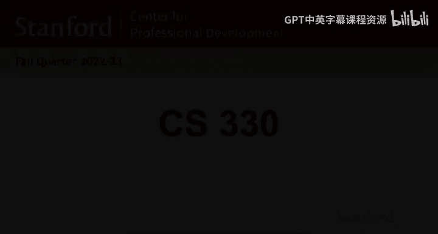
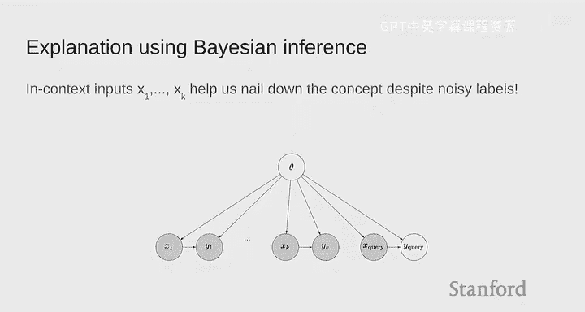
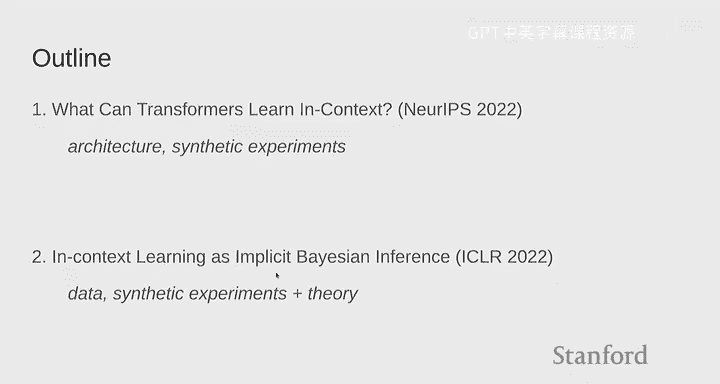
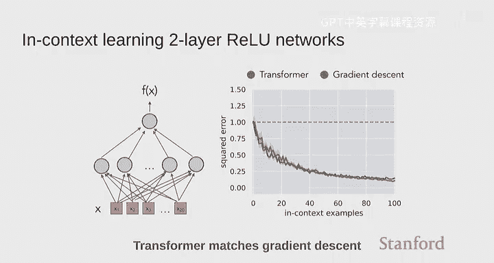
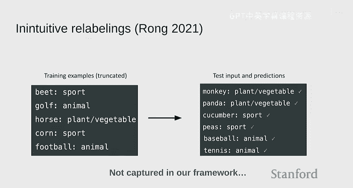
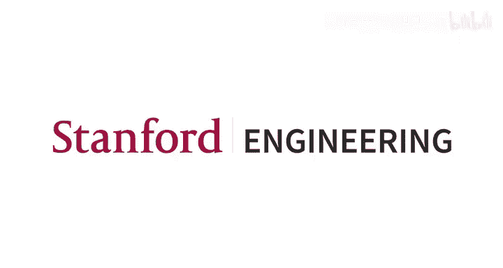

# 17：上下文学习（Percy Liang 客座讲座）🧠

在本节课中，我们将跟随斯坦福大学副教授 Percy Liang 的客座讲座，深入探讨大型语言模型（如 GPT-3）中一个令人着迷的现象——**上下文学习**。我们将理解其定义、重要性，并通过理论和实验分析其工作原理。

---

## 概述

上下文学习是指模型仅通过观察提示中的几个示例，就能学会执行新任务的能力。这挑战了传统机器学习“训练-测试”分布需一致的范式。本节课将分两部分探讨：首先，分析固定模型（如 Transformer）如何实现上下文学习；其次，探讨这种能力如何通过简单的训练目标（如下一个词预测）涌现出来。

---

## 第一部分：Transformer 如何执行上下文学习？🔍

上一节我们概述了上下文学习的现象。本节中，我们来看看一个固定的模型架构（如 Transformer）是如何具备这种能力的。

为了严谨地研究这个问题，我们首先需要形式化“学习”的定义。这里，我们借鉴统计学习理论的思想，将上下文学习定义为模型对一个**函数类**的学习能力。

### 定义：函数类的上下文学习

*   我们定义一个函数类（例如，所有20维的线性函数）。
*   每次评估时，我们从这个类中采样一个具体的函数 `f`。
*   然后，我们采样一些输入 `x1, x2, ..., xk`，并计算对应的输出 `yi = f(xi)`。
*   我们将这些 `(xi, yi)` 对作为上下文示例输入模型，最后给出一个新的查询输入 `x_query`。
*   模型的任务是预测 `y_query = f(x_query)`。

在这个框架下，我们使用一个经过修改的 Transformer 进行实验：输入是实数向量，输出层直接进行回归（使用平方损失），而不是预测词表分布。

以下是我们在不同函数类上的实验结果：

**1. 线性函数**
*   **观察**：随着上下文示例数量增加，Transformer 的预测误差下降曲线与**最小二乘法**的最优性能几乎重合。
*   **对比**：简单的基线方法（如平均法、最近邻法）效果很差。
*   **结论**：Transformer 学会了模仿最小二乘法的行为。

**2. 稀疏线性函数（如仅3个非零权重）**
*   **观察**：此时最优算法是 **LASSO**（L1正则化）。Transformer 学会了模仿 LASSO 的行为，其性能优于普通最小二乘法。
*   **关键点**：模型需要经过在稀疏函数分布上的训练才能获得此能力，这并非凭空产生。

**3. 两层ReLU神经网络**
*   **观察**：Transformer 的表现与**梯度下降**算法优化该网络的效果相匹配。

**4. 决策树**
*   **观察**：在合成的数据分布上，Transformer 的性能甚至超过了 **XGBoost** 这种手工设计的先进算法。

### 探究模型的鲁棒性与归纳偏好

仅仅在分布内表现良好还不够，我们还需要测试模型的泛化能力。我们通过改变测试时输入 `x` 的分布来进行探究：

*   **协方差偏移**：当测试数据来自不同协方差的高斯分布时，Transformer 性能有所下降，但依然近似遵循最小二乘法的趋势。
*   **标签噪声**：在测试时加入标签噪声，最小二乘法会出现“双下降”现象。有趣的是，Transformer 也表现出类似的误差峰值，这与其近似实现最小二乘法的观察一致。
*   **架构对比**：在相同实验设置下，LSTM 模型在分布内表现类似，但在面对协方差偏移时，并未表现出与 Transformer 相同的双下降现象，这表明**不同架构具有不同的归纳偏好**。

### 第一部分小结

综上所述，我们可以得出以下结论：
*   我们可以严谨地定义模型对某个**函数类**的上下文学习能力。
*   Transformer 能够通过训练，学会模仿多种经典机器学习算法（如最小二乘、LASSO、梯度下降）。
*   模型大小至关重要，更大的模型通常在分布外泛化中表现更好。
*   模型的**归纳偏差**影响了其学习的“算法”，Transformer 的架构使其倾向于学习某些类型的算法。

仍然存在许多开放问题：Transformer 内部究竟表示了什么函数？其他架构（如图神经网络）表现如何？能否从这些模型中发现新的算法洞察？

---

## 第二部分：上下文学习如何从预训练中涌现？🌱

上一节我们探讨了固定模型如何执行学习。本节中，我们来看看这种能力是如何通过简单的预训练（如下一个词预测）获得的。核心挑战在于**分布偏移**：预训练数据分布与提示（包含多个任务示例）的分布是不同的。

### 贝叶斯推断视角

一个理解上下文学习的强大框架是**贝叶斯推断**。
*   将任务本身视为一个潜在的随机变量 `θ`（例如，一个线性函数的权重）。
*   每个示例 `(xi, yi)` 都是在给定 `θ` 的条件下生成的。
*   在观察到 K 个上下文示例后，我们对 `θ` 的后验分布进行推断。
*   最终对查询 `y_query` 的预测，是综合了所有可能 `θ` 的后验预测分布。

**公式表示如下：**
`P(y_query | x_query, D) = ∫ P(y_query | x_query, θ) * P(θ | D) dθ`
其中 `D = {(x1,y1), ..., (xk,yk)}` 是上下文示例集。

上下文学习模型正是在尝试直接近似这个**后验预测分布**。

### 分析分布偏移：一个理论模型

为了分析预训练与提示分布不同带来的影响，我们构建了一个简单的理论模型：
*   **预训练分布**：文档是从一个**隐马尔可夫模型**的混合中生成的，其中混合成分 `θ` 代表主题（如“维基百科传记”）。
*   **提示分布**：我们固定一个目标主题 `θ*`，但生成多个独立的短序列（用分隔符隔开），模拟上下文示例中快速切换但主题相关的文本。

**关键点**：提示分布中的“分隔符”和主题重置是预训练分布中的**低概率事件**，这造成了分布偏移。

我们的理论分析表明，如果不同主题 `θ` 生成的文本分布差异足够大（信号强），能够压倒因分布偏移引入的误差，那么随着上下文示例 `K` 的增加，模型依然能渐近地正确推断出 `θ*` 并做出准确预测。

### 实践启示与实验验证

这个视角带来一些实用提示：
*   **提示设计**：应使提示格式尽可能接近模型的自然训练数据。例如，使用自然语言描述任务，并使用中立的分隔符（如换行符），而非带有强烈语义的词语。

我们基于混合 HMM 创建了一个小型合成数据集进行实验验证：
*   **结果**：Transformer 和 LSTM 都能进行上下文学习，且更长的示例（更接近预训练分布）能带来更好的性能。
*   **一个有趣现象**：增大模型规模能提升上下文学习准确率，即使预训练损失保持不变，这可能意味着模型规模带来了更好的**上下文学习归纳偏差**。

### 解释现实中的奇特现象

贝叶斯视角有助于解释一些经验发现：
*   **随机标签实验**：即使将上下文示例中的标签替换为随机值，GPT-3 的性能下降也远小于完全移除示例。这是因为输入 `x` 本身仍提供了关于任务 `θ` 的信息，而随机标签可能被模型部分“忽略”或平均掉。
*   **标签重映射实验**：如果系统性地将标签重映射（如“体育”->“蔬菜”），GPT-3 能迅速适应新映射并保持一致。这展示了模型强大的**变量绑定**和上下文依赖推理能力，超出了我们当前简单理论框架的解释范围。

### 第二部分小结

我们可以总结如下：
*   **贝叶斯推断**为理解上下文学习提供了一个统一的理论框架，其核心操作“条件化”与上下文学习完全对应。
*   分析**预训练分布**与**提示分布**之间的差异是理解能力涌现的关键。
*   即使存在分布偏移，在一定的分离度条件下，上下文学习仍然可以奏效。
*   一些经验性的提示技巧（如使用自然语言、中立分隔符）可以从该框架中得到直观解释。

---

## 总结与展望 🚀

本节课中，我们一起深入探索了上下文学习这一现代AI的核心谜题。

1.  **第一部分** 通过合成实验证明，Transformer 架构能够被训练来执行对多种函数类的上下文学习，并模仿经典算法。
2.  **第二部分** 引入了贝叶斯推断视角，将上下文学习视为对后验预测分布的近似，并初步分析了从预训练中涌现该能力所需的条件。

上下文学习不仅仅是一个技巧，它代表了机器学习范式的转变，使得快速任务原型设计成为可能。然而，其可靠性仍需深入理解。

未来的研究方向包括：
*   将合成研究的洞察与融合了**先验知识**的真实任务联系起来。
*   探索除上下文学习外的其他**涌现能力**（如思维链、算术推理）。
*   超越传统的“任务”框架，思考语言模型更本质、更复合的能力。

理解上下文学习，不仅是科学探索，也是构建更可靠、更强大AI系统的工程关键。