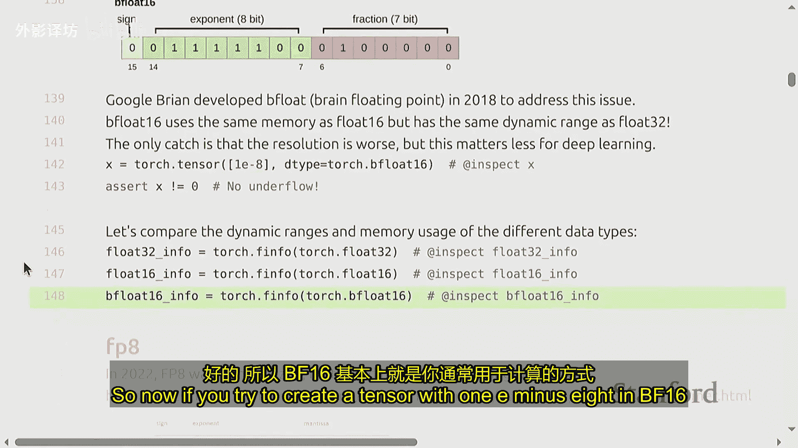
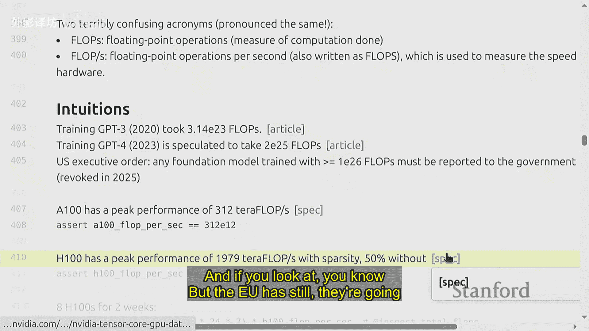
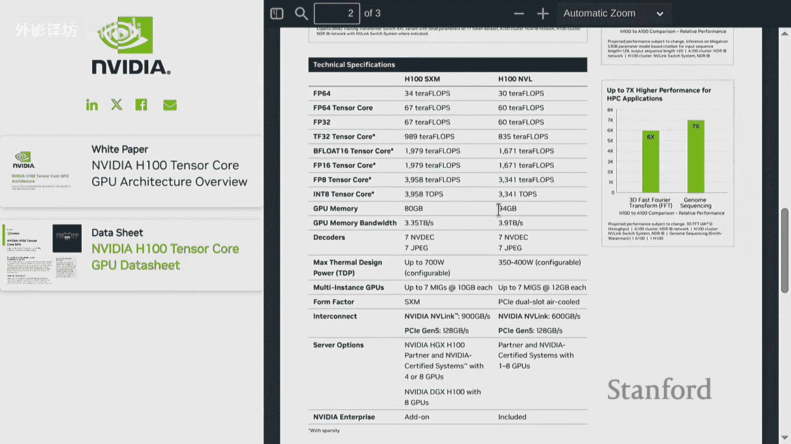
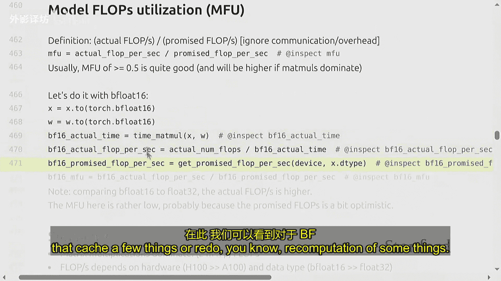
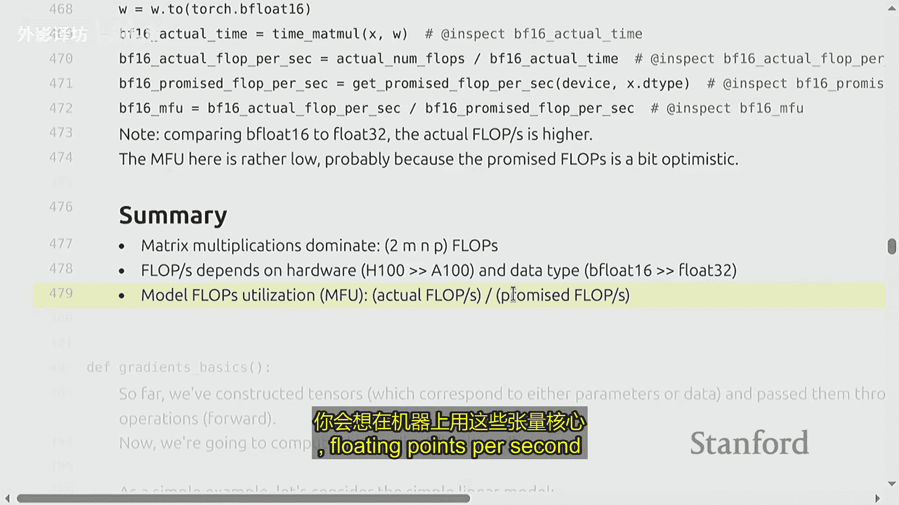
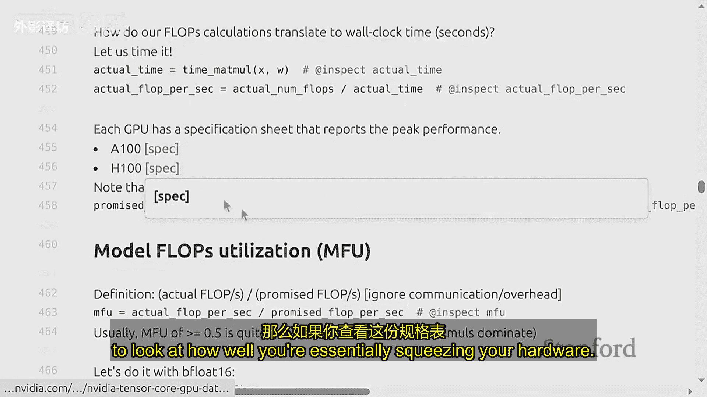
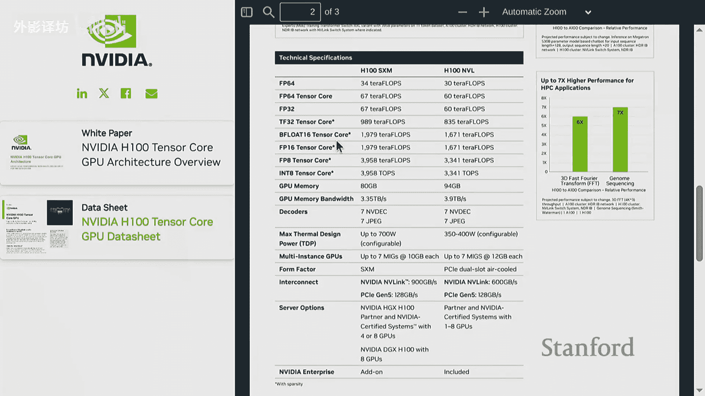
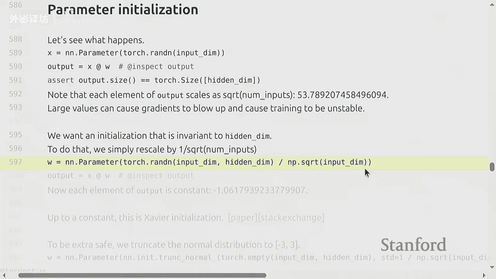
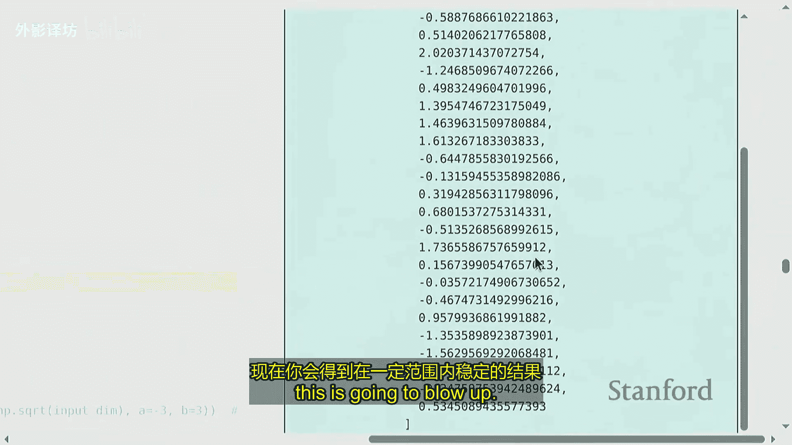
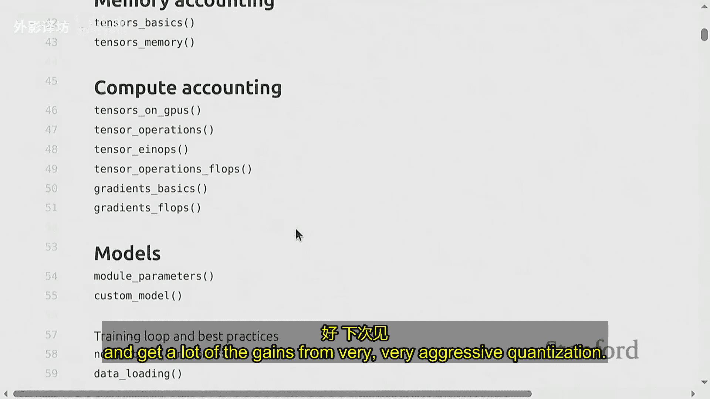

#  2：PyTorch 高阶技巧与训练资源核算 🧮


在本节课中，我们将学习如何从零开始构建模型。我们将从PyTorch的张量基础入手，逐步构建模型、优化器和训练循环。课程的核心是**效率**，我们将密切关注计算和内存的资源消耗，并学习如何估算训练大型模型所需的资源。

---

## 张量基础与内存占用 💾

上一节我们概述了课程目标，本节中我们来看看深度学习的基础——张量。张量是存储一切数据（参数、梯度、优化器状态、数据、激活值）的基本单元。

### 数据类型与内存

每个张量都由特定数据类型（如浮点数）构成。不同的数据类型占用不同的内存空间。

以下是常见的浮点数类型及其内存占用：

*   **FP32 (32位浮点数 / 单精度)**：默认类型。占用 **4字节**。包含1位符号、8位指数、23位小数。
*   **FP16 (16位浮点数 / 半精度)**：占用 **2字节**。包含1位符号、5位指数、10位小数。动态范围较小，可能导致大数溢出或小数下溢。
*   **BF16 (Brain浮点数16)**：占用 **2字节**。包含1位符号、8位指数、7位小数。动态范围与FP32相同，精度较低，但更适合深度学习计算。
*   **FP8 (8位浮点数)**：占用 **1字节**。由英伟达开发，H100 GPU支持。有不同变体以权衡动态范围和精度。

**内存计算公式**：
`内存占用（字节） = 张量元素数量 × 每个元素的字节数`



例如，一个默认数据类型（FP32）的 4×8 矩阵：
`内存 = 32个元素 × 4字节/元素 = 128字节`

### 张量操作与视图

在PyTorch中，张量是指向已分配内存的指针。元数据（如形状、步长）定义了如何访问该内存。

许多操作（如切片、转置、`view`）创建的是**视图**而非副本，它们共享底层存储。修改原始张量会影响其视图。

```python
import torch
x = torch.tensor([[1, 2, 3], [4, 5, 6]])
y = x[0]          # y是x第一行的视图，不复制数据
z = x.transpose(0, 1) # z是x转置的视图，不复制数据
x[0, 0] = 999     # 修改x，y和z也会相应改变
```

`contiguous()` 操作可能创建副本，使张量在内存中连续存储。

---

## 张量计算与性能评估 ⚡

上一节我们介绍了张量的内存占用，本节中我们来看看张量的计算成本与性能评估。

### 爱因斯坦求和与维度命名

使用 `einsum` 或 `einops` 库可以更清晰、安全地指定复杂张量操作，避免依赖容易出错的维度索引。

```python
# 传统方式：矩阵乘法，需跟踪维度顺序
# x.shape = (batch, seq1, hidden), y.shape = (batch, seq2, hidden)
attn_weights = torch.matmul(x, y.transpose(1, 2)) # 计算注意力权重

# 使用 einsum，维度意义一目了然
attn_weights = torch.einsum('b s1 h, b s2 h -> b s1 s2', x, y)

# 使用 einops 进行重组（例如，处理多头注意力）
from einops import rearrange, einsum
# 假设 x.shape = (batch, seq, num_heads * head_dim)
x_rearranged = rearrange(x, 'b s (h d) -> b s h d', h=num_heads)
# 后续操作...
```

### 计算成本：浮点运算次数

深度学习计算的核心是矩阵乘法。评估计算成本的关键指标是**浮点运算次数**。

**矩阵乘法的FLOPs公式**：
对于一个 `(m, n)` 矩阵与 `(n, p)` 矩阵的乘法：
`FLOPs ≈ 2 × m × n × p`

这是因为对于输出中的每个元素，需要进行 `n` 次乘法和 `n` 次加法。

在批量处理中，FLOPs相应倍增。对于简单的线性模型 `Y = XW`（`X` 形状为 `(B, D)`，`W` 形状为 `(D, K)`）：
`前向传播 FLOPs ≈ 2 × B × D × K`

### 性能评估：MFU

硬件有理论峰值性能（如H100对BF16约为 1979 TFLOPS）。实际运行时，我们关注**模型浮点运算利用率**。



**MFU计算公式**：
`MFU = (实际完成的 FLOPs / 实际耗时) / 硬件理论峰值 FLOPS`



MFU衡量了硬件计算能力的实际利用率。通常，MFU > 0.5 被认为是良好的。

---

## 梯度计算与反向传播成本 🔄

上一节我们讨论了前向传播的计算成本，本节中我们来看看反向传播（梯度计算）的成本。

对于具有 `L` 层、每层参数为 `N` 的模型，其前向和反向传播的总计算成本有一个经验规律。

**总FLOPs经验公式**：
`总 FLOPs ≈ 6 × B × N_total_params`

其中 `B` 是数据点（或令牌）数量，`N_total_params` 是模型总参数量。

这个“6倍”的由来：
1.  **前向传播**：约 `2 × B × N_params` FLOPs。
2.  **反向传播**：计算每个参数的梯度通常需要约 `4 × B × N_params` FLOPs（涉及梯度与激活值的矩阵乘法）。
3.  两者相加：`2 + 4 = 6`。



这就是课程开头估算训练700B参数模型所需时间时，使用 `6 × 参数数量 × 令牌数量` 计算总FLOPs的原因。





---



## 构建模型：初始化、训练与资源核算 🏗️

上一节我们分析了计算成本，本节中我们将把这些概念应用到实际的模型构建、训练和资源核算中。

### 参数初始化

不恰当的初始化会导致梯度爆炸或消失。常用方法是缩放初始化权重。

```python
import torch.nn as nn
import math

d_input = 512
d_hidden = 1024

# 正确的初始化：缩放权重
layer = nn.Linear(d_input, d_hidden)
# Xavier/Glorot 初始化的一种简单形式
nn.init.normal_(layer.weight, mean=0.0, std=math.sqrt(1.0 / d_input))
# 或者使用PyTorch内置的xavier初始化
# nn.init.xavier_normal_(layer.weight)
```

### 优化器与状态内存



优化器（如Adam）需要存储额外的状态（如动量、梯度平方的移动平均），这增加了内存开销。



以下是训练时需要考虑的内存组成部分：

1.  **参数**：模型权重本身。
2.  **梯度**：反向传播为每个参数计算的梯度。
3.  **优化器状态**：例如，对于AdamW，每个参数需要存储**动量**和**方差**两个状态，通常用FP32，所以是参数的2倍。
4.  **激活值**：前向传播中需要为反向传播存储的中间结果。这是最大的变量，取决于批量大小和序列长度。

**内存估算公式（以AdamW为例，混合精度训练）**：
`总内存 ≈ 参数量 × (2 + 2 + 4 + 12) 字节`

*   `2`：FP16参数（前向/反向传播）。
*   `2`：FP16梯度。
*   `4`：FP32的优化器状态（动量，2字节）和方差（2字节）。
*   `12`：激活值（粗略估计，实际变化很大）。

因此，**每个参数大约需要20字节的峰值内存**。这就是课程开头估算8块80G H100显卡能训练多大模型时，用 `80GB * 8 / 20字节 ≈ 320亿参数` 的由来（未考虑激活值）。

### 训练循环与检查点

一个典型的训练循环包括前向传播、损失计算、反向传播和优化器更新。

```python
model = MyModel().cuda()
optimizer = torch.optim.AdamW(model.parameters(), lr=1e-4)
scaler = torch.cuda.amp.GradScaler() # 用于混合精度训练

for epoch in range(num_epochs):
    for batch in dataloader:
        inputs, targets = batch
        inputs, targets = inputs.cuda(), targets.cuda()

        optimizer.zero_grad()
        # 混合精度前向传播
        with torch.cuda.amp.autocast(dtype=torch.bfloat16):
            outputs = model(inputs)
            loss = loss_fn(outputs, targets)

        # 混合精度反向传播与优化
        scaler.scale(loss).backward()
        scaler.step(optimizer)
        scaler.update()

        # 定期保存检查点
        if step % checkpoint_interval == 0:
            torch.save({
                'model_state_dict': model.state_dict(),
                'optimizer_state_dict': optimizer.state_dict(),
                'step': step,
            }, f'checkpoint_{step}.pt')
```

---

## 总结 📝

本节课中，我们一起学习了构建和训练深度学习模型的核心实践与资源核算：

1.  **张量与内存**：理解了不同数据类型（FP32, BF16, FP8）的内存占用，以及张量视图与副本的区别。
2.  **计算成本**：掌握了估算矩阵乘法FLOPs的方法（`2*m*n*p`），以及评估实际硬件利用率的指标MFU。
3.  **反向传播成本**：了解了训练总计算量约为 `6 × 令牌数 × 参数量` 这一经验规律。
4.  **模型构建**：实践了参数初始化的最佳实践，并实现了训练循环。
5.  **资源核算**：学会了估算训练所需的内存，包括参数、梯度、优化器状态和激活值，认识到每个参数可能需约20字节峰值内存。




这些知识是高效训练大型模型（如Transformer）的基础。在接下来的作业中，你将把这些原理应用到实际的模型实现中。