#  4：混合专家架构实战 🧠


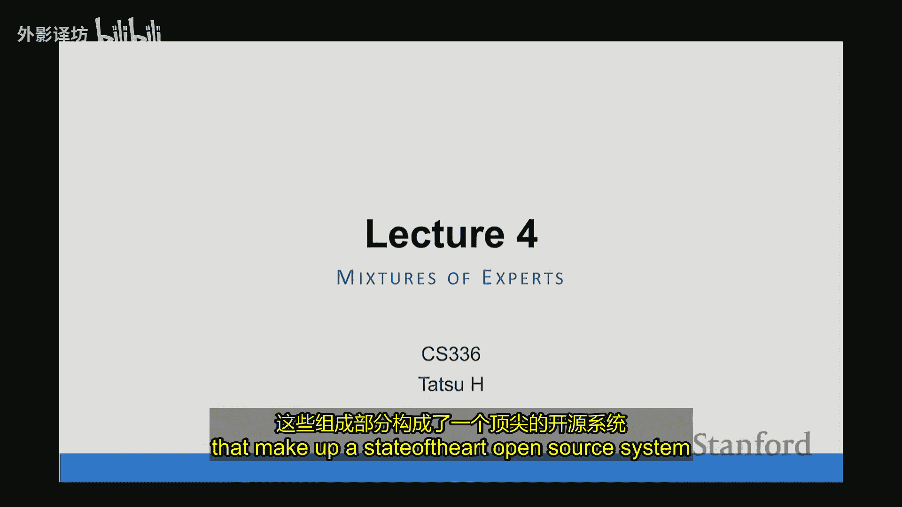

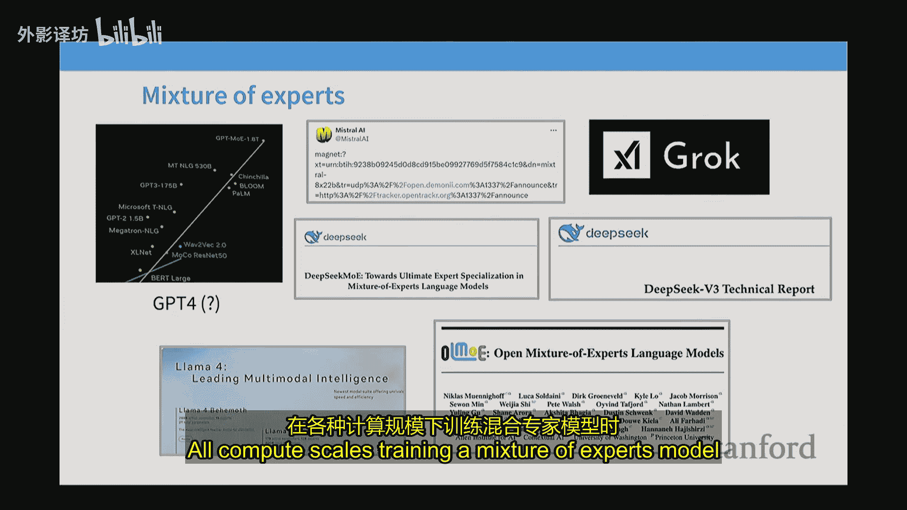

在本节课中，我们将学习混合专家模型的核心概念、工作原理、设计选择以及如何在实际系统中高效地构建和训练它。混合专家模型是当前许多最先进高性能系统的构建与部署方式，理解它对于构建最佳模型至关重要。

## 概述

混合专家模型是一种特殊的神经网络架构，它通过稀疏激活多个子组件来提升模型容量和效率。我们将从基本概念出发，逐步深入到路由机制、训练技巧以及现代开源系统的具体实现。

## 混合专家模型简介

混合专家模型是一种奇特的架构，它有几个被称为“专家”的子组件，这些专家会被稀疏激活。其核心思想与多层感知器密切相关。

标准Transformer组件包括自注意力机制和全连接网络。在密集模型中，前馈层是一个大模块。在混合专家模型中，我们将这个大的前馈层进行拆分或复制，并用一个选择器层和多个较小的层来替换它。

以下是混合专家模型的基本原理：

*   你会有多个全连接网络副本。
*   你会有一个路由器，它在每次前向传播时，从这些副本中挑选出较少几个。

如果模型是稀疏激活的，例如每次只挑选一个专家，并且这个专家的大小与原始的密集全连接网络相同，那么密集模型和混合专家模型在计算量上是相同的。这样，你就能在不增加计算量的情况下，拥有更多参数。

## 混合专家模型的价值

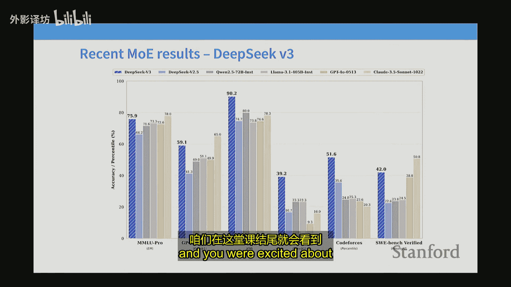

对于相同浮点运算量的训练，与密集模型相比，混合专家模型通常能获得更佳的性能。

一篇2022年的论文指出，在浮点运算次数匹配的情况下，随着专家数量的增加，语言模型的训练损失会持续降低。专家越多，效果越好。

现代研究也证实了这一点。例如，AI2发表的ALO论文进行了精细对比，发现混合专家模型的训练损失下降速度比密集型模型快得多。

混合专家模型的一个显著优势是，它允许模型展示出非常吸引人的性能图表。例如，在DeepSeek V2论文中，模型仅激活少量参数，就在MMLU基准测试上取得了优异的性能。

## 混合专家模型的系统优势

混合专家模型为我们提供了另一种并行方式，称为专家并行。

当你拥有多个专家模块时，可以很自然地将它们放置在不同的计算设备上。由于专家是稀疏激活的，只需将令牌路由到合适的设备上进行计算即可。这对于大型模型的并行处理至关重要。

有趣的是，虽然谷歌开发了混合专家模型，但许多开源成果实际上常常来自中国。例如，Qwen和DeepSeek在混合专家架构方面做了大量工作。近期，西方的开源组织如Mixtral和最新的Llama也开始采用混合专家架构。

## 混合专家模型的核心组件

上一节我们介绍了混合专家模型的价值和系统优势，本节中我们来看看它的具体构成。混合专家模型架构与非混合专家模型架构在几乎所有组件上都相似，仅有一个关键组件不同：前馈层被替换为路由器和多个专家。

混合专家模型的基本形态是：将标准的全连接层进行拆分或复制，并在它们之间进行稀疏路由选择。虽然理论上也可以对注意力层进行类似操作，但在主流模型发布中，这种情况相当罕见。

以下是混合专家模型设计中几个会有所不同的方面：

*   **如何进行路由**：路由函数是一个重要选择。
*   **专家规模与数量**：需要多少专家，每个专家的规模多大。
*   **如何训练路由器**：路由决策不可微，训练起来具有挑战性。

## 路由机制详解

路由是混合专家模型的核心组件，它决定了如何将令牌匹配给专家。你大致有三种不同的路由选择：

1.  **令牌选择**：每个令牌对不同专家有一定的路由偏好，为每个令牌选出前K个专家。
2.  **专家选择**：每个专家对令牌有一定的排名偏好，为每位专家选出排名前K的令牌。这样做的一大好处是在专家间能保持负载平衡。
3.  **全局分配**：解决复杂的优化问题，以确保专家与令牌之间的映射能保持某种平衡。

几乎所有现代的混合专家模型都采用**令牌选择前K**的做法。在这种机制中，每个令牌会按亲和度对专家进行排序，然后选择前K个。

令牌选择路由的表现通常优于专家选择路由。在AOL论文的消融实验中，令牌选择路由的验证损失下降更快。

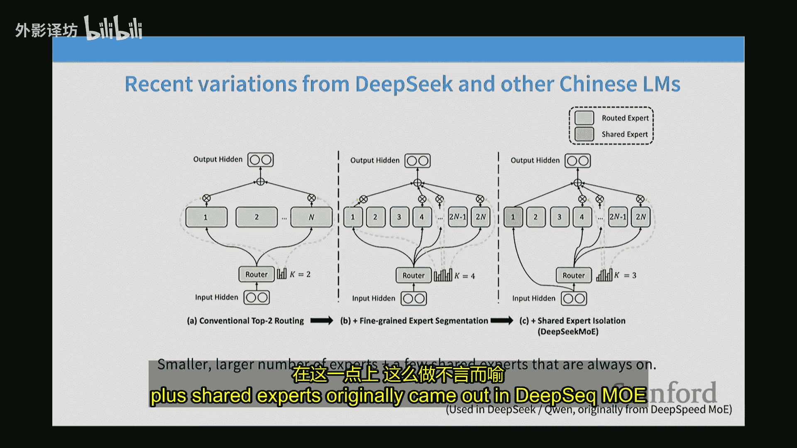

路由器的参数设置通常非常基础。一个典型的令牌选择路由工作原理如下：

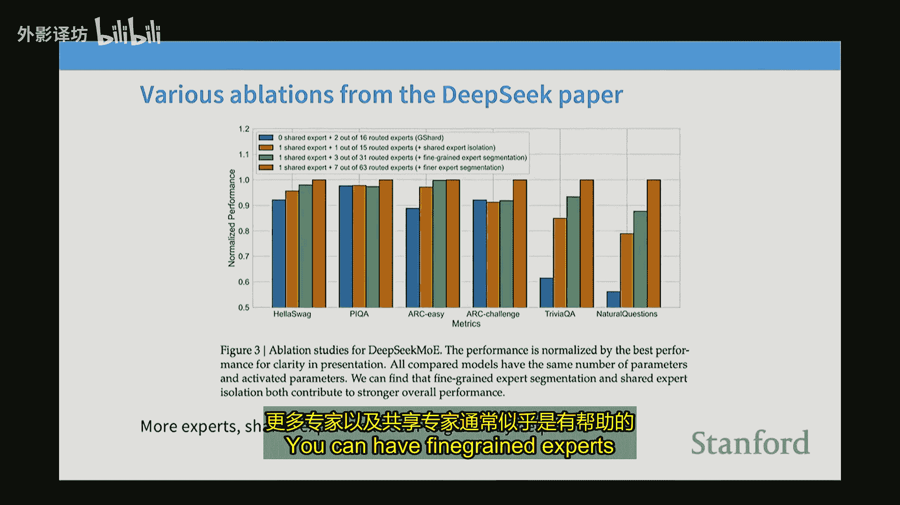

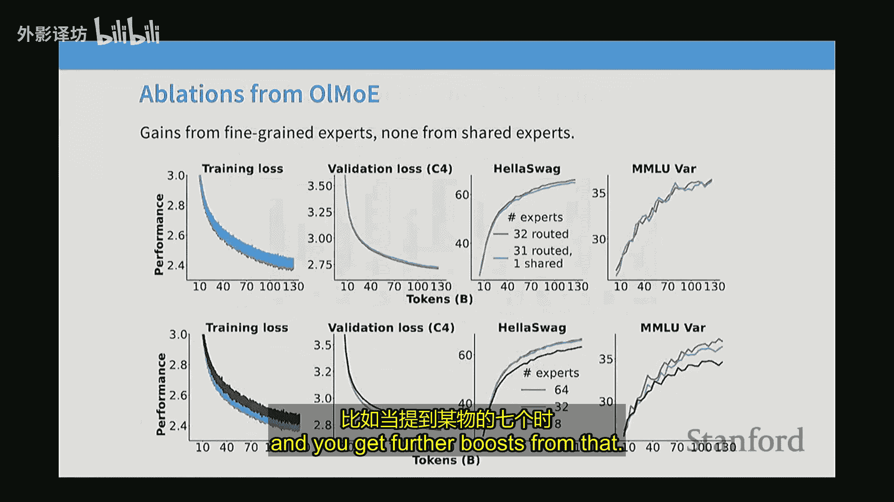

1.  残差流输入 `x` 进入路由器。
2.  路由器计算 `x` 与每个专家对应的学习向量 `e_i` 的内积，得到亲和度分数。
3.  对亲和度分数应用 softmax 进行归一化。
4.  选取归一化后权重最高的前K个专家。
5.  使用这K个权重作为门控信号，对所选专家的输出进行加权求和。
6.  将加权求和的结果加回原始残差流中。

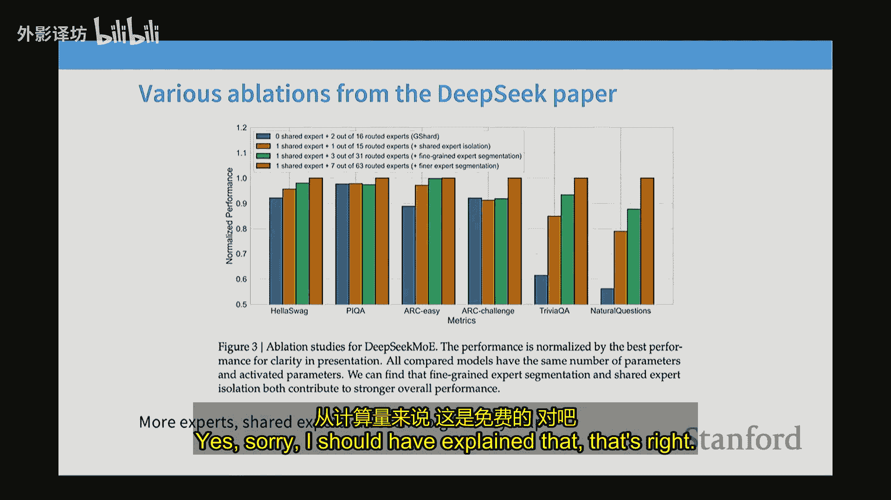

**代码描述路由前向过程：**
```python
# 假设输入 x 的维度为 [batch_size, hidden_dim]
# 专家参数 W_experts 的维度为 [num_experts, hidden_dim, expert_hidden_dim]
# 路由器参数 W_router 的维度为 [hidden_dim, num_experts]

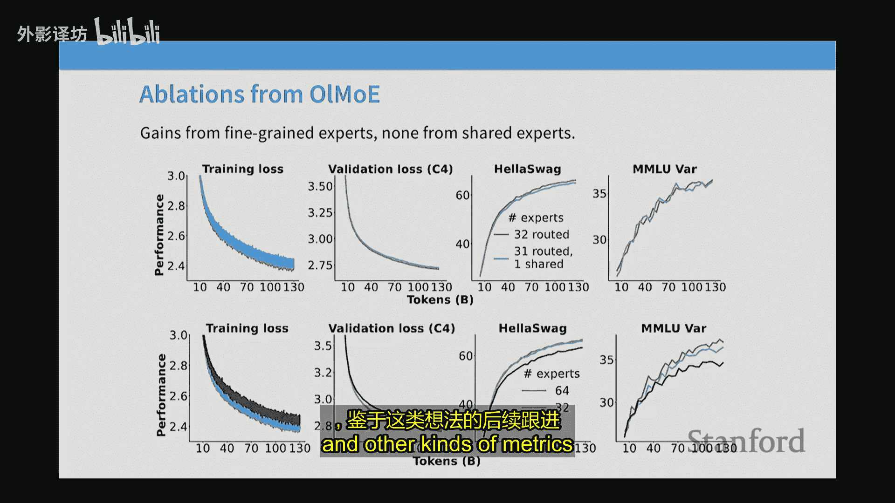

scores = x @ W_router  # 计算亲和度分数，[batch_size, num_experts]
weights = softmax(scores, dim=-1)  # 归一化
topk_weights, topk_indices = torch.topk(weights, k=K, dim=-1) # 选取前K个

# 稀疏计算：仅计算被选中的专家输出
output = 0
for i in range(batch_size):
    for j in range(K):
        expert_idx = topk_indices[i, j]
        gate = topk_weights[i, j]
        expert_out = x[i] @ W_experts[expert_idx]  # 专家前向计算
        output[i] += gate * expert_out

# 残差连接
final_output = x + output
```
为什么必须使用 top-K 操作？因为在训练和推理时，我们必须确保只激活少量专家，以维持系统的计算效率。如果对所有专家进行门控，就会失去稀疏性带来的效率优势。

## 专家设计：细粒度与共享专家

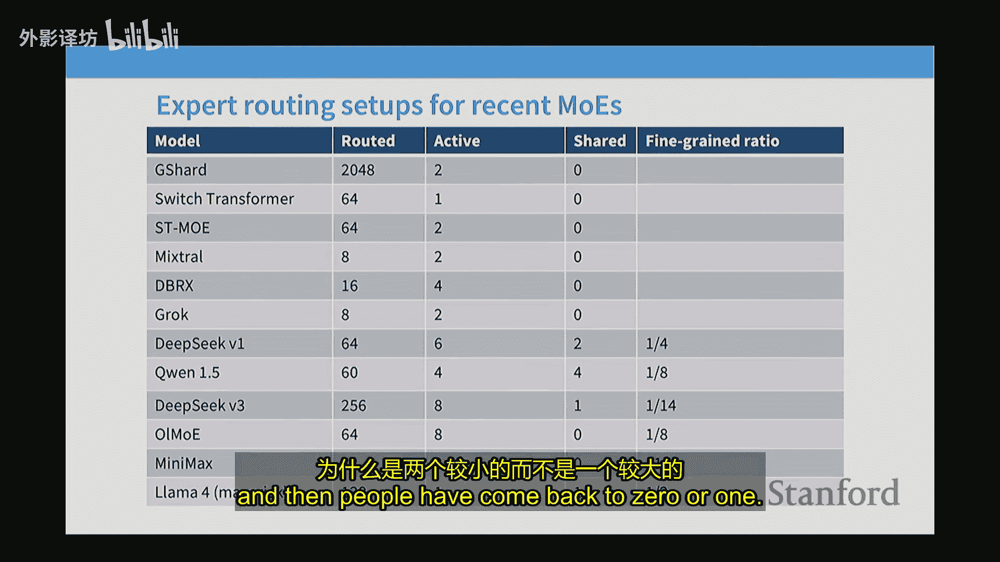

基本的混合专家模型结构是复制专家。例如，如果你有前2的路由选择，激活参数会是原始密集模型的两倍。

人们很快意识到，拥有大量专家是好事。但为了不增加参数成本，DeepSeek 提出了**细粒度专家**的理念。

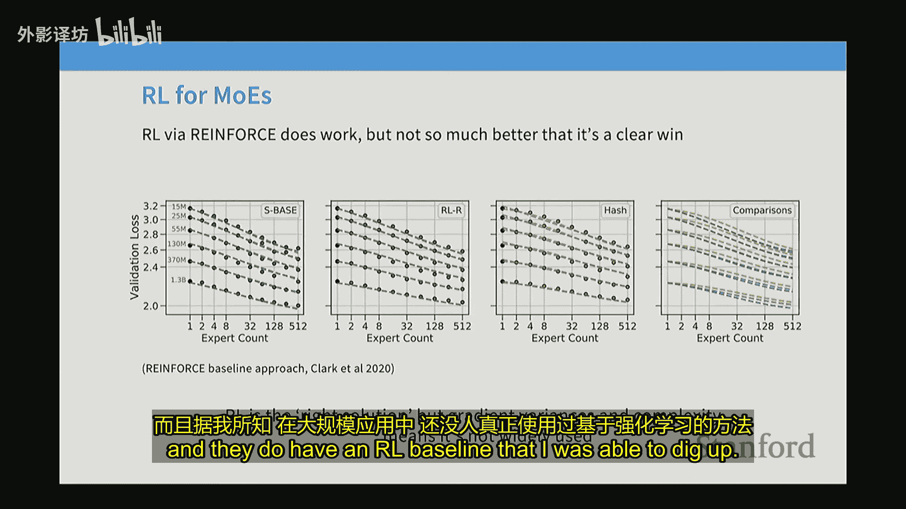

其做法是：将标准的全连接层拆分成更小的部分。例如，原本隐藏层维度会乘以4得到投影层，现在可以只乘以2，从而得到规模更小、数量更多的专家。这允许你在不显著增加计算量的情况下大幅增加专家数量。

另一个已被研究的方面是**共享专家**。其思路是，可能总有一些固定的处理操作是无论哪个令牌都需要的。因此，设置一个或几个共享专家来处理这些共享结构，而让其他专家专注于特定模式，可能是有益的。

自 DeepSeek MoE 以来，几乎所有开源的混合专家模型变体都采用了细粒度专家，有些也采用了共享专家。消融实验表明，细粒度专家通常能带来显著提升。

## 现代混合专家模型配置

现在，我们来看看近期发布的一些混合专家模型，了解常见的配置模式。

一些早期的谷歌论文（如 GShard, Switch Transformer）拥有大量的被路由专家（如256个）。很快，一个常见的阶段出现了，模型拥有8-16个专家，其中2个是活跃的（如 Mixtral, DBRX, Grok）。

后来，DeepSeek MoE 或 DeepSeek V1 出现了典型配置：64个细粒度专家，其中6个被主动路由，外加2个共享专家。每种专家的规模大约是标准专家规模的1/4。

其他中文混合专家模型，如 Qwen1.5 MoE, MiniMax，其配置与 DeepSeek V1 基本类似，都使用了细粒度专家，并常有共享专家。

最新的模型如 Llama 4 也采用了细粒度专家和共享专家。对于像 Llama 4 和 DeepSeek V3 这样的大模型，总的专家数量可以非常多。

## 训练挑战与技巧

训练混合专家模型的主要挑战在于路由决策的不可微性。我们不能在训练时激活所有专家，否则计算成本会过高。因此，我们需要训练时的稀疏性，但这带来了一个类似强化学习的优化问题。

实践中，人们主要采用以下方法：

1.  **强化学习**：将路由视为策略进行优化。但这种方法梯度方差大、复杂度高，在大规模应用中并不流行。
2.  **随机探索**：在路由分数中添加噪声，以鼓励探索。但这种方法在后期论文中一定程度上被摒弃，因为效果不如基于启发式损失的方法。
3.  **启发式损失（负载均衡损失）**：这是目前最主流的方法。其核心思想是添加一个辅助损失项，鼓励令牌在不同专家间均匀分配。

最经典的负载均衡损失来自 Switch Transformer (2022)：

**公式描述负载均衡损失：**
```
L_balance = α * N * Σ_i (f_i * p_i)
```
其中：
*   `N` 是专家数量。
*   `f_i` 是批次中分配给专家 `i` 的令牌比例（实际决策）。
*   `p_i` 是路由器分配给专家 `i` 的概率总和（原始意图）。
*   `α` 是一个超参数，控制平衡损失的权重。

这个损失函数会惩罚那些获得过多令牌的专家，促使路由器进行更均衡的分配。如果不进行专家平衡，模型往往会陷入局部最优，即只频繁使用一两个专家，而浪费其他专家，导致性能下降。

DeepSeek V3 对此进行了创新，采用了“辅助无损失平衡法”。他们去掉了针对每个专家的平衡损失项，改为为每个专家学习一个微小的偏置项 `b_i`。在每一批次中，根据专家获得的令牌数量在线调整这个偏置：如果某个专家得到的令牌不够，就增加其 `b_i`，使其更具吸引力；反之则减少。这个偏置仅用于路由决策，不用于门控权重。

## 系统考量与稳定性

混合专家模型能完美适配设备间的专家并行。你可以将不同专家安排在不同设备上。经过路由器后，令牌被发送到相关设备进行计算，然后再将结果返回合并。这为大规模训练提供了另一种并行维度。

混合专家模型在训练和推理时都可能引入随机性。例如，如果路由器给某个专家分配了过多令牌，可能会因为设备内存不足而出现“令牌丢弃”现象，即某些令牌不被任何专家处理，直接通过残差连接。这可能导致基于批次的推理结果出现非确定性。

混合专家模型的训练有时可能不稳定，微调也可能比较困难。以下是一些提升稳定性的技巧：

*   **数值稳定性**：在路由器的 softmax 计算中使用 float32 精度。
*   **Z-损失**：添加一个辅助损失，惩罚 softmax 归一化前的 logits 的平方和，这有助于稳定训练。
*   **过拟合问题**：在少量数据上微调庞大的混合专家模型容易过拟合。解决方案包括：交替使用密集层和 MoE 层（只微调密集层），或者使用大量 SFT 数据。
*   **升级回收**：从一个训练好的密集模型出发，复制其前馈层作为专家初始化，然后添加一个随机初始化的路由器，再开始训练混合专家模型。这是一种获得高性能 MoE 模型的划算方法。

## DeepSeek V3 架构纵览

最后，我们以 DeepSeek V3 为例，梳理一个现代高性能开源混合专家系统的组成部分。值得注意的是，其核心的混合专家架构自 DeepSeek V1 (MoE) 以来变化不大。

**DeepSeek V1 (MoE) 起点：**
*   参数：1600亿总参数，280亿激活参数。
*   架构：2个共享专家 + 64个细粒度专家，每次激活约6个。
*   路由：标准 Top-K 路由，在 Top-K 之前进行 softmax。
*   平衡：使用辅助损失进行专家级和设备级负载均衡。

**DeepSeek V2 的演进：**
*   参数：2360亿总参数，210亿激活参数。
*   架构相同。
*   新增 **Top-M 设备选择**：先限制令牌只能路由到前 M 个设备，再在每个设备内选 Top-K 专家，以控制通信成本。
*   新增 **通信平衡损失**：同时考虑输入和输出的通信成本进行平衡。

**DeepSeek V3 的改进：**
*   参数：6710亿总参数，370亿激活参数。
*   **门控归一化**：将 softmax 归一化操作移至 Top-K 之后，并对门控权重使用 sigmoid 函数。
*   **平衡机制**：采用前述的“辅助无损失平衡法”（基于偏置 b_i 的在线调整），并保留一个序列级别的辅助损失以确保推理时的鲁棒性。
*   保留了 Top-M 设备选择以优化系统性能。

除了混合专家部分，DeepSeek V3 还有其他创新：
*   **MLA (多头潜在注意力)**：一种优化 KV 缓存的方法。它将 Key 和 Value 投影到一个低维的潜在空间进行缓存，在需要时再投影回高维进行计算，并结合矩阵乘法的结合律避免额外计算开销。
*   **MTP (多令牌预测)**：在损失函数中并行预测未来多个令牌（实际上主要针对下一个令牌），使用一个轻量级的辅助预测头。

## 总结

本节课中，我们一起学习了混合专家模型。如今，它在一定程度上处于如何构建高性能大规模系统的核心。混合专家模型利用了稀疏性的概念，即并非所有参数都需要一直被使用。

其核心挑战在于离散的路由决策，而启发式方法（特别是负载均衡损失）在实践中被证明是有效的。大量实证证据表明，在计算量受限的情况下，混合专家模型是一个高效且性能优异的选择。

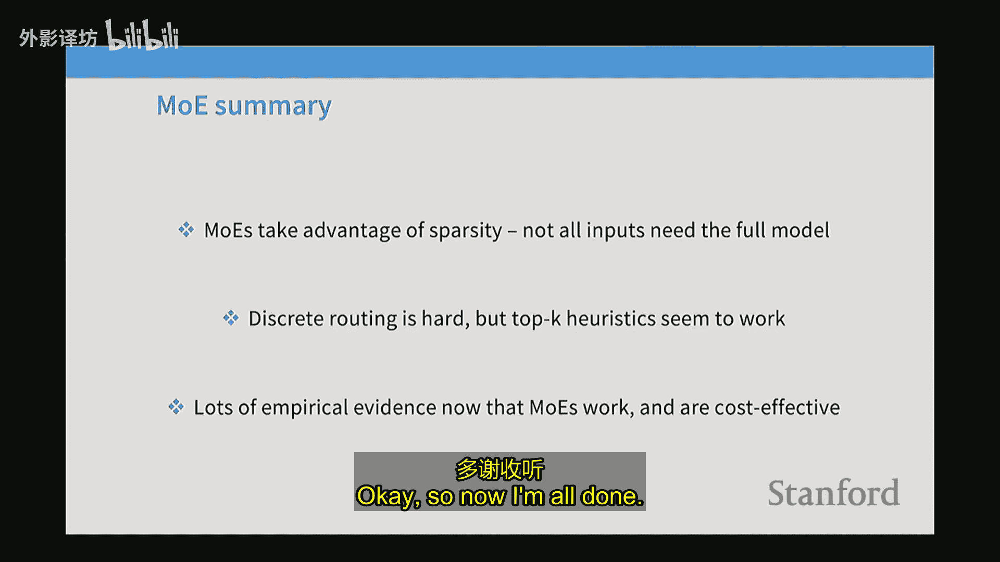


我们详细探讨了路由机制、专家设计（细粒度与共享）、训练技巧、系统考量，并以 DeepSeek V3 为例，剖析了一个现代开源系统的具体实现。理解混合专家模型，对于构建和优化前沿的大语言模型至关重要。