# 5：GPU原理与分布式训练基础 🚀


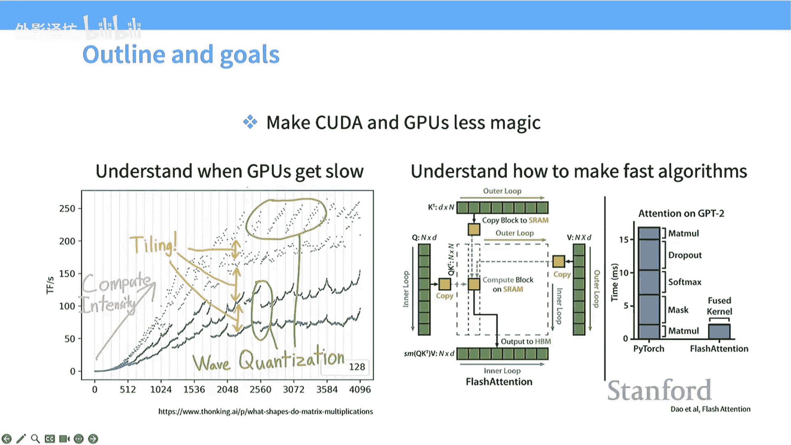

在本节课中，我们将要学习GPU的工作原理以及如何利用其特性进行高效的分布式训练。我们将从GPU的基本架构讲起，逐步深入到内存模型、性能瓶颈以及关键的优化技术。最后，我们会将这些知识整合起来，理解像Flash Attention这样的高性能算法是如何构建的。


## 概述：为什么硬件如此重要？ 💡

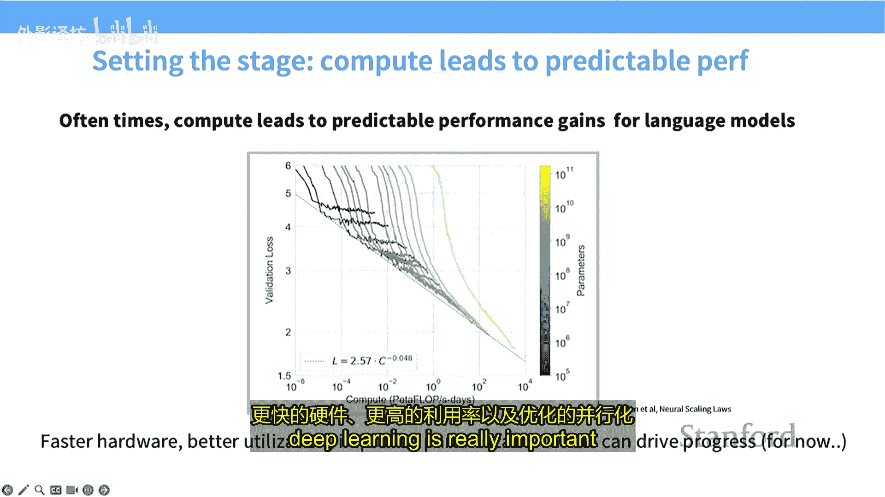

深度学习性能的提升，很大程度上依赖于更快的硬件、更高的利用率和优化的并行化。计算资源的扩展速度远超内存带宽的增长，这使得理解硬件，特别是GPU，变得至关重要。本节课的目标是揭开GPU的神秘面纱，让你能够得心应手地思考如何加速算法。

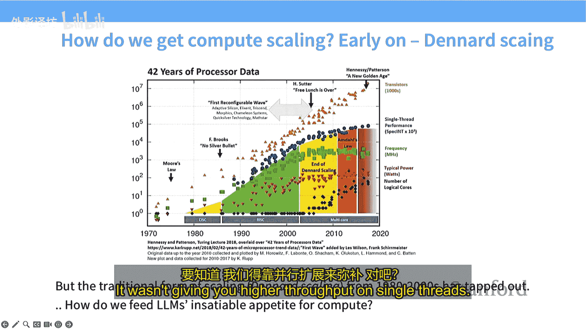

---

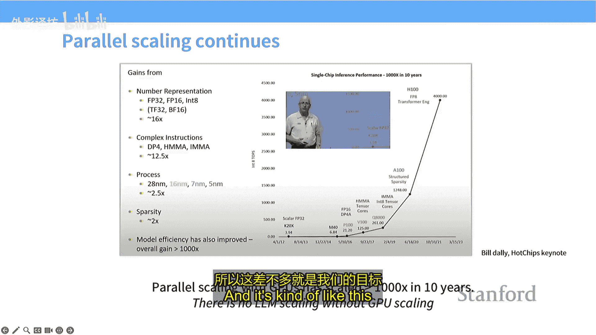

## GPU vs CPU：设计哲学的差异 ⚙️

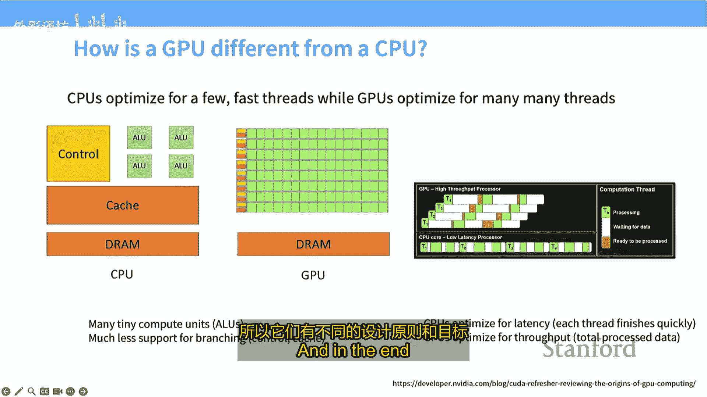

上一节我们介绍了硬件对性能提升的驱动作用。本节中我们来看看GPU和CPU在设计目标上的根本区别。

CPU（中央处理器）是为优化**延迟**而设计的，目标是尽快完成单个任务。它拥有大型控制单元来处理复杂的分支和逻辑。

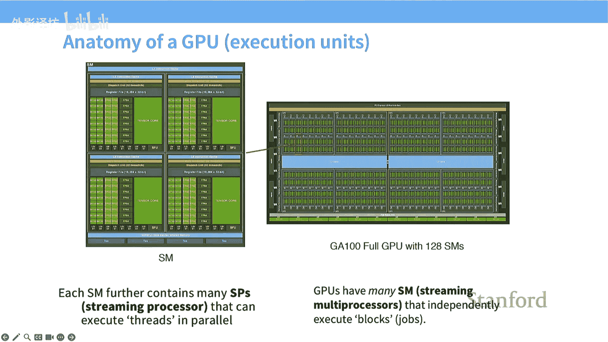

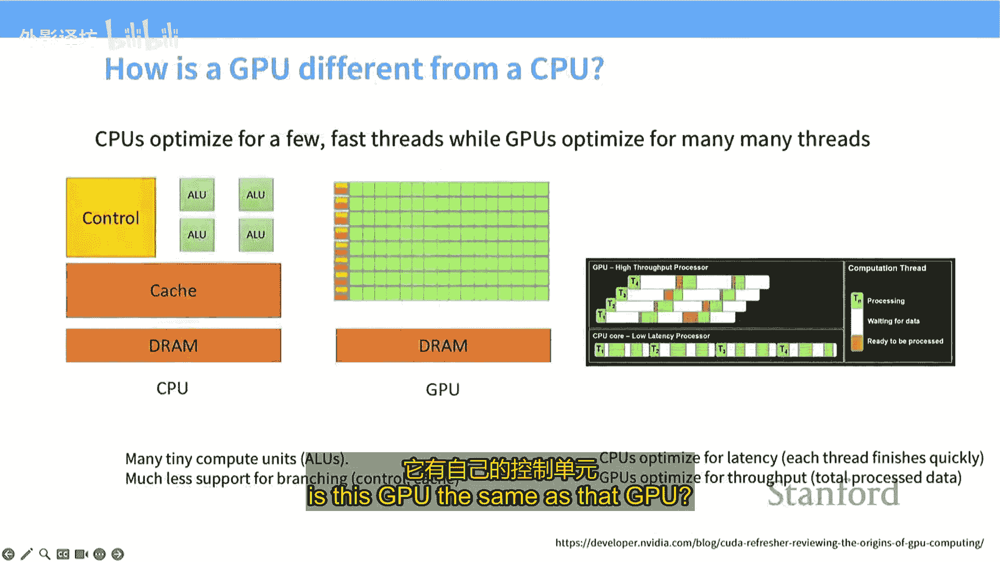

GPU（图形处理器）则是为优化**吞吐量**而设计的，不在乎单个任务的延迟，只希望所有任务能尽快完成。它拥有大量并行的计算单元（ALU），由一小部分控制逻辑协调。

**核心公式**：
*   CPU：`高性能 = 低延迟`
*   GPU：`高性能 = 高吞吐量`

---

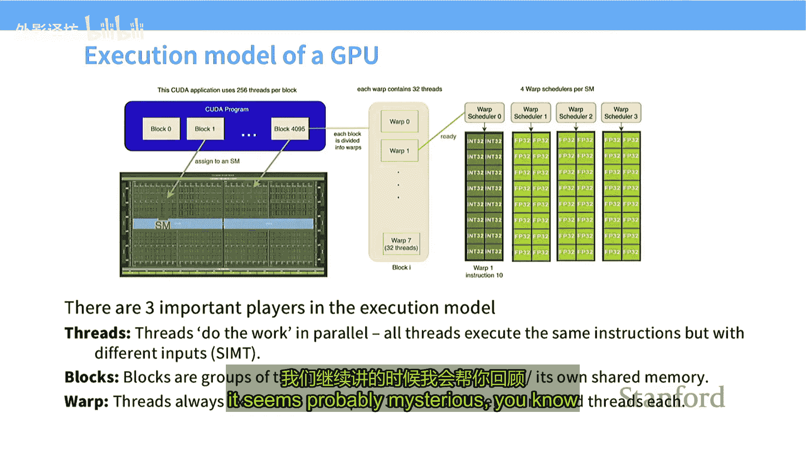

## GPU架构详解 🏗️

理解了设计目标后，我们来深入GPU的内部结构。

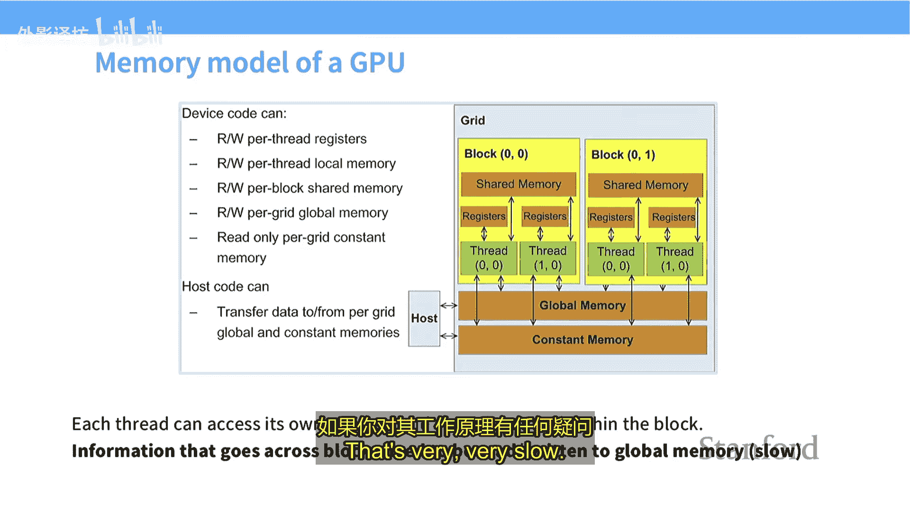

GPU的核心计算单元是**流式多处理器**。每个SM包含多个**流式处理器**，它们并行执行大量线程。其执行模型是**单指令多线程**：一个线程束（通常32个线程）对不同的数据执行相同的指令。

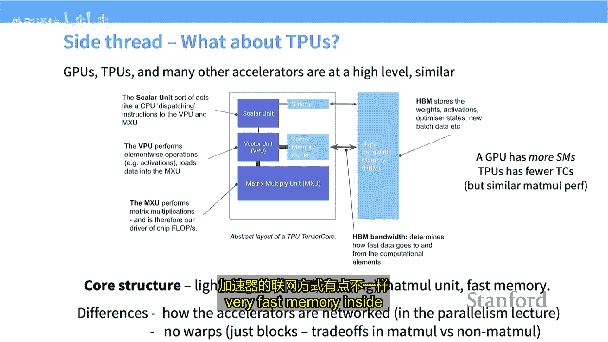

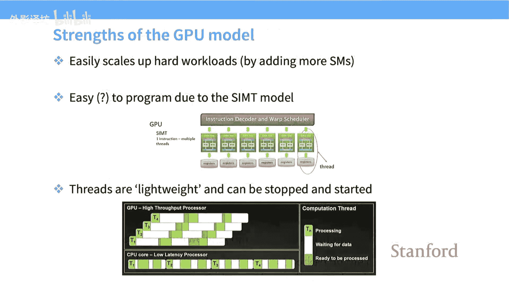

除了计算，**内存**是影响GPU性能的另一个关键因素。内存离SM越近，速度越快。GPU的内存层次结构如下（从快到慢）：
1.  **寄存器**：每个线程私有，速度最快。
2.  **共享内存/L1缓存**：位于SM内部，块内线程共享。
3.  **L2缓存**：所有SM共享，位于芯片上。
4.  **全局内存**：即显存，位于芯片外，速度最慢。

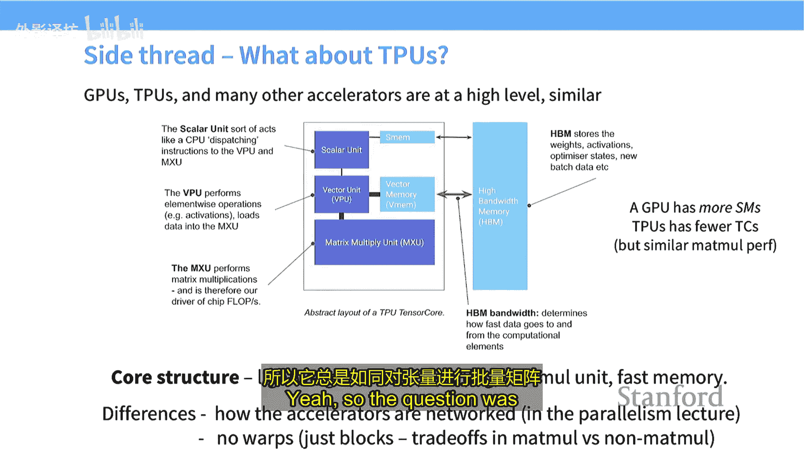

访问全局内存可能需要数百个时钟周期，而访问共享内存仅需几十个周期。因此，减少对全局内存的访问是性能优化的核心。

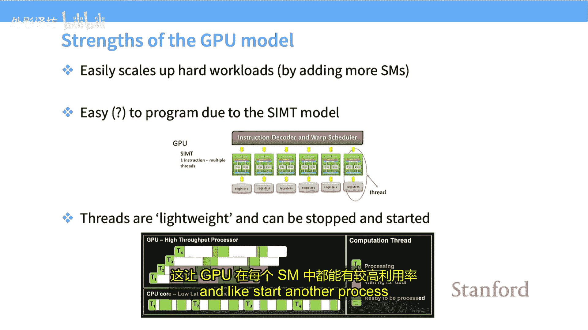

---

## GPU执行与内存模型 🧠

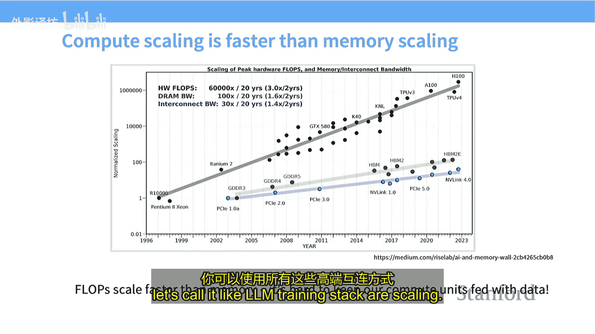

现在，我们结合执行和内存模型来理解GPU如何工作。

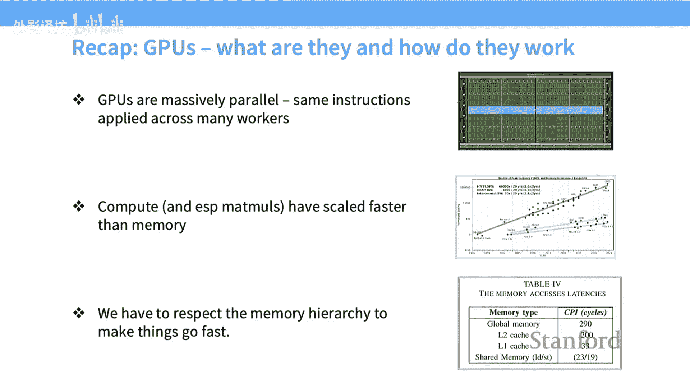

GPU的执行涉及三个层次的粒度：
1.  **线程**：最小的执行单位。
2.  **线程束**：由32个连续编号的线程组成，是调度和执行的基本单位。
3.  **线程块**：一组线程，被分配到一个SM上执行。

逻辑内存模型与硬件对应：
*   每个线程有自己的**寄存器**。
*   一个线程块内的线程共享**共享内存**。
*   所有线程都能访问**全局内存**，但速度很慢。

理想的编程模式是：将数据从全局内存加载到共享内存，在共享内存中进行密集计算，最后将结果写回全局内存。

---

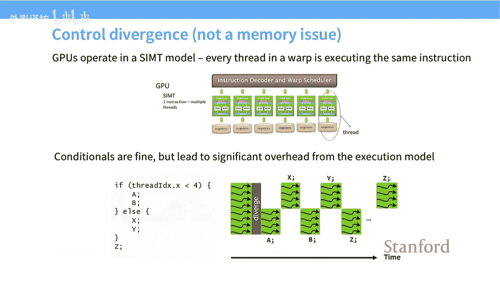

## TPU：另一种加速器视角 🤖

GPU并非唯一的AI加速器。TPU（张量处理器）在设计理念上与GPU有相似之处。

TPU同样包含：
*   **矩阵乘法单元**：专门执行矩阵运算的硬件。
*   **高速片上内存**：类似于共享内存。
*   **高带宽内存**：类似于全局内存。

主要区别在于，TPU的架构更专注于矩阵乘法，控制逻辑相对更简单。理解GPU的许多概念同样适用于TPU。

---

## GPU性能优化技巧 🛠️

了解了基础原理，我们来看看如何让算法在GPU上跑得更快。性能瓶颈主要来自内存访问。

以下是关键的优化技巧列表：

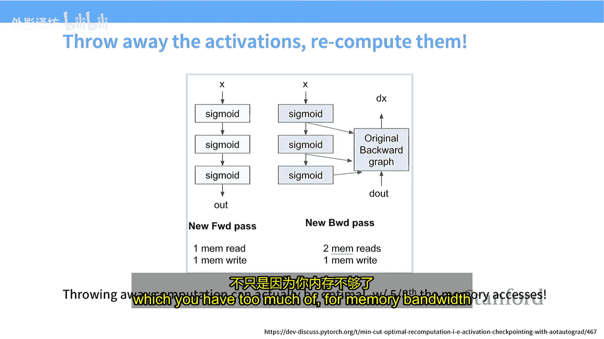

**1. 降低精度**
使用`FP16`或`BF16`代替`FP32`，可以将内存传输量减半，从而有效提升吞吐量。通常采用混合精度训练，即用低精度存储和计算，用高精度进行累加以保持稳定性。

**2. 内核融合**
将多个连续的操作融合成一个内核，避免中间结果频繁写回和读取全局内存。

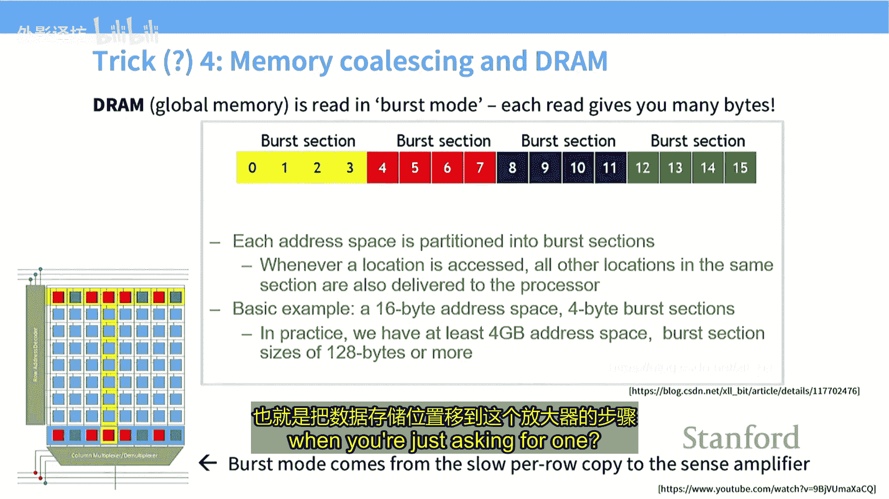

```python
# 未融合：多个独立内核启动
y = torch.sin(x)
z = torch.cos(x)
out = y**2 + z**2

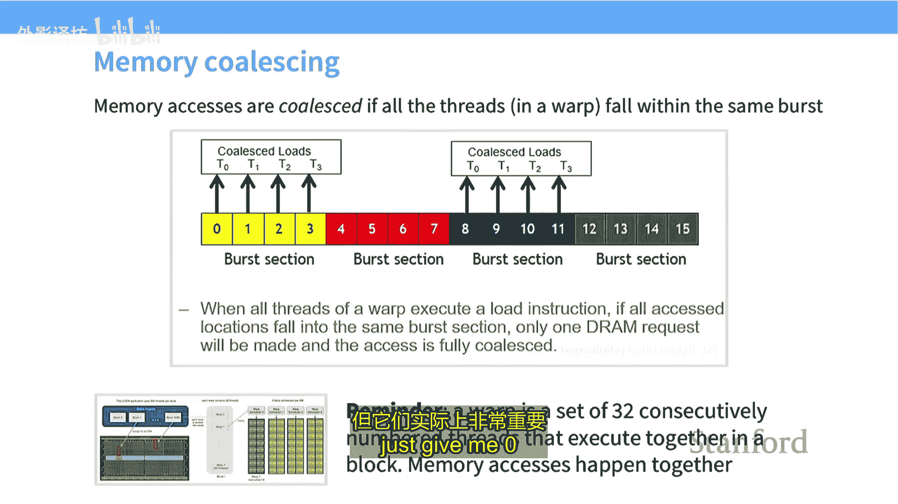

# 融合：单个内核完成所有计算
# (可通过 `torch.compile` 或手动编写CUDA内核实现)
```

**3. 重计算**
用额外的计算换取内存访问。在反向传播时不存储中间激活值，而是在需要时重新计算。这常用于节省显存和提升带宽利用率。

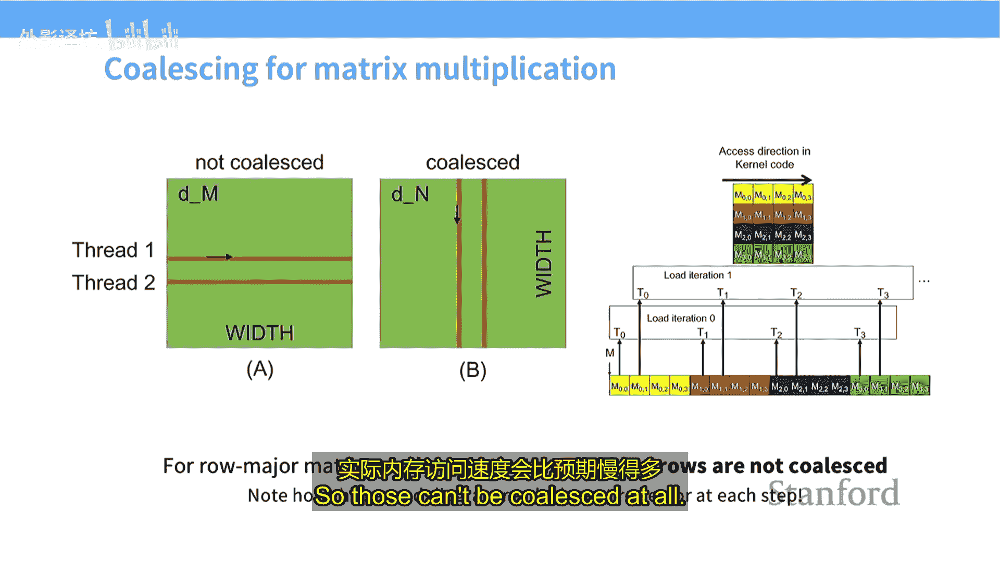

**4. 内存访问合并**
当线程束中的所有线程访问全局内存中连续对齐的内存块时，硬件可以合并这些访问，实现一次传输获取所有数据，极大提升带宽利用率。编程时应确保线程的访问模式是连续的。

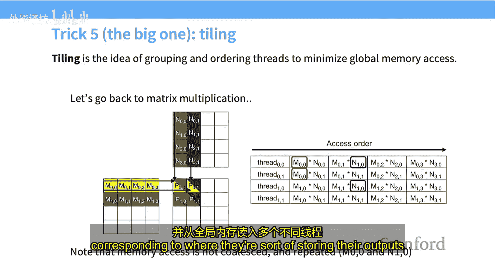

**5. 分块**
将数据分割成小块，以便能装入快速的共享内存中。在块内进行大量计算，从而减少对全局内存的访问次数。

对于矩阵乘法 `C = A @ B`，如果分块大小为 `T`：
*   **朴素算法**：每个矩阵元素被访问约 `O(N)` 次（从全局内存）。
*   **分块算法**：每个矩阵元素被访问约 `O(N/T)` 次（从全局内存），其余 `O(T)` 次访问发生在共享内存中。

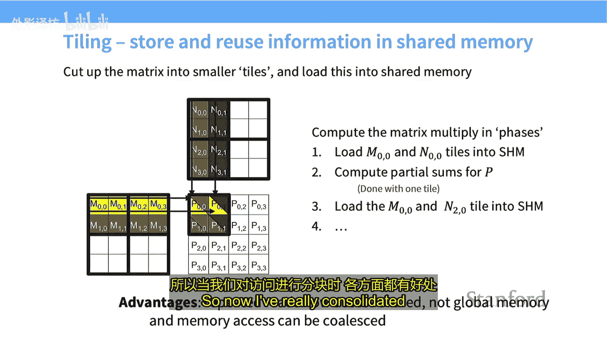

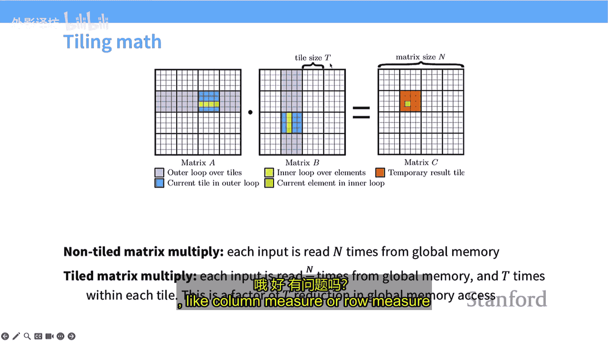

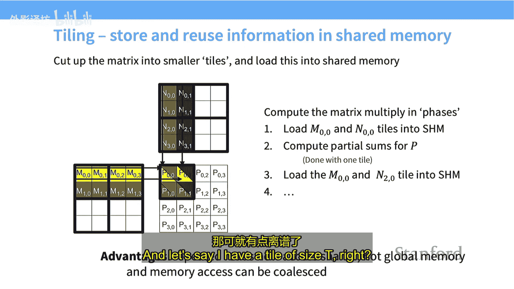

**6. 对齐与填充**
确保数据块的大小与内存突发传输边界（通常是32字节或128字节）对齐，可以避免低效的非对齐访问。有时需要给矩阵额外填充一些元素以达到合适的尺寸。

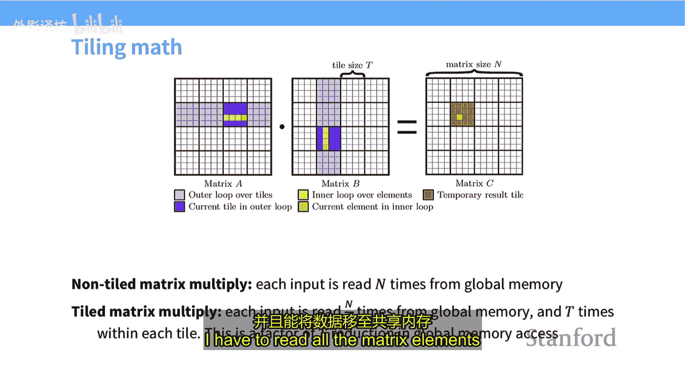

---

## 揭秘性能波动图表 📊

掌握了上述技巧，我们就可以解释课程开始时那个神秘的性能波动图表了。

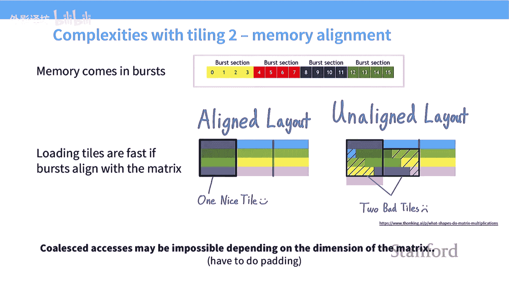

图表中的波动主要由以下因素导致：
*   **计算强度与内存墙**：小矩阵时受内存带宽限制（屋顶线左侧上升区）；大矩阵时受计算能力限制（屋顶线顶部平台区）。
*   **分块效率**：当矩阵维度不是分块大小的整数倍时，会产生利用率低的“尾块”，导致性能下降。
*   **SM利用率**：线程块的数量略多于SM数量时，会造成负载不均衡和空闲等待，形成性能低谷。
*   **对齐问题**：矩阵维度不是内存对齐值的倍数时，会导致非合并访问，性能急剧下降。

因此，选择2的幂次方或与硬件对齐的维度（如64、128、256的倍数）通常能获得最佳性能。

---

## 案例研究：Flash Attention ⚡

最后，我们将所有知识融会贯通，看看高性能算法Flash Attention是如何实现的。

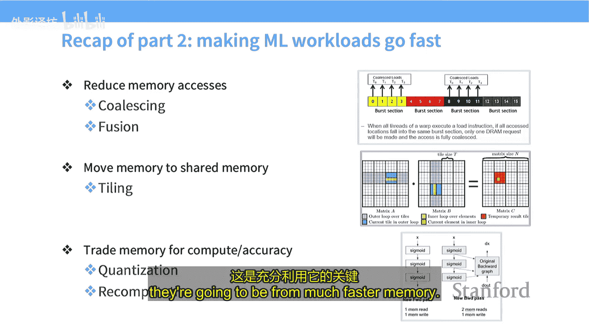

Flash Attention的核心目标是：**在计算精确注意力时，实现对高带宽内存的访问次数低于二次方**。

它主要应用了两项技术：
1.  **分块**：将大的`Q, K, V`矩阵分成小块，在共享内存中进行计算。
2.  **重计算**：在前向传播时不存储`O(N^2)`的注意力矩阵，在反向传播时重新计算。

**关键突破：在线Softmax**
标准的Softmax需要看到整行数据才能计算。Flash Attention使用了**在线Softmax算法**，可以逐块更新Softmax的归一化因子，从而允许在分块计算注意力时，无需将中间结果写回全局内存。

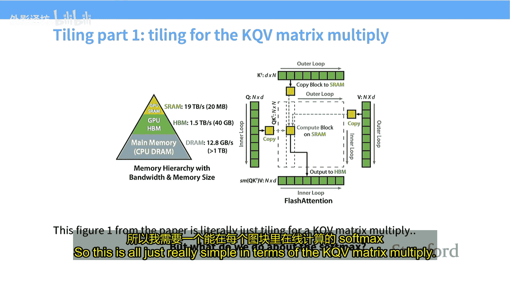

通过结合分块、重计算和在线Softmax，Flash Attention成功地将内存访问复杂度从`O(N^2)`降低到`O(N^2 / T)`（T为块大小），从而实现了巨大的速度提升和更长的上下文处理能力。

---

## 总结 🎯

本节课中我们一起学习了：
1.  **GPU架构**：其高吞吐量设计源于大量的SM和SIMT执行模型。
2.  **内存层次**：理解寄存器、共享内存和全局内存的速度差异是性能优化的基础。
3.  **性能瓶颈**：内存带宽是当前及未来GPU的主要瓶颈。
4.  **优化技巧**：包括降低精度、内核融合、重计算、内存合并、分块和对齐。
5.  **实践应用**：这些技巧共同构成了像Flash Attention这样的现代高性能Transformer算法的基础。

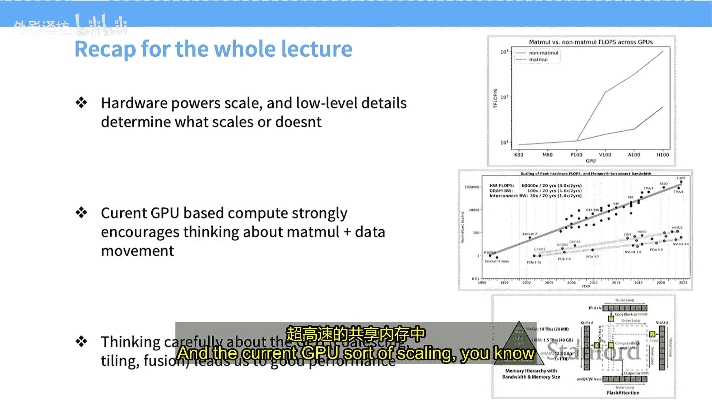


记住，要充分利用硬件，必须深入思考**数据移动**的效率，而不仅仅是计算操作的数量。将数据尽可能保留在高速内存中，是释放GPU全部潜力的关键。