# 6：内核优化与Triton框架应用 🚀


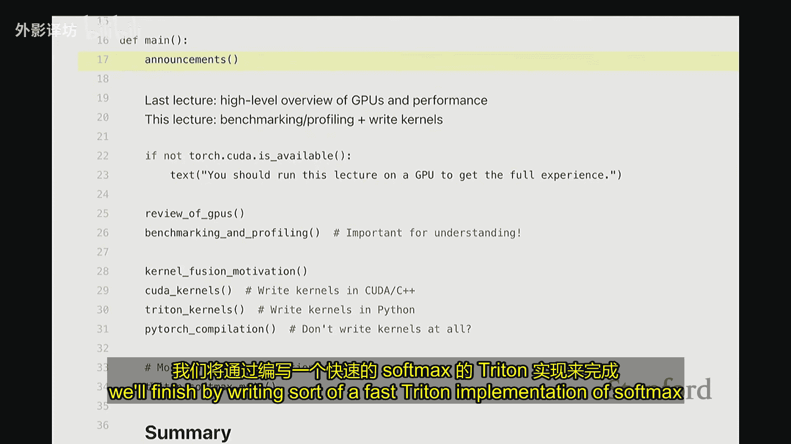

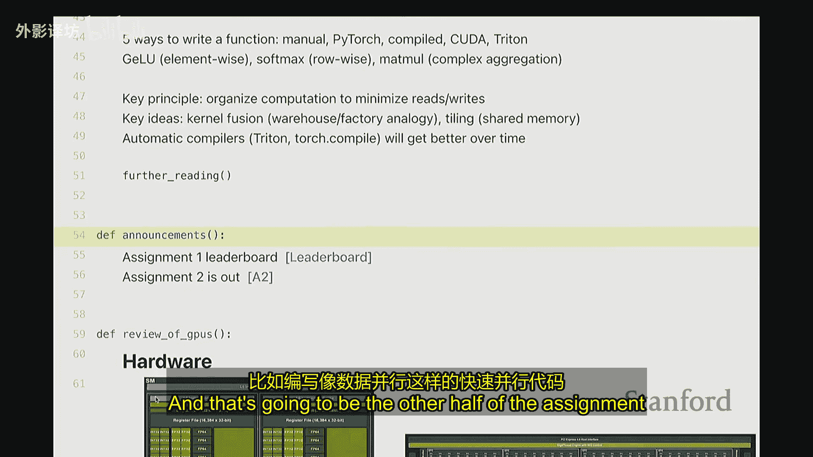

在本节课中，我们将学习如何为语言模型中的标准组件编写高性能的GPU代码。我们将从GPU基础回顾开始，然后学习基准测试与性能分析的方法，接着会分别使用CUDA和Triton框架编写内核，最后了解PyTorch的即时编译优化。通过本节课，你将掌握编写和优化GPU内核以加速深度学习模型的核心技能。

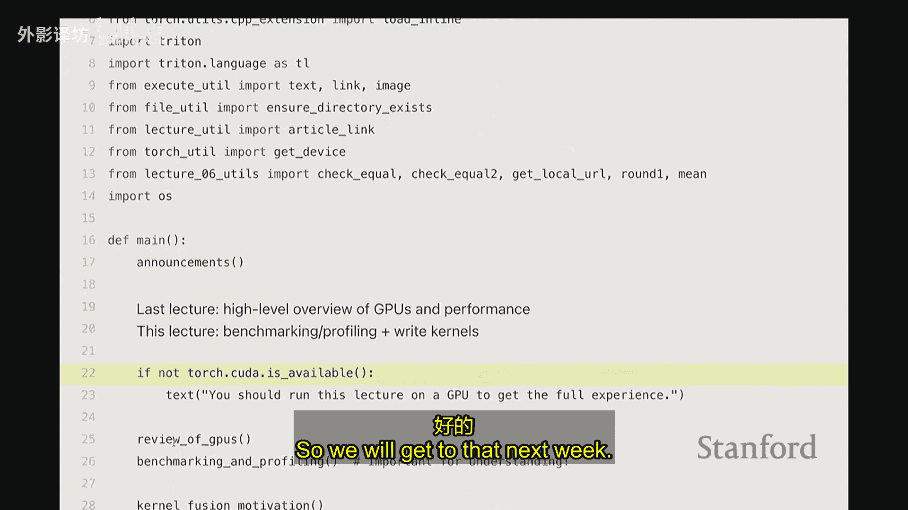

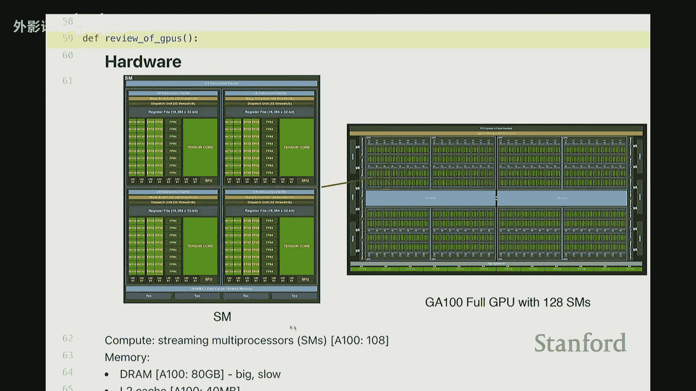

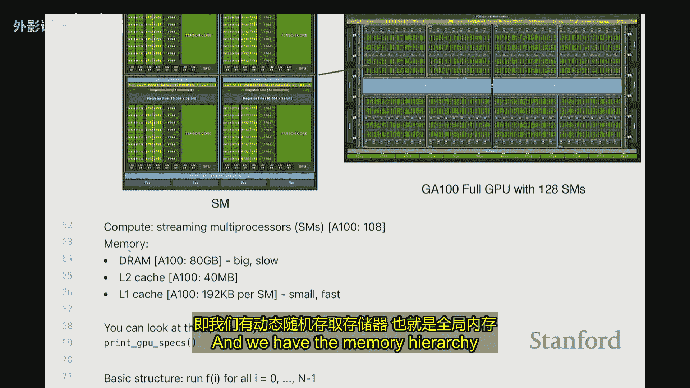

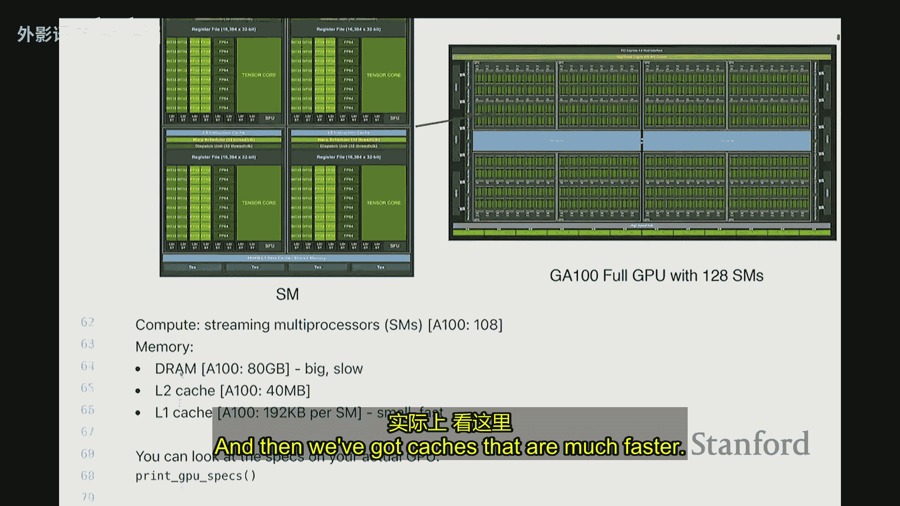

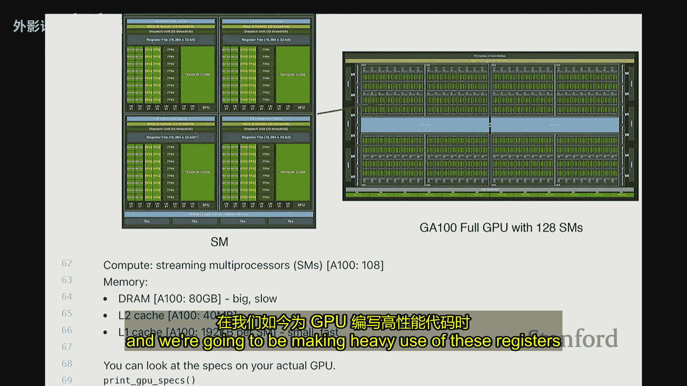

## GPU架构与执行模型回顾 ⚙️

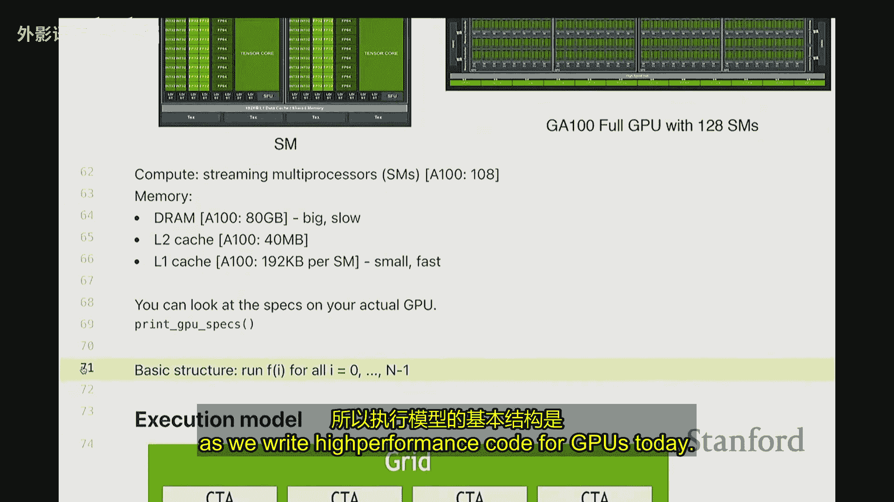

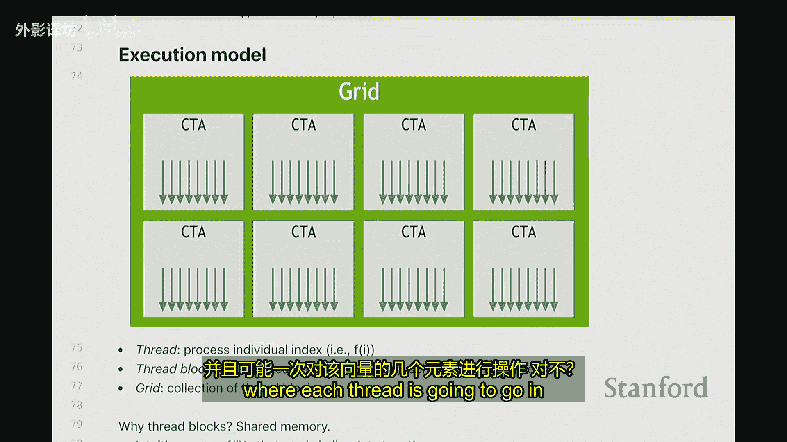

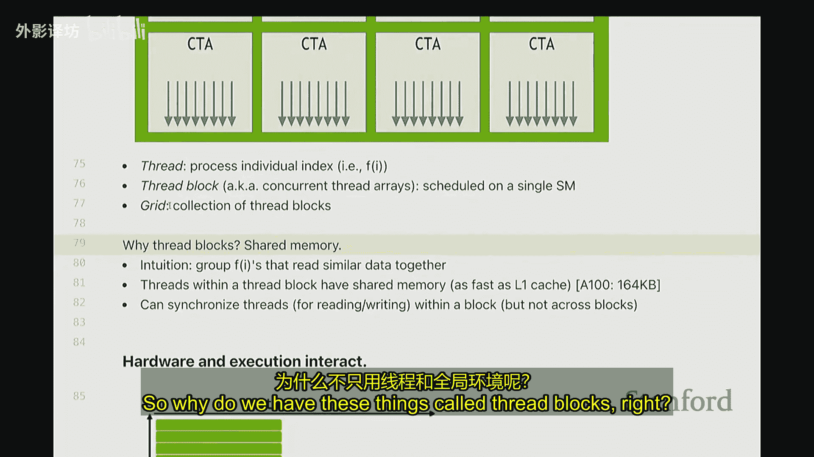

上一节我们介绍了课程的整体目标，本节中我们来回顾一下GPU的基本工作原理，这对于理解后续的优化技术至关重要。

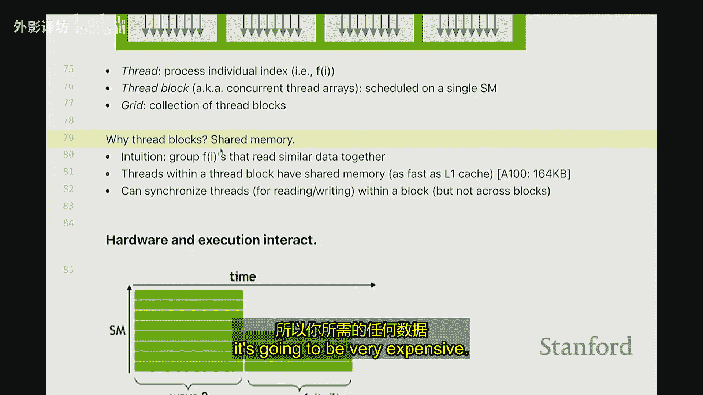

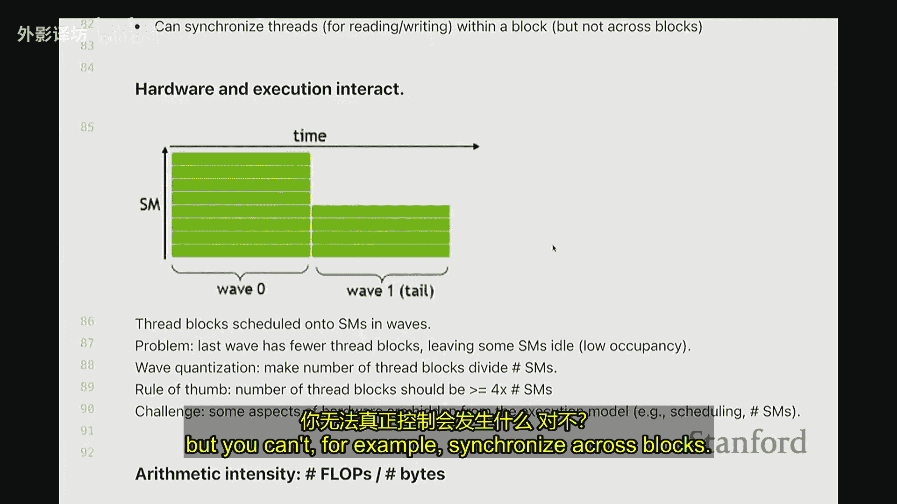

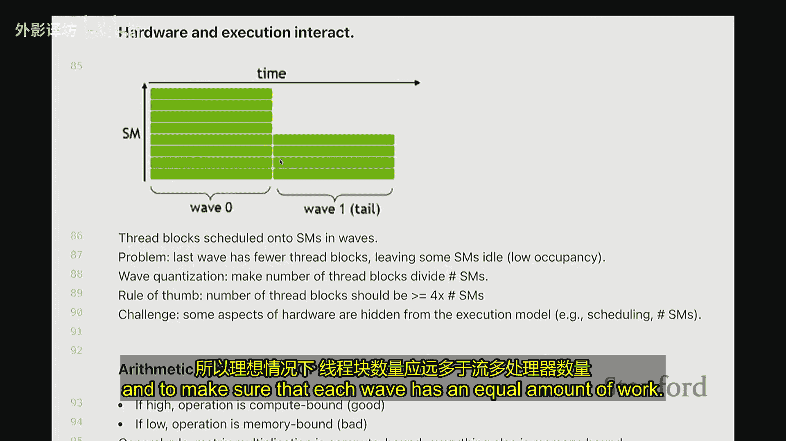

当我们使用A100或H100这类GPU时，其内部包含多个流多处理器（SM）。每个流多处理器内部都有大量计算单元（如FP32单元），可以启动大量线程进行计算。

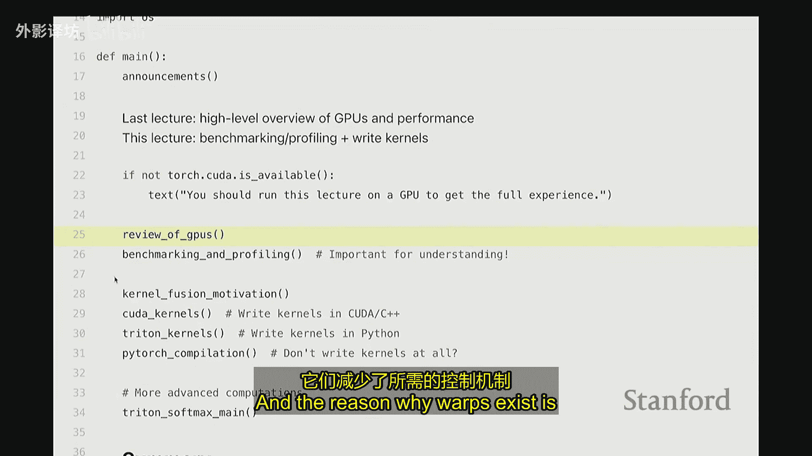

GPU拥有多层内存结构：
*   **全局内存（DRAM）**：容量大，但速度慢。
*   **缓存**：速度比全局内存快得多。
*   **寄存器文件**：速度极快，每个线程都可以访问。在编写高性能GPU代码时，我们会大量使用寄存器。

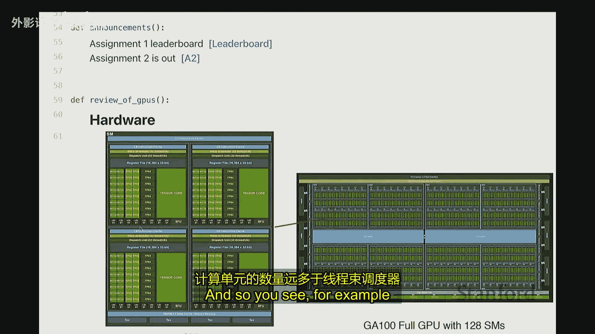

GPU的执行模型基于线程块（Thread Block）和线程（Thread）：
*   一个**线程块**会在单个流多处理器上调度，是执行的基本原子单元。
*   每个线程块内包含许多**线程**，实际的计算由这些线程完成。
*   线程块内的线程可以通过**共享内存**进行快速通信，但跨线程块的通信则开销很大。

线程被分组为连续的32线程块，称为一个**波（Warp）**。波会在一个SM中一次性全部执行。为了获得最佳性能，我们希望所有波都有等量的计算，并且线程块数量应远多于流多处理器数量。

一个核心性能概念是**算术强度**，其公式为：
`算术强度 = 浮点运算次数 / 内存传输字节数`
我们希望保持高算术强度，因为现代GPU的计算能力提升速度远快于内存带宽提升速度。许多操作是内存受限的，优化目标就是减少这种限制。

## 基准测试与性能分析 📊

上一节我们回顾了GPU的基础知识，本节中我们来看看如何评估代码性能。编写高性能代码的第一步是进行准确的基准测试和性能分析，以定位真正的瓶颈。

### 如何进行基准测试

基准测试用于测量代码的端到端运行时间。在测量时，有两点至关重要：
1.  **热身迭代**：首次运行代码时，GPU需要编译指令、初始化等，会产生额外开销。进行几次热身迭代可以确保我们测量的是稳态性能。
2.  **设备同步**：CPU和GPU是独立运行的。CPU发出GPU计算指令后不会等待其完成。使用 `torch.cuda.synchronize()` 可以确保CPU等待GPU完成所有任务后再计时，从而获得准确的GPU执行时间。

以下是一个基准测试函数的示例代码：
```python
import torch
import time

def benchmark(func, *args, warmup=5, trials=10):
    # 热身阶段
    for _ in range(warmup):
        func(*args)
        torch.cuda.synchronize()
    
    # 正式测量阶段
    start = time.time()
    for _ in range(trials):
        func(*args)
        torch.cuda.synchronize()
    end = time.time()
    
    return (end - start) / trials
```

### 性能分析工具

性能分析能提供比基准测试更细粒度的信息，帮助我们了解时间具体花费在哪些操作或内核上。

PyTorch提供了内置的性能分析器。例如，分析一个矩阵加法操作，我们可以看到在Python层简单的 `A + B` 背后，实际调用了底层的CUDA内核 `elementwise_add_kernel`，并且还能看到内核启动和设备同步的开销。

对于更复杂的模型（如多层感知机MLP），可以使用更强大的工具如 **NVIDIA Nsight Systems**。它可以可视化GPU和CPU的执行时间线，清楚地展示出：
*   CPU如何提前将CUDA内核命令排队发送给GPU。
*   CPU和GPU之间的执行如何交错进行。
*   如果在训练循环中插入打印损失值的语句，会强制CPU等待GPU计算完成损失，从而可能破坏这种提前执行的流水线，引入CPU瓶颈。

**核心要点**：在优化代码前，务必使用分析器找到真正的性能瓶颈，避免在非关键部分浪费时间。

## 编写CUDA内核（C++风格） ⚡

上一节我们学习了如何定位性能问题，本节中我们动手编写高性能内核来解决它。我们将从一个具体的例子——高斯误差线性单元（GELU）激活函数开始。

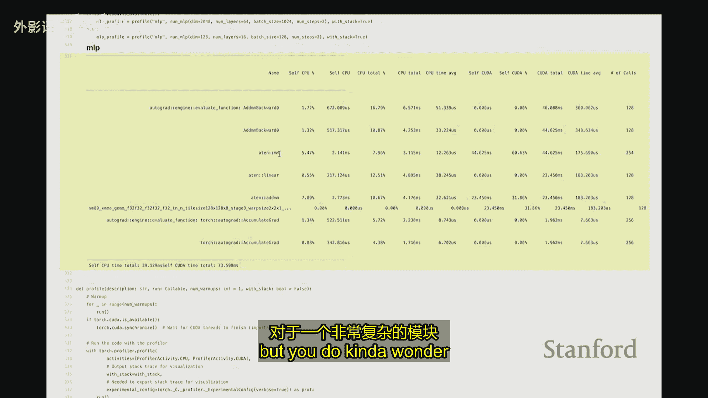

首先，我们对比两种PyTorch实现：
1.  **手动实现**：将GELU公式分解为多个PyTorch运算（如乘法、指数、双曲正切）。这会导致启动多个独立的CUDA内核，每个内核都有内存读写开销，性能较差（例如8.1毫秒）。
2.  **PyTorch原生函数**：`torch.nn.functional.gelu` 是一个融合内核，所有计算在一个CUDA内核中完成，性能极佳（例如1.1毫秒）。

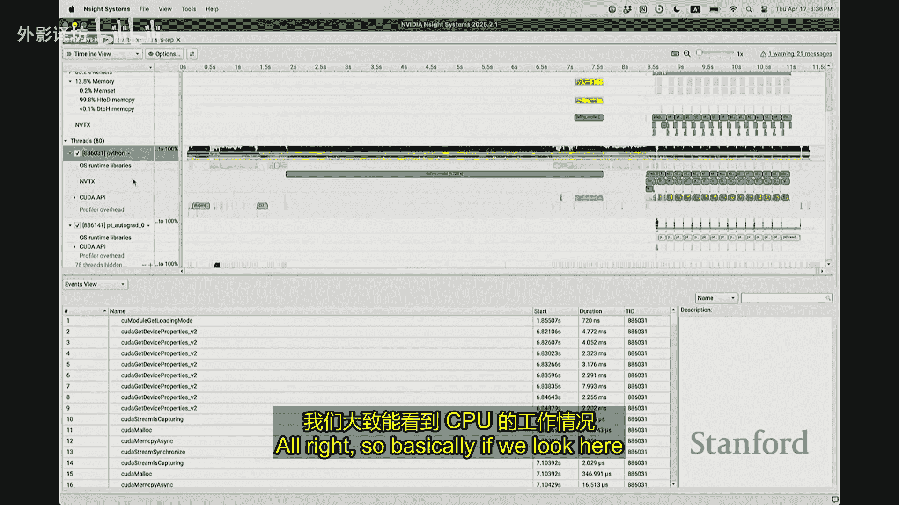

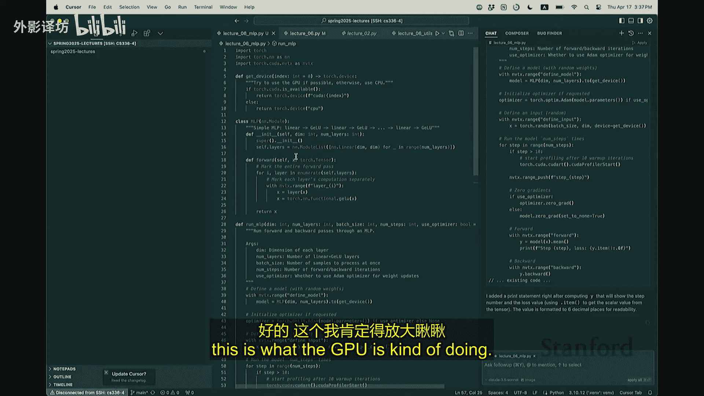

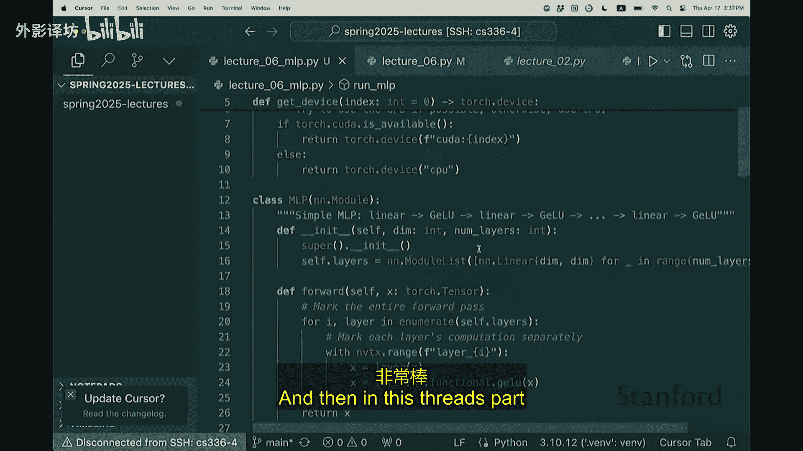

我们的目标是接近原生函数的性能。首先，我们使用CUDA C++ API来编写融合内核。

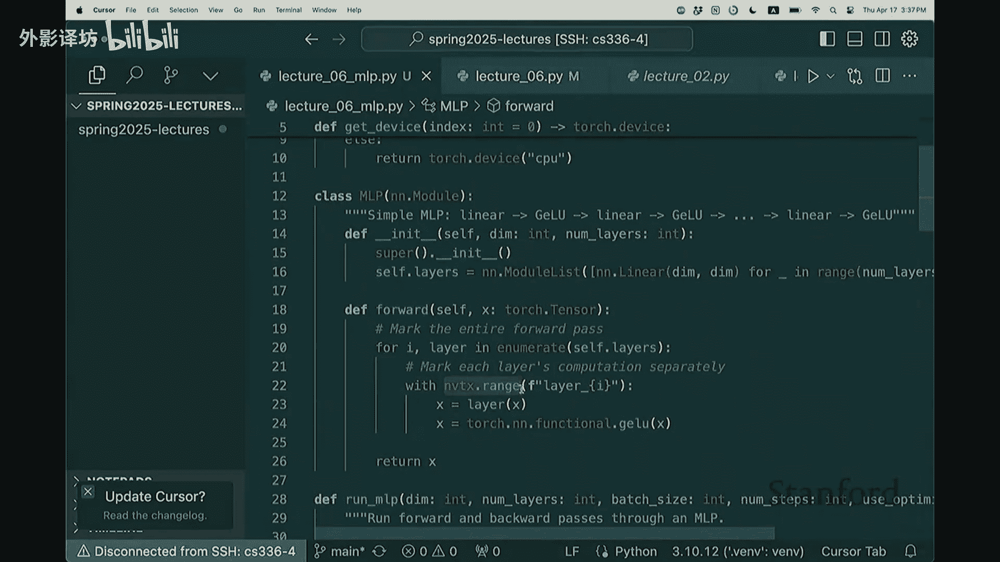

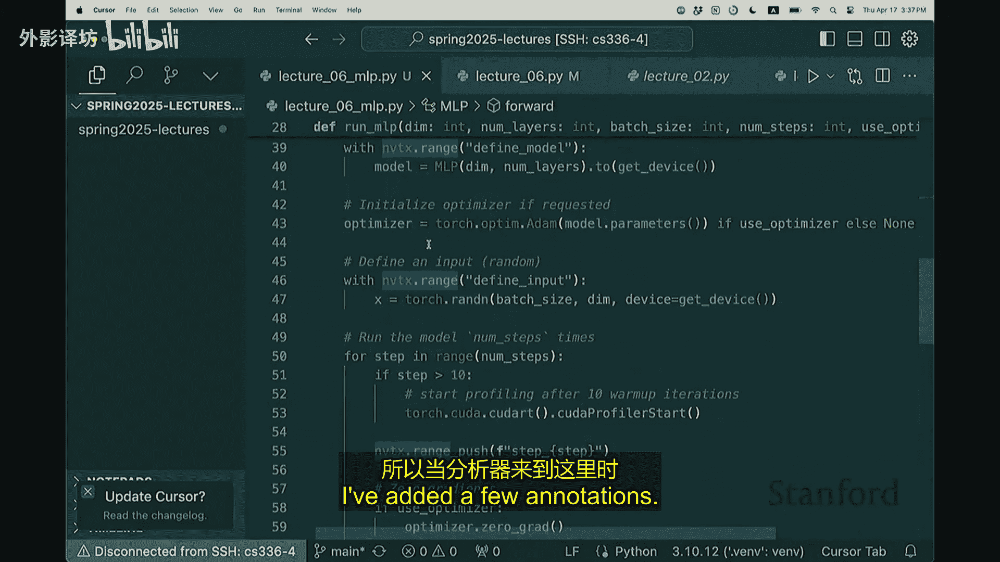

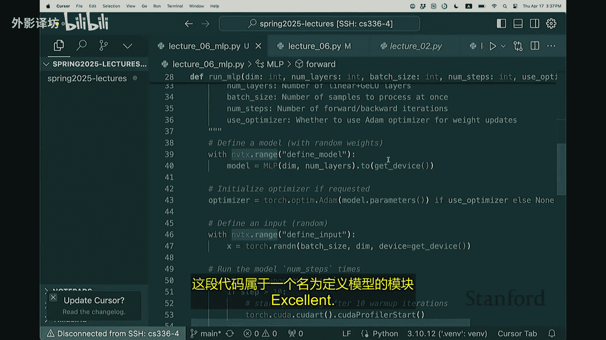

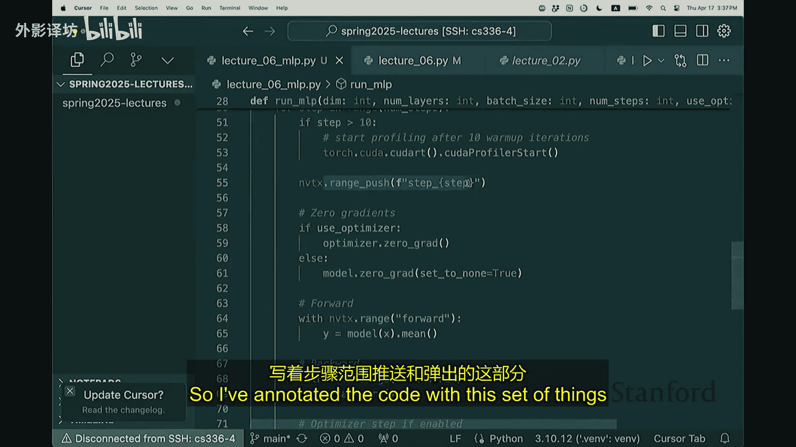

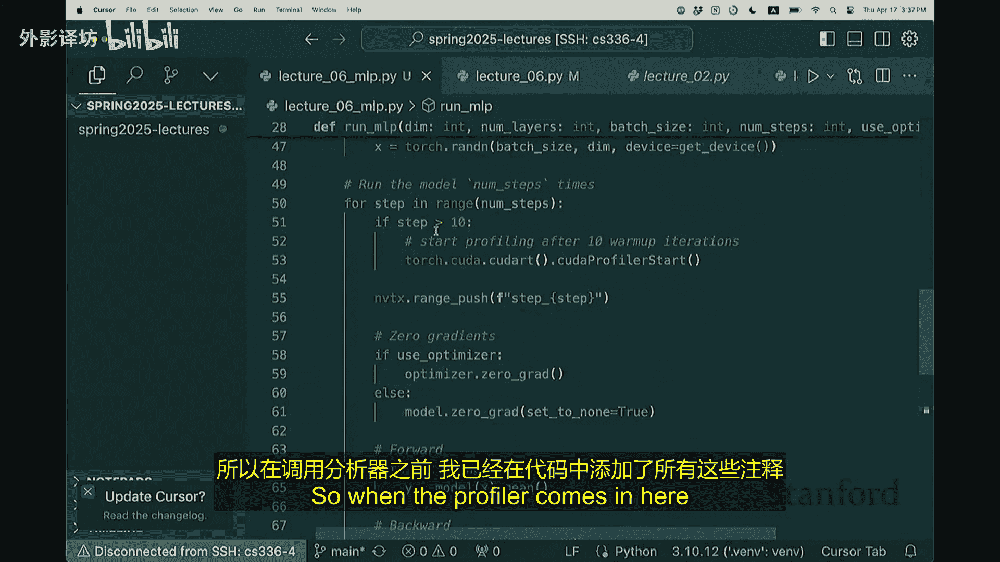

### CUDA内核结构

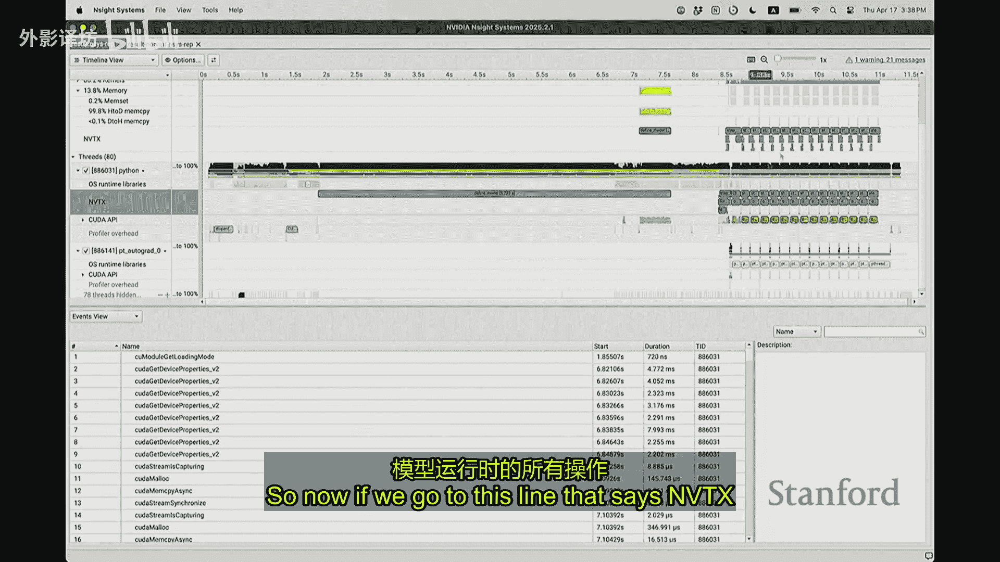

一个CUDA内核函数通常包含两部分：
1.  **设备端内核函数**：在GPU上执行的函数，用 `__global__` 关键字修饰。它负责具体的并行计算。
2.  **主机端包装函数**：在CPU上运行的函数，负责准备数据、计算执行配置（网格和线程块大小）并启动内核。

以下是GELU的CUDA内核实现概览：

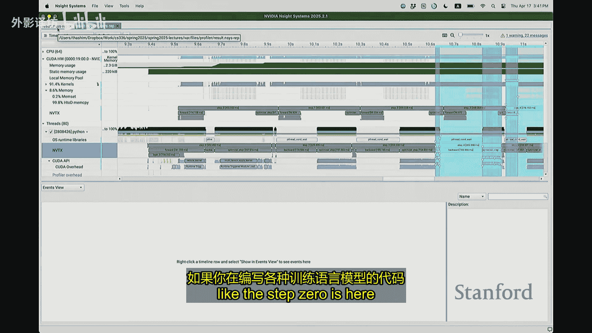

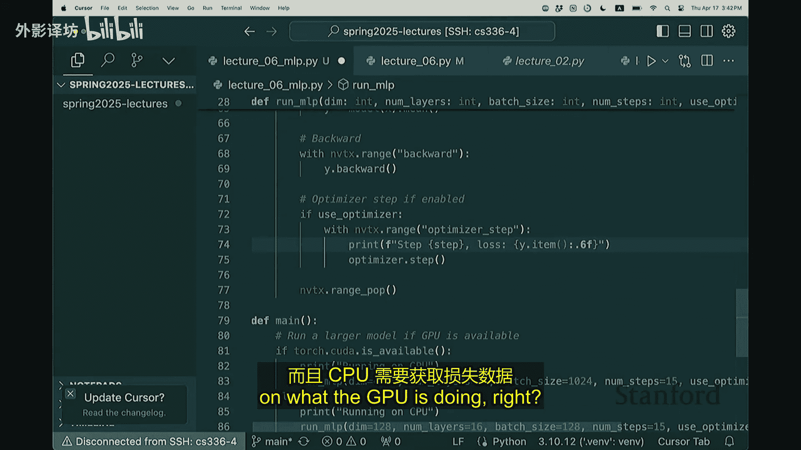

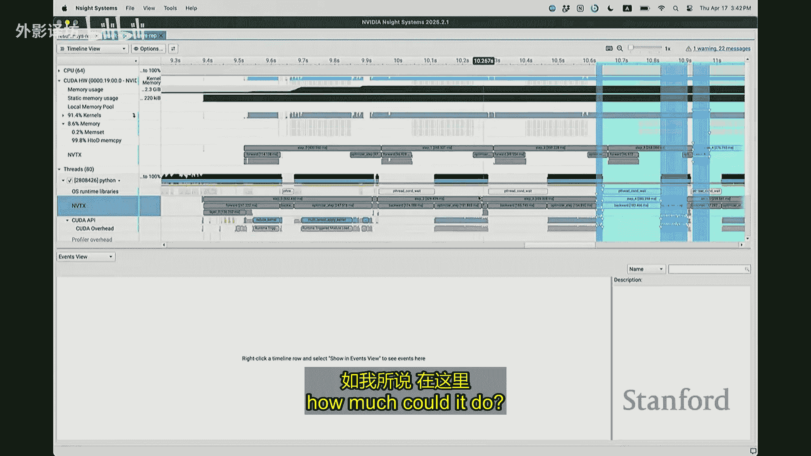

**主机端包装函数** (`gelu`):
```cpp
torch::Tensor gelu(torch::Tensor x) {
    // 检查输入是否在GPU上且内存连续
    TORCH_CHECK(x.is_cuda(), "Input must be a CUDA tensor");
    TORCH_CHECK(x.is_contiguous(), "Input must be contiguous");
    
    // 分配输出张量
    auto y = torch::empty_like(x);
    
    // 计算执行配置：线程块数量和每个块的线程数
    int64_t n = x.numel();
    const int threads = 1024; // 常见的块大小
    const int blocks = (n + threads - 1) / threads; // 向上取整
    
    // 启动CUDA内核
    gelu_kernel<<<blocks, threads>>>(x.data_ptr<float>(), y.data_ptr<float>(), n);
    
    return y;
}
```

**设备端内核函数** (`gelu_kernel`):
```cpp
__global__ void gelu_kernel(const float* x, float* y, int n) {
    // 计算当前线程处理的全局索引
    int i = blockIdx.x * blockDim.x + threadIdx.x;
    
    // 边界检查：防止越界
    if (i < n) {
        float xi = x[i];
        // 内联计算GELU近似公式
        float y_i = 0.5 * xi * (1.0 + tanhf(0.79788456 * xi * (1 + 0.044715 * xi * xi)));
        y[i] = y_i;
    }
}
```

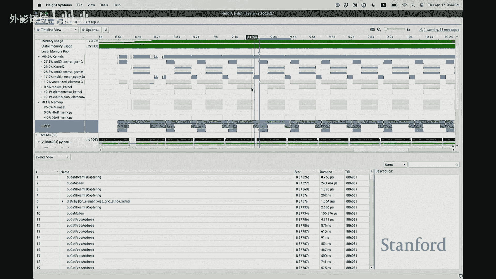

通过这种融合实现，我们将运行时间从8.1毫秒降低到了1.8毫秒，性能大幅提升。性能分析显示，现在只有一个 `gelu_kernel` 占用了几乎全部GPU时间。

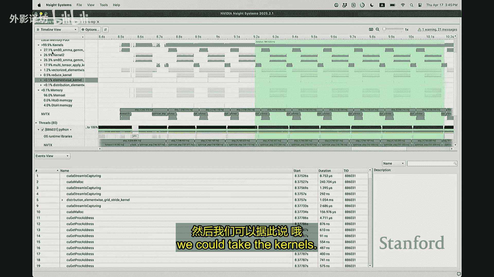

## 使用Triton框架编写内核 🐬

上一节我们用C++编写了CUDA内核，虽然高效但较为繁琐。本节我们介绍一种更友好的方式——使用 **Triton** 领域特定语言（DSL）。

Triton允许我们用Python编写GPU内核，它自动处理许多底层细节，如内存访问合并、共享内存管理和线程同步，同时保持了高性能。

### Triton编程模型

Triton的编程模型以**线程块**为中心，而不是单个线程。我们编写操作作用于整个块上的向量化代码。

以下是Triton版本的GELU内核：

**内核函数** (`gelu_kernel`):
```python
import triton
import triton.language as tl

@triton.jit
def gelu_kernel(x_ptr, y_ptr, n_elements, BLOCK_SIZE: tl.constexpr):
    # 计算当前块负责的数据范围
    pid = tl.program_id(axis=0) # 块ID
    block_start = pid * BLOCK_SIZE
    offsets = block_start + tl.arange(0, BLOCK_SIZE)
    
    # 创建掩码，防止越界访问
    mask = offsets < n_elements
    
    # 从全局内存加载一个向量块到寄存器
    x = tl.load(x_ptr + offsets, mask=mask)
    
    # 计算GELU（向量化操作）
    # 注意：Triton代码中需要使用tl.math.tanh等内置函数
    y = 0.5 * x * (1.0 + tl.math.tanh(0.79788456 * x * (1 + 0.044715 * x * x)))
    
    # 将结果存回全局内存
    tl.store(y_ptr + offsets, y, mask=mask)
```

**主机端启动代码**:
```python
def triton_gelu(x):
    assert x.is_cuda and x.is_contiguous()
    n_elements = x.numel()
    y = torch.empty_like(x)
    
    # 定义块大小（例如1024），并计算需要的块数
    BLOCK_SIZE = 1024
    grid = (triton.cdiv(n_elements, BLOCK_SIZE),) # 计算块数
    
    # 启动内核
    gelu_kernel[grid](x, y, n_elements, BLOCK_SIZE=BLOCK_SIZE)
    return y
```

使用Triton，我们同样获得了约1.8毫秒的运行时间，与手写CUDA内核性能相当，但编写和调试的难度大大降低。我们还可以查看Triton编译生成的底层PTX代码，了解其如何将向量化操作映射到GPU线程和寄存器。

## PyTorch即时编译（torch.compile）与总结 🎯

上一节我们使用Triton简化了GPU编程，本节我们看看能否更省力地获得高性能。现代深度学习框架的即时编译器已经非常强大。

PyTorch的 `torch.compile` 功能可以自动对模型代码进行优化，包括**内核融合**。对于我们的简单GELU例子，只需对原始的手动实现代码添加一个装饰器或进行编译：

```python
@torch.compile
def manual_gelu_compiled(x):
    return 0.5 * x * (1 + torch.tanh(0.79788456 * x * (1 + 0.044715 * x * x)))
```

编译后的版本运行时间可以达到约1.47毫秒，甚至优于我们手写的CUDA和Triton内核。分析器显示，它自动生成了一个融合的Triton内核。

### 何时需要手写内核？

那么，在 `torch.compile` 如此强大的情况下，我们何时还需要手写内核呢？
*   **简单操作**：对于像逐元素运算、简单规约等，编译器通常能做得很好，手动优化收益不大。
*   **复杂创新优化**：当你有全新的、复杂的计算模式（例如FlashAttention系列中的优化），这些模式可能难以被编译器自动发现。此时，使用Triton或CUDA手动实现可以释放硬件的全部潜力。
*   **利用新硬件特性**：针对最新GPU的特定硬件特性进行优化（如H100的TMA单元），手动编码可能更直接。

### 扩展：Triton实现Softmax

最后，我们简要看一个稍复杂的例子——Softmax。Softmax包含规约操作（求和），在Triton中实现也很直观。核心思想是让一个线程块处理输出矩阵的一行。

以下是实现思路：
1.  **执行配置**：设置线程块大小等于或大于列数（向上取整到2的幂），网格大小等于行数。
2.  **内核逻辑**：每个块加载一行数据到共享内存或寄存器，先找出该行最大值（规约），然后计算指数并求和（另一个规约），最后进行归一化并写回结果。

通过Triton，我们可以将Softmax实现为一个高效的单内核融合操作。

---

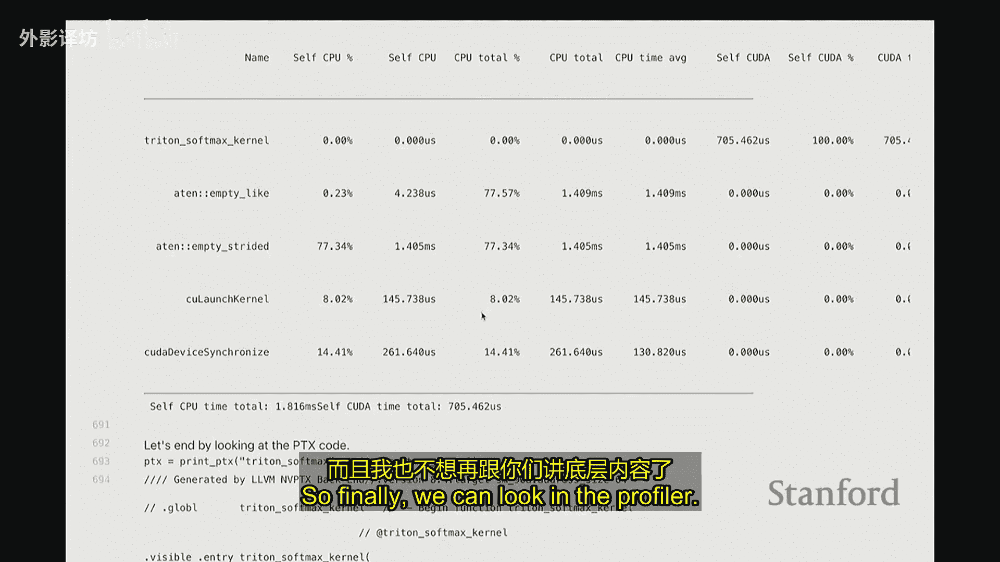


**本节课总结**：我们一起学习了高性能GPU编程的核心路径。我们从**基准测试和分析**开始，确保优化有的放矢。然后，我们掌握了两种编写融合内核的方法：使用**CUDA C++ API**进行底层控制和使用**Triton DSL**进行更高效的Python级开发。最后，我们认识到**PyTorch的即时编译器**（`torch.compile`）对于许多常见模式已经足够优秀。在实际工作中，应根据优化复杂度、开发效率和性能收益，在这些工具中做出明智选择。