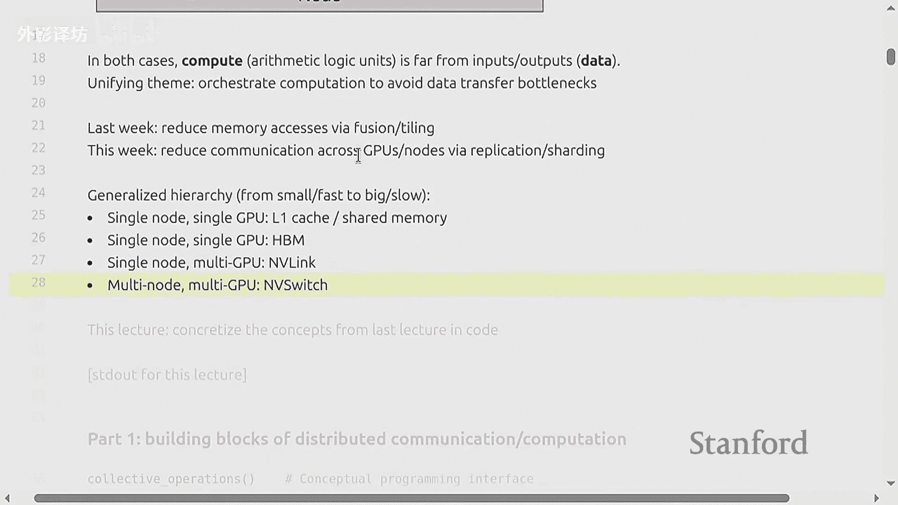
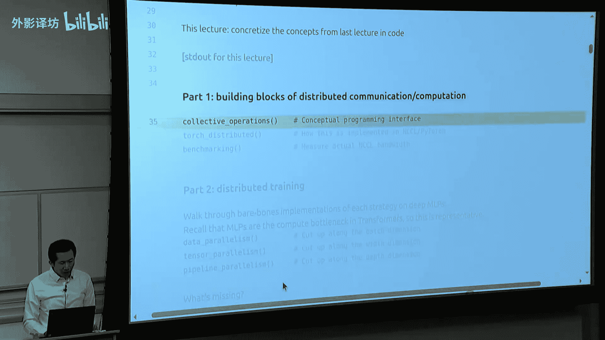
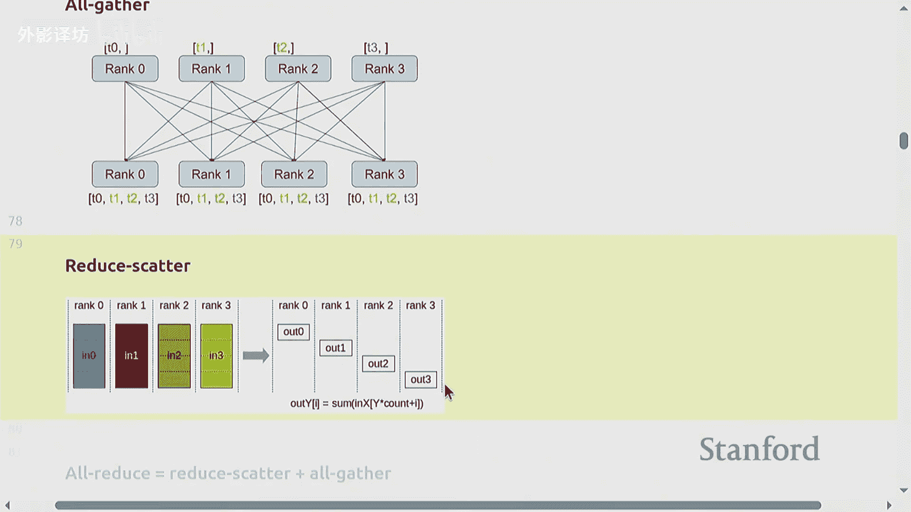
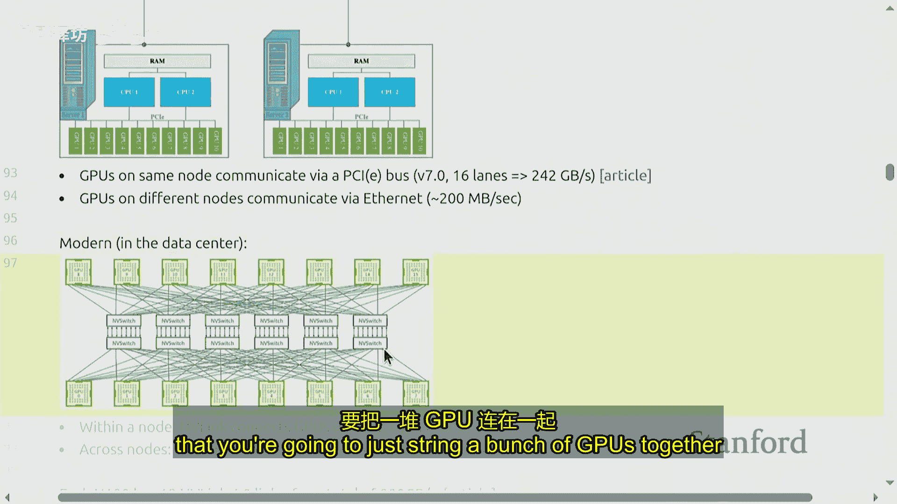
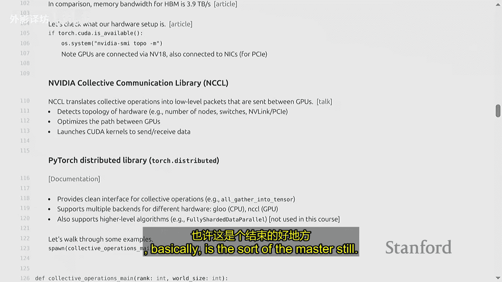
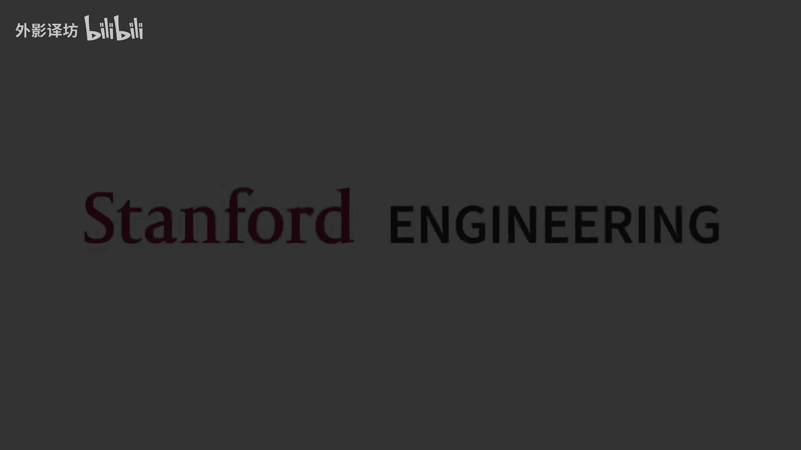

#  8：分布式训练技术（下）：模型与张量并行 🚀


在本节课中，我们将要学习如何利用多个GPU进行高效的分布式模型训练。我们将深入探讨模型并行与张量并行的核心概念，并通过代码示例理解其实现原理。课程内容将涵盖集合通信操作、数据并行、张量并行以及流水线并行等关键技术。



---

## 概述：硬件与通信基础



上一节我们介绍了单个GPU内的并行优化技术。本节中，我们来看看如何在多个GPU甚至多个计算节点之间组织计算，以克服数据传输瓶颈，保持高算术强度，让GPU持续高效运转。

现代深度学习硬件通常由多个GPU节点组成，每个节点包含多个GPU。数据需要在GPU间传输，而通信速度往往远慢于计算速度，因此优化数据传输是关键。



硬件层级结构遵循从快到慢、从小到大的原则：
*   **L1缓存**：位于单个GPU的流式多处理器（SM）内，速度极快，容量极小。
*   **高带宽内存（HBM）**：位于单个GPU上，容量更大。
*   **NVLink**：连接同一节点内的不同GPU，速度高于PCIe。
*   **NVSwitch**：在英伟达生态系统中，用于跨节点直接连接GPU，绕过以太网。



我们的目标是组织计算，尽可能让数据在高速缓存中处理，避免频繁访问低速的HBM或进行跨设备通信。

---

## 第一部分：集合通信操作

集合通信操作是分布式编程的基础原语，它提供了比手动管理点对点通信更优的抽象。以下是核心操作介绍：

以下是主要的集合通信操作类型：

1.  **广播（Broadcast）**：将某个设备（如`rank 0`）上的数据分发到所有其他设备上。
2.  **散射（Scatter）**：将一个数据集合的不同部分分发到不同的设备上，每个设备获得的值不同。
3.  **收集（Gather）**：散射的逆操作，将不同设备上的数据收集到一个设备上。
4.  **规约（Reduce）**：与收集类似，但会对数据进行某种可结合、可交换的操作（如求和`sum`、求最大值`max`），然后将结果放在一个设备上。
5.  **全收集（All-Gather）**：对所有设备执行收集操作，使得所有设备都拥有完整的数据集合。
6.  **全规约（All-Reduce）**：相当于**规约**后接**全收集**，所有设备最终都拥有规约后的结果。
7.  **规约散射（Reduce-Scatter）**：类似于规约，但规约后的结果会像散射一样分布到不同设备上。

**记忆技巧**：
*   **规约**意味着执行求和、求平均等操作。
*   **广播**、**散射**是**收集**的反向操作。
*   **全**（All-）表示操作的目标是所有设备。

### 在PyTorch中的实现

PyTorch的`torch.distributed`库为这些操作提供了高级接口，并支持多种后端（如用于GPU的`NCCL`，用于CPU的`gloo`）。

以下是一个使用`all_reduce`（全规约）和`reduce_scatter`（规约散射）的代码示例：

```python
import torch
import torch.distributed as dist

def run_collective_ops(rank, world_size):
    # 初始化进程组
    dist.init_process_group(backend='nccl', rank=rank, world_size=world_size)

    # 示例：All-Reduce
    tensor = torch.tensor([0, 1, 2, 3]) + rank
    print(f"Rank {rank} before all_reduce: {tensor}")
    dist.all_reduce(tensor, op=dist.ReduceOp.SUM) # 对所有设备的tensor求和
    print(f"Rank {rank} after all_reduce: {tensor}")

    # 示例：Reduce-Scatter
    input_tensor = torch.tensor([0, 1, 2, 3]) + rank
    output_tensor = torch.zeros(1)
    dist.reduce_scatter(output_tensor, [input_tensor for _ in range(world_size)], op=dist.ReduceOp.SUM)
    print(f"Rank {rank} after reduce_scatter output: {output_tensor}")

    dist.destroy_process_group()
```

### 性能基准测试

了解操作的带宽性能至关重要。我们可以通过测量传输时间和数据量来计算有效带宽。

对于`all_reduce`操作，总传输数据量约为 `2 * world_size * tensor_size`，因为每个设备既要发送自己的数据，也要接收规约后的结果。

```python
def benchmark_all_reduce(rank, world_size):
    dist.init_process_group(...)
    tensor_size = 100_000_000
    tensor = torch.randn(tensor_size, device='cuda')
    # 预热
    dist.all_reduce(tensor)
    torch.cuda.synchronize()
    dist.barrier()

    start = torch.cuda.Event(enable_timing=True)
    end = torch.cuda.Event(enable_timing=True)
    start.record()
    dist.all_reduce(tensor)
    end.record()
    torch.cuda.synchronize()
    elapsed_time_ms = start.elapsed_time(end)

    # 计算带宽 (GB/s)
    bytes_per_element = tensor.element_size() # 例如 float32 为 4
    total_bytes_transferred = 2 * (world_size - 1) * tensor_size * bytes_per_element / world_size # 简化模型
    bandwidth_gbs = (total_bytes_transferred / 1e9) / (elapsed_time_ms / 1000)
    print(f"Bandwidth: {bandwidth_gbs:.2f} GB/s")
```

---

## 第二部分：分布式训练策略

现在我们将集合通信应用于实际的模型训练。主要有三种并行策略：数据并行、张量并行和流水线并行。我们将在一个简单的多层感知机（MLP）上演示它们的基本实现。

### 1. 数据并行 (Data Parallelism) 📊

在数据并行中，**模型被完整地复制到每个GPU上**，但**每个GPU处理批次数据的不同子集（切片）**。反向传播后，需要同步所有GPU上计算出的梯度。

**核心步骤**：
1.  将全局批次数据沿批次维度分割，每个设备获得一个本地小批次。
2.  每个设备用完整的模型对其本地数据进行前向和反向传播，计算本地梯度。
3.  使用`all_reduce`操作对所有设备上的梯度进行求和或平均。
4.  每个设备使用同步后的梯度更新其本地模型参数。

由于所有设备使用相同的梯度更新，模型参数始终保持一致。

```python
def data_parallel_mlp(rank, world_size, batch_size=128, num_dim=1024, num_layers=4):
    # 1. 数据分割
    local_batch_size = batch_size // world_size
    start_idx = rank * local_batch_size
    end_idx = start_idx + local_batch_size
    data = torch.randn(batch_size, num_dim).cuda()
    local_data = data[start_idx:end_idx] # 每个设备获取数据的一部分

    # 2. 定义模型 (每个设备都有完整的模型副本)
    model = [torch.randn(num_dim, num_dim, requires_grad=True).cuda() for _ in range(num_layers)]
    optimizer = torch.optim.SGD(model, lr=0.01)

    # 3. 训练步骤
    for step in range(10):
        # 前向传播
        x = local_data
        for layer in model:
            x = torch.relu(x @ layer)
        loss = x.sum() # 示例损失

        # 反向传播
        optimizer.zero_grad()
        loss.backward()

        # 4. 梯度同步 (关键步骤！)
        for param in model:
            dist.all_reduce(param.grad, op=dist.ReduceOp.AVG) # 平均梯度

        # 参数更新
        optimizer.step()
        print(f"Rank {rank}, Step {step}, Loss: {loss.item()}")
```

### 2. 张量并行 (Tensor Parallelism) ⚖️

在张量并行中，**单个模型层（如MLP中的矩阵）被分割到多个GPU上**。每个GPU只持有参数的一部分，并计算激活值的一部分。为了进行下一层的计算，需要聚合所有GPU的中间结果。

**核心步骤**（以单层矩阵乘法 `Y = X @ W` 为例）：
1.  将权重矩阵 `W` 沿列维度分割，每个设备持有 `W_part`。
2.  每个设备用完整的输入 `X` 与自己的 `W_part` 计算，得到输出的一部分 `Y_part`。
3.  使用`all_gather`操作收集所有设备上的 `Y_part`，拼接成完整的输出 `Y`，用于下一层计算。

这种方法通信密集，需要高速的GPU间互联。

```python
def tensor_parallel_mlp_forward(rank, world_size, batch_size=128, num_dim=1024):
    # 1. 模型参数分割
    local_dim = num_dim // world_size
    # 假设有一层，权重被分割
    local_weight = torch.randn(num_dim, local_dim, requires_grad=True).cuda()

    # 2. 输入数据 (完整数据)
    x = torch.randn(batch_size, num_dim).cuda()

    # 3. 本地计算
    local_output = x @ local_weight  # 形状: [batch_size, local_dim]

    # 4. 全局收集激活值
    gathered_outputs = [torch.zeros_like(local_output) for _ in range(world_size)]
    dist.all_gather(gathered_outputs, local_output)

    # 5. 拼接得到完整输出
    full_output = torch.cat(gathered_outputs, dim=-1)  # 形状: [batch_size, num_dim]
    print(f"Rank {rank}, local output shape {local_output.shape}, full output shape {full_output.shape}")
    return full_output
```

### 3. 流水线并行 (Pipeline Parallelism) 🚰

在流水线并行中，**模型的不同层被放置在不同的GPU上**。一个批次的数据被拆分成多个微批次（micro-batches）。GPU像工厂流水线一样工作：当一个GPU完成对当前微批次的计算后，立即将结果发送给下一个GPU，并开始处理下一个微批次。

**核心步骤**：
1.  将模型按层分组，每组分配到不同的设备。
2.  将批次数据划分为微批次。
3.  设备0处理第一个微批次，然后将结果发送给设备1，同时开始处理第二个微批次。
4.  设备1收到设备0的结果后开始计算，以此类推，形成流水线。

基础实现容易产生“流水线气泡”（设备空闲等待）。优化策略包括精心安排微批次、重叠通信与计算等。

```python
def pipeline_parallel_mlp(rank, world_size, batch_size=128, num_dim=1024, num_layers=4, num_micro_batches=4):
    layers_per_device = num_layers // world_size
    my_layers = [torch.randn(num_dim, num_dim).cuda() for _ in range(layers_per_device)]

    micro_batch_size = batch_size // num_micro_batches
    data = torch.randn(batch_size, num_dim).cuda()
    micro_batches = torch.chunk(data, num_micro_batches)

    for i, micro_batch in enumerate(micro_batches):
        if rank == 0:
            x = micro_batch
        else:
            # 接收来自上一个设备的激活值
            x = torch.zeros_like(micro_batches[0])
            dist.recv(x, src=rank-1)

        # 本地层的前向传播
        for layer in my_layers:
            x = torch.relu(x @ layer)

        if rank != world_size - 1:
            # 发送给下一个设备
            dist.send(x, dst=rank+1)
        else:
            # 最后一个设备，得到最终输出
            final_output = x
```

---

## 总结与展望

本节课我们一起学习了分布式训练的核心技术。我们首先回顾了集合通信操作及其在PyTorch中的使用，它们是构建分布式训练的基础。然后，我们深入探讨了三种主流的模型并行化策略：

*   **数据并行**：复制模型，分割数据。实现简单，但要求每个GPU都能容纳整个模型。
*   **张量并行**：分割模型层，需要频繁聚合激活值，对通信带宽要求高。
*   **流水线并行**：分割模型层组，按流水线处理微批次，需要精细调度以减少空闲时间。

这些策略可以组合使用，以训练超大规模的模型。在实际应用中（如训练Transformer），框架如PyTorch的FSDP、Megatron-LM或JAX的自动分片功能，会帮助我们管理复杂的并行逻辑和通信优化。





分布式训练的本质是在**计算、内存和通信**之间进行权衡。硬件在不断进步，但模型规模的增长和对效率的追求，使得理解这些底层并行技术始终具有重要意义。