# 9：缩放定律 1 🧮

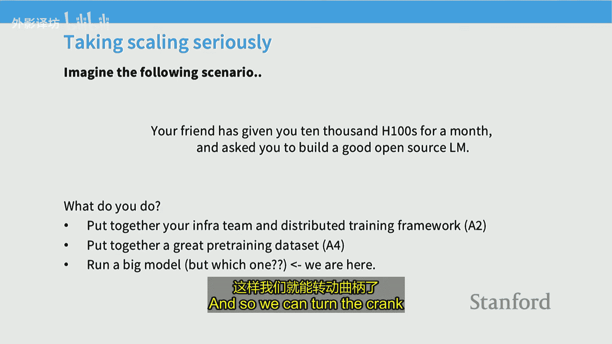

在本节课中，我们将要学习**缩放定律**。缩放定律是构建大型语言模型时，用于预测模型性能随计算资源、数据量和模型规模变化的核心工具。理解它，能帮助我们在不进行昂贵的大规模训练之前，就做出关键的工程决策。

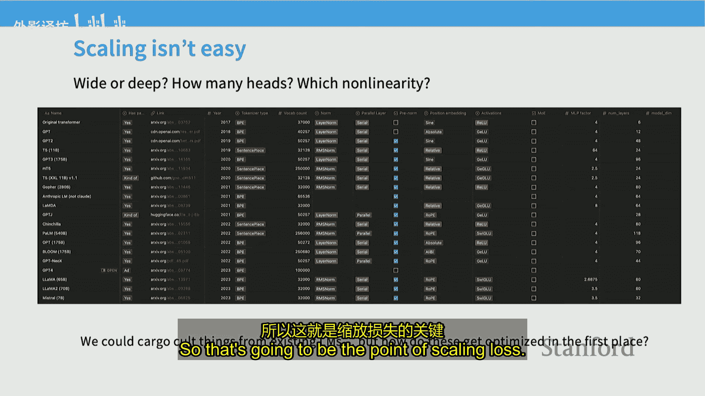

---

## 缩放定律的背景与动机 🎯

上一节我们介绍了模型架构和超参数选择。本节中我们来看看，当我们拥有大量计算资源时，如何科学地规划训练，而不是盲目地“抄袭”现有模型。

想象一个场景：你有一位富有的朋友，每月提供10万个H100 GPU，目标是构建最好的开源大语言模型。你拥有基础设施、训练框架和预训练数据集。问题在于，如何创新而非模仿？答案就在于利用**缩放定律**。

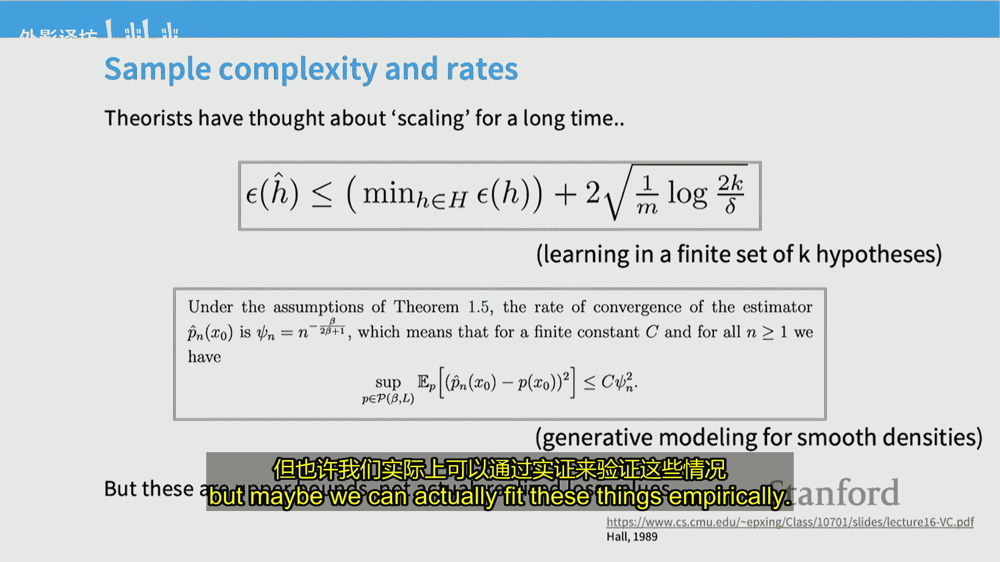

缩放定律的核心是：通过训练一系列**小模型**，观察其性能与资源（如数据量、模型大小）的关系，并拟合出预测规则。然后，我们可以将这些规则**外推**，以预测更大模型的行为，从而指导超参数选择、架构决策和资源分配。

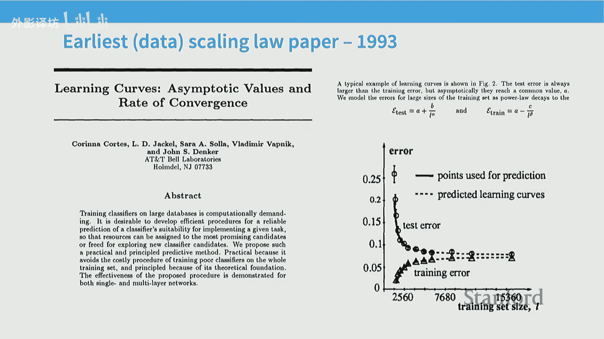

---

## 缩放定律的历史与理论基础 📜

缩放定律并非新概念。其思想根源可以追溯到统计机器学习理论。

在经典机器学习理论中，我们关心**泛化误差**如何随**样本数量 N** 增加而下降。例如，对于有限假设集合，泛化误差的上界与 **1/√N** 成正比。这本身就是一种理论上的“缩放定律”，它预测了误差衰减的速率。

对于更复杂的非参数模型（如拟合一个平滑的密度函数），误差衰减遵循所谓的**非参数速率**，其形式上界为 **N^{-β/(2β+1)}**，其中 β 与函数平滑度有关。

**关键跨越**在于，缩放定律从这些**理论上的上界**，转向了**实证可观测的规律**。我们通过实验发现，模型的实际损失与资源量之间，存在稳定、可预测的关系。

早在1993年，贝尔实验室的一篇论文就提出了类似思想：在不训练完整模型的情况下，预测分类器的性能。其提出的误差公式（不可约误差 + 多项式衰减项）已初具现代缩放定律的形态。

---

## 数据缩放定律 📈

数据缩放定律研究**测试损失**如何随**训练数据量**增加而变化。这是最直观的缩放类型。

### 核心观察

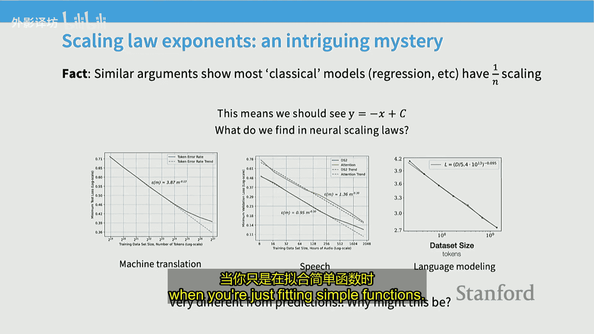

当我们在双对数坐标图（两个坐标轴都取对数）上，绘制**数据集大小 N** 与**测试损失 L** 时，会发现它们呈**线性关系**。

这意味着损失 L 与数据量 N 之间存在**幂律关系**：
`L(N) ≈ C * N^{-α}`
其中 C 是常数，α 是斜率（指数）。取对数后：`log L = log C - α * log N`，这正是线性关系。

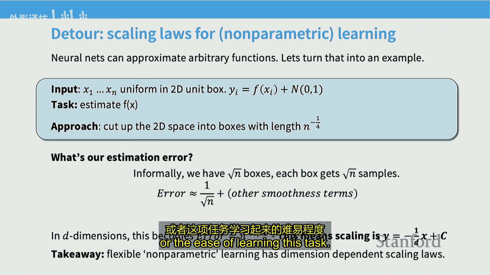

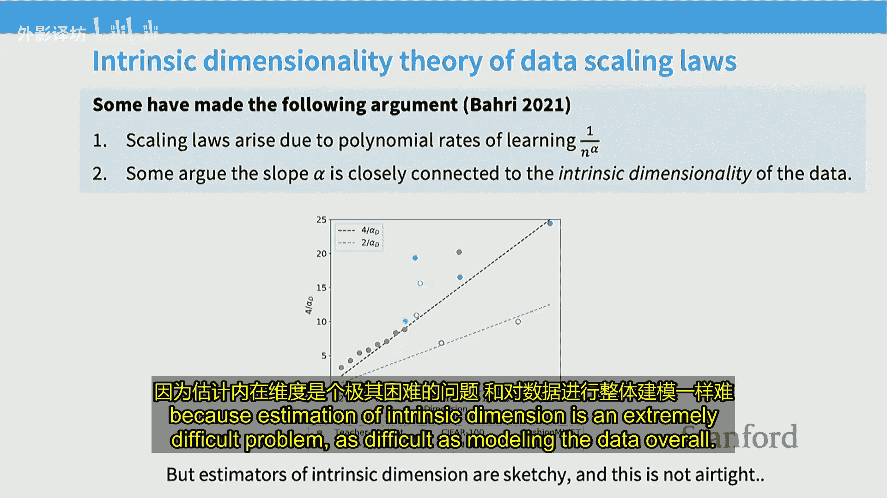

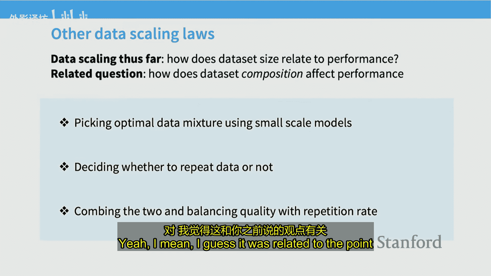

### 为何幂律是自然的？

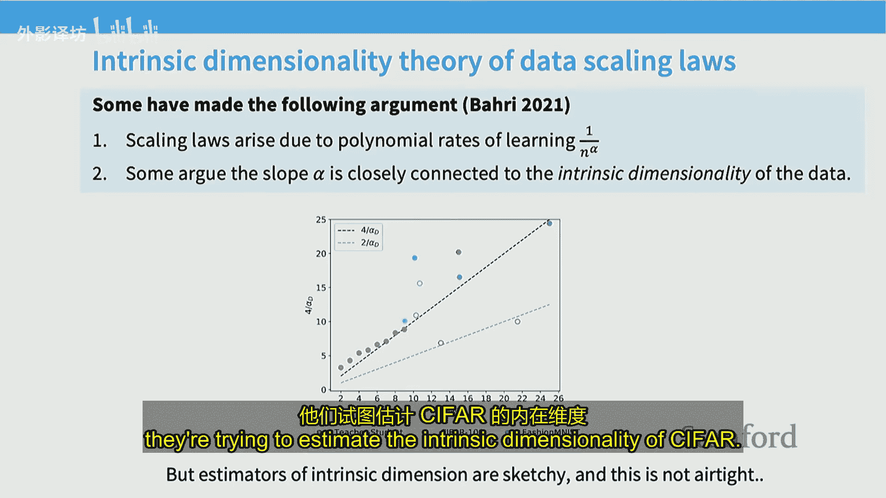

以下两个例子说明，幂律衰减是统计估计中自然出现的现象。

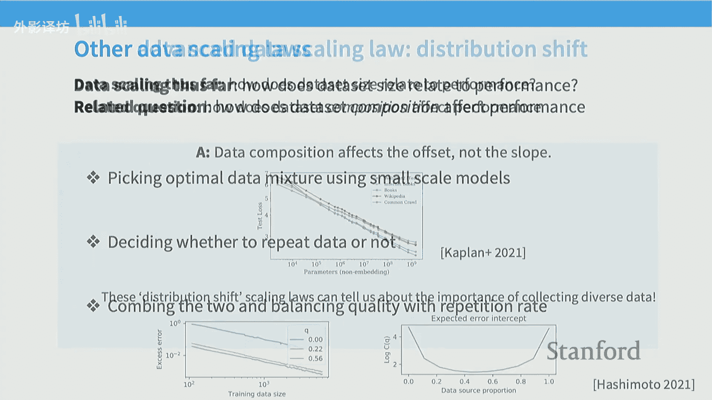

1.  **估计均值**：假设数据来自高斯分布，任务是用样本估计总体均值。估计的均方误差为 **σ²/N**。这显然是关于 N 的幂律（指数为 -1）。取对数后得到线性关系：`log(误差) = -1 * log N + 2 log σ`。

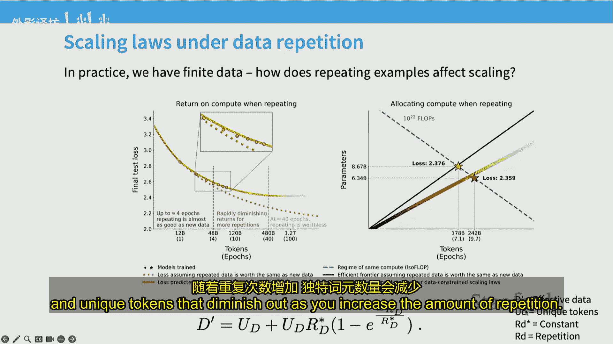

2.  **非参数回归**：考虑一个更复杂的场景——在二维单位方格中估计一个平滑的回归函数。一种简单方法是把空间划分为小格子。如果有 N 个样本，大约有 √N 个格子，每个格子约有 √N 个样本，其估计误差约为 **1/√N**。推广到 d 维空间，误差约为 **N^{-1/d}**。这解释了为什么对于复杂任务（如语言建模），我们观察到的指数 α 远小于 1（例如 0.095），因为这反映了任务内在的**高维度**复杂性。

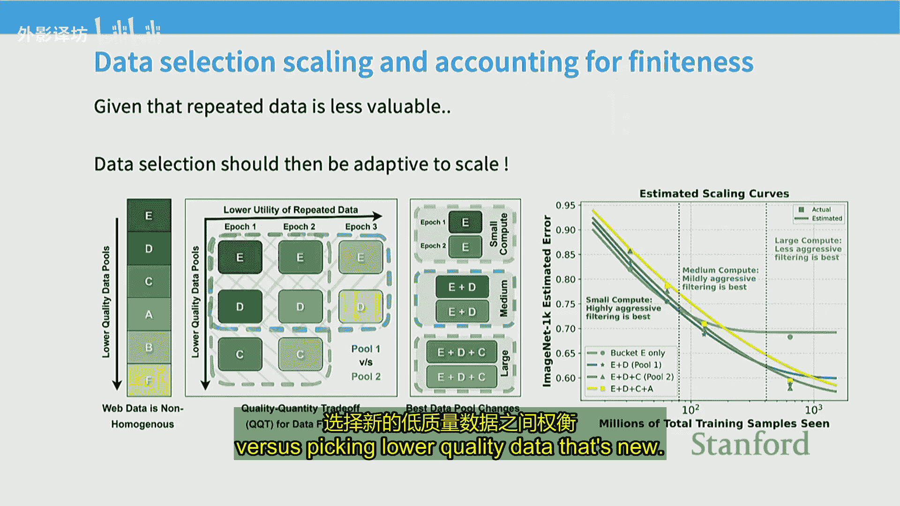

**结论**：数据缩放定律的斜率 α，在一定程度上揭示了学习任务的**内在难度或内在维度**。

### 数据缩放定律的应用

基于数据缩放定律的可预测性，我们可以进行多种工程优化：

以下是数据缩放定律的几个实际应用方向：
*   **最优数据混合**：通过在小模型上试验不同数据混合比例，观察其对损失曲线（主要是截距）的影响，可以预测该混合在大规模时的效果，从而找到最优数据配方。
*   **数据重复使用分析**：研究重复使用数据（多轮训练）的收益递减规律。缩放定律可以修改为包含“有效数据量”的概念，帮助决定何时需要新数据而非重复旧数据。
*   **数据选择**：在资源有限时，无需在大模型上测试所有数据，可以在小模型上利用缩放定律外推，筛选出高质量数据。

---

## 模型缩放定律与架构选择 🤖

上一节我们介绍了数据如何影响性能。本节中我们来看看，**模型规模**（参数量）和**模型架构**本身如何缩放，以及如何利用这种关系做选择。

### 核心方法：比较缩放曲线

对于任何想要测试的架构或超参数（例如：Transformer vs LSTM, Adam vs SGD， 不同的深度/宽度比），我们可以：
1.  在**多个不同计算规模**（从小型到中型）上训练该配置的模型。
2.  在双对数图上绘制**计算量 FLOPs** 与**测试损失**的关系。
3.  观察其缩放曲线（斜率）以及与基线（如标准Transformer）的**垂直偏移**。

**分析**：
*   **斜率**：如果两条曲线**斜率相同**，说明它们**缩放效率一致**。扩大规模时，它们的相对优劣关系保持不变。
*   **截距/偏移**：曲线之间的**恒定垂直差距**，代表了一个架构相对于另一个的**恒定效率因子**。例如，如果LSTM的曲线始终比Transformer的曲线高一个固定量（在对数尺度上），意味着要达到相同性能，LSTM需要付出**恒定倍数**（如15倍）的计算成本。

### 应用实例

以下是利用模型缩放定律进行分析的具体案例：
*   **架构比较**：早期研究表明，Transformer的缩放曲线显著优于LSTM。近期研究也通过类似方法，验证了像**门控线性单元（GLU）** 和**混合专家（MoE）** 这样的架构，其缩放曲线与Transformer基线相当或更优，这为当前的研究方向提供了依据。
*   **优化器比较**：同样，可以通过缩放曲线比较Adam和SGD等优化器，发现它们之间存在恒定的计算效率差距。
*   **超参数选择（如深度与宽度）**：通过在不同模型规模下绘制“损失 vs. 宽高比”曲线，可以发现一个宽高比的**稳定区间**。在这个区间内，不同规模模型的最优值相近，这意味着我们可以从小规模实验中确定一个适用于大规模模型的稳健超参数。

**重要提示**：进行参数缩放分析时，通常使用**非嵌入参数**。嵌入参数的行为不同，将其计入会扭曲缩放曲线的形状。

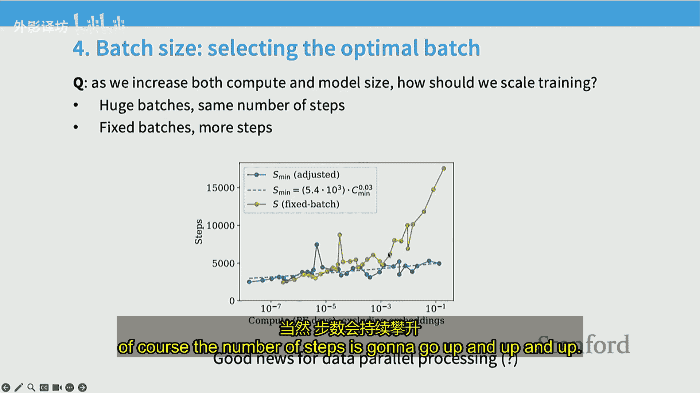

---

## 批量大小与学习率的缩放 🔧

当我们扩大模型规模时，**批量大小**和**学习率**是需要特别调整的两个超参数。缩放定律帮助我们理解如何协调它们。

### 批量大小的缩放

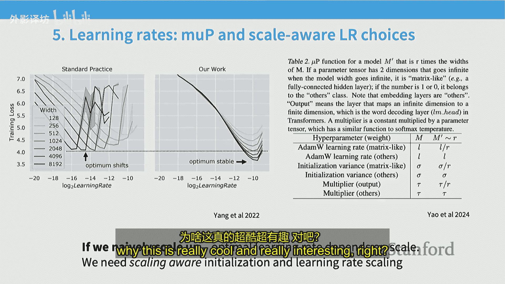

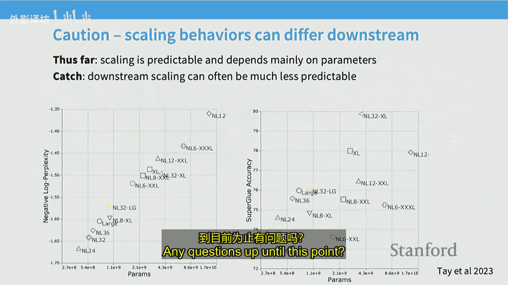

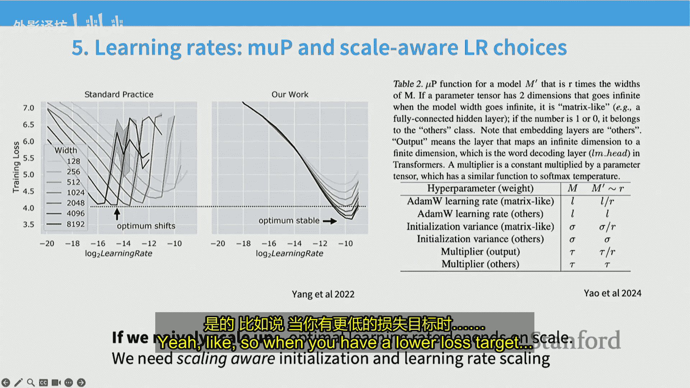

批量大小存在一个**临界点**（临界批量大小）。在临界点之前，增大批量大小几乎能带来线性的加速收益（因为相当于并行进行了更多梯度步骤）。超过临界点后，收益急剧递减。

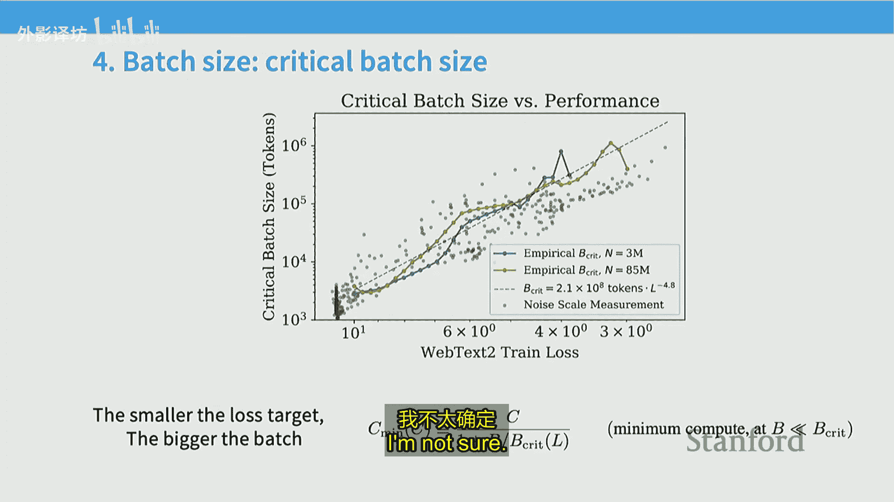

关键发现是，**临界批量大小与目标损失有关**。当训练后期损失目标更小时，需要更精确的梯度，因此**临界批量大小会增大**。这解释了为什么在实际训练（如LLaMA）中，我们经常看到训练中后期**动态增加批量大小**的策略。

通过缩放定律分析，我们可以预测对于给定的计算预算，最优的批量大小是多少，从而在系统并行效率与优化效果之间取得平衡。

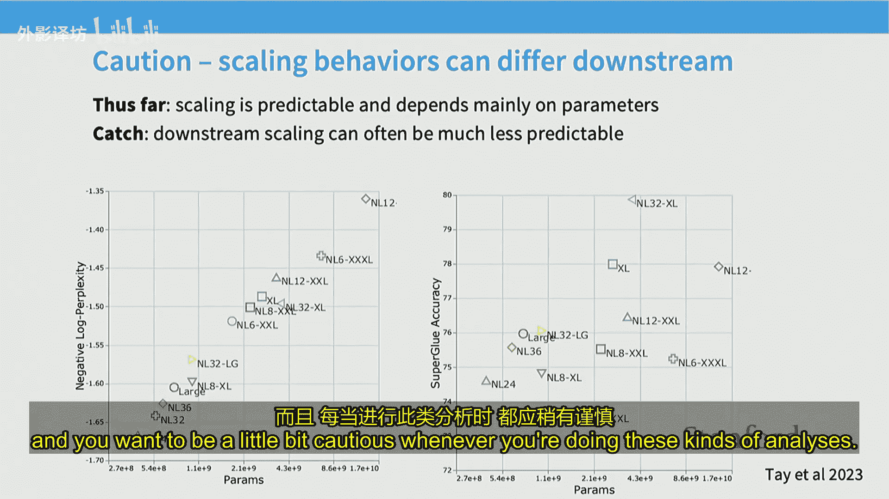

### 学习率的缩放

对于标准Transformer，**最优学习率随模型宽度增加而减小**。经验上，学习率应与宽度的某个负幂次成比例（例如 ~1/宽度）。

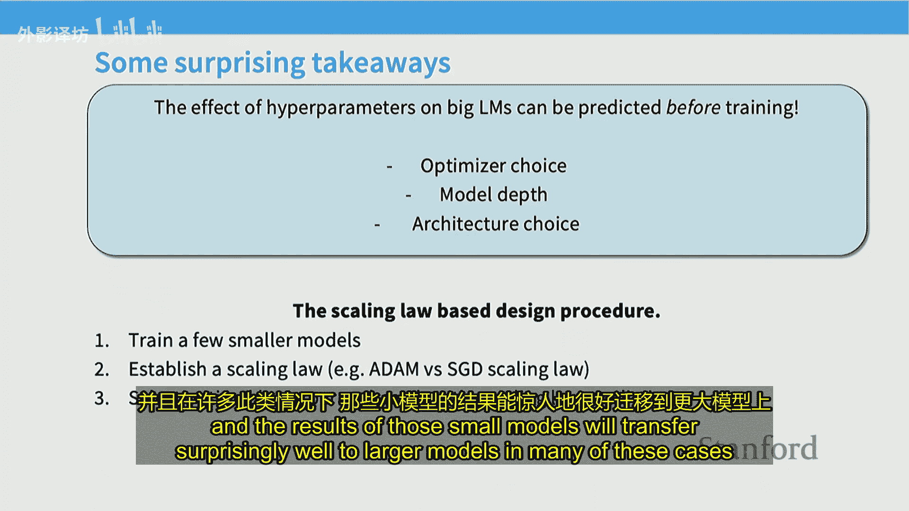

更先进的方法是**重新参数化**模型，例如使用**μP（Maximal Update Parametrization）**。通过对初始化和前向传播进行与宽度相关的缩放，可以使最优学习率在不同规模的模型间保持稳定。这意味着，我们只需在最小的模型上调整一次学习率，就可以直接将其应用到巨大型号上，而无需复杂的预测。

---

## 联合缩放定律：数据、模型与计算的权衡 ⚖️

到目前为止，我们分别讨论了数据和模型的缩放。但最核心的工程问题是：**给定固定的计算预算（总FLOPs），我们应该用来训练一个更大的模型，还是用于收集/训练更多数据？**

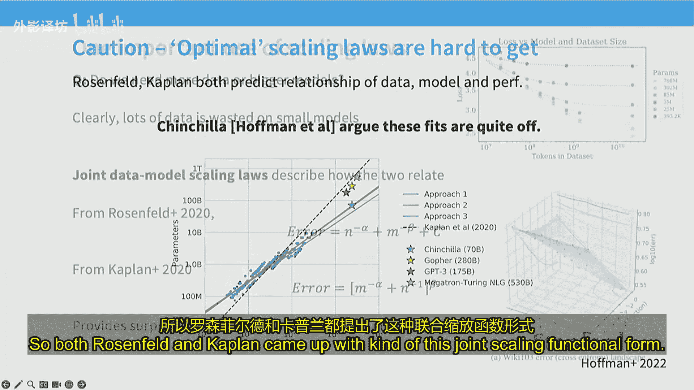

这就是**联合缩放定律**要解决的问题。

### 联合缩放公式

研究者（如Rosenfeld, Kaplan）提出了同时包含数据量 `N` 和参数量 `P` 的损失公式。一个典型形式是：
`L(N, P) = (A / N^α) + (B / P^β) + L∞`
其中 `A, B, α, β` 是常数，`L∞` 是不可约误差。这个公式在实证中拟合得非常好。

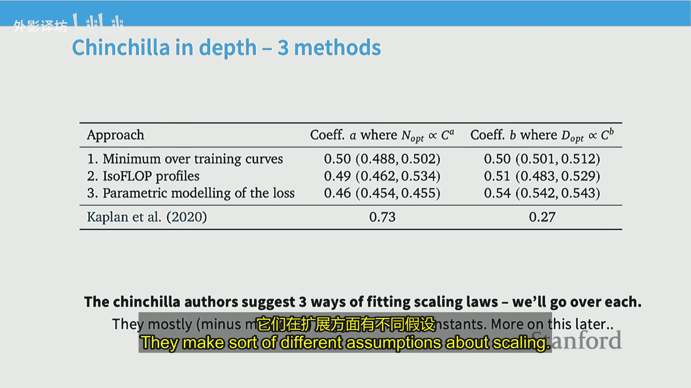

### Chinchilla 分析：寻找最优配比

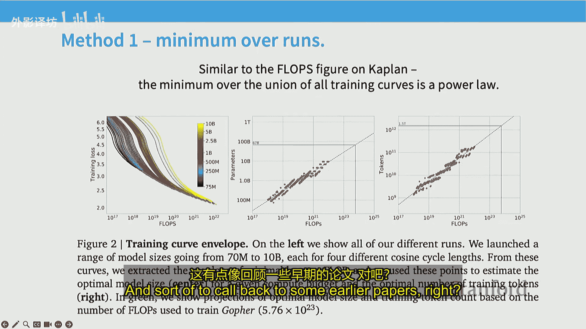

DeepMind的**Chinchilla**论文是联合缩放定律的经典应用。它旨在为给定的计算预算 `C`（总FLOPs）找到最优的参数量 `P` 和数据量（令牌数） `D`。因为 `C ≈ 6 * P * D`（训练一个Transformer的近似计算量）。

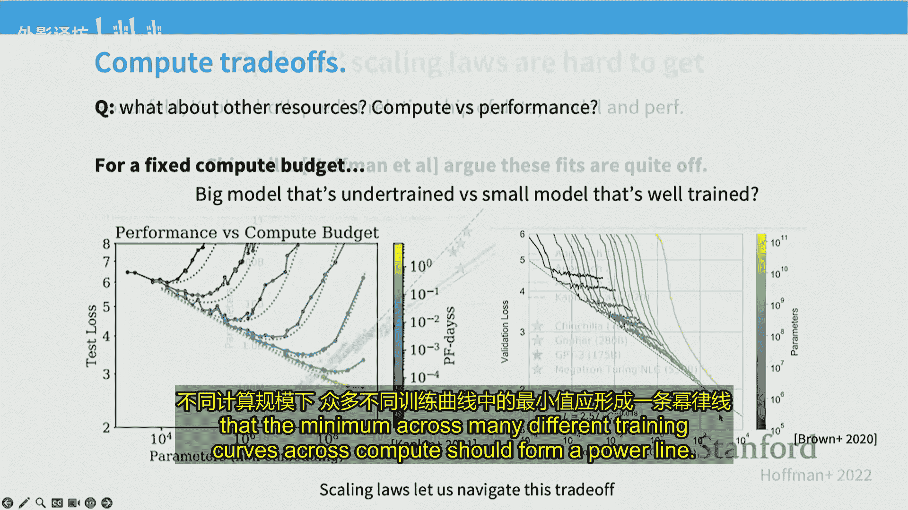

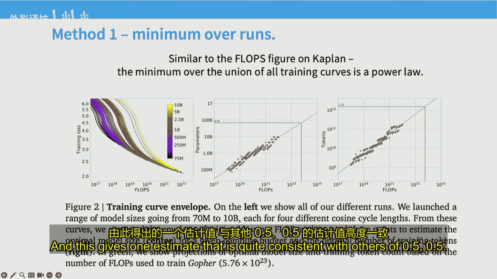

他们采用了三种方法：
1.  **最小包络法**：绘制不同 `(P, D)` 组合在训练过程中的损失曲线，取所有计算预算下的最低损失点，发现这些最优点形成一条幂律线，从中推导出最优 `P` 和 `D`。
2.  **异构FLOPs分析法（最常用）**：固定几个总计算预算 `C`，对于每个 `C`，训练不同 `P`（对应不同 `D`）的模型，得到一条 `损失 vs. 参数量` 的曲线。取每条曲线的最低点，这些最优点也遵循缩放规律，从而得到最优的 `P(C)` 和 `D(C)`。
3.  **函数拟合法**：直接使用联合缩放公式拟合大量 `(N, P, L)` 数据点，从拟合出的曲面中推导最优解。

**结论**：三种方法最终都指向相似的结论，即对于训练计算最优的大语言模型，**每个参数大约需要20个令牌**（例如，一个700亿参数的模型，应在约1.4万亿令牌上训练）。这比早期工作（如GPT-3每个参数约2个令牌）的数据效率高得多。

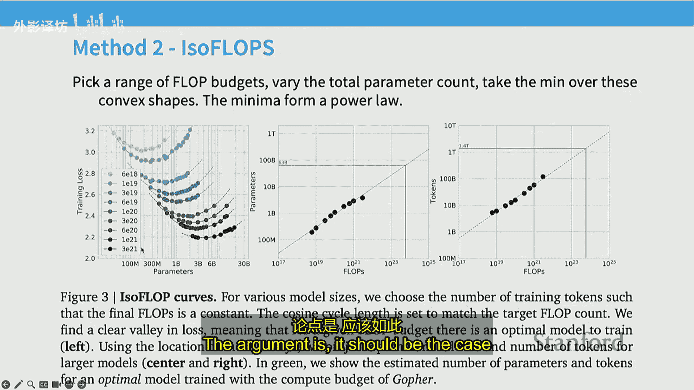

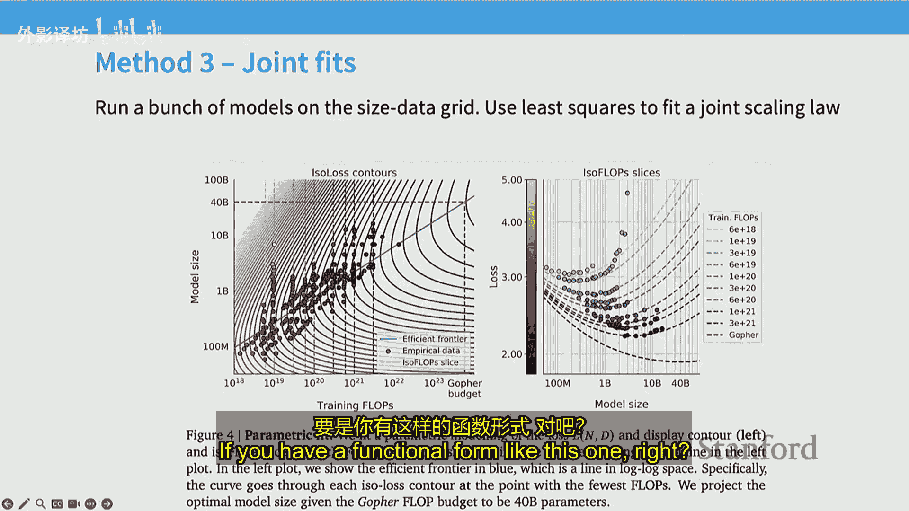

**后续发展**：随着业界更关注**推理成本**，趋势是进一步增加“令牌数/参数量”的比例，用更多的前期训练计算换取更小、更高效的最终模型，以降低部署成本。最新的模型已在每个参数使用远超20个令牌的数据进行训练。

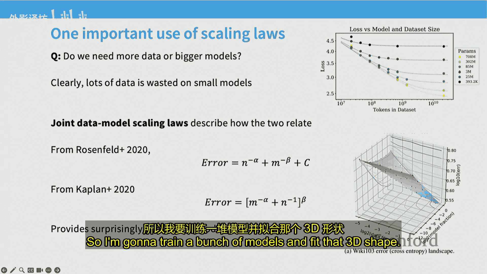

---

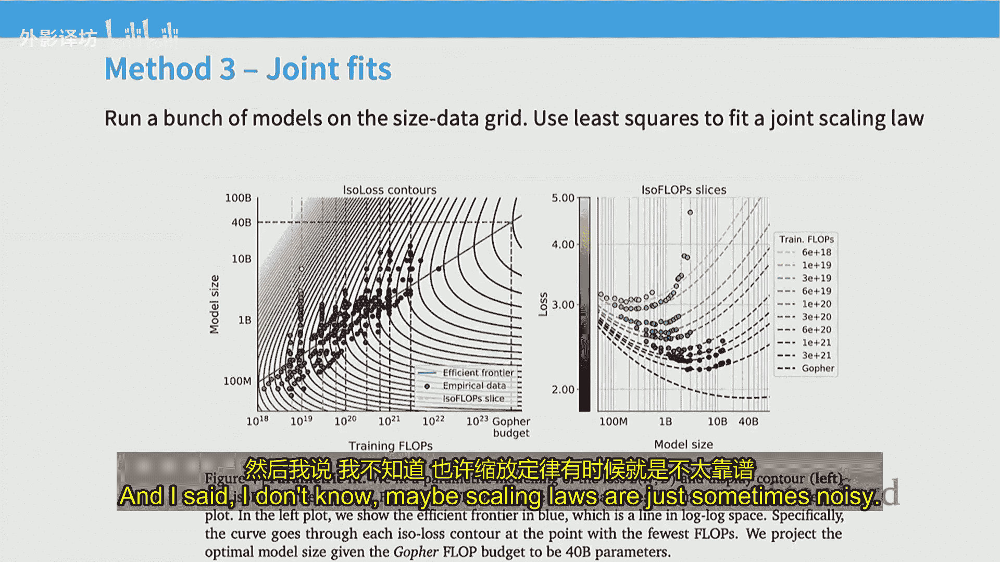

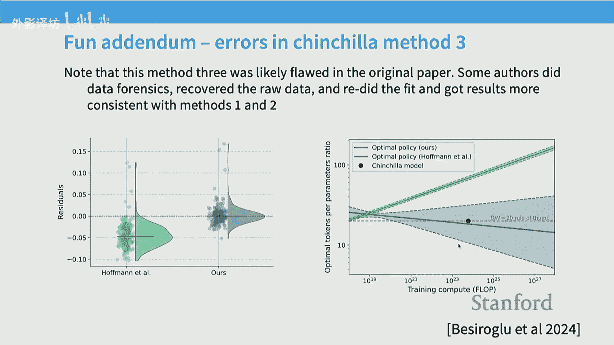

## 注意事项与总结 ⚠️

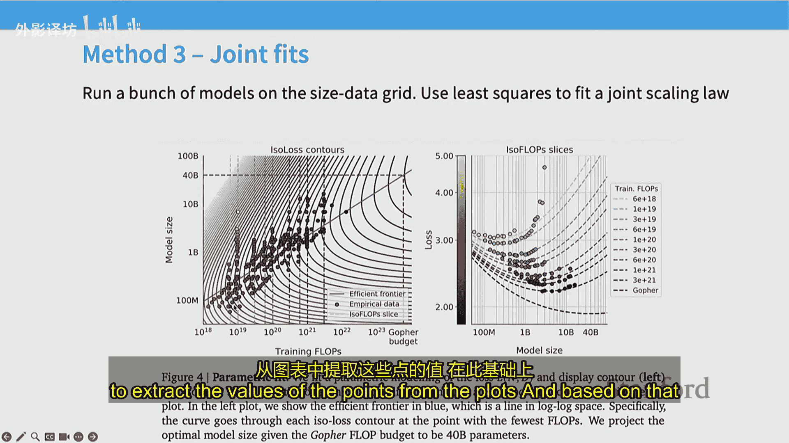

### 重要注意事项

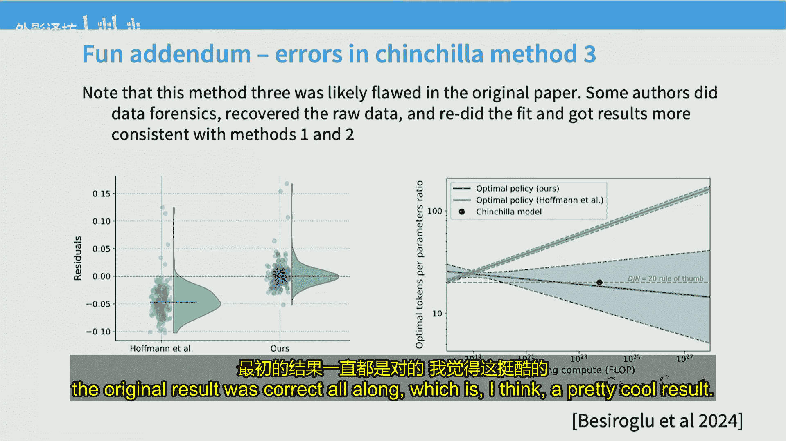

1.  **损失 vs. 下游任务**：缩放定律在预测**训练损失（困惑度）** 方面非常可靠。然而，**下游任务的能力**（如问答、代码生成）的缩放规律可能不那么平滑和可预测，可能会出现“涌现”现象或不同的趋势。切勿将两者混淆。
2.  **适用范围**：缩放定律通常在模型处于“**幂律区**”（即未达到数据或模型容量饱和的区域）时表现良好。需要避免进入“高原区”。

### 本节课总结

在本节课中，我们一起学习了缩放定律的核心思想与应用：

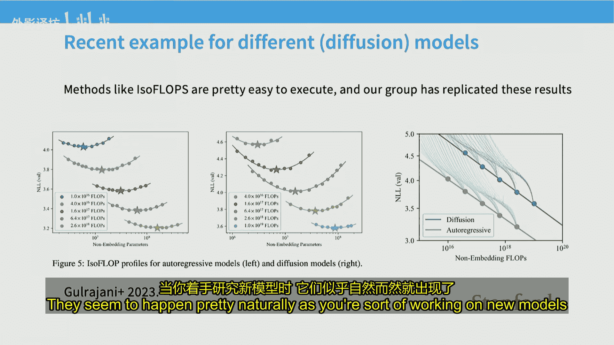

*   **动机**：缩放定律允许我们通过训练一系列小模型，来预测大模型的行为，从而指导昂贵的训练决策。
*   **数据缩放**：测试损失与训练数据量在双对数图上呈线性关系（幂律）。这源于统计估计理论，其斜率反映了任务的内在难度。
*   **模型与架构缩放**：通过比较不同配置（架构、优化器、超参数）的缩放曲线，我们可以基于它们在**小规模下的相对效率和缩放斜率**，选择那些能**高效扩展到大规模**的方案。
*   **批量大小与学习率**：扩大规模时，需要协调调整批量大小和学习率。μP等重参数化方法可以稳定学习率。
*   **联合缩放（Chinchilla）**：对于固定计算预算，存在数据量和模型大小的最优配比，经典结论是“**每个参数20个令牌**”。这优化了从训练计算到模型性能的转换效率。

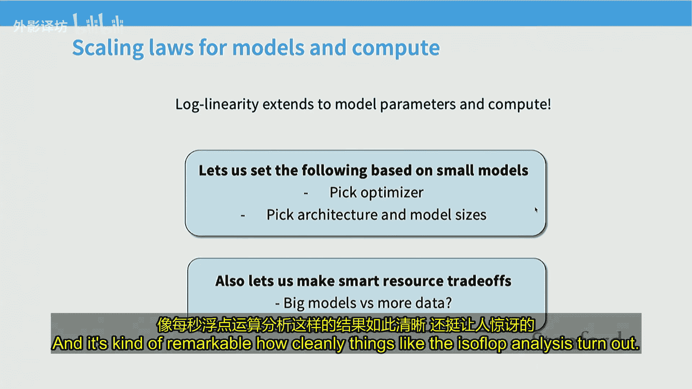

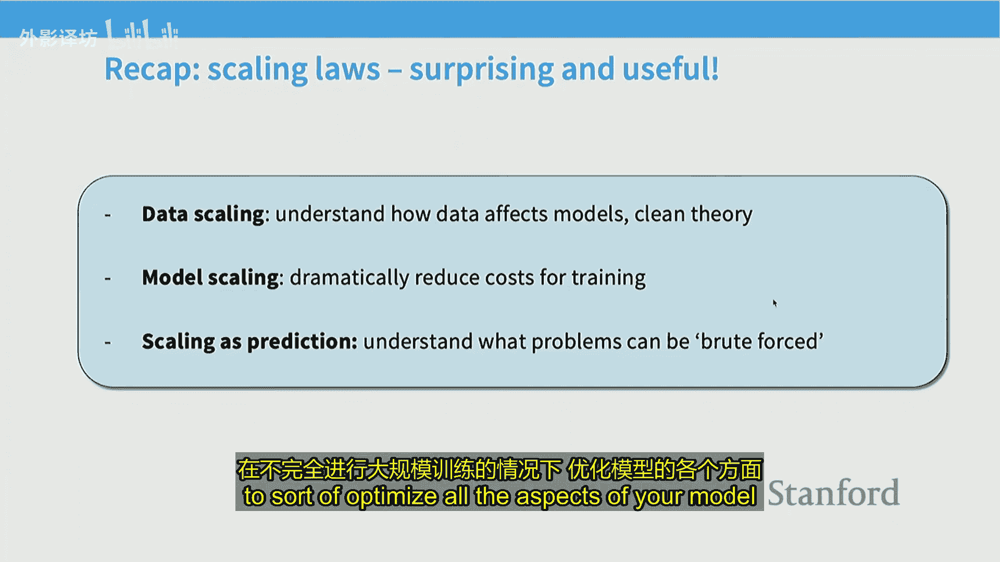

掌握缩放定律，意味着你掌握了在构建大型语言模型时，进行科学规划和资源分配的强大工具。