# 13：数据1 🗂️

在本节课中，我们将要学习构建大型语言模型（如ChatGPT）时至关重要的一个环节：**数据**。我们将探讨数据的来源、筛选方法、处理流程以及相关的法律与伦理问题。理解数据是理解现代语言模型如何工作的关键。

---

## 概述

在之前的讲座中，我们讨论了如何根据固定数据集来训练模型，涵盖了架构、优化器、标记化、缩放法则和并行性。本节课，我们将焦点转向数据本身：**用什么数据来训练模型**。数据是决定模型准确性和能力的最重要因素之一。

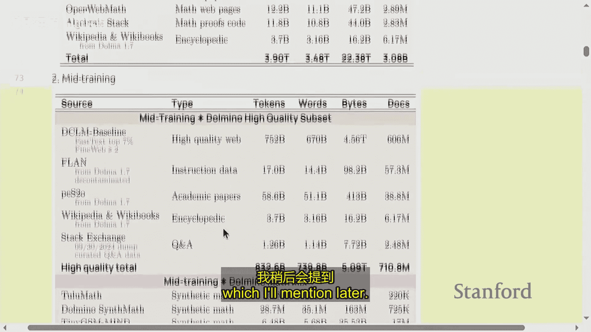

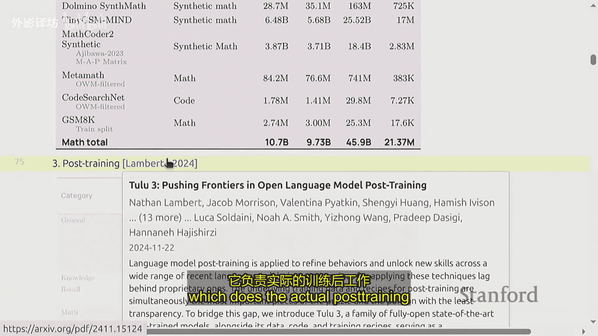

---

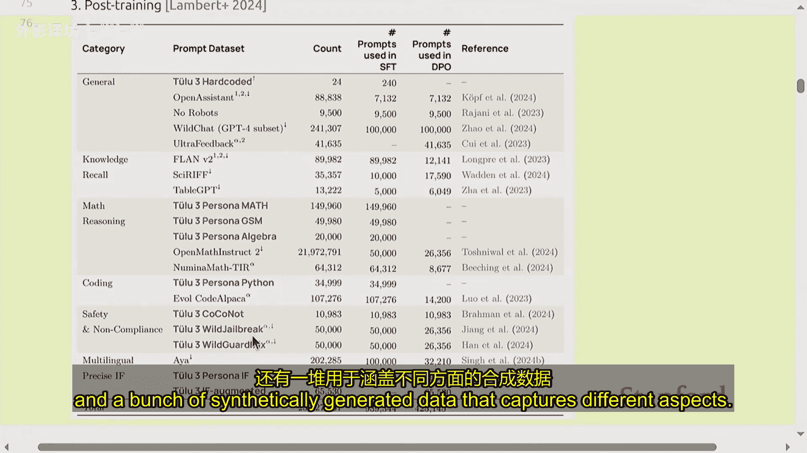

## 数据的重要性与保密性

我认为要让语言模型准确，数据是最重要的。虽然有人可能认为缩放定律最为重要，但我的依据是观察公司在论文中实际透露的信息。

如果你看看所有的开放权重模型，例如 Llama 3 乃至 DeepSeek，它们都完整披露了自身架构，并在论文中大量谈及了训练过程，但基本没提数据。例如，Llama 3 的论文包含诸多方面的详细信息，但关于数据，他们只是宏观地谈及了数据过滤方式，具体信息并不多。

这种保密是有原因的。一是竞争因素，二是他们不想引发法律诉讼。在基础模型出现之前，数据的重要性就已得到明确认可，因为推动监督学习需要对数据进行标注。如今即便所需标注减少，数据工作仍不可或缺，且涉及大量数据整理与清理工作。

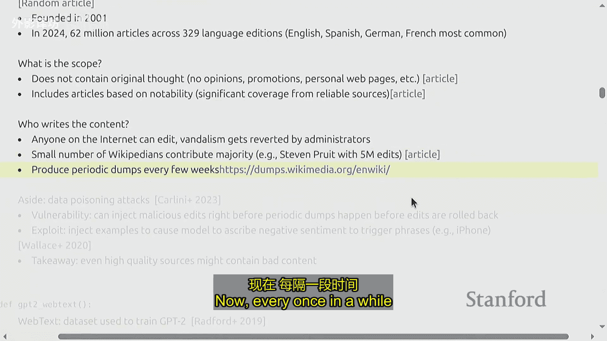

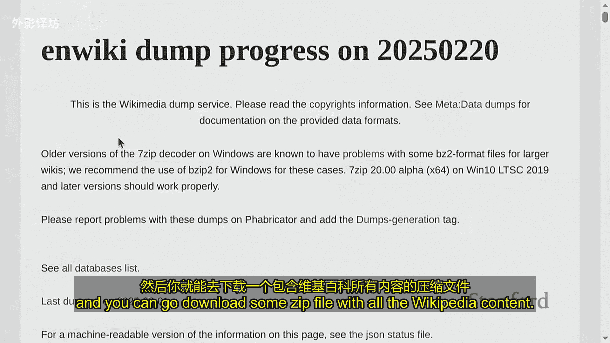

数据是一个长尾问题。人们如此重视它的原因在于它实际上扩展性很强。如果你想构建一个能处理各类不同任务的模型，你可以轻松雇几百人组成团队，负责数据的不同方面，如多语言和代码处理。如果是多模态模型，你还能处理图像等数据。相比之下，架构通常由一个小团队来定义。

---

## 训练阶段与数据流程

语言模型的开发通常包含多个训练阶段，每个阶段使用不同类型和质量的数据。

1.  **预训练**：这是本课程大部分内容的重点。使用通常来自网络的原始数据进行训练。
2.  **中期训练**：在这一阶段，需要挑选出一小批高质量的数据文档，目标是培养特定能力，如数学、代码或长文本语境理解。
3.  **训练后阶段**：此时会在遵循指令的数据或聊天数据上进行微调，或者进行强化学习，让模型能真正对话。通常，向安全对齐的内容也在这个阶段处理。

实际上，这些阶段的界限很模糊。在最近的模型中，常常有更多阶段。但基本思路是清晰的：**从大量低质量数据入手，最后使用少量高质量数据进行训练**。

一些术语：
*   **基础模型**：一般指的是预训练和中期训练后得到的检查点。
*   **结构化模型**：是在后期训练（微调等）完成后得到的模型。

---

## 数据来源与处理实例

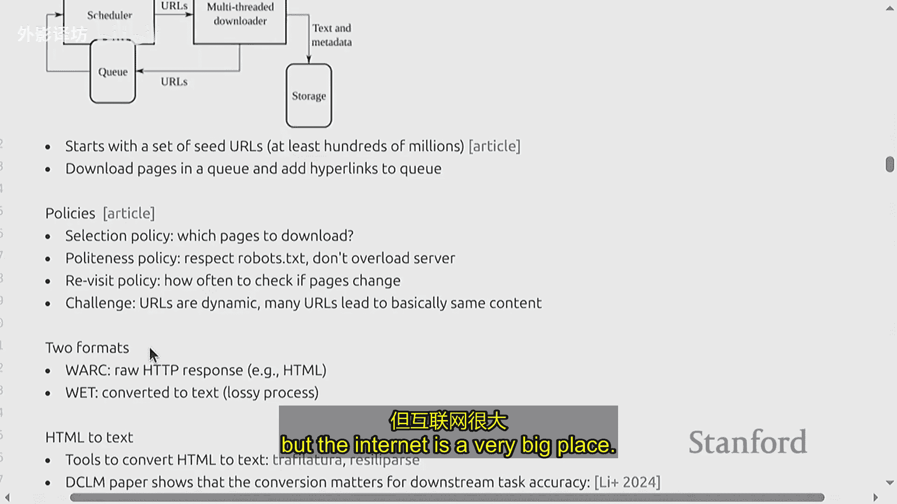

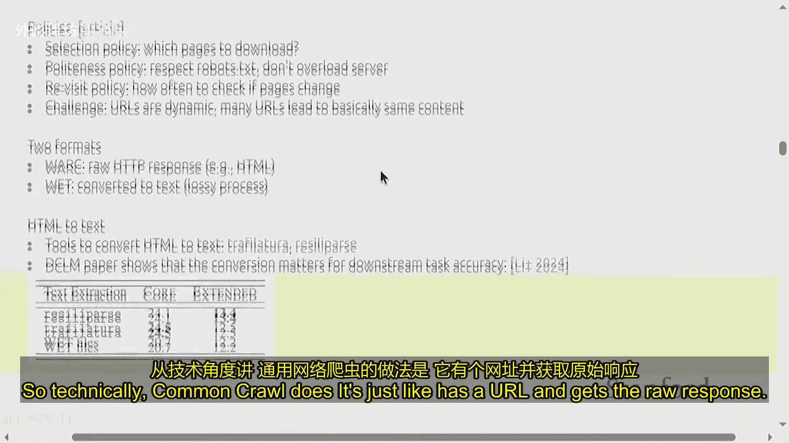

让我们通过一个开源模型的例子，看看数据集的具体内容。这个例子来自 AI2 发布的一系列开源模型。

**预训练数据组合**（典型的开源模型配置）：
*   来自名为 `Dolma` 的网页数据（一个大型网络语料库）。
*   代码。
*   学术论文。
*   数学数据。
*   维基百科。
总计约有 3.9 万亿个词元（Token）。

**中期训练阶段**：
你会看到实际上有一堆相同的来源，但它们被进一步筛选了。例如，从 3.7 万亿个词元中筛选出 7000 亿个高质量词元。这个阶段还包括：
*   一些 `FLAN` 数据集（指令微调数据集）。
*   维基百科（我们一直很喜欢维基百科）。
*   一些新的合成生成的数据集，例如 GSM8K 数学训练集。
总计大约有 1000 亿个训练词元。

**训练后工作**：
有一篇名为 `Tulu` 的独立论文负责实际的训练后工作。这里展示的是各类数据组合，基本上有来自不同来源的聊天数据，还有一堆用于涵盖不同方面的合成数据。

---

## 如何选取和处理数据？

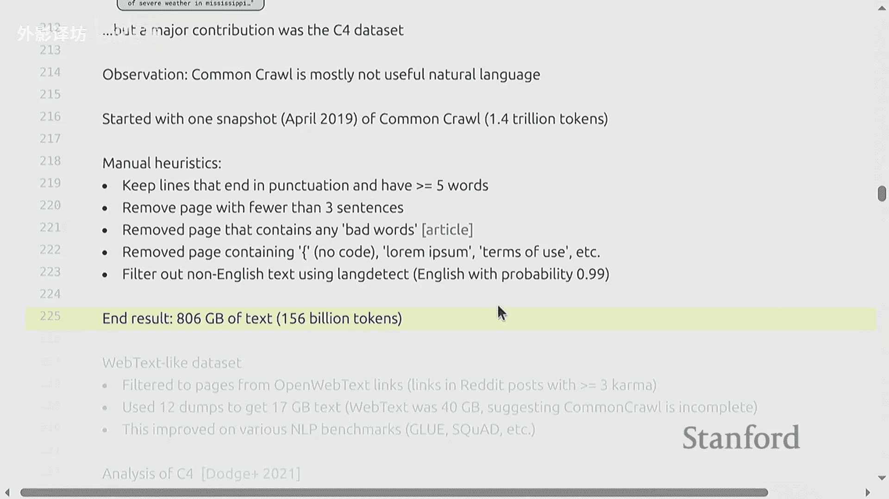

为了不让你日后失望，需要说明的是：**并没有一个完美的、形式化的原则来决定如何选取和处理所有数据**。鉴于这门课的性质，这或许并不令人意外。即便在架构方面，我们也没有什么像样的原则，尤其在数据方面更是如此。

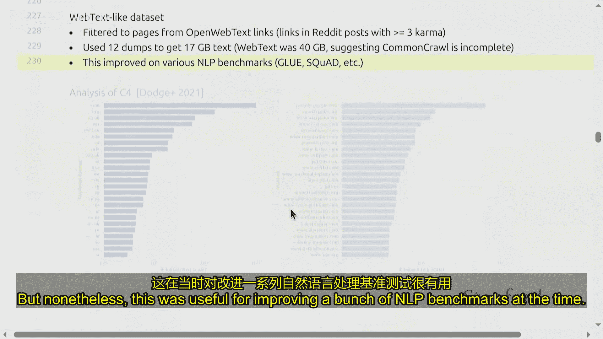

我将介绍人们长期以来使用的各种数据集、它们的来源和一些特性。希望你们能发挥归纳能力，来找出什么样的数据是好的、什么样的数据不行的一些直观感受。

我先从预训练说起，接着再讲讲训练中期和后期的情况，不过大部分内容还是围绕预训练。

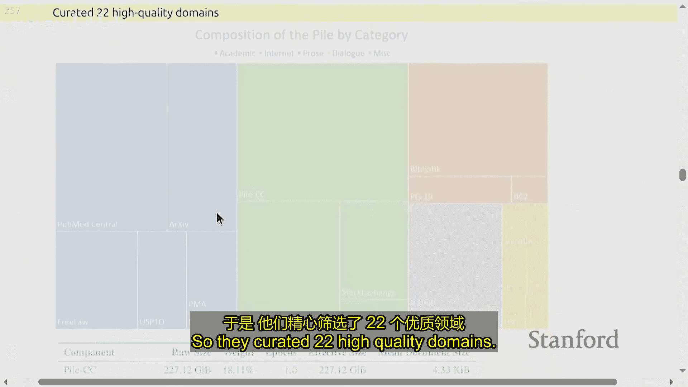

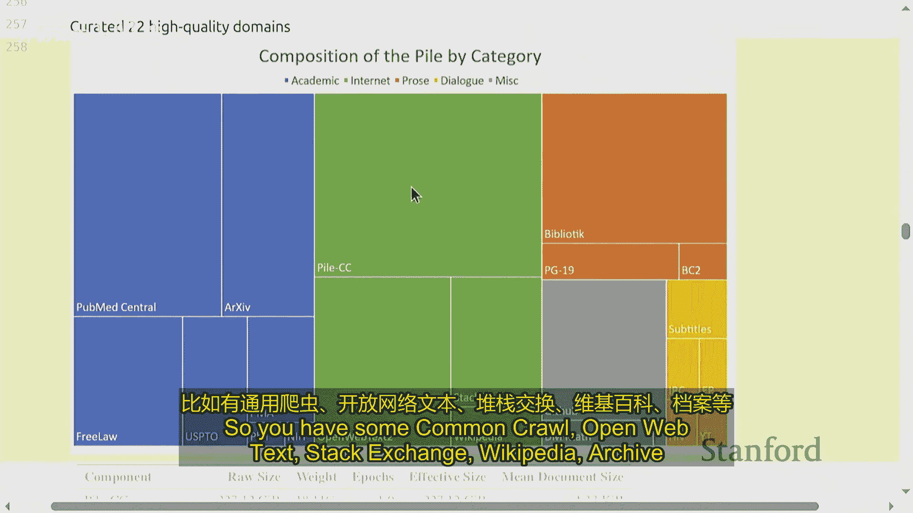

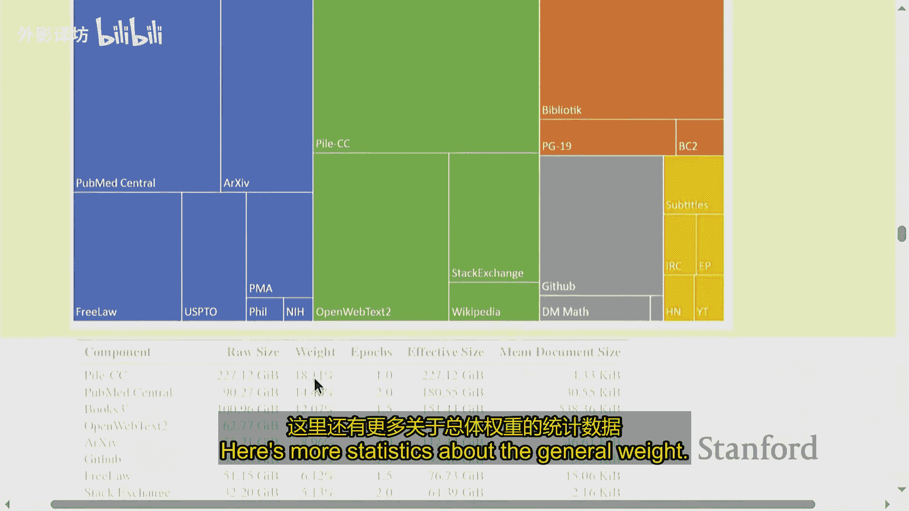

---

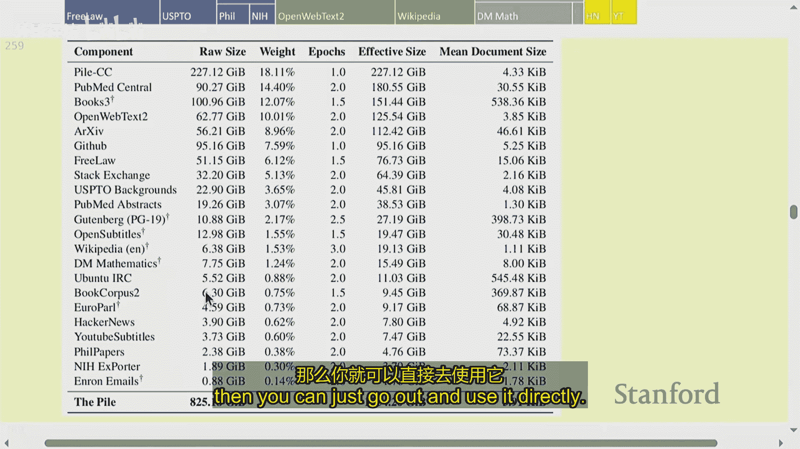

## 预训练数据的历史演变

### 2018年：BERT 与早期数据

我们从2018年的 BERT 模型开始。BERT 是基于书籍和维基百科训练出来的。

*   **书籍语料库**：有一个叫 `Smashwords` 的网站，允许任何人发布电子书。在2015年，一篇论文抓取了该网站的数据，创建了一个由免费的自出版书籍构成的语料库（约7000本书）。此后它因违反服务条款被撤下。这体现了书籍数据的重要性。
*   **维基百科**：一个人人皆知的免费百科全书。它不包含原创观点，所有内容都引用自原始资料，并且基于知名度（必须有多个来源提及）。维基百科有很多有价值的内容，但也有一些领域它不覆盖，比如个人观点、食谱等。维基百科定期生成包含所有内容的备份文件（转储文件），可供下载。

**关于数据的一个关键问题：数据中毒**
攻击者可以在维基百科定期转储之前注入恶意编辑，使这些内容进入训练数据，即便之后编辑被回滚。这可能导致模型学习到有害的关联（例如，将负面情绪与特定品牌关联）。这说明了来自互联网的开放数据可能被操纵，从而影响模型行为。

BERT 是根据书籍和维基百科训练的。那时人们对语言模型的数据重复问题没那么关注。

---

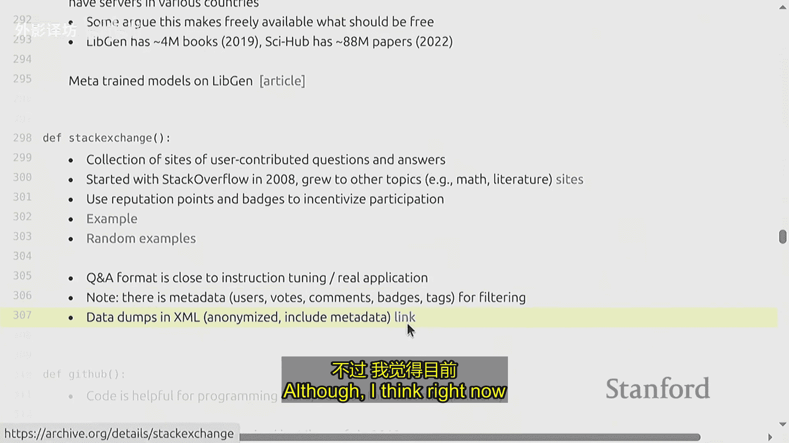

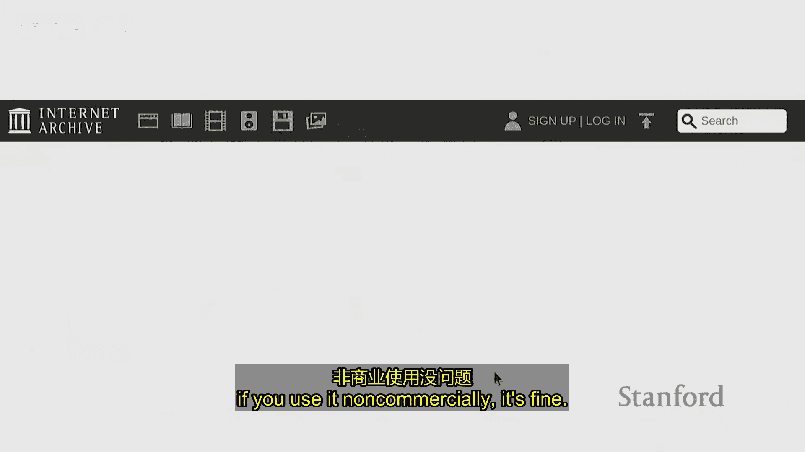

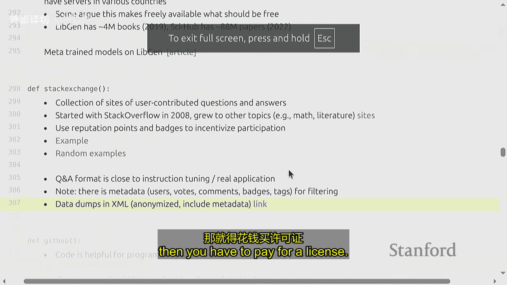

### 2019年：GPT-2 与网络文本筛选

GPT-2 收集了一个名为 `WebText` 的数据集。思路是：网络规模大但质量可能不高，如何快速获取一个多样且高质量的子集？

他们的方法是：选取那些在社交媒体（如Reddit）上获得超过一定“积分”（如3个赞）的帖子中的外链网页。这产生了800万个页面，40GB的文本。他们没有发布这个数据集，但此后出现了公开复制版，称为 `OpenWebText`。

---

### 通用网络爬虫 (Common Crawl)

我希望到这结束的时候，每当有人跟你说“语言模型是通过互联网训练的”，你可以指出并讲那是错的。更准确的说法是：**通过通用网络爬虫等特定来源的、经过大量筛选和处理的数据**。

*   **是什么**：`Common Crawl` 是一个非营利组织，自2007年起每月进行网页抓取，已持续约17年。抓取本身成本不高，可以在云服务上运行机器在两周内完成。
*   **如何工作**：它使用一组种子网址（数亿个），通过广度优先搜索的方式进行爬取。它必须遵守 `robots.txt` 协议（网站声明是否允许爬虫访问的文件），并避免使服务器过载。
*   **数据格式**：爬虫生成两种格式：
    1.  `WARC` 文件：原始 HTTP 响应。
    2.  `WET` 文件：将 HTML 转换为纯文本后的格式（这是一个有损过程）。
*   **注意点**：转换工具（HTML 转文本）对数据质量有显著影响。一篇论文发现，使用不同转换器，模型性能差异可达4个百分点。
*   **覆盖率**：它并非旨在全面爬取整个互联网，政策上要求“温和礼貌”。例如，并非所有维基百科文章都在其中。
*   **内容**：默认情况下包含大量内容，包括可能有害或冒犯性的材料，以及受版权保护的材料。

**关于 `robots.txt`**
网站可以通过 `robots.txt` 文件声明禁止哪些爬虫访问。例如，纽约时报禁止谷歌爬虫访问其大部分内容。但遵守 `robots.txt` 只是行业规范，并非法律强制。

---

### 早期数据筛选方法

由于直接从 Common Crawl 随机抽样的数据质量很低，人们开始尝试筛选。

**1. CCNet (Meta)**
*   **目标**：创建一个处理 Common Crawl 的通用程序，返回高质量、多语言数据集。
*   **方法**：
    *   去重。
    *   语言识别（保留目标语言）。
    *   **关键**：基于质量的筛选。他们训练一个**n-gram语言模型**（例如五元语法模型）在维基百科文本上，然后用它给 Common Crawl 中的文档评分。思路是：维基百科是高质量的替身，寻找类似维基百科的文档。
*   **效果**：用此数据训练的模型比仅用维基百科训练的表现更好。

**2. C4 (Google)**
*   代表“Colossal Clean Crawled Corpus”。与 T5 模型一同发布。
*   **方法**：完全基于**启发式规则**进行筛选。
    *   保留以标点结尾的行。
    *   删除少于三句话的页面。
    *   删除包含脏话的页面。
    *   删除包含花括号 `{}` 的页面（这会删除大量代码）。
    *   删除样板文本（如菜单、页脚）。
    *   仅保留英文。
*   **与 CCNet 对比**：CCNet 使用基于模型的过滤（像维基百科），C4 使用基于规则的过滤。两者是互补的：基于模型的方法可能遗漏格式正确但不像维基百科的句子；基于规则的方法可能放过结构完整但质量低下的句子。

---

### GPT-3 时代及之后的数据集

**GPT-3 数据集**
包含经过处理的 Common Crawl、WebText、两个书籍语料库和维基百科，总计约4000亿个词元。
*   **核心处理**：他们训练了一个**质量分类器**，用于从海量数据中区分出“高质量”内容（以 WebText、维基百科和书籍作为正例）。目标是找出更多类似的高质量内容。

**The Pile (EleutherAI)**
在 GPT-3 封闭的背景下，EleutherAI 试图创建开源语言模型。`The Pile` 是一个由社区精心筛选的多样化数据集，包含22个来源，如：
*   Common Crawl
*   OpenWebText
*   Stack Exchange
*   维基百科
*   学术论文（如 PubMed）
*   代码（GitHub）
*   书籍（PG-19，来自古登堡计划）
*   甚至包含安然公司邮件（一个著名的公共数据集）。
其数据量比 GPT-3 使用的还要多。

**关于一些特定数据源的说明**
*   **古登堡计划**：提供公共领域的书籍（版权过期，约7.5万册）。`PG-19` 数据集用于长文本建模基准测试。
*   **影子图书馆**（如 LibGen）：提供大量有版权的书籍，常引发法律纠纷。据透露，Meta 曾用其训练模型。
*   **Stack Exchange**：一个问答网站集合（如 Stack Overflow）。其数据天然具有问答格式，与聊天机器人指令跟随任务相似。注意其数据转储通常只允许非商业使用。
*   **GitHub**：代码的主要来源。获取“在 GitHub 上训练”的数据需要大量预处理：克隆仓库、筛选许可证、去重等。`The Stack` 是一个处理好的开源代码数据集。

**Gopher (DeepMind) 与 MassiveText**
*   `MassiveText` 数据集涵盖大量网页（C4）、书籍、新闻、GitHub、维基百科。
*   **筛选方法**：主要使用**人工规则的质量筛选器**（例如，80%的单词必须包含字母），并利用谷歌安全搜索进行有害内容过滤。当时避免使用模型过滤是担心弱模型会引入偏见。

**LLaMA (Meta)**
*   数据集使用 Common Crawl（通过 CCNet 获取），但分类器思路不同：训练分类器判断一个页面**是否像会被维基百科引用的页面**（而不仅仅是像维基百科页面）。他们还纳入了 C4、GitHub、维基百科、古登堡计划、Stack Exchange 等。
*   总计获得1.2万亿个词元。他们没有发布数据集，但开源社区发起了 `RedPajama` 项目来重现它。

**RefinedWeb (TII)**
*   **核心论点**：也许我们把网络数据筛选得足够好，那就是所需的一切。互联网理论上包含所有内容。
*   **方法**：对 Common Crawl 使用 `trafilatura` 提取工具，应用 Gopher 的规则，**避免基于机器学习的过滤**（防偏差），并进行模糊去重。
*   获得了一个包含5万亿词元的数据集（发布了6000亿的子集）。`FineWeb` 是其后继改进版本，获得了15万亿词元。可视为一个**轻度过滤**的数据集，可作为进一步模型过滤的基础。

**Dolma (AI2) 与 OLMo 模型**
*   `Dolma` 数据集包含 Common Crawl、The Stack（代码）、C4、RedPajama、学术论文、古登堡计划、维基百科等。
*   初始的 OLMo 模型在 Dolma 上训练，未使用基于模型的过滤，仅使用语言识别、质量规则筛选、有害内容分类和去重，产出3万亿词元。

**DataComp for LM**
*   这是一项多组织合作的工作，旨在为数据集创建方法建立基准和竞赛。
*   他们处理 Common Crawl 生成 `Dolma` 池（240万亿词元），然后严格筛选到 `Dolma` 极限（仅保留1.4%）。
*   **筛选方法**：大力使用**基于模型的质量过滤**。
    *   **正例**：来自 `OpenHermes`（GPT-4生成的指令数据）和 `Dolphi`（高质量问答）数据集。这很有趣，他们用指令数据来挑选预训练数据。
    *   **反例**：从 RefinedWeb 中采样的数据。
*   训练一个快速文本分类器，将 240 万亿词元筛选到 3.8 万亿词元。结果表明，其模型比使用 RefinedWeb 的模型在基准测试上高出约3%。

**Nemotron-CC (NVIDIA)**
*   **核心论点**：Dolma 极限筛选太严格（3.8万亿词元），对于训练更大模型（如4000亿参数）不够。
*   **方法**：
    1.  选用 `just-text` 而非 `trafilatura` 进行 HTML 转文本，以保留更多词元。
    2.  使用**多种质量筛选器集成**：
        *   让一个大语言模型根据“教育价值”评分。
        *   使用 DataComp 的分类器。
        *   从每个分类区间抽样，而不仅仅是顶部，以确保多样性。
    3.  **数据改写**：
        *   对低质量数据，用语言模型改写成更高质量。
        *   对高质量数据（如维基百科），用语言模型生成任务（如问答对、总结），为指令微调做准备。
*   最终获得 6.3 万亿词元，几乎是 Dolma 极限的两倍，且基准测试表现更优。

---

## 中期与训练后数据

这部分界限模糊，目标通常是培养特定能力或进行对齐。

**长上下文扩展**
*   **目的**：使模型能处理长文本。
*   **常用数据源**：书籍（长依赖）、数学文本、合成数据。
*   **时机**：常在中期训练加入，因为如果模型能力不足，在长上下文上训练是浪费。

**指令微调与对齐数据**
目标是让模型能够遵循一次性指令。
*   **早期方法**：整合传统 NLP 任务，形成标准格式（如 `Super-NaturalInstructions`、`FLAN` 数据集）。但提示往往模板化。
*   **合成数据兴起**：以 `Alpaca` 模型为代表，使用“自我指导”让语言模型生成示例。
*   **数据来源**：
    1.  **GPT-4生成**：最简单，但可能违反服务条款。
    2.  **开源模型生成**：使用 Llama 等宽松许可的模型生成。
    3.  **人工标注**：最贵最慢，但质量高，需注意标注者可能使用 GPT-4。
*   **其他技术**：`Evol-Instruct`（使问题复杂化）、从问答网站提取等。
*   **示例数据集**：`OpenHermes`、`Lima`、`Nemotron` 训练后数据（混合了公共数据集和合成数据，包含推理链）。

---

## 版权与法律问题

**版权基础**
*   **目标**：激励创作。
*   **保护对象**：以有形形式表现的原创作品（表达，而非思想）。代码可受版权保护，算法不能。
*   **现状**：无需注册即受保护（与专利不同），有效期约75年。互联网上大多数内容都受版权保护。

**合法使用数据的途径**
1.  **获取许可**：与版权方签订合同（如谷歌与 Reddit）。`知识共享 (Creative Commons)` 许可是一种特殊的免费许可（维基百科使用此许可）。
2.  **合理使用**：即使无许可，在某些条件下也可使用。考量因素包括：
    *   使用目的（教育 vs. 商业）。
    *   作品性质（纪实 vs. 虚构）。
    *   使用部分的数量和实质性。
    *   对潜在市场的影响。
    *   语言模型训练常以“变革性使用”（提取语言模式而非复制表达）为由辩护，但存在记忆和提取训练数据的问题，使情况复杂。

**挑战**
*   即使内容属于合理使用，**违反网站服务条款**（如用脚本下载 YouTube 视频）也可能导致不合法。
*   开源模型发布数据和模型时，版权风险更高。
*   拥有专有数据（如 X/Twitter、YouTube）的公司可能有优势，但内部使用也受限制。

---

## 总结

本节课我们一起学习了构建大型语言模型所需数据的全貌：

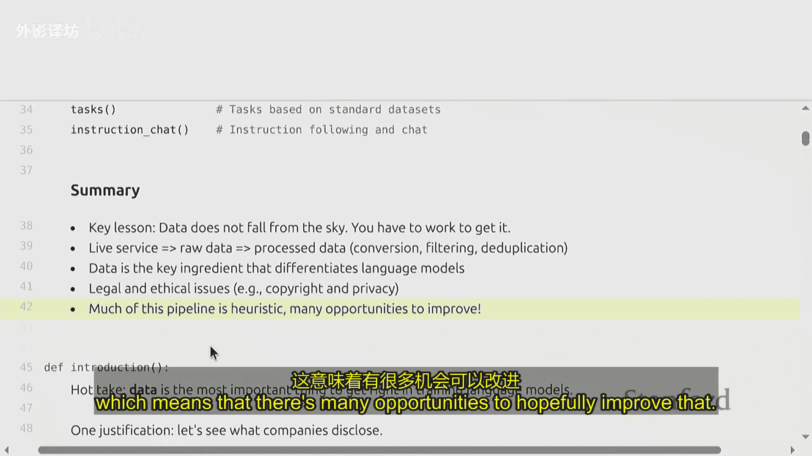

1.  **数据不会凭空而来**：需要从原始服务（如 Common Crawl、GitHub）获取，并经过大量处理（提取、过滤、去重）才能用于训练。
2.  **数据是区分模型的关键**：在架构趋同的今天，数据质量是决定模型能力的核心因素。
3.  **筛选方法多样**：从早期基于规则（C4）和简单模型（CCNet），发展到如今集成多个模型和质量维度（Nemotron-CC）的复杂方法。趋势是更多地使用模型进行筛选。
4.  **流程分阶段**：从预训练（大量、相对粗糙数据）到中期训练（高质量、针对性数据）再到训练后（指令、对齐数据），数据质量和目标逐渐细化。
5.  **面临法律与伦理挑战**：版权和合理使用是悬在数据收集之上的