# 14：数据筛选与去重算法详解 🧹📊


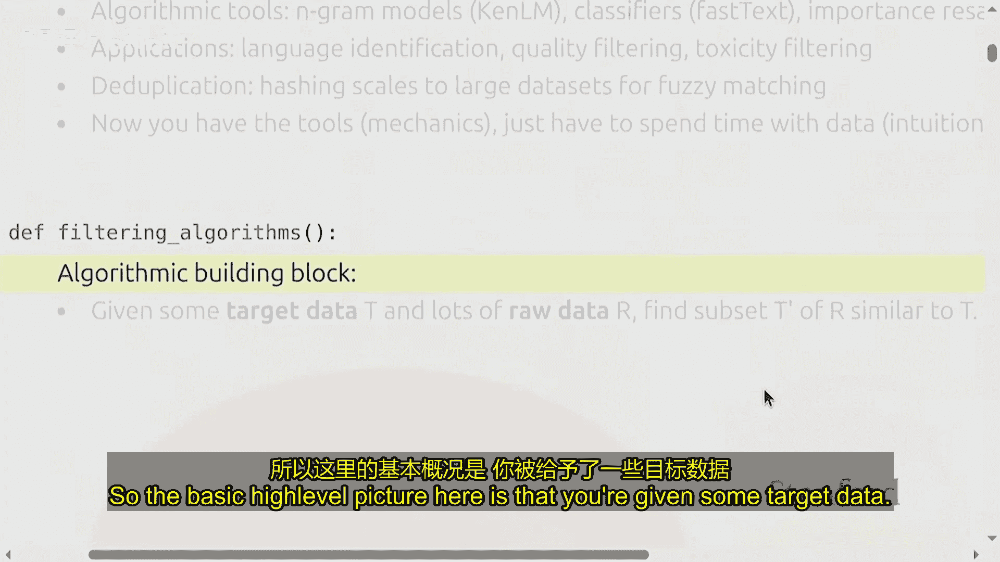

在本节课中，我们将深入学习数据处理流程中的两个核心环节：**质量筛选**与**数据去重**。上一讲我们回顾了语言模型训练所用的各类数据集。本讲将深入探讨如何从海量原始数据中，高效地筛选出高质量、低毒性的子集，并移除重复内容，以提升模型训练的效率与效果。

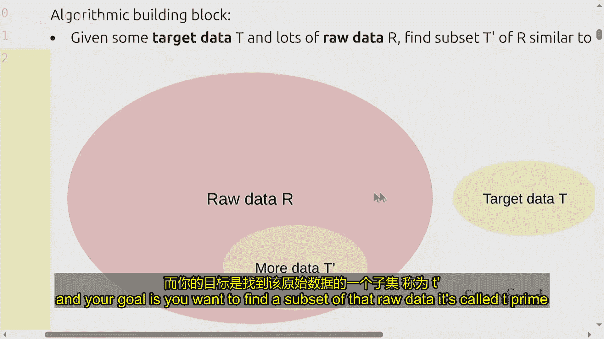

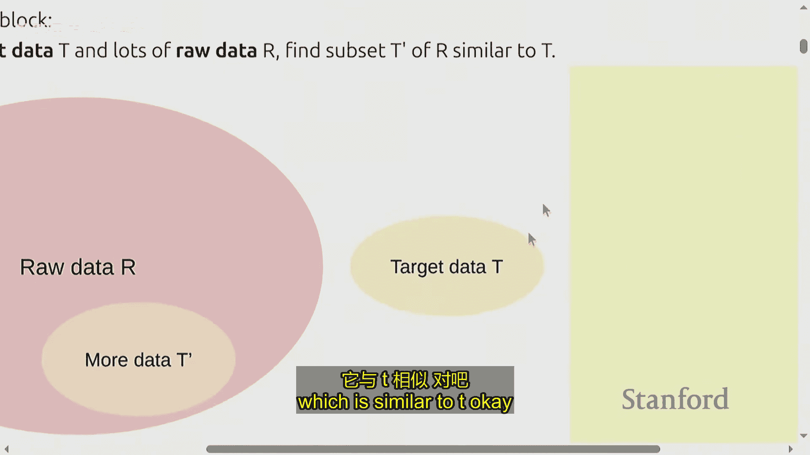

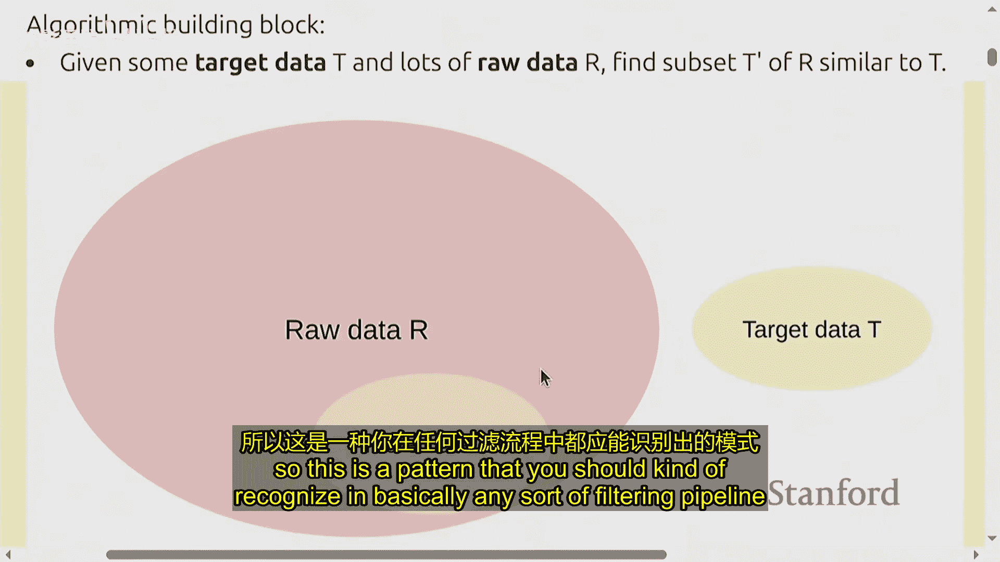

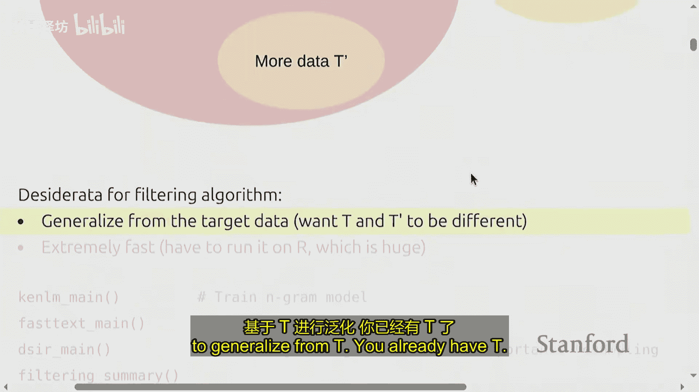

---

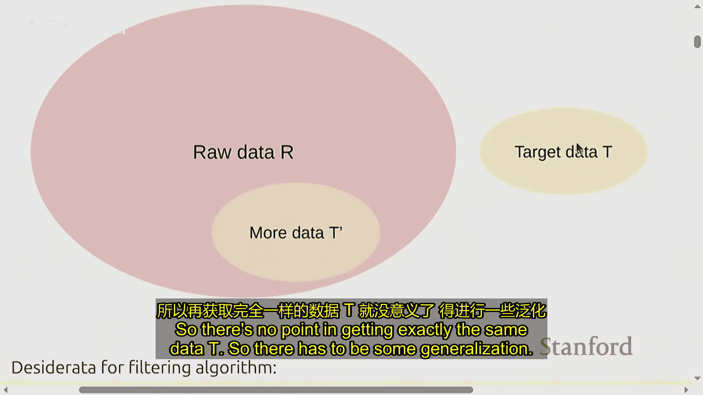

## 筛选算法概述

在数据处理中，一个常见的模式是：你拥有少量高质量的目标数据 `T` 和大量待处理的原始数据 `R`。我们的目标是找到 `R` 的一个子集，该子集在分布上与 `T` 相似。


对筛选算法有两个核心要求：
1.  **泛化能力**：算法应能基于 `T` 进行泛化，而非简单匹配 `T` 本身。
2.  **高效快速**：算法需能在整个网络规模的数据上高效运行，计算成本应远低于直接训练模型。

我们将介绍三种实现此目标的方法。

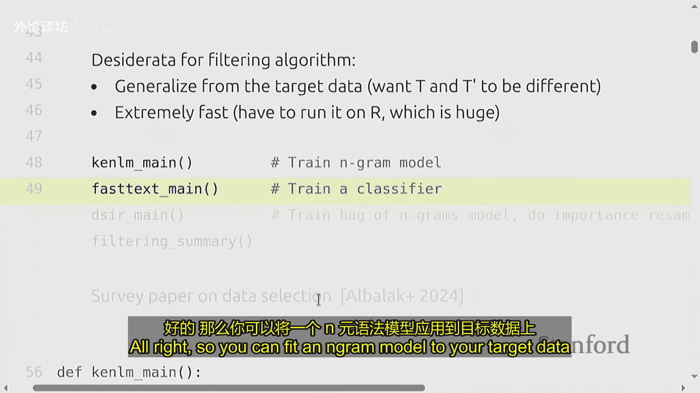

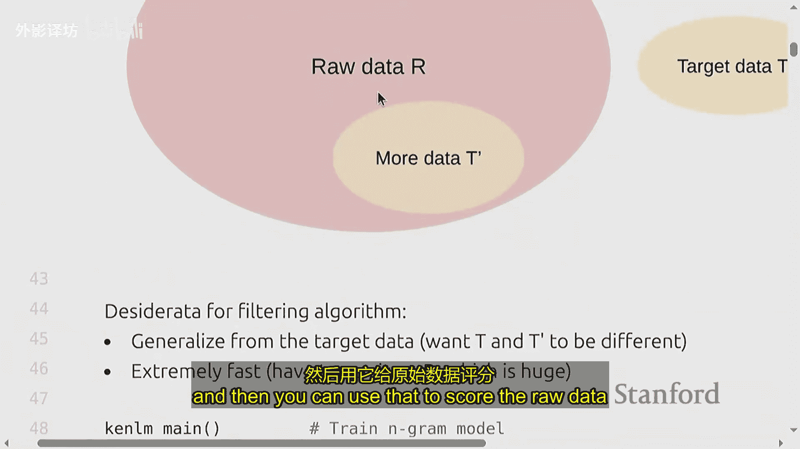

---

## 方法一：N元语法模型

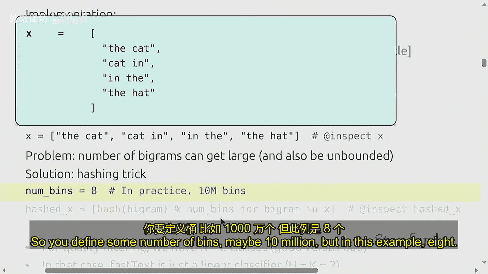

N元语法模型是一种经典的统计语言模型。其核心思想是基于前 `N-1` 个词来预测第 `N` 个词的概率。

**公式**：对于一个文本语料库，条件概率 `P(w_N | w_1, ..., w_{N-1})` 的最大似然估计为：
`count(w_1, ..., w_N) / count(w_1, ..., w_{N-1})`

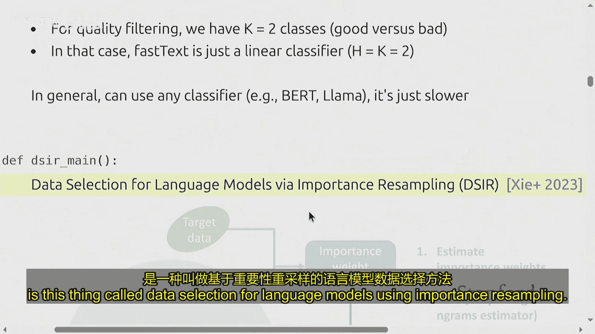

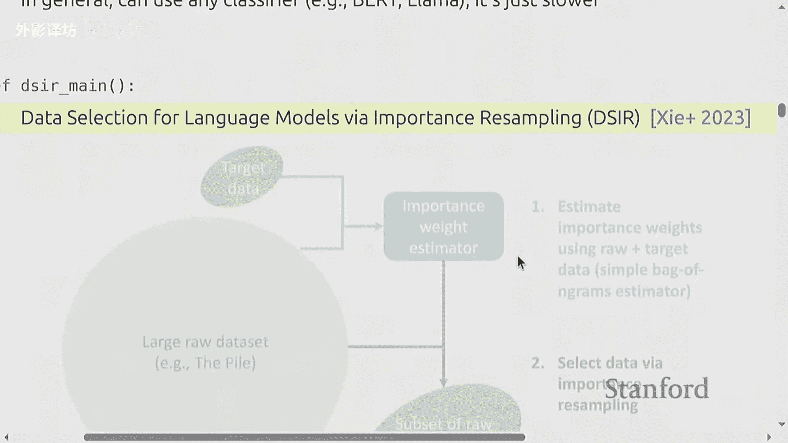

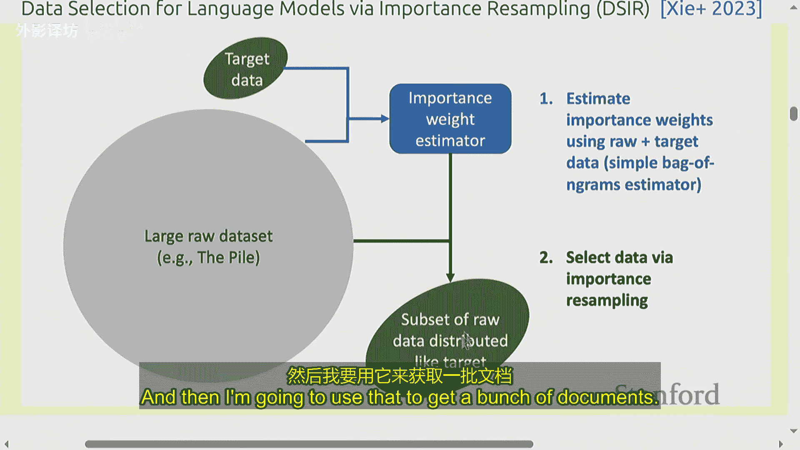

主要挑战是数据稀疏性，许多合理的N元语法出现次数为零。因此需要采用平滑技术（如Kneser-Ney平滑）来处理未登录词。

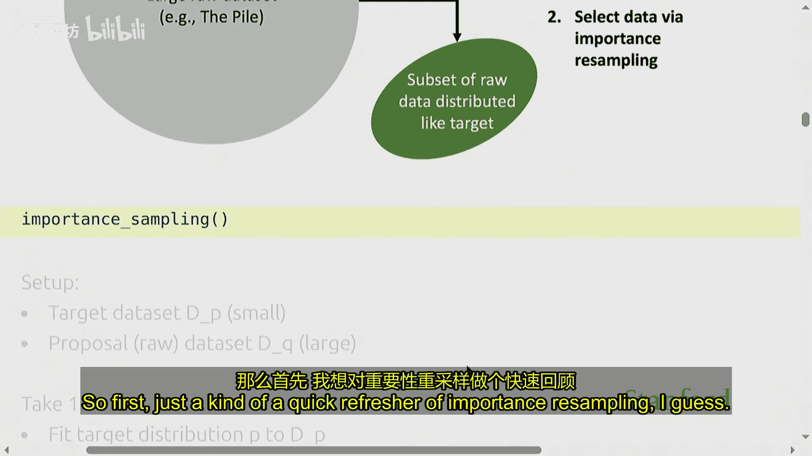

其应用方式是：在目标数据 `T` 上训练一个N元语法模型，然后用它计算原始数据 `R` 中每个文档的困惑度。保留困惑度低（即模型认为概率高）的文档。

```python
# 示例：使用N元语法模型计算句子困惑度
from kenlm import Model
model = Model('wiki.arpa') # 加载在维基百科上训练的模型
sentence = "Stanford University was founded in 1885."
print(model.score(sentence)) # 计算对数概率
```

这种方法简单快速，常被用于早期数据筛选（如CCNet论文中的做法）。

---

## 方法二：线性分类器（FastText）

FastText是一个高效的文本分类库。其动机在于，对于许多分类任务，简单的线性分类器在速度上远超复杂神经网络，且效果相当。

其核心是**降维**：将词向量空间映射到一个更小的隐藏维度 `H`，然后进行线性分类。这可以看作是一种矩阵分解，大幅减少了参数量。

为了捕捉N元语法信息，FastText将句子拆分为N元语法集合，并通过哈希函数将这些N元语法映射到固定数量的桶中，从而处理词汇量爆炸的问题。

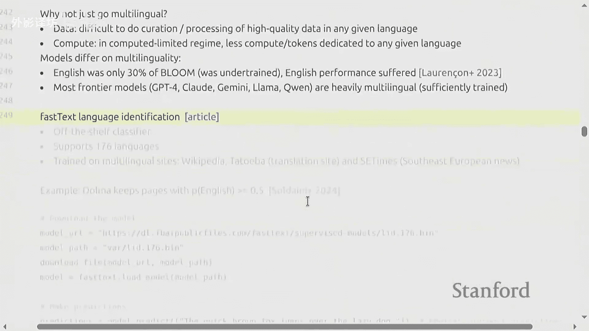

在筛选任务中，通常训练一个二分类器（判断文档属于“高质量目标数据”还是“低质量原始数据”）。保留被分类器判定为“高质量”的文档。

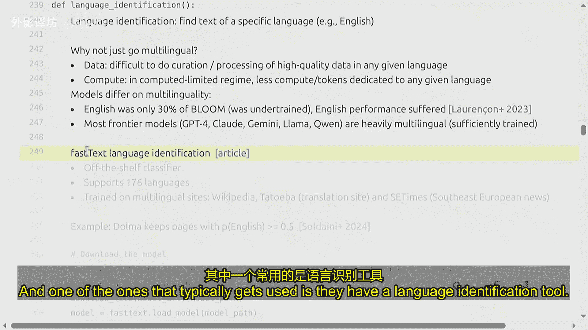

---

## 方法三：重要性重采样

重要性重采样是一种更原则性的方法，旨在使筛选后的数据分布匹配目标分布。

**基本概念回顾**：假设我们想从目标分布 `P` 中采样，但只能从一个提议分布 `Q` 中采样。我们可以先从 `Q` 中采样一批样本，然后为每个样本计算重要性权重 `w_i = P(x_i) / Q(x_i)`，最后根据归一化后的权重进行重采样，从而近似 `P` 分布。

**在数据筛选中的应用**：
1.  将目标数据集 `T` 视为来自分布 `P` 的样本。
2.  将原始数据集 `R` 视为来自分布 `Q` 的样本。
3.  由于 `T` 很小，无法直接拟合好的 `P` 模型，因此使用哈希N元语法等简单技术来估计 `P` 和 `Q`。
4.  计算原始数据中每个文档的重要性权重（即 `P` 与 `Q` 的似然比），并依此进行重采样。

这种方法更注重匹配整体分布，可能对数据多样性更有利。

---

## 筛选算法的统一视角

以上三种方法共享一个高级框架：
1.  **估计模型**：基于目标数据 `T` 和/或原始数据 `R`，估计一个评分函数（如概率、分类得分、似然比）。
2.  **应用评分**：用该评分函数对原始数据 `R` 中的每个示例进行打分。
3.  **选择样本**：保留高分示例（通过设定阈值或根据权重重采样）。

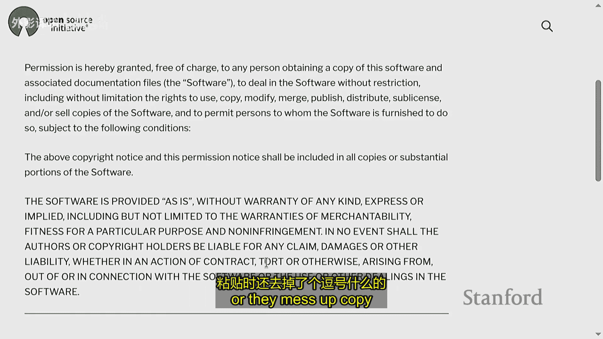

这个框架不仅适用于质量筛选，也可灵活应用于其他任务。

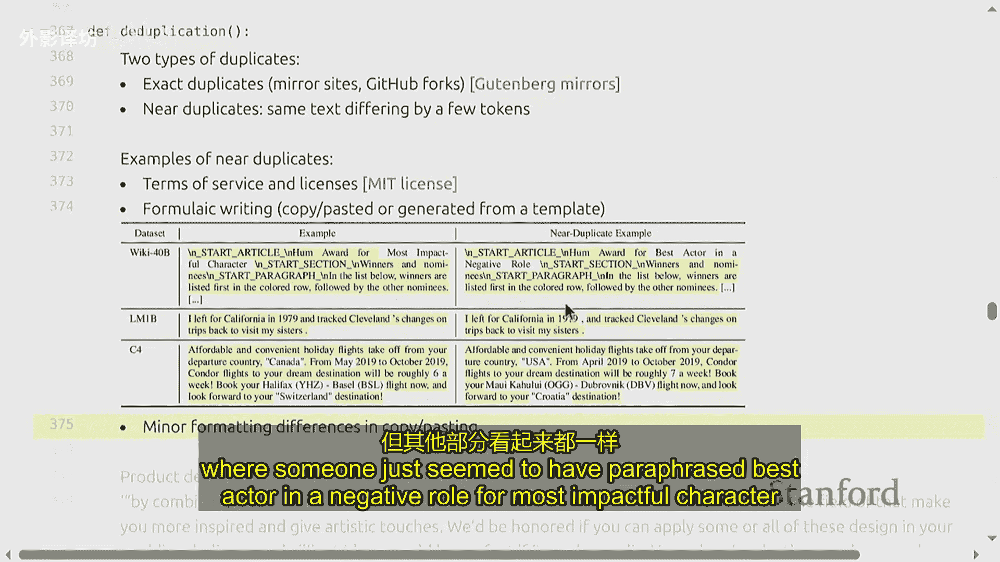

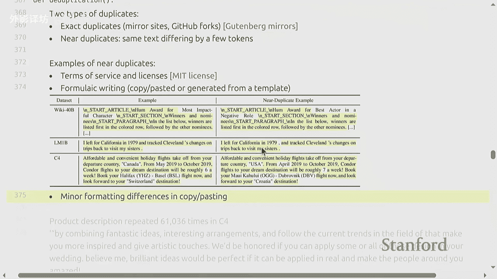

---

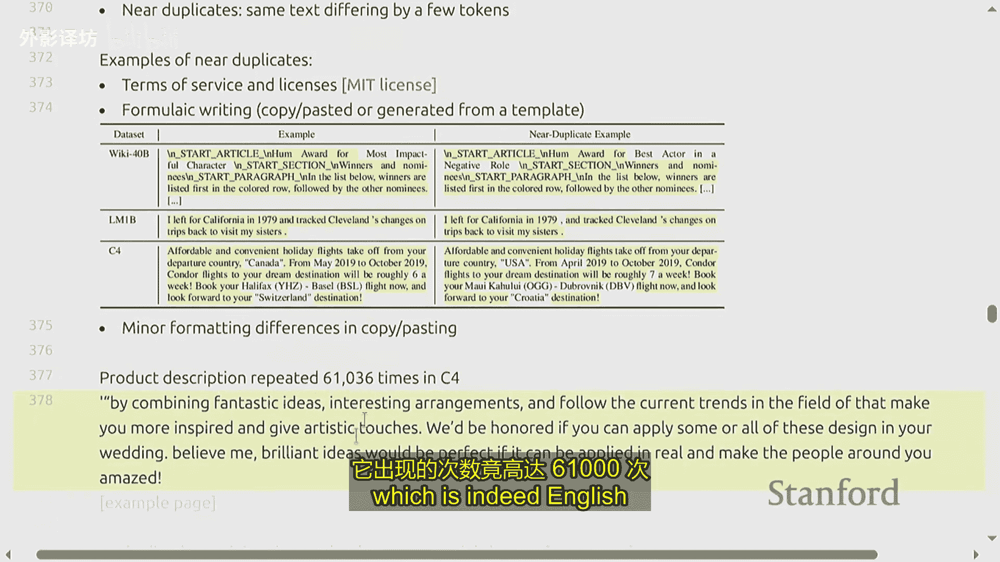

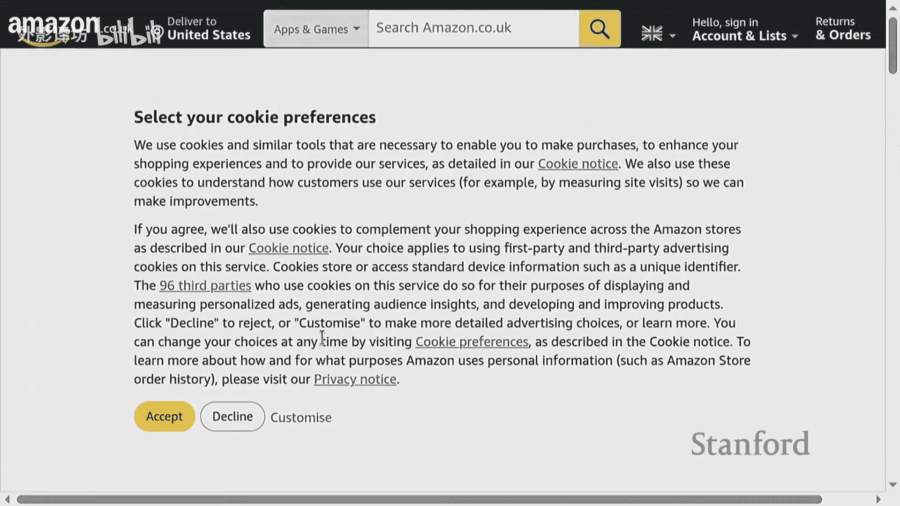


## 筛选算法的应用场景

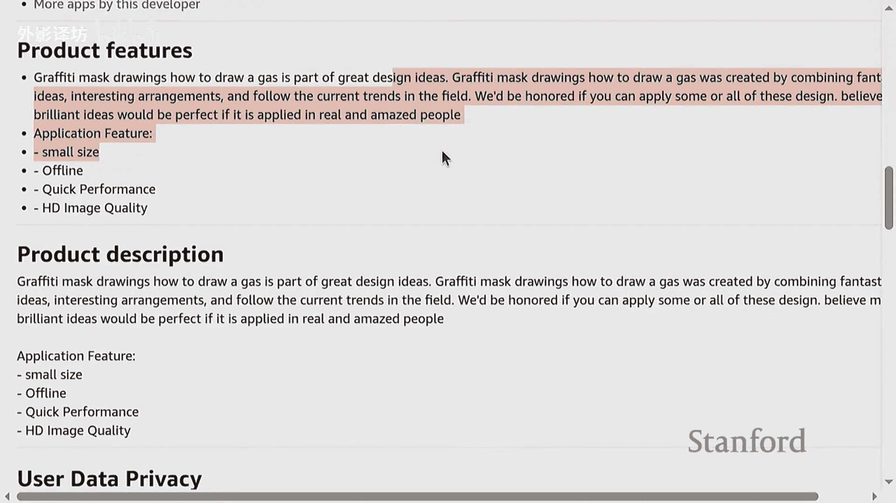

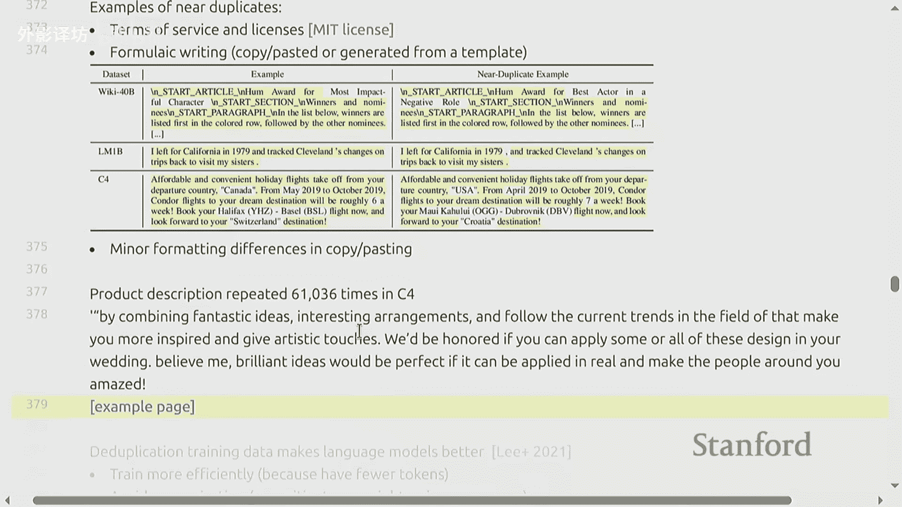

以下是筛选机制在不同任务中的应用：

### 1. 语言识别
**目标**：从多语言数据中筛选出特定语言（如英语）的文本。
**方法**：使用FastText等工具训练语言分类器。例如，Dolma数据集使用FastText语言ID模型，保留被分类为英语且概率大于0.5的页面。

### 2. 质量筛选
**目标**：筛选出“高质量”文本，但“质量”定义多样。
**实践案例**：
*   **GPT-3**：从高质量来源（如维基百科、书籍）采样正例，从通用爬虫数据采样负例，训练线性分类器进行筛选。
*   **Phi-1**：使用GPT-4，根据“教育价值”提示，对代码数据进行标注，生成正例，然后训练随机森林分类器进行筛选。这展示了利用强大语言模型自动生成目标数据 `T` 的新范式。

### 3. 毒性过滤
**目标**：移除包含仇恨、侮辱、威胁等有毒内容的文本。
**实践案例**：Dolma团队使用在“Jigsaw有毒评论”数据集上训练的FastText分类器，来识别和过滤有毒内容。

---

## 数据去重算法

去重旨在移除数据集中的重复或近乎重复的文档，以提升训练效率并减少模型对数据的死记硬背。

### 去重的设计空间
1.  **去重单位**：句子、段落还是文档？
2.  **匹配标准**：完全匹配还是近似匹配（如Jaccard相似度>0.99）？
3.  **处理动作**：删除所有重复项还是仅保留一个？

核心挑战是算法复杂度。朴素的两两比较是 `O(N^2)`，不可行。我们需要基于哈希的线性时间算法。

---

## 精确去重

**方法**：计算每个文档（或文本块）的哈希值（如MurmurHash）。将哈希值映射到桶，每个桶内保留一个文档即可。
**优点**：简单、精确、易于并行（MapReduce）。
**缺点**：无法检测近似重复。
**实践**：C4数据集使用三句子片段进行精确去重。

### 布隆过滤器
一种高效、节省内存的**近似**集合成员判定数据结构。
*   **原理**：使用 `k` 个哈希函数，将元素映射到一个长度为 `m` 的位数组中。插入时，将对应 `k` 个位置置1。查询时，若 `k` 个位置均为1，则**可能**在集合中（可能有误报）；若有任一为0，则**肯定不在**集合中。
*   **特点**：可设置超参数（`m`, `k`）来权衡内存、计算成本和误报率。

```python
# 布隆过滤器概念示例
from pybloom_live import BloomFilter
bf = BloomFilter(capacity=1000, error_rate=1e-15)
bf.add("document_hash_123")
print("document_hash_123" in bf) # 可能为 True
print("document_hash_456" in bf) # 肯定为 False (除非误报)
```

---

## 近似去重

为了检测几乎相同但略有差异的文档（如修改个别单词、标点），我们需要近似匹配。

### Jaccard相似度与最小哈希
*   **Jaccard相似度**：衡量两个集合 `A` 和 `B` 的相似度，公式为 `|A ∩ B| / |A ∪ B|`。
*   **最小哈希**：一种哈希函数，其关键性质是：`P[minHash(A) = minHash(B)] = Jaccard(A, B)`。即，两个集合哈希冲突的概率等于它们的Jaccard相似度。

### 局部敏感哈希
单个最小哈希冲突概率仍等于相似度，不够“尖锐”。LSH通过组合多个最小哈希函数来“锐化”这一概率曲线。
*   **方法**：生成 `n` 个最小哈希函数，将其分成 `b` 个波段，每个波段含 `r` 个哈希（`n = b * r`）。我们规定：如果两个文档在**至少一个**波段内的所有 `r` 个哈希值都相同，则它们被视为候选重复对。
*   **调整**：通过调整 `b` 和 `r`，可以控制相似度阈值和判定的严格程度。增大 `r` 会使判定更严格（曲线右移），增大 `b` 会增加匹配机会（曲线左移）。

**实践**：许多论文使用基于最小哈希的LSH进行近似去重，例如设置 `b=22`, `r=450`，以实现约0.99相似度的严格去重。

---

## 总结

本节课我们一起学习了数据准备过程中的关键算法：

1.  **筛选算法**：我们探讨了N元语法模型、线性分类器（FastText）和重要性重采样三种方法。它们共享一个核心模式：基于目标数据学习一个评分函数，用于从原始数据中筛选样本。这套方法可广泛应用于语言识别、质量筛选和毒性过滤。

2.  **去重算法**：我们学习了精确去重（哈希表、布隆过滤器）和近似去重（基于最小哈希的局部敏感哈希）技术。去重能有效提升训练计算效率，并减轻模型对数据的机械记忆。哈希是这些算法的基石，它将成对比较问题转化为线性时间的操作。

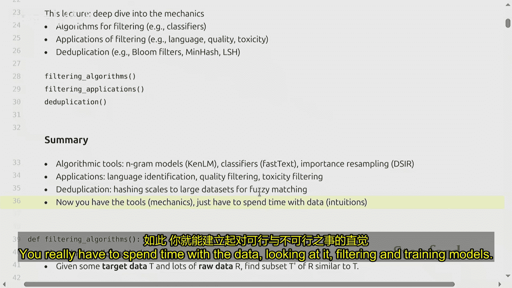


掌握这些算法工具，是构建高质量训练数据集的重要一步。真正的数据洞察力还需通过实践——亲自查看、筛选数据并观察模型效果——来逐步建立。