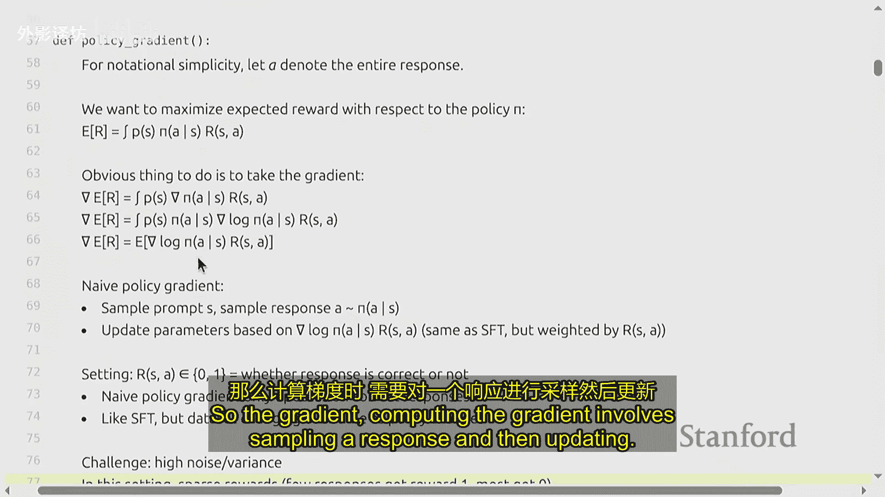
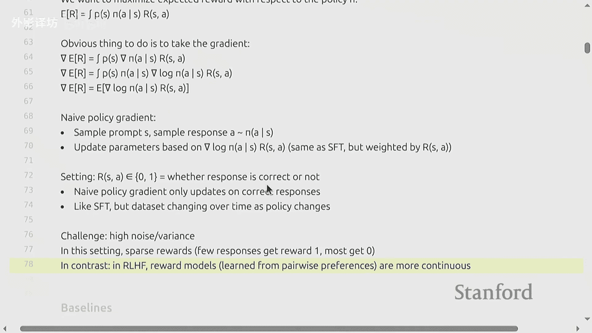
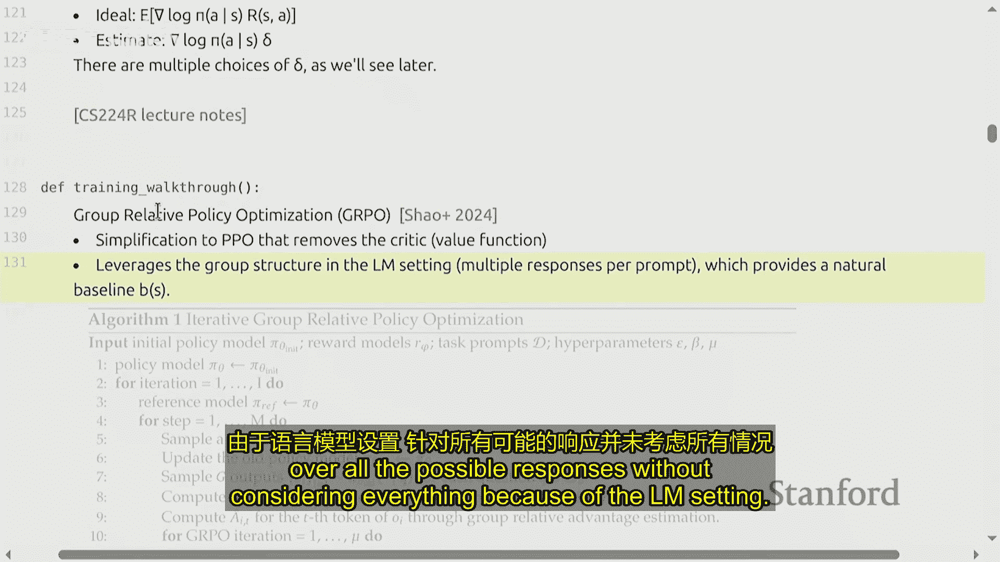
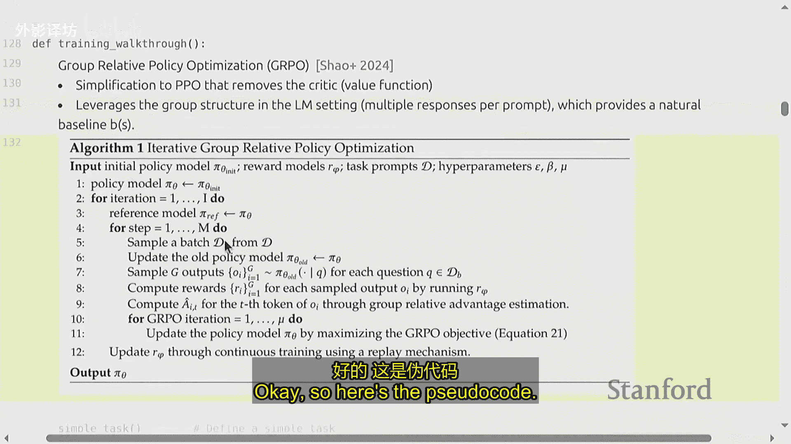
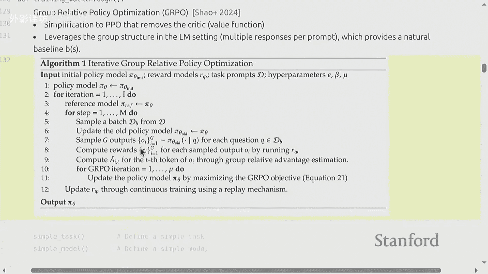
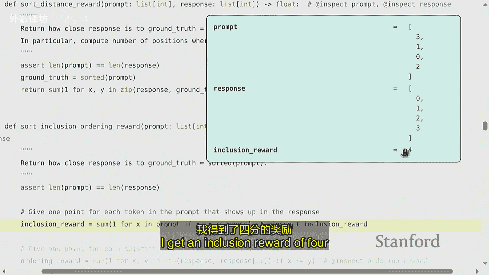
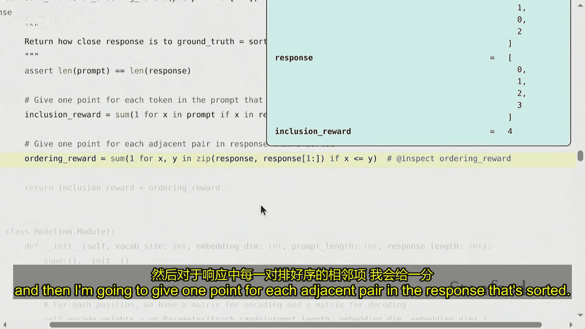
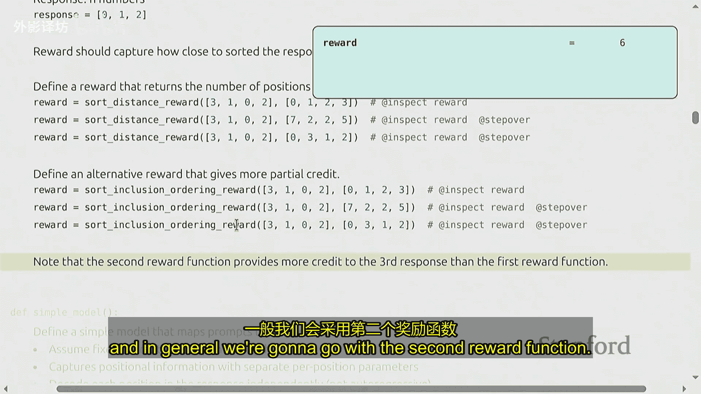
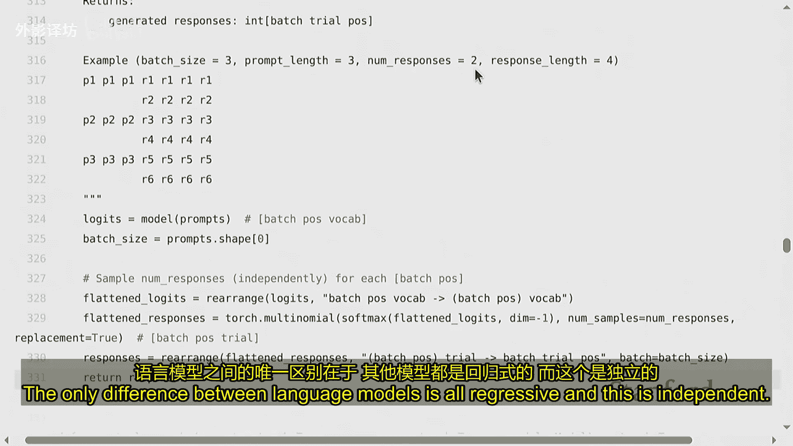
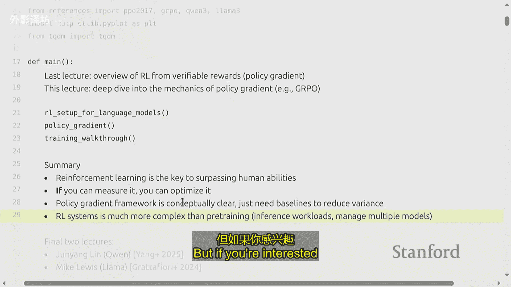

# 17：对齐 - 强化学习2 🧠


在本节课中，我们将深入探讨策略梯度方法，特别是其在语言模型对齐中的应用。我们将从回顾强化学习的基本设置开始，然后详细讲解策略梯度、基线方法以及广义近端策略优化等核心概念，并通过一个简单的排序任务示例来展示其代码实现。

---

## 概述

上一节我们从可验证奖励的角度概述了强化学习，介绍了近端策略优化等算法。本节中，我们将深入探讨策略梯度及其变体的工作机制，包括如何通过引入基线来降低方差，以及如何在实际任务中应用这些方法。我们将结合数学公式和代码示例，让初学者能够理解并掌握这些核心概念。

---

## 强化学习设置回顾

首先，我们明确在语言模型中进行强化学习的设置。



*   **状态**：是提示加上目前已生成的响应。
*   **动作**：生成下一个特定的标记。
*   **奖励**：取决于整个响应的质量。在本课程中，我们聚焦于**结果奖励**，即奖励在生成完整响应后根据其正确性一次性给出。我们主要关注**可验证的奖励**，即通过确定性函数计算，无需人工评估。

在这种设置下，智能体（语言模型）生成一系列动作（标记）后获得一个奖励。这与过程奖励（在生成过程中获得多次奖励）不同。虽然奖励稀疏且有延迟，但概念上更清晰。

**状态转移**在语言模型中很简单：将动作（标记）添加到当前状态（文本）即可。这带来了巨大的优势，因为我们可以精确模拟“世界动态”，从而进行规划。



**策略** 是一个语言模型，它基于当前状态（提示和已生成响应）来生成下一个动作（标记）。它通常基于预训练模型进行微调。

我们的目标是**最大化期望奖励**。期望基于环境给出的提示分布以及策略生成的响应。

---

## 策略梯度方法

策略梯度是一类直接对策略参数求梯度以改进策略的方法。

为了简化符号，我们用 **A** 表示整个响应（动作序列）。在结果奖励设定下，我们可以将所有动作视为由语言模型一次性生成，然后获得奖励。

我们要最大化的目标是期望奖励 **J(θ)**：
**J(θ) = E_{s~p, a~π_θ(·|s)} [R(s, a)]**

对其求梯度，应用策略梯度定理（实质上是对数函数的链式法则），我们得到：
**∇_θ J(θ) = E_{s~p, a~π_θ(·|s)} [∇_θ log π_θ(a|s) * R(s, a)]**

### 朴素策略梯度

朴素策略梯度直接使用上述公式的采样估计：
1.  从分布中采样一个提示 **s**。
2.  用当前策略 **π_θ** 采样一个响应 **a**。
3.  计算奖励 **R(s, a)**。
4.  按以下公式更新参数：**θ ← θ + α * ∇_θ log π_θ(a|s) * R(s, a)**

这类似于监督微调，但所有更新都由奖励 **R** 加权。

**直观示例**：如果奖励是二元的（0或1，代表错误或正确），那么朴素策略梯度只会对正确的响应进行更新，模仿那些正确的回答。主要挑战在于，当奖励稀疏（多数响应得0分）且策略较差时，梯度更新可能非常稀少，导致学习停滞。







---

## 基线方法



为了降低策略梯度估计的方差，我们引入**基线**。





核心思想是优化 **R(s, a) - b(s)** 的期望，而非单纯的 **R(s, a)**。其中 **b(s)** 是一个只依赖于状态 **s** 的函数。因为 **E_{a~π}[b(s)] = b(s)** 是一个常数，所以这种变换不改变优化目标，但可以显著影响方差。

策略梯度公式变为：
**∇_θ J(θ) = E_{s~p, a~π_θ(·|s)} [∇_θ log π_θ(a|s) * (R(s, a) - b(s))]**

**如何选择基线 b(s)？** 一个常见且有效的启发式选择是 **b(s) = E_{a~π}[R(s, a)]**，即给定状态下期望奖励的估计。这引出了**优势函数**的概念：
**A(s, a) = R(s, a) - E_{a‘~π}[R(s, a’)]**
优势函数衡量了在状态 **s** 下采取动作 **a** 相对于平均表现有多好。此时，策略梯度就是在优化优势函数。

在实践中，我们无法精确计算期望，因此需要采样估计。



---

## 广义近端策略优化

广义近端策略优化是一种策略梯度算法，它天然适合语言模型设置，因为它利用了一个提示可以生成多个响应这一特性来自然分组并计算基线。

以下是其核心步骤的伪代码概述：

```
对于 每一轮训练：
    对于 数据集中的每个提示 s：
        使用当前策略 π_θ 生成 k 个响应 {a_1, ..., a_k}
        计算每个响应的奖励 {r_1, ..., r_k}
        计算奖励的均值 μ 和标准差 σ
        计算每个响应的归一化优势估计：δ_i = (r_i - μ) / (σ + ε)
    对于 每个响应 a_i：
        计算重要性权重：ratio = π_θ(a_i|s) / π_θ_old(a_i|s)
        计算裁剪后的目标：L_i = -min(ratio * δ_i, clip(ratio, 1-ε, 1+ε) * δ_i)
        可选：添加KL散度惩罚项，使 π_θ 不要偏离参考模型 π_ref 太远
    使用 L 的梯度更新策略参数 θ
```

关键点在于：
*   **归一化**：`(r_i - μ) / σ` 使更新幅度不受奖励绝对数值尺度的影响，并提供了组内的相对比较。
*   **裁剪**：防止重要性权重 `ratio` 变化过大，导致训练不稳定。
*   **KL惩罚**：作为一种正则化，防止策略在单次更新中偏离旧策略或参考策略太远。

---

## 实践示例：排序任务

为了具体理解，我们定义一个简单任务：对N个数字进行排序。

### 任务与环境

*   **提示**：一串N个未排序的数字，例如 `[3, 1, 2]`。
*   **响应**：一串N个数字，期望是排序后的结果，例如 `[1, 2, 3]`。
*   **奖励函数设计**：
    1.  **稀疏奖励**：若响应完全正确排序，奖励为1，否则为0。这会导致初期学习困难。
    2.  **稠密奖励（本例采用）**：结合部分正确性给予奖励。
        *   对响应中每个出现在正确排序结果中的数字，给予1分。
        *   对响应中每一对已正确排序的相邻数字，再给予1分。
        *   例如，提示 `[3,1,2]`，正确响应 `[1,2,3]` 的奖励为：数字全匹配(3分) + 正确相邻对`(1,2)`, `(2,3)`(2分) = 5分。

### 模型与训练

我们定义一个极度简化的模型：每个输出位置独立地基于输入提示预测一个数字。这虽然不符合自回归生成的实际，但极大简化了代码，便于演示核心算法。

以下是训练循环的核心结构代码：

```python
# 伪代码，展示逻辑流程
for epoch in range(num_epochs):
    # 1. 采样数据
    prompts = sample_prompts(batch_size) # 例如 [[3,1,2], [4,2,5], ...]
    all_responses = []
    all_rewards = []
    for prompt in prompts:
        responses = model.generate(prompt, num_responses=k) # 生成k个响应
        rewards = [compute_reward(prompt, resp) for resp in responses] # 计算奖励
        all_responses.extend(responses)
        all_rewards.extend(rewards)

    # 2. 计算优势估计 (Deltas)
    # 将奖励按提示分组，每组内进行归一化
    deltas = compute_advantages(all_rewards) # 例如 (r_i - group_mean) / group_std

    # 3. 多步优化（针对同一批采样数据）
    for optimization_step in range(num_steps_per_batch):
        total_loss = 0
        for resp, delta in zip(all_responses, deltas):
            # 计算当前策略下该响应的对数概率
            log_prob_current = model.log_probability(resp)
            # 计算旧策略下该响应的对数概率（从之前存储的或冻结的旧模型获取）
            log_prob_old = old_model.log_probability(resp) # 旧模型参数需冻结

            # 计算重要性比率
            ratio = torch.exp(log_prob_current - log_prob_old)

            # GRPO 裁剪损失
            surr1 = ratio * delta
            surr2 = torch.clamp(ratio, 1 - clip_epsilon, 1 + clip_epsilon) * delta
            policy_loss = -torch.min(surr1, surr2).mean()

            # 可选：KL散度惩罚
            kl_penalty = compute_kl_penalty(model, reference_model, resp)
            loss = policy_loss + beta * kl_penalty

            total_loss += loss

        # 4. 反向传播与更新
        optimizer.zero_grad()
        total_loss.backward()
        optimizer.step()
```

通过这种训练，模型会逐渐学会生成排序更正确的序列。需要注意的是，奖励函数的设计至关重要，不合理的部分奖励可能导致模型陷入局部最优（例如，只学会输出包含正确数字但顺序不对的序列）。

---

## 总结

本节课我们一起深入学习了策略梯度方法在对齐语言模型中的应用。

1.  **回顾了设定**：明确了在结果奖励模式下，用强化学习训练语言模型的状态、动作和奖励定义。
2.  **讲解了策略梯度**：从最大化期望奖励的目标出发，推导出策略梯度定理，并指出了朴素策略梯度在稀疏奖励下的局限性。
3.  **引入了基线**：通过减去一个只与状态相关的基线函数，可以显著降低梯度估计的方差，而使用期望奖励作为基线则引出了优势函数的概念。
4.  **介绍了GRPO**：作为一种实用的策略梯度算法，它利用语言模型生成多个响应的特性，通过组内归一化来计算优势估计，并结合裁剪和KL惩罚来稳定训练。
5.  **通过实例演示**：我们构建了一个简单的数字排序任务和模型，展示了从数据采样、奖励计算、优势估计到损失计算和参数更新的完整流程。




强化学习为超越模仿、直接优化复杂目标（如事实正确性、安全性、人类偏好）提供了强大框架。然而，构建一个可扩展且稳定的强化学习系统涉及推理、多模型管理和分布式计算等诸多工程挑战，这也是当前研究的前沿方向。