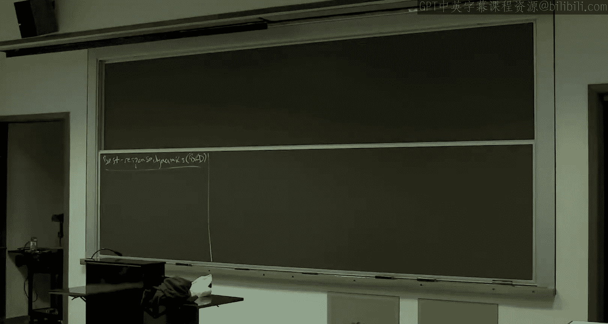
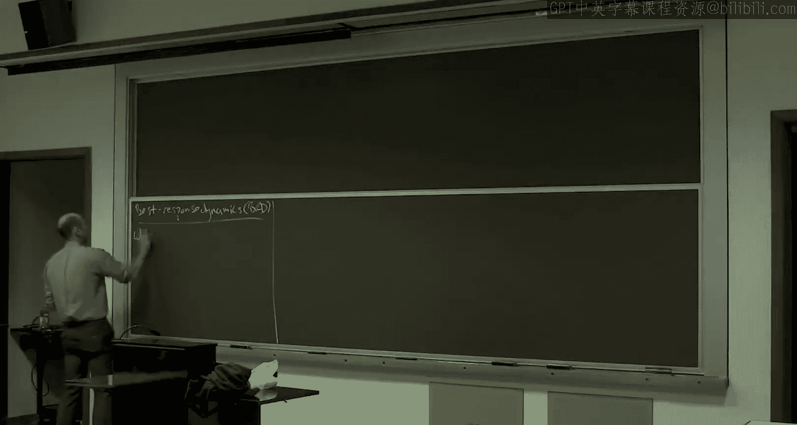
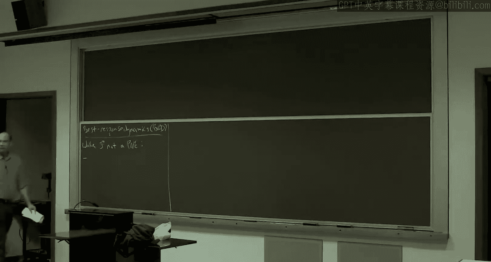
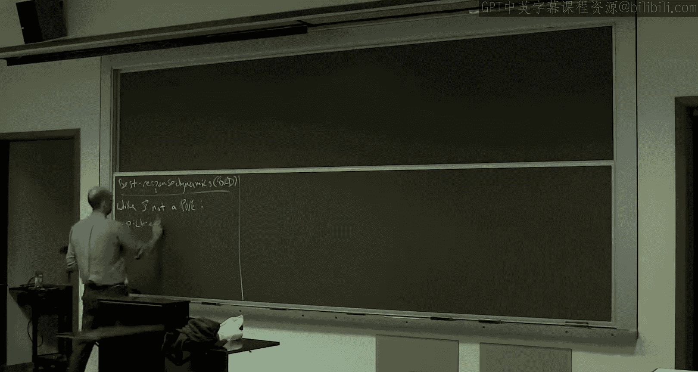
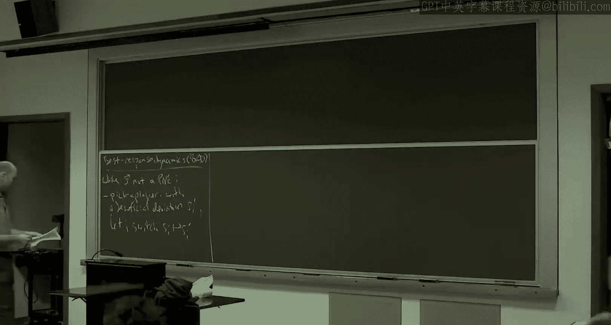
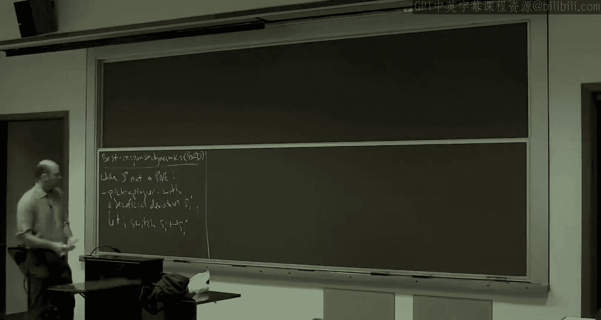

# 016：最佳响应动态 🎮

在本节课中，我们将学习玩家如何通过动态学习过程达到博弈的均衡状态。我们将重点介绍**最佳响应动态**，这是一种玩家通过不断选择对自己最有利的策略来逐步接近均衡的方法。我们将探讨其收敛性、速度以及在近似均衡下的表现。

---

## 概述 📋

在前七周中，我们主要讨论了博弈的均衡状态及其性质。然而，一个重要的问题是：这些均衡是如何产生的？玩家能否通过某种学习过程找到均衡？本节课我们将深入探讨**最佳响应动态**，这是一种简单而自然的学习过程，玩家通过不断选择对自己最有利的策略来逐步接近均衡。我们将分析其收敛条件、收敛速度，并探讨在近似均衡下的表现。

---

## 最佳响应动态的基本概念 🔄

最佳响应动态是一种迭代过程，玩家通过不断选择对自己最有利的策略来逐步接近纯策略纳什均衡。在这个过程中，所有玩家始终选择纯策略。

### 过程描述
1. 初始时，玩家选择任意纯策略组合。
2. 如果当前策略组合不是纯策略纳什均衡，则存在至少一个玩家可以通过单边偏离改善自己的收益。
3. 选择其中一个玩家（选择方式可以是任意的），并允许其选择一个有益的偏离策略。
4. 其他玩家的策略保持不变。
5. 重复上述过程，直到达到纯策略纳什均衡或无法进一步改善。

### 收敛性
如果最佳响应动态收敛，那么它必然收敛到一个纯策略纳什均衡。反之，如果存在纯策略纳什均衡，最佳响应动态最终会找到它。然而，收敛性并不是在所有博弈中都成立。

---

## 势博弈中的收敛性 ⚡

在势博弈中，最佳响应动态具有很好的收敛性质。势博弈是指存在一个势函数 \(\Phi\)，满足对于所有玩家 \(i\) 和所有策略组合 \(S\)，玩家 \(i\) 的收益变化等于势函数的变化。

### 势函数的定义
对于势博弈，存在势函数 \(\Phi\)，满足：
\[
\Phi(S_i', S_{-i}) - \Phi(S_i, S_{-i}) = u_i(S_i', S_{-i}) - u_i(S_i, S_{-i})
\]
其中 \(u_i\) 是玩家 \(i\) 的收益函数。

### 收敛性证明
在势博弈中，每次玩家选择最佳响应时，其收益增加，势函数也随之增加。由于势函数是有限的，且每次迭代势函数严格增加，因此最佳响应动态必然在有限步内收敛到纯策略纳什均衡。

---

## 近似均衡与快速收敛 🚀

在某些情况下，达到精确的纳什均衡可能需要指数时间。因此，我们考虑达到**近似纳什均衡**，即玩家的收益改善不超过一个小的阈值 \(\epsilon\)。

### \(\epsilon\)-最佳响应动态
在 \(\epsilon\)-最佳响应动态中，玩家只选择那些能显著改善其收益的偏离策略。具体来说，玩家只有在存在一个策略能将其收益提高至少 \((1-\epsilon)\) 倍时才会进行偏离。

### 收敛性定理
对于满足以下条件的自私路由博弈：
1. 所有玩家具有相同的起点和终点。
2. 成本函数满足 \(\alpha\)-有界跳跃条件。
3. 使用 \(\epsilon\)-最佳响应动态。
4. 每次选择收益改善最大的玩家进行偏离。

则 \(\epsilon\)-最佳响应动态在多项式时间内收敛到一个 \(\epsilon\)-近似纯策略纳什均衡。具体迭代次数为：
\[
O\left( \frac{K \alpha}{\epsilon} \log \frac{\Phi_{\text{初始}}}{\Phi_{\text{最小}}} \right)
\]
其中 \(K\) 是玩家数量，\(\alpha\) 是跳跃条件参数，\(\Phi\) 是势函数。

---

## 势函数与成本的关系 📊

在自私路由博弈中，势函数是成本的下界。具体来说，对于任意策略组合 \(S\)，势函数 \(\Phi(S)\) 满足：
\[
\Phi(S) \leq \text{Cost}(S)
\]
这一性质在分析收敛速度时起到关键作用。

---

## 平滑博弈中的成本保证 📉

如果我们只关心系统的成本性能，而不要求达到精确的纳什均衡，那么可以在更广泛的博弈中获得快速收敛的保证。

### 平滑博弈的定义
一个博弈是 \((\lambda, \mu)\)-平滑的，如果对于任意两个策略组合 \(S\) 和 \(S^*\)，满足：
\[
\sum_{i} u_i(S_i^*, S_{-i}) \leq \lambda \cdot \text{Cost}(S^*) + \mu \cdot \text{Cost}(S)
\]

### 成本保证定理
对于平滑势博弈，最佳响应动态在多项式时间内达到一个成本接近纳什均衡的状态。具体来说，在大多数时间步中，系统的成本满足：
\[
\text{Cost}(S_t) \leq \frac{\lambda}{1-\mu} \cdot \text{Cost}(S^*) + \gamma \cdot \text{Cost}(S^*)
\]
其中 \(\gamma\) 是一个小常数。

---

## 总结 📝

本节课中，我们一起学习了最佳响应动态及其在博弈论中的应用。我们探讨了其在势博弈中的收敛性，以及在近似均衡下的快速收敛性质。此外，我们还介绍了平滑博弈中的成本保证定理，展示了即使未达到精确均衡，系统的成本性能也能接近纳什均衡的水平。这些结果为理解玩家如何通过动态学习过程达到均衡提供了重要的理论基础。

---