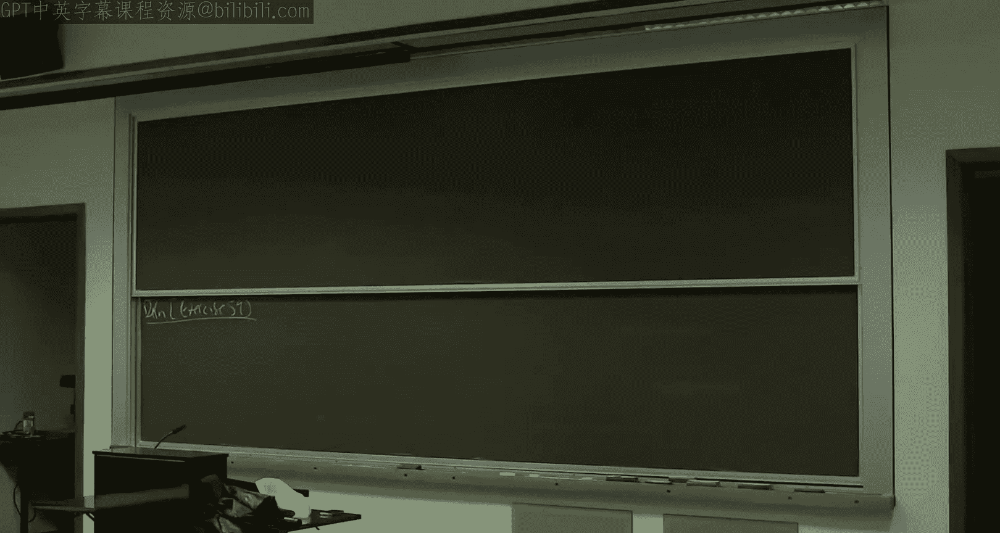
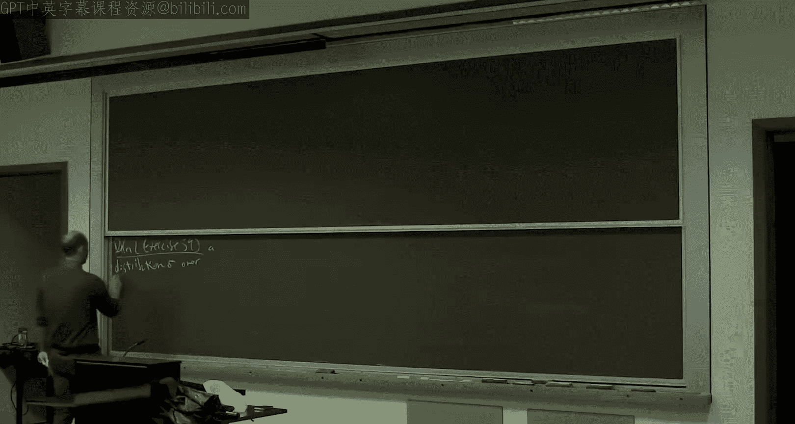
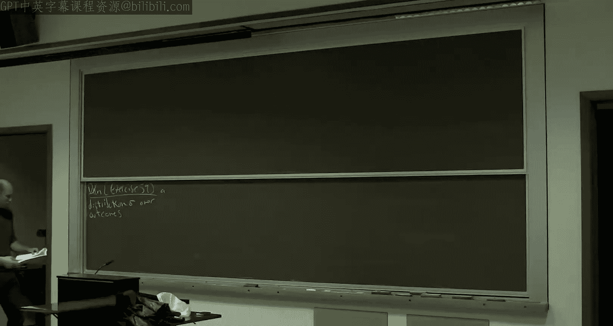
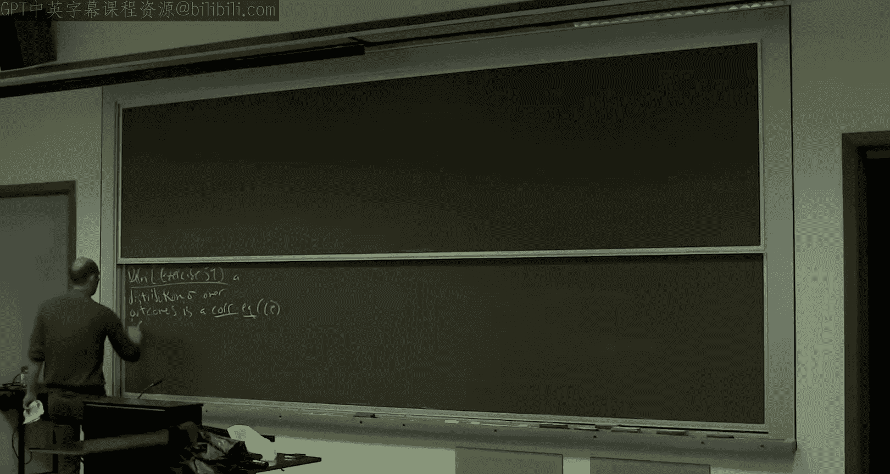
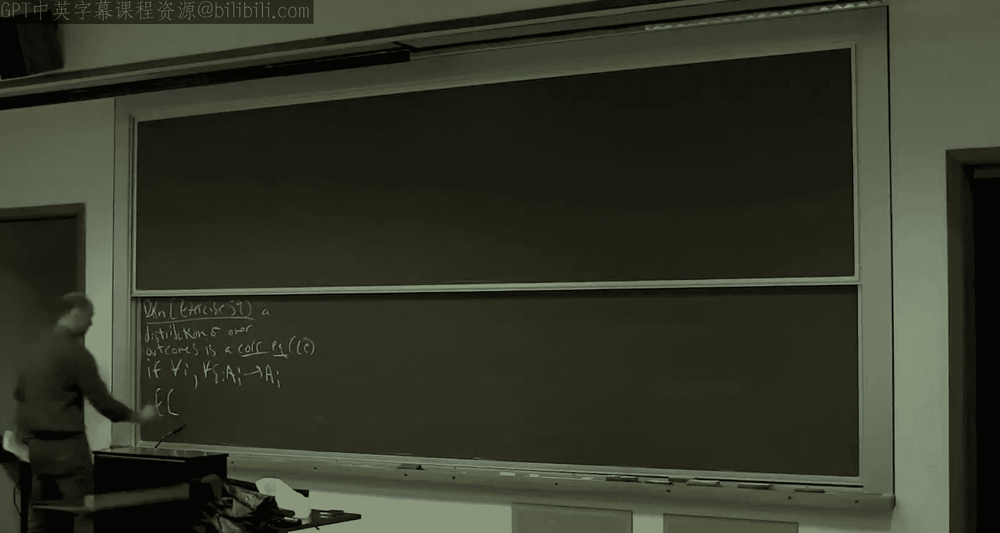

# 018：从外部遗憾到交换遗憾与极小极大定理

在本节课中，我们将学习如何将外部遗憾的概念推广到更严格的交换遗憾，并利用这一概念证明相关均衡的计算可行性。此外，我们还将探讨如何利用无遗憾算法来证明著名的极小极大定理，该定理是零和博弈理论的核心。

---

## 从外部遗憾到交换遗憾

上一节我们介绍了粗相关均衡，并证明了如果所有玩家都使用无外部遗憾算法（如乘性权重算法），那么联合博弈的历史将收敛到粗相关均衡集。本节中，我们来看看一个更精细的均衡概念——相关均衡，并探讨其计算可行性。

相关均衡的定义可以通过“切换函数”来描述。对于一个博弈结果上的分布 σ，如果对于每个玩家 i 和所有从该玩家行动到其行动的映射（切换函数）δ，玩家 i 遵循分布 σ 的期望成本不高于其根据切换函数 δ 改变行动后的期望成本，那么 σ 就是一个相关均衡。

为了建立相关均衡与学习算法之间的联系，我们需要一个比外部遗憾更严格的概念：交换遗憾。

**定义：交换遗憾**
对于一个在线决策算法，如果对于对手可能给出的所有成本向量以及所有切换函数 δ，算法在时间 T 内的期望平均成本与“若每次根据切换函数 δ 改变所选行动”的期望平均成本之差，随着 T 趋于无穷大而趋于零，则该算法具有**无交换遗憾**性质。

值得注意的是，无交换遗憾意味着无外部遗憾，因为外部遗憾只考虑恒定的切换函数（即始终切换到某个固定行动）。

**定理：无交换遗憾算法与相关均衡**
如果博弈中的所有玩家都使用无交换遗憾算法，那么联合博弈的历史将收敛到相关均衡集。具体来说，将 T 个结果上的均匀分布作为 σ，它将是一个近似相关均衡，且近似误差随 T 增大而趋于零。

因此，要证明相关均衡的计算可行性，关键在于构造出无交换遗憾的算法。

---

## 从无外部遗憾到无交换遗憾的黑盒归约

幸运的是，我们可以利用已知的无外部遗憾算法（如乘性权重算法）来构造无交换遗憾算法。以下是 Blum 和 Mansour 在 2005 年提出的黑盒归约方法。

**归约构造：**
1.  设有 N 个行动。我们维护 N 个独立的无外部遗憾算法实例，记为 M₁, M₂, ..., M_N。
2.  在每一天 t，每个实例 M_j 会输出一个关于行动的分布建议 Q_{t}^{j}。
3.  **关键步骤**：我们需要一个“共识”机制，将这些不同的分布建议 Q_{t}^{1}, ..., Q_{t}^{N} 合并成一个单一的分布 P_t，作为主算法当天的行动分布。
4.  主算法根据 P_t 选择行动，并从环境中收到真实的成本向量 C_t。
5.  接着，主算法将成本向量按比例分配给各个子算法实例。具体来说，分配给实例 M_j 的成本向量是 P_t(j) * C_t，其中 P_t(j) 是主算法当天选择行动 j 的概率。

**共识分布的计算技巧：**
共识分布 P_t 的计算是归约的核心。我们需要选择 P_t，使得主算法的期望成本表达式与子算法成本表达式的和能够匹配。这引导我们建立以下方程：对于每个行动 i，要求
`P_t(i) = Σ_{j} P_t(j) * Q_{t}^{j}(i)`
这个方程恰好定义了一个马尔可夫链的平稳分布！其中，状态是行动，从状态 j 到状态 i 的转移概率就是 Q_{t}^{j}(i)。因此，**共识分布 P_t 可以取为该马尔可夫链的任意一个平稳分布**。平稳分布可以在多项式时间内计算（例如，通过求解线性方程组）。

**归约正确性：**
通过上述构造，每个子算法 M_j 在其所感知的（按比例分配的）成本序列上是无外部遗憾的。将它们的遗憾界求和，并利用共识分布 P_t 是马尔可夫链平稳分布这一性质，可以证明主算法关于任何切换函数 δ 的交换遗憾上界，正是这些子算法外部遗憾上界之和。由于子算法的外部遗憾随 T 增大而趋于零，因此主算法的交换遗憾也趋于零。

**推论：**
存在多项式时间的无交换遗憾算法。结合之前的定理，我们得出结论：相关均衡在计算上是可行的。如果所有玩家都使用这类算法，他们的博弈历史将收敛到相关均衡集。

---

## 极小极大定理与无遗憾算法

在证明了相关均衡的可行性后，我们自然想问：混合纳什均衡是否也可行？一般情况下答案是否定的（我们将在后续课程讨论）。但在一个特殊情况下答案是肯定的：**两人零和博弈**。这由著名的极小极大定理所保证。

考虑一个两人零和博弈，行玩家的收益矩阵为 A（列玩家的收益为 -A）。设 x 和 y 分别是行玩家和列玩家的混合策略（概率分布）。行玩家的期望收益为 `x^T A y`。

**极小极大定理**指出：
`max_x min_y x^T A y = min_y max_x x^T A y`
这个等式意味着，在零和博弈中，**先动者并不处于劣势**。行玩家先选择混合策略 x 时，其能保证的收益（假设列玩家随后最优反应）等于列玩家先选择混合策略 y 时，行玩家能获得的收益。

**利用无遗憾算法证明极小极大定理：**
我们可以使用无外部遗憾算法为这个等式提供构造性证明。
1.  让行玩家和列玩家分别独立运行他们的无外部遗憾算法（例如，针对收益调整的乘性权重算法），进行足够多轮（T 轮），直到各自的期望遗憾至多为 ε。
2.  设 P₁, ..., P_T 和 Q₁, ..., Q_T 分别是行、列玩家在各轮中使用的混合策略。
3.  定义时间平均策略：`x̂ = (Σ_t P_t)/T`, `ŷ = (Σ_t Q_t)/T`。
4.  设 V 为行玩家在这 T 轮中的平均期望收益。

**分析：**
*   由于行玩家算法是无外部遗憾的，对于任何固定的行策略（即纯行动）i，若其始终采用 i，其平均收益至多为 V + ε。通过线性推广，这意味着对于**任何**混合策略 x，有 `x^T A ŷ ≤ V + ε`。因此，`max_x x^T A ŷ ≤ V + ε`。
*   同理，由于列玩家算法也是无外部遗憾的（其目标是最大化自己的收益，即最小化 `x^T A y`），对于任何混合策略 y，有 `x̂^T A y ≥ V - ε`。因此，`min_y x̂^T A y ≥ V - ε`。

结合这两个不等式，我们得到：
`min_y x̂^T A y ≥ V - ε` 且 `max_x x^T A ŷ ≤ V + ε`
由于 `min_y max_x x^T A y ≥ max_x x^T A ŷ` 且 `max_x min_y x^T A y ≤ min_y x̂^T A y`，我们有：
`max_x min_y x^T A y ≤ min_y x̂^T A y ≤ V + ε` 且 `min_y max_x x^T A y ≥ max_x x^T A ŷ ≥ V - ε`
因此，`max_x min_y x^T A y` 和 `min_y max_x x^T A y` 之间的差距至多为 2ε。由于 ε 可以任意小，这两个值必须相等。这就证明了极小极大定理。

此外，`(x̂, ŷ)` 本身构成了一个 ε-近似纳什均衡。

---

## 总结

本节课中我们一起学习了：
1.  **交换遗憾**：一个比外部遗憾更强的在线学习评价标准，它要求算法与所有可能的行动切换函数竞争。
2.  **相关均衡的可行性**：通过构建无交换遗憾算法（基于无外部遗憾算法的黑盒归约），我们证明了如果所有玩家使用此类算法，博弈将收敛到相关均衡。这通过将共识分布计算问题转化为求解马尔可夫链平稳分布而实现。
3.  **极小极大定理的算法证明**：在两人零和博弈中，通过让双方独立运行无外部遗憾算法并考察其时间平均策略，我们可以构造性地证明极小极大定理，并同时得到一个近似纳什均衡。这展示了学习动力学与均衡概念之间的深刻联系。

这些结果共同表明，虽然寻找精确纳什均衡通常是困难的，但对于更广泛的均衡概念（如相关均衡）以及在零和博弈这一特殊情形下，我们存在高效且自然的计算和学习方法。