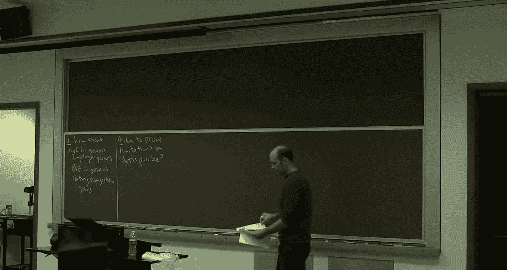
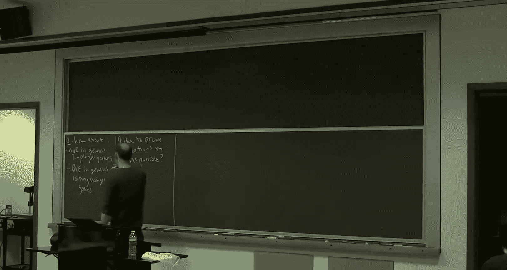

# 019：纯纳什均衡与PLS完全性

在本节课中，我们将学习如何理解计算博弈均衡的“难度”。我们将从一个看似无关的话题——局部搜索问题的复杂性——开始，最终将其与计算一般拥塞博弈中的纯纳什均衡联系起来。我们将看到，这种计算问题属于一个名为PLS的复杂性类，并且是PLS完全的，这为理解为何我们无法为这类问题找到快速算法或学习动态提供了理论基础。

---

## 回顾：均衡计算的正向结果

上一节我们介绍了多种均衡概念及其计算。本节中，我们来看看目前已知的正向结果，这有助于我们理解后续讨论的局限性。

我们已证明，在不同情境下，通过特定的学习动态可以高效地计算某些均衡：

*   **粗相关均衡**：在完全一般的博弈中，如果每个玩家都使用无外部遗憾算法（如乘性权重法），那么时间平均历史博弈会收敛到粗相关均衡集。
*   **相关均衡**：通过使用无交换遗憾算法，时间平均历史博弈可以快速收敛到相关均衡。
*   **混合纳什均衡（零和双人博弈）**：在零和双人博弈中，如果双方都使用无外部遗憾算法，博弈会收敛到混合纳什均衡。此外，该问题也可表述为线性规划求解。
*   **纯纳什均衡（特定路由博弈）**：在具有单一源点和汇点的路由博弈中，ε-最优响应动态可以在多项式时间内收敛到一个（近似）纯纳什均衡。

以上结果表明，对于均衡层次结构中的“外层”和某些特殊的“内层”集合，我们拥有高效的计算方法。

---

## 未解之谜与计算障碍

上一节我们介绍了在特定条件下可高效计算的均衡。本节中，我们来看看更一般情况下的挑战。

一个自然的问题是：能否将这些正向结果推广到更一般的博弈中？例如：

1.  计算**一般双人博弈**（非零和）的混合纳什均衡。
2.  计算**一般拥塞或路由博弈**（玩家可有不同源汇点）的（近似）纯纳什均衡。

目前，对于上述两种情况，尚**未发现**任何能在多项式时间内收敛到近似均衡的学习动态或算法。

这引出了一个关键问题：是我们缺乏想象力，还是存在根本性的计算障碍？我们能否像理解NP完全性解释旅行商问题的难度那样，为均衡计算建立类似的复杂性理论？

这正是我们本周要探讨的核心：如何证明均衡计算的**局限性**。我们将发展一种类似于NP完全性的理论，但专门针对均衡计算（尤其是局部搜索类问题）。

---

## 引入：局部搜索与PLS复杂性类

为了理解纯纳什均衡的计算难度，我们需要先绕道了解**局部搜索问题**及其复杂性理论。这种联系在于，寻找纯纳什均衡（通过最优响应动态）本质上是在寻找罗森塔尔势函数的局部最小值，这是一个局部搜索过程。

### 局部搜索示例：最大割问题

考虑**最大割问题**：给定一个无向图 `G=(V, E)` 和边权重 `w(e)`，目标是找到一个分割 `(S, V\S)`，使得横跨切割的边权重之和最大。

局部搜索启发式算法如下：
1.  从一个任意的割开始（例如，随机分割顶点）。
2.  只要存在**改进的局部移动**，就执行它。对于最大割，一个局部移动是指将单个顶点从一侧移到另一侧。
3.  当没有改进的局部移动时停止，此时得到一个**局部最优解**。

**重要提示**：局部最优解不一定是全局最优解。

### 局部搜索的易与难

*   **简单情况**：如果所有权重均为1（即最大化切割边数），局部搜索算法最多在 `|E|` 次迭代内终止，因为每次移动至少将目标函数值提高1。
*   **困难情况**：如果边权重为任意整数，目前**无人知晓**是否存在多项式时间算法（无论是否使用局部搜索）总能找到一个局部最优割。这暗示着可能存在计算障碍。

### 定义通用局部搜索问题 (PLS)

为了形式化“和任何局部搜索问题一样难”的概念，我们定义复杂性类 **PLS**。一个问题是PLS的，如果它可以用三个多项式时间算法描述，这些算法足以运行局部搜索：

1.  **初始化算法**：给定问题实例，产生一个初始可行解。
2.  **估值算法**：给定一个可行解，计算其目标函数值。
3.  **邻居改进算法**：给定一个可行解，要么报告它是局部最优的，要么返回一个具有更好目标函数值的相邻解。

给定这三个算法，运行局部搜索（反复调用算法3）必然会在有限步内找到一个局部最优解。计算任何局部最优解的问题就属于PLS类。

### PLS完全性与归约

与NP完全性类似，我们可以定义**PLS完全性**。如果一个问题 `L` 是PLS完全的，那么：
*   `L` 属于PLS。
*   PLS中的**每一个**问题都可以通过多项式时间归约到 `L`。

归约意味着，如果我们有一个解决 `L` 的多项式时间黑盒算法，我们就可以解决PLS中的任何问题。因此，PLS完全问题是PLS类中最难的问题。

一个关键结论是：对于任何PLS完全问题，
*   （条件性）除非 **P = PLS**，否则不存在总能找到局部最优解的多项式时间算法。
*   （无条件性）**局部搜索算法本身**在最坏情况下可能需要指数级次数的迭代才能终止。

已知**最大割问题（带一般权重）** 是PLS完全的。这意味着，在PLS ≠ P 的假设下，没有高效算法能解决它，并且局部搜索过程本身可能非常缓慢。

---

## 连接回纯纳什均衡

上一节我们介绍了局部搜索的复杂性理论。本节中，我们来看看如何将其应用于拥塞博弈中的纯纳什均衡计算。

### 拥塞博弈与局部搜索

回忆一下，在拥塞博弈（或原子自私路由博弈）中：
*   存在一个资源集合（如边）。
*   每个玩家选择资源的一个子集作为策略。
*   每个资源的成本是其负载（使用它的玩家数量）的函数。
*   **罗森塔尔势函数** `Φ` 定义为：
    `Φ(s) = Σ_{资源 e} Σ_{k=1}^{负载_e(s)} c_e(k)`
    其中 `s` 是策略组合，`c_e(k)` 是资源 `e` 在负载为 `k` 时的成本。

关键性质：一个玩家的单边偏离所带来的自身成本变化，恰好等于势函数 `Φ` 的变化。因此：
*   策略组合 `s` 是纯纳什均衡 **当且仅当** 它是势函数 `Φ` 的**局部最小值**（其中“邻居”通过单玩家偏离定义）。
*   **最优响应动态**（玩家轮流进行改进偏离）完全等价于在 `Φ` 上运行**局部搜索**以寻找局部最小值。

因此，**计算拥塞博弈的一个纯纳什均衡**这个问题，可以通过定义三个算法自然地放入PLS类：
1.  初始化：任意策略组合（如每个玩家选第一个策略）。
2.  估值：计算罗森塔尔势函数 `Φ`。
3.  邻居改进：检查是否有玩家存在改进偏离；如果有，则执行一个。

所以，该问题属于 **PLS**。

### 证明：计算纯纳什均衡是PLS完全的

我们通过从**最大割问题**（已知PLS完全）归约来证明。以下是归约的构造思路：

**给定：** 一个最大割实例，图 `G=(V, E)`，边权重 `w_e`。
**构造：** 一个拥塞博弈。
*   **玩家：** 对应图 `G` 中的每个顶点 `v ∈ V`。
*   **资源：** 对每条边 `e = (u,v) ∈ E`，创建两个资源 `R_e^S` 和 `R_e^{S̄}`。
*   **玩家策略：** 玩家 `v` 有两个策略：
    *   策略 `S`：包含所有与 `v` 关联的边 `e` 对应的资源 `R_e^S`。
    *   策略 `S̄`：包含所有与 `v` 关联的边 `e` 对应的资源 `R_e^{S̄}`。
*   **资源成本函数：**
    *   如果资源被 **0个或1个** 玩家使用，成本为 **0**。
    *   如果资源被 **2个** 玩家使用，成本为 **该边权重 `w_e`**。

**对应关系：**
*   拥塞博弈的每个策略组合（每个玩家选 `S` 或 `S̄`）一一对应图 `G` 的一个割 `(S, V\S)`。
*   可以证明，在该策略组合下，罗森塔尔势函数值为：
    `Φ = (所有边权重之和) - (割 (S, V\S) 的权重)`
*   因此，**最大化割权重** 等价于 **最小化势函数 Φ**。
*   进而，**局部最大割** 对应 **势函数 Φ 的局部最小值**，即拥塞博弈的**纯纳什均衡**。

**归约完成：**
*   算法A：将最大割实例转化为上述拥塞博弈实例。
*   算法B：将拥塞博弈的任意纯纳什均衡（局部最小Φ）解释回对应的割，该割必然是原最大割实例的局部最优解。

由于最大割是PLS完全的，而我们可以多项式归约到纯纳什均衡问题，因此**计算拥塞博弈的纯纳什均衡也是PLS完全的**。

### 含义与结论

这一结果具有重要含义：

1.  **条件性硬度**：除非 **P = PLS**，否则不存在多项式时间算法能保证找到一般拥塞博弈的一个纯纳什均衡。这为我们的正向结果为何止步于对称（单源单汇）情形提供了理论解释。
2.  **动态过程缓慢**：**最优响应动态**在最坏情况下可能需要指数级次数的迭代才能收敛到一个纯纳什均衡。这印证了之前关于局部搜索指数时间的结论。

---

## 总结

本节课中，我们一起学习了如何利用计算复杂性理论来理解均衡计算的局限性。

*   我们首先回顾了在特定博弈中计算各类均衡的正向结果。
*   接着，我们指出了在更一般博弈（如一般双人博弈或非对称拥塞博弈）中计算均衡的未知性。
*   为了分析这种难度，我们引入了**局部搜索问题**和 **PLS复杂性类**。PLS完全性意味着一个问题“和任何局部搜索问题一样难”。
*   我们证明了**计算拥塞博弈的纯纳什均衡**是**PLS完全的**。这是通过从PLS完全的最大割问题归约来证明的。
*   这一结果意味着，在PLS ≠ P 的合理假设下，不存在解决该问题的高效通用算法，并且最优响应动态可能收敛得非常慢。

这为我们理解均衡概念的预测能力边界提供了重要的计算复杂性视角。在下节课中，我们将把注意力转向混合纳什均衡，并探讨另一个复杂性类PPAD。