# 1：L1 - 知识图谱简介 🧠

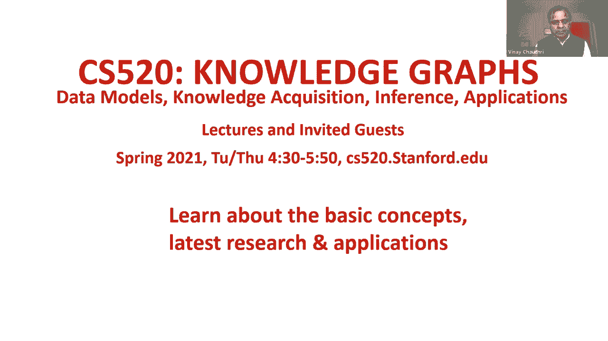

在本节课中，我们将要学习知识图谱的基本概念，了解它为何在当今的计算领域重新受到关注，并探讨其在搜索引擎、数据集成和人工智能等领域的应用。

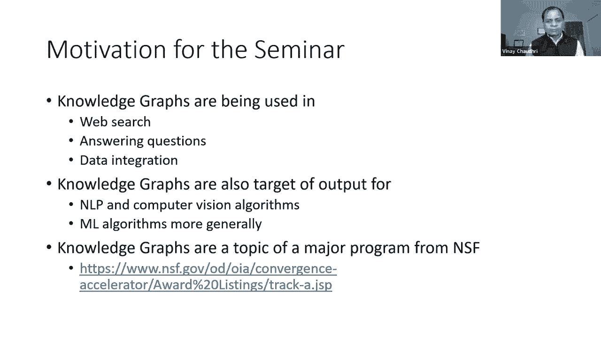

## 研讨会概述

本次春季知识图谱研讨会由纳伦和迈克共同组织。

我们组织这次研讨会的动机，是我们看到知识图谱被用于许多不同的应用，包括网络搜索、问答和数据集成。在自然语言处理和计算机视觉领域的许多领先会议上，知识图谱常被用作算法输出的表示形式，以及机器学习算法的输出。我们希望通过这次研讨会，传达知识图谱的基本思想、概念、理论和应用。

这个主题的重要性去年也得到了国家自然科学基金会的承认。他们资助了大约20个不同的知识图谱项目，作为其“收敛加速器”计划的一部分。我们将在后续课程中听到关于这些项目的介绍。

## 课程结构

尽管这是一个研讨会系列，但它有清晰的结构。前几节课的重点是：什么是知识图，它的数据模型是什么。然后我们会讨论如何创建知识图，以及知识获取的不同技术。一旦知识图被创建，我们将探讨如何对其进行推理，以及它如何与现代人工智能算法一起使用。在系列课程快结束时，我们会讨论当前知识图研究的应用前沿。

今年的课程设计有所不同。我们在星期二和星期四进行两次课程。星期二的课程是基于去年系列讲座要点的综合。我们把关键信息写成了一组笔记，可在课程网站上查阅。一些周二的会议可能有特邀嘉宾，但大部分材料是基于去年的内容综合而成。星期四的特邀会议将邀请来自学术界和工业界的嘉宾，每次会议通常有两场30分钟的专题介绍，并伴有问答环节。会议将被录音并发布在网站上。

对于斯坦福大学选修此课程的学生，要求是完成周二所有十节课的小测验，并为十个星期四会议中的任意八个提交书面摘要。

## 什么是知识图？

有了简短的介绍，让我们进入今天的主题：什么是知识图。我们将首先定义一个知识图，然后讨论为什么人们对这个话题重新产生了兴趣。为了讨论，我们将考虑三种不同的应用：搜索引擎、数据集成和人工智能。我也想向你传达，关于知识图，什么是新的和不同的。

### 知识图的定义

我们可以把知识图定义为**有向标记图**，其中节点和边具有明确定义的含义。

有向标记图是一个很好理解的数学概念，通常在离散数学入门课程中教授。我们在这里教授的内容与知识图谱应涵盖的内容之间的主要区别，在于特别注意定义节点和边的含义。我们将在本节课和整个系列中讨论定义意义的不同方法。

有许多数据模型使用有向标记图作为核心数学表示。它们可能用不同的名称来指代节点和边。我们将在下周的讲座中讨论数据模型，但现在我只想传达的是，在一些数据模型中，它们将节点和边称为**主语-谓语-宾语**的三元组。在其他一些数据模型中，它们将其称为**实体-关系-实体**三元组。你们中的许多人可能已经看到了**类层次结构**，在类层次结构中，节点是类，边由子类或子集关系标记。在这三个例子中的每一个，有向标记图都是底层表示的数学表征，而与节点和边相关联的名称则依赖于数据模型、预期用途或应用程序上下文。

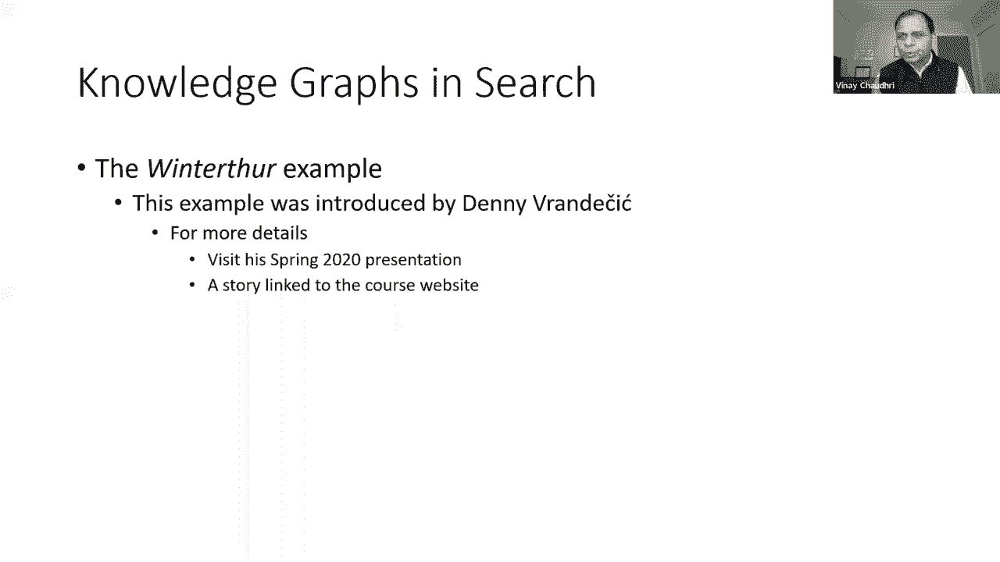

### 定义意义

现在让我们举一个有向标记图的具体示例，我们在其中捕捉到了阿特和鲍勃之间的友谊。这个小知识图说“阿特是鲍勃的朋友”。

出现的第一个问题是，我们如何将意义与这些节点和边联系起来。关于节点，我们可以说阿特和鲍勃代表现实世界中的人。关于“朋友”关系，我们可以通过简单的英语描述来定义其含义，或者我们也可以说，我们将把阿特和鲍勃之间的朋友联系定义为：如果在Facebook等社交网络上，阿特向鲍勃发送了一个好友请求并且鲍勃接受了这个请求，那么这种关系就成立。这是定义意义的一种方式。

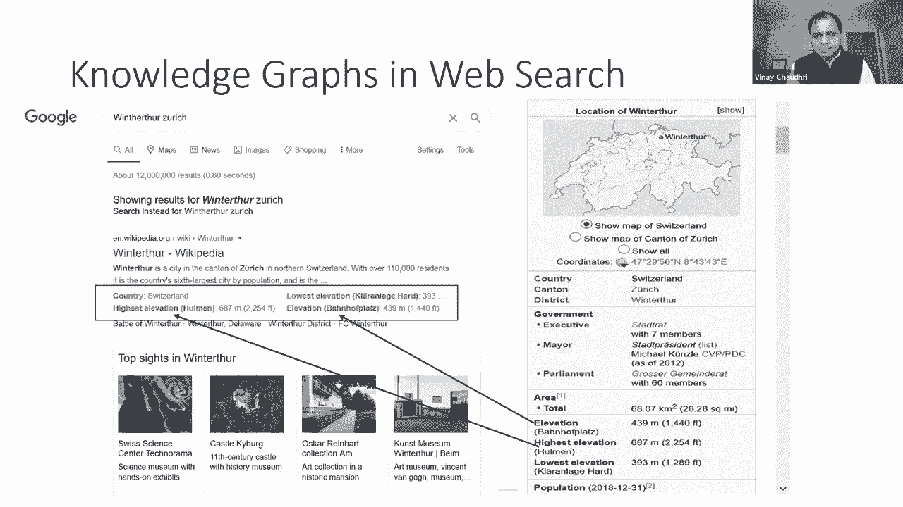

在子类关系的情况下，节点是抽象概念，它们不是现实世界中的个体。在这些情况下，大多数情况下，含义是使用文档定义的。如果你想更深入，你可以使用某种逻辑语言，对这些节点中每个节点的含义以及它们之间的关系进行逻辑规范。

这里的要点是，有许多不同的方法来定义节点和边的含义。含义可以根据现实世界中发生的事情来定义，它们可以被捕捉在用人类可理解的语言写的解释中（例如语言资源或WordNet）。含义可以使用一组公理或规则作为逻辑规范来定义。我们还可以用一组例子来定义意义。例如，在我们的知识图中，我们有一个叫做“猫”的概念，我们可以把很多猫的图像和那个节点联系起来，并说这个概念的意义是这些图像中传达的东西。

最近，人们对使用**嵌入**来捕捉意义很感兴趣，这是基于语料库统计。我们将在稍后的讲座中讨论嵌入。但我想在这里传达的主要是，有许多不同的方法来捕捉意义。事实上，计算捕捉意义的不同方法是计算机科学许多领域（包括人工智能和数据库系统）问题的一部分。我在这里列出的每一种方法都是不同的捕捉意义的方法，它们有一定的用途，在某些情况下是有用的。这些方法是不完整的，它们加在一起也不能完全理解意义。

毫不奇怪，在计算机科学中，特别是在知识表示和数据库系统中，有丰富的工作历史来研究捕捉意义的不同方法。在知识表示方面，最早的方法是使用一种叫做**语义网络**的符号，它本质上是一个有向标记图。语义网络进一步演变成**描述逻辑**，同时也有一种叫做**概念图**的表示技术的平行发展。在数据库系统的并行轨道上，早期的数据库系统具有网络结构，最终演变成今天很流行的关系数据库系统。也许与知识图最相关的工作是关于**三元组存储**的工作，当数据模型本质上是一组三元组时，人们试图研究相关技术。

所以这里的重点是，捕捉意义或将信息存储为三元组的企业，它有着丰富的历史，这本身并没有什么新鲜事。

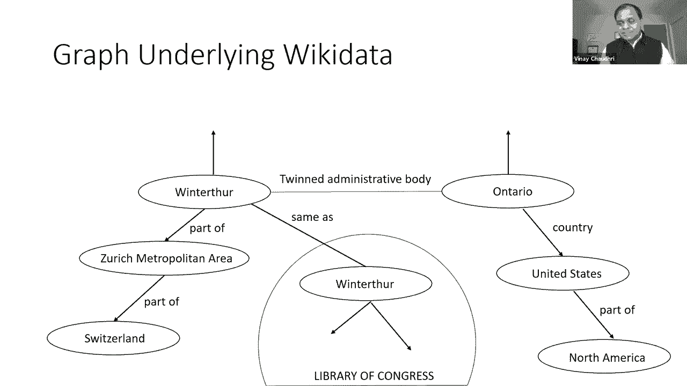

## 为何兴趣重燃？

我希望接下来解释这个领域的新情况，以及为什么人们的兴趣死灰复燃。我将举三个例子来做到这一点：搜索引擎、数据集成和人工智能。

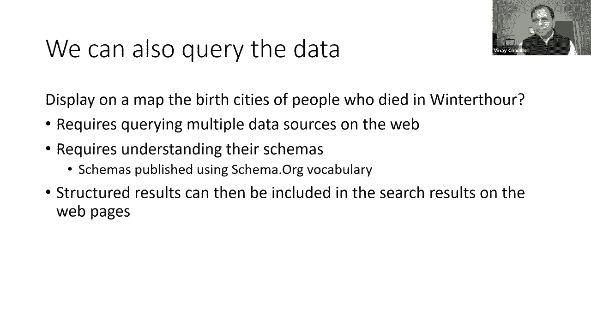

### 搜索引擎中的应用

为了解释知识图在搜索引擎中的应用，我举一个由丹尼·雷奇介绍的例子。我称之为“冬季旅游”的例子。

我们打开最喜欢的搜索引擎，键入“苏黎世冬季之旅”，我们得到一组结果。第一个结果碰巧是一个维基百科页面，然后有一组图像。我们可以点击第一个结果，这将把我们带到冬季之旅的实际维基百科页面。现在，搜索结果有趣的地方在于，在某个区域，它们也展示了一些事实。事实证明这些事实来自维基百科。如果你去冬季之旅的维基百科页面，你将能够看到这些事实直接来自维基百科中所谓的信息框。所以在这种情况下，搜索引擎足够聪明，意识到这类结构化信息是人们感兴趣的，它能够提取这些信息，并将其作为搜索结果的一部分显示出来。用这种方式，搜索结果正在使用维基百科中可用的结构化数据进行增强。

然而，这个例子只是使用结构化数据实际可能发生的事情的冰山一角。现在让我们来看看冰山。

让我们在维基百科页面向下滚动冬季之旅，在页面底部有一个部分提到了“双子镇”，列出了四个双子镇。现在，与冬季旅游完全无关，如果你在维基百科搜索一个叫“加州安大略”的小镇，在它的页面上，我们看到这个地区被称为“友好城市”。这里提到了冬季之旅。现在到底发生了什么？如果我们理解“友好城市”和“双子镇”的含义，我们知道它们是相同的概念。但是安大略省页面上提到的冬季之旅，并没有来自冬季之旅页面本身的后退指针。没有简单的方法来自动解决这个差异。理想情况下，我们希望这个参考资料是对称的。这是一个问题。

解决这个问题的一个可能的方法是**Wikidata**，这是一个巨大的公共策划的知识图。让我们看看Wikidata是如何解决这个问题的。如果我们搜索冬季旅游的信息，我们得到这样的页面。如果我们向下滚动，会发现一个称为“孪生管理机构”的关系，其中提到了安大略省。另一方面，如果你去安大略省的维基数据页面，有一个类似的部分“孪生行政机构”，这表明冬季之旅的关系是系统的。

现在到底发生了什么？下面有一个有向标记图表示，其中冬季之旅和安大略省是节点，两者之间有“孪生行政机构”的联系。它本身并不那么有趣，但更有趣的事实是，冬季之旅和安大略省都与许多其他事情联系在一起。例如，它是苏黎世大都市区的一部分，它在瑞士；安大略省在美国，它是北美的一部分，等等。

但冰山不止于此。原来网上还有很多其他组织使用Wikidata标识符发布数据。其中一个碰巧是国会图书馆，他们发布了很多关于维克多·图尔的信息。因为他们使用相同的标识符，我们很容易把这些信息与Wiki数据中可用的信息联系起来。网上还有很多其他来源在做同样的事情，它们链接到维基数据，并在它们之间建立联系。这是一个日益增长的运动。

真正强大的是，结构化数据可以对其运行查询。例如，如果你有一个查询，比如“在地图上显示在冬季旅游中死去的人的出生城市”，只使用一个地方的可用信息运行此查询并不容易。它要求我们在Web上查询多个数据源，要求我们理解它们的模式。为理解模式所做的一种努力被称为**Schema.org**，它致力于创建一个可用于在Web上发布数据的共享词汇表。借助来自Schema.org的共享词汇表，在网上查询这些来源的信息要容易得多，并将结果呈现在网上。这在今天是不可能的，但这个例子的全部意义是，如果我们能够利用知识图，将能够提高出现在Web上的搜索结果的质量。

现在你可能会问这有多真实。我没有关于Wikidata的确切最新数据，但一年前，它有超过8000万个对象，超过十亿的关系，它链接到超过4800个不同的公共目录。维基数据是当前链接到的目录之一。

在给出这个例子后，让我退后一步，强调这个知识图的一些独特之处，也指出今天可用的这些知识图有什么新的东西。

首先，这是一张规模空前的知识图表。我们从来没有交涉过Wikidata中存在的有向标记图表示的规模。第二，这个图表不是由一个人创建的，它是通过社区努力创建的。Wiki Data有一个帮助创建这些数据的策展人社区。还有其他组织，如国会图书馆，正在发布连接到Wiki数据的数据。维基数据中的数据很多都是手工制作的，也有很多是自动创建的（例如来自维基百科的解析或其他提取工具）。有多种方法可以将数据放入Wiki数据中。

然后是对意义的明确关注。通过Schema.org，有一项明确的努力正在进行中，以确保正在使用的标签有明确的含义。当然，肯定有一些正在使用的关系没有明确的含义，但是我们必须认识到，我们必须能够理解、同意并指定我们正在使用的关系的含义，这样我们就可以用它们来推断。

最后，这个知识图中的数据有一个明确的引人注目的用例。在这种情况下，碰巧是网络搜索，拥有数十亿用户和数十亿次查询。这本身就足以证明其存在和发展的必要性。但是Wikidata还有其他用例，有一些组织正在将Wikidata中的信息用于多种目的。

### 数据集成中的应用

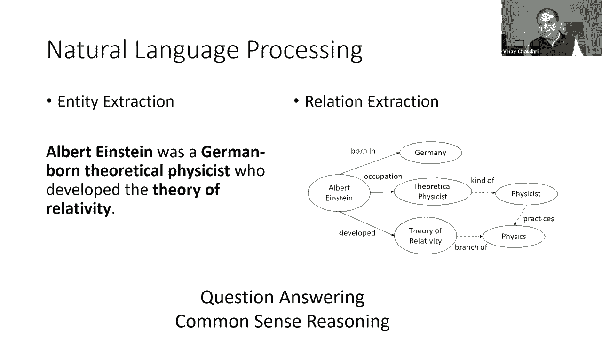

接下来，我将讨论知识图在数据集成上下文中的使用。我举一个例子，我称之为“360度的顾客视角”。

有很多组织有成千上万的客户，许多公司拥有数百万客户，并希望有效地管理这些关系。他们想有一个关于他们客户的完整视图。其中一些信息在他们内部的IT系统中，但其中一些存在于外部。现在有很多以商业方式出售此信息的数据提供者。

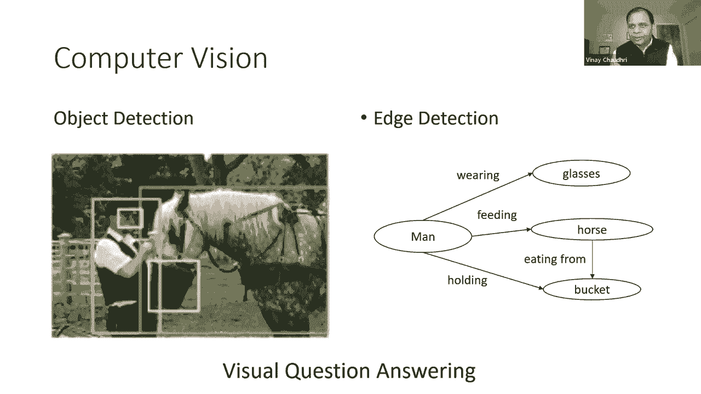

这里有一个例子，Pitch Book是一种数据提供商服务，它整理关于谁在资助哪个初创公司、资助了多少钱等信息。FactSet是另一个数据源，它管理关于供应链网络的信息，比如哪个供应商向哪个客户供货。

现在考虑一个应用程序，例如风险分析，在那里你正在做出一些贷款决定。知道特定公司的客户或供应商的情况如何，这种信息可能非常有用。但是要有效利用这些信息，他们必须能够将外部信息与他们内部现有的信息关联起来。类似地用于商业智能目的，如果他们想进行定向营销，例如针对最近筹集了大量资金的初创企业，他们需要宣传册上的信息，但他们必须能够将它与他们对内部客户的了解结合起来。

所以解决这个问题需要进行数据集成，他们必须能够结合来自这些不同来源的信息。

数据集成是一个已经存在很长时间的问题，人们已经在这方面工作了几十年。解决数据集成问题的核心挑战是，我们必须在这些多个来源之间进行数据转换，我们必须能够找出一个模式的哪些元素映射到不同模式中的哪些元素，我们必须能够定义那些映射，或者我们必须有一个共享的模式，所有这些源都被映射到其中。

但是为什么知识图因成为数据集成而变得流行或有趣？它们变得有趣的一个原因是，它们提供了一种**无模式的数据集成方法**。所以你要做的就是，从多个源获取关系数据，把它转换成三元组，将其存储在图形数据库中，你就有了集成的第一个版本。有些人甚至把这种简单的翻译称为知识图。但严格地说，这意味着你还没有真正解决问题，你只是将数据从一种格式转换为另一种格式。

但有趣的是，在本例中，定义延迟映射的艰苦工作，直到你真正需要它。这是更普遍的主张，即“按需付费”的基础数据集成。当你有一个特定的商业问题时，你去你的三元组存储看看你需要什么新的联系，让你经历建立这些联系的痛苦和代价，然后一旦你建立了这些联系，你就有即时价值。

那么，知识图或无模式的数据集成方法所做的，是降低了进入的门槛，你可以很快开始。有些人会说，当你使用知识图进行数据集成时，数据可视化更容易，它为图遍历优化。这些论点有一些可取之处，我们将在本系列的后面更深入地研究这些方面。但现在重要的是要明白，知识图已经成为数据集成的一种流行方法，因为它们减少了进入的障碍。

### 人工智能中的应用

现在我们来谈谈知识图是如何在人工智能中使用的。我将把它分解为使用知识图来表示输出，以及将知识图用于机器学习的输入。

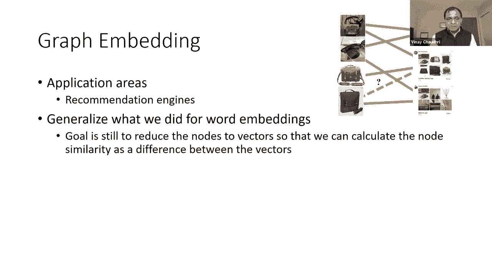

首先，我们将以自然语言处理为例。给定一个简单的句子：“爱因斯坦是德国出生的理论物理学家，他发展了相对论。”我们可以在上面运行实体提取任务并识别像阿尔伯特·爱因斯坦、相对论等实体。当然，实体提取比这更普遍，因为它还可以提取数字、日期、时间间隔等。但在大多数情况下，实体提取最常见的是提取名词短语。

显然我们不仅想做实体提取，我们还想要提取实体之间的关系。所以给了这样一句话，我们可以提取关系，例如“爱因斯坦出生于德国”、“职业是理论物理学家”、“他发展了相对论”。考虑到这些关系，将提取的信息表示为知识图是很自然的。

现在我们不想只是构建这个知识图，我们想用它来推断。我们想把意义和标签关联起来，这样我们就可以做问题回答，可以做常识性推理并得出结论，比如“阿尔伯特·爱因斯坦是物理学家”、“阿尔伯特·爱因斯坦开发了物理学新知识”等。我知道有些在NLP领域的人说，我们不需要指定这些标签的含义。但真正的问题是，你想用它们来做推理，所以不管怎样，你必须描述这些标签的含义，以及使用图形表示可以或不能得出什么结论。

接下来，让我们来看看计算机视觉问题。给定一张照片，我们想看看这张图片中存在什么对象，这是标准的对象检测任务。接下来我们想看看这些物体是如何相互关联的。所以在这张照片中我们可以看到一个男人戴着眼镜，一个人在喂马，马正在桶里吃东西，等等。计算机视觉在识别像这样的关系方面越来越好。但就像在NLP案例中一样，我们对仅仅用这样的图表示这些信息不感兴趣，我们希望能够用它来进行推理或视觉问答。对我们来说，能够进行系统的视觉问答，我们要担心这些标签的含义是什么，以及我们可以或不能用它们得出什么推论。

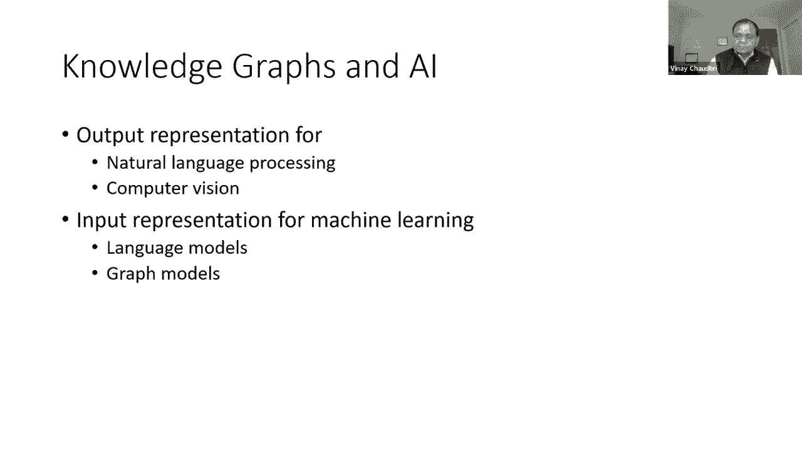

现在让我们把注意力转向知识图是如何用于机器学习的输入的。当前的机器学习算法需要数字输入。例如，你把某些数据输入回归模型或神经网络，你需要给它一组数字。但如果你要使用这些模型中的任何一个进行实体提取或关系提取，我们得给它们数字，但我们有的是文字。所以我们需要想出一些方法把我们的符号词转换成数字，这样它们就可以喂进这些学习模型。

所以**单词嵌入**和**图形嵌入**是已经变得非常流行的技术，用于将符号表示转化为数值表示，作为机器学习模型的输入。我会试着给你这些的直觉。

最初，单词嵌入发展到提供计算单词相似性的工具。例如，如果你想看“喜欢”和“享受”是否相似，我们需要一些方法来自动计算这个。但在一段时间内，人们发现这些单词嵌入通常对于各种语言理解任务是有用的。单词嵌入背后的关键思想是通过计数一个词出现在其他单词旁边的频率来捕捉单词的含义。

让我们把它具体化。假设我们有一个语料库，只有这三句话：“我喜欢知识图”，“我喜欢数据库”，“我喜欢跑步”。从这个语料库，我可以像这样计算数字。例如，在第一行，第二列，这个数字是2，因为“喜欢”在“我”旁边出现了两次。“享受”这个数字是1，因为“享受”只出现在“我”旁边一次。我可以类似地计算其他位置的数字，并创建你在这里看到的表单的矩阵。给定这样的矩阵，我们通常把它叫做**共现计数矩阵**。我们说一个词的意思是由对应于每一行共现计数的向量捕获的。所以在这种情况下，“我”的意思是由这第一行数字捕获的。如果你想计算两个单词之间的相似性，我们简单地计算两个向量之间的距离。

这里的关键洞察力是，我们已经把符号文字变成了数字，现在我们有了数字，可以输入我们的学习算法。现实当然比这个故事复杂得多，因为我们的文本语料库不会只有三个句子，它将有数十亿字。如果你用我刚刚解释的朴素方法，存储需求会激增。在实践中，你必须进行降维。典型的字向量表示大小通常在两百维左右。还有其他技术，如奇异值分解，以及自动学习如何选择我们要代表一个词的那200个数字的技术。有一整条航线致力于如何很好地完成不同形式的单词嵌入。在实践中大量使用单词嵌入，例如，如果你进入搜索引擎开始打字，它开始预测你接下来可能键入的东西，这本质上是由单词嵌入驱动的语言模型。

现在让我们把注意力转向图嵌入。图嵌入的一个流行应用领域是推荐。所以如果你在电子商务网站上，这些公司对向顾客推荐他们应该买的其他东西感兴趣。他们有很多类似客户购买的历史数据。在过去，这些数据以图形形式存在。在这个图中，每个节点都是一个产品，两个产品之间有一条边，如果这些产品往往是被一起购买或互相推荐的。但本质上这是一个象征性的结构。机器学习非常擅长预测事情，但你必须给它数字输入。但如果你想利用这种存在于符号形式的历史趋势，用机器学习来做预测，我们得把它转换成某种数字形式。

所以这里的问题和目标与我们的NLP案例类似。我们必须能够把这个离散的符号结构转换成向量，这样我们就可以计算节点相似性，计算节点之间的差异，并把它们作为输入进入机器学习算法。

要理解这一点，我要打个比方。既然我们已经明白了我们是如何计算单词嵌入的，我们可以说，我们处理的句子可以看作是一个线性图，其中每个节点是一个词，词与词之间有一个边缘。我向你展示的单词嵌入计算可以被视为在这个线性图上的嵌入。所以这个类比真的很有帮助，因为它帮助我们立即看到如何将离散图变成一条线性路径。我们所要做的就是随机地在图上行走，每次我们随机走图表，我们会得到一个线性路径。然后在线性路径上，我们可以数出哪些节点彼此共存的频率，我们可以建立一个共现计数矩阵，就像我们做单词嵌入那样。

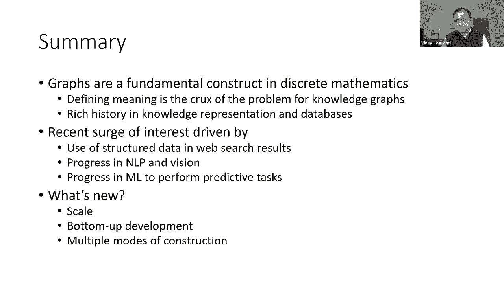

鉴于这种方法，我们可以计算图嵌入，实际上是节点的嵌入，它们被称为**节点嵌入**。给定这些节点嵌入，我们可以很容易地计算出节点相似性以及它们之间的接近程度。正如我提到的，图嵌入这个词通常指整个图的嵌入。如果要计算整个图的嵌入，一个简单的方法是取单个节点嵌入的总和，它给出了整个图的嵌入。

现在，我应该说，我呈现给你的是一幅天真简单的画面，因为我想在这里传达直觉