# 2：L2 - 知识图谱的What和Why 🧠

## 概述

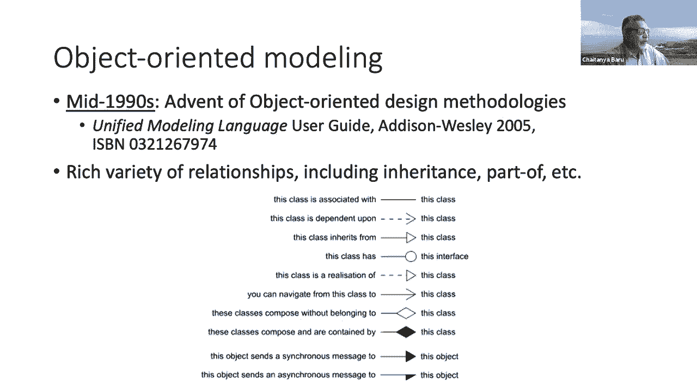

在本节课中，我们将要学习知识图谱的基本概念及其重要性。我们将从数据管理的历史演变开始，探讨为何在当今大数据时代需要知识图谱，并了解其核心构成、应用场景以及面临的挑战。

---

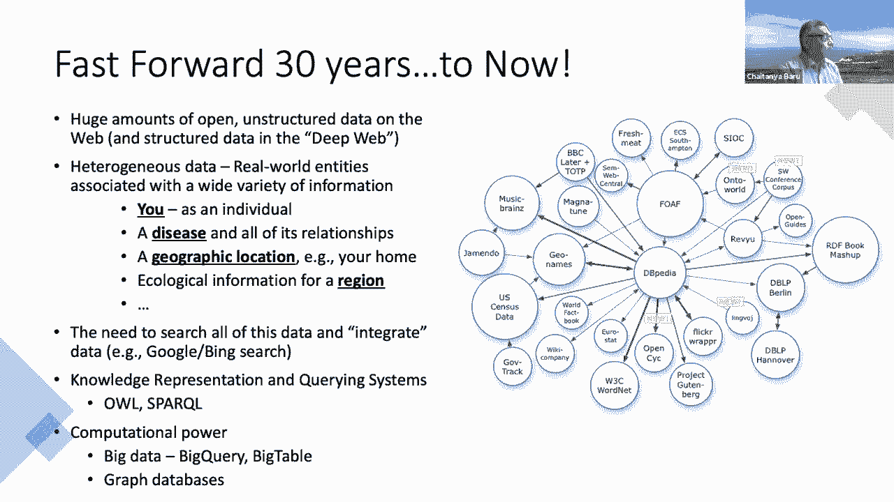

## 数据管理的演变：从存储到关联

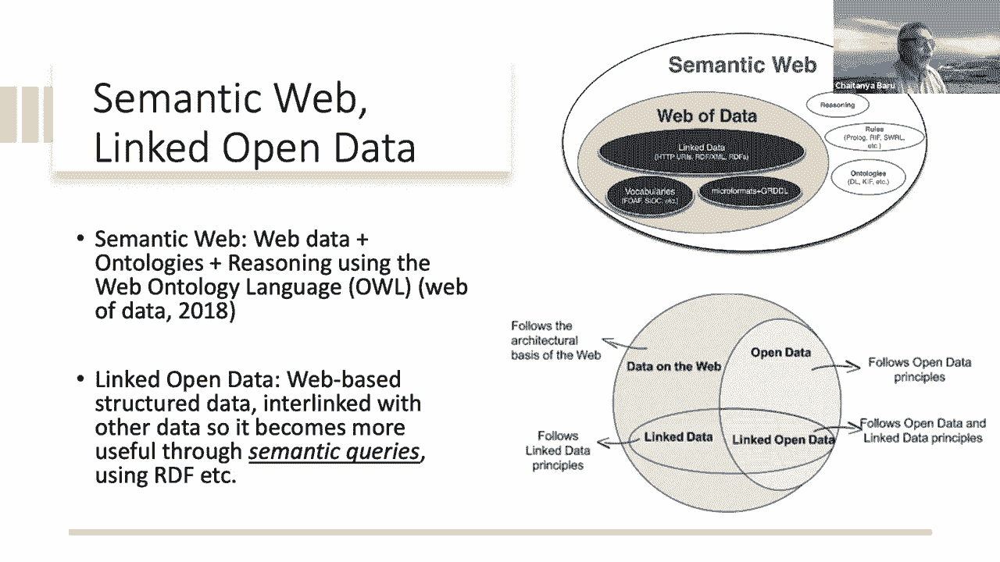

上一节我们介绍了课程概述，本节中我们来看看数据管理思想的演变过程。

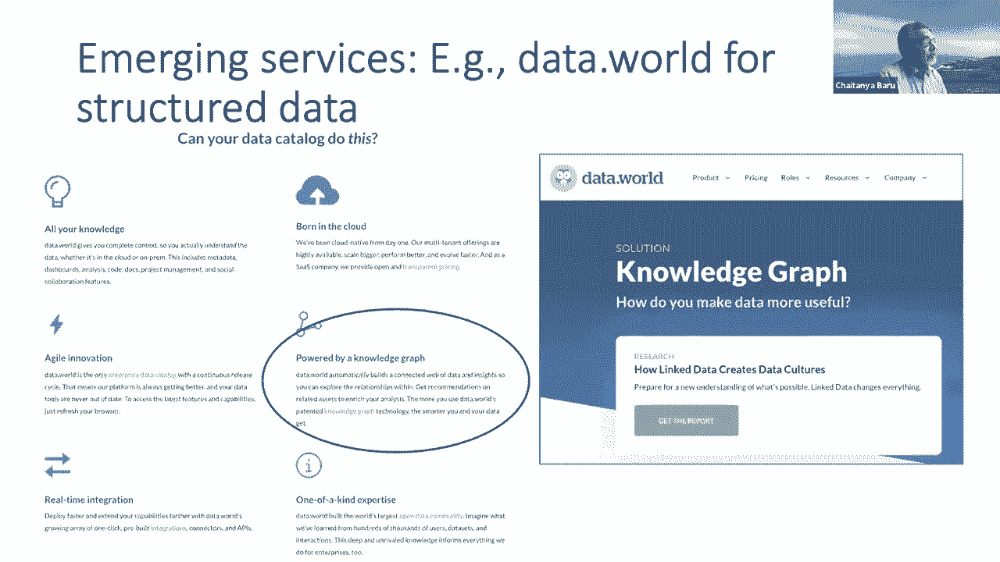

早期的商业计算主要关注如何有效地存储和处理数据。人们很早就意识到，许多应用中的数据可以用节点和边构成的图来表示。例如，教授、课程和课程安排之间就存在复杂的关联关系。

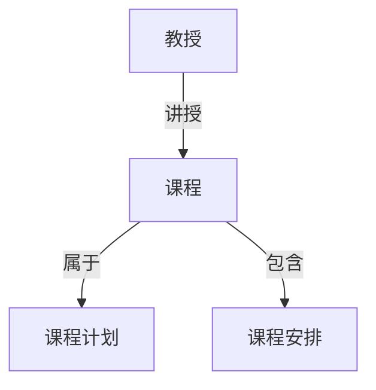
```mermaid
graph TD
    A[教授] -->|讲授| B[课程]
    B -->|属于| C[课程计划]
    B -->|包含| D[课程安排]
```

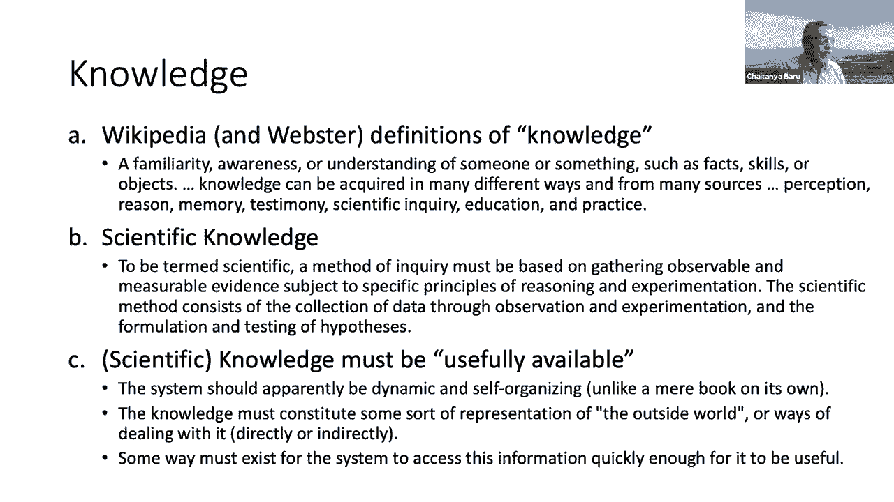

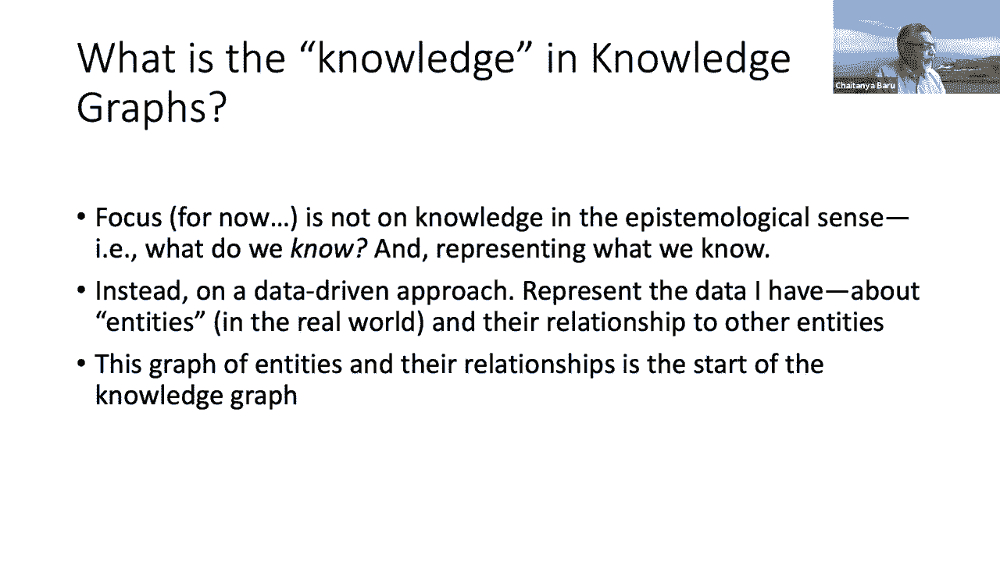

然而，当时的焦点更多在于如何将这些逻辑关系高效地物理存储在磁盘上，逻辑表达与物理存储之间缺乏透明度。

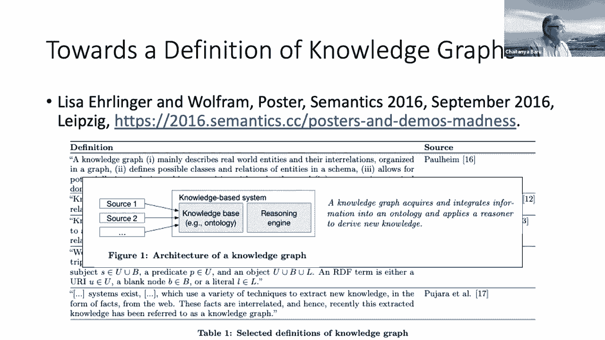

到了20世纪70年代中期，实体-关系模型（E-R模型）的出现标志着一次进步。这个模型更侧重于概念建模，用于捕捉现实世界应用中的实体和关系，而不必直接映射到具体的物理存储方式。

进入20世纪90年代，面向对象模型开始流行。人们认识到对象之间存在着多种不同类型的关系，例如类之间的继承、组合以及一对多、多对多等关联，这使得数据模型变得更加丰富。

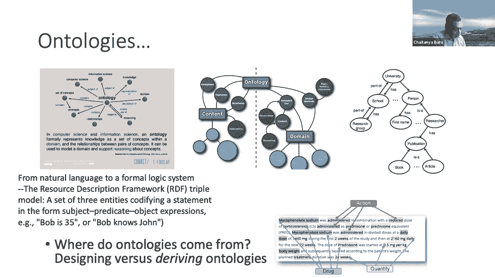

## 大数据时代的挑战与语义网的兴起

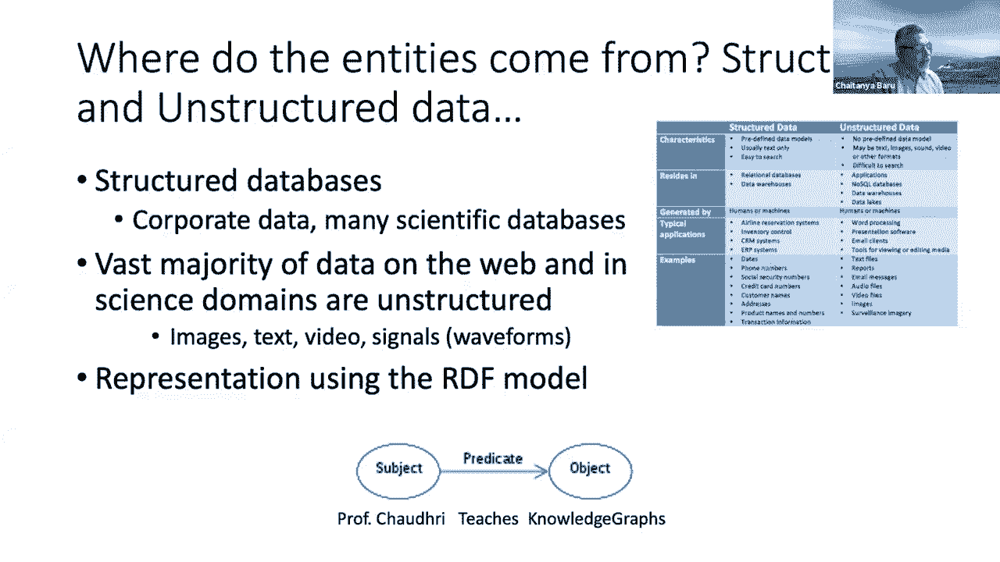

上一节我们回顾了数据模型的发展，本节中我们来看看大数据和互联网带来的新挑战。

计算能力的提升和互联网的普及导致了数据量的爆炸式增长。网络上的信息高度异构且相互关联，包括非结构化文本、图像、个人数据、科学数据等。我们面临的挑战是：如何以一种合理的方式搜索、管理和利用这些海量且关联的数据？

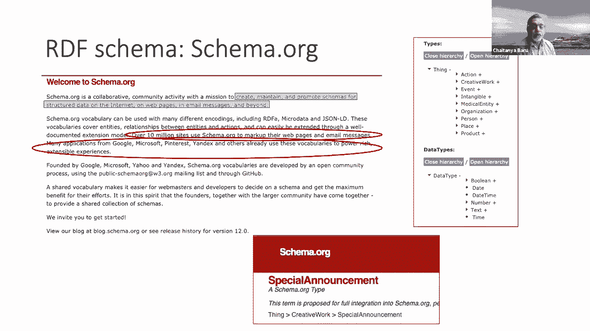

这引出了**语义网**的概念。语义网不仅关注网络数据的链接结构，还强调使用标准化的词汇和**本体**来定义信息的含义及其相互关系。另一个相关概念是**关联开放数据**，它倡导使用标准网络协议和RDF等框架来发布和链接数据。

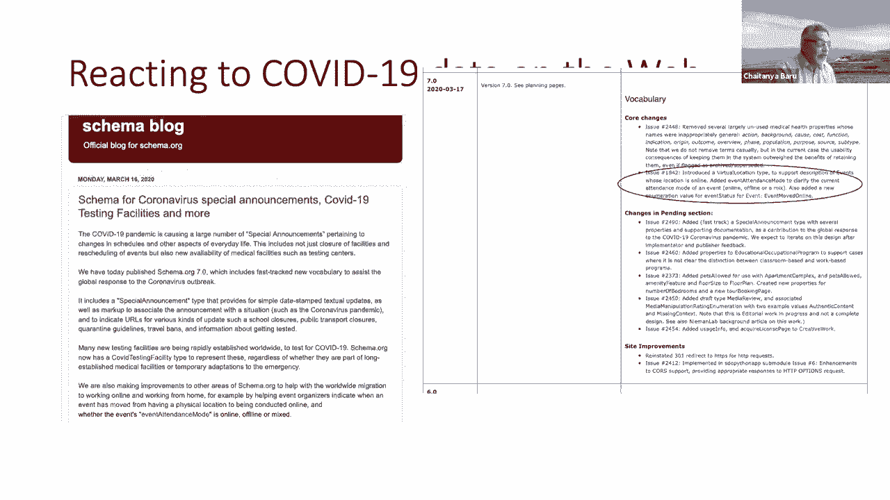

以下是语义网技术栈的核心组成部分：
*   **标准化词汇与本体**：用于定义概念和关系。
*   **资源描述框架**：即RDF，一种用于描述资源的简单数据模型。
*   **查询与推理**：通过规则和推理系统挖掘深层关联。

## 什么是知识图谱？

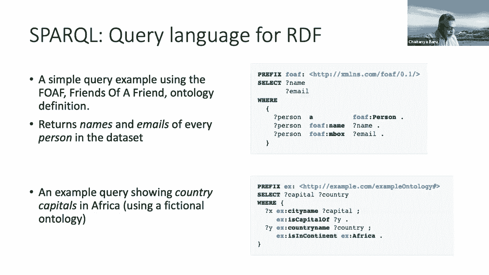

上一节我们了解了数据关联的背景，本节中我们正式定义知识图谱。

我们不对“知识”进行哲学层面的讨论，而是采用一种数据驱动的视角。**知识图谱**是一种用于表示现实世界实体及其关系的图结构。它由“节点”（实体）和“边”（关系）构成。

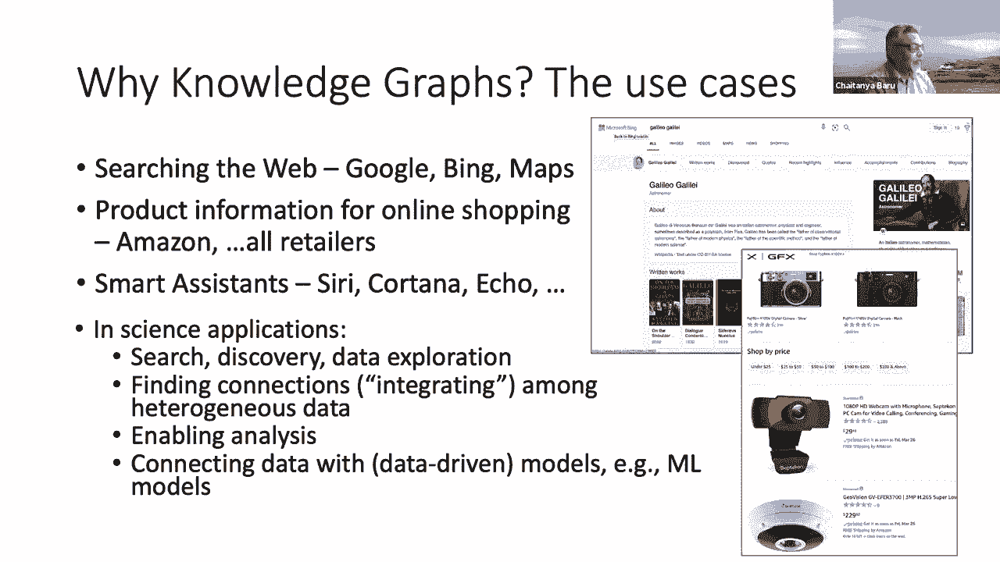

一个完整的知识图谱系统通常包含以下部分：
*   **知识库**：存储实体和关系数据本身。
*   **本体**：定义数据的结构、概念层次和关系约束。
*   **推理引擎**：支持查询和基于关系的逻辑推理。

## 本体的角色与构建

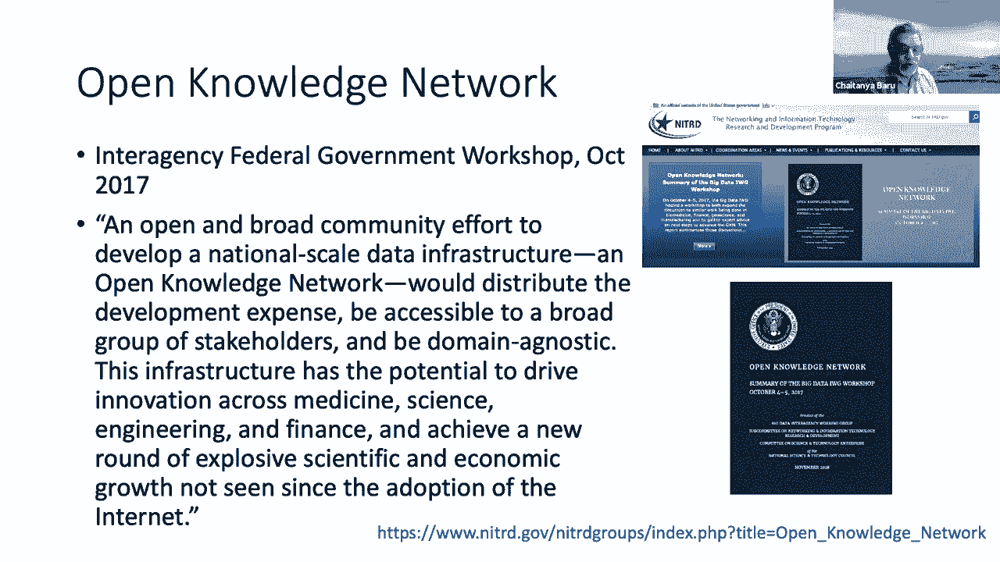

上一节我们介绍了知识图谱的构成，本节中我们深入探讨其中的核心——本体。

**本体**是对领域内概念及其关系的正式表述。它有两个主要作用：一是帮助形式化地表达数据内容的结构；二是帮助定义领域本身的概念体系。

构建本体主要有两种方法：
1.  **人工设计**：由领域专家根据经验共同讨论和定义。
2.  **从数据中推导**：利用自然语言处理等技术，从非结构化文本中自动提取实体和关系，再经专家校验形成。

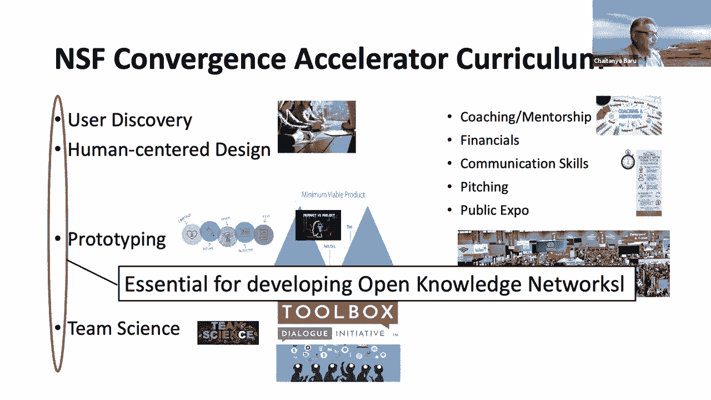

## 从数据到结构：RDF与Schema

上一节我们讨论了本体的构建，本节中我们看看如何用具体的技术表示这些结构。

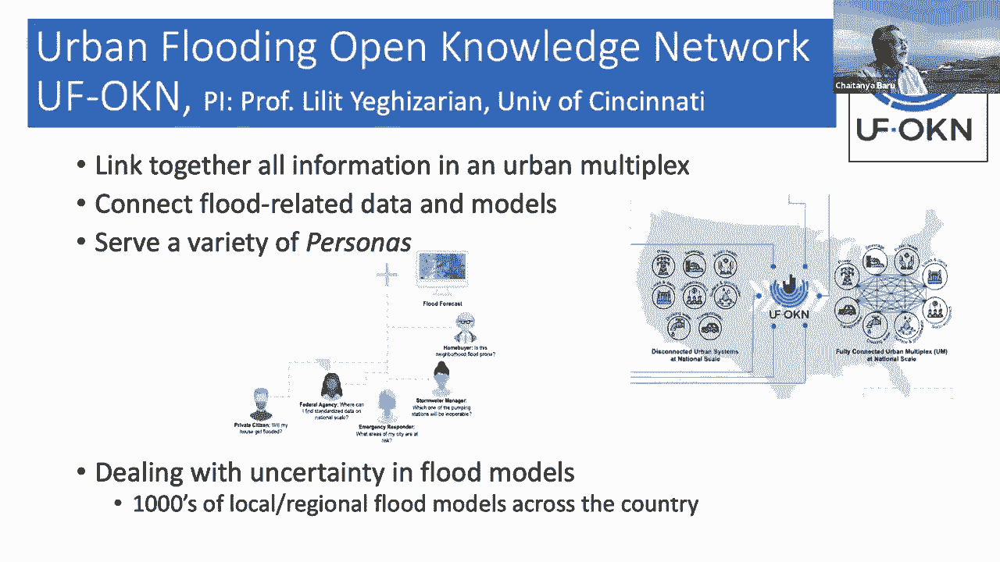

现实世界中存在大量结构化和非结构化数据。知识图谱致力于从这些数据中提取结构。**RDF**是一种基础且强大的表示模型，它使用“主语-谓语-宾语”的三元组形式来描述事实。

为了表达比简单三元组更复杂的约束和关系，我们需要**模式**。`schema.org`是一个成功的例子，它提供了一套共享的词汇表，允许网站用结构化数据标记其内容，从而被搜索引擎更好地理解和展示。这种模式具有高度可扩展性，能够快速适应新需求（例如，在COVID-19疫情期间迅速扩展了相关词汇）。

## 为何需要知识图谱？

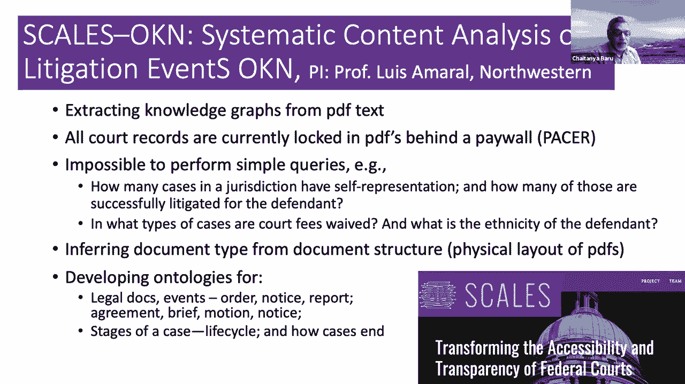

上一节我们介绍了知识图谱的技术基础，本节中我们探讨其应用价值。

在商业和互联网领域，知识图谱已广泛应用于：
*   **增强搜索**：如Google、Bing，能理解查询意图并展示关联实体信息。
*   **智能推荐**：如电商平台，利用关系网络实现“购买此商品的人也购买了...”。
*   **智能助手**：如Siri，提供更精准的答案。

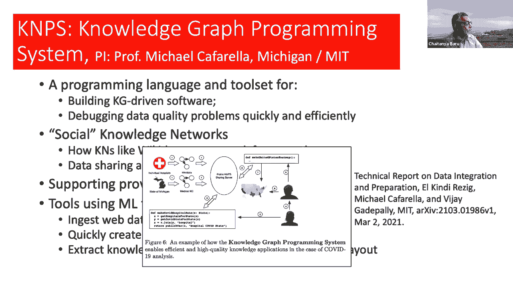

在科学领域，知识图谱同样至关重要：
*   **数据发现与探索**：帮助科学家在海量数据中快速找到所需信息。
*   **异构数据集成**：将来自不同学科、不同格式的数据关联起来，支持跨领域研究。
*   **连接数据与模型**：建立科学数据与机器学习模型之间的关联，追踪数据来源和模型适用范围。

## 实践中的知识图谱项目

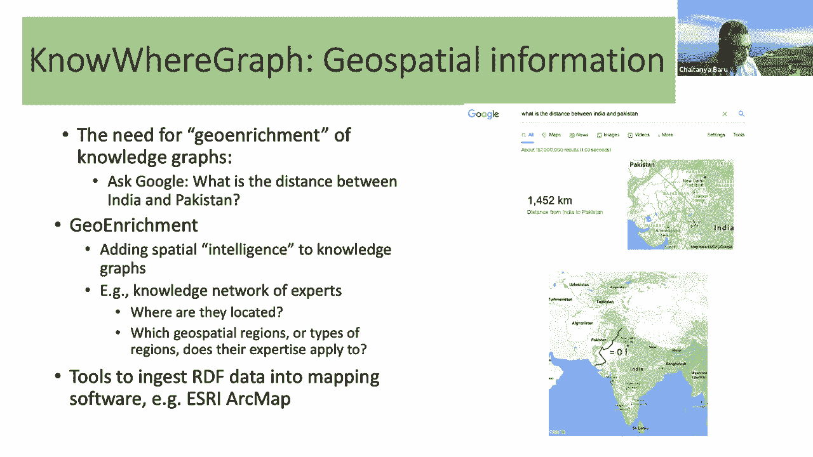

上一节我们了解了知识图谱的用途，本节中我们通过几个实际项目来加深理解。

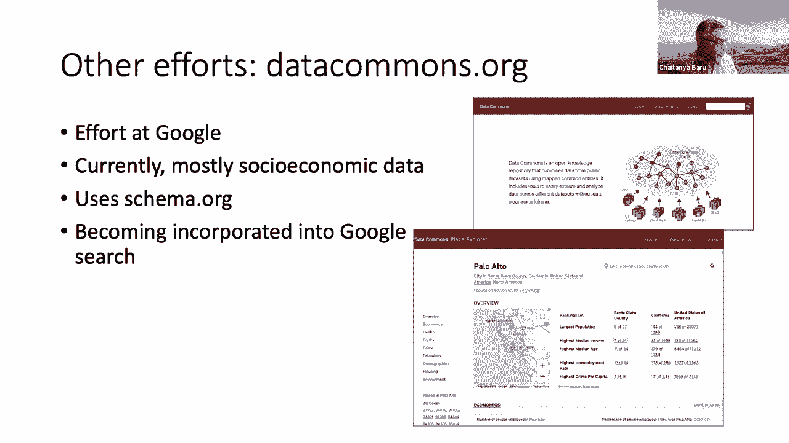

美国国家科学基金会的“融合加速器”计划资助了多个知识图谱项目，以下是其中几个例子：

1.  **城市洪水应对**：整合电网、道路、公共卫生、社会经济等孤立数据，结合洪水预测模型，构建城市洪灾知识图谱，为不同用户（市民、市政管理者）提供定制化视图。
2.  **生物医学研究**：集成基因、疾病、组织表达等多源生物医学数据，构建知识图谱以发现疾病间的相互作用，并探索药物重用的新可能。
3.  **法庭记录开放化**：处理PDF格式的公共法庭记录，提取法官、案件类型、当事人等实体，构建法律领域本体，使公众能自由查询和分析司法数据。
4.  **知识图谱编程环境**：开发类似IDE的工具，提升构建知识图谱系统的抽象层次，内置数据质量调试和溯源功能，并支持团队协作开发。
5.  **地理空间知识增强**：改进知识图谱对地理空间信息的处理能力，使其能理解复杂的空间关系（如邻接、包含），并与ArcGIS等专业工具集成。

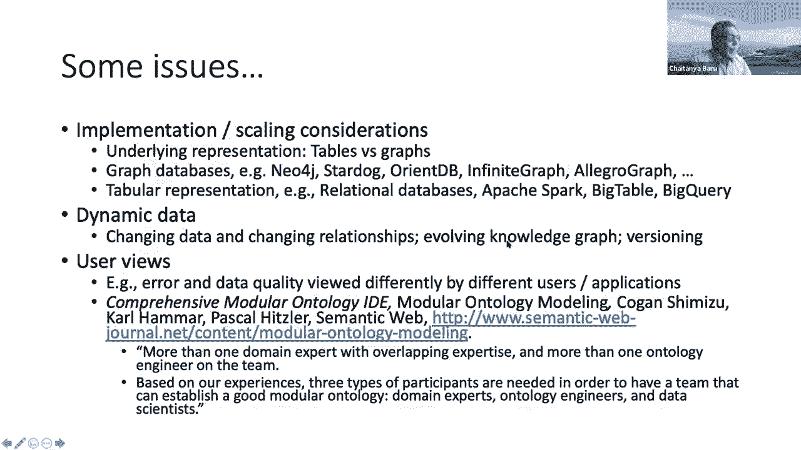

此外，像Google的`datacommons.org`等项目，通过将公共数据集转化为知识图谱，提供了强大的数据探索工具。

## 挑战与未来方向

上一节我们看了一些前沿项目，本节中我们总结知识图谱面临的主要挑战。

尽管知识图谱前景广阔，但仍存在诸多挑战：
*   **系统实现与性能**：如何高效存储和查询超大规模图数据。
*   **动态性与版本控制**：知识本身不断演化，图谱需要支持动态更新、版本管理和一致性维护。
*   **用户视角与数据质量**：需要根据不同用户的需求提供不同粒度和可信度的信息视图。数据质量评估和不确定性处理是关键。
*   **团队协作**：构建高质量的知识图谱需要领域专家、本体工程师、数据科学家和技术人员的紧密合作。

## 总结

本节课中，我们一起学习了知识图谱的核心概念。我们从数据管理的历史出发，理解了在大数据时代，知识图谱作为关联和整合异构数据的关键技术的重要性。我们探讨了其以RDF三元组和本体为基础的技术原理，并看到了它在商业搜索、科学发现等多个领域的强大应用。最后，我们也了解了构建和维护知识图谱所面临的动态性、协作性等现实挑战。知识图谱正在成为驱动未来数据智能不可或缺的基础设施。

---
*注：本教程根据陈巴尔博士的讲座内容整理，旨在为初学者提供清晰的知识图谱入门指引。*