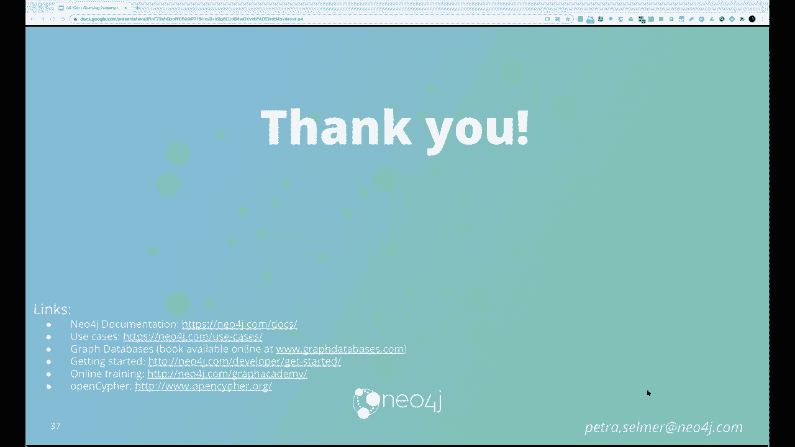

# 4：L4.1 - 应用Cypher进行图谱查询 🗺️


在本节课中，我们将要学习知识图谱查询语言Cypher。课程将首先回顾属性图数据模型，然后深入介绍Cypher查询语言的核心概念与语法，特别是其强大的模式匹配功能。我们还将了解Cypher的标准化进程以及未来的扩展方向。

## 属性图数据模型回顾

上一节我们介绍了知识图谱的两种主要数据模型。本节中，我们来看看属性图数据模型的具体构成。

属性图数据模型主要由三个结构组成。

以下是其核心组成部分：

1.  **节点**：表示图中的实体。一个节点可以有零个或多个标签，也可以有零个或多个属性（即键值对）。两个标签集完全相同的节点，其属性集可以完全不同。
2.  **关系**：表示连接节点的有向边。一条关系必须有且仅有一种类型，并且具有方向（从起始节点指向结束节点）。关系也可以拥有零个或多个属性。关系必须连接一个起始节点和一个结束节点（允许自环）。
3.  **属性**：是附着在节点和关系上的键值对，用于存储具体数据。属性名通常是字符串，属性值可以是整数、浮点数、字符串、列表等多种数据类型。

## Cypher查询语言介绍

了解了数据模型后，本节我们来看看专为属性图设计的查询语言——Cypher。

Cypher由Neo4j在2010年开发，并于2015年开源。它深受SQL和Spark的影响，具有声明式、直观的特点。其核心优势在于将图形模式作为一等公民，使得表达复杂的关系遍历和路径查询变得非常简单。

Cypher的主要特性包括用于查询的`MATCH`子句、用于数据操作的DML语句，以及用于管理约束和索引的DDL语句。它特别适用于需要深度探索实体间关系、发现路径或处理高度连接数据的场景。

## Cypher核心：模式匹配

Cypher跳动的心脏是图形模式匹配。其语法采用了一种类似ASCII艺术的形式，使得写在白板上的图形能直接转换为查询语句。

在`MATCH`子句中，我们用圆括号 `()` 表示节点，用箭头 `-->` 或 `--` 表示关系。

以下是模式的基本写法：

*   **节点模式**：`(variable:Label {key: value})`。其中`variable`是变量名，`Label`是节点标签，`{key: value}`是属性过滤条件。
*   **关系模式**：`-[variable:Type {key: value}]-`。箭头方向表示关系方向。

一个基础的查询结构通常为：`MATCH ... WHERE ... RETURN ...`。`MATCH`用于描述要查找的图形模式，`WHERE`用于添加过滤谓词，`RETURN`用于定义返回的结果投影。

## 高级模式匹配功能

掌握了基础模式后，本节中我们来看看Cypher更强大的高级匹配功能，这是它与SQL的重要区别之一。

**1. 可变长度路径**
允许匹配长度不固定的路径，这对于查找多度关系至关重要。
*   `(a)-[:FRIEND*]->(b)`：匹配任意长度的`FRIEND`关系路径。
*   `(a)-[:FRIEND*2..4]->(b)`：匹配长度为2到4的`FRIEND`关系路径。
*   `(a)-[:LIKES|:KNOWS+]->(b)`：匹配由`LIKES`或`KNOWS`关系构成的一条或多条边。

**2. 返回路径**
Cypher可以返回整个路径，而不仅仅是节点或关系。
```cypher
MATCH p = (a)-[:FRIEND*]->(b)
RETURN p, nodes(p), length(p)
```

**3. 线性组合与WITH子句**
`WITH`子句用于将查询分阶段执行，实现中间结果的传递和聚合，类似于管道。
```cypher
MATCH (person:Person)
WITH person, count{(person)-[:FRIEND]->()} AS friendCount
WHERE friendCount > 10
RETURN person.name, friendCount
```

## 开放Cypher项目与标准化

随着图数据库的普及，出现了多种查询语言。为了推动行业标准化，开放Cypher项目应运而生，并催生了GQL（图形查询语言）标准。

开放Cypher项目提供了语言规范、形式语义和测试套件，以促进不同实现之间的兼容性。与此同时，ISO组织正在推动两项标准：
1.  **GQL**：一种全新的、独立的属性图查询语言标准。
2.  **SQL/PGQ**：SQL标准的属性图查询扩展，允许在关系数据库上虚拟化并查询图数据。

这两项标准共享核心的图形模式匹配能力，并计划在未来支持更复杂的特性，如多图查询、图模式和图计算。

## 未来扩展方向

最后，我们简要展望一下Cypher和GQL未来的发展方向。

未来的扩展将包括更强大的**路径模式**，允许重复复杂的子模式而不仅仅是单一边标签。此外，还将增强对**匹配语义**的控制（如同构、同态），提供更多的**路径结果修饰符**（如所有最短路径），引入丰富的**图形数据类型**，以及支持**多命名图**的操作和**图组合**功能，以构建复杂的数据处理工作流。

## 总结

本节课中我们一起学习了属性图数据模型和Cypher查询语言。我们从数据模型的基本构成开始，深入探讨了Cypher以模式匹配为核心的查询范式，包括基础语法、可变长度路径、返回路径和`WITH`子句等高级特性。最后，我们了解了Cypher通过开放项目推动标准化，以及未来GQL和SQL/PGQ的发展方向。掌握Cypher是高效查询和分析知识图谱数据的关键技能。



***


