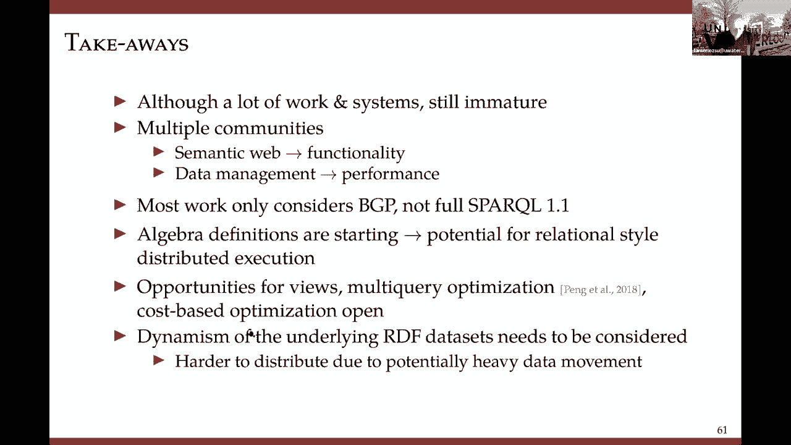

# 5：L4.2 - 分布式RDF数据管理与查询 🗄️


## 概述

在本节课中，我们将要学习如何管理和查询大规模分布式RDF数据。随着RDF数据集的快速增长，传统的集中式处理方法已无法满足需求，因此分布式解决方案变得至关重要。我们将探讨几种主流的分布式RDF数据处理方法，包括查询分区系统、部分查询评估以及基于云的解决方案，并了解联邦查询系统如何整合多个独立的数据源。

---

## RDF与SPARQL基础回顾

上一节我们介绍了RDF的基础知识，本节中我们来看看对后续讨论至关重要的两个概念：SPARQL语义和查询形状。

首先，我们专注于SPARQL的一个子集，称为**基本图模式**。一个仅由三元组模式集合构成、不含`UNION`、`OPTIONAL`等操作的查询，就是一个BGP。其语义是**子图同态匹配**。你可以将其理解为：在RDF数据集中，为查询中的每个三元组模式找到所有匹配的具体三元组，然后对这些匹配结果进行**连接**操作。

例如，对于一个包含变量`?s`和`?o`的查询，其核心操作是执行**主语-主语连接**和**主语-宾语连接**。

```sparql
# 一个基本的图模式查询示例
SELECT ?s ?o WHERE {
    ?s :predicate1 ?o .
    ?s :predicate2 ?x .
    ?x :predicate3 ?o .
}
```

其次，SPARQL查询具有特定的**形状**，这在分布式处理中扮演重要角色。大多数查询是**星形**的，即一个中心顶点通过多个谓词边连接到其他顶点。此外，还有链形、树形、环形以及更复杂的形状。复杂的查询通常是多个星形查询的互连。

---

## 图分区技术

在深入分布式系统之前，我们需要理解数据是如何被分布的。图分区的目标是将一个大型RDF图分割成多个部分，并分配到不同的工作节点上，以实现并行查询处理。

以下是两种主要的图分区方法：

*   **顶点不相交分区**：每个顶点只属于一个分区。这会导致边被“切割”，即一条边的两个端点可能位于不同分区。我们的目标是**最小化这种边切割**，因为跨分区的边会导致节点间的通信开销。简单的哈希分区虽然平衡性好、速度快，但会产生大量的边切割和中间结果。更高级的算法如 **METIS** 通过对图进行粗化、分区再细化的过程来获得更好的切割效果，但其计算开销较大。
*   **边不相交分区**：每条边只属于一个分区。这会导致顶点被**复制**到多个分区中。在RDF这种简单的图模型中，顶点更新问题不突出，因此这种方法被广泛用于基于云的系统中。其优势在于，可以将具有相同谓词的边分组到同一个文件，从而在查询时最小化需要扫描的数据量。

核心问题在于，对于RDF图，真正影响连接性能的往往不是最小化边切割，而是最小化**谓词切割**。我们稍后会看到这一点。

---

## 分布式RDF系统分类

现在，我们来看看三种主流的分布式RDF数据处理方法。

### 1. 查询分区系统

这类系统从已分区的RDF数据集出发。核心思想是将一个SPARQL查询也分解成多个子查询，目标是让每个子查询能够在一个数据分区上独立执行，从而避免昂贵的跨分区连接操作。

这种方法与关系数据库中的分布式查询处理非常相似。关键在于**如何协同设计数据分区和查询分解策略**，以最小化分区间连接。

以下是两种代表性策略：

*   **N跳复制**：首先使用如METIS等方法对图进行基础分区。然后，将每个分区边界内`N`跳可达的顶点复制到该分区中。对于一个查询，如果其半径（最远距离）小于等于`N`，则可以在单个分区内完整执行；否则，需要将查询分解为多个半径更小的子查询。
*   **语义哈希**：根据三元组中主语、谓语或宾语的相同性，将三元组分组。然后使用哈希函数将这些组分配到不同机器，并允许有策略的复制。通过扩展分区的边界，可以使更多查询能在本地独立处理。

我们的一项研究工作提出，与其最小化边切割，不如有选择地最小化**关键谓词**上的切割，即使这增加了总边切割数，也能显著增加可独立执行的查询类别。我们采用了一种基于弱连通分量的贪婪算法来选择“超级顶点”进行粗化分区。

**总结**：查询分区方法性能很高，特别适合在分区的RDF数据上实现并行化。但查询分解本身是一个难题，且与数据分区策略紧密耦合。目前，还缺乏像关系代数那样成熟的查询优化框架。

### 2. 部分查询评估

这类系统同样使用分区的RDF数据，但不对查询进行分解。相反，它们采用**部分求值**技术。

其原理是：将一个函数`f(x)`重写为`f'(s, d)`，其中`s`是已知输入，`d`是未知输入。先基于已知输入`s`执行`f'`得到部分结果，再结合未知输入`d`计算最终结果。

在我们的场景中：
*   **已知输入**：查询本身 + 分区内的数据 + 跨分区的“边界”信息。
*   **执行过程**：将查询发送到每个数据分区，各分区基于本地数据和已知的边界信息计算**部分结果**。由于缺少跨边界的完整匹配，这些不是最终答案。最后，需要一个**组装阶段**来合并所有部分结果，这个阶段可以是集中式的，也可以是分布式的。

**总结**：部分查询评估避免了复杂的查询分解，通过并行计算部分结果再合并来实现高效查询。但它要求底层的RDF系统能够支持这种部分求值操作。

### 3. 基于云的解决方案

在这种方案中，RDF数据被分区存储在分布式文件系统（如HDFS）上，SPARQL查询被转换为一系列的 **MapReduce作业** 来执行。

这是一种典型的数据并行执行模型。通常采用**边不相交分区**，特别是按**谓词**进行分区。例如，所有具有“姓名”谓词的三元组存储在一个文件中，所有具有“出生地”谓词的三元组存储在另一个文件中。

查询处理流程大致如下：
1.  对于查询中的每个三元组模式，选择一个对应的数据文件。
2.  为每个三元组模式启动一个MapReduce作业，进行模式匹配。
3.  最后，启动另一个MapReduce作业，对所有中间结果进行连接操作。

**总结**：基于MapReduce的系统天生具有高可扩展性和容错性。但其性能受限于MapReduce框架本身，大量的中间结果需要读写HDFS，多个作业间的衔接也会带来额外开销。

---




## 联邦查询系统

上一节我们讨论了如何拆分单个大数据集，本节中我们来看看如何整合多个独立的数据源。联邦系统用于处理分布在多个**SPARQL端点**（即能执行SPARQL查询的数据源）上的RDF数据。

其核心思想是**数据集成**。通常有一个控制站点维护所有数据源的元数据（如访问模式、能力描述）。当收到一个查询时：
1.  控制站点将查询**分解**成多个子查询。
2.  根据元数据，为每个子查询**选择**最合适的数据源。
3.  将子查询发送到对应的SPARQL端点执行。
4.  从各端点取回**部分结果**，在控制站点进行**连接和组装**，得到最终答案。

例如，一个查询可能部分需要在GeoNames端点上执行，另一部分需要在DBpedia端点上执行。

**挑战**：
*   **源选择**：如何知道哪些数据源包含查询所需的信息，这本身是一个未完全解决的难题。
*   **可靠性**：研究表明，多达64%的公共SPARQL端点可能随时离线，因此需要容错处理机制。
*   **中介负担**：对于非SPARQL端点，需要构建“中介器”来模拟SPARQL查询能力，这增加了系统复杂性。

---

## 总结与展望

本节课中我们一起学习了分布式RDF数据管理与查询的几种关键技术。

我们回顾了图分区的基础，并深入探讨了三种扩展型系统：**查询分区系统**通过协同分解查询与数据来最小化跨节点连接；**部分查询评估系统**通过并行计算部分结果再合并来避免复杂分解；**基于云的系统**利用MapReduce框架实现大规模数据并行处理。此外，我们还了解了**联邦系统**如何集成多个独立的SPARQL端点。

然而，该领域的技术远未像分布式关系数据管理那样成熟。目前大多数工作只处理基本的图模式，对完整的SPARQL特性（如OPTIONAL、聚合）支持不足。一个活跃的研究方向是为SPARQL定义更完善的**查询代数**，以支持基于成本的优化、视图优化等高级功能。此外，对动态RDF图的增量查询处理也是一个重要的开放问题。

随着知识图谱和数据集的不断增长，对这些可扩展、高效、鲁棒的分布式处理技术的需求将日益迫切。