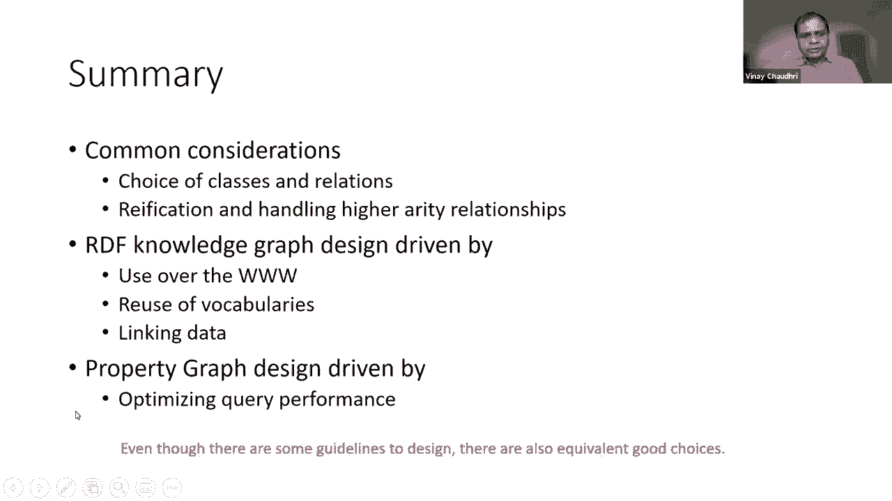

# 6：L5 - 如何设计知识图谱schema 🧠


在本节课中，我们将要学习如何设计知识图谱的schema。这是知识图谱创建系列的第一部分，我们将重点关注设计阶段需要考虑的核心原则和权衡。

创建知识图谱大致分为两个步骤：图式设计，以及用一组实例填充该模式。严格来说，知识图可以是一种无模式的方法，它只是一组三元组。但如果我们希望定义关系的含义、进行推理或确保数据可被理解，那么前期进行模式设计将非常有帮助。

在接下来的两节课中，我们将重点讨论如何填充知识图。信息可以来自结构化数据源、半结构化数据源，也可以通过NLP从文本中提取或使用计算机视觉技术获得，甚至可以通过手工输入。今天，我们将主要关注知识图谱模式的设计。

## 设计RDF图 🔗

RDF知识图的设计指南可以总结为所谓的“链接数据原则”。这些原则最初由蒂姆·伯纳斯-李爵士提出，非常简单但非常强大。

以下是主要原则：
1.  使用URI命名事物。
2.  使用HTTP URI，以便人们可以查找这些名字。
3.  当有人查找URI时，使用标准（RDF、SPARQL）提供有用的信息。
4.  在数据中包含指向其他事物的链接，以便人们可以发现新事物。

接下来，我们将更详细地研究每一个原则。

### 原则一：使用URI命名事物

在网络上，我们习惯使用URL（如网站地址）来命名事物。在RDF数据模型中，我们将其推广，使用URI（统一资源标识符）来命名一切，包括非信息资源（如现实世界中的一个人）。其背后的意图是提供一种独特的方式来引用我们正在创建的对象。

**URI设计的基本准则**是保持简短和便于记忆。虽然计算机程序可以使用URI，但为了让人类更容易理解数据，我们应该让URI有意义。另一个重要准则是确保URI具有持久性，因为其他人可能会使用它们来链接数据，频繁更改会导致链接失效。

### 原则二：使用HTTP URI以便查找

设计原则是，我们应该明确偏好使用`http`访问方法的URI。这样，当计算机程序遇到一个URI时，它知道去哪里找到更多关于它的信息。这个过程称为“解引用”。

对于传统的信息资源（如网页），解引用会返回该资源的当前表示（如一个网页）。对于非信息资源，解引用应该返回一组关于该对象的RDF事实。

### 原则三：提供有用的信息

当我们发布RDF事实时，必须能够说明这些事实的实际含义。通过使用标准词汇表，可以使数据更有用。例如，W3C发布了一些标准词汇（如组织本体），Schema.org社区也在开发共享词汇表。使用这些标准词汇，可以使其他人更容易理解和使用你的数据。

**示例：描述英国内阁**
```turtle
@prefix org: <http://www.w3.org/ns/org#> .
@prefix skos: <http://www.w3.org/2004/02/skos/core#> .

<http://example.org/cabinet-office> a org:Organization ;
                                    skos:prefLabel "Cabinet Office" .
```
在这个例子中，我们使用了`org:`和`skos:`这两个标准词汇中的类和属性。

如果所需词汇不存在，创建新词汇表的原则包括：应该被记录、应该是自我描述的、应该有版本控制策略、应该有多种语言版本，并且应该由可信的来源持久地发布。

### 原则四：包含链接以发现新事物

这与在文本文档中创建超链接类似，但这里是在数据集中建立链接。在RDF数据集中，可以区分三种链接：

1.  **关系链接**：连接两个不同数据集中的对象。
    *   **示例**：`:DaveSmith foaf:knows dbpedia:Colin_Birmingham .`
2.  **身份链接**：将两个不同数据集中的对象等同起来。
    *   **示例**：`:me owl:sameAs :DaveSmith .`
3.  **词汇链接**：将数据连接到术语的定义。
    *   **示例**：`:SME rdfs:subClassOf dbpedia:Company .`

这些链接可以被视为传统HTML超链接的泛化，它们连接的是对象而非文档。

遵循这四个基本原则发布数据，将使数据网络能够像文档网络一样被探索，并催生新的服务和能力。

---

上一节我们介绍了RDF图的设计原则，本节中我们来看看属性图的设计考虑。

## 设计属性图 📊

在属性图数据模型中，设计问题包括：节点、标签和属性应该是什么？是否应该引入新的节点标签或属性？是否应该引入新的关系？是否应该将某些信息作为关系属性？如果遇到无法用三元组捕捉的情况该怎么办？

这些都是简单的软件工程问题。我们将通过一些简单的例子来讨论。

### 节点标签 vs 节点属性

最简单的例子是表示“人”。我们有两个对象：John和Mary。在属性图模型中，我们会有两个节点，每个节点都有一个标签`Person`。标签的作用类似于“类”。

进一步的问题是：如何建模“性别”？我们有几种选择：

1.  **引入新标签（类）**：为John创建标签`Male`，为Mary创建标签`Female`。标签应该是自然、简短的名词短语，并且不随时间变化。这种方法的优点是，大多数图数据库会对标签（类）建立索引，因此基于标签的查询访问速度很快。
2.  **作为节点属性**：在`Person`节点上添加一个属性`gender`，其值为“male”或“female”。从纯粹的信息内容角度看，这与第一种设计是等价的。但缺点是，大多数图数据库不会对节点属性建立索引，因此基于属性值的查询可能较慢。
3.  **作为关系对象**：创建一个`Gender`对象（节点），然后在`Person`节点和`Gender`节点之间建立`hasGender`关系。这种方法适用于需要跟踪随时间变化的属性（虽然性别通常不变），或者需要为关系本身附加其他信息（如开始日期）。缺点是这会显著增加图的规模。

**权衡**：第一种方法最简单且访问快；第二种方法避免了创建可能无意义的类；第三种方法在需要处理时变属性或关系属性时非常有用。

### 访问效率示例：电影与流派

考虑如何为电影及其流派建模。

*   **方法一（作为属性）**：电影节点有一个`genres`属性，值为列表 `[“Action”， “Superhero”]`。
*   **方法二（作为关系）**：创建`Genre`节点，电影节点通过`hasGenre`关系连接到流派节点。

**查询“具有相同流派的电影”**：
*   在方法一中，查询需要比较两个节点的属性列表（集合交集），由于属性未索引，这可能开销较大。
*   在方法二中，查询通过遍历`hasGenre`关系来寻找共同连接的`Genre`节点。图数据库通常对关系遍历进行了高度优化，因此这种查询会快得多。

**结论**：如果你需要频繁基于某个属性进行查询或计算，将其建模为对象和关系（从而利用索引和优化遍历）通常是更好的选择。

### 何时使用关系属性

我们已经看到关系属性的一个用例：记录时变信息（如关系的开始日期）或出处信息。大多数图数据库不会对关系属性建立索引。

因此，如果查询需要大量基于关系属性进行筛选，那么使用关系属性可能不是最佳选择。在这种情况下，唯一的方法是将这种关系“具体化”（Reification），即将关系本身也转换为一个节点，并将属性附加到这个新节点上。

### 具体化（Reification）技术

具体化对于处理非二元关系（如“X位于Y和Z之间”）是必要的。工作方式是：创建一个表示关系本身的节点（例如`Between`），然后为关系的每个参数（X， Y， Z）创建节点，并用二元关系（如`hasObject`， `hasSubject`）将这些对象连接到关系节点。

这与在RDF中处理非二元关系的方法在概念上是相同的，只是使用的关系名称可能不同。

---

## 总结 📝

在本节课中，我们一起学习了知识图谱设计中的核心考虑。

知识图设计中有共同的考虑，例如：什么应该是一个类？应该是什么关系？何时以及如何进行具体化？这些问题对于RDF数据模型和属性图数据模型都是常见的。

也存在一些不同的侧重点：
*   在RDF图设计中，重点在于在Web上发布和链接数据的能力，强调使用标准词汇和建立跨数据集的链接。
*   在属性图设计中，更多强调索引和查询性能优化，因为属性图数据库通常用于需要高效图遍历和分析的场景。

最后需要指出，本节课介绍的是设计指南而非硬性规则。在许多情况下，存在多个同等优秀的选择。这些原则旨在帮助我们最大限度地利用所构建的系统，我们应该在可能的程度上遵循它们，同时也认识到设计的灵活性。




下一次课程将在周四，主题仍然是“如何设计知识图谱”。我们将听到关于将Wikidata转化为机器更易理解的“Wiki知识”的新语言，以及向Wikidata中添加关于Covid信息的实践案例。这将是关于模式设计和演化的非常激动人心的会议。