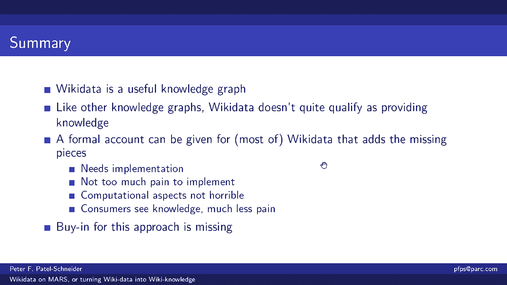

# 7：L6.1 - 把维基百科数据构建成维基知识库 📚

在本节课中，我们将学习如何将维基百科数据构建成一个真正的知识库。我们将探讨维基数据（Wikidata）的现状、其作为知识图谱的潜力，以及如何通过逻辑增强使其从“数据”转变为“知识”。

---

## 什么是维基数据？🔍

维基数据是一个大型的、社区驱动的知识存储库。它拥有超过9300万个实体，涵盖各种主题。任何人都可以访问和编辑维基数据，其数据遵循CC0协议，完全免费开放。

以下是维基数据的一些关键特点：
*   它是一个庞大的社区驱动存储库。
*   包含超过9300万个实体。
*   数据完全免费开放（CC0协议）。
*   提供图形界面和查询界面（如SPARQL）进行访问。

---

## 维基数据的界面与查询 🖥️

维基数据的页面类似于维基百科，但展示的是结构化的数据。例如，“伊丽莎白·泰勒”的页面会列出她的各种属性信息。

此外，维基数据提供了SPARQL查询接口。用户可以通过编写查询语句来获取特定信息。例如，查询伊丽莎白·泰勒的子女：
```sparql
SELECT ?child ?childLabel WHERE {
  wd:Q296830 wdt:P40 ?child.  # wd:Q296830 是伊丽莎白·泰勒的ID，P40是“子女”属性
  SERVICE wikibase:label { bd:serviceParam wikibase:language "[AUTO_LANGUAGE],en". }
}
```
然而，查询时需要直接使用数字ID，这对用户不太友好。

---

## 维基数据的优势与用途 ✅

维基数据非常有用，主要体现在以下几个方面：
*   **规模庞大**：包含约13亿个事实陈述，且持续增长。
*   **质量较高**：社区努力确保了信息的准确性和完整性。
*   **连接广泛**：作为语义枢纽，链接了大量外部数据库（如VIAF、ISNI等）。
*   **本质是图谱**：数据以节点（实体）和边（属性/关系）的形式组织，可以可视化展示。
*   **描述现实世界**：涵盖人物、地点、事件等各种现实世界概念。
*   **拥有模式（Schema）**：定义了类（如“人类”）和属性（如“配偶”、“子女”）的层次结构。

例如，“人类”（Human）在维基数据中的类层次结构为：`实体 -> 事物 -> 个体 -> 人 -> 人类`。这构成了一个基本的本体。

---

## 维基数据的局限：从数据到知识的差距 ⚠️

尽管维基数据拥有丰富的数据和模式，但它是否真正构成了“知识”呢？根据“知识是组织好并随时可用的信息”这一定义，维基数据仍有差距。

上一节我们介绍了维基数据的优势，本节中我们来看看它作为知识库的局限性。

以下是维基数据存在的一些关键问题：
*   **缺乏机器可读的推理逻辑**：类（如“女性”）通常只有自然语言描述，而没有机器可读的“识别条件”。因此，无法通过简单查询 `实例 of 女性` 来获得所有女性实例，必须手动编写复杂的查询来模拟定义。
*   **上下文信息处理困难**：许多事实（如婚姻）带有时间、地点等限定符。但系统没有明确规则说明如何利用这些限定符来回答“某人在某时刻的配偶是谁”这类上下文相关的问题。机器难以自动构建正确的查询上下文。
*   **缺少常识性约束检查**：知识图谱中可能存在明显错误（如历史人物拥有现代职业），因为缺乏基本的逻辑约束来防止这种不一致。
*   **信息获取不直观**：要获取准确、完整的信息，用户必须深入了解数据模型并精心设计查询，而不是直接询问。这意味着“知识”并未准备好被程序直接使用。

因此，维基数据目前更接近一个丰富的“数据库”，而非一个可直接推理的“知识库”。

---

## 如何将维基数据转化为维基知识？ 🛠️

要将维基数据提升为真正的知识库，我们需要为其增加逻辑推理能力，从而能够自动推导出隐含的知识和正确处理上下文。

核心思路是：**为维基数据设计并实现一套逻辑系统**。这套系统需要能够：
1.  将自然语言描述转化为逻辑表达式。
2.  定义类和属性的逻辑规则（如传递性、对称性）。
3.  处理限定符（如时间、地点）的组合与推理。
4.  执行一致性约束检查。

例如，我们可以添加规则：
*   **子类传递性**：`如果 (X 子类 Y) 且 (Y 子类 Z)，则 (X 子类 Z)`
*   **属性对称性**：`如果 (A 配偶 B)，则 (B 配偶 A)`
*   **类识别规则**：`如果 (X 实例 人类) 且 (X 性别 女性)，则 (X 实例 女性)`

通过一个支持前向链推理的规则引擎，我们可以将这些规则应用到维基数据的事实上，自动推导出所有隐含的陈述，从而形成一个完整的“知识库”。

---

## 面临的挑战与总结 🎯

实现上述愿景主要面临两大挑战：
1.  **技术实现**：需要开发或适配一个能够高效处理维基数据规模、并支持所述逻辑规则的推理系统。
2.  **社区与协作**：维基数据是社区项目，任何重大改动都需要社区的共识和支持。推动这种根本性的模式增强需要巨大的协调努力。




本节课中我们一起学习了维基数据的潜力与局限。总而言之，维基数据是一个极具价值的**数据**图谱，但要成为真正的**知识**图谱，它需要超越当前的分类法模式，融入能够定义识别条件、支持推理和约束检查的**逻辑层**。这不仅是技术上的升级，更是对知识图谱“模式”设计理念的深化——真正的模式应使机器能够理解并运用其中的知识。