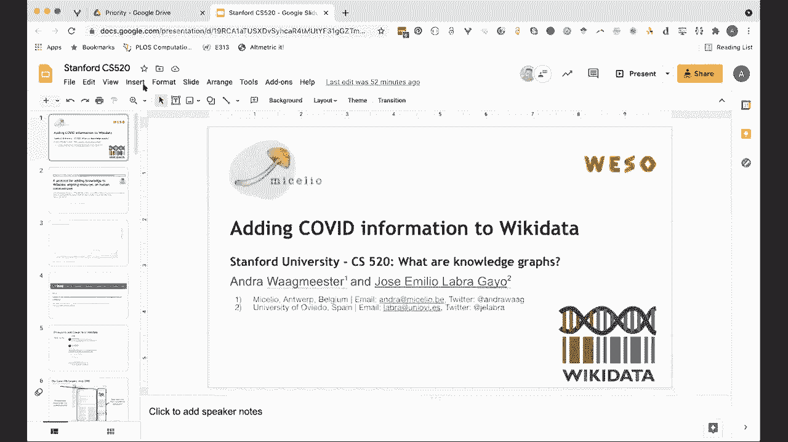
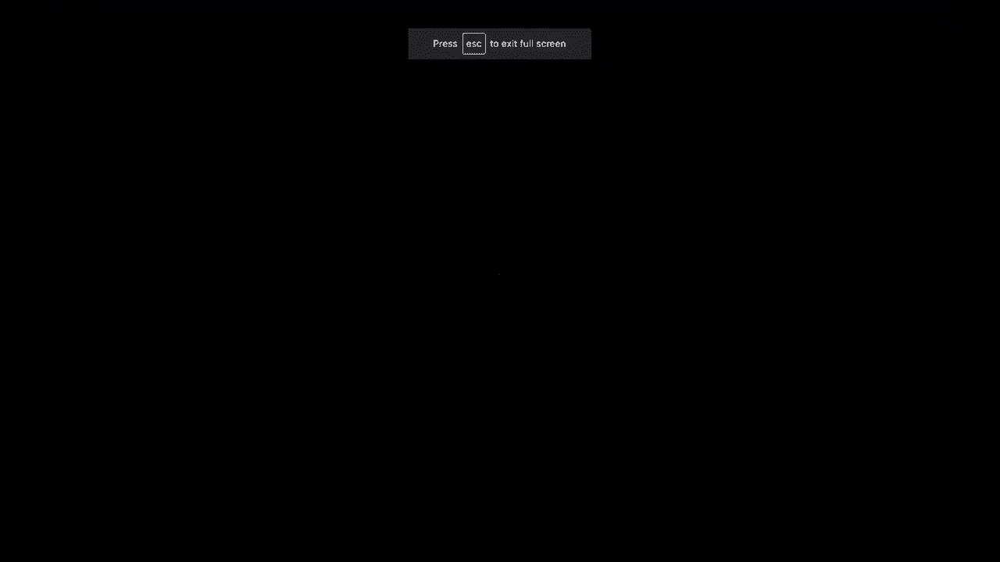
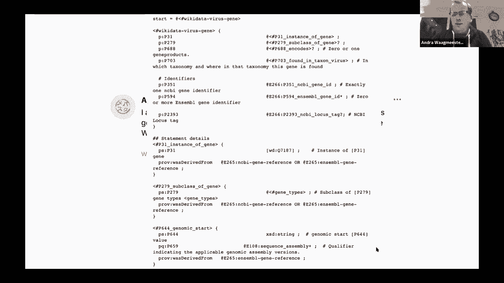

# 8：L6.2 - 给维基数据添加Covid信息 📚

在本节课中，我们将学习如何向维基数据（Wikidata）中添加关于Covid-19的结构化信息。我们将了解其背后的动机、使用的工具（如基因维基项目）以及具体的实施步骤。

---

## 概述

本次课程将介绍一个用于向维基数据添加数据的协议，特别是以Covid-19信息为例。我们将探讨为何需要结构化数据、如何利用现有项目（如基因维基项目）以及创建和使用模式（如形状表达式）的具体流程。

---

## 背景与动机 🎯

上一节我们介绍了课程的整体目标，本节中我们来看看为何需要向维基数据添加Covid-19信息。

在当前的疫情中，产生了大量的科学论文和知识。同时，也存在错误信息传播的风险。因此，我们需要可靠的方法来整合和验证这些信息，确保能够回溯到经过证实的文献和数据。

例如，通过分析PubMed中关于不同病毒的论文数量，可以观察到特定事件（如疫情爆发）会导致相关研究激增。这突显了高效管理和整合科学数据的必要性。

---

## 基因维基项目 🤖

上一节我们了解了数据整合的需求，本节中我们来看看一个关键的工具——基因维基项目。

基因维基项目始于2008年，旨在为每个人类基因创建维基百科文章。它从各种数据库中捕获结构化数据（如标识符），并通过众包方式总结知识。

随着维基数据的出现，该项目将工作重心从维基百科转移到了维基数据上。维基数据与维基百科类似，但专注于存储结构化数据而非文本。它基于相同的MediaWiki框架，完全免费开放，并支持强大的查询功能。

基因维基项目维护着一组机器人，定期从公共数据源（关于基因、化合物、蛋白质、文献、代谢途径等）查找信息，并更新维基数据中的内容。

以下是整合数据的关键步骤：
1.  **模式协调**：确定如何在维基数据中表示特定实体（如基因）以及使用哪些属性和语句。
2.  **模式创建**：参考维基数据中已有的类似项目，或使用形状表达式等工具来定义数据模式。
3.  **机器人实施**：编写机器人程序，根据定义的模式检查和更新维基数据中的信息。

---

## 实施流程：以Covid-19为例 🛠️

上一节我们介绍了基因维基项目的工作方式，本节中我们具体看看如何应用它来添加Covid-19信息。

在相关推文的推动下，我们为病毒基因创建了第一个维基数据模式。这个模式使用一种名为**形状表达式**的机器可读格式来描述。

形状表达式定义了每个病毒基因条目在维基数据中应包含的特定属性信息。例如，一个病毒基因条目可能需要包含以下属性：
*   `P351` (Entrez Gene ID)
*   `P594` (Ensembl Gene ID)
*   `P688` (编码蛋白质)
*   `P703` (发现于物种)

通过这种结构化的模式，我们可以确保添加到维基数据中的Covid-19相关信息是完整、一致且易于查询的。

---

## 总结

本节课中我们一起学习了如何向维基数据添加关于Covid-19的结构化信息。我们了解了这样做的必要性，认识了**基因维基项目**作为关键工具的角色，并探讨了使用**形状表达式**定义数据模式的具体流程。这套方法不仅适用于疫情数据，也可作为整合其他领域科学资源的通用协议。