# 10：L7 - 如何从结构化数据中构建知识图谱 🗂️

在本节课中，我们将要学习如何从结构化数据源（如数据库表格）中构建知识图谱。我们将重点探讨两个核心问题：**模式映射**和**记录链接**，并了解解决这些问题所需的技术和挑战。

---

## 概述

大型组织通常拥有大量内部结构化数据，例如客户档案、产品信息和交易记录。同时，外部也存在许多结构化数据源，如财经新闻摘要或供应链关系数据。为了获得关于某个实体（如客户）的完整视图（即“360度视图”），我们需要将这些内外部信息整合到一个统一的知识图谱中。这个过程本质上是一个**数据集成**问题，其核心挑战在于如何将不同来源的数据在语义和实例层面关联起来。

---

## 模式映射

上一节我们介绍了从结构化数据构建知识图谱的整体挑战。本节中，我们来看看第一个核心问题：**模式映射**。模式映射是指将不同数据源的模式（即数据结构定义）与目标知识图谱模式进行对齐的过程。

### 面临的挑战

在实际操作中，模式映射面临诸多挑战：
*   数据模式可能非常复杂且难以理解，表名和列名可能含义不清。
*   原始系统的开发者可能已离职，导致无人完全理解数据的含义。
*   映射关系可能不是简单的一对一，需要应用特定的业务逻辑进行转换。
*   虽然人们希望自动化此过程，但在模式层面，可用于训练机器学习模型的数据非常稀缺，因此完全自动化非常困难。

### 一个具体示例

假设我们有两个关于产品的数据源：
*   **源1 (Cookware)**：包含 `ID`, `Type`, `Material`, `Price`。
*   **源2 (Product)**：包含 `ProdID`, `ProdName`, `ProdType`, `Cost`。

我们的目标是将它们集成到以下知识图谱模式中：
*   节点类型：`产品`、`供应商`。
*   属性：产品有 `类型`、`价格`；供应商有 `名称`。
*   关系：`有供应商` 连接产品与供应商。

为了完成这种映射，我们可以使用 **Datalog规则** 来声明转换逻辑。Datalog规则由头部和体部组成，用 `:-` 分隔。

以下是示例规则，用于将源1的数据映射为知识图谱的三元组：
```prolog
产品类型(ID, 大写类型) :- Cookware(ID, 类型, _, _), 大写类型 = upper(类型).
产品价格(ID, 价格) :- Cookware(ID, _, _, 价格).
有供应商(ID, ‘供应商_1’) :- Cookware(ID, _, _, _).
```
类似地，我们可以为源2编写映射规则。通过规则引擎执行这些规则，即可自动将数据加载到知识图谱中。

### 模式映射的技术

编写映射规则通常需要人工参与，但有一些技术可以辅助和加速这个过程：

以下是几种常见的模式映射启发式方法：

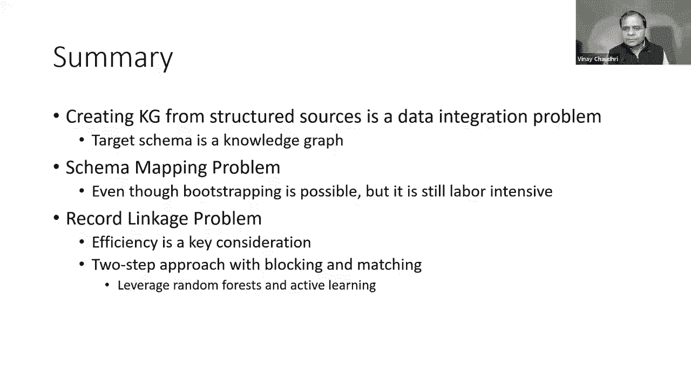

*   **基于语言的方法**：利用名称的相似性进行匹配。例如，进行词干提取（如“customer_name”与“cust_name”）、使用同义词库（如“car”与“automobile”）、利用公共子字符串（如“AmtReceivable”与“ReceivableAmt”）甚至比较字段的文档说明。
*   **基于实例的方法**：观察数据的特征。例如，如果两个字段的值都符合邮政编码或电话号码的格式，则它们可能指向同一类属性。
*   **基于约束的方法**：检查数据值遵守的约束。例如，如果两个字段的值范围都在100到200之间，这可能暗示它们语义相似。

**请注意**：这些技术本质上是启发式的猜测，其建议的映射最终需要人工验证。自动化程度取决于应用对准确性的要求。

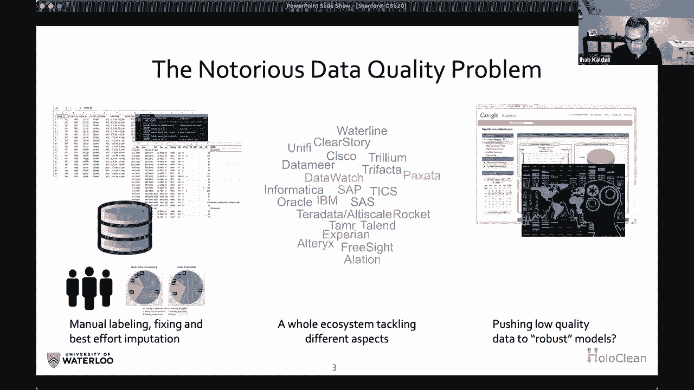

---

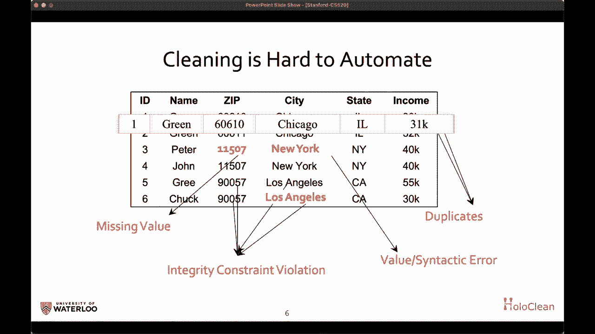

## 记录链接

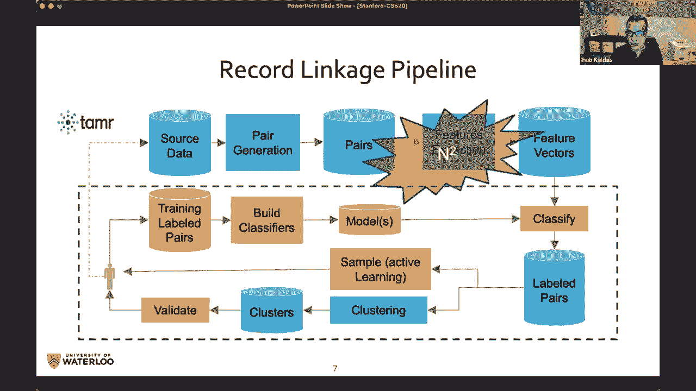

在解决了模式映射问题，建立了统一的数据视图之后，我们面临下一个挑战：**记录链接**（也称实体解析）。记录链接旨在判断来自不同数据源的记录是否指向现实世界中的同一个实体。

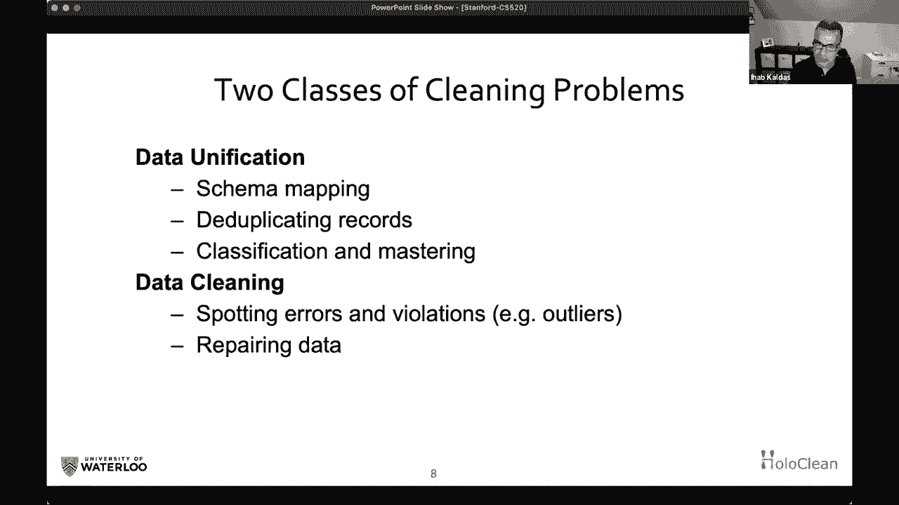

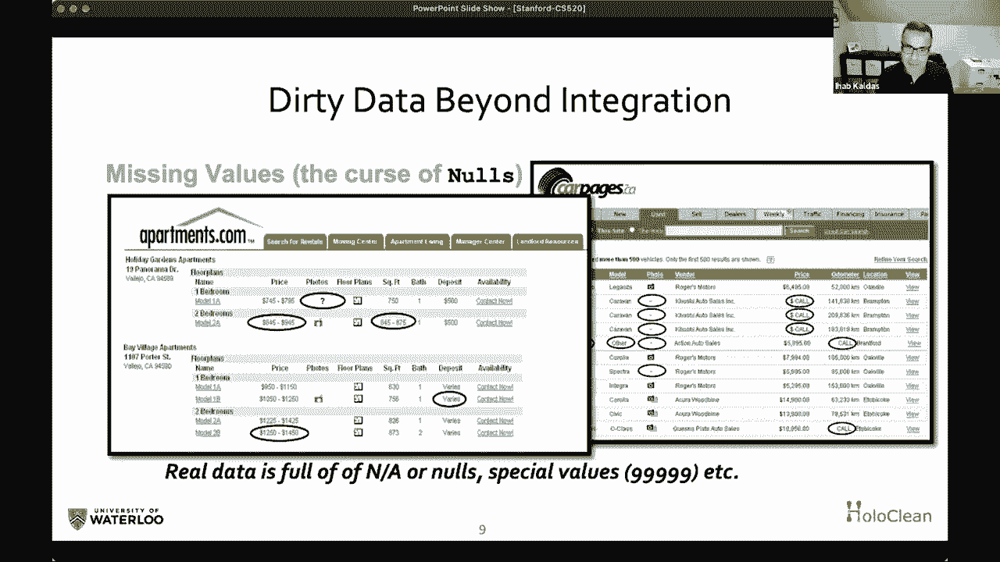

### 问题与挑战

例如，源A中有一条记录“Acme Corp, 123 Main St”，源B中有一条记录“Acme Corporation, 123 Main St.”。记录链接需要判断它们是否代表同一家公司。主要挑战在于：
*   **推断不精确**：缺乏唯一标识符（如D-U-N-S编号）时，判断具有模糊性。
*   **计算规模巨大**：可能需要比较数百万甚至数十亿对记录，计算开销难以承受。

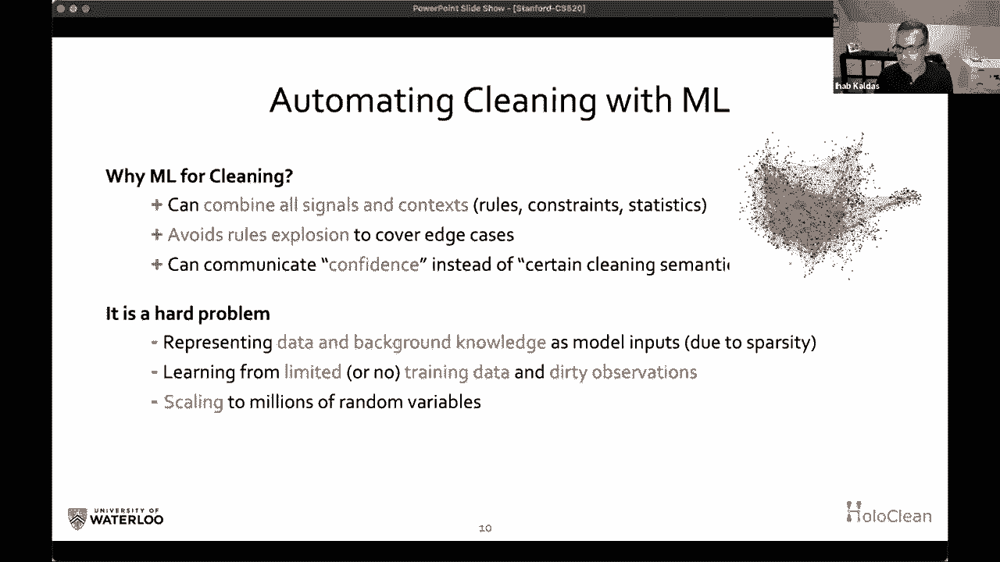


### 记录链接算法：分块与匹配

为解决规模问题，记录链接通常采用两步流程：**分块** 和 **匹配**。

1.  **分块**：使用一种快速、粗略的启发式方法，将可能匹配的记录分组到同一个“块”中，从而大幅减少需要详细比较的记录对数量。例如，可以按“州”字段进行分块，这样只需比较同州的公司。
2.  **匹配**：在分块产生的候选记录对中，使用更精确（也可能更耗时）的方法进行详细比较，最终决定它们是否匹配。

分块和匹配步骤在算法结构上类似，核心区别在于所使用的比较规则的复杂度和成本。

### 基于主动学习与随机森林的方法

一种有效的方法是使用 **随机森林** 作为匹配规则，并通过 **主动学习** 来构建它。

*   **随机森林**：由多个决策树规则组成。每条规则基于一组相似度度量（如编辑距离、Jaccard相似度、余弦相似度）的组合来判断两条记录是否匹配。
    *   **示例规则**：`IF 编辑距离(公司名A, 公司名B) < 3 AND Jaccard相似度(地址A, 地址B) > 0.8 THEN 匹配`。
*   **主动学习流程**：
    1.  系统随机选择少量记录对，由用户标注它们是否匹配。
    2.  系统计算这些记录对的各种相似度特征，并训练一个初始的随机森林模型。
    3.  模型用于预测未标注的记录对，系统挑选出模型最不确定或预测结果可能最有价值的样本，再次请求用户标注。
    4.  重复迭代此过程，直到模型性能达到稳定。最终规则集仍需用户验证。

### 实现效率

为了处理海量数据，必须高效应用分块和匹配规则。这通常依赖于巧妙的**索引**技术。例如，如果一条规则要求“产品名称的Jaccard相似度>0.7”，我们可以预先计算并索引产品名称的长度或单词数，快速过滤掉不可能满足条件的记录对，从而避免不必要的详细计算。

---

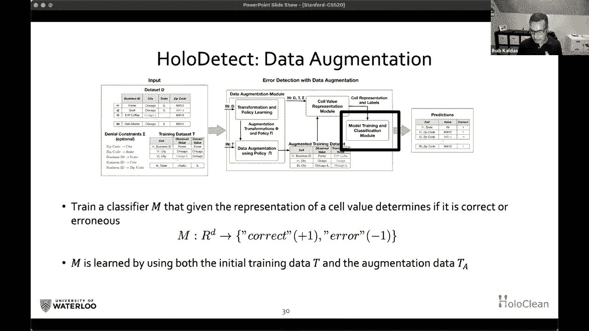

## 结构化数据清理 🧹

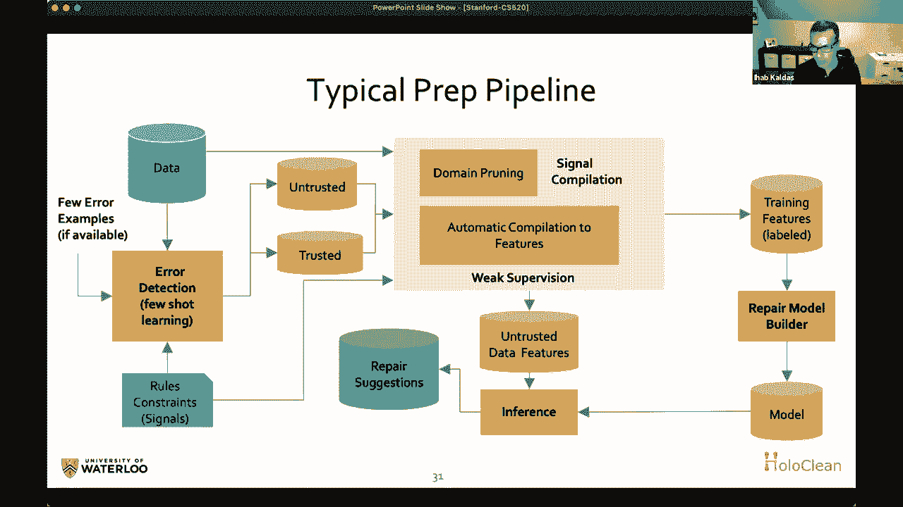

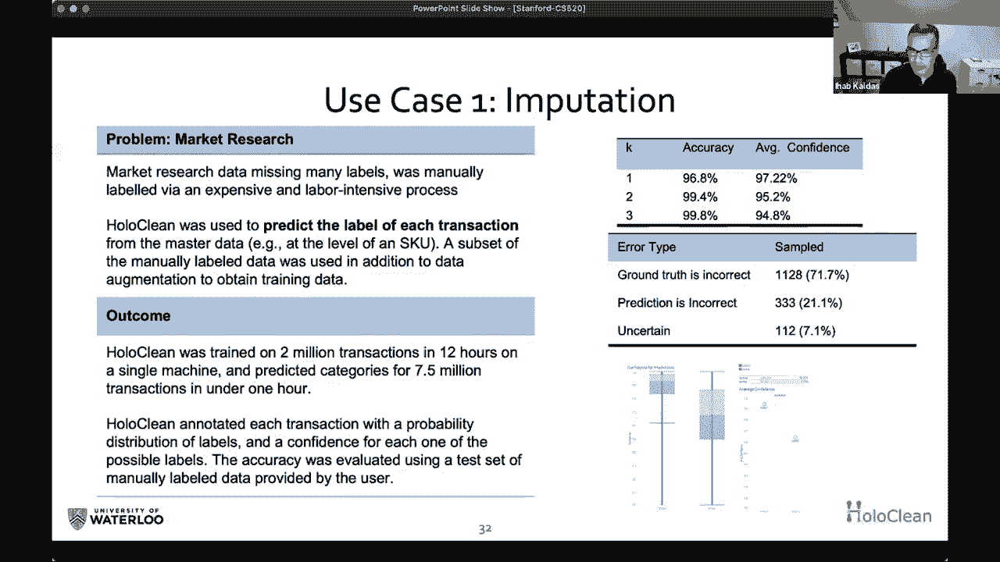

在讨论了数据集成（模式映射与记录链接）之后，我们转向另一个密切相关且至关重要的问题：**结构化数据清理**。真实世界的数据往往充满错误，如拼写错误、缺失值、异常值以及违反业务规则（完整性约束）的情况。高质量的知识图谱构建依赖于干净的数据。

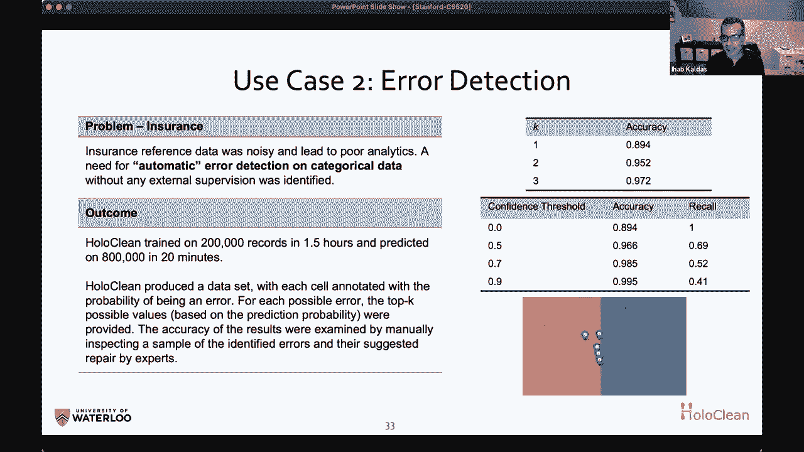

### 数据清理的挑战

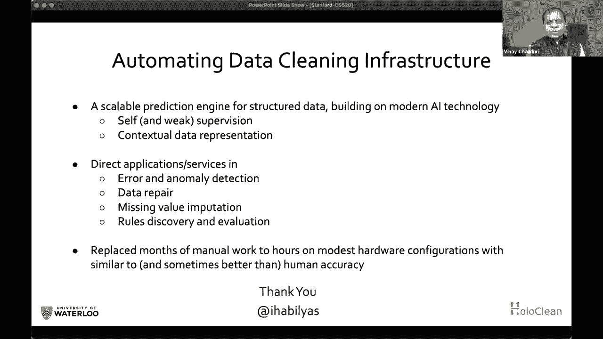

为什么自动化数据清理如此困难？
*   **数据稀疏性**：与图像、视频等高冗余数据不同，结构化数据（尤其是知识图谱）的维度高、数据点稀疏，机器学习模型难以从中学习稳健模式。
*   **错误多样性**：错误类型繁多（如拼写、交换、缺失），且标注数据（即已知的错误示例）极少，难以训练监督模型。
*   **依赖背景知识**：修复数据通常需要理解领域约束和数据间的复杂关系。

### 全息清理：一种生成式模型方法

“全息清理”方法将数据清理视为一个**推断问题**。其核心思想是：我们观测到的脏数据是由一个干净的“真实”数据，经过一个“噪声信道”引入错误后产生的。我们的目标是**反向推断**出最有可能的干净数据。

该方法通过**概率图模型**（如因子图）实现：
*   将知识图谱中的每个属性（或关系）视为一个随机变量。
*   将领域知识（如完整性约束、函数依赖）作为“因子”引入模型，这些因子定义了变量间应该如何关联（例如，“城市相同则邮编应相同”）。
*   通过机器学习**学习**这些因子的权重，从而得到一个能理解数据如何生成的**生成模型**。
*   **推理时**，模型可以回答诸如“给定上下文，这个缺失的邮政编码最可能是什么？”或“这个观测值是否很可能是错误的？”等问题，从而实现数据修复、缺失值填补和错误检测。

### 结合深度学习的上下文表示

为了更有效地捕捉上下文信息，现代方法会引入基于注意力的神经网络模型：
*   模型学习为数据表中的每个值（单元格）生成一个表示向量。
*   在**模式级别**学习注意力机制，以判断在预测某个目标属性（如“县”）时，其他属性（如“城市”、“邮编”、“年龄”）的重要性各是多少。
*   通过聚合加权的上下文表示，模型能够对缺失或可疑的值做出更准确的预测。

### 实际应用与优势

这类生成式预测模型的应用超越了传统清洗：
*   **知识补全**：预测知识图谱中缺失的关系或属性。
*   **错误检测**：通过比较模型的预测值与实际观测值，发现潜在错误。
*   **优先级排序**：模型对其预测不确定的案例，可标记出来供人工优先审查，优化质检资源分配。

其优势在于能够将领域知识（约束）与数据中的统计模式相结合，在数据稀疏的情况下仍能进行合理推断，并将清洗、修复、补全任务统一在同一个框架下。

---

## 总结

本节课我们一起学习了从结构化数据构建知识图谱的核心流程与挑战。

1.  **模式映射**：解决了如何将不同来源的数据模式对齐到统一的知识图谱模式的问题。虽然存在自动化辅助技术，但高精度映射通常需要结合领域知识进行人工设计或验证。
2.  **记录链接**：解决了如何判断不同数据源中的记录是否指向同一实体的问题。采用“分块+匹配”的两步策略来应对海量数据规模，并利用主动学习和随机森林等技术学习匹配规则。
3.  **数据清理**：是构建可靠知识图谱的基础。我们介绍了一种基于生成式模型（如全息清理）的前沿方法，它将清洗、修复和知识补全视为统一的概率推断问题，通过结合数据规律与领域约束来提升数据质量。


构建知识图谱是一个系统工程，涉及数据集成、质量管理和语义理解等多个层面。理解这些基础问题和技术，是成功从结构化数据中提炼出有价值知识的关键第一步。