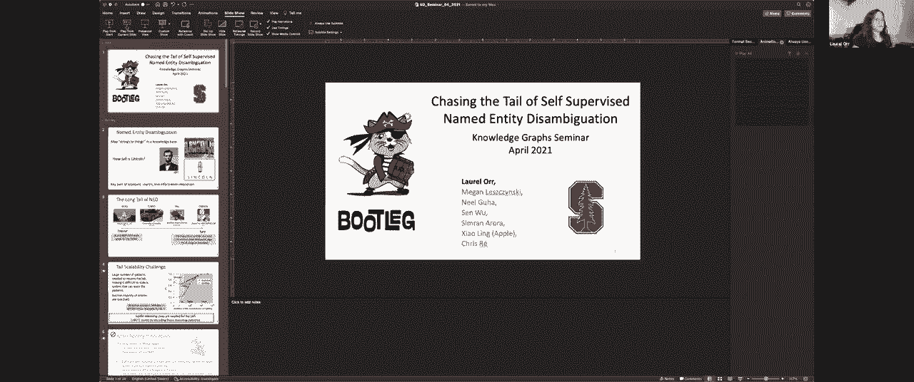
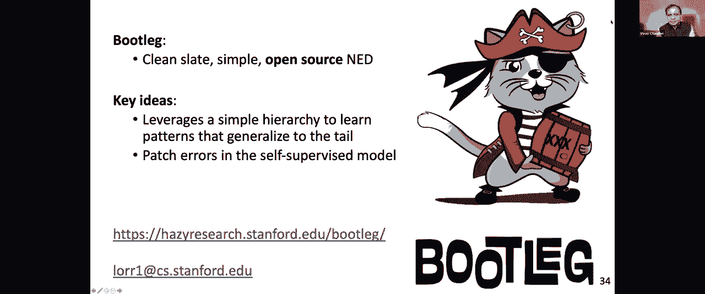

# 11：L8.1 - 自监督实体识别与消歧 🧠


在本节课中，我们将学习如何从文本中识别并消歧实体，特别是针对那些在训练数据中不常见的“长尾”实体。我们将重点介绍一种名为“Pirate”的系统，它通过利用知识图谱中的关系和类型信息，而非仅仅依赖文本记忆，来提升对罕见实体的识别性能。



---

## 概述

实体识别与消歧是从文本字符串映射到知识库中具体对象的过程。这对于下游应用（如智能助理、搜索引擎和关系抽取）至关重要。然而，传统方法在处理训练数据中罕见的“长尾”实体时面临巨大挑战。本节课将探讨如何利用结构化的知识图谱信号来克服这一难题。

---

## 实体消歧的挑战

上一节我们概述了实体消歧的重要性，本节中我们来看看其面临的核心挑战。实体可以根据其在训练数据中的出现频率，大致分为“头部实体”和“长尾实体”。

*   **头部实体**：如“华盛顿特区”，在训练数据中频繁出现，现有基于BERT等语言模型的方法能较好处理。
*   **长尾实体**：如某些小众歌曲或人物，在训练数据中极少甚至从未出现，传统方法难以消歧。

在工业场景中，大多数用户查询恰恰涉及这些罕见实体。即使在维基数据这样的知识库中，也只有约13%的实体在维基百科中有对应文本描述，这使得依赖文本记忆的方法效果有限。

**公式**：模型性能与实体出现频率的关系可以近似表示为：`性能 ≈ f(出现频率)`，其中对于长尾实体，`f(出现频率)` 趋近于0。

---

## 消歧系统的核心模式

要理解如何改进对长尾实体的消歧，我们需要了解系统可以依赖的几种推理模式。

以下是三种关键的推理模式：

1.  **文本记忆模式**：关联特定实体与共现的文本短语。例如，“史蒂文·斯皮尔伯格的电影”强烈指向电影《林肯》。这种模式判别性强，但无法推广到未见过的实体。
2.  **知识图谱关系模式**：利用实体间结构化关系进行推理。例如，已知“维多利亚·米切尔”与“大卫·米切尔”存在“配偶”关系，可以帮助在上下文中确定具体指代。这种模式具有可推广性。
3.  **类型模式**：利用实体的类别信息。例如，“高度”通常描述“人”，“价格”通常关联“公司”。了解类型常识有助于消歧，同样具有可推广性。

这些模式构成了一个层次结构，其中文本记忆判别力最强但泛化性最弱，而类型和知识图谱关系模式则能更好地支持对罕见实体的推理。

---

## Pirate 系统架构

上一节我们介绍了消歧依赖的几种模式，本节中我们来看看 Pirate 系统如何具体实现对这些模式的利用。Pirate 系统的工作流程遵循标准的实体链接管道，但在实体表示和模型设计上进行了创新。

系统主要流程如下：
1.  **候选生成**：从知识库中检索与句子相关的实体候选集。
2.  **实体表征构建**：为每个候选实体构建包含其唯一标识符、类型和知识图谱关系的“实体负载”。
3.  **神经模型消歧**：模型结合句子上下文和实体负载进行推理，输出最可能的实体。

---

### 实体负载的构建

Pirate 系统的关键在于如何构建实体的向量化表示（实体负载），以编码类型和关系信息。

**代码**：实体负载的构建可以概念化地表示为：
```python
# entity_embedding: 实体ID -> 向量
# relation_embedding: 关系 -> 向量
# type_embedding: 类型 -> 向量

def construct_entity_payload(entity_id):
    payload = []
    payload.append(entity_embedding[entity_id])  # 实体本身嵌入
    for rel in get_relations(entity_id):         # 添加所有关系嵌入
        payload.append(relation_embedding[rel])
    for typ in get_types(entity_id):             # 添加所有类型嵌入
        payload.append(type_embedding[typ])
    return combine(payload)  # 合并为一个实体负载向量
```
通过共享的关系和类型嵌入，模型可以将从常见实体上学到的模式，迁移到具有相同关系或类型的罕见实体上。

---

### 神经模型与知识图谱模块

Pirate 使用基于 Transformer 的架构，并引入了一个特殊的知识图谱模块。

模型接收句子嵌入和实体负载作为输入，通过两个Transformer块分别学习实体间共现模式和实体-句子间的文本模式。随后，**知识图谱模块**允许在知识图中直接相连的实体之间传递表示。例如，如果模型确信句子中的“Seal（歌手）”是正确的，那么这个高置信度的表示可以传递给与其在知识图谱中相连的配偶“Heidi”，从而提高后者的得分。

---

## 训练技巧与数据

为了让模型更好地学习可推广的模式，Pirate 采用了两项关键训练技巧。

### 1. 基于流行度的正则化

为了防止模型过度依赖判别力强但泛化性弱的实体特定嵌入，我们引入了一种正则化方法：以与实体流行度成反比的概率，将该实体的嵌入向量置零。这意味着：
*   对于常见实体，嵌入较少被置零，模型可以继续利用其丰富的文本信息。
*   对于罕见实体，嵌入更常被置零，从而迫使模型更多地依赖共享的关系和类型嵌入进行推理。

这项技巧显著提升了对未见实体的消歧性能。

### 2. 训练数据精炼

我们利用维基百科的“内部链接”作为自动标注的训练数据。此外，通过弱监督方法（如利用页面内自指提及的启发式规则）自动标注更多提及，将训练数据规模扩大了约1.7倍，进一步增强了模型对结构模式的学习。

---

## 实验与评估

我们通过实验验证 Pirate 系统的有效性，特别关注其在长尾实体上的性能。

在标准基准测试中，Pirate 达到了具有竞争力的性能。然而，真正的优势体现在对“未见实体”的消歧上：相比仅依赖文本记忆的基线语言模型，Pirate 在 F1 分数上取得了超过40个百分点的巨大提升。

为了更细致地评估，我们进行了基于子群体的分析：
*   **知识图谱关系子集**：Pirate 表现远超基线，证明了其利用关系进行推理的能力。
*   **类型子集**：同样观察到显著提升。
*   **实体特定子集**：优势主要来自对头部实体的更好处理。

此外，将 Pirate 学习到的实体嵌入应用于关系抽取任务，也能帮助模型更好地理解实体间的语义关系，证明了其表征的有效性。

---

## 总结

本节课中我们一起学习了自监督实体识别与消歧的核心挑战与解决方案。我们了解到：

1.  处理“长尾”罕见实体是现实应用中的关键难题。
2.  利用知识图谱中的**关系**和**类型**等结构化信息，而非仅仅依赖文本记忆，是实现泛化的关键。
3.  Pirate 系统通过构建融合结构信息的实体负载、设计特殊的知识图谱模块，以及采用基于流行度的正则化等训练技巧，有效提升了对罕见实体的消歧能力。
4.  该方法不仅是有效的，而且易于扩展，能够形成从文本中构建和丰富知识图谱的闭环。



通过本节课，希望你能够理解如何利用结构化知识来增强自然语言处理模型，特别是在数据稀疏场景下的鲁棒性。

---
*注：本教程内容整理自相关讲座，Pirate 系统为开源项目，更多细节可通过其官方渠道获取。*