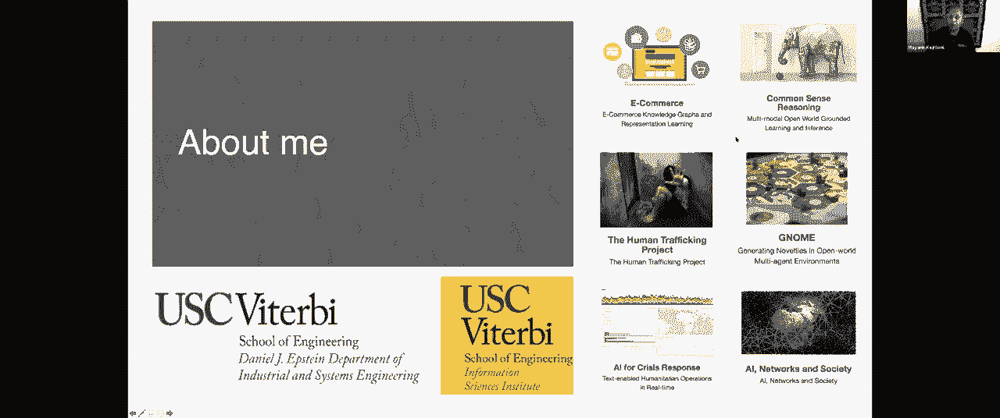
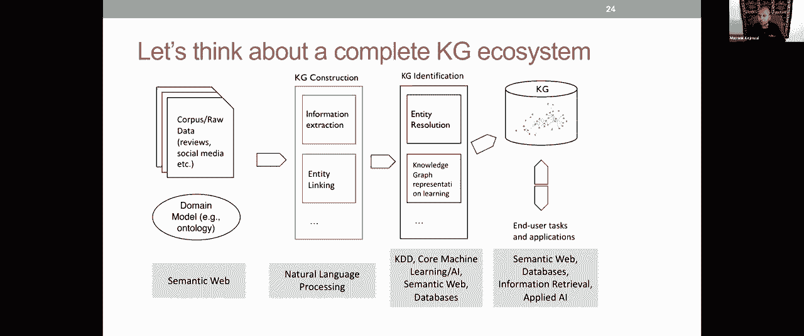
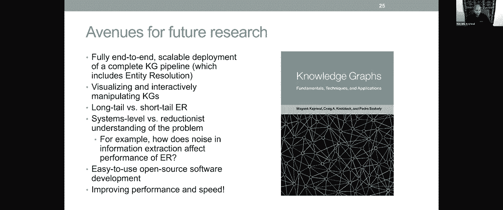

# 12：L8.2 - 网络知识图谱中的指代消解 🧠

在本节课中，我们将要学习网络知识图谱中的指代消解问题。我们将探讨其核心概念、面临的挑战、现有的解决方案以及未来的研究方向。课程内容将涵盖从链接数据的基本原理到实现大规模实体解析的完整技术栈。

---

## 概述：从链接文档到链接数据 🌐

我们正在经历一个转变：从传统的链接文档网络，转向一个链接数据的网络。这并不意味着文档网络被取代，而是数据网络与之并存。一个关键的例子是谷歌知识图谱，但在此之前的2011年，已有“链接开放数据”运动兴起。

链接开放数据运动发展迅速，从最初的12个RDF数据集，发展到如今涵盖数千个数据集、数百万个节点的庞大网络，领域横跨媒体、出版物、生命科学等。

蒂姆·伯纳斯-李在2001年发表于《科学美国人》的论文中，提出了“语义网络”的愿景，这可以被视为从文档网络到数据网络转变的蓝图。

---

## 什么是链接数据？🔗

链接数据并非指数据本身，而是在网络上发布和连接结构化数据的一套最佳实践。其中一项核心原则是：在网络上发布数据时，必须将其连接到现有的数据集。这看似是常识，但在实践中，许多数据集发布时并未与网络上的其他数据建立连接。

为了便于理解，我们将使用一个贯穿全课的示例：
*   在左侧，我们有来自 Freebase 的知识图谱片段，描述了“微软”由“保罗·艾伦”共同创立。
*   在右侧，我们有来自 DBpedia 的对应片段。
*   两者之间存在差异，例如类型（“公司” vs “组织”）、属性（“共同创立者” vs “组织”）等。这个例子将帮助我们理解后续讨论的许多问题。

---

## RDF：网络知识图谱的数据模型 📊

RDF（资源描述框架）是语义网社区中用于在网络上发布知识图谱的重要数据模型。

一个RDF数据集是一组三元组的集合，可以可视化为一个有向标记图。每个三元组具有 `(主语, 谓语, 宾语)` 的结构。
*   **主语** 和 **谓语** 必须是 URI（统一资源标识符）。
*   **宾语** 可以是 URI 或字面量（如字符串、数字）。

这种设计使得知识图谱能与网络文档明确连接（点击URI可跳转到描述页面）。链接数据的最佳实践之一就是以RDF等标准格式发布知识图谱。

在表示上，`freebase:Microsoft` 这样的前缀是完整URI的简写形式。

---

## 实体解析：核心问题与挑战 ⚙️

上一节我们介绍了知识图谱的数据模型，本节中我们来看看如何将不同来源的知识连接起来。

**实体解析** 的核心算法问题是：识别并连接那些指向相同底层实体的实体对。例如，将 Freebase 中的“Microsoft”与 DBpedia 中的“Microsoft (company)”连接起来。

在语义网中，我们可以使用 `owl:sameAs` 这样的谓词来声明两个资源是相同的。这种声明是对称的，并且推理引擎可以利用它进行推导。

然而，实体解析在术语上存在“实体解析问题”：它也被称为实例匹配、实体匹配、记录链接、重复数据删除等。这些术语来自不同社区（NLP、数据库），但本质上描述的是同一个基本问题。

---

### 我们为何需要实体解析？🎯

我们有一个宏大的愿景：构建一个 **实体名称系统**。这类似于互联网的DNS（域名系统），但作用于更高级别的实体概念。

理想情况下，对于网络上的每个实体（如“保罗·艾伦”），我们都有一个唯一的标识符，并将网络上所有指向该实体的不同描述链接起来。这不会消除其他描述，而是将它们关联起来，从而将整个网络视为一个全局数据库。这是实现蒂姆·伯纳斯-李“语义网络”愿景的关键，能解锁大量应用。

为了实现这个愿景，我们需要满足一系列要求。这些要求也构成了我们评估进展的路线图。

---

### 实体解析的四大核心要求 🎯

观察我们的运行示例，我们可以提炼出在Web规模上实现实体解析必须满足的四个核心要求：

1.  **处理异质性**：知识图谱在元数据层面存在差异。
    *   **类型异质性**：例如，一个图谱用“公司”，另一个用“组织”。这需要子类型或超类型匹配。
    *   **属性异质性**：例如，“共同创立者”与“组织”属性，其语义需要被理解和匹配。

2.  **领域独立性**：解决方案应能应用于任何领域（如出版物、生物医学），而不仅限于像维基百科这样覆盖广泛的跨领域数据集。许多领域存在“长尾”实体，没有维基百科页面。

3.  **自动化**：由于数据量巨大，完全人工标注不可行。我们需要最小化人工劳动，实现（半）自动化。

4.  **可扩展性**：算法必须能够处理包含数百万甚至数十亿节点的知识图谱，这意味着计算复杂度必须是可控的。

**关键挑战在于同时满足这四个要求**。文献中的许多方案可能满足其中一两个，但很难找到能同时处理三到四个的方案，因为这其中存在真实的权衡（例如，复杂自动化算法可能难以分布式扩展）。

---

## 实现实体解析的技术步骤 🛠️

上一节我们明确了目标和挑战，本节中我们来看看解决实体解析问题通常需要哪些具体步骤。

以下是处理Web规模知识图谱实体解析的关键步骤：

1.  **类型对齐**：首先需要匹配不同知识图谱中的类型（如“企业家”和“发明家”）。可以使用无监督方法，例如基于类型所涵盖实体的嵌入进行聚类。

2.  **属性对齐**：在匹配的类型对中，进一步识别匹配的谓词（属性）。这比类型对齐更复杂，因为属性间的关系可能是“相同”、“子集”或“重叠”。

3.  **分块**：为了避免在N个和M个节点间进行N*M次昂贵的两两比较，需要先进行分块。分块函数（如基于名称的哈希）将可能匹配的实体分组到同一个块中，后续只需在块内进行详细比较。这能将比较次数从 `O(N*M)` 降至 `O(N+M)` 级别。

4.  **相似度计算与链接**：在每个块内，使用复杂的相似度函数（可能结合字符串相似度、图结构等）计算实体对的相似度，最终输出匹配对（链接）。

---

## 从监督到无监督的演进之路 📈

最初的基线系统采用**监督学习**方法：
*   **输入**：一组已标注的匹配和非匹配实体对作为训练集。
*   **过程**：系统学习属性对齐、分块键和相似度函数。
*   **问题**：训练集获取成本高，且模型难以迁移到新领域。

为了减少对训练数据的依赖，我们演进到**少样本/自监督**方法：
*   **输入**：仅需极少量（如数十个）种子样本。
*   **过程**：系统学习初步的属性对齐和分块，产生初步链接结果；然后利用这些结果作为反馈信号，重新训练和优化相似度函数，形成自监督循环，逐步提升性能。

最终目标是实现**完全无监督**。挑战在于如何自动生成初始的（带噪声的）训练集。我们提出了“自动种子生成器”的概念，它能从两个知识图谱自身生成一套有噪声的种子对。虽然初始噪声很大，但通过精心设计的算法循环，可以逐步消除噪声，最终获得高质量的链接。该方法已在多个领域验证有效。

在可扩展性方面，该架构可以迁移到 MapReduce 或 Spark 等分布式计算框架上运行，从而以较低成本（例如，处理百万级节点图谱仅需数百美元）实现Web规模的实体解析。

---

## 知识图谱的完整生态系统 🌳

实体解析只是知识图谱庞大生态系统中的一个环节。理解全景有助于定位不同技术的作用。

以下是构建和应用知识图谱的完整流程：

*   **领域建模**：设计或复用本体（如OWL），定义领域概念和关系。
*   **数据来源**：原始数据可能来自文本、表格、社交媒体等。
*   **信息抽取**：从非结构化数据中抽取实体、关系、事件。
*   **实体链接**：将抽取的实体链接到现有知识库（如维基数据）。
*   **指代消解**：在文本内链接共指提及。
*   **知识图谱构建**：形成初始的知识图谱。
*   **实体解析**：**（本课重点）** 合并来自不同来源的相同实体。
*   **知识补全**：使用嵌入学习、概率推理等技术预测缺失关系。
*   **知识存储与查询**：使用图数据库（如Amazon Neptune, Neo4j）存储和查询知识图谱。
*   **应用层**：基于知识图谱构建问答、推荐、可视化等最终应用。

---

## 总结与未来展望 🔭

本节课我们一起学习了网络知识图谱中的指代消解（实体解析）问题。

我们首先了解了从链接文档到链接数据的网络演进趋势，以及RDF数据模型。然后，我们深入探讨了实体解析的核心定义、其服务于“实体名称系统”的宏大愿景，以及同时满足**异质性处理、领域独立性、自动化和可扩展性**这四大要求的挑战。

接着，我们梳理了解决该问题的技术步骤：类型对齐、属性对齐、分块和相似度计算。我们回顾了从监督学习到少样本学习，再到无监督学习的技术演进路径，并看到了如何通过分布式计算实现可扩展性。

最后，我们将实体解析置于知识图谱完整的生态系统中审视，理解了它与其他环节（如信息抽取、知识补全）的关系。

未来的研究方向包括：
*   构建端到端、可扩展的完整知识图谱管道。
*   开发更好的知识图谱可视化与交互工具。
*   在系统层面（而非单一算法层面）进行整体性能评估与提升。
*   推动更多易用的开源工具开发。

实体解析是构建大规模、高质量、互联知识网络的关键技术，仍在不断发展和完善中。