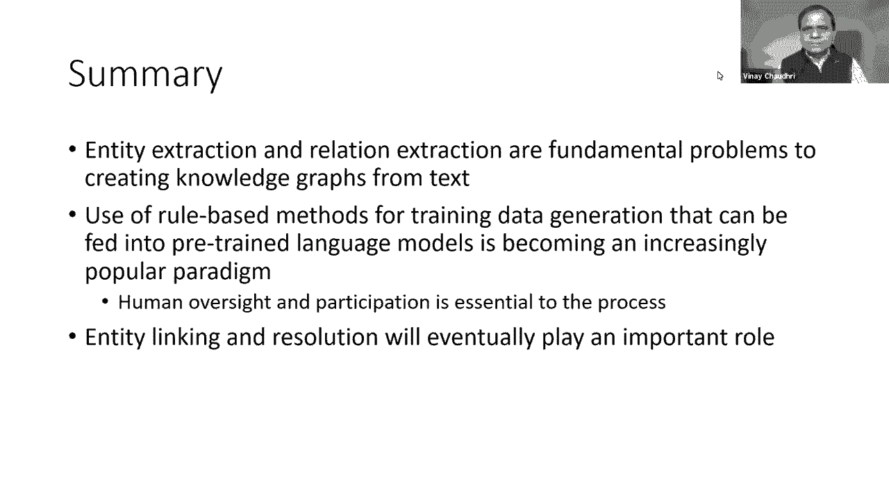

# 13：L9 - 如何从文本数据中构建知识图谱 📚 

在本节课中，我们将要学习如何从非结构化的文本数据中自动构建知识图谱。我们将首先概述从文本中提取信息以构建结构化知识表示所面临的挑战，然后介绍用于实体提取和关系提取的核心方法，特别是当前流行的语言模型技术。最后，我们将通过一个“智能教科书”的具体应用案例，来探讨这些方法在实际项目中的应用效果与面临的挑战。

---

## 🧠 第一部分：从文本构建知识图谱的方法

上一节我们概述了课程目标，本节中我们来看看从文本构建知识图谱的具体方法。我们将从问题概述开始，然后介绍一种通用的技术——语言模型，它可用于实体提取和关系提取任务，最后对本部分内容进行总结。

众所周知，大量有用信息存在于非结构化文本中，例如美国证券交易委员会文件、华尔街日报和金融新闻。如果我们能自动处理这些信息并构建知识图谱，就能在其上进行许多有趣的分析。进行此类处理的明显技术来自自然语言处理领域，特别是信息提取领域。但需要明确的是，本节课的重点不是深入讨论NLP，而是将其视为一个可用的工具，服务于构建知识图谱这一核心目标。

在第一节课中，我们展示了如何从句子中提取信息并用知识图谱表示。例如，给定句子“Albert Einstein was a German born theoretical physicist who developed a theory of relativity”，我们会提取诸如“Albert Einstein”、“Germany”、“theoretical physicist”等实体，以及“born in”、“occupation”和“developed”等关系，并用有向图将它们连接起来。

在从文本提取信息的整体范围内，我们面临实体提取和关系提取的问题。此外，还有实体消歧的问题，即同一实体在文本中可能以多种不同方式被指代。本节课将不涵盖实体消歧，部分原因是为了限定范围，部分原因是当前实体提取和关系提取任务本身在复杂问题上已足够困难。

对于这两项任务，当前的流行趋势是使用称为语言模型的技术。因此，我将首先简要描述什么是语言模型，然后在介绍实体提取和关系提取技术时，讨论语言模型目前如何被用于这些过程。

语言模型背后的核心概念是，它是一个能预测在单词序列中下一个应出现什么单词的工具或模型。例如，给定文本片段“students open their …”，语言模型的任务是填充“…”处的下一个单词，例如“books”、“laptops”或“exams”，并为每个预测的单词关联一个出现的可能性概率。

更正式地说，语言模型也可以被视为一个概率分布，给定一组单词 `x1` 到 `xn-1`，我们想要预测下一个单词 `Xn`。语言模型应用广泛，例如搜索引擎的查询补全和手机输入法的单词预测。如今，这些语言模型通常使用深度学习模型创建，循环神经网络是创建这些语言模型的流行方法。

有多种预训练语言模型的变体，其差异取决于训练数据、是单向还是双向模型以及所使用的特定神经网络架构。对于本课程，我们假设可以获取现成的语言模型，并能将其适配到我们手头的任务——构建知识图谱。

了解单向和双向语言模型之间的区别很有用。我之前给出的例子是单向语言模型，我们给定一个单词序列并预测下一个单词。在双向模型中，我们给定一个完整的句子，其中省略了一个特定单词，现在我们拥有该单词左右两侧的信息，并预测中间的单词。

近年来一个备受关注的语言模型是BERT，它最初由谷歌开发。最近，一个名为GPT-3的新语言模型引起了大量关注。

---

### 🔍 实体提取方法

现在，让我们专注于实体提取的具体问题。我将首先给出一个运行示例，然后概述进行实体提取的各种方法，并讨论使用自动实体提取时出现的挑战。

以这个句子为例：“Cecilia Love, 52, a retired police investigator who lives in Massachusetts, said she paid around $370 a ticket with tax for nonstop United Airlines flight to Sacramento from Boston for her niece‘s high school graduation in June 2020.” 给定这个句子，我们希望提取命名实体，其定义包括地点、公司、人物等，这里的实体定义通常也扩展到包括日期、时间和数字表达式，例如“$370”和“June 2020”。

任务是将上面的输入句子转换为如下所示的带标注版本。例如，“Cecilia Love”被标记为“PERSON”，“Massachusetts”被标记为“LOCATION”，“$370”被标记为“MONEY”，“United Airlines”被标记为“ORGANIZATION”。

通常，我们使用一组标签来标记句子中的实体，因为实体可能由多个单词组成。定义了五个标签来标记边界：`B`表示实体中的第一个单词，`E`表示实体中的最后一个单词，`I`表示实体中的内部单词，`O`表示非实体单词，`S`表示单单词实体。

在实体提取的广义方法上，主要有三种：序列标注方法、基于神经模型（即语言模型）的方法和基于规则列表的方法。我将对每种方法进行简要概述。

在序列标注方法中，我们采用标准的机器学习类型算法，例如条件随机场。我们为其提供训练数据，这些数据使用诸如词性、是否出现在命名实体主列表、词嵌入、单词前缀以及是否以全大写形式出现等特征。可以看出，如果使用任何类型的机器学习方法，都需要大量的特征工程。

现在，让我们谈谈使用神经模型进行实体提取。这里，我们将采用一个现成的语言模型，如BERT，并将其应用于我们手头的问题。这涉及两种步骤：任务无关训练和任务相关训练。

我们从现成获取的这些语言模型是在非常广泛的语料库上训练的。但通常，我们总是对特定领域或解决特定问题感兴趣。因此，任务无关训练的第一步是在我们感兴趣的领域上重新训练我们已有的模型，使其理解该特定领域的特殊性、词汇或出现的单词。

第二步是任务相关训练。在这种情况下，任务是实体提取。接下来我们要做的是在实体提取任务上训练我们的模型。具体做法是，我们将在句子中引入特殊标记。例如，在我们之前处理的句子中，我们有一个名为`[CLS]`的标记，表示实体的开始，以及`[SEP]`，表示实体的结束。当我们训练一个包含这些标记的语言模型时，它将学习如何预测这些标记。我们可以通过现在要求它预测下一个标记是`[CLS]`还是`[SEP]`来重新调整语言模型的用途以用于实体提取任务。如果我们让它预测这些特殊标记，我们就知道实体边界在哪里，并可以利用这些信息来标记句子中的实体位置。

现在，让我们谈谈基于规则的实体提取。其基本思想是，我们将编写一组规则，告诉我们应如何提取实体。这些规则可以基于非常简单的正则表达式，或基于字典查找，或调用自定义提取器。但归根结底，就像在特征工程中一样，我们必须进行规则工程，必须对我们的领域有足够的了解以确定实体是什么，并且必须能够指定有助于提取实体的相关规则。

做好实体提取的困难之处显而易见。首先是歧义性，例如“Louis Vuitton”可以指公司、人物或产品。其次是训练数据获取、特征工程或规则工程是做好此过程的瓶颈。此外，某些领域存在非常特殊的变体，例如在生物学中，实体可能是很长的短语。在某些领域，必须提取非常通用的术语作为实体，例如“attach”或“bind”。最后，实体具有多种形式，例如单复数、缩写和形态变体。除非我们拥有大量的词汇知识，否则我们将无法确定它们都指向同一实体。如果希望实体提取器具有非常高的性能，我们还需要该领域有一个非常好的词典，以便准确区分实体的不同变体是否实际指向同一事物。

---

### 🔗 关系提取方法

上一节我们介绍了实体提取，本节中我们来看看关系提取的方法。同样，我将首先给出一个提取任务的示例，然后概述进行关系提取的各种技术，并讨论关系提取的难点。

示例与实体提取考虑的句子相同，现在我们希望提取诸如“Cecilia Love lives in Massachusetts”（“lives in”是关系）和“United Airlines flies from Boston”（“flies from”是关系）等信息。

一个非常流行的任务是提取维基百科中的信息，因为这对增强搜索结果非常有用。从维基百科提取事实大多是直接的，但存在许多边缘情况。例如，拉里·金的维基百科页面显示他结婚多次，每次婚姻都有时间跨度。如果一个人只结过一次婚，那么提取配偶关系就很简单，但当一个人结婚多次，有时甚至与同一个人结婚两次时，将适当的时间信息与你提取的事实关联起来很快就会变得非常复杂。

我在谈论实体时提到了特定领域的提取系统，关系提取同样存在这种情况。例如，在医学领域，他们主要对诸如什么事物导致什么疾病、什么药物可以治疗什么症状、什么酶或化学物质破坏什么过程等信息感兴趣，这些含义及其定义方式非常特定于生物学领域。

对于关系提取，也有三种广义方法：基于规则的方法、监督学习方法以及开放信息提取。即使在监督学习中，人们也做了许多细分，例如半监督或完全监督。但就我的讨论目的而言，只要方法是监督式的，我都将其归在监督方法的同一标题下。

开放信息提取方法是一种提取信息的方式，它不特别关注标签的含义，只是从文本中提取三元组。例如，给定句子“Dante passed away in Ravenna”，开放信息提取方法会简单地将此文本片段转化为一个三元组：“Dante passed away in Ravenna”。相比之下，在知识图谱中，我们有一个具有明确定义语义的关系词汇表。例如，在右侧的属性图中，我们有一个“Person”节点和一个“City”节点，以及一个名为“deathPlace”的关系，该关系可能定义了域和范围约束，对其可以或不可以取的值有一些规则和约束。每当我们谈论一个人在哪里去世时，我们都会使用相同的关系。因此，这里发生了细致的知识工程和知识表示，而这在开放信息提取中是不会做的。开放信息提取只是以完全无监督的方式处理文本。对于某些类型的问题来说，这是一个流行且非常有吸引力的方案，但使用以开放信息提取方式提取的信息进行推理和分析变得非常困难。因此，就本讲座的目的而言，我决定将其排除在范围之外，因为我们主要关注知识图谱，并且对有助于我们在知识图谱中填充具有明确定义的节点和标签含义的表示技术感兴趣。

因此，在我的其余讨论中，我将主要讨论基于句法模式和监督学习的信息提取或关系提取。

句法模式最初由Marti Hearst引入，为纪念她，这些模式也被称为Hearst模式。我通过一个取自该主题原始论文的例子来说明。以这个句子为例：“The bolu such as bambbaran d is plucked and has an individual curved neck for each string.” 即使从未见过“bolu”，不知道“bambbaran”和“dang”是什么，我们也可以仅从句子的句法结构推断出“marin D”一定是“boat loop”的一种。这就是Marti Hearst的关键见解，她指出我们可以定义这样的句法模式，基于句子的结构方式，可以为我们提供它们之间可能存在什么关系的强烈指示。在她的原始论文中有几个例子，例如，如果我们有“works by authors such as Ericrick Goldsmith and blah, blah, blah”这样的句子，我们知道“Herrick”和“Goldsmith”是作者。然后，如果你有“bruises, wounds, broken bones or other injuries”这样的句子，那么我们知道在这个句子中，“bruises”和“wounds”一定是“injuries”的一种。

当这个想法最初被引入时，人们认为这非常酷，如果能这样提取，这难道不是一种非常可扩展的方式吗？但事实证明，推广它并不那么容易。因此，即使在原始论文中，也有关于如何将其推广到未见过的关系的部分。建议的一般方法是，如果你想提取某种关系，你需要收集大量描述该关系的句子示例，然后从中找出一般模式，并为这些一般模式定义句法模式。然而，对于某些关系，如“has part”，很难找到关于如何从文本中提取它的非常通用的模式，我将在讲座的第二部分给你更多这方面的例子。

有些人已经进行研究，试图自动学习这些模式，而不是必须使用示例手动设计这些模式，并从这些关系在句子中的示例实例中反向工作。这在有限领域取得了一些成功，但并非以非常通用的方式。

现在让我们转向关系提取的监督学习方法。首先，它需要大量的训练数据。虽然可能不需要为句子中的示例出现定义模式，但仍然必须找到那些关系出现的句子。有些人会使用Marti Hearst风格的句法模式，并利用这些模式生成大量的训练数据。相反，鉴于这些训练数据、这些句法模式并不非常通用且并非总是有效，最近出现了一个称为“近似标注”的想法，这是我们系的Chris Ré率先提出的。其基本思想是，虽然我们无法找到明确的方法来确定特定关系是否存在于句子中，但我们将拥有大量不同的句法模式，这些模式可能暗示该关系可能存在于句子中。然后我们将使用所有这些模式，并通过训练过程学习每个模式的好坏，并将它们提供给我们的学习算法的输入或信号结合起来。

接下来，让我们谈谈如何使语言模型适应关系提取任务。这里的基本思想与我们用于实体提取的技巧没有太大不同。本质上，我们做的是：我们获取输入句子，并在句子中放入这些特殊标记，表示每个术语的开始和结束。例如，“term1_start”和“term1_end”表示第一个实体，“term2_start”和“term2_end”表示第二个实体。在我们的训练数据中，我们将训练我们的语言模型，当它遇到这样的句子时，其输出应该是我们试图预测的关系，例如“lives in”。同样，基本思想保持不变：增强输入数据以添加与您要执行的任务相对应的标记，向模型提供大量数据，并使其学习您试图产生的输出。

在这种情况下可以预期的挑战首先是训练数据，即如何获得大量关系示例的训练数据，这是任何这些技术工作所必需的。鉴于所有这些技术都是近似的，它们不会在所有情况下都有效，如果最终目标是获得高精度的知识图谱，我们仍然需要在最后进行人工验证。我在这里主要讨论了针对实体的关系提取，但在尝试提取事件的关系或尝试提取关于实体的时间信息时，还有专门的方法。我在本讲座中没有涵盖它们，但我只是想让大家知道，除了我在这里介绍的内容之外，还有更多内容。

---

### 📝 第一部分总结

至此，我们完成了第一部分关于方法的讨论。总结来说，实体提取和关系提取是如果我们想从文本创建知识图谱所面临的基本问题。方法的整体情况是，人们仍然更喜欢使用基于学习的方法来做到这一点，但基于规则的方法和句法模式是非常强大的范式。人们正在利用它们来创建或引导他们学习算法所需的训练数据。目前的技术水平仍然是我们仍在努力做好实体提取和关系提取，而实体消歧是一个极其困难的问题，我将其排除在本讲座之外只是为了限定范围。但最终，我认为一旦实体提取和关系提取得到很好的解决，实体消歧将变得越来越重要。

---

## 💡 第二部分：具体应用案例——智能教科书

上一部分我们介绍了从文本构建知识图谱的通用方法，本节中我们将通过一个名为“智能教科书”的具体应用，来探讨这些方法在实际项目中的应用效果与面临的挑战。

我将首先讨论什么是智能教科书，我们实际上需要什么样的知识图谱，然后讨论如何提取实体和关系，最后谈谈我们的经验、我们取得了多少成功，以及我认为在知识图谱构建调查中使用自动提取方法的前进方向。

我喜欢将智能教科书定义为由在书中发现的概念和关系的知识图谱增强的传统教科书。一旦我们将传统书籍与知识图谱结合起来，我就称之为智能教科书。当然，对于智能教科书可能有其他定义，但这就是我为本次讲座目的所定义的方式。

现在，这里出现的第一个问题是：谁需要它？为什么你应该关心？我们在创建智能教科书中要解决什么问题？我认为，我们所思考的这种智能教科书有助于让学生更容易学习复杂的新概念。一个有这种问题的学生例子是大学一年级生物学学生。如果你与这些有朝一日想成为医生的学生交谈，当他们走进生物课堂时，我们会递给他们这些厚厚的教科书，如果他们想继续学业，就必须掌握这些书。这些学生普遍的感受是生物学非常复杂，有大量的新词汇，他们感到迷茫。为了帮助这样的学生，我们认为智能教科书可能是一项强大的技术，并且我们已经构建了这种教科书的具体原型，我将向你演示这本书，以便你可以具体地看到我在谈论什么。

它具有五种不同的功能来帮助学生。首先，对于出现的任何困难词汇，如“proteins”、“polysaccharides”和“nucleic acids”，学生只需点击即可获得快速定义。其次，它有助于交叉链接来自书中不同部分的内容，包括图表，无论这些图表可能在哪一章定义。第三，它为书中的每个概念提供知识图谱可视化，学生可以交互式地探索此可视化，以确保他们学到了正在学习的内容。第四，当学生阅读书籍并突出显示一段文字时，它会向学生提问。例如，在这种情况下，学生隐约记得血红蛋白携带氧气，但不确定。因此，他们决定点击那个问题，通过将自己的答案与书返回的答案进行比较，他们重新获得了信心，确信自己真正理解了材料。因此，它是一个很好的自我测试设备。最后，他们可以向书本提问，例如，学生问“比较蛋白质与多糖”。作为对此类问题的回应，本书将系统地比较这两个概念，并将结果以组织良好的表格形式呈现。

利用这五种由知识图谱驱动的新功能，学生能够更有效地与这个复杂的知识体系进行互动和参与。

这不仅仅是一个演示，它实际上是一个可工作的原型，我们已经在一些社区学院、瑞典的一所大学校园以及哈佛大学的多个教室中进行了测试，我们发现，我刚才在演示中展示的这些功能普遍受到学生喜爱，它们还能带来更好的学习成果，并且也有助于表现不佳的学生。

创建此类智能教科书的真正挑战实际上是构建图谱，如何为大量书籍以可扩展的方式实际构建图谱。接下来人们可能会问的问题是：但实际需要什么样的知识图谱？我们试图创建什么，才能实现我刚才展示的那种演示？

让我们更仔细地看一下，因为这个例子与我在讲座第一部分中考虑的Cecilia Love例子更加不同。以这个句子为例：“On the outer surface of the plasma membrane, carbohydrate side chains are found attached to proteins in lipid.” 由此，我们希望构建一个如右侧所示的图谱，其中我们有“plasma membrane”、“carbohydrate side chain”等，但“protein”和“lipid”不是以“protein”和“lipid”出现，而是以“glycoprotein”和“glycolipid”出现，它们是更特殊种类的蛋白质。这些蛋白质并没有在这个句子中明确提到，它们可能是在教科书中谈论这些更特殊种类蛋白质的其他部分提到的。但是，当我们提取信息并希望构建这个知识图谱时，我们希望构建这种有凝聚力的全局知识图谱。在这种情况下，要构建这样的东西，我们还必须将这个“lipid”实体与图谱中已经存在的“glycolipid”实体进行消歧，同样，“protein”实体与“glycoprotein”实体进行消歧。

我认为需要指出的另一点是这个图谱的实际含义是什么？这是一个我们在本课程中定义的那种直接标记图，但它到底在说什么？如果我阅读这个图谱的逻辑含义，它大致是说：对于每个质膜，存在一个糖蛋白，存在一个碳水化合物侧链，使得该侧链是糖蛋白的一部分。你在这里会注意到的第一件事是，我们在这个知识图谱中的节点是类，而不是像Cecilia Love或Boston或United Airlines那样的东西，这些是我们在讲座第一部分看到的那种东西，但这里我们有类对象，如质膜、糖蛋白等。因此，我们想用这个图谱做的实际含义严格来说远不止实体