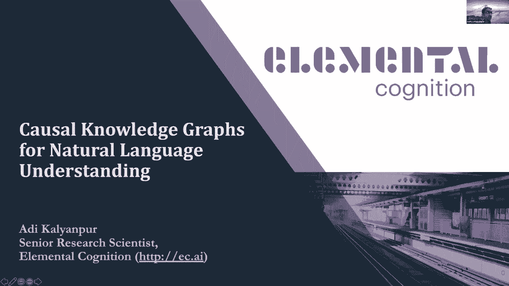
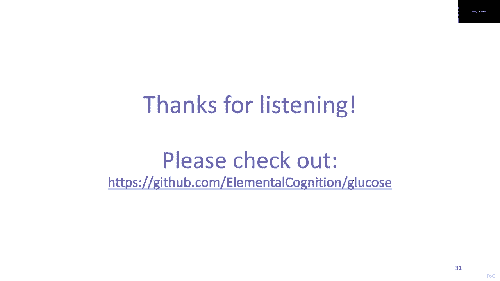

# 14：L10.1 - 构建用于语言理解的因果知识图谱 🧠

在本节课中，我们将学习如何从非结构化文本中构建用于自然语言理解的因果知识图谱。我们将探讨如何通过众包收集高质量的常识知识，并利用先进的神经模型动态生成因果规则，最终将这些规则集成到神经符号推理系统中，以实现更深刻、可解释的语言理解。

---

## 概述

本次课程的核心是介绍一种超越传统浅层文本理解的方法。我们旨在构建能够显式表达文本背后逻辑和因果关系的知识模型。课程将分为几个部分：首先介绍叙事理解任务及其挑战，然后讲解如何通过众包平台收集因果知识数据，接着展示如何利用预训练模型动态生成规则，最后探讨如何将这些动态规则集成到推理系统中。

---

## 叙事理解任务与挑战

上一节我们概述了课程目标，本节中我们来看看一个具体的自然语言处理任务：叙事理解。

叙事理解的一个特殊变体是“故事结尾预测”任务。例如，给定一个短篇故事和两个可能的结局，系统需要选择最合理的结局。这项任务需要丰富的常识知识来理解故事背景并预测后续发展。

人类在此任务上可以达到近乎完美的准确率。然而，在2016年，人工智能系统在此任务上的准确率仅约65%，远低于人类的100%。这揭示了AI在深度语言理解上的不足。

---

## 预训练语言模型的兴起与局限

上一节我们看到了AI在叙事理解上的早期挑战，本节中我们来看看一项重要的技术发展：预训练语言模型。

2017年底，Transformer架构的提出彻底改变了自然语言处理领域。与之前的循环神经网络不同，Transformer能并行处理整个文本序列，并通过“注意力机制”学习词语在上下文中的含义。

基于Transformer的模型（如GPT、BERT）在大规模语料库上进行预训练后，可以在各种下游NLP任务上通过微调达到顶尖水平。例如，在故事结尾预测任务上，微调后的GPT模型准确率提升到了86%。

尽管这些模型在许多基准测试上表现出色，但它们存在两个主要问题：
1.  它们是“黑盒”模型，难以解释其预测过程和原因。
2.  它们缺乏真正的常识知识，其表现严重依赖训练数据的分布，泛化能力弱。

---

## 葡萄糖数据集：收集因果知识

上一节我们讨论了预训练模型的局限性，本节中我们来看看如何系统地收集常识知识来解决这些问题。

我们提出了“葡萄糖”数据集项目，旨在从文本中收集特定于上下文的因果解释规则。我们定义了十个理解维度，涵盖事件的前因后果、角色动机、空间状态等。

以下是收集数据的十个维度：
*   **维度一**：什么事件直接导致了X？
*   **维度二**：什么情绪或动机促使了X？
*   **维度三**：什么位置状态使X成为可能？
*   **维度四**：什么属性使X成为可能？
*   **维度五**：什么先决条件使X成为可能？
*   **维度六至十**：分别是前五个维度的对偶，关注X导致的结果。

我们设计了一个高效的多阶段众包平台来收集数据。参与者需要先通过资格测试，然后在给定故事和焦点句子的情况下，为相关维度生成具体的和一般的因果规则。

通过这种方法，我们收集了约62万条高质量的常识推理规则，覆盖了大量新的、隐含的知识，这些知识在现有知识库（如ConceptNet, ATOMIC）中很少出现。

---

## 动态规则生成模型

上一节我们介绍了如何收集因果知识数据，本节中我们来看看如何利用这些数据让机器学会“动态”生成规则。

我们不满足于构建一个静态的知识库，而是希望训练一个模型，使其能够针对新的故事和问题即时生成相关的因果规则。我们将此任务构建为一个机器学习问题：输入一个故事、一个焦点句子和一个目标维度，模型需要输出相应的具体规则和一般规则。

我们测试了多种模型：
*   **K最近邻模型**：在训练集中寻找最相似的例子，效果不佳。
*   **预训练GPT-2**：直接使用，缺乏相关常识知识，效果很差。
*   **微调GPT-2**：在葡萄糖数据上微调后，效果有所提升。
*   **编码器-解码器模型**：我们采用了T5模型，将故事、句子和维度作为输入，将规则作为输出进行训练。这种方法取得了最佳效果，其生成的规则质量接近人类水平。

实验表明，即使在这个极具挑战性的常识推理任务上，只要用高质量的数据对强大的预训练模型进行微调，它们就能在未见过的数据上生成合理的因果规则。

---

## 神经符号推理：集成动态规则

上一节我们展示了模型可以动态生成规则，本节中我们来看看如何将这些规则用于实际的推理任务。

我们构建了一个神经符号推理系统。与传统系统仅依赖静态知识库不同，我们的系统在推理过程中可以动态调用规则生成模型来填补知识空白。

例如，回答“费尔南多为什么要买薄荷植物？”这个问题时，系统会从故事中提取事实，并结合以下规则进行推理：
1.  **核心理论规则**（手动编码的通用规则）：`如果一个对象有一个部分，而该部分有一个属性，那么对象可能也有该属性。`（植物有叶子，叶子有薄荷味 → 植物可能有薄荷味）
2.  **动态生成规则1**：`如果一个智能体喜欢某物的某个属性，那么他可能喜欢该物本身。`（费尔南多喜欢叶子的薄荷味 → 他可能喜欢这种植物）
3.  **动态生成规则2**：`如果一个人喜欢某样东西，他就会有购买的动机。`（费尔南多喜欢这种植物 → 他有动机购买它）

通过这种结合，系统不仅能给出答案，还能提供一个清晰、可追溯的逻辑解释链。我们将此系统应用于故事结尾预测任务，取得了接近最先进水平的性能，同时具备了可解释性。

---

## 总结

本节课中我们一起学习了构建用于语言理解的因果知识图谱的完整流程。

我们首先指出了深度语言理解需要显式的因果和常识模型。接着，我们介绍了通过众包收集高质量因果知识数据（葡萄糖数据集）的方法。然后，我们展示了如何利用这些数据训练模型，使其能够针对新上下文动态生成因果规则。最后，我们探讨了如何将这些动态生成的规则集成到神经符号推理系统中，从而结合了符号推理的精确性、可解释性与神经模型的灵活性和知识获取能力。

这种方法为解决传统知识表示系统（知识获取瓶颈）和端到端深度学习模型（缺乏可解释性）的固有缺陷提供了一条有希望的途径。

---