# 15：L10.2 - 可用于图像理解的场景图谱 🖼️ 

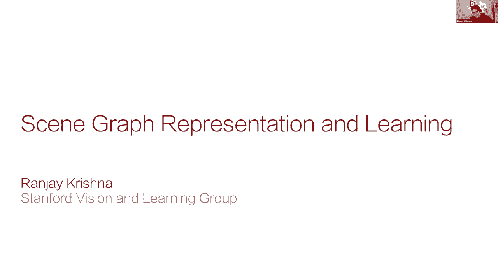

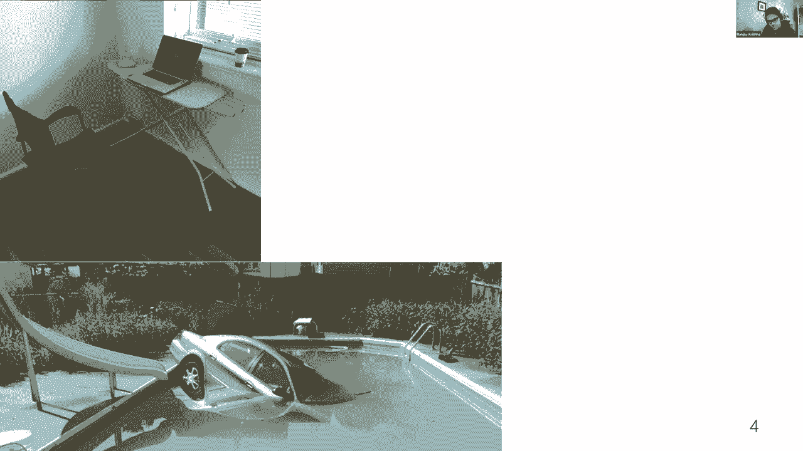

在本节课中，我们将学习如何设计能够理解图像中复杂关系的计算机视觉模型。我们将重点介绍一种名为“场景图谱”的表示方法，它借鉴了人类认知的原理，能够帮助模型更好地推广到训练数据中从未见过的新颖组合。

---

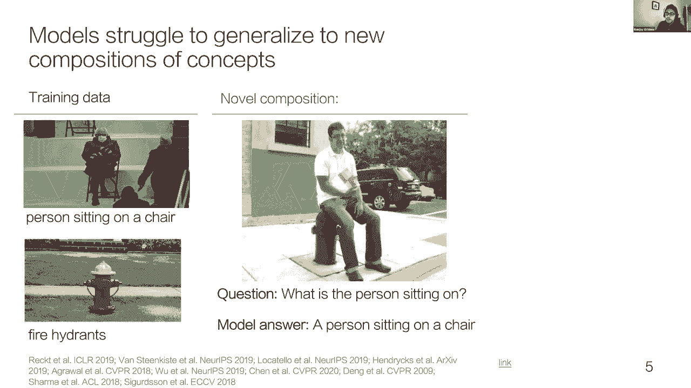

尽管计算机视觉在识别物体方面取得了巨大进步，例如通过ImageNet项目，但我们的世界不仅仅是物体的集合。世界是丰富多彩且充满活力的。人们不断以新的方式使用物品，创造出意想不到的场景。动物也展现出令人惊讶的自主行为。我们在世界上遇到的这些新情况很平常，人类可以相对轻松地对其进行解释和推理。

然而，尽管深度学习在过去十年取得了惊人进步，但驱动当今视觉技术的模型仍然难以真正理解视觉世界。先前的研究多次注意到，当视觉模型看到新颖的物体组合时，它们很难进行概括，即使它们已经单独见过这些概念。例如，即使模型见过消防栓和人的例子，它们也可能学会“作弊”，忽略图像的某些区域，错误地预测一个人坐在椅子上，而不是坐在消防栓上。这些错误源于模型继承了数据中的偏见，因为大多数“人坐着”的例子都是坐在椅子上。

事实上，即使是OpenAI发布的最新拥有120亿参数的模型，使用了超过4亿个训练数据点，仍然难以概括这些新颖的组合。这更多是一个表示问题，而不仅仅是数据问题。相比之下，人类认知可以从先前看到的有限概念集合中，构造出无限多的新表示。人类利用过去的经验归纳地发展了对世界的组合模型，这使我们能够理解新情况并快速学习新任务。

因此，要让机器拥有视觉智能是一个挑战，它要求我们从根本上修改计算机视觉的表示方式。目前，大多数任务只使用物体表示。受人类学习的启发，今天我们将探讨如何设计能够推广到新颖组合的模型。我们将从比德曼的种子感知模型和杰里米·沃尔夫的视觉记忆与认知科学模型开始，设计一种新的视觉表示。然后，我们将展示如何利用这种正确的表示，让模型从有限的训练情况中学习，并推广识别出由已见概念组成的全新情况。

本节课首先介绍场景图谱，这是一种密集的、组合式的通用视觉智能表示。然后，我们将利用场景图谱设计更善于识别新奇组合的模型。最后，我们将展示如何利用场景图谱，仅用五个训练示例就完成整个下游计算机视觉任务。

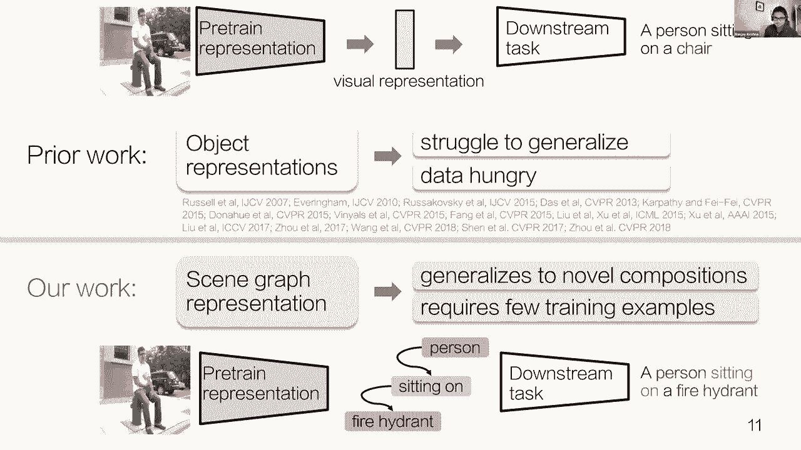

---

## 🧠 当前范式的局限性

当前训练计算机视觉模型的主导范式是：首先在大量网络抓取数据或ImageNet等大型数据集上预训练潜在表示或物体表示，然后将这些学习到的表示应用于下游任务，如图像字幕或视觉问答。

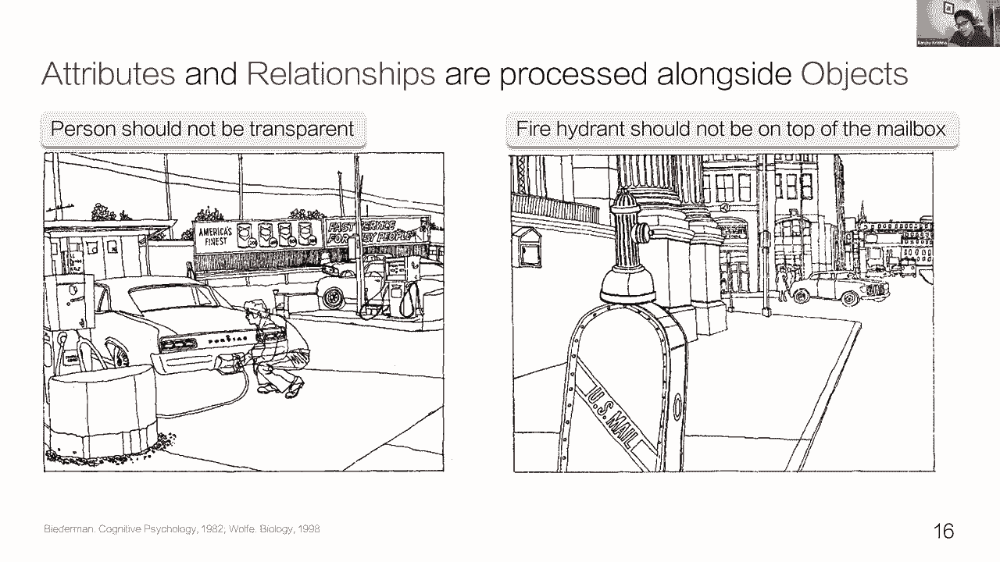

不幸的是，这些潜在或物体表示往往难以概括。它们倾向于学习“捷径”并忽略视觉输入的整个区域，以在数据集上最大化性能。因为这些习得的表征最终变得不完整，所以使用这些表示的下游模型需要更多数据才能达到合理的性能。

我们的主要见解是引入一种新的表示，我们称之为“场景图谱”。我们将证明，在场景图谱上预训练的模型将帮助模型推广到完全新颖的组合，例如“一个人坐在消防栓上”。因为这种表示以组合的方式捕捉了更多信息，下游模型将需要更少的训练示例来获得合理的性能。

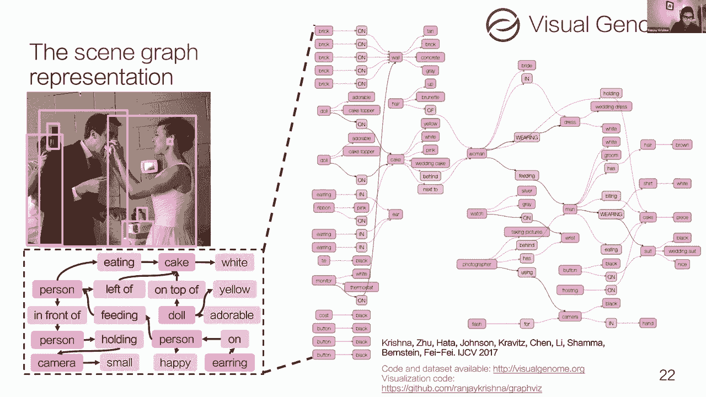

---

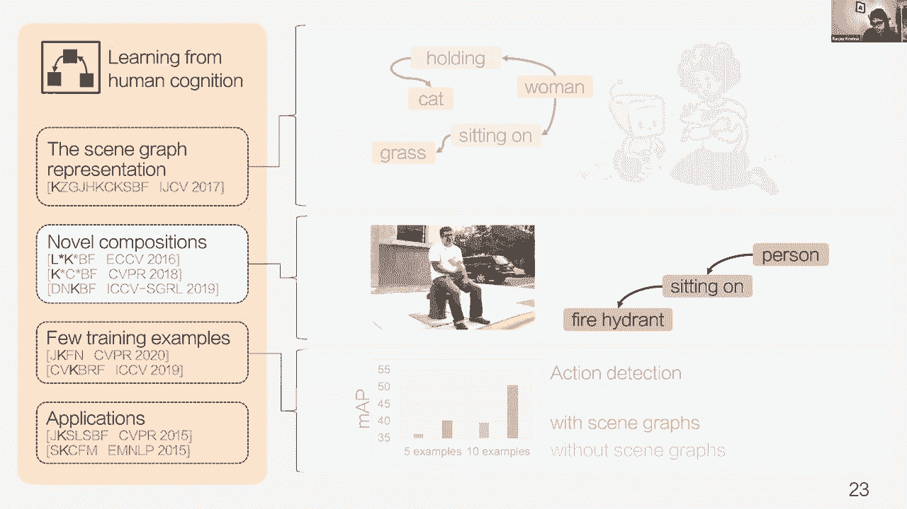

## 📊 设计场景图谱表示

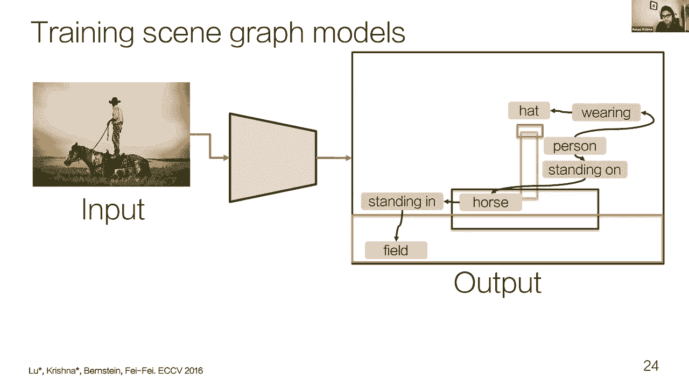

首先，让我们思考为什么物体表示作为计算机视觉中最常见的预训练形式，不足以完成各种下游任务。

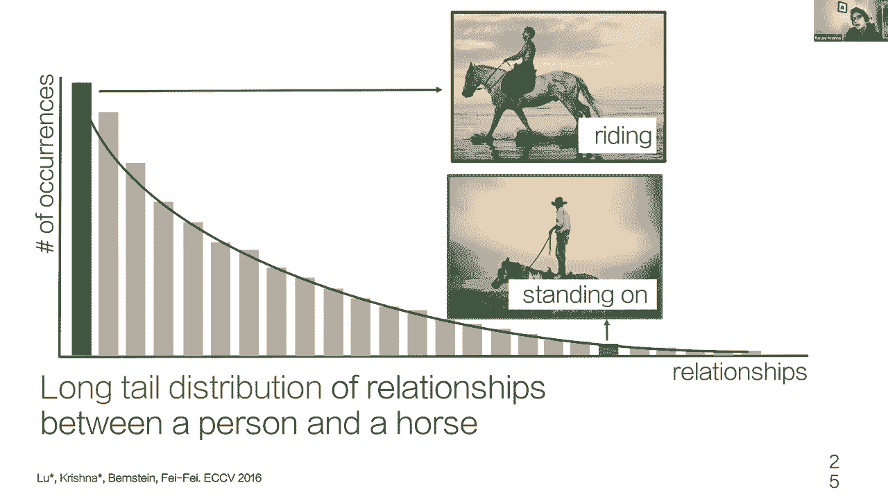

请看以下两张图片。物体特征或物体检测会告诉我们图像中有两个人，以及他们的位置。仅凭这些信息，我们可能会认为这两张图像包含相似的语义内容。但有时，相同的物体检测特征可能有非常不同的解释。例如，在一张照片中，一个人愤怒地对另一个人大喊；在另一张中，一个人在关注另一个人。

因此，当我们将这些物体表示用于下游任务时，难怪模型难以概括，并且需要大量数据来支持像图像字幕这样的任务。

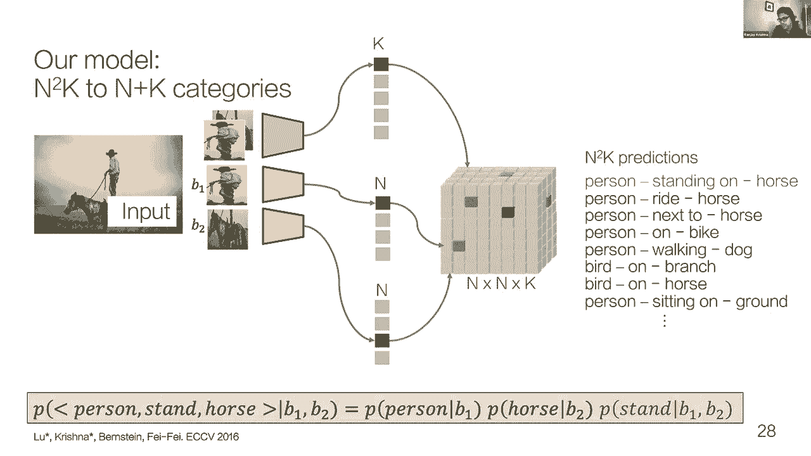

这就引出了一个后续问题：什么是好的视觉表现？我们从人类视觉中知道，人们非常擅长适应新颖的组合。为了建立视觉智能的表示，我们转向计算神经科学与心理学，希望为人们如何处理视觉刺激找到灵感。

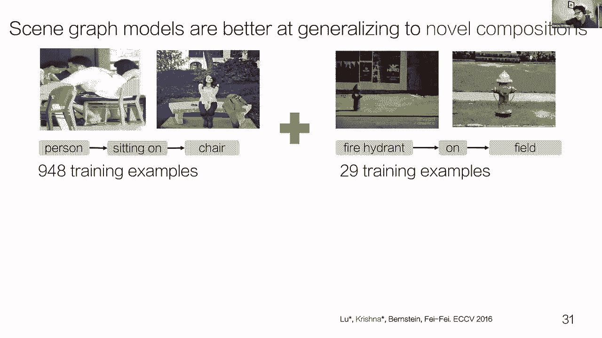

回到80年代，欧文·比德曼，以及90年代的杰里米·沃尔夫等人探索了这个问题。比德曼从他的实验中得出结论：除了对物体和场景进行分类，人们还会同时处理物体的属性以及物体之间的关系（如人的互动）。例如，将“透明”属性归于第一个图像中的人，或者“邮箱顶部的消防栓”这种违反常规的关系，都会减慢测试对象对物体进行分类的速度。他从实验中得出结论，物体处理的减慢可能意味着我们正在并行处理物体的属性和关系，这干扰了我们理解图像中存在哪些物体的能力。

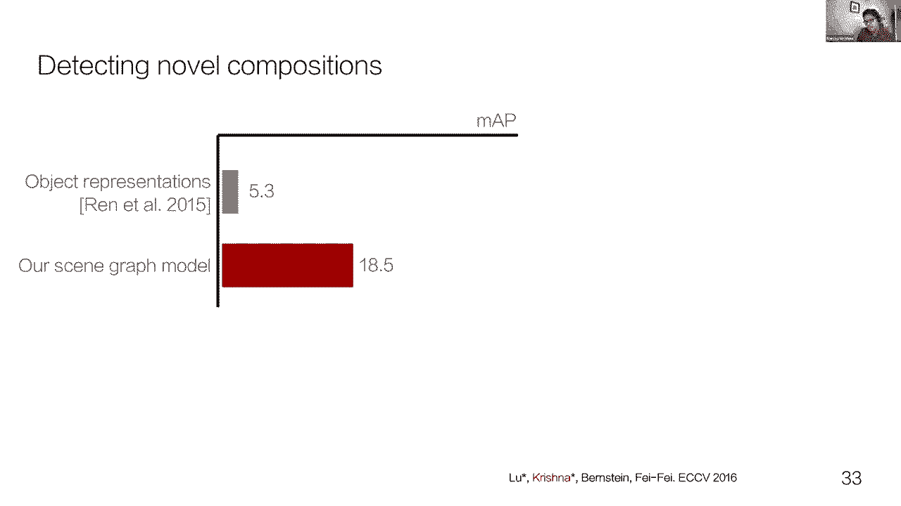

在一组类似的人类记忆实验中，杰里米·沃尔夫也得出结论：物体不足以解释人类的视觉表征。他也指出，我们必须编码这些对象之间的关系或相互作用，并且这与物体识别是并行进行的。

基于几十年来对人类认知基础的多项研究，我们设计了一种新的视觉表示，称之为“场景图谱”。场景图谱表示将每张图像编码为一组以边界框定位的物体。每个框都与描述物体不同特征的属性相关联。物体之间也通过关系相互连接。这是一个解释图像一小部分的图结构。

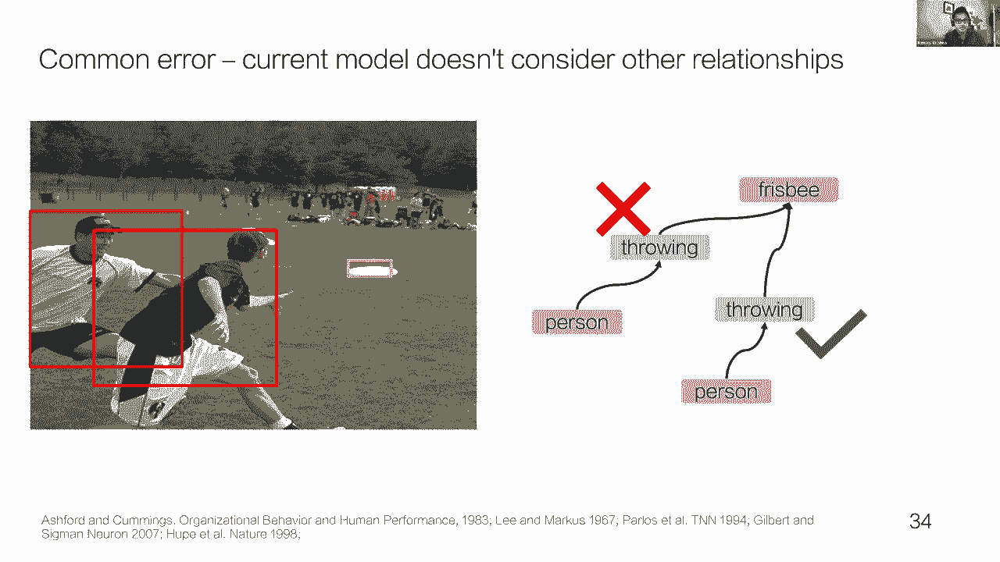

为了真正研究场景图谱的效果，我们启动了一个名为“视觉基因组”的项目，旨在用场景图谱绘制视觉世界。我们最终注释了一个相当大的数据集，以研究在各种计算机视觉测试中使用场景图谱的效用。

---

## ⚙️ 场景图谱预测的挑战

我们已经看到了图谱设计并收集了数据集，我们开始训练模型来预测场景图谱。我们发现这些场景图谱确实更善于概括新颖的组合。然而，用模型来预测这些场景图谱是一个相当困难的挑战。

让我正式解释一下这个挑战是什么。我们可以训练场景图谱模型，期望图像作为输入，并使用图像中检测到的物体生成图结构，包括与每个物体相关联的属性以及成对物体之间的关系。在接下来的讨论中，我将忽略属性，因为它们可以与物体非常相似地建模。相反，我将专注于物体和关系之间的结构化预测任务。

在这里，我们想检测“人”、“帽子”、“田野”、“马”作为图像中不同种类的物体。我们还希望能够分类成对物体之间的关系。例如，我们可能想说“人”和“马”之间的关系是“站在”，因为那个人站在马上。

是什么让场景图谱预测如此困难？是它的长尾分布。即使是一对物体之间的关系，也有十几种互动方式。一些互动，比如“骑马”，比其他方式（如“站在马上”）更常见。

如果把每对物体及其关系作为一个单独的类别，会导致可能类别数量的二次增加。如果我们有 `n` 个物体类别和 `k` 种关系类型，我们需要建立 `n^2 * k` 个输出类别。因为这些组合中的大多数只有几个训练例子，模型最终会预测最常见的组合（如“骑马的人”），而忽略那些不频繁的组合（如“站在马上的人”）。

为了防止这种过度拟合，我们分解了问题。我们不再一起预测物体和关系，而是独立于关系来预测物体。关系现在直接从图像特征中预测出来，不与物体一起预测。我们的分解是基于比德曼的结论，即人类的视觉处理与物体并行处理关系。同样，我们的模型现在也使用一个单独的分支来独立于物体处理关系。

除了认知基础，这种分解也缓解了长尾问题。因为即使“人站在马上”在数据集中很少发生，物体探测器也会在各种不同背景下看到足够多的“人”和“马”的例子来识别这些物体。同样，关系探测器也会看到足够多的“物体站在其他物体上”的例子来正确预测关系。

一旦这些关系和物体被独立预测，我们可以通过做一个朴素的贝叶斯假设，用叉积把这些单独的预测组合起来，产生 `n^2 * k` 个预测，但现在我们只需要 `n + k` 个类别数来训练模型。

有了这个将视觉处理分解为独立物体和关系分支的新方法，我们的模型现在可以推广到完全新颖的组合。例如，通过看“骑马的人”和“戴帽子的人”的例子，模型现在可以组合并预测“马戴帽子”这个训练数据中完全没有的组合。

同样，回到最初的例子，通过观察“人坐在椅子上”和“地上有消防栓”的例子，模型现在可以结合这些片段，预测“人坐在消防栓上”这个训练数据中完全缺失的示例。

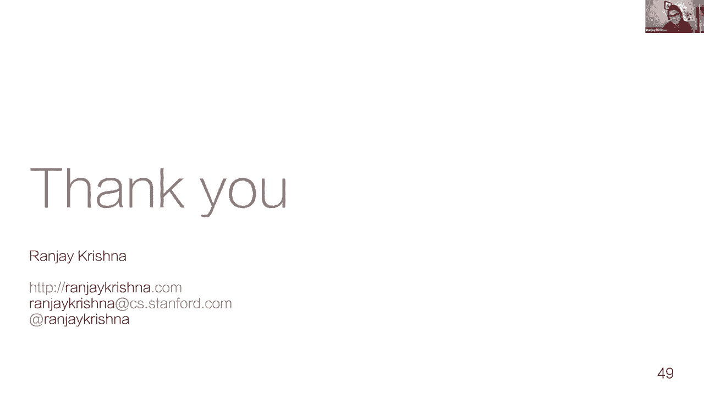

我们的模型能够将检测物体和关系的平均精度提高约三倍，与使用物体特征训练的变体相比。虽然这个结果令人鼓舞，但我们想看看是否能将性能推得更远，于是我们开始分析常见的错误来源。

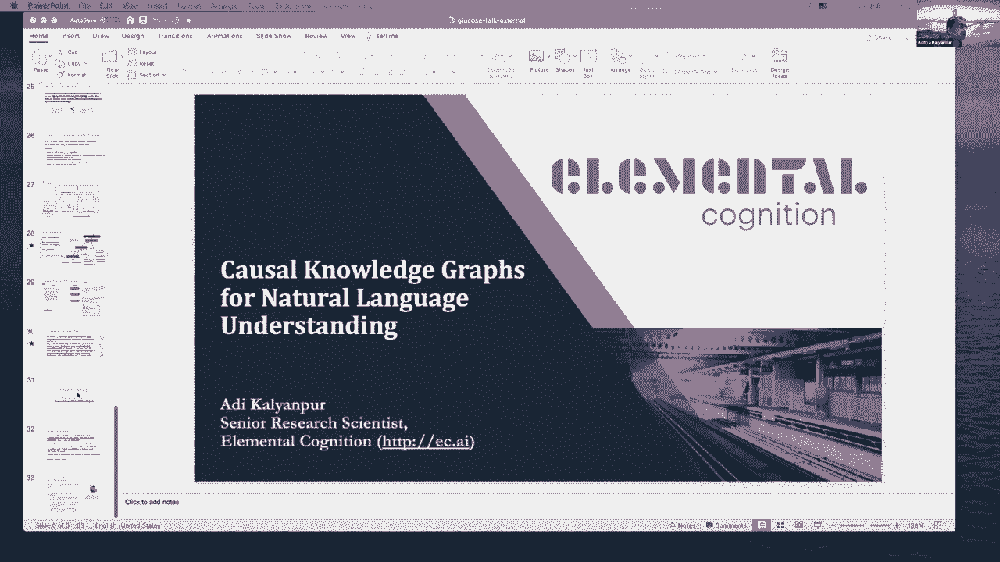

---

## 🔄 引入高阶推理与图卷积

我们发现了一种不断出现的错误。考虑这张图像：模型预测两个人都在“扔飞盘”。它没有进行更高阶的推理：如果一个人在扔飞盘，那么第二个人不可能扔出同一个飞盘，而应该是试图“抓住”或“伸手拿”飞盘。

发生此错误是因为关系预测是以前馈方式进行的。相比之下，我们从人类视觉中知道，我们的处理充满了反馈联系，我们在其中分享信息并纠正不正确的预测，做出更全面连贯的预测。

因此，我们可以使用类似机制改进模型。我们开始探索实现这一点的方法，开发了一种进行这种更高层次推理的技术。我们用一个新的图卷积层扩展了原始模型。在我们的工作中，我们将传统的图卷积公式扩展到三维可视化表示上，包含两种特殊节点：物体节点和关系节点。

物体节点学习一个我们使用小型卷积神经网络参数化的函数，从它所连接的关系中传递信息。同样，关系节点也学习合并来自它连接到的两个物体节点的信息。通过迭代更新物体节点和关系节点，经过多次迭代，我们可以有效地在整个图形中传递信息。最后，当我们的模型从这些单独的节点做出关系预测时，它现在可以拥有所有必要的信息来做出正确的预测：第二个人不是在扔飞盘。

通过图卷积，我们能够在平均精度上再增加五个点。除了数量上的改进，将关系建模为这些转换物体和关系表示的函数，也允许我们开发上下文物体表示，就像自然语言处理中的上下文词表示一样流行。

与可以对词表示进行算术操作类似，我们现在可以使用上下文化的物体表示来执行相同类型的操作。我们的操作是由关系在这些物体上执行的转换定义的。例如，我们现在可以在“人”集群上应用“饮食”关系转换。通过应用这种转变，我们可以得到像披萨、冰淇淋和面条等食物的分类位置。

你可以在左上角看到，有一堆东西可以“书写”。不像语义编码会把“马”和“滑雪板”分开很远，而是因为这两种类型的物体都提供了“书写”关系，它们现在在某些维度上靠得更近了。这允许我们使用“书写”转换，并得到这些基于启发的表示。

拥有这种上下文化的物体表示的好处是什么？我们现在可以用很少的训练示例来训练识别新关系和新物体的模型。例如，仅从“一个人拿起汉堡”这个例子中，模型现在可以了解到妇女和儿童也可以拿起其他食物，因为它知道汉堡是可以拿起来的东西。因此，其他食物也可以被拿起，因为一个男人可以把它捡起来，一个女人和一个孩子也可以把它捡起来。它正在学习建立这些联想。

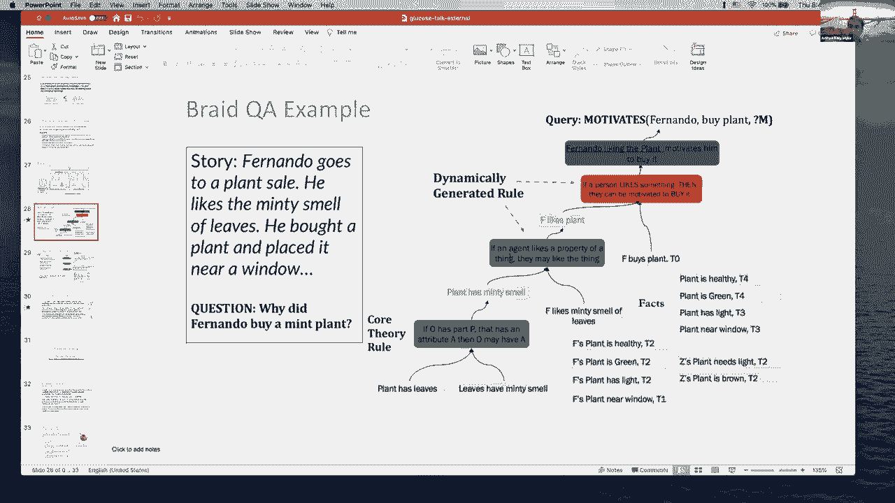

当然，图卷积只是我们可以使用的许多潜在框架之一，用于对图像中的关系产生高阶推理。计算机视觉社区一直在我们最初的框架上构建，开发了数百个场景图生成模型，包括许多最近的基于Transformer的模型。但在所有这些模型中，有一件事保持了相当一致：即我们引入的、受比德曼工作启发的原始分解。唯一真正改变的是，在这数百个模型中，我们是如何设计这些反馈连接的。

---

## 🚀 利用场景图谱实现下游任务

最后，让我谈谈我们如何利用这些可以从图像中预测并推广到新颖组合的场景图谱，来实现整个核心计算机视觉任务。

下游任务，如动作检测，通常非常渴望数据。这些模型很难在可能有数百帧的视频中找到有意义的信号，以对实际发生的动作做出正确预测。但是，如果你有一个场景图谱模型，你现在可以将每一帧表示为场景图谱。现在，你可以学习动作检测或动作识别，作为跨越这些不同帧的物体之间关系的转换。

例如，我们的模型可以了解到“在床上醒来”这个动作，是由于人和床之间关系的改变：最初这个人“躺在床上”，后来“坐在床上”，暗示他们正在执行“醒来”的动作。如果你有这样的数据来创建这些表示，我们最近发现，你可以使用五到十个训练示例，并提高场景图谱模型预训练的动作检测的平均精度，性能提升约五个平均精度点。

除了动作检测，我们还利用场景图谱作为连接语言和视觉的中间表示。这使我们能够通过在这两者之间诱导一种图形表示，来分解各种不同的语言视觉任务。例如，我们很早就展示了，当使用场景图谱时，我们可以改进图像检索：先分解你在场景图谱中寻找的东西的长查询，然后使用场景图谱并将其与从图像中提取的场景图谱进行匹配。这个图形匹配过程允许我们检索与语言描述最匹配的图像。

视觉社区的其他人也一直在使用场景图谱来改进各种各样的其他任务，如图像字幕。有各种各样不同的模型利用场景图谱来改进字幕。我们看到的一种常见模式是，在将图像转换为标题的过程中，有一个诱导的场景图谱层。首先将图像转换为场景图谱表示，然后从中产生标题。这个诱导层的好处是，一旦我们产生了一个标题，我们可以再现场景图谱并创建循环一致性损失，它允许我们验证生成的标题与从图像中提取的场景图谱一致。这提供了额外的训练信号和良好的结构，还允许人们从提取的场景图谱中提取子图，并生成聚焦于图像中不同区域的各种标题。

另一个令人兴奋的领域是思考我们如何将图谱视为外部知识的一种形式，在回答关于图像的问题时使用。我们最近看到人们做的是：拿图像的例子，从这些图像中转换和提取关系，然后利用这些关系，就好像你得到了一个关于图像中可能发生的事情的外部知识库。现在你可以推理不仅仅是原始像素，还可以通过这种提取的关系集来回答问题。这类模型被用来让问题不仅关注像素，还在回答时关注这种提取的关系。

最后，我们也看到了很多人们利用场景图谱作为构建创意工具来生成图像的方式。我们可以显式地指定不同类型的物体应该如何相互关联。当我们生成图像时，这使得我们可以创造足够多的信号，模型可以识别图像的哪些区域应该包含什么物体，以及它们应该满足什么样的关系。然后我们现在可以从非常指定的输入生成图像。

社区一直在利用场景图谱来完成各种各样的任务，从我提到的图像生成（首先将文本转换成结构化的场景图谱），到改进视觉导航（利用场景图谱先验进行三维理解），甚至将场景图谱扩展到整个3D区域、房间和房子。我们也看到了场景图谱可以用来通过在这些图形结构上使用符号方法来回答问题的例子。当然，我们已经开始在HCI社区看到例子，场景图谱对创造像素描这样的创意工具非常有用，在那里你可以定义你想要绘制的草图，然后模型把它转换成场景图谱，再转换成笔画。

---

## 📝 课程总结

本节课中，我们一起学习了场景图谱，这是一种基于人类认知的表示方法，以及如何利用它来设计各种可以轻松推广到新颖组合的模型。最后，我们讨论了场景图谱如何用于各种对计算机视觉非常核心的下游任务，并且它是一种通用的、任务无关的表示。

好的，谢谢大家，这就是我今天分享的全部内容。