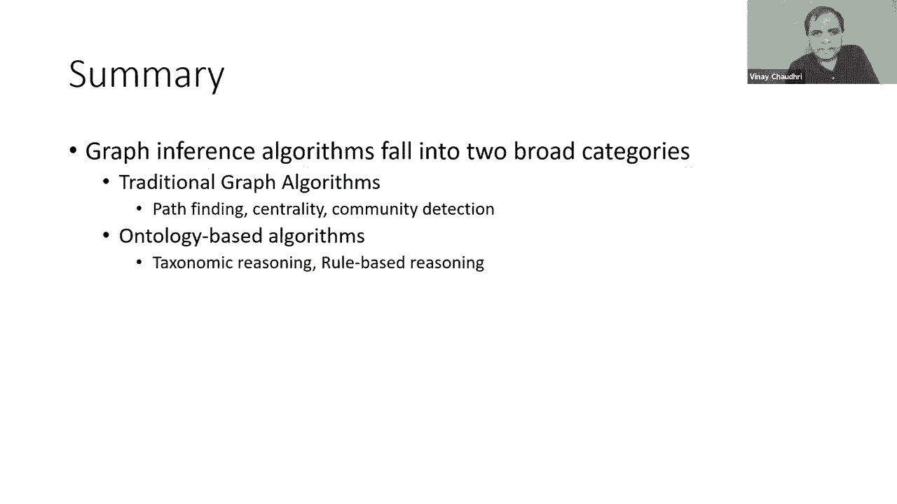

# 16：L11.1 - 知识图谱推理算法介绍 🧠

在本节课中，我们将要学习知识图谱中的推理算法。推理是知识图谱的核心能力之一，它允许我们从已有的明确信息中，推导出新的、隐含的知识。

到目前为止，我们已经定义了什么是知识图谱，并讨论了如何从结构化和非结构化数据中创建知识图谱。现在，我们将进入课程的新阶段，重点研究如何利用知识图谱进行推理和访问。本周我们将聚焦于推理算法，在后续课程中，我们将讨论用户如何与知识图谱交互，以及知识图谱如何随时间演变。

今天的课程分为两个部分。第一部分是理论或算法部分，我将描述各种知识图谱推理算法。第二部分，我将举例说明其中一些算法如何用于解决实际业务用例中的分析问题。

---

## 推理算法概览

在课程早期，我介绍了作为查询语言的SPARQL和Cypher。当时给出的查询示例相当简单，主要说明了如何检索或查找知识图谱中已经存在的信息。

在知识图谱推理中，我们感兴趣的是得出知识图谱中没有明确说明的新结论。实现这一点有很多不同的方法。在最高层面上，我们将研究两大类推理算法：**基于图的推理算法**和**基于本体的推理算法**。

基于图的算法主要源于纯粹的抽象图算法。基于本体的推理算法则来自知识表示与推理领域。

---

## 基于图的推理算法

有各种各样的图算法可以用于图结构数据。为了本次讲座，我选择专注于三个系列的图算法：**寻路**、**中心性检测**和**社区检测**。我将详细介绍每一个。

### 寻路算法

寻路是对图的基本操作。给定一个图，其中边用数字标记（数字表示从一个节点到另一个节点的成本），寻路问题就是要找出从一个节点到另一个节点的最便宜方式。

例如，如果我们在节点A，想计算到节点C的最短路径。我们可以直接从A到C，成本是5；或者我们可以从A到D，再从D到C，成本是4。在这种情况下，我们更倾向于选择A->D->C的路径。这种计算在交通规划等应用中有明显用途。

寻路问题可以用很多不同的方式表述。一种表述是：给定一个单一的起始节点，找出从该节点到图中所有其他节点的最短路径。这被称为**单源最短路径问题**。

寻路问题的另一个变体是**最小生成树**，有时也被称为旅行计划或旅行推销员问题。其目标是从一个节点开始，以总成本最小的方式访问其他节点。

有许多寻路方法，但我将介绍一个解决寻路问题的经典算法：**A*算法**。这是一个非常基础的算法，最初是在人工智能规划的背景下发展起来的，但显然适用于图中的寻路。

该算法最基本的方法是维护一棵从起始节点开始的路径树。这些路径树会不断延伸，直到满足终止标准。延伸是基于路径的长度来计算的。

路径长度的计算方式是：`f(n) = g(n) + h(n)`。其中：
*   `g(n)` 是从起始节点到当前节点 `n` 的实际成本。
*   `h(n)` 是从当前节点 `n` 到目标节点的**估计**成本（启发值）。

`h(n)` 是一个估计值，因为我们还没有到达结束状态，不知道确切的成本。这就是为什么它被称为**启发式**。我们对一类特定的启发式感兴趣，即**可采纳启发式**。可采纳启发式是一种从不高估成本的启发式，它可能会低估成本，但绝不会高估。有证据表明，只要我们的启发式是可采纳的，我们将在搜索过程结束时得到一条最优路径。

为了说明算法的工作原理，我们用一个简单的例子，假设启发式 `h(n)` 为零。显然，如果假设达到目标状态的成本为零，这不会高估成本。当把启发式设置为零时，A*算法就退化或简化为更广为人知的**广度优先算法**。

为了说明这个算法的工作原理，我们将演示计算从节点A到节点E的最短路径的过程。
1.  从节点A开始，首先枚举所有可能的选择：A->B， A->C， A->D。在这三个选择中，成本最小的是从A到D。
2.  第一步，我们选择A->D。
3.  在节点D，我们探索所有选择：D->C， 或 D->E。即使E是我们的目标状态，但从D到C的成本是4，比从D到E的成本5要少。所以我们必须探索C，因为有可能经过C再到E的总成本会小于5。
4.  我们发现，如果沿着D->C->E的路径，成本实际上是6。
5.  因此，我们已经找到的路径A->D->E是最短的从A到E的路径。

这是A*算法在启发式设置为零的情况下如何工作的快速演示。A*算法是一个非常著名的寻路算法，有大量的应用。

### 中心性检测算法

中心性检测算法背后的基本思想是帮助我们理解网络中节点的重要性。给定一个图或图结构，我们想弄清楚哪些节点最重要，或者哪些节点在某种意义上是桥梁，使它们突出（例如，它们连接了许多其他节点）。这些分析或洞察在识别复杂图结构中的瓶颈和脆弱性方面非常有用。

为了说明检测中心性的不同方法，一个简单的方法是简单地计算节点的**度**。度指的是一个给定节点连接到多少其他节点。在我们看到的图表中，节点A连接到最多的其他节点，因此，在这个网络中，节点A是基于度中心性度量的中心节点。

计算中心性的另一种方法是**介数中心性**。如果一个节点有最多的最短路径穿过它，那么它就具有很高的介数中心性。在整个网络结构中，节点B处于一个独特的位置，如果要计算所有不同节点之间的最短路径，穿过节点B的最短路径数量将是最大的。因此，节点B具有最高的介数中心性。

计算中心性的另一个度量称为**接近中心性**。具有最高接近中心性的节点是与网络中所有其他节点平均距离最近的节点。在示例中（仅考虑图的一个片段），节点C具有最高的接近中心性，因为它最接近该片段图中的所有节点。

第四个也是最后一个用于中心性检测的度量称为**PageRank**。PageRank最初是在信息检索的背景下开发的，谷歌是最大的用户。它被用来计算哪些网页在网络上最突出。鉴于互联网上的文档网络定义了一个图结构，这种排名可以应用于任何图结构。这个算法的好处在于，它考虑了节点的重要性：如果一个节点连接到许多有影响力的节点，那么它可能比一个连接到许多琐碎节点的节点更中心。

PageRank算法是迭代的，它围绕以下公式建立：
`PR(u) = (1-d) + d * Σ (PR(t) / C(t))`，其中求和是针对所有链接到节点u的节点t。
*   `PR(u)` 是节点u的PageRank。
*   `d` 是阻尼因子，通常设置为0.85，表示直接访问节点与通过链接访问节点的可能性。
*   `PR(t)` 是链接到u的节点t的PageRank。
*   `C(t)` 是节点t的出链数量。

该算法的工作方式是：首先将所有节点的PageRank设置为某个任意值（例如，节点总数的倒数）。在每一步，我们都根据公式更新PageRank值，并持续迭代，直到算法稳定。这是一个迭代算法，在网络搜索和识别复杂图结构中的中心节点方面效果很好。

### 社区检测算法

社区检测的基本思想或要求，是识别图中根据某些标准紧密相关的、作为一个组的节点。一般来说，同一个社区内的节点之间的关系，会比它们与社区外节点之间的关系更多。很多时候，社区检测也被用作两阶段分析过程的第一步：首先，给定一个图，找出其中的社区；然后，将分析重点集中在每个社区内部。

我们现在来看看一些用于社区检测的算法技术。社区检测有两大类算法：**标准图算法**和**自下而上的算法**。

作为一个标准图算法的例子，我们可以识别**连通分量**。对于无向图，连通分量本质上是一组节点，使得你可以从每个节点到达组内的任何其他节点。这是一个非常基础的识别社区的方法。

第二个非常常见的标准图算法是**强连通分量**。强连通分量是针对有向图计算的。有向图中的一组节点是强连通的，如果对于每对节点A和B，都有可能从A到B，再从B回到A。在示例图中，我们可以看到有两组彼此强连接的节点，我们可以将这两组节点视为社区。

现在我们来谈谈自下而上的算法。在自下而上的算法中，有两种常见的方法：**标签传播**和**Louvain算法**（也称为模块度优化算法）。

以下是这些算法的快速概述，以便你了解它们的工作原理：

在**标签传播算法**中：
1.  首先将图中的每个节点分配到一个不同的社区。
2.  确定一个检查所有节点的顺序。
3.  按照该顺序一次检查一个节点，并根据其邻居所属的社区来更新它所属的社区（例如，选择其大多数邻居所属的社区）。如果出现平局（例如，邻居分别属于两个不同的社区），则随机打破平局。
4.  重复这个过程，直到满足条件：每个节点所在的社区与其大多数邻居共享。

这是一个自下而上的过程，也是一种沉浸式算法，因为我们开始时并不知道最终会得到什么社区。这种算法对于进行图分析非常有吸引力，因为它倾向于揭示我们可能没有想到的模式。

另一种非常流行的技术是**Louvain算法**。其基本思想是通过优化**模块度**来识别社区。模块度是衡量网络社区结构强度的一种指标。
1.  初始化时，每个节点都在一个单独的社区中。
2.  检查每个节点及其邻居，测试如果将该节点移动到邻居的社区，图的总体模块度得分是否会提高。模块度得分可以通过一个公式计算，例如考虑社区内边数与总边数的比例，以及社区内节点度数与总度数的比例。
3.  如果模块度得分提高，则进行移动；否则，不移动。
4.  重复此过程，直到稳定。
5.  然后进入算法的第二阶段：创建一个新图，其中新图中的每个节点代表第一阶段的一个社区。如果第一阶段中两个社区的节点之间有边，则在第二阶段图中用边（或自环）表示。
6.  在这个压缩后的新图上，重复第一阶段的过程。
7.  继续迭代，直到无法再优化。

以上就是对基于图的算法的一次快速概览。

---

## 基于本体的推理算法

我认为，通用图系统与知识图谱系统的关键区别实际上在于基于本体的入口。因为到目前为止讨论的所有算法甚至可以应用于抽象的“图”，而不一定是“知识图谱”。当通用图开始变成知识图谱时，是因为我们开始通过将类与节点关联，或者定义节点如何相互连接的语义以及定义关系的语义属性，来添加应用领域的语义。

当你开始向图中添加这种语义知识或领域知识时，有一些算法可以应用。我选择将其标记为**基于本体的推理**。在这一点上，我进一步区分了两种类型：**基于类的推理**（或分类学推理）和**基于规则的推理**。

基于类的推理和基于规则的推理之间的区别并不总是非常明显。有时这主要是一个实现选择的问题。但我想指出的是，在许多基于类的推理系统的实现中，它们倾向于更直接地使用前面讨论的基于图的算法。例如，在进行分类学推理时，可能会进行图遍历。当然，你也可以使用规则进行图遍历，但在基于分类学或基于类的系统中，它们会更直接地利用图算法。

现在让我们更详细地看看这两种推理。

### 分类学推理

分类学推理在将知识组织成一组类是有用的时候适用。例如，如果你想对维基百科或维基数据中的关系图建模，将事实组织成一组类就变得更有趣。类只不过是类型或类别。

当我们有类时，我们可以定义**类成员资格**、**类特化**（子类）等。让我们更详细地看看这些特性。

在属性图数据模型中，节点类型本质上起着类的作用。在RDF数据模型中，RDF模式层允许你定义类，还可以在关系中定义定义域和值域限制。

为了本次讲座的讨论，我选择独立于这些具体模型来呈现推理的基本原理。它们与使用哪种数据模型无关。显然，当深入模型细节时，可能会有一些具体的差异，但为了课程目的，我认为深入这些差异并不重要。

让我们举一个简单的例子：我们有“人”这个类，以及“男性”和“女性”两个子类。我们有实例Art（男性）和Bob（男性）。我们可以用两种不同的方式表示它们：作为一元关系（如 `Male(Art)`），或者说Art是类Male的一个实例。两者在逻辑上是等价的。

给定这种非常简单的例子，我们可以将知识组织成一个层次结构。我们可以做出断言，例如“女性是人的一个子类”，“男性是人的一个子类”。当知识图谱中有这些子类关系时，我们可以进行推理。

我们能做的第一个非常简单的推理是**传递性推理**。例如，如果A是B的子类，B是C的子类，那么我们可以推断A也是C的子类。子类和实例也是相互关联的。规则 `如果 i 是 A 的实例，且 A 是 B 的子类，那么 i 也是 B 的实例` 捕获了这种关系。这个推论很自然地从子类的定义中得出。

我们可以声明类是**不相交的**。例如，我们可以说男性和女性是不相交的。如果两个类不相交，那么它们不能有任何共同的实例。这可以用于知识图谱中的各种推断，最基本的形式是确保事物被正确定义，这样我们就不会把同一个东西放在两个不相交的类里。

我们可以引入**类定义**。类定义通常有两个组成部分：**必要属性**和**充分属性**。
*   类的**必要属性**是该类所有实例共享的属性。例如，我们可以说“棕发人类”的所有实例的头发颜色都是棕色。使用规则，我们指定了棕发人类所有实例的属性。
*   类的**充分属性**让我们得出结论，某个特定实例是该类的成员。例如，我们可以说“任何有棕色头发的人必须是棕发人类的一个实例”。从规则的逻辑句法来看，主要区别在于：在必要属性中，实例出现在规则体（条件部分）；在充分属性中，实例出现在规则头（结论部分）。

我们之前讨论过定义知识图谱中关系的语义。要为这些关系定义的基本语义是对第一个参数和第二个参数的约束。
*   对第一个参数的约束通常称为**定义域**。
*   对第二个参数的约束通常称为**值域**。
例如，如果我们有“父母”关系，我们可以声明：如果x是y的父母，那么x必须是“人”类的一个实例（定义域），y也必须是“人”类的一个实例（值域）。

除了这些类型约束，我们也可以定义**基数限制**，即限制一个关系可以取的值的数量。例如，我们可以限制一个人最多有两个父母（不能更多）。我们也可以定义数值限制，例如一个人的年龄不能超过125。

在分类学系统中被大量使用的一种推理叫做**继承**。这基本上意味着一旦定义了类层次结构和关系，关系值就会被“继承”到类的实例中。我们以前见过一个例子：如果Art是“棕发人类”的一个实例，那么我们就可以推断Art有棕色头发，无论我们的数据中是否明确说明了这一点。

更广泛地说，在分类学系统中，有四类推论，就执行它们的复杂性而言，每一种都有不同的难度：
1.  **包含检查**：给定两个类A和B，弄清楚A是不是B的子类。这主要是在类描述的层面上进行推理。
2.  **实例检查**：给定一个实例i，弄清楚i是不是类A的一个实例。这里我们有一个具体的实例，并试图将其与类的描述进行比较。
3.  **一致性检查**：检查知识库是否一致，没有矛盾。例如，检查“Art是否有棕色的头发”是真还是假。
4.  **查询回答**：给定一个查询，找出查询中变量的不同值，使得查询为真。

### 基于规则的推理

正如前面提到的，分类推理和基于规则的推理之间的界限不是很清晰。我在这节课中做了区分，主要是出于教学目的。但如果你要出去构建一个系统，你可以选择很多不同的路径，不一定非要做出这种区分。

为了解释基于规则的推理，我要举一个例子。我选择这个例子是为了捕捉比仅仅定义分类法、关系和约束更复杂的推理。

在这个例子中，我们有一个属性图，表示一个领域。我们有一个节点类型“人”，那个人参与了一项关于化学物质的研究。我们还说一家公司生产一种产品，而这种产品含有某种化学物质。此外，还有一条从公司到人的边，标签是“资助”。

给定这个模型，以及填充它的实例，我们想弄清楚参与研究的人中是否存在**利益冲突**。为了捕捉利益冲突，规则是一个很好的工具。

示例规则如下：
1.  第一条规则定义“公司对化学物质的兴趣”：`公司X对化学物质Z有兴趣，如果 公司X生产产品Y，且 产品Y含有化学物质Z`。
2.  第二条规则定义“利益冲突”：`参与研究Y的人X与公司Z存在利益冲突，如果 人X参与研究Y，且 研究Y是关于化学物质P的，且 人X由公司Z资助，且 公司Z对化学物质P有兴趣`。

这是一个相当复杂的关系，用于计算图中的利益冲突。规则提供了一种自然的方法来捕获这些关系。

如果你使用基于规则的方法进行推理，产生的利益冲突事实不一定非要存在于知识图谱中。但有些人可能希望查询结果也是一个知识图谱。对于熟悉课程前面内容的人，我们知道在知识图谱中，关系必须是二元的。在这种情况下，规则的头（结论）“利益冲突”不是一个二元关系。因此，如果你想在知识图谱中捕获利益冲突，你必须以某种方式表示它。

在多次讲座中，我们谈到了**物化**的概念。如果我们想把利益冲突纳入图谱，我们必须物化这种“利益冲突”关系。物化的基本思想是，对于任何非二元关系，我们必须创建一个新的对象。在这种情况下，我们通过在规则的头部引入一个存在量词来引入这个新对象（例如，一个新的节点C代表利益冲突）。然后，对于那个新对象，我们引入一组关系来捕获该关系的不同组成部分（例如，`hasConflict(C, X)`, `hasConflictReason(C, Y)`, `hasConflictWith(C, Z)`）。

这只是我们如何实际应用规则的概述。一般来说，有两种策略来对知识图谱应用规则：**自底向上**策略和**自顶向下**策略。
*   在**自底向上**策略中，我们对数据应用规则，得到新的事实，将这些新事实添加到我们的数据库中，然后继续，直到不能得到更多新事实。这种方法的一个复杂之处是必须确保计算会终止。自底向上策略的好处是，一旦应用了所有规则，我们就有了所有派生数据，然后可以对派生数据使用传统的查询处理算法来回答查询。
*   在**自顶向下**策略中，我们从查询开始，只应用那些为回答问题所必需的规则，不会推导出所有结论。这种方法需要在规则引擎和查询评估引擎之间进行更紧密的集成。自顶向下策略的好处是显然需要更少的空间，因为我们不会推导出所有东西。

今天有许多高效和可扩展的规则引擎可用。

---

## 总结

本节课中，我们一起学习了知识图谱推理算法。它们在最高层次上分为两大类：
*   **传统的图算法**，如寻