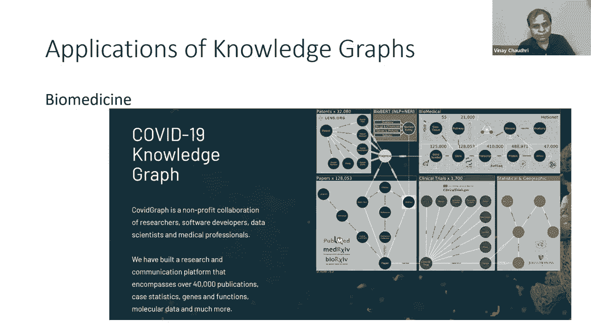

# 17：L11.2 - 高价值应用案例介绍 📊

在本节课中，我们将学习知识图谱在现实世界，特别是在金融领域中的高价值应用案例。我们将看到知识图谱如何通过图算法、基于规则的推理和本体论推理来解决复杂的实际问题。

---

## 应用领域概览

知识图谱如今被广泛应用于各个领域。一个有趣的例子是漫威漫画，他们为其电影宇宙创建了一个知识图谱。图谱中的节点可以是角色或电影，边则代表语义关系，例如两个角色是否在同一部电影或场景中出现。他们利用这个图谱来更好地理解现有电影，并设计新电影，寻找当前知识图谱中缺失的连接以构思新的故事线。

国际调查记者协会也构建了一个非常有趣的知识图谱，基于泄露的新闻数据。他们将这个知识图谱提供给记者，帮助他们更快地挖掘出不同参与者之间隐藏的联系或可疑行为。

自去年疫情爆发以来，也出现了许多专注于创建COVID-19知识图谱的努力，无论是基于学术出版物还是感染数据。

---

## 金融领域的应用

在接下来的讨论中，我们将聚焦于知识图谱在金融领域的应用。我们的讨论综合了去年系列讲座中多位演讲者的观点，将简明地总结知识图谱目前在金融领域的三种主要应用类别：**分析**、**金融计算**和**财务报告**。

分析部分将展示图算法的应用，金融计算部分将展示基于规则的推理，而财务报告部分则将展示基于本体论的推理。

---

### 1. 分析应用

以下是金融机构高度重视的一些分析性问题：
*   哪些客户是某家陷入财务困境公司的供应商？
*   在供应链网络中，是否存在一家公司连接着一组公司？
*   哪些初创公司吸引了最有影响力的投资者？

我们将逐步探讨其中一些问题，并联系我们在第一部分学到的算法，看看它们如何应用于解答这些问题。

#### 问题：哪些客户是陷入财务困境的公司X的供应商？

要回答这个问题，首先需要供应商的信息。FactSet是一家商业数据供应商，专门管理供应链关系数据。你可以购买这些数据，然后利用我们在第四讲中学到的技术（例如如何从结构化数据创建知识图谱），将FactSet数据与你公司内部的客户数据整合起来。

一旦整合了数据，要回答这个问题，你会使用**路径查找**算法。你基本上会在供应链网络上进行一定距离的路径查找，以找出哪些公司和供应商是相互连接的。

#### 问题：在供应链网络中存在一家公司连接着一组公司吗？

这是一个教科书级别的**中介中心性**例子。如果你的供应链网络中有一个节点具有非常高的中介中心性，这通常表明这家公司向许多其他组织供货。如果这家公司发生任何好坏事件，你都会希望提前知晓并关注其动态。

#### 问题：哪些初创公司吸引了最有影响力的投资者？

要回答这个问题，我们需要风险投资公司或天使投资人投资了哪些公司的数据。PitchBook是另一家专门管理此类信息的商业数据提供商。与FactSet案例类似，我们可以购买这些数据，将其与公司内部的结构化数据整合，创建一个知识图谱。

在这个图谱中，如果我们想找出最有影响力的投资者，我们会使用类似**PageRank**的算法。我们会在那个网络中找出哪些节点最具影响力。

另一个相关的问题是：哪些投资者群体倾向于共同投资？要回答这个问题，你可以使用**社区检测**算法，因为它们会考虑这些风险投资或投资公司相互关联的多种方式。

#### 问题：哪些公司与给定公司最相似？哪些公司可能成为我们未来的好客户？

要回答这类问题，人们使用的是我们目前尚未涵盖的算法。用于回答此类问题的典型算法基于**图神经网络**，它是知识图谱与神经网络算法的结合。在我们周四的讲座中，第二场演讲将专注于图神经网络，届时将介绍用于解答本幻灯片上这类问题的技术。

---

### 2. 金融计算应用

这部分综合了目前Intuit公司正在进行的工作。众所周知，Intuit是TurboTax软件的制造商，每年有数百万人使用该软件来准备所得税申报。他们有一项艰巨的任务：必须将税法相关部分、成千上万的表格编码成一个可用的产品，这个产品必须准确、合规，并且能够年复一年地保持这种状态。

随着税法的不断增长，他们的工作并未变得更容易。他们正在使用一个基于规则的系统来编码税法，但在这个系统中，他们非常有趣地利用了图或知识图谱。

其应用的基本思想是**利用规则内部的图结构来自动生成用户访谈和对话**，然后使用这些规则进行税务计算。计算部分很有趣，可以进行讨论，但我只想从他们的演示中抽取一个非常简单的例子，展示他们如何利用图结构来生成访谈和对话。

让我们考虑一个非常简单的例子：如果一个人是加利福尼亚州的居民**并且**年龄大于18岁，那么这个人就有资格获得某项税收优惠。给定这样一条英语规则，我们可以用规则语言对其进行编码，并从中生成你在这里看到的图。

从这个图中，我们可以得出结论：如果一个人的年龄小于18岁，那么他们无论如何都没有资格获得这项福利。因此，如果我们知道他们的年龄小于18岁，我们甚至不需要费心询问他们的居住地。这是一个非常玩具化且简单的例子，仅限于单条规则。但想象一下，你拥有的不是一条规则，而是成千上万条以多种不同方式连接的规则。那么，利用这种图连接方式（规则之间如何相互连接），你就可以确定应该向用户提出哪些访谈问题。

需要说明的是，有些人可能会争论你在这个屏幕上看到的是否真的是知识图谱。它确实是一个有向标记图，但在捕获应用语义方面，它实际上捕获的是一组规则的执行过程，而不是数据图或应用的本体结构。但他们将其作为一种进行税务计算的知识图谱方法进行了介绍。他们正在将这项技术作为其TurboTax系列产品核心的一部分。

---

### 3. 财务报告应用

所有金融机构都有特定的报告要求。以衍生品合约为例，有各种类型的衍生品合约，如期权、期货和远期。有一套复杂的法律体系来规范这些合约的订立、执行以及在违约情况下的处理方式。同时也有相当严格的报告要求，必须向监管机构报告，也必须向从事这些合约买卖的不同交易商报告。

因此，如果一家金融机构开始以多种不同格式报告这些衍生品合约的信息，对于监管机构和不同的交易组织来说，工作将变成一场噩梦。因此，金融行业内部一直在努力探索是否有办法标准化这些报告。业界已经联合起来，开发了这个共享的本体，称为**FIBO**。

这是一个多方利益相关者共同参与的社区努力，他们的目标是看是否能就这些衍生品合约报告中将要出现的数据的语义达成一致并进行规范。

在本幻灯片上，我展示了FIBO的一个快照。在这个快照中，他们给出了看涨期权买方的语义或定义，并定义看涨期权买方可以是自主代理、独立方或法人。这正是我在介绍分类推理部分时描述的那种定义域和值域约束。

衍生品合约只是FIBO的一个用例，他们还有许多其他正在开发中的用例。希望在未来，这种用于数据交换的标准化将变得越来越重要。

---

## 总结

本节课中，我们一起探讨了知识图谱在金融领域的多种高价值应用。

我们首先概述了知识图谱在漫威宇宙、新闻调查和疫情研究等广泛领域的应用。随后，我们深入聚焦于金融领域，详细分析了三大类应用：

1.  **分析应用**：我们学习了如何利用**路径查找**、**中介中心性**、**PageRank**和**社区检测**等图算法，来解答诸如寻找关键供应商、识别有影响力的投资者以及发现公司集群等商业问题。对于更复杂的相似性分析和潜在客户挖掘，则需要借助**图神经网络**技术。
2.  **金融计算应用**：以Intuit的税务计算为例，我们看到了如何将业务规则表示为图结构，并利用这种结构来智能地驱动用户访谈流程，实现高效、准确的自动化计算。
3.  **财务报告应用**：通过金融行业业务本体论FIBO的例子，我们了解了如何利用**本体论**来标准化和定义金融数据的语义，从而实现不同机构间高效、无歧义的数据交换，满足严格的监管报告要求。

这些案例表明，知识图谱通过结合图结构、规则推理和本体语义，正在成为解决金融行业复杂数据分析、自动化计算和标准化报告等核心挑战的强大工具。