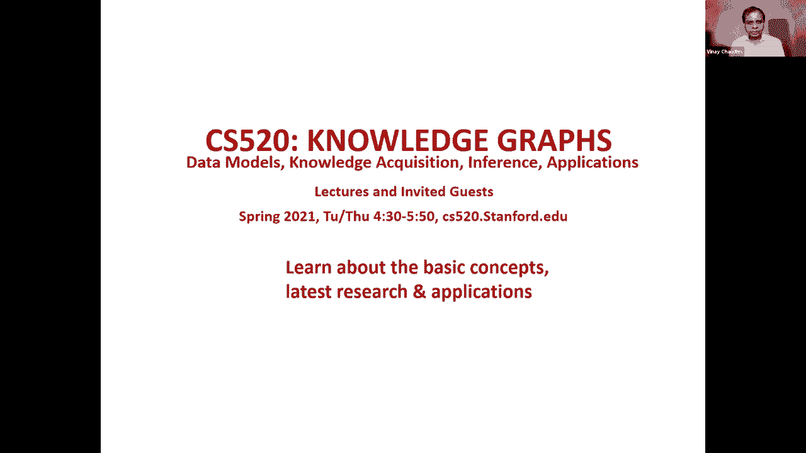
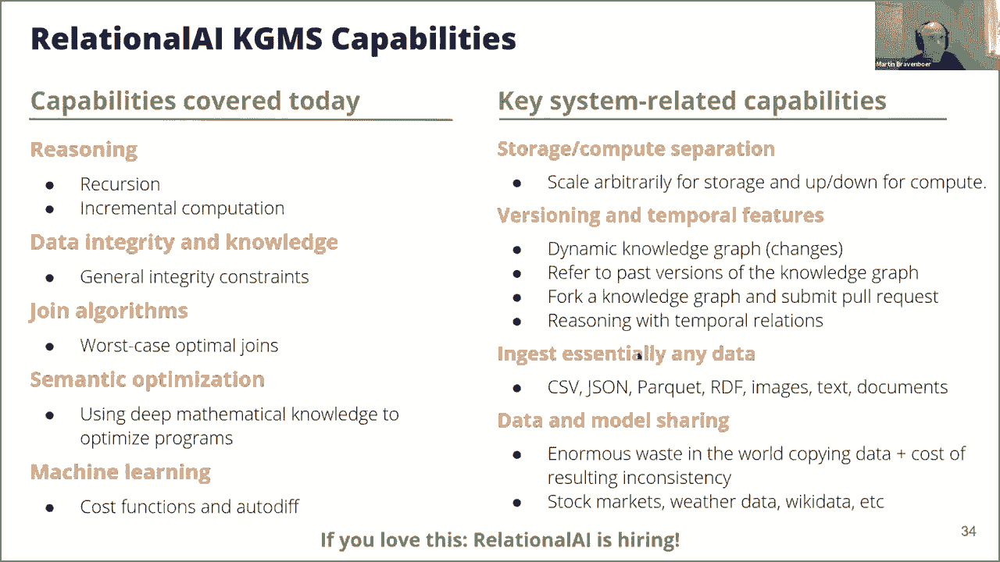

# 18：L12.1 - 图谱关系学习与管理 🧠





在本节课中，我们将学习知识图谱的高效推理算法，特别是当存储层为关系型系统时。课程将涵盖如何利用关系模型表示和管理知识图谱，以及如何通过声明性语言和优化算法进行高效推理。

---

## 关系模型与知识图谱表示 📊

上一节我们介绍了知识图谱推理的背景，本节中我们来看看如何用关系模型来表示各种知识图谱数据。

关系模型使用“关系”来表示所有数据。其核心目标是将物理数据表示、索引选择与应用程序逻辑分离。应用程序逻辑完全独立于系统实现，系统可以最优方式执行逻辑。

SQL是关系模型的一种查询语言，但并非唯一。现代应用面临的挑战不应归咎于关系模型本身，而可能在于查询语言。因此，改进查询语言是关键。

以下是使用关系表示不同数据模型的方法：

*   **有向图**：可以用一个名为 `Arc` 的二元关系表示。例如，图中的一条边 `A -> C` 表示为 `Arc("A", "C")`。
*   **属性图**：顶点属性可用二元关系表示。例如，电影 `m` 的标题是“127小时”，可表示为 `title(m, "127 hours")`。顶点标签可用一元关系表示，如 `Movie(m)`。边上的属性则成为三元关系（超边），例如 `plays(j, m, "Aaron Ralston")` 表示James Franco在电影中扮演了Aaron Ralston。
*   **RDF**：每个三元组可视为一个元组，其中谓词作为关系名。例如，`type(p, Painting)` 和 `name(p, "Mona Lisa")`。
*   **SQL表**：传统SQL表通常表示为单一关系。但在知识图谱视角下，可以将其结构重塑得更像图，例如将订单表拆分为订单实体及其属性（如客户、日期）的关系集合。

关系模型可以捕获上述所有数据模型。构建基于关系模型的系统，就能统一处理这些不同模型。

---

## 知识定义与推理 🔍

上一节我们了解了数据的表示，本节中我们来看看如何在系统中定义知识并进行推理。

推理意味着使用逻辑来推导出新的边、标签和顶点。以下是几个推理示例：

*   **模式匹配（如三角形查询）**：寻找导演了某部电影，且其孩子也在同部电影中出演的导演。其逻辑类似于：`directed(d, m) ∧ child(a, d) ∧ acted_in(a, m)`。
*   **派生对称关系**：可以定义配偶关系是对称的。例如：`spouse(x, y) = spouse(y, x)`。
*   **派生新标签**：可以根据现有属性定义新标签。例如，若某人国籍是荷兰，则可为其添加 `Dutch` 标签：`Dutch(x) ← citizen_of(x, "Netherlands")`。
*   **聚合计算**：支持对图进行聚合操作。
    *   计算图中总边数：`count[edge]`。
    *   计算每个节点的出度：`out_degree[x] = count[y: Arc(x, y)]`。
    *   计算每个团队的总薪资：`team_salary[t] = sum[s: member_salary(t, s)]`。

对于图算法，递归至关重要。例如，可达性（传递闭包）是基础递归查询：
```
reachable(x, y) = Arc(x, y)
reachable(x, y) = reachable(x, z) ∧ Arc(z, y)
```
系统支持任意用户定义的相互递归规则，递归中也可包含聚合。系统还能缓存并增量维护这些推理结果，以支持动态图更新。

---

## 完整性约束与深层知识 ⚖️

推理用于推导新事实，但确保数据质量同样重要。本节我们讨论如何使用完整性约束来保证数据一致性。

完整性约束用于防止非法数据进入，而非自动修复。系统会报告违反约束的情况。

以下是完整性约束的示例：

*   **类型约束**：每个演员都必须是“人”。可写为：`Actor ⊆ Person`。若试图使非人的实体成为演员，将被阻止。
*   **函数依赖**：每个人应只有一个生日。可使用“函数”抽象来确保：`birthday: Person -> Date`。
*   **关系属性**：配偶关系必须对称。可定义为：`spouse(x, y) ⇒ spouse(y, x)`。

这些深层知识不仅用于保证数据质量，后续还将看到它们如何用于优化查询执行。

---

## 图语言的关键特性：模式与数据统一查询 🗺️

本节我们探讨图查询语言与SQL的一个关键区别：内在支持同时对数据模式和数据进行查询。

在知识图谱应用中，探索存在哪些关系类型（即模式）与查询具体数据同样重要。SQL难以优雅地将目录（模式）查询结果直接用于数据查询。

在REL等图语言中，这很容易实现。例如，可以查询“Danny Boyle”和“James Franco”之间存在的所有关系类型，这本身就是一个模式级查询，能发现他们通过电影“Steve Jobs”合作。

这种能力使得编写通用图算法（如PageRank）成为可能，因为算法需要泛化地遍历图结构，而SQL模式难以动态反映这一点。

---

## 模块化与抽象 🧩

为了支持泛化查询和算法复用，系统支持模块化。

可以将关系分组到模块中，类似于命名子图。例如，可以创建一个包含所有电影相关关系的 `movie_graph` 模块。

这使得通用算法库成为可能。例如，可以定义一个通用的 `page_rank` 函数，它接受一个图模块作为参数进行计算。同样，推理规则也可以被抽象和复用，例如自动为任何国家的公民打上对应国籍标签的规则。

---

## 高效执行：最坏情况最优连接算法 ⚡

声明性查询需要高效执行。本节介绍为何传统连接算法对图查询低效，以及新的“最坏情况最优连接算法”如何解决该问题。

传统SQL系统使用二元连接，一次连接两个表。但在知识图谱的多关系连接查询（如三角形查询）中，任何二元连接顺序都可能产生巨大的中间结果，导致性能低下。

最坏情况最优连接算法（如WCOJ）采用不同的策略。它通过同时考虑所有连接关系，逐步绑定变量，避免过早产生大量中间结果。

**算法思想示例（三角形查询）**：
1.  首先，只关注 `directed(d, m)` 和 `child(a, d)`，找出那些既是导演又有孩子的 `d` 集合，这比所有导演的集合小。
2.  接着，在上一步的 `d` 基础上，结合 `acted_in(a, m)`，寻找那些孩子也是演员的导演，这个集合通常更小。
3.  最后，通过电影 `m` 完成三角形闭合。

这种算法在处理涉及多个关系和标签的图查询时特别有效。系统使用其即时编译变体（如“Datalog联机”技术）来执行。

---

## 利用知识进行语义优化 🧠➡️🚀

系统不仅能利用算法优化，还能利用用户定义的深层知识（语义）进行优化，将高级声明式规范转化为高效算法。

优化器可以应用数学知识（如结合律、分配律）和用户指定的约束（如函数依赖）来重写查询。

**示例1：最短路径优化**
用户可能声明性地计算图中所有路径长度，然后取最小值来求最短路径。这非常低效。语义优化器识别到“最小值”操作可以在递归中分配，从而将逻辑优化为等效的Dijkstra算法。

**示例2：特定源点优化（需求转换）**
当使用所有对最短路径算法只查询单一源点（如计算所有演员的“培根数”）时，优化器通过“需求转换”技术，将其特化为单一源点最短路径算法，大幅提升效率。

这体现了声明式编程的优势：用户关注“做什么”，系统利用知识决定“如何高效地做”。

---

## 机器学习支持与特征工程 🤖

现代数据应用离不开机器学习。本节简要介绍系统如何支持机器学习工作流，特别是特征工程。

REL语言也是一种强大的特征转换语言。其标准库包含许多标准转换，如Z-score归一化、三角形计数等。

这些特征转换受益于之前提到的**语义优化**和**增量维护**。当输入数据微调时，系统只增量重新计算受影响部分。

库也定义了预测和损失函数（如MSE），这些都用声明式数学定义。系统可以自动计算梯度并执行梯度下降训练。

**示例：线性回归**
可以声明式地定义线性模型和损失函数，系统自动求解最优权重。更酷的是，这一切直接在关系结构上操作，无需显式创建特征矩阵。

未来，系统旨在将这种声明式方法扩展到神经网络，实现从逻辑描述到高效训练的完整闭环。

---

## 总结 📝

本节课我们一起学习了基于关系模型的知识图谱管理系统。

1.  **统一表示**：关系模型可以灵活表示属性图、RDF等多种知识图谱模型。
2.  **声明式推理与约束**：通过声明性语言（如REL）可以方便地进行逻辑推理、定义完整性约束，确保知识质量。
3.  **关键特性**：图语言支持模式与数据的统一查询，以及模块化抽象，这是其区别于传统SQL的重要优势。
4.  **高效执行**：采用**最坏情况最优连接算法**处理图查询，克服了传统二元连接的性能瓶颈。
5.  **语义优化**：系统利用用户定义的深层知识进行自动优化，将高级声明式查询转化为高效算法。
6.  **机器学习集成**：支持声明式的特征工程和模型训练，并能受益于增量计算和语义优化。



这种将强大声明能力与深度优化相结合的方法，为构建和管理大规模知识图谱提供了新的思路和工具。