# 19：L12.2 - 知识图谱介绍 🧠

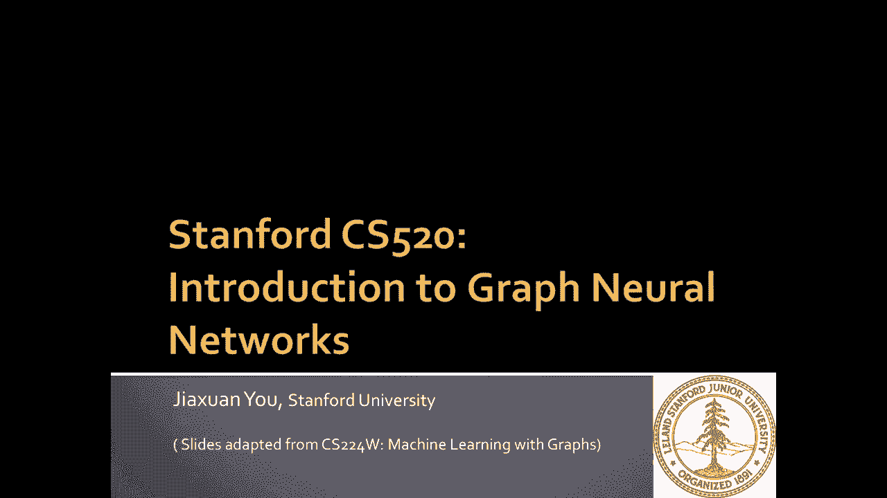

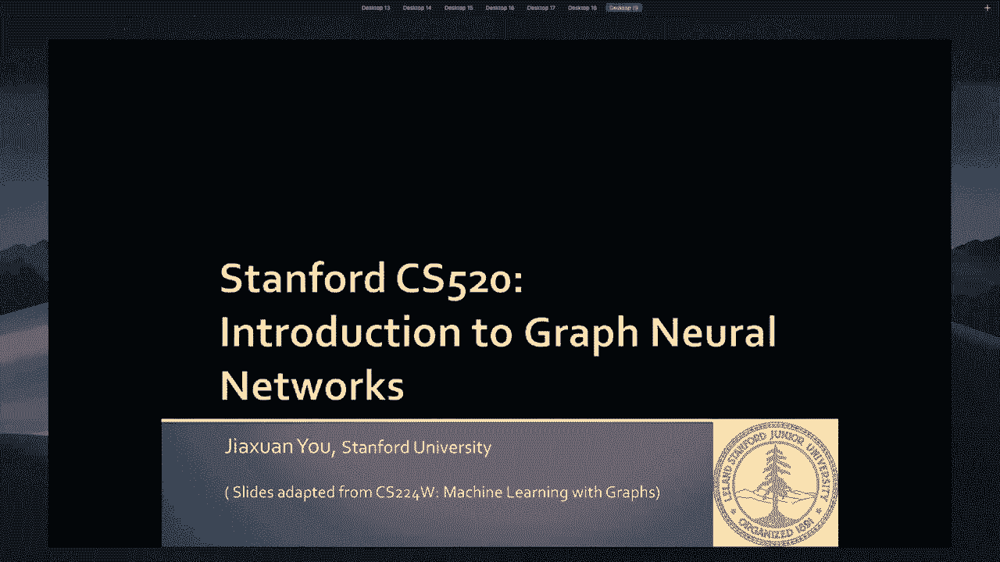

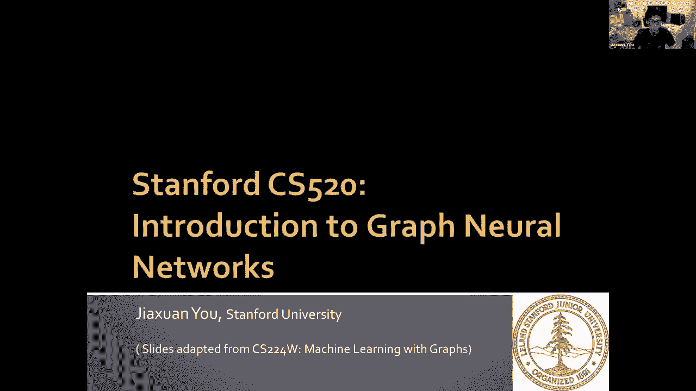

在本节课中，我们将要学习图神经网络（GNN）的基本概念、工作原理及其在知识图谱等领域的应用。我们将从为什么需要图神经网络开始，逐步深入到其核心机制，并探讨其在节点、边、子图和图级别上的实际应用案例。

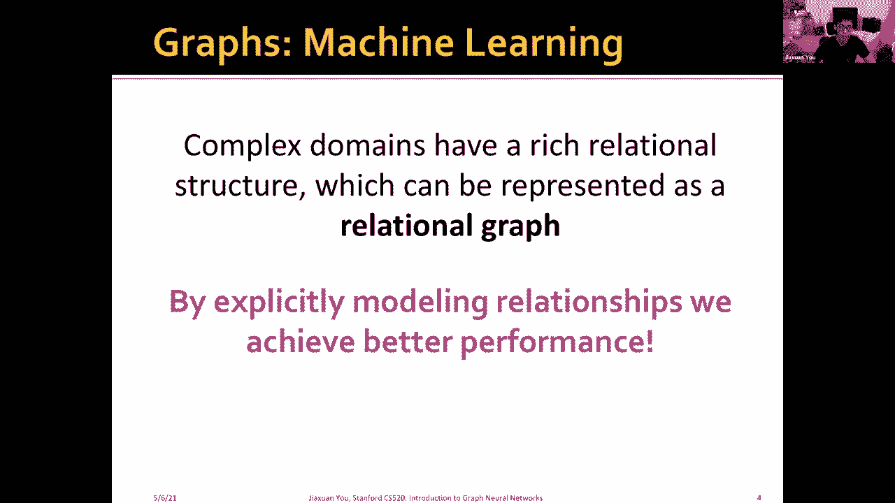

***

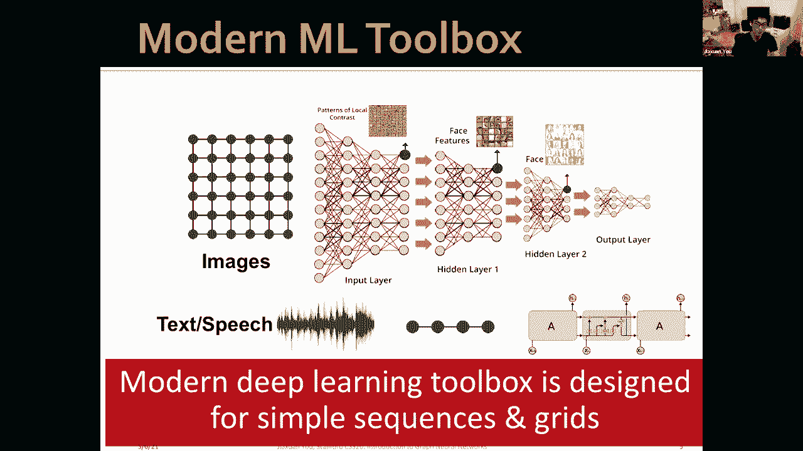

## 为什么需要图神经网络？ 🤔

许多类型的数据本质上都是图结构。你可能见过知识图谱的例子，其他现实世界的数据也可以用图来表示，例如生物调控网络、代码图、分子（其中原子和键是节点和边）或三维网格。我们面临的主要问题是：如何利用图的结构来帮助我们做出更好的预测？我们将通过机器学习的视角来讨论这个问题。

我们知道这些复杂的领域可以表示为关系图。显式地建模这些关系，可以实现更好的性能。

***

## 什么是图神经网络？ 🧩

我们知道，不同的工具箱是为简单的序列或网格数据设计的。例如，我们可以用卷积神经网络（CNN）来处理图像数据，用于人脸检测；我们可以用循环神经网络（RNN）或转换器来处理文本或语音数据，它们看起来像序列。

但对于更复杂的网络或图，情况则不同。具体来说，图可以具有任意大小和复杂的拓扑结构，并且它不像网格或序列那样具有固定的空间局部性。

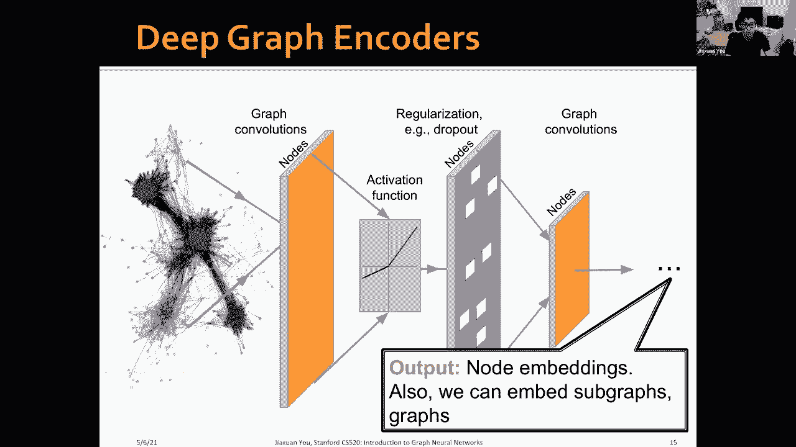

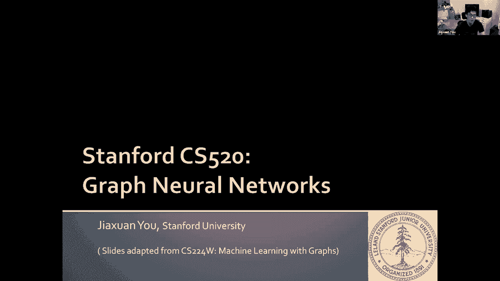

我们将讨论的关键概念是**节点嵌入**。其直觉是，我们可以将节点映射到一个D维的嵌入空间，使得图中相似的节点在嵌入空间中更接近。

更具体地说，我们会有一个输入图，我们想学习一个嵌入函数 `f`，这样我们就可以把图嵌入到一些低维节点嵌入空间中。稍后我们将讨论如何学习这个映射函数 `f`。

我们的目标是定义两件事：
1.  首先，定义一个**编码器**，它可以将输入网络编码成D维嵌入空间。
2.  然后，定义输入网络中的一些**相似性**，这样我们就可以训练嵌入来近似这种节点相似性。

正如我们刚才讨论的，有两个关键组件：
*   第一个是将每个节点映射到低维向量的**编码器**。输入是输入图中的一个节点，输出是D维向量嵌入。
*   第二个概念是**相似性函数**，它指定了向量空间中的关系如何映射到原始网络空间中的关系。相似性可能很简单，比如点积。

编码器的一个简单例子是所谓的**浅嵌入**或**浅编码器**。这里的编码器只是一个嵌入查找表。假设我们有一个嵌入矩阵 `Z`，每一行对应一个嵌入维度，每一列对应一个节点。如果我们想嵌入图中的第五个节点，我们只需查看这个嵌入矩阵的第五列，该向量就是该特定节点的节点嵌入。

知识图谱通常只是一个浅编码器加上一些相似性解码器。知识图谱中的边通常以三元组 `(头实体，关系，尾实体)` 的形式存在。因此，学习知识图谱嵌入就是学习头、尾实体和关系的嵌入。人们通常首先定义一个浅编码器，在嵌入空间中建模实体和关系。每个实体和每个关系都与一个浅嵌入相关联。然后，人们会使用基于相似性的解码器。给定一个真实的三元组 `(h, r, t)`，目标是使头部 `h` 的嵌入加上关系 `r` 的嵌入，接近尾部 `t` 的嵌入。

一个著名的例子是 **TransE 模型**。这里人们使用了“翻译”的直觉。在嵌入空间中，他们希望 `h + r ≈ t` 如果该三元组成立。如果该事实不存在于知识图谱中，它们则不相等。我们如何学习这样的关系？这通常通过一个评分函数来完成。我们想最小化 `(h + r)` 和 `t` 之间的距离。例如，如果我们从一个节点“奥巴马”开始，朝着嵌入“国籍”的方向前进，最终我们可以到达另一个节点“美国人”。

这种浅层编码器非常适合知识图谱应用，但它确实有一些局限性：
1.  首先，这里我们需要 `O(节点数)` 级别的参数。原因是节点之间没有参数的权重共享，所以我们需要为每个节点分配一个唯一的嵌入。
2.  其次，它本质上是**不可归纳**的。这意味着它不能为训练中未见的节点生成嵌入。想象一下你有一个知识图谱，然后有一些新的实体和新的关系，通常你必须重新训练你的系统来学习它们的嵌入。
3.  最后，此方法不能合并节点特征。通常节点和边总是用ID表示，不清楚如何直接使用节点或边的特征。然而在现实生活中，许多图确实有一些特征，比如用户配置文件特征或关系特征。

今天我要介绍一些**深度图编码器**。我们将展示，事实上，这种基于图神经网络的方法可以克服这些局限性。更具体地说，我们将介绍一类节点编码器，它由基于图结构的多层非线性变换组成。所有这些深度编码器实际上可以组合在一起，结合知识图谱方法中定义的节点相似性函数。

从视觉上看，过程是这样的：我们会有一个非常复杂的输入图，这个图会经过不同的图卷积层，然后输出将是节点嵌入。同时，我们也可以在同样的过程中嵌入子图。

***

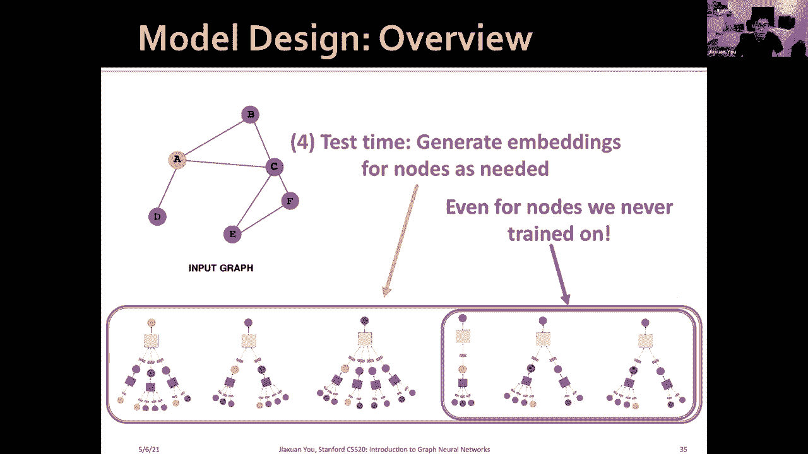

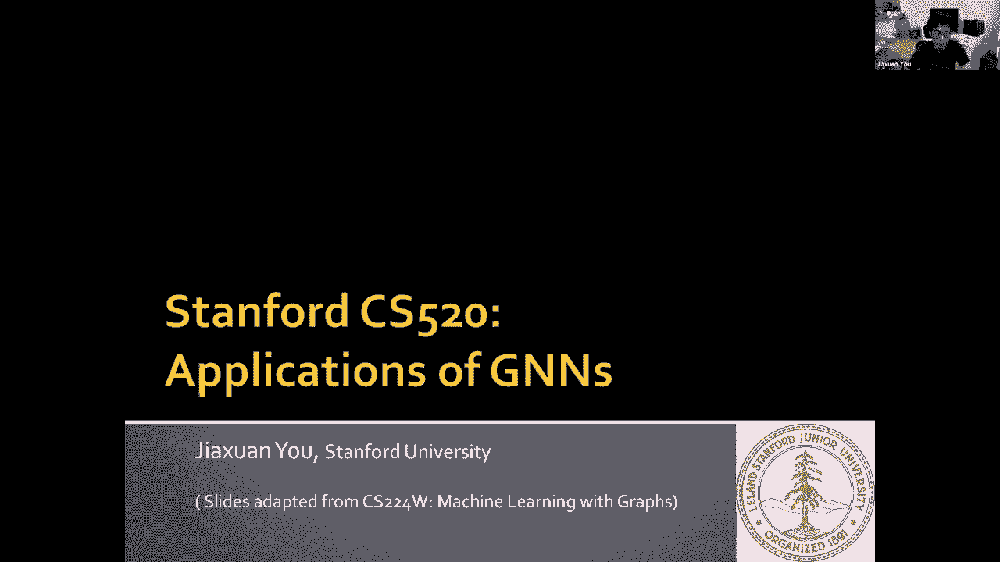

## 图神经网络的工作原理 ⚙️

我们刚刚谈到了为什么需要图神经网络，现在我来介绍什么是图神经网络。

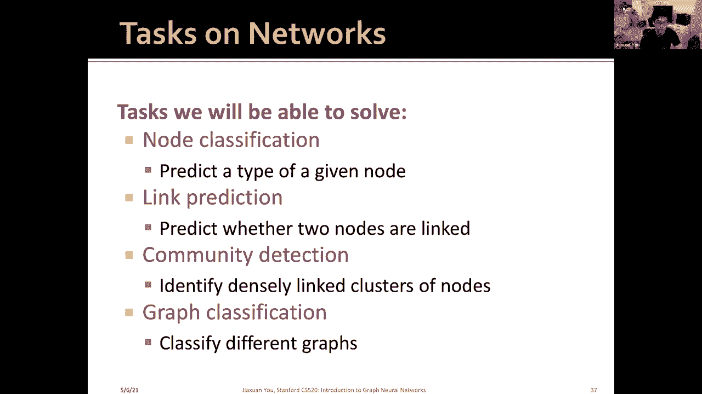

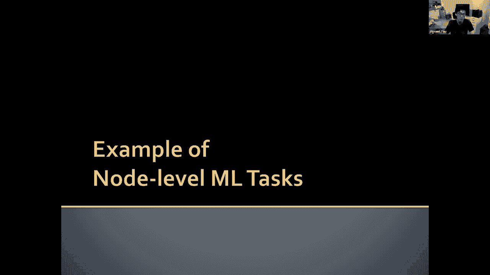

这是我们的设置：假设我们有一个输入图 `G`，其中 `V` 是顶点集，`A` 是邻接矩阵（通常是一个0/1二进制矩阵），`X` 是节点特征的矩阵。`v` 是图中的一个特定节点，`N(v)` 定义了给定节点的邻居集。

这里我们假设节点可能有一些特征。例如在社交网络中，用户配置文件将是一些有用的特征；在生物网络中，我们可以有一些基因表达图谱或基因功能信息。这些是一些有用的节点特征。有些情况下我们没有任何节点特征，在那里我们可以使用一些简单的替代方案，比如指示向量（对每个节点进行独热编码），或者我们只是为所有节点分配一些常数向量。

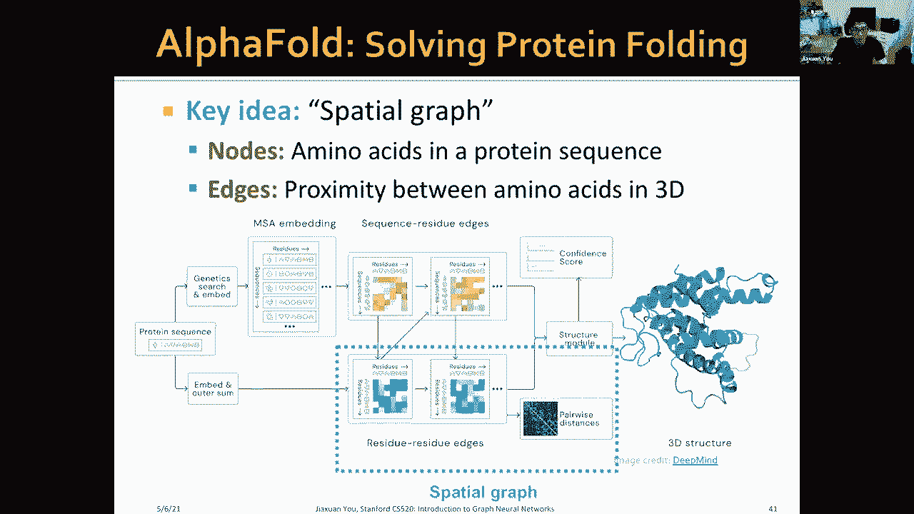

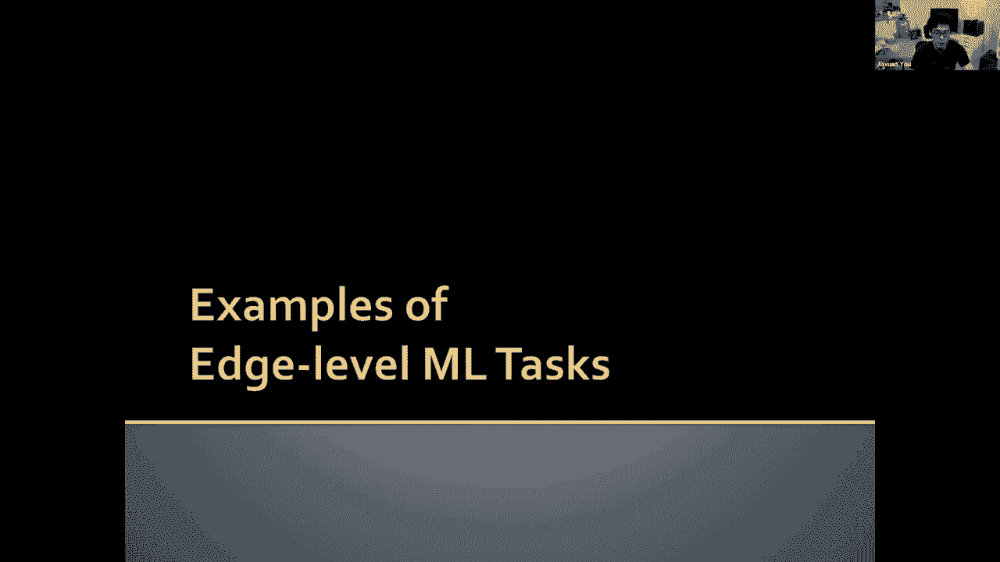

一个天真的方法真的只是拼接这个邻接矩阵和这个节点特征矩阵，然后我们可以把这样的组合表示输入到一个深度神经网络（比如一个非常简单的线性多层感知器）中。这个想法的问题是，这将需要 `O(节点数)` 级别的参数，不适用于不同大小的图，并且它对节点排序也很敏感。

图神经网络的想法实际上是受到了流行的卷积神经网络（CNN）的启发。想象一下人们如何将CNN应用于图像：人们会定义一些卷积滤波器，然后将卷积滤波器在整个图像中滑动卷积。我们在这里的目标是将这种由图像定义的卷积推广到一些更一般的设置中。同时，我们希望利用节点的特性和属性。

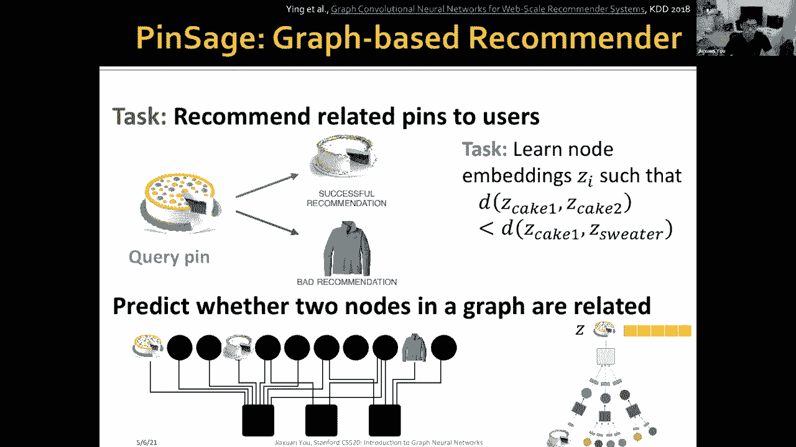

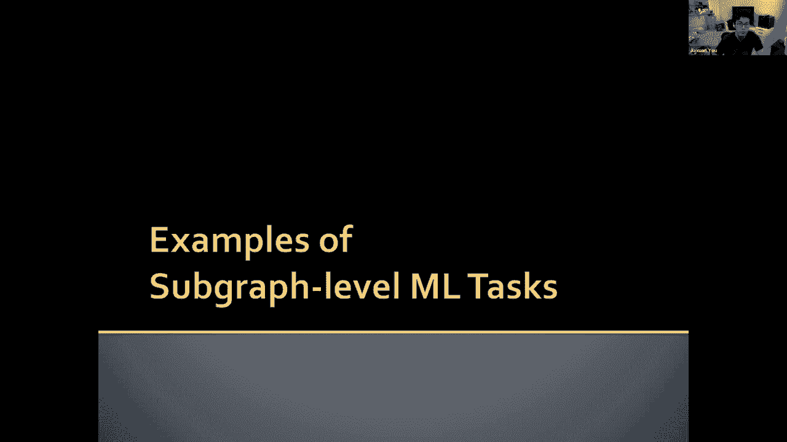

我们的图表看起来和图像很不一样，它只是一个非常复杂的形状，而且在图上没有固定的局部性或滑动窗口的概念，与从网格图像中学习相比，它有点难定义。

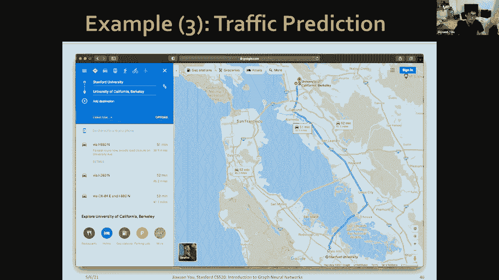

以下是我们的关键观察，它可以帮助我们将图像转化为图形：这里我展示了一个卷积神经网络的例子，使用三乘三的过滤器。你可以看到输出像素实际上取决于其周围的邻居像素。这种直觉也可以推广到图。因此，如果你想学习给定节点的嵌入，我们可以利用它的局部社区，即使用其相邻节点的信息。

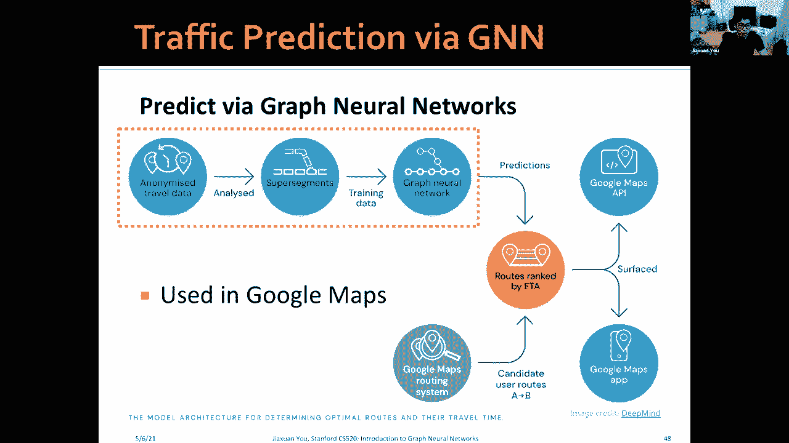

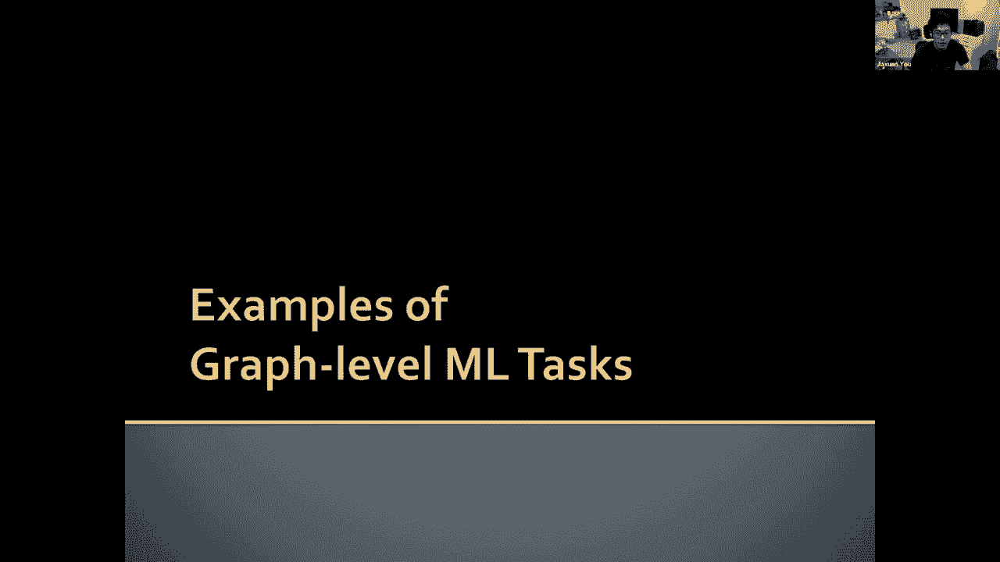

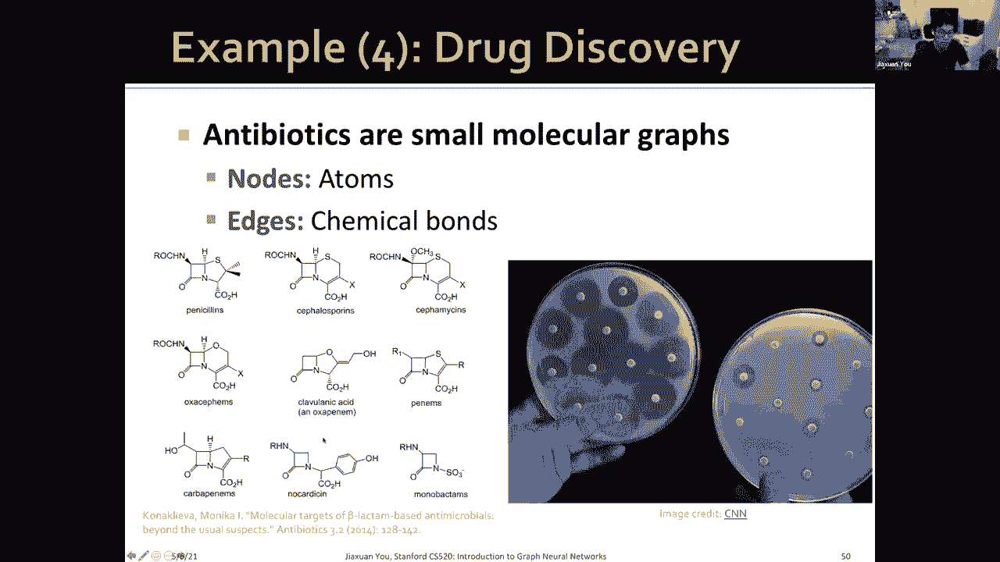

这里的想法是，我们可以在邻居处转换信息，然后组合它，这样我们就可以得到节点嵌入。更具体地说，我们先从节点邻居传递信息 `h_i`，经过一些线性变换，然后把它们加起来，这将是最后的节点嵌入。

现在我要介绍具体的图卷积神经网络（GCN）或图神经网络（GNN），它实际上只包括两个步骤：
1.  首先，我们要基于节点的邻域确定节点的**计算图**。
2.  然后，根据计算图，我们将在整个图形中**传播和转换信息**。

这里有一个更具体的例子：假设我们有这个输入图，我们的目标是学习目标节点 `A` 的嵌入。我们将首先生成基于其本地邻居网络的嵌入。`A` 有邻居 `B`、`C` 和 `D`。然后对于每个节点，我们将查看它们的邻居，例如 `B` 将有邻居 `A` 和 `C`，以此类推。

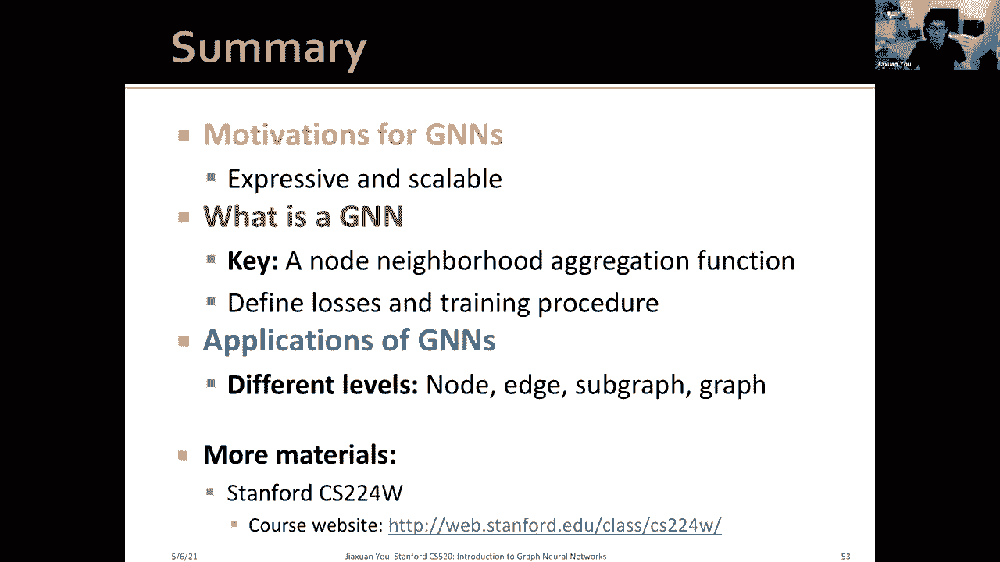

我们在这里的直觉是，我们想在这个聚合过程中应用一些神经网络，这样我们就可以计算嵌入。这里有一个非常有趣的观察是，每个节点都将基于自己的邻域定义一个不同的计算图。例如，`A`、`B`、`C`、`D` 的计算图都很不一样，这样我们就可以学习不同节点的不同嵌入。

这种计算确实发生在许多层。因此节点可以在每一层都有嵌入。一开始，在第0层，节点特性将只是它的输入特性 `x_u`。然后我们将应用几轮消息传递进行聚合。根据第0层特性，通过一跳聚合获得第1层嵌入，然后我们将继续进行这个聚合，最终我们可以得到我们要学习的节点 `A` 的嵌入。你可以看到，第 `k` 层嵌入实际上从距离 `k` 跳远的节点获得信息。所以 `A` 通过一层能够从一个跳跃的邻居那里获得信息，通过两层计算，你可以从他的两个跳跃邻居那里获得信息。

接下来我要谈谈我们如何真正定义这个黑匣子。这里的一个基本方法是，我们将邻居的信息平均，然后应用一个神经网络。所以你可以看到第一步是平均来自邻居的消息，然后使用平均信息应用一些神经网络。

这是正在发生的具体过程：
1.  首先，我们将使用输入的原始节点特性初始化第0层嵌入 `h_v^0`。
2.  然后每一层 `l`，输入将是上一层的节点嵌入 `h_u^{l-1}`。我们把邻居上一层的嵌入平均一下，以计算此层的消息。
3.  在计算之后，我们将应用一些矩阵变换 `W` 和偏置 `b`，其中 `W` 和 `b` 是图神经网络的权重矩阵，它们是可以训练的。
4.  经过计算这些信息后，最终会应用一些非线性激活函数（如ReLU）来增加GNN的表达能力。
5.  我们将重复这个过程进行 `L` 轮，其中 `L` 是层的总数。最终我们会得到节点 `v` 的最终节点嵌入 `h_v^L`，这是通过这些 `L` 层GNN计算得到的。

下一个问题是我们如何训练GNN。我们知道这个GNN为我们提供了节点嵌入 `h_v`。训练GNN有两个一般设置：
1.  第一个是**监督设置**。我们想最小化节点嵌入和一些目标标签 `y_v` 之间的损失。我们想要优化在这个图中定义的神经网络的参数。可能的标签可能有一些节点级标签、边级标签和图级标签。这个标签通常来自一些外部来源。我将在下一节给出一些具体的例子。损失函数是相当标准的：如果 `y` 是实数，我们会用一些L2损失；如果 `y` 是类别，会使用一些交叉熵分类损失。
2.  另一个设置是**无监督学习环境**。我们不是使用一些外部监督标签，而是使用图形结构本身作为监督。例如，我们可以在随机游走的基础上定义一些节点相似性，或者我们甚至可以使用一些知识图谱目标定义，比如TransE或RotatE等。

以下是我们已经讨论过的概述和总结，这就是图神经网络的工作原理：
1.  首先，我们将定义邻域聚合函数。
2.  然后，我们将在嵌入上定义一个损失函数。
3.  我们将基于一组节点（比如一批计算图）训练这些嵌入。
4.  然后在测试时，得到一个训练有素的模型，将根据需要为节点生成嵌入。

这里很酷的是，我们甚至可以生成我们从未训练过的节点的嵌入。这真的解决了非归纳性问题。

***

## 图神经网络的应用 🚀

现在我在最后一节介绍了什么是图神经网络，我将谈谈图神经网络的一些很酷的应用。

有几个重要的任务可以在网络上定义。使用图神经网络，我们将能够：
*   进行**节点分类**，目标是预测给定节点的一些标签。
*   定义**链接预测**任务，目标是预测两个节点是否会在图中链接在一起。
*   做一些**社区检测**任务，我们得到一个输入图，想定义图中一些有趣的群落结构。
*   最后，我们可以做一些**图分类**任务，目标是对不同的图进行分类，比如对不同的分子进行分类。

### 节点级任务示例：蛋白质折叠 🧬

蛋白质链从氨基酸序列中获得了天然的三维结构。我们有一系列氨基酸序列的信息，最后它会折叠成一个三维结构。蛋白质折叠的问题是，我们想通过计算完全基于氨基酸序列来预测蛋白质的三维结构。

这里有一些非常酷的预测是由DeepMind的AlphaFold团队做出的。他们的预测非常接近真实的三维结构。他们是怎么做到的？他们利用了图神经网络技术。他们的主要想法是建立一个空间图，其中节点是蛋白质序列中的氨基酸，边是氨基酸在三维空间中的接近度。定义了这样一个空间图后，他们将应用一些类似于图神经网络的技术来做出预测。

### 边级任务示例：推荐系统 🛍️

一个非常重要的应用是推荐系统。可以考虑建立一个用户-物品交互图的推荐系统。例如，用户可以看一些电影、买一些商品、听音乐等。其中节点是用户和物品，边是它们的用户-物品交互。我们的目标是推荐用户可能喜欢的项目。

这里一个非常成功的方法叫做 **PinSage**，它使用图神经网络建立一个成功的推荐系统。这里的任务是向用户推荐相关的Pins。例如，我们可以有一个图，其中包含一个“蛋糕”节点和一个“毛衣”节点。一个好的推荐将推荐另一个蛋糕，一个糟糕的推荐会说推荐这件毛衣。我们的目标是，在嵌入空间中，两个蛋糕的嵌入应该靠近，而蛋糕和毛衣的嵌入应该远离。如果我们用边级别预测任务训练图神经网络，模型将能够预测图中的两个节点是否相关，这是推荐系统的核心组成部分。

### 子图级任务示例：交通预测 🚗

另一个成功的应用是将GNN应用于交通预测。假设你想从斯坦福大学到UC伯克利。底层表示也是一个图，因为你可以把道路网络看作一个图表，其中节点是路段，边是这些路段之间的连接性。人们将能够根据道路网络进行交通预测。这里的技术也是图神经网络，这项技术已经部署在谷歌地图上，表现得很好。

### 图级任务示例：药物发现 💊

这里的例子是药物发现。分子可以表示为图，其中节点是原子，边是化学键。人们已经成功地使用图神经网络来发现抗生素。他们把这个问题表述为一个图分类任务，目标是预测来自现有候选药物池中有希望的药物分子。

另一个有趣的方向是做分子或图形生成，我们将生成新的分子，这些新分子有可能用于药物。会有一些非常酷的用例，比如我们可以生成与现有分子具有非常高相似性的新分子，或者我们可以优化一些现有的分子，使其具有一些理想的性质。这里的底层模型都是图神经网络。

***

## 总结 📝

本节课中我们一起学习了图神经网络。
*   我们首先讨论了**为什么需要图神经网络**，因为许多复杂数据本质上是图结构，利用图结构可以提升预测性能。
*   接着，我们深入探讨了**什么是图神经网络**。其核心在于定义一个节点邻域聚合函数来生成节点嵌入，并通过定义损失函数和训练程序来优化模型。GNN能够克服浅层嵌入方法的局限性，具有更强的表达能力和归纳性。
*   最后，我们探索了**图神经网络的一些很酷的应用**，它们覆盖了节点级别（如蛋白质折叠）、边级别（如推荐系统）、子图级别（如交通预测）和图级别（如药物发现）等多种任务。

图神经网络为处理复杂的、非欧几里得结构的数据提供了强大的工具，并在众多领域展现出巨大的潜力。