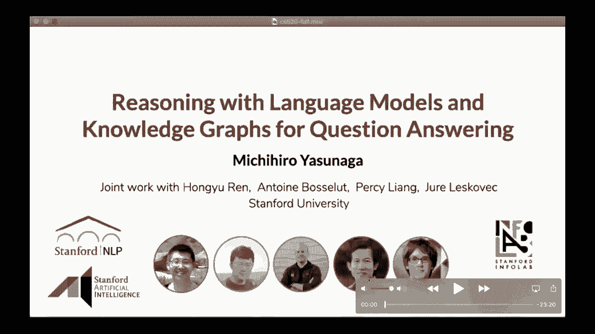
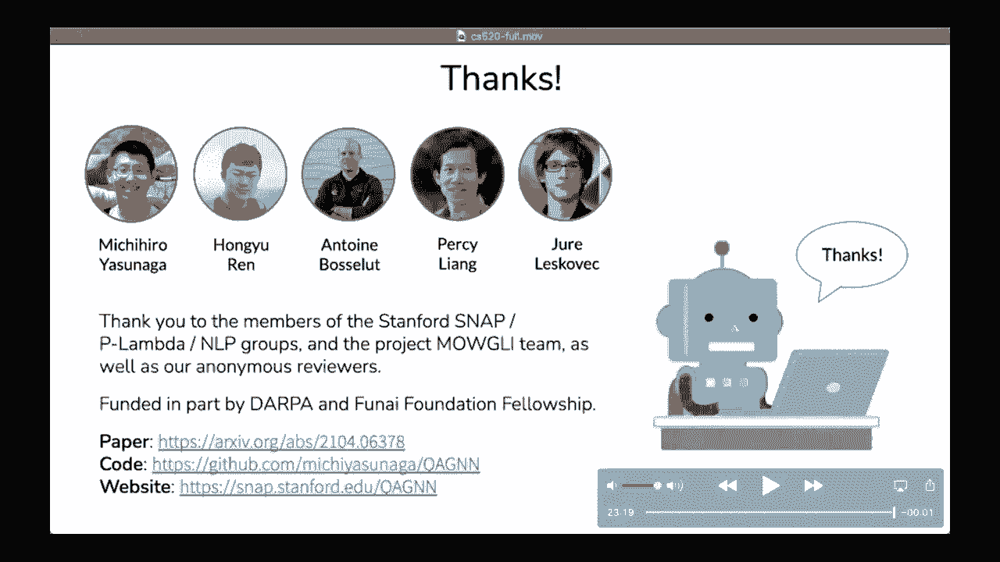

# 23：L14.2 - 问答系统中基于语言模型和知识图谱的知识推理 🧠

在本节课中，我们将学习如何结合预训练语言模型和知识图谱，构建一个更强大的问答系统。我们将探讨两种知识来源的互补性，并详细介绍一种名为 **QA-GNN** 的新型混合模型。

---

## 概述

问答是自然语言处理中的一个基本任务。一个优秀的问答系统需要获取相关知识并进行推理。通常，知识可以编码在两种形式中：
1.  **大型预训练语言模型**（如 BERT、GPT-3），它们从海量非结构化文本中学习，拥有广泛的知识覆盖。
2.  **结构化知识图谱**（如 Freebase、ConceptNet），其中实体是节点，关系是边，支持结构化和可解释的推理。

这两种来源各有优劣：语言模型知识面广但可能不擅长逻辑推理；知识图谱结构清晰但可能覆盖不全且有噪声。本课程的目标是探索如何结合两者，以提升问答系统的性能。

---

## 预备知识：语言模型与图神经网络

在深入主要工作之前，我们先简要回顾两个重要的构建模块：语言模型和图神经网络。

### 语言模型 (Language Models)

语言模型的目标是：给定一段文本的部分序列，预测文本的其余部分。主要有两种类型：
*   **自回归语言模型**：预测下一个词，给定前面的一系列单词。
    *   例如：给定 “狗追逐”，预测下一个词可能是 “飞盘”。
*   **掩码语言模型**：预测一个序列中被掩码的单词。
    *   例如：在 “斯坦福大学位于 [MASK]” 中，预测 “[MASK]” 可能是 “加利福尼亚”。

为了做好预测，语言模型需要掌握各种技能，包括事实知识、语法知识和常识。现代语言模型通常是基于 Transformer 架构的大型神经网络，并在海量文本（如维基百科、书籍）上进行预训练，从而获得广泛的知识。BERT、RoBERTa、GPT-3 等都是著名的例子。

预训练后的语言模型可以通过微调，适应各种下游任务，例如问答。一种常见的方法是：将问题和每个候选答案连接成一个句子，输入语言模型，再通过一个线性层得到每个答案的概率得分。

语言模型的优势在于其广泛的知识覆盖，这得益于大规模语料库的预训练。它们可以处理各种问答问题，包括一些难以用知识图谱查询直接回答的常识性问题。

### 图神经网络 (Graph Neural Networks, GNNs)

GNN 的基本思想是：通过让图中相邻节点相互传递信息，来更新每个节点的表征（嵌入）。

假设节点 `v` 当前的表征是 `h_v^(k-1)`。其更新规则通常包括两个步骤：
1.  **聚合 (Aggregate)**：收集来自邻居节点 `u` 的信息。
    *   例如，对邻居表征求和：`a_v = SUM( h_u )`
2.  **组合 (Combine)**：结合自身表征和聚合信息，更新当前节点。
    *   例如，使用线性变换：`h_v^k = σ( W * CONCAT(h_v^(k-1), a_v) )`

通过多层这样的操作，GNN 可以学习到图中节点更好的表示。在本课程中，我们将使用 GNN 来学习知识图谱中节点的表示。

---

## 挑战与动机

为什么结合语言模型和知识图谱进行问答既困难又有趣？

假设系统遇到一个常识问题：“圆刷是以下哪项的一个例子？”，并提供选项“发刷”和“艺术用品”。系统需要：
1.  从一个庞大的、可能有噪声的知识图谱中，检索出与当前问题相关的子图。
2.  理解问题的含义（包括否定等复杂逻辑），并结合知识图谱的结构（实体间关系）进行联合推理。

这两点构成了本课题的核心研究挑战。

---

## QA-GNN 模型介绍

为了应对上述挑战，我们提出了 **QA-GNN**，一种结合语言模型和知识图谱的新型混合模型。以下是其核心流程概述：

1.  **编码**：给定问答上下文（问题+候选答案），我们使用预训练语言模型将其编码为向量表示。
2.  **检索**：使用标准方法（如实体链接）从知识图谱中检索出一个相关的子图。
3.  **核心创新一：语言条件化的 KG 节点评分**：为了更好地识别哪些图谱节点与问题相关。
4.  **核心创新二：联合推理**：将问题文本和知识图谱连接成一个统一的图进行推理。
5.  **预测**：结合语言模型和知识图谱的表示，预测最终答案。

接下来，我们将详细解释两个核心创新点。

### 核心创新一：语言条件化的 KG 节点评分 🎯

**动机**：传统的知识图谱检索方法是识别问题中的主题实体，然后提取其多跳邻居。这可能会引入大量语义上无关的节点，特别是当主题实体增多或跳数增加时。

**方法**：我们提出使用预训练语言模型，以当前问题为条件，对知识图谱中每个节点的相关性进行评分。
具体而言，我们将问答上下文与知识图谱中的每个实体连接起来，输入语言模型，计算该实体在给定上下文下的概率。得分高的实体（如图中的“抢劫”、“安全”）被认为与问题更相关，得分低的实体（如“河岸”）则相关性较低。

**应用**：这个相关性分数有两种用途：
*   **剪枝**：用于修剪知识图谱，使输入模型的图谱更小，提高效率。
*   **加权**：作为知识图谱的附加注释特征，为图谱提供权重信息。在 QA-GNN 中，我们采用了后一种方式。

### 核心创新二：联合推理与工作图 🔗

为了给两种知识来源设计一个联合推理空间，我们显式地将它们连接到一个公共的图结构中。

我们引入一个 **QA 上下文节点 Z**，并将其连接到知识图谱中的每个主题实体。这个统一的图直观地提供了推理的“工作记忆”，因此我们称之为 **工作图**。

工作图中的节点有四种类型：
*   **紫色**：QA 上下文节点。
*   **蓝色**：问题中出现的实体。
*   **橙色**：答案选项中出现的实体。
*   **灰色**：其他实体。

QA 上下文节点的初始表示来自语言模型的编码，其他节点的初始表示则使用预训练的实体嵌入。

**基于注意力的图神经网络推理**：在工作图上，我们使用基于注意力的 GNN 进行推理。GNN 的基本思想是让相邻节点通过多层相互传递信息来更新表示。

在我们的模型中，节点 `t` 的更新规则可以表示为：
`h_t^k = UPDATE( h_t^(k-1), AGGREGATE( α_{s,t} * m_s ) )`
其中，`m_s` 是来自邻居节点 `s` 的信息向量，`α_{s,t}` 是源节点 `s` 和目标节点 `t` 之间的注意力权重。

我们让计算注意力权重所需的查询（Query）和键（Key）向量以节点的相关性分数为参数，并使用内积来计算注意力权重。这样，模型在传播信息时会更加关注那些被语言模型判定为相关的节点。

---

## 实验与评估

### 实验设置
我们使用两个需要知识推理的流行 QA 基准进行评估：
1.  **CommonsenseQA**：测试常识知识的多项选择题数据集。
2.  **OpenBookQA**：测试基础科学知识的多项选择题数据集。

对于知识图谱，我们使用 **ConceptNet**（一个包含近百万实体的开放域知识图谱）。我们比较了以下系统：
*   **微调的语言模型**（如 RoBERTa）。
*   **之前的语言模型+知识图谱模型**（如关系网络）。
*   我们提出的 **QA-GNN**。

所有系统都使用相同的预训练语言模型 RoBERTa 作为基础。

### 主要结果
QA-GNN 在两个 QA 基准上都取得了优于之前系统的性能。

### 消融研究
为了验证两个核心创新的效果，我们进行了消融实验：
*   **移除联合图**：如果不形成文本和知识图谱的联合图并进行相互更新的表示传递，性能会下降约 2%，结果接近于之前的 LM+KG 模型。
*   **移除 KG 节点评分**：如果不使用语言模型对 KG 节点进行相关性评分，性能会下降约 1%。
*   **节点评分的帮助场景**：当问题中实体数量较多，或检索到的知识图谱子图很大时，KG 节点评分往往更有帮助。
*   **联合推理的帮助场景**：当问题包含否定等需要丰富推理的情况时，联合图表示和消息传递往往更有帮助。

### 案例分析

我们通过追踪 QA-GNN 中注意力流的路径，尝试解释模型的推理过程。

**例1**：对于问题“电梯服务于建筑物中的什么？”，模型关注“电梯”和“地下室”，并通过知识图谱中的路径（电梯->建筑物->办公楼）推理出答案。

**例2**：对于问题“盐水是海洋的一部分，那么淡水是什么的一部分？”，模型关注问题实体“淡水”和“盐水”，并在知识图谱上找到桥接实体（如“湖泊”、“河流”）来推理答案。

**鲁棒性测试**：QA-GNN 能够处理一些需要鲁棒推理的情况，如否定和实体替换。
*   **否定翻转**：在“圆刷是**没有**用处的例子”中，模型关注“艺术用品”；当否定词被移除，问题变为“圆刷是有用的例子”时，模型转而关注“发刷”。
*   **实体替换**：将原问题中的实体进行替换，模型能根据上下文调整答案。

相比之下，像 RoBERTa 这样的纯语言模型在这些测试中容易失败。

### 知识源互补性分析

我们分析了知识图谱和语言模型分别在什么情况下更有帮助。

**知识图谱有帮助的场景**：
*   当答案依赖于具体的知识（如事实、反义词、否定）时。
    *   *例子*：问题“如果你有拖延工作的倾向，为了按时完成，你必须做什么？” 知识图谱提供了从“延迟”到“加速”（反义词）的明确路径。
*   当知识图谱路径能为推理提供支持时。
    *   *例子*：问题“黄鼠狼一直钻进鸡蛋里，农民用什么来阻止它？” 知识图谱提供了从“黄鼠狼”到“鸡”到“鸡蛋”再到“栅栏”的多种路径。

**语言模型有帮助的场景**：
*   当问题需要微妙的语言细微差别和常识，而简单地依赖知识图谱路径可能导致错误时。
    *   *例子*：问题“詹姆斯抬起头，看见星星在黑暗中闪烁，他对它们的什么感到惊讶？” 语言模型能根据常识选择“宇宙的大小”，而知识图谱感知方法可能错误地关联到“夜空”。
    *   *例子*：问题“如果在混合液体餐中加入盐和胡椒粉，你会得到什么？” 语言模型能正确预测“汤”，而知识图谱方法可能错误关联到“水”。

**启示**：语言模型和知识图谱具有互补的优势。在一个“预言机”实验中（如果语言模型或知识图谱方法中任何一个答对即算成功），性能远高于单独的 RoBERTa 或 QA-GNN。这暗示了一个有趣的未来研究方向：**让模型学会动态决定在何时依赖哪种知识源**。

---

## 总结

本节课我们一起学习了如何结合预训练语言模型和知识图谱来构建更强大的问答系统。我们介绍了 **QA-GNN** 模型，其核心创新在于：
1.  **语言条件化的 KG 节点评分**：使用语言模型评估知识图谱节点与问题的相关性，为图谱提供软权重或检索依据。
2.  **联合推理**：将文本和知识图谱连接成统一的工作图，通过图神经网络让两种知识源的表示相互更新、共同推理。

通过实验和分析，我们发现：
*   当检索到的知识图谱很大或有噪声时，节点评分方法更有帮助。
*   当问题需要处理否定等复杂推理时，联合图上的消息传递更有帮助。
*   语言模型和知识图谱在问答任务中具有显著的互补性。

未来的工作可以探索更模块化的架构，让模型能更智能地选择和融合不同的知识源。