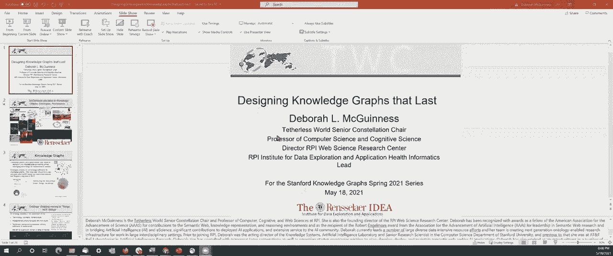
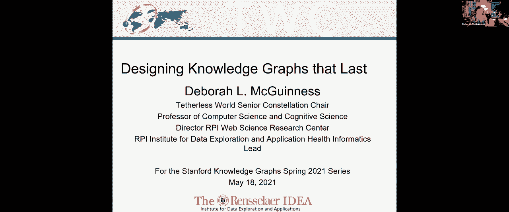
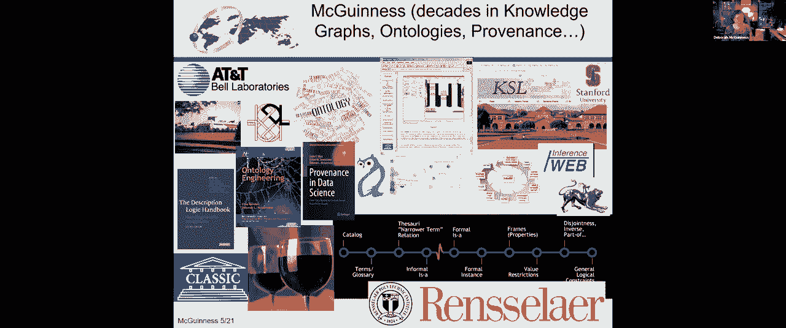
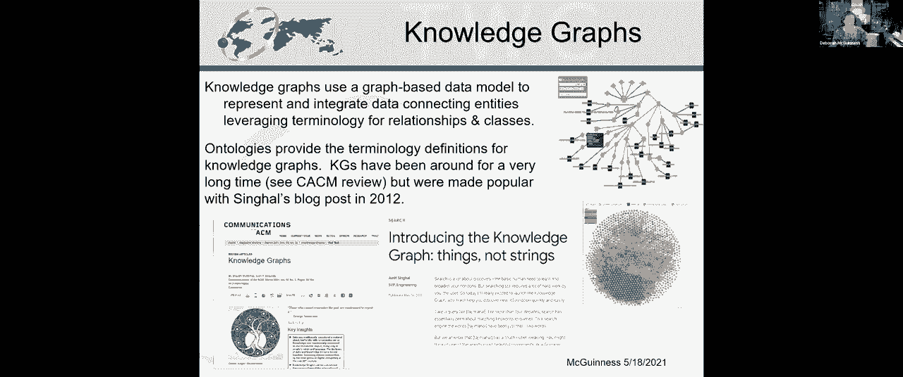
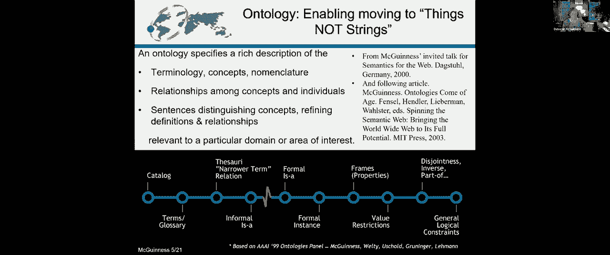
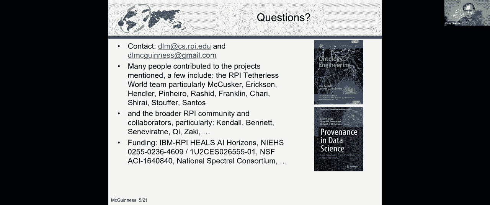
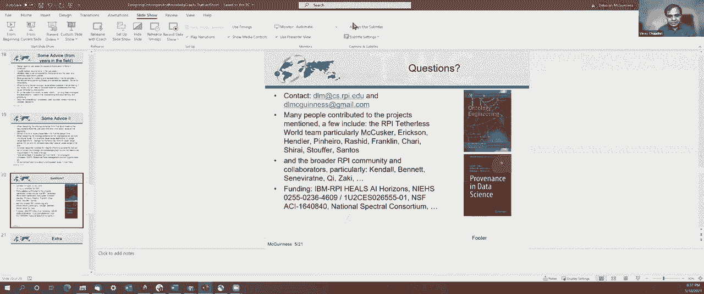

# 25：L15.2 - 构建可持续知识图谱 📚 

## 概述
在本节课中，我们将学习如何设计和构建一个高质量、可持续的知识图谱。我们将探讨从明确需求、复用现有术语到建立更新和维护策略的全过程，目标是构建一个不仅满足当前项目需求，也能被他人长期使用和维护的知识图谱。

---

## 1. 知识图谱与本体论简介
知识图谱本质上是连接实体的网络。图中的节点代表实体，边代表实体间的关系，并且这些关系通常使用人类和计算机都能理解的术语进行标注。

构建高质量的知识图谱不仅需要连接数据，还需要设计一套清晰的术语体系（即本体），以便知识图谱能够有效地服务于其设计目标，并具有长久的生命力。

当我们将数据的表示从单纯的“字符串”提升到具有明确含义的“事物”时，本体论是实现这一目标的核心工具。本体可以是一组带定义的术语，也可以是使用如 **OWL** 等标准语言描述的结构化知识。

**核心公式/概念：**
*   **知识图谱** ≈ 实体 + 关系（使用明确术语标注）
*   **本体** = 术语及其含义的形式化规范

---

## 2. 构建知识图谱的关键需求
上一节我们介绍了知识图谱和本体的基本概念。本节中，我们来看看要构建一个能被他人使用和维护的知识图谱，具体需要满足哪些关键需求。

要让他人愿意使用一个知识图谱，它至少需要满足以下几点：
*   **解决核心问题**：能够回答项目利益相关者认为重要的问题。
*   **有效集成内容**：能够以有用的方式整合来自不同来源的数据。
*   **内容透明可信**：用户需要清楚知识图谱包含什么内容，以及这些内容是如何进入图谱的。
*   **合规的访问权限**：需要具备正确的访问控制和数据许可机制。

而要让他人愿意长期维护一个知识图谱，则需要考虑：
*   **领域知识支持**：维护者需要具备相关领域的专业知识，以便进行内容策展和质量评估。
*   **工具链受益**：知识图谱能为其工具或方法（如机器学习训练）提供价值。
*   **支持扩展性**：允许用户根据自身需求对知识图谱进行扩展。
*   **满足质量与时效性**：提供符合用户要求的数据质量，并能进行定期更新。

**核心概念：**
*   **质量评估**：知识图谱的质量标准取决于其**是否满足特定用途的需求**。

---

## 3. 知识图谱开发流程与实践案例
明确了需求后，我们进入实践环节。一个系统的开发流程是项目成功的基石。我们将通过一个环境健康领域的案例来具体说明。

一切始于**用例**。我们需要明确：想要回答什么问题？回答这些问题的难点是什么？需要哪些信息？之后，寻找并复用现有的词汇表和本体作为起点至关重要，这可以避免重复造轮子。如今，在 **BioPortal** 等资源库中可以找到许多领域的成熟本体。

以下是开发流程的关键步骤：
1.  **定义用例与能力问题**：明确项目目标和需要回答的具体问题，以此确定范围。
2.  **发现与评估现有本体**：寻找可能复用的本体，评估其覆盖范围和适用性。
3.  **策略性复用**：对于大型本体（如 **ChEBI**），通常只导入所需的最小部分（MIREOT原则）。
4.  **建立并记录流程**：制定本体选择、术语映射、内容更新的标准化流程并详细记录。
5.  **迭代式术语改进**：采用经验驱动的方法，随着新数据的出现，逐步识别和集成新术语。
6.  **构建语义数据字典**：帮助领域专家将原始数据（如Excel列标题）映射到统一的术语体系。
7.  **启用智能应用**：利用构建好的本体和知识图谱，支持分面搜索、复杂查询和数据分析等应用。

**核心概念：**
*   **MIREOT**：最小信息引用外部本体术语，是一种复用大型本体的策略。
*   **语义数据字典**：连接原始数据模式和标准本体的桥梁，便于数据映射与集成。

---

## 4. 确保知识图谱的可持续性
构建知识图谱只是第一步，如何让它持续产生价值并不断进化同样重要。本节我们将探讨确保知识图谱长寿和可复用的关键策略。

首先，在初始设计阶段就要为**更新**做好准备。这包括对**模式（本体）、实例数据**以及依赖它们的**应用程序**（如SPARQL查询）制定更新计划。

其次，建立并遵循**风格指南**至关重要。一致性是本体易于理解、使用和维护的秘诀。在可能的情况下尽量复用现有资源，但要注意不同来源的本体可能存在建模冲突，需要进行权衡。

最后，积极利用各种**评估工具和环境**（如 **Chimera**、 **OOPS!**）来检查本体的质量。同时，始终考虑知识图谱未来可能出现的**意外用途**，在设计时保持一定的灵活性。

**核心建议总结：**
*   **始于用例，明确范围**。
*   **设计时即考虑更新需求**。
*   **力求一致，建立风格指南**。
*   **积极复用，但权衡冲突**。
*   **模块化设计，便于维护与扩展**。
*   **全面记录所有流程和决策**。
*   **利用工具进行评估**。
*   **为未来的重用和扩展预留空间**。

---

## 5. 问答与讨论精要
在课程最后的讨论环节，演讲者与嘉宾就一些实践中的关键问题进行了深入交流。

**关于产品知识图谱的本体：**
在亚马逊等电商场景中，产品知识图谱的本体通常从现有分类法（产品类型）和目录（产品属性）开始。由于产品领域复杂且快速演变，完全手动开发本体不现实。策略是确保**核心本体**正确且约束较少，易于扩展；对于外围部分，则结合自动化方法（如从查询日志中挖掘关系）来捕捉现实世界的变化。

**关于本体与知识图谱的区别：**
两者没有绝对清晰的界限。一种实用的观点是：**本体**定义了术语、类别、关系及其约束（即“模式”或“TBox”）；**知识图谱**则包含了使用这些术语的具体实体实例和关系实例（即“数据”或“ABox”）。在实践中，一个知识图基础设施通常同时包含本体层和数据层。

**关于实例的粒度：**
在像产品知识图谱这样的应用中，通常不会为每一个具有独立序列号的物理物品（如某一罐可乐）创建独立节点，除非上层应用有特殊需求（如追溯）。更常见的做法是在“产品型号”这个类别层级进行描述，以服务于搜索、推荐等主要业务目标。

---

## 总结
本节课我们一起学习了构建可持续知识图谱的完整思路与方法。我们从明确需求出发，介绍了以用例驱动的开发流程，强调了复用现有本体和建立标准化流程的重要性。最后，我们探讨了通过制定更新策略、风格指南和模块化设计来确保知识图谱长期生命力的关键策略。记住，优秀的知谱图谱不仅是数据的连接，更是通过精心设计的术语和可持续的流程，成为能够不断生长、适应变化并服务于多元目标的知识基础设施。