# 26：L16.1 - 如何拓展知识图谱 📈

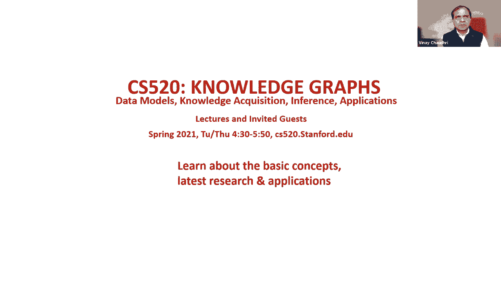

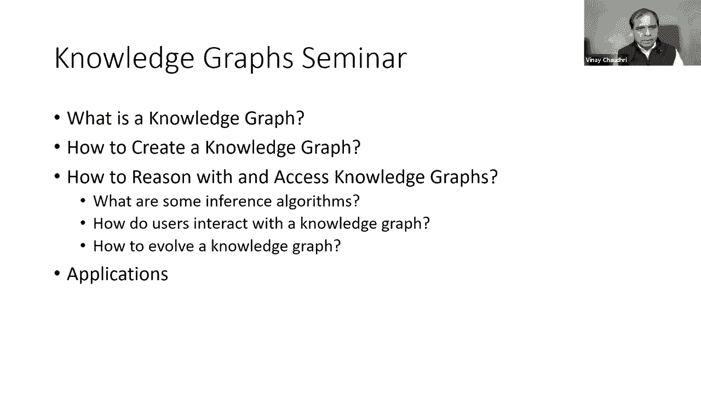

在本节课中，我们将学习如何发展和维护一个知识图谱。知识图谱并非一成不变，它需要随着现实世界的变化、业务需求的演变以及新数据的出现而不断更新和拓展。我们将探讨在知识图谱演化过程中面临的技术挑战，并介绍几种核心的变更管理技术。

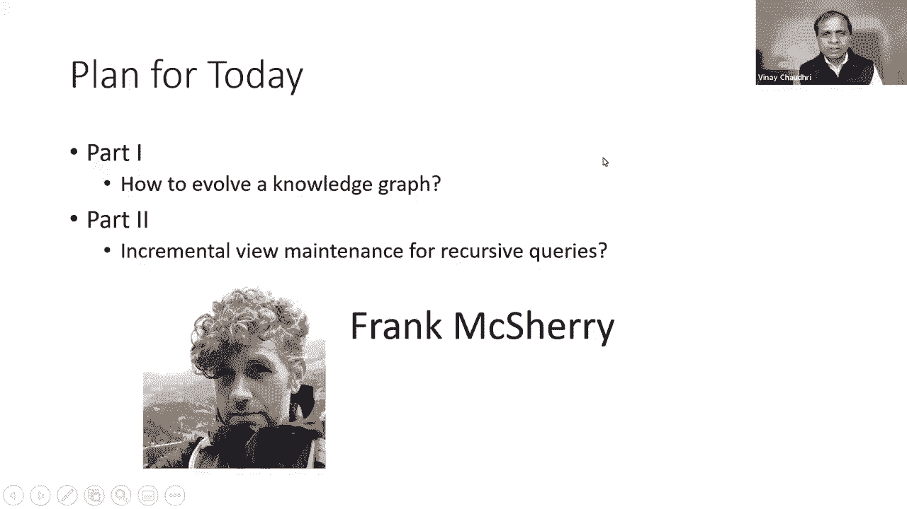

---

## 概述：知识图谱为何需要演化 🌍

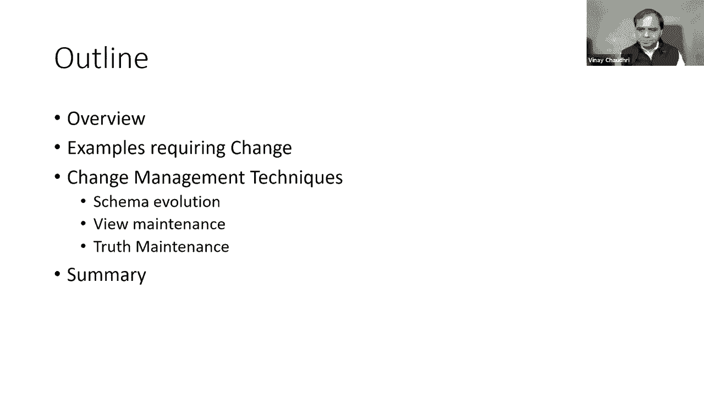

生命中唯一不变的就是变化。现实世界在持续变化，业务需求也在不断更新。作为软件制品，知识图谱必须随之改变以适应这些变化。

知识图谱的变更主要源于两方面：
1.  **模式（Schema）的修改**：例如更改关系的语义、引入新关系或重命名关系。
2.  **基础事实（Ground Facts）的修改**：即知识图谱中具体数据的变化。

应对这些变化时，我们既要考虑技术问题（如算法和工具），也要考虑社会问题（如确保变更不会破坏现有功能或影响用户）。本节课我们将主要聚焦于技术挑战和解决方法。

---

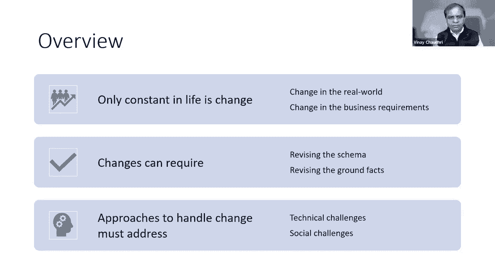

## 现实世界中的变更动机 🛒

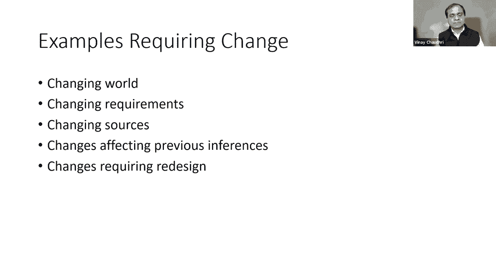

为了理解知识图谱为何需要演化，让我们看几个来自真实场景的例子。

### 示例一：亚马逊产品图谱
在亚马逊的产品图谱中，世界在不断变化：
*   新产品和新产品类别不断涌现。
*   制造商为产品引入新功能。
*   部分产品会停产。

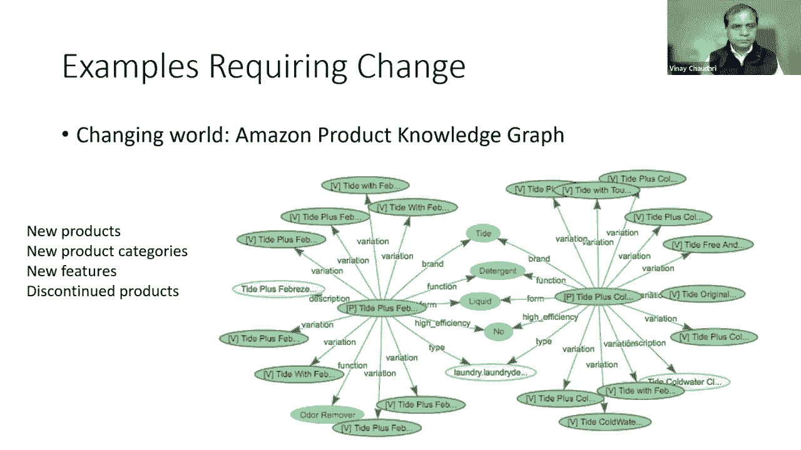

当这些变化发生时，知识图谱必须与之一同更新，以保持同步。

### 示例二：谷歌知识图谱的约束变化
在谷歌知识图谱中，曾有一个限制：**艺术家必须是人**。然而，随着数据源中出现新的示例，如“声码器（一个计算机程序）是某首歌的艺术家”，这个限制就需要被修改。为了接纳这些第三方数据，图谱的约束必须更新，甚至允许计算机程序成为艺术家。

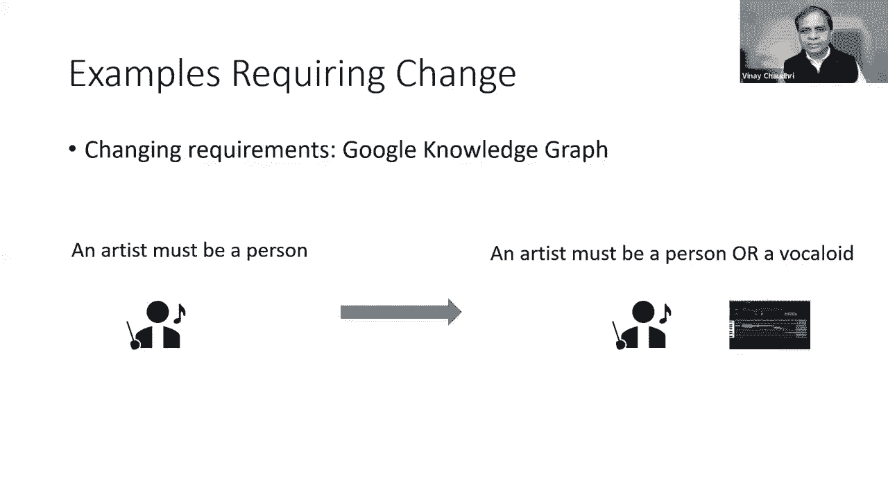

### 示例三：信息融合与推论失效
有时，知识图谱需要融合来自多个来源的信息。例如，确定一张专辑的所有艺术家名单可能需要整合不同数据源。当这些源数据发生变化时，整合数据的程序也必须随之调整。

此外，基于图谱属性所做的推论也可能失效。例如，如果图谱中有“电影院只放映电影”的约束，但现实中某个电影院开始放映歌剧，那么所有基于旧约束缓存的信息都需要被重新审视和修改。

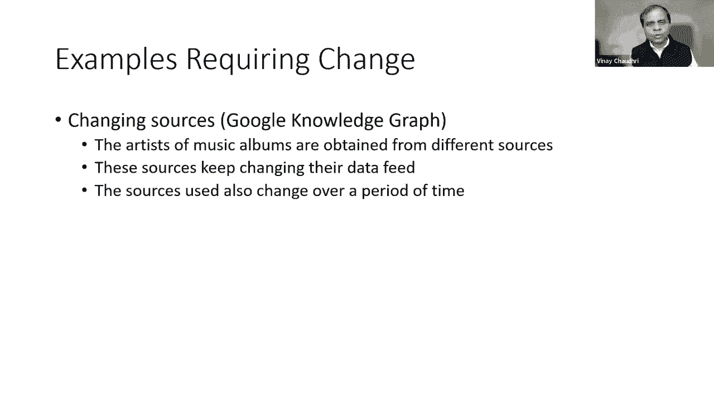

### 示例四：模式本身的变更
有时，图谱的模式本身也需要改变。例如，最初可能将公司的`CEO`定义为一个简单的属性（如`ceoName`）。后来，为了记录更丰富的信息（如任期起止日期），可能需要将`CEO`升级为一个独立的对象类型。这种模式变更后，所有遵循旧模式存储的数据也需要相应更新。

---

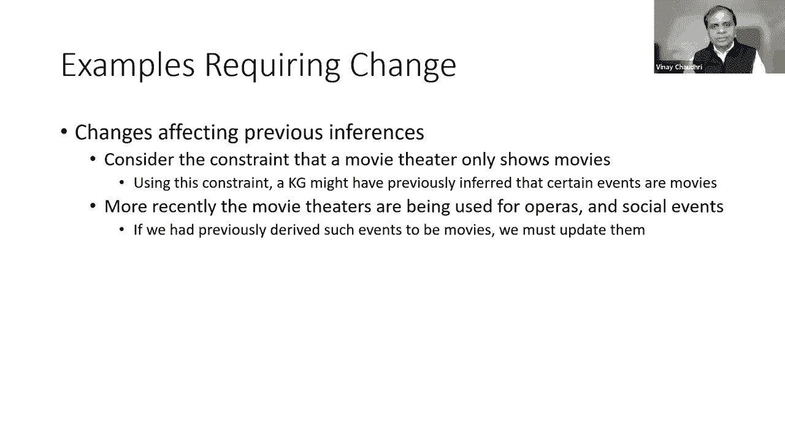

## 知识图谱变更管理技术 🛠️

面对上述变化，我们需要系统性的技术来管理知识图谱的演化。这些技术主要可分为三类：

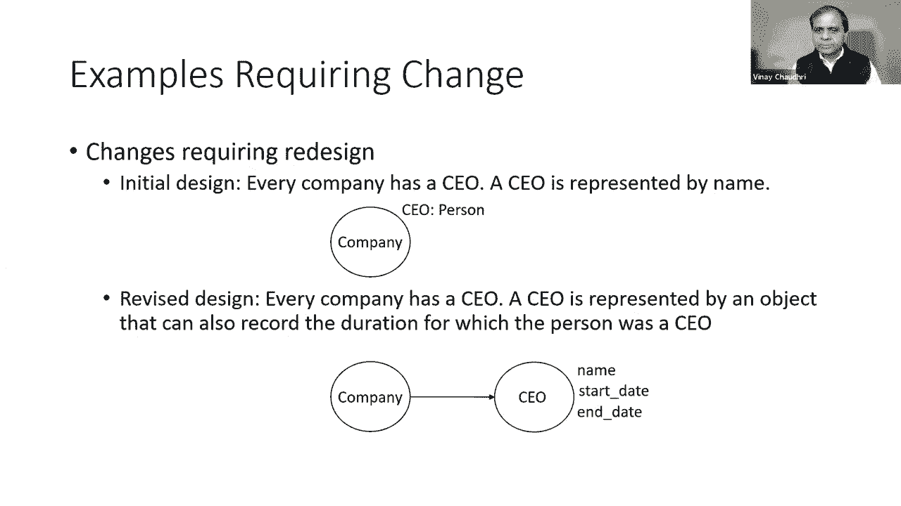

### 1. 模式进化 (Schema Evolution)

在关系数据库中，类似的操作被称为“数据库重组”，例如添加/删除列或重命名属性。在知识图谱中，模式变更可能更复杂，包括：
*   添加或删除类（Class）
*   添加或移除超类（Superclass）
*   添加或删除属性（Property）
*   添加或删除约束（Constraint）

模式进化技术的核心原则是**维持系统的不变量**（Invariants），即确保图谱在变更后仍保持某些关键特性。以下是一些常见变更的处理方式：

**以下是处理类层次结构变更的几种情况：**

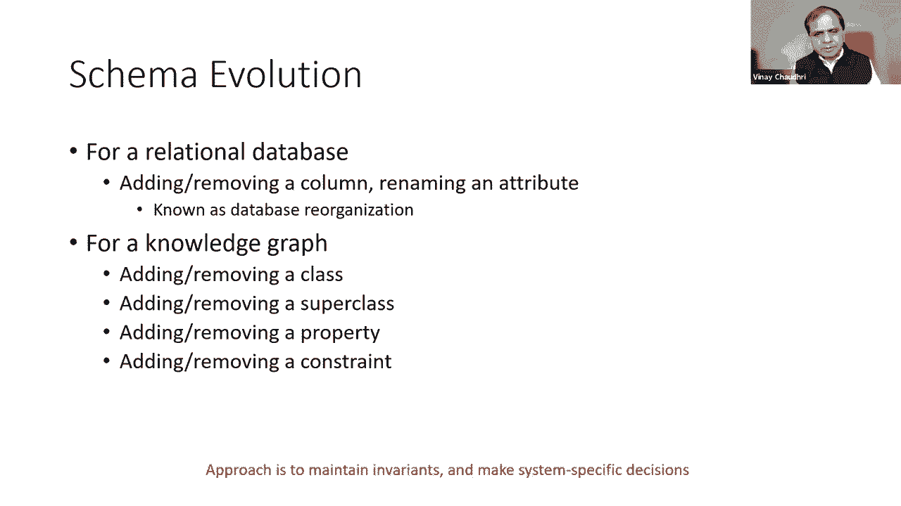

*   **添加新类**：如果不指定其位置，一个常见的做法是将其作为系统预定义根类的子类，以保持层次结构的连通性。
*   **删除类**：情况更为复杂。假设要删除类`B`，其直接子类是`C`。
    *   **情况A**：如果`C`还有其他超类`D`，那么删除`B`后，`C`仍然是`D`的子类，结构保持完整。
    *   **情况B**：如果`C`只有`B`这一个超类，删除`B`会使`C`成为“孤儿”。此时，系统可能需要强制将`C`提升为根类的子类，或者（在更极端但较少见的情况下）连同`C`一起删除。
*   **添加冗余的超类链接**：例如，已知`C`是`B`的子类，`B`是`A`的子类。如果用户试图直接添加`C`是`A`的子类，就会产生冗余（因为通过`B`可以推断出此关系）。不同系统对此处理方式不同：有的会禁止这种冗余链接，有的则允许。
*   **处理循环**：类层次结构必须是一个有向无环图（DAG）。大多数系统会直接拒绝任何可能引入循环的变更操作。

### 2. 视图维护 (View Maintenance)

在数据库系统中，视图（View）是对一个查询的命名。如果我们将查询结果存储下来，就得到了物化视图（Materialized View）。当基础数据发生变化时，物化视图也需要更新。

这一概念完全适用于知识图谱。许多知识图谱是通过从多个数据源提取并整合信息而构建的，这本质上就是创建了一个覆盖所有源的统一视图。当任何一个底层数据源发生变化时，都必须更新这个合成后的知识图谱视图。

虽然可以通过完全重新计算来更新视图，但当数据量非常庞大时，增量式的视图维护技术（即只更新受影响的部分）则更为高效。这正是我们下一节要深入探讨的内容。

### 3. 真相维护 (Truth Maintenance)

真相维护（TMS）是一种源自基于规则系统的技术。它跟踪每一个新结论是如何通过特定的事实和推理规则得出的，并记录下这种依赖关系（称为“理由”）。

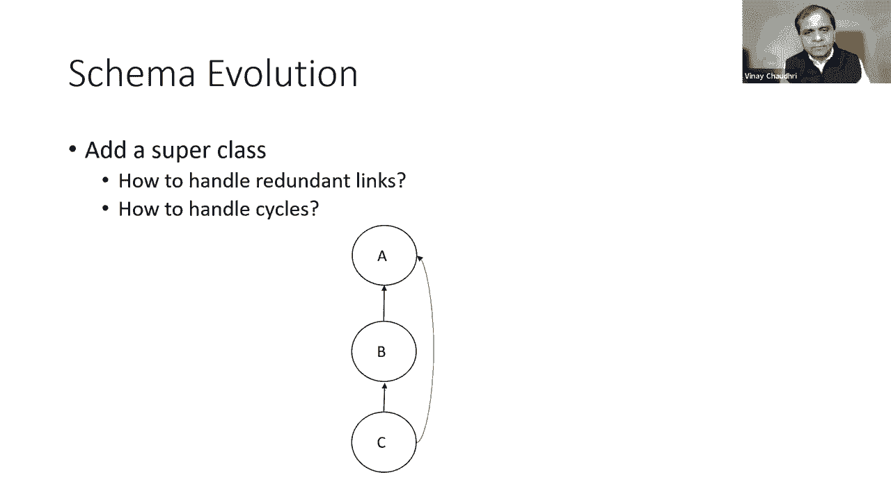

在知识图谱的上下文中，这意味着系统会记录每个衍生事实或关系的推导路径。当底层的事实或规则发生任何变化时，系统可以利用这个“理由”网络，高效地找出哪些衍生结论会因此失效或需要重新计算，从而实现精确的增量更新。

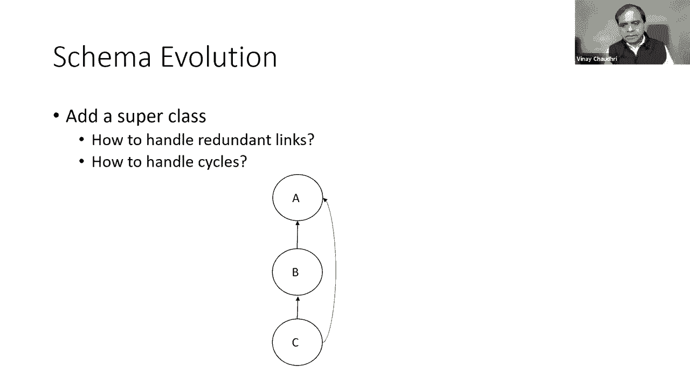

尽管在知识图谱领域讨论相对较少，但真相维护为处理复杂的逻辑依赖和推理结果的更新提供了强大的理论基础。

---

## 总结 📝

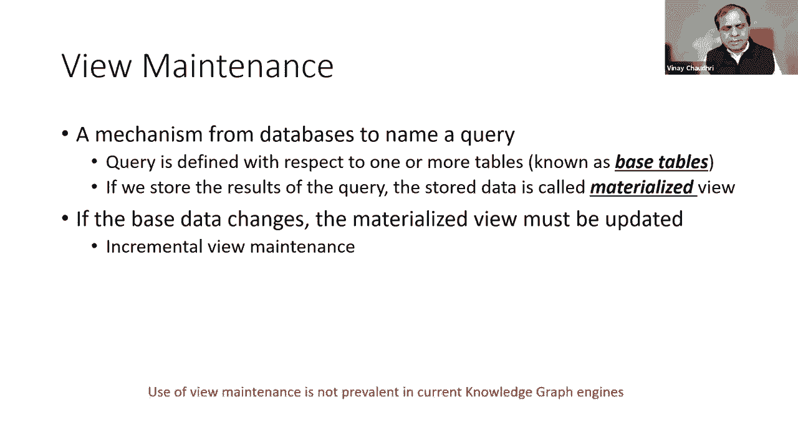

本节课我们一起学习了知识图谱演化的必要性和核心管理技术。

我们首先了解到，由于现实世界和业务需求的持续变化，知识图谱必须不断更新。这种更新可能涉及模式（Schema）的变更，也可能涉及具体事实（Facts）的更新。

接着，我们介绍了三种关键的变更管理技术：
1.  **模式进化**：处理类、属性、约束等模式层面的变更，核心是维持系统不变量。
2.  **视图维护**：当知识图谱作为从多源数据整合而成的视图时，需要在其底层数据变化时进行高效更新。
3.  **真相维护**：通过记录结论的推导依赖关系，实现当事实或规则变化时，对衍生结论的精准、增量式更新。

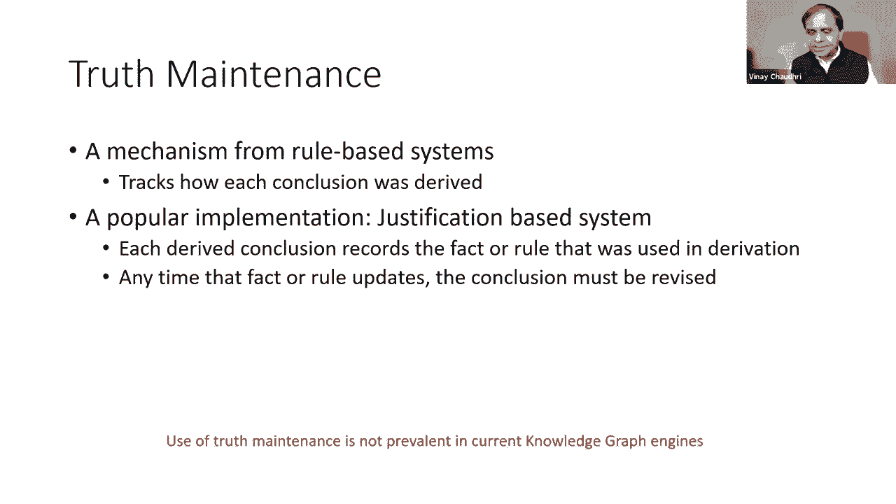

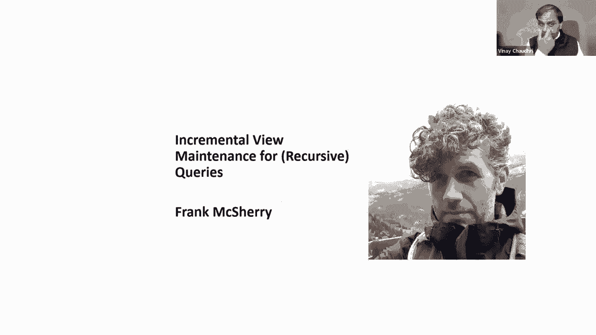

掌握这些技术，对于构建和维护一个健壮、可扩展的知识图谱系统至关重要。在接下来的部分中，弗兰克·麦克雪里将为我们详细讲解**增量式视图维护**的具体方法与实践。