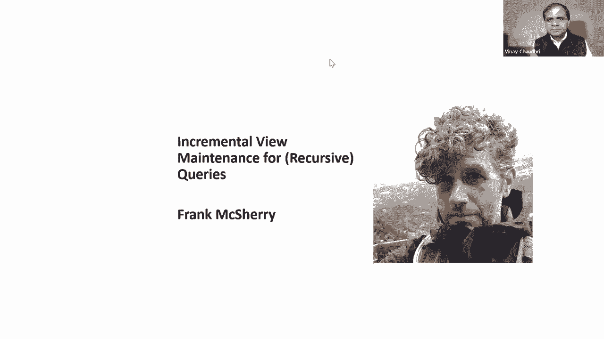
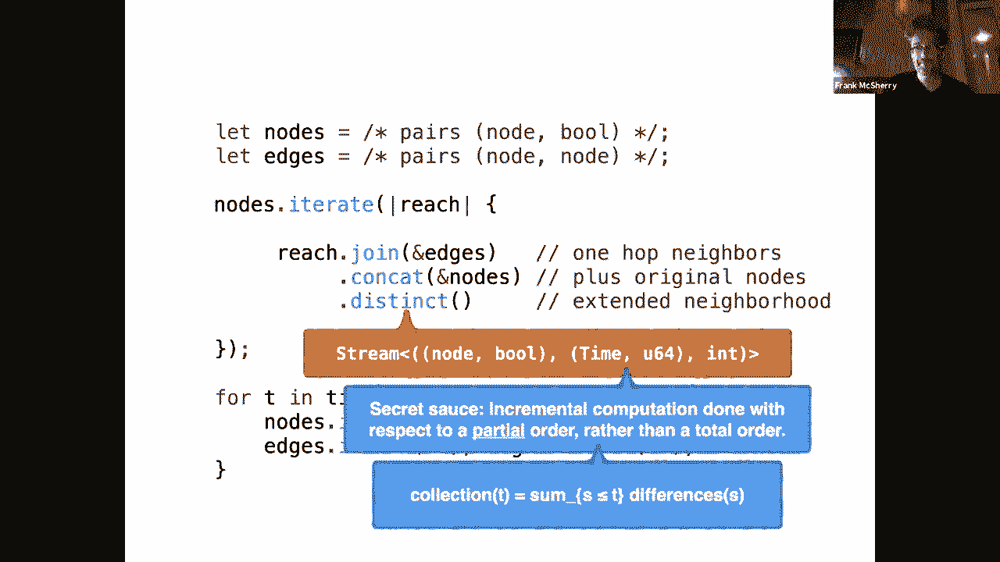
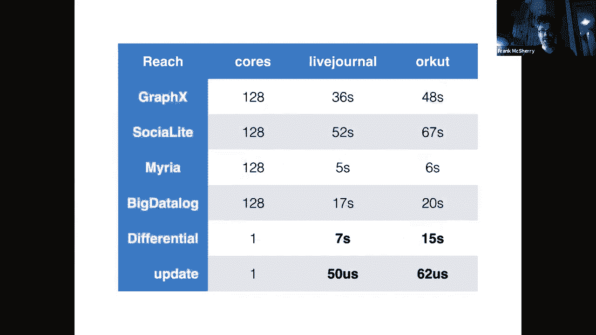
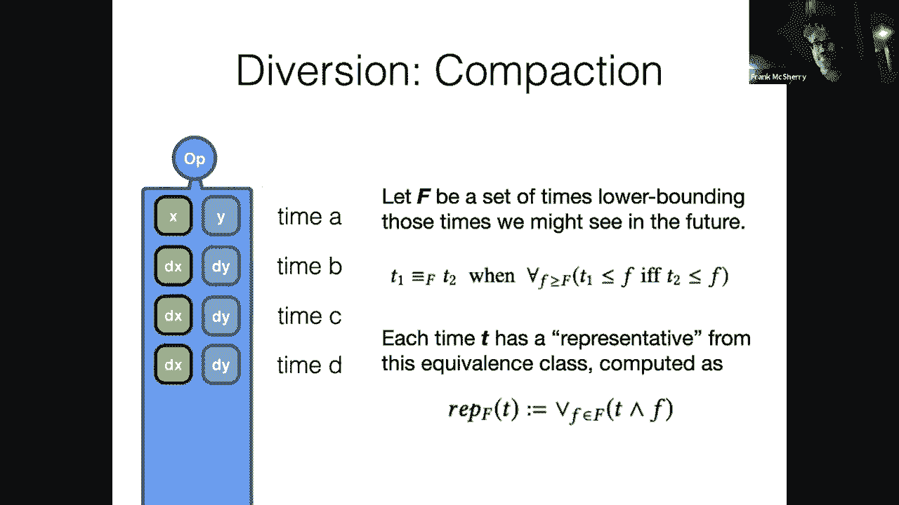
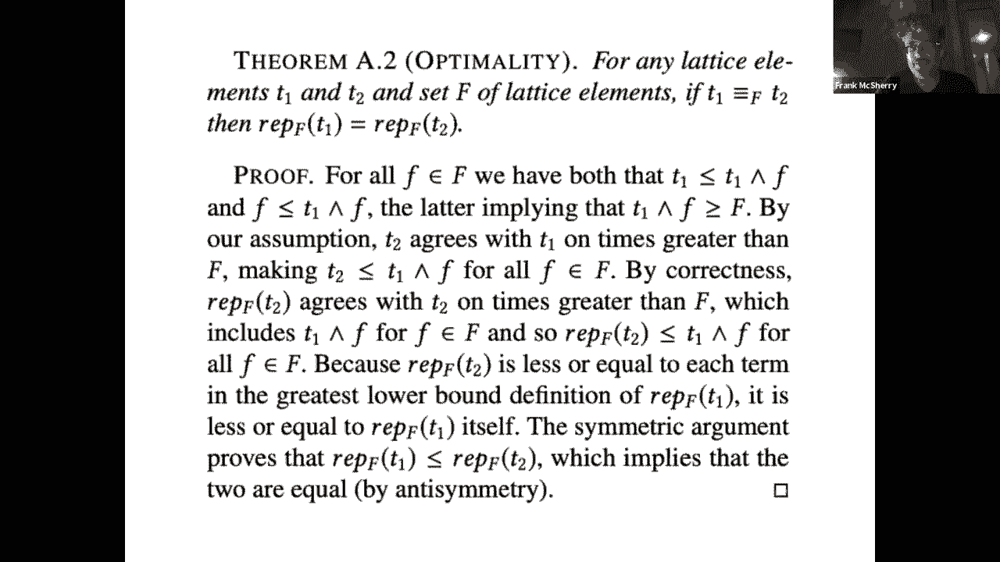
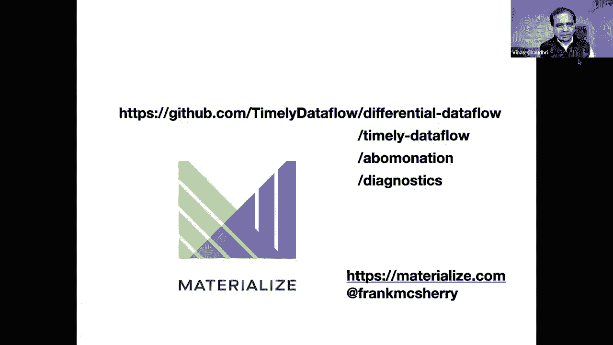

# 27：L16.2 - 针对递归查询的增量视图维护 📚 



## 概述
在本节课中，我们将要学习**增量视图维护**技术，特别是在处理**递归查询**（如图形遍历）时，如何高效地更新计算结果，而无需在每次数据变化时都重新进行完整的计算。我们将通过一个名为**差分数据流**的编程框架来理解其核心思想和工作原理。

---

## 1. 动机：实时更新的挑战
上一节我们介绍了知识图谱和图形计算。本节中我们来看看一个具体的挑战：如何实时更新复杂的图形查询结果。

想象一个社交网络场景，数据不断变化（如用户发布新推文、关注关系改变）。我们想持续追踪“通过社交关系图连通分量传播的最热门标签”。传统方法需要定期重新运行整个查询，这在数据量大或更新频繁时效率极低。增量视图维护的目标就是：**当输入数据发生微小变化时，只计算输出结果中相应的变化部分**。

---

## 2. 增量视图维护的核心抽象
增量视图维护系统旨在为用户提供这样的体验：**编写针对静态数据集的查询程序，而由系统自动、高效地处理数据变化后的视图更新**。

系统的输入和输出不再是完整的数据快照，而是**数据变化的流**。每次变化用一个三元组描述：
*   **数据**：具体的事实内容（例如，一条边 `(A, B)`）。
*   **时间**：变化发生的逻辑时间。
*   **差异**：变化的性质，通常用整数表示，如 `+1` 表示添加，`-1` 表示删除。

**公式表示**：
`collection(t) = Σ_{t' ≤ t} (data, t', diff)`



系统会接收输入变化流，运行用户定义的查询逻辑，并产生一个对应的**输出变化流**，而不是每次都输出完整的结果集。

---



## 3. 差分数据流框架简介
差分数据流是一个用于**描述数据计算并增量维护其结果**的编程框架。它特别擅长处理包含**迭代**（递归）的查询。

以下是该框架中的一些核心运算符：
*   **连接**：将两个数据集合中相关联的条目匹配起来。
*   **去重**：确保集合中元素的唯一性。
*   **迭代**：重复应用某个操作，直到达到稳定状态（例如，图的遍历）。

通过将这些基础运算符组合，可以构建复杂的查询。

**代码示例**（概念性伪代码）：
```rust
// 定义变化的输入集合
let nodes: Collection<(Node, Time, Diff)> = ...;
let edges: Collection<(Edge, Time, Diff)> = ...;

// 查询：从起始节点集出发，沿着边进行一步可达性查询
let one_step = nodes.join(edges).distinct();

// 查询：通过迭代，计算从起始节点集出发的传递闭包（所有可达节点）
let reachable = nodes.iterate(|reach| {
    reach.join(edges).distinct()
});
```

---

## 4. 实现原理：从数据流图到增量计算
为了实现增量更新，程序被编译成一个**有向数据流图**。图中的节点是运算符（连接、去重等），边是数据流动的路径。

当输入变化（三元组）流入这个数据流图时，每个运算符都需要能够：
1.  根据输入变化，计算出正确的输出变化。
2.  维护必要的内部状态（例如，连接运算符需要缓存之前的输入以便快速匹配）。

关键在于，许多运算符的工作可以**按数据键进行分区并行处理**。这意味着，当只有部分数据发生变化时，系统只需更新受影响的分区，而不必处理全部数据。





---

## 5. 处理迭代计算的挑战与解决方案
对于包含迭代（递归）的计算，简单的增量更新策略会失效。例如，在计算连通分量时，如果删除了一条关键边，简单的“只添加新事实”的推导无法自动收回已推导出的、但现在无效的事实。

差分数据流的解决方案是引入**多维时间**。传统增量计算只沿一个时间维度（逻辑时间）推进。对于迭代计算，我们将时间扩展为 `(逻辑时间, 迭代轮次)` 的二维偏序。

**核心洞察**：当输入在某个逻辑时间发生变化时，我们不仅计算它对当前迭代轮次的影响，还精确计算它对未来所有迭代轮次的“涟漪效应”。通过在这个二维网格上进行类似“积分”的操作，系统可以精确地推导出每次变化在所有迭代轮次中应产生的输出变化，从而正确且高效地维护迭代查询的结果。

---

## 6. 性能与总结
本节课中我们一起学习了增量视图维护，特别是针对递归查询的差分数据流方法。

**总结其优势**：
*   **效率**：处理时间与**数据变化量**成正比，而非与总数据量成正比。对于变化稀疏的大数据集，优势明显。
*   **实时性**：能够以毫秒级延迟响应数据变化。
*   **表达能力**：能优雅地处理包含迭代、递归的复杂图形查询。
*   **简化编程**：开发者只需关注静态数据上的查询逻辑。



这项技术对于构建需要实时响应的知识图谱应用、社交网络分析、欺诈检测系统等具有重要价值。它改变了我们处理动态数据的方式，从“定期批量重算”转向了“持续流式更新”。