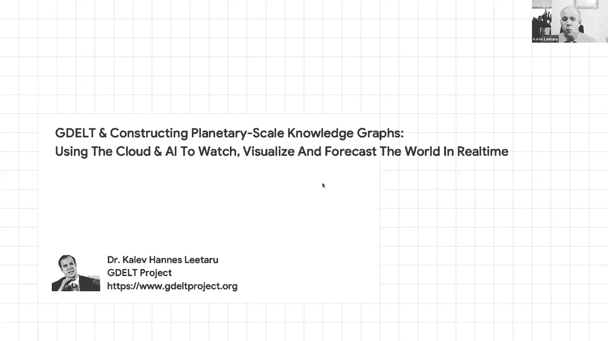

# 28：L17.1 - 知识图谱工业实践应用 🧠

在本节课中，我们将学习知识图谱在工业界的实际应用。我们将从产品和技术两个视角，探讨知识图谱如何构建、如何解决大规模问题，以及在实际应用中需要考虑的关键因素。

***

## 知识图谱的愿景与背景 📚

上一节我们介绍了课程概述，本节中我们来看看知识图谱的愿景与背景。

大多数研究和产品工作的起点，是希望建立一个能够捕捉人类所有知识的存储库。其核心原则是：如果人类已经学到了某些知识，我们就不必重新学习，而应将其编码、共享、讨论和查询。这类似于建立一个结构化的“亚历山大图书馆”。

知识图谱旨在以机器可读的形式表示知识，并支持大规模推理。它与非结构化的万维网形成对比：结构化知识更离散、约束更强，而非结构化文本则更连续、依赖上下文。结构化知识通常更客观、更通用。

***

## 知识图谱的产品视角 🎯

上一节我们了解了知识图谱的愿景，本节中我们来看看其产品视角。

从产品角度看，知识图谱能创造连接不同知识领域的流畅用户体验。例如，在搜索引擎中，用户查询“本周末圣何塞有什么活动”，系统可以展示结构化的活动列表（如Lady Gaga演唱会），并允许用户进一步探索相关电影、歌曲、场馆或附近餐馆。

这表明，知识图谱通过编码实体间的连接，能够支持跨领域的探索和连贯的用户旅程。这种体验不仅限于搜索，还能扩展到地图、媒体播放器等多种设备与界面。例如，通过图像识别技术，拍摄一座建筑或电影海报，系统能利用知识图谱识别实体并提供相关信息。

***

## 核心产品功能与构建模块 ⚙️

上一节我们看到了知识图谱如何提升用户体验，本节中我们来剖析其核心功能与构建模块。

以下是知识图谱支持的几个关键子功能：

*   **信息聚合与摘要**：针对一个实体（如电影《肖申克的救赎》），聚合来自不同来源的信息（演员、剧照、预告片、放映地点、评论），生成一个摘要视图。
*   **问答与交互**：通过语音或文本界面进行自然语言问答。例如：“《肖申克的救赎》中谁扮演了安迪？”或“海岸线餐厅几点开门？”。这需要将自然语言查询映射到知识图谱中的结构化表示。
*   **探索与推荐**：基于图谱中的结构化关系，发现相关或相似的内容。例如，从一部电影推荐同导演或同类型的其他电影，从一家餐厅推荐相似的菜系或其他夫妻店。

要实现这些功能，需要以下关键技术构建模块：

*   **查询理解**：将用户的自然语言查询（如“给我看看《星际穿越》里的歌”）翻译成结构化的表示。这可以视为一个**编码器-解码器**的翻译问题，模型学习将不同的表面形式（不同电影名、不同语言）映射到相同的规范理解表示。
    ```python
    # 概念性代码：将自然语言查询映射到结构化表示
    structured_representation = model.encode("给我看看《星际穿越》里的歌")
    # 输出可能类似于: (意图: 查询歌曲, 实体: 电影《星际穿越》, 关系: 包含)
    ```
*   **用户兴趣建模**：根据用户活动，构建其兴趣的低维向量表示。例如，用户可能对`[《绝命毒师》, 金州勇士队, 某政治家]`等实体感兴趣。通过命名实体识别从用户活动中提取实体，并将其投射到知识图谱的分类体系中，可以进行分层理解和基于图谱的协同过滤推荐。
*   **上下文理解**：区分用户对同一实体的不同兴趣上下文。例如，两个用户都查询“迈阿密”，但一个关注投资新闻，另一个关注本地市场和外卖服务。结合文本理解和知识图谱，可以捕捉这种细微差别。

***

## 大规模构建的挑战与策略 🌐

上一节我们探讨了核心技术与功能，本节中我们来看看如何应对大规模构建的挑战。

工业级知识图谱涉及巨大规模。例如，可能包含数亿实体和数千亿关系。数据来源多样，包括：
*   购买或聚合的数据源
*   网页中通过Schema.org等模式标记的结构化数据
*   从非结构化文本和表格中提取的信息
*   人工整理的数据

以下是几种关键的知识获取与构建策略：

*   **利用模式标记**：网站使用标准化的模式（如`JobPosting`）在HTML中嵌入结构化数据，便于机器直接读取。
*   **信息提取**：从非结构化内容（如维基百科表格）中提取结构化知识，涉及命名实体识别和关系抽取。
*   **多源融合与协调**：将来自不同来源的知识整合到一个统一的规范视图中。这个过程称为“协调”，需要解决模式差异和实体链接问题。

在实际操作中，还需考虑以下因素：

*   **人工整理的价值**：并非所有过程都能完全自动化。数据标注、模式映射、质量评估和纠错都需要人工参与。
*   **政策与本地化**：知识并非总是普适的。例如，不同地区对争议领土的地图显示有不同政策。产品必须遵守当地法规，支持知识的变体。
*   **处理破坏与错误**：需要制定策略来处理从网上提取信息时可能遇到的错误或恶意破坏内容。

***


## 总结 📝





本节课中，我们一起学习了知识图谱在工业界的实践应用。我们从其构建人类知识库的愿景出发，探讨了如何通过连接实体来创造跨领域的优质产品体验。我们分析了信息聚合、智能问答和探索推荐等核心功能，并深入了解了查询理解、用户建模等关键技术模块。最后，我们审视了构建大规模知识图谱面临的挑战，包括数据来源的多样性、多源融合的复杂性，以及人工整理、政策合规等实际考量。知识图谱是连接非结构化数据与智能应用的关键桥梁，其构建是一项融合了技术、产品和运营的综合性工程。