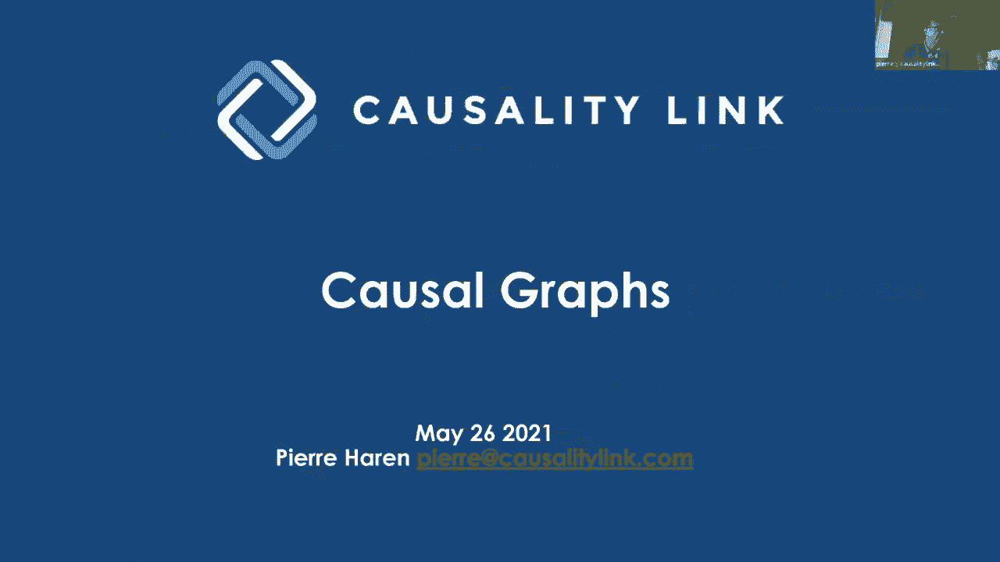
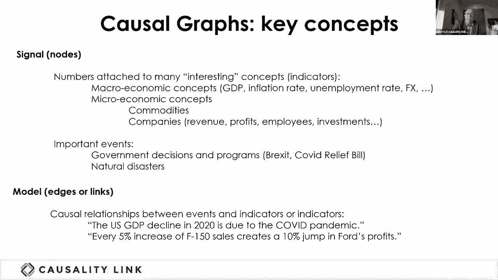
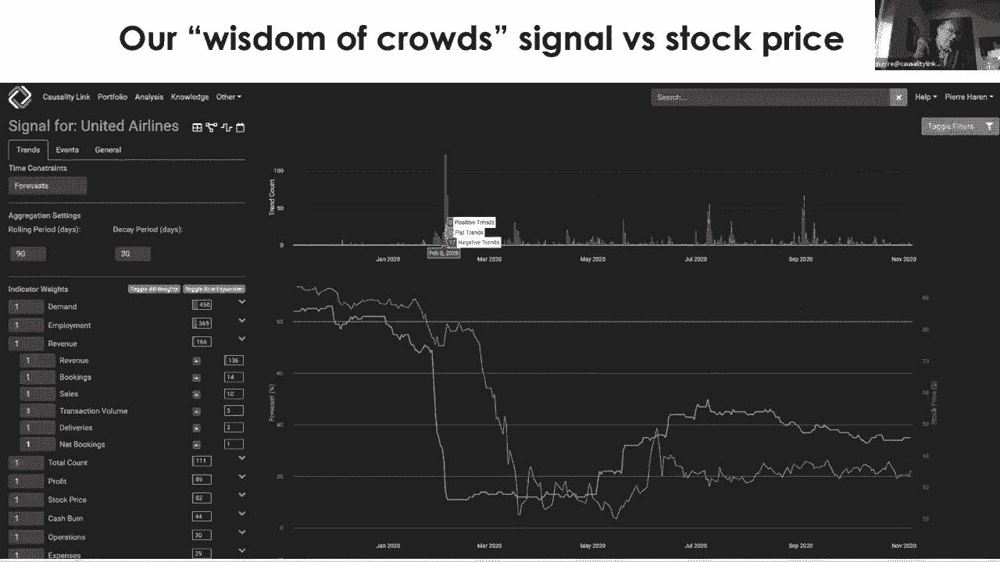
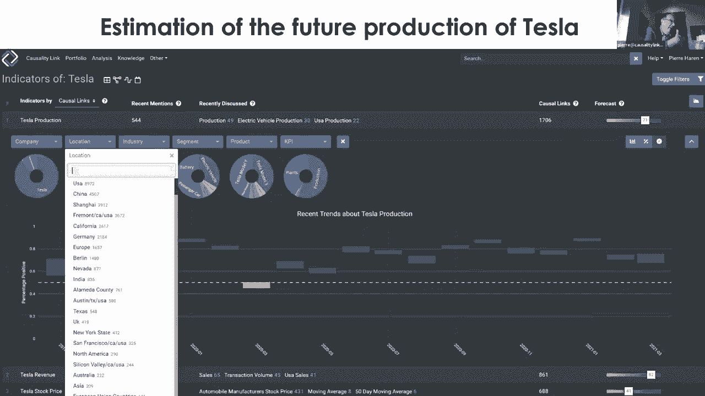
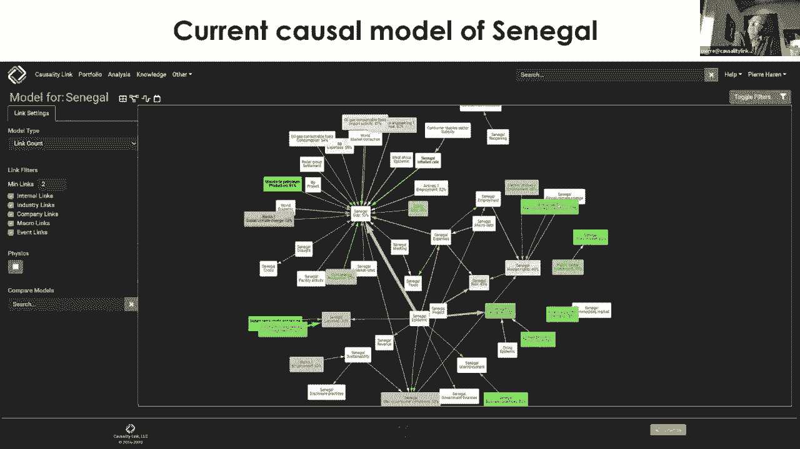
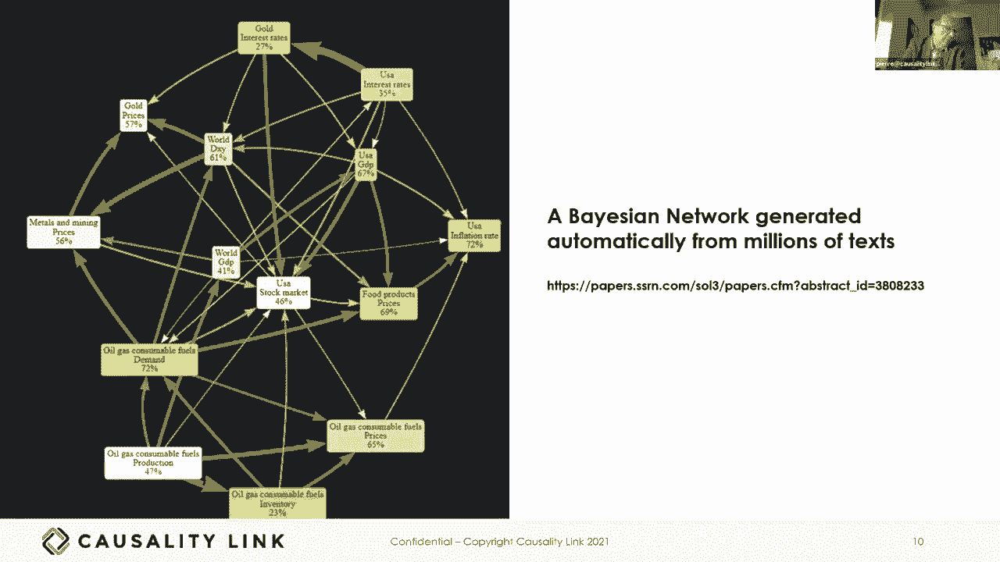
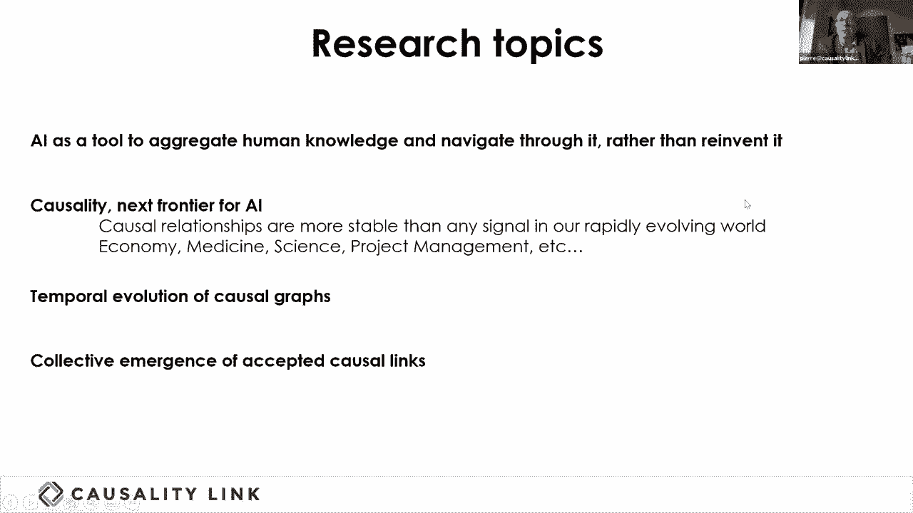

# 30：L18.1 - 因果图 📊 

在本节课中，我们将学习一种特殊类型的知识图谱——**因果图**。我们将探讨其核心概念、构建方式以及在金融等领域的实际应用。通过本节课，您将理解如何从文本中自动构建因果图，并利用它进行推理和预测。

---

## 🎯 概述：什么是因果图？

上一节我们介绍了知识图谱的基本概念，本节中我们来看看一种专注于表示因果关系的新型知识图谱——**因果图**。

因果图是一种特殊的知识图谱，其核心在于表示事物之间的**因果关系**，而不仅仅是关联关系。它由**信号节点**和**因果边**构成，旨在对现实世界中的驱动因素和结果进行建模。

---

## 📈 因果图的核心构成

因果图可以清晰地分为两个核心概念：**信号**和**因果边**。

### 信号

信号是因果图中的节点，代表附有数值的**时间序列数据**。例如：
*   不同国家的GDP
*   通货膨胀率
*   外汇汇率
*   公司收入、需求、市场情绪等参数

这些节点的定义必须非常精确。例如，“特斯拉的收入”是一个节点，而“特斯拉Model 3车型在中国的收入”是另一个更具体的节点。这种精确性是为了支持后续的**聚合推理**。

### 因果边

因果图中的边比传统知识图谱中的边更简单，它通常只带有单一的推理标签，表示**驱动信号对目标信号的弹性影响**。

例如：
*   “美国GDP在2020年因新冠疫情而下降” 可以转化为一条边：`新冠疫情 -> (负面影响) -> 美国GDP`
*   “销售额每增加5%，利润就会增加10%” 这条边中的弹性系数（2倍）可能来自一个财务分析模型。

这些陈述需要自然语言处理系统来理解并提取其中的因果关系和影响强度。

---

## 🔗 因果图的构建与聚合

因果图可以从大规模文本中自动构建。以下是构建过程中的一个关键能力：

**跨维度聚合** 是因果图中的基本推理要素。通过对节点进行聚合，我们可以从分散的数据中获得更高层次的洞察。

例如：
*   可以聚合**所有电动汽车在中国市场的销量**。
*   可以聚合**特斯拉在全球的所有车型收入**。
*   可以聚合**影响航空公司需求的所有负面言论**。

这种聚合能力使得我们能够将成千上万条分散的因果关系陈述，整合成具有预测性的合成信号。

---

## 💡 因果图的应用实例

通过实际案例，我们可以更好地理解因果图的价值。

**案例一：航空公司需求预测**
我们为联合航空公司构建了一个因果图模型。其中，蓝色合成信号（聚合了就业、收入、预订量等子组件）在股市下跌前一个月就显示出下降趋势。而驱动该信号的红色元素（来自新闻文本的负面趋势陈述）则精准地对应了疫情初期边境关闭等事件。这展示了因果图在**领先指标预测**方面的潜力。

**案例二：公司动态分析**
以电动汽车公司NIO为例，其因果图显示：
*   `NIO收入 -> (积极影响) -> NIO股价`
*   `芯片短缺 -> (消极影响) -> NIO生产`
通过分析作用于不同节点的所有因果力量，我们可以理解公司股价波动的背后动因，并判断哪些力量的影响最大。

**案例三：国家宏观经济建模**
我们同样可以为国家构建因果图。例如，塞内加尔的GDP受到疫情（消极影响）、人权状况（积极影响）等多重因素的共同作用。这提供了一个前所未有的、能够刻画所有作用于国家不同参数的因果力模型。

---

## 🧠 从因果图到贝叶斯网络

因果图可以进一步转化为**贝叶斯网络**，这是一种纯数学工具，可用于模拟和概率分布传播。

然而，金融领域的因果关系常存在**双向影响**（如油价影响需求，需求也影响油价），这会形成环，不符合贝叶斯网络必须是**有向无环图**的要求。因此，需要从因果图中选择**最强的一环**来生成DAG。

我们通过与专家合作，实现了从大规模因果知识图谱中**全自动生成贝叶斯网络**，这通常是一项需要多名专家数日协作才能完成的任务。

---

## 🚀 未来展望与总结

因果图代表了人工智能发展的几个重要趋势：

1.  **集体智慧**：AI不应仅从数据中学习，还应致力于聚合和利用散落在全球文本中的人类知识，使其变得可解释、可访问。
2.  **因果推理的稳定性**：因果关系（如供需关系）比具体信号（如油价）变化更慢、更稳定，这使得因果模型具有更长的生命周期和参考价值。
3.  **动态演化**：理解因果图本身随时间的演变（哪些力量被激活，哪些新关系出现）是一个迷人的课题。
4.  **真相的集体裁决**：如何集体判定一个因果关系的真伪（是深刻洞见还是阴谋论）将是AI未来需要帮助人类解决的重要问题。

本节课中我们一起学习了**因果图**的定义、构成要素（信号与边）、关键能力（聚合）、实际应用以及其向贝叶斯网络的转化。因果图作为一种强大的知识表示和推理工具，正在金融分析、宏观经济建模等领域展现出巨大潜力，并指向了AI未来发展的一个重要方向——利用集体智慧构建可解释的因果模型。