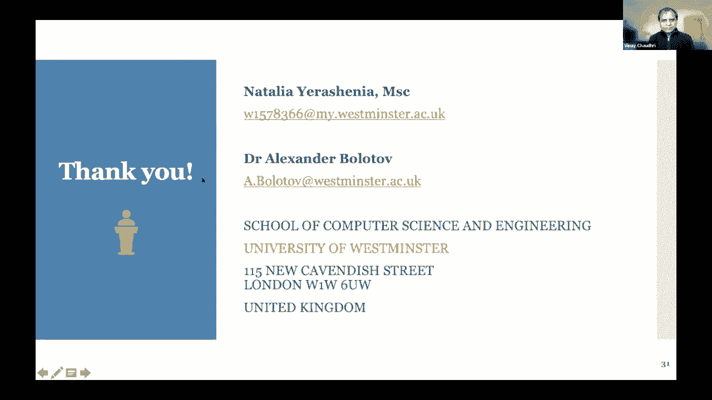

# 31：L18.2 - 金融数据预测计算建模：应用本体作为金融数据预处理工具 📊

在本节课中，我们将学习一个结合了本体、图数据库和机器学习引擎的通用计算模型，用于金融数据预测。我们将通过一个具体的破产预测用例，来理解如何利用本体对金融数据进行结构化预处理，并通过反馈循环优化机器学习模型。

---

## 概述

我们的目标是构建一个通用的预测计算模型。该模型的核心思想是：**利用本体对原始金融数据进行语义化建模和结构化，将其导入图数据库，然后提取特征来训练机器学习模型。模型的输出（如特征权重）会反馈回图数据库，通过迭代优化预测性能。**

上一节我们介绍了通用模型的理念，本节中我们来看看如何将其应用于具体的金融预测场景。

---

## 通用方法架构 🏗️

该方法涉及几个核心部分，其核心是**本体**。

你可能听说过很多关于知识图谱的内容。本体是图谱的一部分，它非常强调我们所说的**等级关系**。人们常将本体与知识图谱进行比较：本体提供了领域的结构化概念模型，而知识图谱则是基于此模型的具体实例化数据集。

我们遵循这种方法：首先创建与给定领域相关的本体，然后基于此本体构建具体实现的知识图谱（以图数据库形式）。为什么需要图数据库？因为我们需要一个能够进行计算的引擎。

基于此，我们将能够构建一种类型的本体。整个过程分为三步。

一旦完成，我们就有了通用的构造。我们可以用图数据库进行“游戏”。游戏的本质是：我们管理着用选定特征喂养整个机器学习模型的场景。机器学习模型将与任务和数据类型相关。

今天我们将给出一个用例，它依赖于专门的处理。我们目前正在处理的另一个用例是关于时间序列的，因此会使用不同的引擎。但总的来说，在这个阶段，整个想法是：我们称之为模型的第一种RAM，我们用选定的特征填充模型并训练它。

现在关键环节来了：一旦训练结束，我们查看这个过程的输出，并以某种方式将其反馈给图数据。然后我们切换嵌入式设施（嵌入式引擎本身）。我们希望确保机器学习的结果是有意义的。

这些结果是什么？我们希望那些作为机器学习引擎输入的特征，现在会带有调整后的权重。这套新的、带有调整权重的特征集将被反馈到图形数据库。我们会让内部引擎再运行一次，与图形数据库一起提出一组新的特征，并调整权重，然后再反馈给模型运行一次。

你可以看到，我们预计模型会在某种意义、某种感觉上，经过几次运行后达到理想状态。因为每次运行的输入都是通过反馈循环机制进行的。

---

## 本体开发与形式化定义 📐

有各种各样的本体开发方法。这里我们采用一种偏形式和逻辑的方法。

本体的形式化定义是：一个**标记图**。标记图是具有结构的正规概念的图，有顶点和边。我们使用语言来标记节点。

我们以一种简单的方式操作：使用两个通用参数——**价值**和**重量**。如果价值和重量是重要的或相关的，它们就工作；如果它们不重要或不相关，我们就把它们设为零。否则，它们将从给定的数据集中获取。这将指导我们如何构建有针对性的本体。

实际上，我们分阶段进行：
1.  首先导出本体模板图。
2.  然后移动到中间结构，即带有值但没有权重的图。
3.  最后我们用权重填充它，得到目标图。

这就是拥有形式化定义的本体的想法。

---

## 反馈循环与大数据考量 🔄

现在，我们想推进所有这些结构和移动反馈循环。整个想法是：我们使用图数据库来提取一组特征（当然，最初由专家裁定）。一旦完成，等待调整权重的输出。这些调整后的权重被反馈到图形数据库，我们在这里启用“洗牌”功能。

我们看看那些在整个场景中真正扮演重要角色的特征，它们可能会变得更加重要。非正式地说，那些不重要的特征，会被次要考虑。这就是机器学习的反馈循环。

我们确实关注数据。数据往往具有“大数据”的特征：大量、高速、多样。在金融领域，数据量可能不是最重要的，但**关系的正确性**至关重要，因为财务数据包含许多复杂关系。

在构建本体的过程中，我们像上楼梯一样，对领域的概念层面进行越来越专门的分析。从受控词汇表的定义开始，到结构化词汇，到单一层次结构，也许是多重层次结构，最终我们想得到一些被称为“按需类的组合构造”的东西，这涉及描述逻辑等高级分析。

为什么需要这么多？因为本体使我们能够建立知识的实现，以知识图的形式在图数据库中具体化。

---

## 图数据库与机器学习引擎集成 🤖

如果你查看图数据库的构造，它会有几个步骤，从将数据从专用格式（从本体）传输到图形数据库开始。这里真正核心的是：提供来自本体（图谱结构）和外部来源的真实数据的过程。

一旦我们到达那里，我们就能够推进到机器学习引擎。记住，这里说的是通用方法。

以下是机器学习引擎的通用框架思路：
*   **输入**：来自图数据库的特征。
*   **过程**：经过训练周期。
*   **输出**：生成特征权重。
*   **反馈**：权重以反馈循环的形式回到图形数据库。

图数据库的输出，就是学习引擎的输入。然后我们进行第二次循环。因此，这种方法具有通用性。

---

## 破产预测用例详解 🏦

现在，我们使用这个通用模型来创建一个具体的用例：**破产预测模型**。

我们用于测试的财务数据来自四家中型私营公司的财务记录，从Fame数据库中获取。我们知道这些公司的财务状况：其中一些破产了，一些没有，有些财务状况稳定。我们将这些公司分为两组。

以下是关于我们用于此用例的本体的详细信息：
*   **基础**：基于英国和国际立法，是一套与破产预测和一般财务分析相关的概念。
*   **灵感**：受到FIBO（金融业商业本体）的启发，但我们的本体更专注于财务分析标准，可以作为FIBO的扩展。
*   **开发工具**：使用Protégé环境开发。
*   **结构**：主要类别是财务报表要素和财务比率。我们定义了等级关系（子类关系）。
*   **关系类型**：定义了两种类型的关系，将财务比率与财务报表要素连接起来。
*   **属性**：例如，财务比率包含规范值等附加属性。

为了在此用例中使用本体，我们实际上简化了本体并将其一分为二：
1.  一个简单的本体分类法：财务报表要素的分类法。
2.  公司财务比率的分类法。

我们将这些本体保存为RDF/OWL文件。在此用例中，我们有两个独立的OWL文件，其中一个包含了关于公司特定比率的选集。

我们使用两种类型的数据文件：
*   **训练数据**：一个包含45家英国公司财务比率的CSV文件，以及一个包含这45家公司破产状态（破产级别）的单独文件。
*   **测试数据**：从特定公司的传统数据库中获得的原始数据CSV文件，以及机器学习引擎的实际输入/输出文件。

---

## 图数据库构建过程 🗃️

我们将这些本体（OWL文件）转移到Neo4j环境中来构建图数据库。我们不需要从头开始构建骨架。

1.  **传输与连接**：传送这些OWL文件，并在两个OWL文件之间建立无层次的连接（因为我们有分类法）。
2.  **匹配与填充**：现在我们有一个没有标签的空图。我们需要获取特定公司的输入数据。我们使用来自传统数据库的CSV文件（包含资产负债表、现金流量表、损益表数据）。首先，需要匹配图中节点的标签与CSV文件的列标题，以便后续模块知道特定数据的位置。
3.  **计算与填充**：下一步是为特定节点填充值，这些值从CSV文件中获取。我们需要计算公司财务记录中没有列出的比率。Cypher查询语言允许使用内置数学函数进行计算。
4.  **保存**：对于机器学习组件，我们将图形保存为CSV文件。在第一次迭代后，图不仅填充了节点组件的值，还有权重。这些CSV文件保存在Neo4j环境中。

---

## 机器学习引擎与反馈 ⚙️

在这个特定的用例中，作为机器学习引擎，我们使用具有误差反向传播的经典神经网络。这对于此类数据是理想的，因为它产生0或1的结果（0表示公司稳定，1表示公司破产风险高）。

我们的机器学习引擎产生在此特定迭代中使用的特征的权重。我们把包含权重的CSV文件转移回图数据库。这样，图数据库保留了上一次迭代的记录和特征的基础，这有助于提高下一次迭代的效率。这些权重将用于特征选择，从而减少噪声数据。

我开发了通用模块以及破产预测模型。这个特殊的计算模型具有通用性：任何本体、任何图形数据库和任何机器学习引擎都可以作为这种特殊架构的组成部分。

---

## 总结

本节课中，我们一起学习了一个用于金融数据预测的通用计算建模方法。该方法的核心是利用**本体**对领域知识进行形式化建模，通过**图数据库**实现知识的实例化和计算，并集成**机器学习引擎**进行预测。关键的创新在于建立了**反馈循环**，将机器学习输出的特征权重反馈至图数据库，用于优化下一次迭代的特征选择，从而提升模型性能。

我们通过一个具体的**破产预测用例**，详细演示了从本体构建、图数据库填充、特征提取、模型训练到反馈优化的完整流程。这种方法强调数据的语义结构化和迭代优化，为处理复杂的、关系密集的金融数据提供了一种有前景的解决方案。