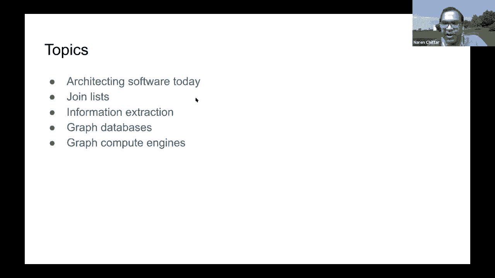

# 32：L19.1 - 构建知识图谱的开源工具调研 🛠️

## 概述

在本节课中，我们将要学习构建知识图谱时可以使用的一系列开源工具。我们将从数据连接与提取开始，到图数据库存储，再到图计算引擎，为您提供一个全面的工具概览，帮助您了解如何启动一个知识图谱项目。

---

## 现代软件架构理念

上一节我们介绍了课程的整体目标，本节中我们来看看现代软件架构与传统有何不同。

今天的软件架构非常不同，其核心是关于代码的重用，而非从头开始编写。对于知识图谱这种高度处理的结构化数据，通常需要经过多个步骤：您需要连接多个数据源，有时连接列表，有时从非结构化文本（如网页、新闻文章）中提取信息。在处理大量数据后，您将其存储在图形数据库或检索系统中。此外，还有一类软件或图形计算引擎，非常适合进行大规模图计算。

总体策略是将一个高层次问题分解为更小的部分，然后将每个子组件映射到现有的软件包上。您需要了解如何配置并将这些部分粘合在一起。由于开源软件包选项众多，您需要根据流行度、社区支持等指标做出明智的决定。

---

## 数据连接：从列表合并开始

构建知识图谱时，一个非常常见的任务是合并来自不同来源的列表。例如，我们希望全面了解“苹果公司”，需要从不同来源获取或创建列表，然后匹配这些列表。问题在于，通常没有完美的键来连接这些列表（例如“Apple”和“Apple Computer”可能指代同一实体）。当您加入更多信息（如地址）时，匹配的信心才会增加。

以下是处理此类记录链接任务的开源工具：

*   **Dedupe**：这是一个原生的Python包，提供了非常好的编程访问接口。您首先用数据类型（如文本、短文本、日期时间，以及更语义化的类型如价格、地址）定义所有列。它提供了多种模糊匹配选项，您甚至可以定义自己的数据类型和匹配算法。该包内置了多种匹配技术（如考虑地球曲率的Haversine距离用于地址匹配），并支持阻塞技术。如果您有正负样本，它还能学习逻辑分类器，并可通过主动学习模块加速学习过程。
*   **规则与词典**：在某些情况下，机器学习并非最佳选择，编写规则或使用预建词典可能更简单。例如，人名匹配可以使用一个全面的西方名字昵称词典。对于拼写差异大的名字，可以使用Soundex或Metaphone等算法的实现，将名字转换为语音表示进行匹配。

---

## 信息提取：从非结构化文本到图谱

世界上大部分信息以非结构化文本形式存在，如新闻文章、报告、电子邮件等。从文本中提取信息并转化为知识图谱是一项挑战。

以下是处理非结构化文本信息提取的工具：

*   **spaCy**：这是一个为构建现实世界软件而优化的NLP软件包。它提供了许多预构建的模型（如词性标注、命名实体识别），您也可以为特定领域（如生物医学、法律）创建自己的定制模型。它包含一个名为**Prodigy**的UI工具，可以快速构建和迭代模型，并包含主动学习组件，能优先选择模型不确定的示例进行标注，从而加速学习过程。
*   **实体链接**：spaCy包含一个实体链接框架，但它本身不链接到具体数据库。有第三方项目（如`spacy-entity-linker`）创建了链接到Wikidata的链接器，可以开箱即用。
*   **依赖解析与关系提取**：spaCy提供了依赖解析功能，能将句子解析为带标签的有向图结构。这为提取“主语-谓语-宾语”三元组提供了基础。社区中有基于spaCy依赖解析进行三元组提取的项目。
*   **spaCy projects**：这是一个用于知识提取的端到端spaCy管道集合，包含从非结构化文本到构建图谱（如Wikigraph）的所有组件，是一个很好的参考应用。

---

## 图数据库：存储知识图谱

在完成数据清洗、提取和处理后，您需要将知识图谱存储在专门的图数据库中。图数据库类似于SQL数据库，但更侧重于在线事务处理。

选择图数据库时，需要考虑多个维度：是否支持分布式、是否支持ACID事务、查询语言是什么、是否有管理服务、定价、生态系统和社区支持等。

以下是两个图数据库的例子：

*   **Neo4j**：这是非常流行的图数据库。它采用属性图模型，支持水平扩展，具有访问控制功能，是Cypher查询语言的主要推动者之一。它提供社区版（开源）和企业版，支持多种编程语言的驱动程序，并拥有一个用户界面。
*   **Amazon Neptune**：这是一个云托管的图数据库服务。它支持属性图和RDF图模型，提供Gremlin和SPARQL查询接口，支持ACID事务、持续备份到Amazon S3、跨区域自动复制以及静态和传输中加密。AWS还基于Neptune设计了针对身份图谱、个性化推荐和欺诈检测等常见用例的解决方案模板。

---

## 图计算引擎：进行大规模图分析

图计算引擎与图数据库略有不同，主要用于对图进行繁重的计算分析，例如PageRank或社区检测。

以下是两个图计算引擎的例子：

*   **NetworkX**：这是一个非常流行的Python包。它在内存中操作，提供了一个Python接口（无查询语言），非常灵活。您可以将任何Python对象作为节点和边。它包含了极其丰富的图算法库。对于适合单机内存的数据集，这是一个绝佳选择。有人曾用NetworkX对小说《悲惨世界》的角色共现矩阵进行社区检测，并使用D3.js库实现了精彩的可视化动画，展示了社区发现和矩阵重排序的过程。
*   **Apache Spark GraphX**：如果您的数据集非常大，无法放入单机内存，则需要像Apache Spark这样的分布式计算引擎。Spark的GraphX模块非常适合创建图应用程序。它定义了许多图操作符（如属性操作符、结构操作符），并提供了并行化、高效的算法实现（如PageRank）。不过，其内置的图算法数量远少于NetworkX。如果您的图规模巨大，可能就需要依赖此类工具。

---

## 总结

本节课中，我们一起学习了构建知识图谱的现代软件架构思路，并快速浏览了各个环节的关键开源工具：

1.  **数据连接**：我们介绍了如何使用**Dedupe**等工具进行列表的模糊匹配与连接。
2.  **信息提取**：我们探讨了如何使用**spaCy**及其生态系统从非结构化文本中提取实体、关系和三元组。
3.  **图数据库**：我们了解了**Neo4j**和**Amazon Neptune**等图数据库，它们用于高效存储和查询知识图谱。
4.  **图计算引擎**：我们介绍了**NetworkX**（适用于单机内存计算）和**Apache Spark GraphX**（适用于分布式大规模图计算），它们用于在图谱上进行复杂的分析运算。

这是一次旋风式的工具之旅，涵盖了构建知识图谱的典型步骤。希望这次调研能帮助您在实际项目中做出合适的技术选型。

---

## 问答环节精选

**问：如何提取公司间的关系（例如“Cirrus Logic是苹果的供应商”）？该用Dedupe、spaCy、实体链接还是Wikidata？**

答：这更像是一个关系提取问题，而不是链接问题。您需要从新闻、公司文件等来源寻找陈述此关系的证据。可以运行spaCy进行关系提取，并结合多份文档的证据来增强置信度。Dedupe或实体链接可能用于前期处理，但核心是关系提取。spacy提供了构建块（如依赖解析），但没有关系提取的交钥匙解决方案，通常需要在自己的数据集上训练模型。

**问：能否将AWS Neptune、NetworkX和GraphX结合使用，构建端到端系统？是否有现成模板？**

答：可以。这些工具都提供编程API（如REST API），可以相对容易地将它们集成在一起，构建一个复合系统。目前可能没有完全现成的端到端模板，需要自行集成。

**问：构建知识图谱最耗时、最令人沮丧的方面是什么？**

答：数据连接和信息提取过程非常耗时，且无法保证100%准确。如何建立反馈循环、让用户参与修正、处理数据噪声和规模问题，都是持续的挑战。此外，一些解决方案宣称全自动化，但实际上仍需要大量人工工作。

**问：图数据库与图计算引擎（OLTP vs OLAP）能否混用？**

答：图数据库（OLTP）针对读写事务进行了优化，确保数据一致性。图计算引擎（OLAP）针对复杂的只读分析查询进行了优化。虽然可以用OLTP系统进行OLAP分析，但性能可能不是最优。反之，在需要频繁更新的场景中使用OLAP系统也不合适。应根据主要工作负载选择。

**问：对于非专家，有什么好的工具集来构建知识图谱？**

答：这取决于“非专家”的具体背景和数据源。例如，一些数据连接工具提供了用户界面，非技术用户可以通过UI操作来合并列表。设计图谱模式可能需要一些专业知识，但也有可视化工具可以帮助。没有一套适合所有非专家的通用工具。

**问：是否有知识图谱构建的通用基准？**

答：大多数基准都是任务特定的，例如实体链接、关系提取等各有自己的数据集和基准。对于知识图上的推理性能，则有另一类基准。目前没有一个统一的、覆盖全流程的通用基准。