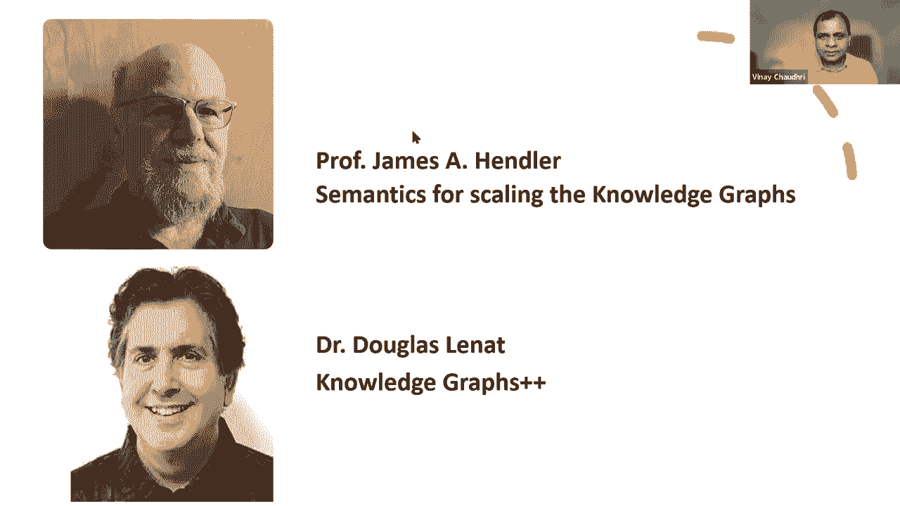

# 33：L19.2 - 从知识图谱到AI，两者如何关联 🧠➡️🔗


在本节课中，我们将探讨知识图谱与人工智能（AI）之间的双向关系，分析知识图谱如何作为AI的试验台，并展望图数据科学这一新兴领域。我们还将回顾知识表示在AI中的历史角色，并讨论当前构建大规模知识图谱的新方法。

---

## 概述

知识图谱与人工智能之间存在紧密且双向的关联。一方面，知识图谱能够显著提升许多AI应用的性能；另一方面，AI技术也被广泛用于构建和增强知识图谱。此外，海量数据的出现催生了“图数据科学”这一新学科。本节课将深入探讨这三个核心观点。

---

## 1. 知识图谱与AI的双向关系 🤝

上一节我们概述了课程的整体框架，本节中我们来看看知识图谱与AI之间具体的相互作用。这种关系是双向且互惠的。

*   **知识图谱赋能AI应用**：知识图谱为许多AI应用提供了结构化的背景知识，使其表现更佳。
    *   **智能助手**：如Alexa、Siri和Google Assistant都利用知识图谱来理解世界和用户查询，从而提供更准确的回答和更丰富的功能。
    *   **推荐系统**：例如亚马逊的产品知识图谱，通过理解商品间的复杂关系，能够实现更精准的商品推荐。
    *   **搜索引擎**：像维基数据这样的知识图谱可用于增强搜索结果的准确性和相关性。

*   **AI技术助力构建知识图谱**：AI算法是构建和维护知识图谱的关键工具。
    *   **实体链接与模式映射**：使用主动学习等AI技术来融合不同数据源中的实体。
    *   **信息抽取**：利用自然语言处理（NLP）和语言模型从非结构化文本中自动提取实体和关系。
    *   **数据质量与推理**：应用异常检测、推理和问答等AI技术来清理数据、发现新知识并更好地利用图谱。

这种“AI构建知识图谱，知识图谱增强AI”的循环，是现代数据驱动应用的核心特征。

---

## 2. 图数据科学的兴起 📈

在理解了双向关系后，我们来看看一个由此催生的新领域。现代组织拥有海量互联数据，渴望从中挖掘价值，这推动了“图数据科学”的出现。

图数据科学融合了三个关键领域的技能：
1.  **图分析**：应用机器学习算法在图结构上进行预测和分类。
2.  **特征工程**：需要领域知识和算法理解，以确定模型中应包含哪些图特征（节点、边、路径等属性）。
3.  **数据探索与可视化**：设计有效的用户体验，帮助用户在海量图数据中导航并发现洞察。

以下是其核心组成部分的示例：
```python
# 伪代码示例：使用图神经网络进行节点分类
import torch_geometric
model = GCN(in_channels, hidden_channels, out_channels)
# 模型利用图中的连接关系学习节点表示，用于分类等任务
```
虽然图算法、查询和可视化等技术已存在数十年，但与大规模数据、机器学习及用户体验设计的结合，构成了这个需求旺盛的新兴交叉学科。



---

## 3. 知识表示在AI中的演进与现状 🕰️

最后，我们将视角拉远，回顾知识在AI中的历史角色。知识图谱的核心理念——有向标签图——在AI早期就以“语义网络”的形式存在。

后续发展主要围绕为其添加更严格的语义：
*   **描述逻辑与规则**：为语义网络添加形式化逻辑，以支持可判定的推理。
*   **概率图模型**：如贝叶斯网络，用于处理现实世界中的不确定性。

然而，当前的知识图谱与早期工作相比，有三个显著差异：
1.  **规模**：现代知识图谱（如维基数据）包含数千万实体和数十亿关系，规模空前。
2.  **构建方式**：从早期的“自上而下”手工设计（知识工程），转向更多“自下而上”的数据驱动自动化构建（如使用NLP抽取）。
3.  **混合构建模式**：结合了手工建模、自动化学习和众包等多种方式。

这并不意味着小规模知识或自上而下的设计不再重要。许多需要深度推理的“小数据”智能任务依然至关重要。当前基于知识图谱的AI系统（如搜索、推荐）虽已非常有用，但距离能够进行高水平认知（如设计实验、提供深层解释）的“强AI”愿景仍有差距。

---

## 总结

本节课我们一起学习了知识图谱与人工智能的紧密关联。我们明确了二者间的双向促进关系，认识了由图数据驱动产生的“图数据科学”新领域，并回顾了知识表示从传统AI到现代大规模应用的演进。当前的知识图谱以其前所未有的规模、数据驱动的构建方式和混合方法，正在为许多现代AI应用提供强大支持，同时也面临着向更高层次认知能力迈进的挑战。

---
*课程内容基于 ShowMeAI 系列讲座 P33：L19.2 整理。*