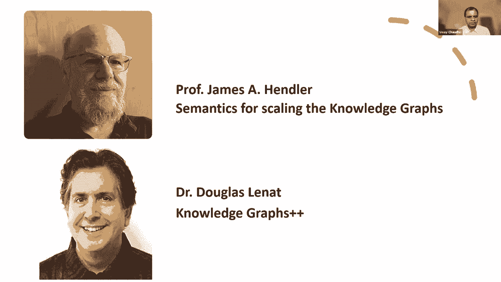
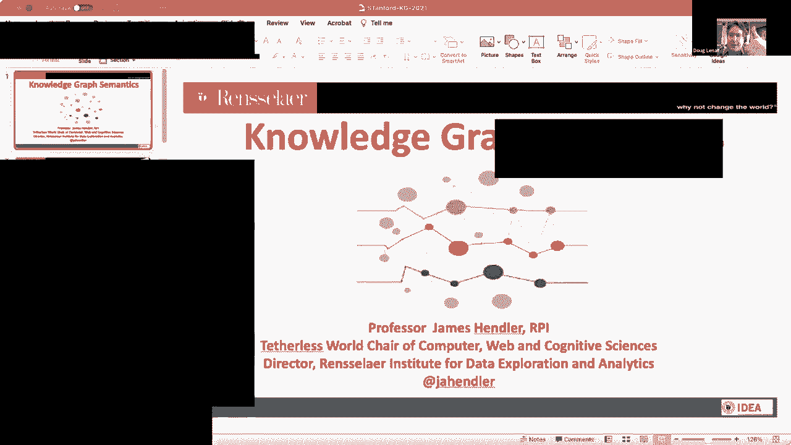
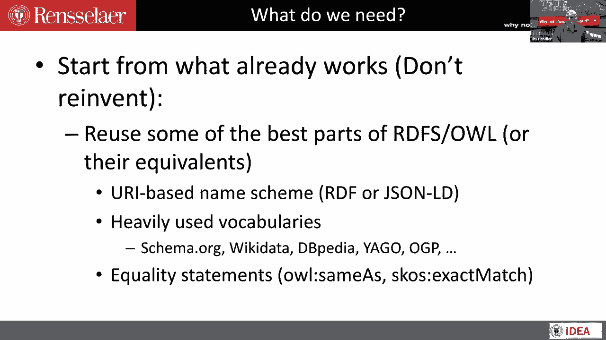
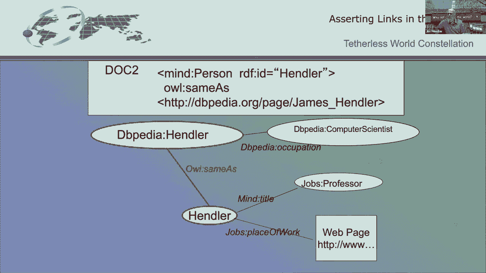
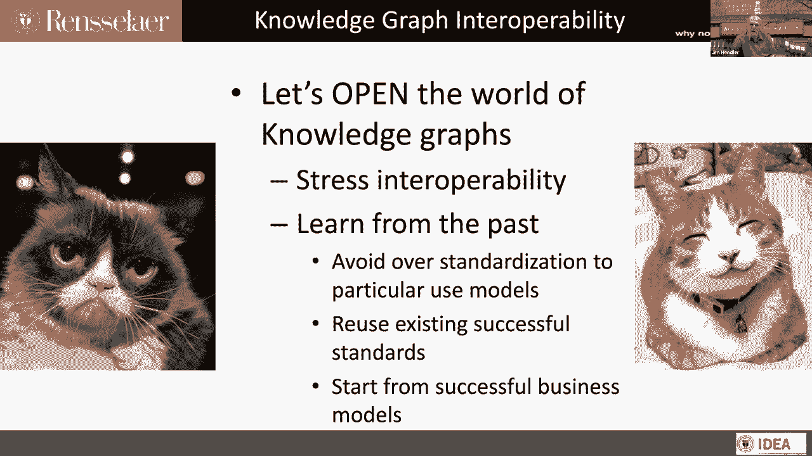

# 34：L20.1 - 用于扩展知识图谱的 Hendler 语义 🧠




在本节课中，我们将学习 Jim Hendler 教授关于知识图谱互操作性的核心观点。我们将探讨如何让不同的知识图谱协同工作，以及实现这一目标所需的关键技术与历史背景。

---


## 概述 📋




本次课程的核心是知识图谱的互操作性。我们将回顾语义网的发展历程，理解从数据网络到知识图谱的演变，并探讨如何利用现有标准和技术（如 RDF、OWL 和 URI）来实现不同知识图谱之间的连接与协作。

---

## 从语义网到知识图谱的演变

上一节我们介绍了课程的主题。本节中，我们来看看知识图谱概念的发展脉络。

早期的网络基于超链接连接文档。大约在 2000 年，随着网络增长，出现了许多孤立的搜索引擎和应用。当时，人们设想通过一个模型，让机器能够发现并处理网络内容，这就是语义网愿景的起源。

2001年，Tim Berners-Lee 等人发表文章，提出了一个全球数据空间的愿景，这可以说是现代知识图谱概念的雏形。其核心思想是通过推理事物间的联系来实现互操作性。

然而，网络数据的增长远超预期。大约在 2003 年至 2004 年，焦点从“语义网”转向了“数据网络”，即如何以机器可读的形式访问和链接网络上的数据库。随后，开放数据运动和关联数据（Linked Data）概念兴起，旨在将数据集以机器可读的方式描述并链接在一起，形成了“关联开放数据云”（LOD Cloud）。

深度学习在 2013-2014 年左右兴起，带来了强大的数据处理工具，但这些工具需要大量数据。知识图谱作为数据密集型应用，也随之发展。但此时，知识图谱往往在“孤岛”中构建，例如亚马逊知识图谱、谷歌知识图谱等，它们之间的互操作性成为一个关键挑战。

因此，我们当前的阶段可以看作是“网络上的知识图谱”，重点是如何让这些图谱协同工作。

---

## 实现互操作性的关键技术

上一节我们回顾了发展历程，本节中我们来看看实现知识图谱互操作性需要哪些具体技术。

起点是重用我们已经掌握的技术，而不是重新发明轮子。RDF（资源描述框架）和 OWL（Web 本体语言）中的优秀部分仍然是基础。

### 基于 URI 的命名方案

RDF 的一个关键优势是提供了基于 URI（统一资源标识符）的命名方案。这至关重要，但它的重要性有时被忽视。

在传统网络中，一个 URI 指向另一个 Web 资源（如网页、文档）。在 RDF 模型中，一个 URI 通过另一个 URI（作为谓词）指向目标 URI。这为链接赋予了无限的可能性和明确的含义。



**核心机制**：
```
<主体URI> <谓词URI> <客体URI>
```
例如：`<http://example.com/PersonA> <http://schema.org/worksFor> <http://example.com/CompanyX>`

这种机制的好处是可解引用性。你可以跟随这些 URI，访问它们指向的系统，查看具体信息。如果我们有共同的语法和简单的语义，就能将不同来源的信息连接起来。

### 词汇表重用与本体映射

为了实现互操作，我们需要重用广泛使用的词汇表（如 Schema.org）。OWL 的一个重要功能是声明等价性（例如 `owl:sameAs`），这可以将不同来源中指向同一实体的 URI 关联起来。

例如，DBpedia 中的一个实体可以和 Wikidata 中的对应实体通过 `owl:sameAs` 关联，从而将不同知识图谱的数据整合在一起。

### 处理外部数据与过程



一个我们过去忽视的重要方面是“程序性附件”。知识图谱需要能够与外部数据库和计算过程对话。这意味着能够执行查询、运行特定过程来获取或生成数据。虽然历史上因专利等问题曾被搁置，但这种能力对于构建实用的、可互操作的知识图谱系统是必需的。

### 当前模型的对比：RDF 与属性图

属性图模型在企业中应用广泛，有其优势（例如更容易处理时间模型、不确定性）。但其主要缺点在于互操作性：它通常不提供基于 Web 的简单解引用能力，也不鼓励使用指向外部资源的全局标识符（如 URI）。因此，在构建开放、可互操作的知识图谱生态时，需要融合不同模型的优点。

---

## 构建可互操作的知识图谱：方法与案例

以下是构建可互操作知识图谱的几个关键方法与思路：

*   **从成功的实践开始**：例如 Schema.org，它虽然从严格的语义学角度看并不完美，但已被数十亿网页使用，为谷歌知识图谱等提供了海量的标记数据，在实践中证明了简单语义的巨大价值。
*   **强调连接大小图谱**：将大型通用知识图谱（如 Wikidata）与特定领域知识图谱（如医疗健康图谱）或个人知识图谱连接起来，能创造巨大价值。例如，在医疗领域，结合临床记录、基因信息和个人健康设备数据，可以构建个性化的健康知识图谱，同时通过互操作性协议保障隐私。
*   **解决缺失环节**：除了数据，还需要在知识图谱中融入对时间、不确定性、隐私和安全控制的考虑，这些都是实现深度互操作和实际应用的必要条件。

---

## 总结与展望 🎯

本节课我们一起学习了 Jim Hendler 教授对知识图谱互操作性的深刻见解。

我们回顾了从语义网、关联数据到现代知识图谱的发展路径，认识到互操作性是释放知识图谱潜力的关键。我们探讨了实现互操作性的核心技术，包括基于 URI 的全局命名、词汇表重用、本体映射以及处理外部数据的能力。最后，我们了解了构建开放、可互操作知识图谱生态的实用方法和挑战。



核心在于，我们需要借鉴历史经验，避免过度标准化，积极重用现有标准（如 RDF、OWL），并从已经成功的商业模式和技术实践中学习，推动知识图谱从封闭的“孤岛”走向开放的、协同的全球数据空间。

---
*课程内容基于 Jim Hendler 教授的演讲整理。*